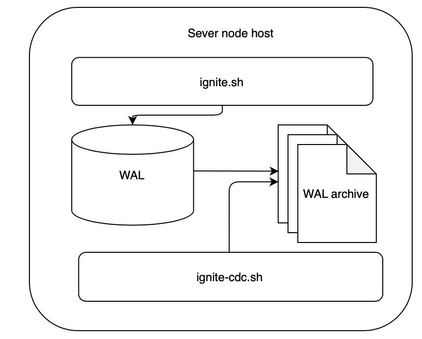
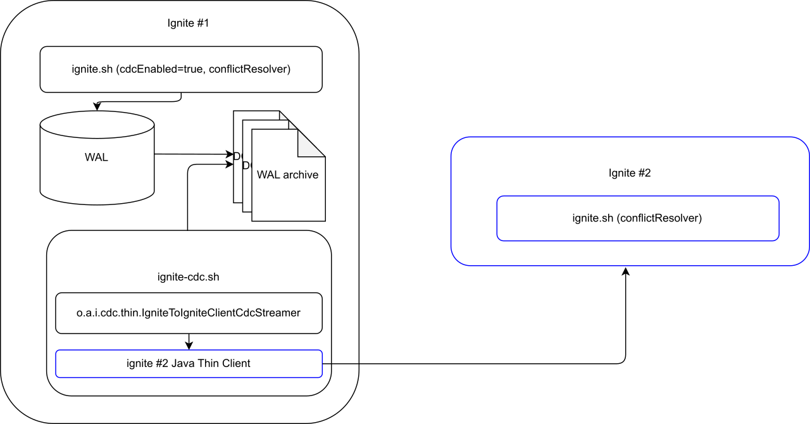
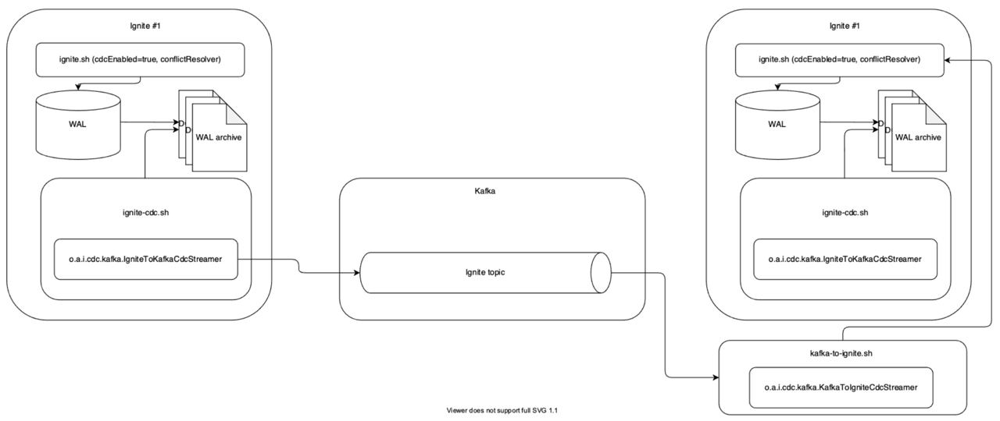

# Сценарии администрирования

## Введение

Руководство предназначено для администраторов безопасности (роль `⁣SECURITY_ADMIN`) или администраторов эксплуатации (роль `MAINTENANCE_ADMIN`).

## Первичная настройка кластера DataGrid

### Пример создания и настройки кластера DataGrid

В данном примере демонстрируются создание и настройка кластера DataGrid, состоящего из двух узлов:

-   для демонстрации будет использоваться клиентский узел;
-   на серверных узлах будет включен режим persistence (данные в кешах не будут потеряны при отключении и повторном включении узлов);
-   для обнаружения узлов в примере будет использоваться механизм Static IP Discovery.

:::{admonition} Примечание
:class: note

В данном руководстве конфигурационный файл сервера называется `serverExampleConfig.xml`, но он может иметь любое имя по желанию пользователя.
:::

Используемая в примере конфигурация (XML) указывается в конфигурационном файле `$IGNITE_HOME/config/serverExampleConfig.xml`.

:::{code-block} xml
:caption: XML
<bean class="org.apache.ignite.configuration.IgniteConfiguration">
  <!-- Включение Apache Ignite Persistent Store. -->
  <property name="dataStorageConfiguration">
    <bean class="org.apache.ignite.configuration.DataStorageConfiguration">
      <property name="defaultDataRegionConfiguration">
        <bean class="org.apache.ignite.configuration.DataRegionConfiguration">
          <property name="persistenceEnabled" value="true"/>
        </bean>
      </property>
    </bean>
  </property>
  <property name="consistentId" value="myIgniteNode01"/>
  <property name="cacheConfiguration">
  <list>
    <bean class="org.apache.ignite.configuration.CacheConfiguration">
      <!-- Настройка имени кеша. -->
      <property name="name" value="myReplicatedCache"/>
      <!-- Настройка режима работы кеша. -->
      <property name="cacheMode" value="REPLICATED"/>
      <!-- Другие параметры конфигурации кеша. -->
    </bean>
    </list>
  </property>

  <property name="discoverySpi">
    <bean class="org.apache.ignite.spi.discovery.tcp.TcpDiscoverySpi">
      <property name="ipFinder">
        <bean class="org.apache.ignite.spi.discovery.tcp.ipfinder.vm.TcpDiscoveryVmIpFinder">
          <property name="addresses">
            <list>
              <!--
                   Явное указание адреса локального узла для его запуска и нормальной работы, даже если больше узлов в кластере нет. Опционально можно указать собственный порт или диапазон портов.
              -->
              <value>IP OF NODE01</value>
              <value>IP OF NODE02</value>
            </list>
          </property>
        </bean>
      </property>
    </bean>
  </property>
</bean>
:::

Для создания кластера из двух узлов:

1.  Распакуйте ZIP-архив с бинарными файлами и поместите XML-файл конфигурации `serverExampleConfig.xml` с заранее заданными IP-адресами ваших серверов в папку `$IGNITE_HOME/config/`.
2.  Экспортируйте конфигурацию кластера при помощи команды:

    ```bash
    export JVM_OPTS="-DIGNITE_CLUSTER_TYPE=prom -DIGNITE_CLUSTER_NAME=mycluster"
    ```

3.  Запустите DataGrid с помощью команды:

    ```bash
    ./bin/ignite.sh config/serverExampleConfig.xml
    ```

    :::{admonition} Примечание
    :class: note

    Если не указать конфигурационный файл при запуске, то будет использоваться конфигурационный файл по умолчанию — `default-config.xml`.
    :::

    После запуска вы увидите примерно следующий вывод:

    ```text
    WARNING: An illegal reflective access operation has occurred
    WARNING: Illegal reflective access by org.apache.ignite.startup.cmdline.CommandLineStartup (file:/Users/user/ignite/Ignite-SE-15.0.0/libs/ignite-core-15.0.0-p1.jar) to method com.apple.eawt.Application.getApplication()
    WARNING: Please consider reporting this to the maintainers of org.apache.ignite.startup.cmdline.CommandLineStartup
    WARNING: Use --illegal-access=warn to enable warnings of further illegal reflective access operations
    WARNING: All illegal access operations will be denied in a future release
    [11:13:43]    __________  ________________
    [11:13:43]   /  _/ ___/ |/ /  _/_  __/ __/
    [11:13:43]  _/ // (7 7    // /  / / / _/
    [11:13:43] /___/\___/_/|_/___/ /_/ /___/
    [11:13:43]
    [11:13:43] ver. 15.0.0-p1#20220404-sha1:c5e1625b
    [11:13:43] 2022 Copyright(C) Apache Software Foundation
    [11:13:43]
    [11:13:43] Ignite documentation: http://ignite.apache.org
    [11:13:43]
    [11:13:43] Quiet mode.
    [11:13:43]   ^-- Logging to file '/Users/user/ignite/Ignite-SE-15.0.0/work/log/ignite-3f988f41.0.log'
    [11:13:43]   ^-- Logging by 'JavaLogger [quiet=true, config=null]'
    [11:13:43]   ^-- To see **FULL** console log here add -DIGNITE_QUIET=false or "-v" to ignite.{sh|bat}
    [11:13:43]
    [11:13:43] OS: Mac OS X 10.16 x86_64
    [11:13:43] VM information: Java(TM) SE Runtime Environment 15+36-1562 Oracle Corporation Java HotSpot(TM) 64-Bit Server VM 15+36-1562
    [11:13:43] Please set system property '-Djava.net.preferIPv4Stack=true' to avoid possible problems in mixed environments.
    [11:13:43] Configured plugins:
    [11:13:43]   ^-- grid-security-basic-plugin 1.0
    [11:13:43]   ^-- null
    [11:13:43]
    [11:13:43] Configured failure handler: [hnd=StopNodeOrHaltFailureHandler [tryStop=false, timeout=0, super=AbstractFailureHandler [ignoredFailureTypes=UnmodifiableSet [SYSTEM_WORKER_BLOCKED, SYSTEM_CRITICAL_OPERATION_TIMEOUT]]]]
    [11:13:44] Initial heap size is 256MB (should be no less than 512MB, use -Xms512m -Xmx512m).
    [11:13:44] Message queue limit is set to 0 which may lead to potential OOMEs when running cache operations in FULL_ASYNC or PRIMARY_SYNC modes due to message queues growth on sender and receiver sides.
    [11:13:45] Security status [authentication=on, sandbox=off, tls/ssl=on]
    SLF4J: Failed to load class "org.slf4j.impl.StaticLoggerBinder".
    SLF4J: Defaulting to no-operation (NOP) logger implementation
    SLF4J: See http://www.slf4j.org/codes.html#StaticLoggerBinder for further details.
    [11:13:46] Encryption keys loaded from metastore. [grps=, masterKeyName=null]
    [11:13:46] Data Regions Started: 5
    [11:13:46]     ^--   sysMemPlc region [type=internal, persistence=true, lazyAlloc=false,
    [11:13:46]       ...  initCfg=40MB, maxCfg=100MB, usedRam=0MB, freeRam=100%, allocRam=99MB, allocTotal=0MB]
    [11:13:46]     ^--   default region [type=default, persistence=true, lazyAlloc=true,
    [11:13:46]       ...  initCfg=256MB, maxCfg=3276MB, usedRam=0MB, freeRam=100%, allocRam=0MB, allocTotal=0MB]
    [11:13:46]     ^--   metastoreMemPlc region [type=internal, persistence=true, lazyAlloc=false,
    [11:13:46]       ...  initCfg=40MB, maxCfg=100MB, usedRam=0MB, freeRam=100%, allocRam=99MB, allocTotal=0MB]
    [11:13:46]     ^--   TxLog region [type=internal, persistence=true, lazyAlloc=false,
    [11:13:46]       ...  initCfg=40MB, maxCfg=100MB, usedRam=0MB, freeRam=100%, allocRam=99MB, allocTotal=0MB]
    [11:13:46]     ^--   volatileDsMemPlc region [type=user, persistence=false, lazyAlloc=true,
    [11:13:46]       ...  initCfg=40MB, maxCfg=100MB, usedRam=0MB, freeRam=100%, allocRam=0MB]
    [11:13:46]     ^-- Ignite persistence [used=0MB]
    [11:13:47] Performance suggestions for grid 'serverNodeXml' (fix if possible)
    [11:13:47] To disable, set -DIGNITE_PERFORMANCE_SUGGESTIONS_DISABLED=true
    [11:13:47]   ^-- Disable fully synchronous writes (set 'writeSynchronizationMode' to PRIMARY_SYNC or FULL_ASYNC)
    [11:13:47]   ^-- Switch to the most recent 11 JVM version
    [11:13:47]   ^-- Specify JVM heap max size (add '-Xmx<size>[g|G|m|M|k|K]' to JVM options)
    [11:13:47]   ^-- Set max direct memory size if getting 'OOME: Direct buffer memory' (add '-XX:MaxDirectMemorySize=<size>[g|G|m|M|k|K]' to JVM options)
    [11:13:47] Refer to this page for more performance suggestions: https://ignite.apache.org/docs/latest/perf-and-troubleshooting/memory-tuning
    [11:13:47]
    [11:13:47] To start Console Management & Monitoring run ignitevisorcmd.{sh|bat}
    [11:13:47]
    [11:13:47] Ignite node started OK (id=3f988f41, instance name=serverNodeXml)
    [11:13:47] Topology snapshot [ver=1, locNode=3f988f41, servers=1, clients=0, state=INACTIVE, CPUs=12, offheap=3.2GB, heap=4.0GB]
    [11:13:47]   ^-- Baseline [id=0, size=1, online=1, offline=0]
    [11:13:47]   ^-- All baseline nodes are online, will start auto-activation
    ```

    :::{admonition} Примечание
    :class: note

    В случае возникновения проблем и необходимости получить более подробную информацию из журналов выполните команду `ignite.sh -v`.
    :::

4.  После запуска узлов и изменения топологии необходимо активировать кластер. Процесс активации автоматически создаст базовую топологию из всех серверных узлов со включенным persistence. Для активации откройте новое окно терминала и выполните следующую команду:

    ```bash
    ./bin/control.sh --set-state ACTIVE --user operationAdmin --keystore ./config/certs/operationAdmin.jks --truststore ./config/certs/truststore.jks --password Default-password-1  --keystore-password password --truststore-password password
    ```

    :::{admonition} Внимание
    :class: danger

    Опции указаны для примера. Значения опций можно изменить на необходимые.
    :::

Теперь можно подключаться к этому кластеру с клиентского узла независимо от того, какой из узлов сейчас подключен, а какой — нет.

:::{admonition} Примечание
:class: note

Необходимо дождаться, пока первый узел синхронизирует кеш с кластером, и только потом отключать второй, поскольку количество узлов, которые находятся в сети в базовой топологии — 2:

```text
[15:34:39,988][INFO][main][GridDiscoveryManager] Topology snapshot [ver=1, locNode=16835415, servers=2, clients=0, state=ACTIVE, CPUs=16, offheap=6.4GB, heap=4.0GB]
[15:34:39,988][INFO][main][GridDiscoveryManager] ^-- Baseline [id=0, size=2, online=2, offline=0]
```

где `^--` обозначает, что сообщение относится к сообщению строкой выше.
:::

Подключение дополнительных модулей, включенных в поставку DataGrid, описано в подразделе [«Дополнительные модули, которые входят в поставку DataGrid»](../../developer-guide/md/configuration.md) раздела «Подключение и конфигурирование» документа «Руководство прикладного разработчика».

### Решение проблем с подключениями узлов

В случае, если узлы DataGrid связаны сетью, которая работает медленно или нестабильно, могут возникать проблемы с целостностью кластера. Вследствие работы «плохой» сети отдельные узлы могут исключаться из топологии как недоступные, а кластер может распадаться на несколько сегментов.

Чтобы решить эту проблему, можно изменить значения тайм-аутов в параметрах `failureDetectionTimeout` и `connRecoveryTimeout`.

Параметр `failureDetectionTimeout` в классе `IgniteConfiguration` задает количество времени, в течение которого узел ожидает ответа от узлов в установленной сессии в рамках communication или discovery SPI. 

Если эта сессия прерывается по какой-либо причине, в работу силу вступает параметр `connRecoveryTimeout` в конфигурации `TcpDiscoverySPI`. Этот параметр регулирует количество времени, в течение которого узел должен продолжать попытки переподключения перед самостоятельным сегментированием.

Установив более высокие значения для этих двух параметров можно добиться стабильной топологии кластера в условиях плохой сети. Однако важно помнить: при высоких значениях параметров увеличивается время определения проблемного узла, что влияет на производительность и время отклика по другим операциям.

Подробнее настройка параметров `failureDetectionTimeout` и `connRecoveryTimeout` описана в документе [«Часто встречающиеся проблемы и пути их устранения»](../../troubleshooting-and-performance/md/faq.md).

## Резервное копирование и восстановление в DataGrid

### Ограничения процедуры создания резервной копии (снепшота)

Процедура создания резервной копии (снепшота) имеет ряд ограничений:

-   сделать снепшот конкретных кешей и таблиц невозможно. При создании резервной копии всегда создается только полный снепшот;
-   в снепшот не включаются кеши и таблицы, не сохраненные в постоянном хранилище Ignite Persistence;
-   в процессе создания снепшота нельзя изменять основной ключ. Все кеши снепшота зашифрованы с помощью одного и того же главного ключа;
-   операция по созданию снепшота запрещена во время изменения основного ключа и/или изменения ключей группы кешей;
-   одновременный запуск нескольких операций создания снепшота невозможен. При попытке запуска нескольких операций параллельно DataGrid выдаст следующую ошибку:

    ```text
    Cluster-wide snapshot operation failed:
    class org.apache.ignite.IgniteException: Create snapshot request has been rejected. The previous snapshot operation was not completed.
    ```

-   в случае выхода кластера из обслуживания процедура создания резервной копии прерывается;
-   сохранение параллельных обновлений DataStreamer с настройкой по умолчанию `allowOverwrite` (false) в persistence-кеш может привести к тому, что данные кеша сохранятся непоследовательно;
-   во время снятия снепшота остановить работу кеша невозможно. При попытке остановки кеша DataGrid выдаст следующее исключение:

    ```text
    avax.cache.CacheException: class org.apache.ignite.IgniteCheckedException: Operation rejected due to the snapshot operation in progress.
    ````

-   восстановление из снепшота без ребалансировки можно произвести только в пределах одного кластера, при этом количество узлов в топологии и `consistentid` узлов должны совпадать. В противном случае будет произведена ребалансировка после восстановления. Подробнее в разделе «Восстановление кластера из снепшота кластера с другой топологией» текущего документа.

Если какое-либо из перечисленных выше ограничений не позволяет использовать DataGrid, воспользуйтесь альтернативными инструментами для снятия снепшотов, предоставляемыми сторонними поставщиками.

#### Ограничения для инкрементальных снепшотов

Процедура создания инкрементальных снепшотов также имеет ряд ограничений. Инкрементальные снепшоты НЕ МОГУТ быть созданы в следующих случаях:

-   в кластере представлены зашифрованные кеши;
-   кеши были изменены, созданы или удалены с момента снятия полного снепшота;
-   после ребалансировки данных в кластере.

DataGrid автоматически контролирует эти события и предотвращает создание инкрементального снепшота. В случае какого-либо из перечисленных выше ограничений требуется создать новый полный снепшот. После этого станет возможным создание инкрементальных снепшотов.

### Создание резервных копий (снепшотов)

Благодаря использованию режима Native Persistence DataGrid позволяет создавать резервные копии (полные и инкрементальные кластерные снепшоты). Резервная копия включает в себя согласованную копию всех данных кластера, сохраненных на диске, а также другие файлы, необходимые для процедуры восстановления.

Структура резервной копии схожа со структурой каталога постоянного хранилища Ignite Persistence. На схеме ниже приведен пример такой структуры:

```
work
└── snapshots
    └── backup_name
        ├── increments
        │        └── 0000000000000001
        └── db
            ├── binary_meta
            │         ├── node1
            │         ├── node2
            │         └── node3
            ├── marshaller
            │         └── classname0
            ├── node1
            │    └── my-sample-cache
            │        ├── cache_data.dat
            │        ├── part-3.bin
            │        ├── part-4.bin
            │        └── part-6.bin
            ├── node2
            │    └── my-sample-cache
            │        ├── cache_data.dat
            │        ├── part-1.bin
            │        ├── part-5.bin
            │        └── part-7.bin
            └── node3
                └── my-sample-cache
                    ├── cache_data.dat
                    ├── part-0.bin
                    └── part-2.bin
```

**Пояснение к схеме**

| Каталог/Файл | Пояснение |
|---|---|
| `work` | Рабочий каталог DataGrid |
| `snapshots` | Каталог, в котором хранятся все снепшоты |
| `backup_name` | Каталог, в который сохраняется конкретный снепшот. Этот каталог создается автоматически при снятии снепшота |
| `increments` | Каталог, который сохраняет инкрементальные снепшоты на основе полного снепшота `backup_name` | 
| `0000000000000001` | Инкремент, который содержит каталог `wal` со сжатыми сегментами WAL, а также `binary_meta` и `marshaller` |
| `db` | Каталог, в котором хранится база данных: метаданные, маршалинг, копии кешей узлов (в примере — копии my_sample_cache для всех узлов). Также каталог `db` сохраняет копию записей данных в файлах `part-N.bin` и `cache_data.dat`. Журнал предзаписи (write-ahead log) и контрольные точки (checkpointing) не добавляются в снепшот, если они не требуются для текущей процедуры восстановления полных снепшотов |
| `binary_meta` | Каталог, в котором хранятся метаданные всех узлов кластера (в примере — кластера из трех узлов) |
| `marshaller` | Каталог, в котором хранятся данные, относящиеся к маршалингу для всех узлов кластера (в примере — кластера из трех узлов) |
| `node1`, `node2`, `node3` | Каталоги, в которых хранятся данные узлов кластера. В примере снепшот создается для кластера с тремя узлами. При этом все узлы запускаются на одной машине. Здесь узлы называются `node1`, `node2` и `node3`, однако на практике названия узлов совпадают с ID узлов(`consistentId`) |
| `my_sample_cache` | Каталог, в котором хранится копия кеша узла (в примере каждый каталог с именем узла содержит копию `my_sample_cache` для данного узла) |
| `cache_data.dat`, `part-N.bin` | Файлы, содержащие копию записей данных. Процессы упреждающей журнализации и создания контрольных точек не включены в снепшот, поскольку это не требуется для корректной работы имеющейся процедуры восстановления |

:::{admonition} Внимание
:class: danger

Создаваемый снепшот должен иметь уникальное имя. В случае попытки создания снепшота с именем, которое уже использовалось ранее, DataGrid выдаст следующую ошибку:

```text
Cluster-wide snapshot operation failed:
class org.apache.ignite.IgniteException: Create snapshot request has been rejected. Snapshot with given name already exists on local node.
```
:::

:::{admonition} Примечание
:class: note

Как правило, снепшоты распределены по кластеру. На схеме выше показан пример снепшота для кластера, работающего на одном физическом или виртуальном сервере. Поэтому в примере весь снепшот хранится в одном месте.

В реальных установках все узлы работают на разных физических и/или виртуальных серверах, и данные снепшота распределены по всему кластеру. Каждый узел хранит сегмент снепшота с данными, принадлежащими этому конкретному узлу.
:::

#### Создание инкрементальных снепшотов

При использовании полных снепшотов маловероятно получить низкую допустимую потерю данных (RPO), например, в диапазоне нескольких минут. Это объясняется тем, что полные снепшоты требуют дополнительных ресурсов для создания и хранения всех партиций.

Для упрощения процесса можно использовать инкрементальные снепшоты. Это позволяет:

-   хранить изменения данных, которые произошли с момента создания предыдущего полного или инкрементального снепшота;
-   упростить процесс создания снепшота с возможностью одновременной загрузки выполнения.

:::{admonition} Примечание
:class: note

Инкрементальные снепшоты состоят из сжатых сегментов WAL, которые собираются в фоновом режиме без нагрузки на ресурсы кластера.
:::

Существует несколько особенностей использования инкрементальных снепшотов: 

-   инкрементальные снепшоты основаны на существующем полном снепшоте;
-   для инкрементальных снепшотов не допускается уплотнение WAL архива;
-   инкрементальные снепшоты необходимо создавать на том же накопителе, на котором хранятся WAL архивы.

Во время процедуры восстановления инкрементального снепшота сначала восстанавливается полный снепшот, и только затем последовательно восстанавливаются все инкрементальные снепшоты.

#### Создание облегченных снепшотов

Облегченный снепшот — вид резервной копии, которая содержит копии данных только основных партиций. Данные с резервных партиций в таком снепшоте будут отсутствовать. 

Использование облегченных снепшотов позволяет:

-   сократить время снятия снепшота;
-   избежать перегрузки диска в процессе снятия снепшота;
-   сократить место на диске, необходимое для хранения снепшота.

:::{admonition} Внимание
:class: danger

После восстановления из облегченного снепшота автоматически запускается процесс обмена данных между узлами — PME (Partition Map Exchange). В результате этого формируются резервные партиции. Таким образом, данные из облегченного снепшота восстанавливаются дольше, чем из полного снепшота.
:::

Подробнее о создании и восстановлении данных из облегченных снепшотов с помощью утилиты `control.sh` смотрите в разделе [«Утилита control»](control-sh.md).

#### Гарантии согласованности снепшотов

Все снепшоты гарантируют согласованность со всеми операциями, связанными с кластером. К ним относятся изменения в данных Ignite Persistence, индексах, схемах, метаданных бинарного типа, `marshaller` и изменения в других файлах узлов. 

Согласованность снепшотов кластера достигается путем запуска Partition-Map-Exchange (PME). Выполнив эту процедуру, кластер в конечном итоге достигнет той точки во времени, когда все ранее начавшиеся транзакции будут завершены, а новые приостановлены. Как только это произойдет, кластер запустит процесс создания снепшота. Процедура PME гарантирует создание такого снепшота, который включает основную и резервную копии, созданные последовательно друг за другом.

Согласованность между файлами Ignite Persistence и копиями их снепшотов достигается благодаря копированию исходных файлов в каталог назначения с отслеживанием всех параллельных текущих изменений. Это отслеживание может потребовать дополнительного пространства в хранилище Ignite Persistence (до 1х размера хранилища).

##### Гарантии согласованности инкрементальных снепшотов

Инкрементальные снепшоты достигают согласованности транзакций за счет другого, неблокирующего, подхода, который основан на алгоритме Consistent Cut. Это позволяет запускать инкрементальные снепшоты одновременно с текущей загрузкой, не влияя на производительность.

Однако такой подход не гарантирует согласованность для атомарных кешей. Поэтому крайне рекомендуется проверять эти кеши после восстановления, используя команду `idle_verify`. Если необходимо, можно восстановить несогласованные партиции с помощью команды `--consistency`.

##### Проверка согласованности снепшотов

Как правило, все узлы кластера работают на разных физических или виртуальных серверах, а данные снепшота распределены по всему кластеру. Каждый узел хранит свой собственный сегмент снепшота. В некоторых случаях перед восстановлением из снепшота может потребоваться проверка на полноту данных и на согласованность данных в кластере.

Для этого в DataGrid используются встроенные команды для проверки согласованности снепшота. Команды позволяют:

-   проверить внутреннюю согласованность данных;
-   вычислить партиции данных хешей и контрольных сумм страниц; 
-   напечатать результат, если обнаружена проблема.

Команда проверки согласованности снепшотов также позволяет сравнивать хеши основных партиций с соответствующими резервными партициями и выводит сообщение, если между ними обнаружены различия.

Команда проверки согласованности снепшотов работает так же, как команда `idle_verify`. В случае выявление расхождений в кластере выполните восстановление согласованности в с помощью `idle_verify`.

Команда проверки согласованности снепшотов проверяет данные только в сегментах WAL. Она проверяет, что все транзакции, включенные в снепшот, полностью зафиксированы на всех участвующих узлах. Также вычисляются хеши этих транзакций и зафиксированных изменений данных, затем производится сравнение между узлами.

:::{admonition} Внимание
:class: danger

Проверка согласованности снепшотов проверяет только транзакционные кеши. Согласованность инкрементальных снепшотов при этом не гарантируется. Проверьте атомарные кеши после восстановления с помощью команды `idle_verify`. При необходимости, восстановите несогласованные партиции с помощью команды `--consistency`.
:::

Команды проверки согласованности рекомендуется выполнять в режиме простоя кластера (без записи данных, без выполнения транзакций и вычислительных задач).

Подробнее о проверке согласованности снепшотов с помощью утилиты `control.sh` смотрите в разделе [«Утилита control»](control-sh.md).

#### Системные свойства для настройки снепшота

В таблице ниже перечислены свойства системы, которые позволяют настраивать снепшоты:

| Свойство | Тип | Пояснение | Значение по умолчанию |
|---|---|---|---|
| `IGNITE_SNAPSHOT_SEQUENTIAL_WRITE` | Логический | Указывает, чтобы данные последовательно записывались на диск в процессе создания снепшота. Это позволяет использовать дополнительное дисковое пространство | True |

##### Исполнение команд, относящихся к ограничению скорости снятия снепшота, при использовании DataGrid с настроенным плагином безопасности

При использовании DataGrid с настроенным плагином безопасности для выполнения команд, относящихся к ограничению скорости снятия снепшота, у пользователя должны быть следующие права на выполнение задач и `systemPermissions` (указываются в файле `igniteconfig/default-security-data.json`):

:::{code-block} json
:caption: JSON
    {
      "name": "TEST_PERM",
      "perms": {
        "cachePermissions": {},
        "dfltAllowAll": false,
        "servicePermissions": {},
        "systemPermissions": [
          "ADMIN_READ_DISTRIBUTED_PROPERTY",
          "ADMIN_WRITE_DISTRIBUTED_PROPERTY"
        ],
        "taskPermissions": {
          "org.apache.ignite.internal.commandline.property.tasks.PropertiesListTask": [
            "TASK_EXECUTE"
          ],
          "org.apache.ignite.internal.commandline.property.tasks.PropertyTask": [
            "TASK_EXECUTE"
          ]
            }
        }
    }
:::

:::{admonition} Примечание
:class: note

В данном руководстве конфигурационный файл ролевой модели называется `default-security-data.json`, но он может иметь любое имя по желанию пользователя. Путь к этому файлу указывается в конфигурационном файле сервера `serverExampleConfig.xml`.
:::

**Внесенные изменения действуют сразу на весь кластер и будут применены до момента перезагрузки кластера с очисткой distributed metastorage**.

Подробнее об ограничении скорости снятия снепшотов с помощью утилиты `control.sh` смотрите в разделе [«Утилита control»](control-sh.md).

#### Конфигурация каталога хранения резервной копии (снепшота)

По умолчанию сегмент снепшота сохраняется в рабочем каталоге соответствующего узла DataGrid и использует то же пространство, в котором хранятся данные, индексы, WAL-журнал и другие файлы Native Persistence.

:::{admonition} Примечание
:class: note

Поскольку снепшот может потреблять столько же пространства на диске, сколько занимают файлы Native Persistence, и снижать производительность приложения за счет использования I/O жесткого диска совместно с рутинными задачами Native Persistence, рекомендуется хранить снепшот и файлы Native Persistence на разных дисках.
:::

Пример изменения пути хранения снепшотов:

::::{md-tab-set}
:::{md-tab-item} XML (указывается в `serverExampleConfig.xml`)
```xml
<bean class="org.apache.ignite.configuration.IgniteConfiguration">
<!--
    Задает путь к корневому каталогу, в котором будут храниться файлы снепшотов. По умолчанию каталог `snapshots` находится в каталоге `IGNITE_HOME/db`.
-->
<property name="snapshotPath" value="/<ignite_home>/server/snapshotPath"/>
</bean>
```
:::

:::{md-tab-item} Java
```java
IgniteConfiguration cfg = new IgniteConfiguration();

File exSnpDir = U.resolveWorkDirectory(U.defaultWorkDirectory(), "ex_snapshots", true);

cfg.setSnapshotPath(exSnpDir.getAbsolutePath());
```
:::
::::

По умолчанию для снепшотов используется четыре потока. При уменьшении количества потоков время снятия снепшота может увеличиться. Однако это помогает снизить нагрузку на диск для выполнения других операций.

#### Создание резервной копии (снепшота)

Для создания резервных копий в поставку DataGrid входят следующие интерфейсы:

-   утилита `control.sh`(подробнее о создании снепшотов смотрите в разделе [«Утилита control»](control-sh.md));
-   JMX;
-   Java API.

При создании снепшота в каталоге `$IGNITE_HOME/work/db/.../snp` создаются файлы партиций с «грязными» страницами. Каждый такой файл партиции будет иметь расширение `.delta`.

:::{admonition} Пример
:class: hint

`part-467.bin.delta`
:::

После успешного завершения операции по созданию снепшота данные файлы будут автоматически применены к созданному снепшоту и удалены.

:::{admonition} Примечание
:class: note

Использование флага `--only-primary=true` может заметно сказаться на производительности процесса. С данным флагом:

- снепшот формируется только за счет основных (primary) партиций;
- снепшот создается быстрее, чем с флагом `--only-primary=false`, так как сокращается размер резервной копии (с `--only-primary=true` в нее не входят резервные (backup) партиции);
- скорость резервирования увеличивается;
- нагрузка на диски снижается.

Стоит иметь в виду, что в таком случае восстановление будет приводить к полной ребалансировке. Подробнее о процессе ребалансировки написано в разделе [«Ребалансировка»](../../developer-guide/md/rebalancing.md) документа «Руководство прикладного разработчика».
:::

##### Отображение начала и окончания процесса создания снепшота в log-файлах DataGrid

В момент запуска операции создания снепшота в журналах DataGrid появляется следующая запись: `[IgniteSnapshotManager] Cluster-wide snapshot operation started [snpName=MySnapshot, grps=[1794698200]]`, где:

-   `snpName` — имя снепшота;
-   `grps` — список кеш-групп в снепшоте.

Когда операция создания снепшота завершается, в логах появляется следующая запись:

```bash
[IgniteSnapshotManager] Cluster-wide snapshot operation finished successfully: SnapshotOperationRequest [rqId=1a24fa7d-4e50-4714-ae68-959892c6d5a3, srcNodeId=b7b71afb-32c5-4730-b0dc-5090920cf4f0, snpName=MySnapshot, grpIds=ArrayList [1794698200], bltNodes=HashSet [b7b71afb-32c5-4730-b0dc-5090920cf4f0], err=null]
```

##### Использование интерфейса JMX

Для проведения операций, связанных с созданием резервных копий через интерфейс JMX, используйте `SnapshotMXBean`:

| Метод | Описание |
|---|---|
| `createSnapshot(String snpName, String snpPath)` | Создать снепшот |
| `createIncrementalSnapshot(String snpName, String snpPath)` | Создать инкрементальный снепшот |
| `cancelSnapshot(String snpName, String snpPath)` | Отменить создание снепшота на узле-инициаторе этой операции |

##### Использование Java API

Создать снепшот также можно и из кода, используя Java API:

:::{code-block} java
:caption: Java
    link:{javaCodeDir}/Snapshots.java[]
:::

### Восстановление из резервной копии (снепшота)

Восстановление из снепшота происходит либо вручную на остановленном кластере, либо автоматически на активном кластере. Процедура восстановления состоит из копирования на каждом узле кластера данных из каталога снепшота в рабочий каталог. Текущие данные при этом удаляются или копируются в резервный каталог. Подробнее о восстановлении из снепшотов с помощью утилиты `control.sh` смотрите в разделе [«Утилита control»](control-sh.md).

:::{admonition} Внимание
:class: danger

По умолчанию автоматическая проверка целостности снепшота при восстановлении выключена. Это позволяет существенно экономить время восстановления при больших размерах снепшота. После снятия снепшота рекомендуется проверить его целостность с помощью утилиты `idle_verify`. Подробнее этот процесс описан в разделе «Проверка контрольных сумм партиции».
:::

:::{admonition} Примечание
:class: note

Скрипт запуска восстановления и набор скриптов (playbook), позволяющий управлять процедурой восстановления, находятся на каждом узле и поставляются с релизом.
:::

#### Автоматическое восстановление из снепшота

Процедура автоматического восстановления из снепшота позволяет восстановить группы кешей из снепшота на работающем (активном) кластере при помощи Java API или утилиты `control.sh`.

**Ограничения текущей реализации**

В настоящий момент процедура создания резервной копии (полного или инкрементального снепшота) имеет ряд ограничений:

-   восстановление возможно, только если все части снепшота присутствуют в кластере. Каждый узел ищет локальные данные локального снепшота по сконфигурированному пути снепшота (задается системным свойством `snapshotPath` в конфигурации кластера), используя в качестве «ключевых слов» имя снепшота и согласованный ID (`consistent_id`) узла. Пример конфигурации пути (указывается в `serverExampleConfig.xml`):

:::{code-block} xml
:caption: XML
<bean class="org.apache.ignite.configuration.IgniteConfiguration">
    <!-- Задает путь к корневому каталогу, в котором будут храниться файлы снепшотов. По умолчанию каталог `snapshots` находится в каталоге `IGNITE_HOME/db`.-->
        <property name="snapshotPath" value="/<ignite_home>/server/snapshotPath"/>
</bean>
:::

-   процедура восстановления может применяться только к группам кешей, созданным пользователем;
-   группы кешей, которые нужно восстановить из снепшота, не должны находиться в кластере. Если они находятся в кластере, то их нужно удалить со всех узлов кластера перед началом операции восстановления, используя Java API, либо при помощи следующей команды:

    ```bash
    control.sh --cache destroy
    ```

-   проводить несколько операций восстановления параллельно запрещено. Следующая операция восстановления может быть запущена только после окончания предыдущей операции.

#### Восстановление кеш-группы из снепшота

Восстановить отдельную группу кешей из снепшота можно при помощи утилиты `control.sh` или с помощью кода, используя Java API:

:::{code-block} java
:caption: Java
   link:{javaCodeDir}/Snapshots.java[]
:::

#### Настройка и запуск Playbook для управления процессом восстановления при помощи ansible

Для запуска playbook предварительно заполните файл `hosts`, в котором заданы хосты кластера.

```text
hosts
[srv_hosts]
x.x.x.x
y.y.y.y
z.z.z.z
....
n.n.n.n
```

Для запуска передайте следующие переменные:

| Имя переменной | Описание |
|---|---|
| `ignite_se_instance_home:` | `$IGNITE_HOME` сервера |
| `ignite_se_data_dir:` | (опция) Если LFS вынесен из db |
| `ignite_se_work_dir:` | `$IGNITE_WORK` сервера |
| `ignite_se_snapshot_name:` | Имя снепшота для восстановления |
| `ignite_se_snapshot_dir:` | (опция) По умолчанию определяется как `$IGNITE_WORK/snapshots` |
| `ignite_se_backup_lfs: "true"` | (опция) если требуется сохранять LFS перед восстановлением из снепшота |
| `ignite_se_backup_dir:` | (опция) По умолчанию пишется в `$IGNITE_HOME/backup` |

Переменные передаются как `extravars`:

```bash
ansible-playbook playbooks/restore_snapshots.yml -i ./hosts -e "run_on=srv_hosts ignite_se_instance_home='/ignite/server/' ignite_se_data_dir='/ignite/server/data' ignite_se_work_dir='/ignite/server/work' ignite_se_snapshot_dir='/ignite/server/work/snapshots' ignite_se_snapshot_name='snapshot_simple_1'"
```

#### Ручное восстановление из снепшота

Структура снепшота аналогична структуре хранилища Native Persistence. Для ручного восстановления нужно восстановить снепшот на том же кластере с тем же узлом `consistentId` и с той же топологией. В противном случае будет произведена ребалансировка после восстановления. Подробнее — см. раздел «Восстановление кластера из снепшота кластера с другой топологией» текущего документа.

Восстановить можно только полный снепшот. Если необходимо восстановить данные из снепшота на другом кластере, в другой топологии кластера или восстановить инкрементальные снепшоты, используйте процедуру автоматического восстановления.

::::{admonition} Внимание
:class: danger

В инструкции ниже упоминаются файлы и каталоги, относящиеся к `{nodeId}`.

Такие файлы и каталоги имеют в названии `consistentId` (согласованный ID) узла, который и является `{nodeId}`.

`consistentId` может быть задан в конфигурации кластера и является уникальным для кластера (указывается в `serverExampleConfig.xml`):
:::{code-block} xml
:caption: XML
<bean class="org.apache.ignite.configuration.IgniteConfiguration">
   <property name="consistentId" value="MyId"/>
</bean>
:::

Если `consistentId` не задан в конфигурации, он будет сгенерирован автоматически и будет иметь следующий формат:

`node00-e64e7513-8041-4e4a-86e7-78f08700aba4`
::::

В общем случае процесс ручного восстановления выглядит так:

1.  Остановите кластер.
2.  Замените данные и другие файлы, используя информацию из снепшота.
3.  Перезапустите узлы.

Подробная инструкция для ручного восстановления из снепшота:

1.  Остановите работу кластера, который нужно восстановить.
2.  Удалите все данные из каталога контрольной точки `$IGNITE_HOME/work/cp` (данные Native Persistence и прочие данные).
3.  На каждом узле выполните следующие действия:

    -   удалите все файлы, относящиеся к `{nodeId}` из каталога `$IGNITE_HOME/work/db/binary_meta`;
    -   удалите все файлы, относящиеся к `{nodeId}` из каталога `$IGNITE_HOME/work/db/marshaller`;
    -   удалите все файлы и подкаталоги, принадлежащие к узлу с `{nodeId}` в каталоге `$IGNITE_HOME/work/db`. Очистите каталог `db/{nodeId}` отдельно, если он отсутствует в каталоге `work`;
    -   скопируйте файлы, относящиеся к узлу с `{nodeId}`, из снепшота в каталог `$IGNITE_HOME/work/`. Если каталог `db/{nodeId}` не находится в каталоге `work`, скопируйте файлы с данными туда.

4.  Перезапустите кластер.

##### Восстановление кластера из снепшота кластера с другой топологией

При возникновении ситуации неожиданного выхода кластера из строя (например, при сбоях) может потребоваться его восстановление. Однако топологии кластеров могут отличаться, равно как и топологии снепшотов этих кластеров. Таблица ниже описывает ситуации, когда нужно создать снепшот кластера с количеством узлов N и восстановить кластер с количеством узлов M:

| Условие | Описание |
|---|---|
| N == M | Рекомендованный случай. Создание и использование снепшота на кластерах с похожей топологией |
| N < M | Запуск первых N узлов кластера с M узлов и применение снепшота. Далее необходимо добавить остальные узлы кластера с M узлов в топологию и дождаться окончания ребалансировки данных и обновления индексов |
| N > M | Не поддерживается |

#### Получение статуса операции восстановления из снепшота

Получить статус текущей операции снепшота в кластере можно при помощи утилиты `control.sh|bat` с помощью команды `--snapshot status` или через JMX (интерфейс `SnapshotMXBean`).

:::{code-block} java
:caption: Java
SnapshotMXBean mxBean = ...;

// Статус операции для текущего снепшота в кластере.
String status = mxBean.status();
:::

#### Отмена операций создания снепшота и восстановления из снепшота

Отменить текущую операцию по созданию или восстановлению снепшота можно при помощи утилиты `control.sh|bat --snapshot cancel --name <name> | --id <id>` или интерфейса JMX. 

Для отмены перации можно использовать имя снепшота (`name`) или идентификатор операции (`id`).

Идентификатор операции отображается при запуске операции с использованием командной строки. Также его можно запросить с помощью команды `status` или найти идентификатор в метриках снепшота.

Пример команды для отмены операций для снепшотов через JMX (интерфейс `SnapshotMXBean`): 

:::{code-block} java
:caption: Java
SnapshotMXBean mxBean = ...;

// Прервать операцию для снепшота с идентификатором `9ec229f1-e0df-41ff-9434-6f08ba7d05bd`.
mxBean.cancelSnapshotOperation("9ec229f1-e0df-41ff-9434-6f08ba7d05bd");
:::

### Сценарии работы со снепшотами

#### Снятие снепшотов на неполной топологии

Для корректного снятия снепшотов должны быть настроены все `baseline` узлы. Проблема со снятием снепшотов возникает на неполной топологии, когда недоступен один или несколько из `baseline` узлов.

Настройка снятия снепшотов на неполной топологии не имеет смысла. В случае, если снепшоты со смысловым содержимым отсутствуют (`BACKUPS = 0`), работает `PARTITION_LOSS_POLICY`. В случае, если `BACKUPS > 0`:

-   восстановите узел;
-   дождитесь ребалансировки; 
-   снимите снепшот.

#### Восстановление на неполной топологии снепшота из полной топологии

Восстановление снепшота на неполной топологии нецелесообразно (см. раздел «Снятие снепшотов на неполной топологии»). Чтобы восстановить снепшот, необходимо настроить все `baseline` узлы.

#### Восстановление на новой топологии со снепшота из меньшей топологии

В текущей версии DataGrid восстановление снепшота из прежней топологии внутри новой топологии невозможно. Необходимо использовать ту же топологию кластера, которая содержит те же самые узлы с теми же `consistentId`.

#### Восстановление со снепшота, снятого после ремонта узла

После ремонта узла может возникнуть потеря PDS (Persistent Data Store) и снепшота. Чтобы восстановить данные с потерянного снепшота, снятого на полной топологии после ремонта узла:

1. Проверьте, что в конфигурации потерянного узла задан `consistentId` (даже с потерянным параметром `lsf`).
2. При вводе узла проверьте, что узел из `baseline` восстановлен.
3. Восстановите снепшот на полном `baseline`.

### Persistence-хранилище данных (Persistent Data Store)

Persistence, или Native Persistence — это набор функций, разработанных для обеспечения постоянного хранения данных. Когда данный режим включен, DataGrid постоянно хранит все данные на диске, а необходимые данные загружаются в ОЗУ для их обработки.

:::{admonition} Пример
:class: hint

Если всего существует 100 записей, а в ОЗУ может содержаться лишь 20, то все 100 записей будут храниться на диске и только 20 будут записаны в кеш для лучшей производительности.
:::

Если Native Persistence отключен и внешнее хранилище данных не используется, DataGrid будет работать исключительно как in-memory-хранилище.

Если режим Native Persistence включен, то каждый серверный узел хранит определенный набор данных, включающий в себя только партиции, назначенные на этот узел (включая резервные партиции, если включена функция хранения резервных копий).

Функциональность режима Native Persistence состоит из следующих возможностей:

-   хранение партиций данных на диске;
-   упреждающая журнализация (журнал WAL);
-   создание контрольных точек (Checkpointing);
-   использование файла подкачки ОС.

При включенном режиме Native Persistence DataGrid хранит каждую партицию в отдельном файле на диске. Формат данных в файлах партиций соответствует формату данных в ОЗУ. При включенной функции хранения резервных копий на диске также сохраняются резервные партиции. Помимо самих партиций с данными DataGrid также хранит индексы и метаданные.

Каталог хранения файлов можно изменить в файле.

#### Включение Persistence-хранилища данных

Native Persistence конфигурируется отдельно для каждого региона данных.

Чтобы включить Persistence-хранилище данных, установите значение `true` для свойства `persistenceEnabled` в файле конфигурации региона данных.

:::{admonition} Примечание
:class: note

Регионы данных могут одновременно храниться и в ОЗУ (in-memory data regions), и в Persistence-хранилище (data regions with persistence).
:::

Пример ниже показывает, как можно включить Persistence-хранилище для стандартного региона данных (указывается в `serverExampleConfig.xml`):

::::{md-tab-set}
:::{md-tab-item} XML
```xml
<bean class="org.apache.ignite.configuration.IgniteConfiguration">
    <property name="dataStorageConfiguration">
        <bean class="org.apache.ignite.configuration.DataStorageConfiguration">
            <property name="defaultDataRegionConfiguration">
                <bean class="org.apache.ignite.configuration.DataRegionConfiguration">
                    <property name="persistenceEnabled" value="true"/>
                </bean>
            </property>
        </bean>
    </property>
</bean>
```
:::

:::{md-tab-item} Java
```java
IgniteConfiguration cfg = new IgniteConfiguration();

// Конфигурация хранилища данных.
DataStorageConfiguration storageCfg = new DataStorageConfiguration();

storageCfg.getDefaultDataRegionConfiguration().setPersistenceEnabled(true);


cfg.setDataStorageConfiguration(storageCfg);

Ignite ignite = Ignition.start(cfg);
```
:::

:::{md-tab-item} C\#/.NET
```c#
var cfg = new IgniteConfiguration
{
    DataStorageConfiguration = new DataStorageConfiguration
    {
        DefaultDataRegionConfiguration = new DataRegionConfiguration
        {
            Name = "Default_Region",
            PersistenceEnabled = true
        }
    }
};

Ignition.Start(cfg);
```
:::
::::

#### Конфигурация каталога Persistence-хранилища данных

При включенном Native Persistence узел сохраняет данные пользователей, индексы и WAL-файлы в каталоге `{IGNITE_WORK_DIR}/db`. Данный каталог считается каталогом хранилища. Его можно изменить, установив свойство `storagePath` объекта `DataStorageConfiguration`, как показано ниже.

Каждый узел обслуживает следующие подкаталоги хранилища, в котором будут храниться кешированные данные, WAL-файлы, а также файлы архива WAL:

| Подкаталог | Описание |
|---|---|
| `{WORK_DIR}/db/{nodeId}` | Данный каталог содержит кешированные данные и индексы |
| `{WORK_DIR}/db/wal/{nodeId}` | Данный каталог содержит WAL-файлы |
| `{WORK_DIR}/db/wal/archive/{nodeId}` | Данный каталог содержит файлы архива WAL |

`nodeId` здесь — это либо согласованный ID узла (consistent node ID), если он определен конфигурацией узла, либо автоматически сгенерированный ID узла. Он используется для обеспечения уникальности каталогов для узла.

:::{admonition} Примечание
:class: note

Если несколько узлов используют один каталог, то в нем создаются подкаталоги для каждого из узлов.
:::

Если рабочий каталог содержит файлы persistence-хранения для нескольких узлов (т. е. существует несколько подкаталогов `{nodeId}` с разными ID узлов), то узел выбирает первый неиспользуемый подкаталог.

:::{admonition} Внимание
:class: danger

Чтобы убедиться в том, что узел всегда использует определенный подкаталог и, следовательно, определенные партиции данных даже после его перезагрузки, установите в конфигурации узла уникальное для кластера значение метода `IgniteConfiguration.setConsistentId`.
:::

Каталог можно изменить следующим образом (указывается в `serverExampleConfig.xml`):

::::{md-tab-set}
:::{md-tab-item} XML
```xml
<bean class="org.apache.ignite.configuration.IgniteConfiguration">
    <property name="dataStorageConfiguration">
        <bean class="org.apache.ignite.configuration.DataStorageConfiguration">
            <property name="defaultDataRegionConfiguration">
                <bean class="org.apache.ignite.configuration.DataRegionConfiguration">
                    <property name="persistenceEnabled" value="true"/>
                </bean>
            </property>
            <property name="storagePath" value="/opt/storage"/>
        </bean>
    </property>
</bean>
```
:::

:::{md-tab-item} Java
```java
IgniteConfiguration cfg = new IgniteConfiguration();

// Конфигурация хранилища данных.
DataStorageConfiguration storageCfg = new DataStorageConfiguration();

storageCfg.getDefaultDataRegionConfiguration().setPersistenceEnabled(true);

storageCfg.setStoragePath("/opt/storage");

cfg.setDataStorageConfiguration(storageCfg);

Ignite ignite = Ignition.start(cfg);
```

:::
:::{md-tab-item} C\#/.NET
```c#
var cfg = new IgniteConfiguration
{
    DataStorageConfiguration = new DataStorageConfiguration
    {
        StoragePath = "/ssd/storage",

        DefaultDataRegionConfiguration = new DataRegionConfiguration
        {
            Name = "Default_Region",
            PersistenceEnabled = true
        }
    }
};

Ignition.Start(cfg);
```
:::
::::

#### Конфигурация

В таблице ниже перечислены некоторые свойства класса `DataStorageConfiguration`.

| Свойство | Описание | Значение по умолчанию |
|---|---|---|
| `maxWalArchiveSize` | Максимальный размер архива WAL-журнала в файловой системе в байтах | Размер буфера контрольных точек (checkpointing buffer) * 4 |
| `persistenceEnabled` | Для включения Native Persistence установите значение true | false |
| `storagePath` | Путь, по которому хранятся данные | `${IGNITE_HOME}/work/db/node{IDX}-{UUID}` |
| `walArchivePath` | Путь к архиву WAL-журнала | `${IGNITE_HOME}/work/db/wal/archive/` |
| `walCompactionEnabled` | Для включения сжатия архива WAL-журнала установите значение `true` | `false` |
| `walCompactionLevel` | Уровень сжатия архива WAL-журнала. 1 — самое быстрое сжатие, 9 — лучшее сжатие | 1 |
| `walMode` | Режим работы WAL-журнала | `LOG_ONLY` |
| `walPath` | Путь к каталогу, в котором хранятся активные сегменты WAL-журнала | `${IGNITE_HOME}/work/db/wal/` |
| `walSegmentSize` | Размер файла сегмента WAL-журнала в байтах | 64MB |

### WAL-журнал

#### Изменение размера сегмента WAL-журнала

Для изменения размера сегмента WAL-журнала выполните следующий код (указывается в `serverExampleConfig.xml`):

::::{md-tab-set}
:::{md-tab-item} XML
```xml
<bean class="org.apache.ignite.configuration.IgniteConfiguration" id="ignite.cfg">

    <property name="dataStorageConfiguration">
        <bean class="org.apache.ignite.configuration.DataStorageConfiguration">

            <!-- Установите размер WAL-сегментов 128 Мб. -->
            <property name="walSegmentSize" value="#{128 * 1024 * 1024}"/>

            <property name="defaultDataRegionConfiguration">
                <bean class="org.apache.ignite.configuration.DataRegionConfiguration">
                    <property name="persistenceEnabled" value="true"/>
                </bean>
            </property>

        </bean>
    </property>
</bean>
```
:::

:::{md-tab-item} Java
```java
IgniteConfiguration cfg = new IgniteConfiguration();
DataStorageConfiguration storageCfg = new DataStorageConfiguration();
storageCfg.getDefaultDataRegionConfiguration().setPersistenceEnabled(true);

storageCfg.setWalSegmentSize(128 * 1024 * 1024);

cfg.setDataStorageConfiguration(storageCfg);

Ignite ignite = Ignition.start(cfg);
```
:::
::::

#### Отключение WAL-журнала

::::{md-tab-set}
:::{md-tab-item} Java
```java
IgniteConfiguration cfg = new IgniteConfiguration();
DataStorageConfiguration storageCfg = new DataStorageConfiguration();
storageCfg.getDefaultDataRegionConfiguration().setPersistenceEnabled(true);

cfg.setDataStorageConfiguration(storageCfg);

Ignite ignite = Ignition.start(cfg);

ignite.cluster().state(ClusterState.ACTIVE);

String cacheName = "myCache";

ignite.getOrCreateCache(cacheName);

ignite.cluster().disableWal(cacheName);

// Загрузите данные.
ignite.cluster().enableWal(cacheName);
```
:::

:::{md-tab-item} C\#/.NET
```c#
var cacheName = "myCache";
var ignite = Ignition.Start();
ignite.GetCluster().DisableWal(cacheName);
    // Загрузите данные.

ignite.GetCluster().EnableWal(cacheName);
```
:::

:::{md-tab-item} SQL
```sql
ALTER TABLE Person NOLOGGING

//...

ALTER TABLE Person LOGGING
```
:::
::::

#### Сжатие записей WAL-журнала

:::{code-block} java
:caption: Java
IgniteConfiguration cfg = new IgniteConfiguration();

DataStorageConfiguration dsCfg = new DataStorageConfiguration();
dsCfg.getDefaultDataRegionConfiguration().setPersistenceEnabled(true);

// Параметры сжатия страницы WAL.
dsCfg.setWalPageCompression(DiskPageCompression.LZ4);
dsCfg.setWalPageCompressionLevel(8);

cfg.setDataStorageConfiguration(dsCfg);
Ignite ignite = Ignition.start(cfg);
:::

#### Отключение архива WAL-журнала

Для отключения архивирования укажите одно и то же значение как для `walPath`, так и для `walArchivePath`. В этом случае DataGrid не копирует сегменты в архив. Вместо этого он создает новые сегменты в папке WAL-журнала, а старые сегменты удаляются по мере роста самого WAL-журнала. Этот рост зависит от настроек размера архива WAL-журнала.

## Безопасность и аудит

### Плагин безопасности для DataGrid

Подробнее о командах плагина безопасности написано в подразделе [«Команды плагина безопасности»](control-sh.md#команды-плагина-безопасности) раздела «Утилита control».

#### Подготовка сертификатов пользователей

Порядок создания и подписи сертификатов зависит от внутренних процессов в организации.

#### Конфигурация плагина безопасности

Добавление плагина безопасности в конфигурацию включает аутентификацию подключений, авторизацию пользовательских операций и автоматическую настройку TLS для всех видов подключения к кластеру.

:::{admonition} Важно
:class: attention

При автоматической конфигурации TLS узлы DataGrid обмениваются данными между собой (Discovery, Communication) с помощью TLS с набором шифров `WITH_NULL`. Соответствующие наборы шифров (в названиях присутствует фрагмент `WITH_NULL`) по умолчанию отключены в JVM. Чтобы избежать плохо диагностируемых ошибок при подтверждении подключения (handshake) TLS, включите эти шифры явно: уберите значение `NULL` из параметра `jdk.tls.disabledAlgorithms` файла `lib/security/java.security` в JRE (важно: это может повлечь существенное падение производительности).
:::

Для конфигурации плагина безопасности добавте экземпляр `com.sbt.security.ignite.core.SecurityPluginProvider` в список настраиваемых плагинов DataGrid. Для этого используйте параметр `pluginProviders` класса `IgniteConfiguration`:

:::{code-block} xml
:caption: XML
<bean id="ignite.cfg" class="org.apache.ignite.configuration.IgniteConfiguration">
    <property name="pluginProviders">
        <list>
            <bean class="com.sbt.security.ignite.core.SecurityPluginProvider">
                <constructor-arg ref="securityPluginConfiguration"/>
            </bean>
        </list>
    </property>
</bean>
:::

Конфигурация плагина безопасности осуществляется с помощью класса `SecurityPluginConfiguration`.

**Параметры плагина безопасности:**

:::{admonition} Важно
:class: attention
Личный TLS-сертификат узла можно настроить двумя взаимоисключающими способами:

- передать путь к файлу хранилища ключей (`keystore`) и пароль от него (параметры `selfKeyStorePath` и `selfKeyStorePassword`);
- передать конфигурацию подключения к внешнему хранилищу сертификатов — SecMan, из которого будет автоматически загружен сертификат (параметр `secmanConfig`).
            
Настройка личного TLS-сертификата узла является обязательной.
:::

| Название параметра | Описание | Значение по умолчанию | Обязательный параметр |
|---|---|---|---|
| `nodeLogin` | Логин, по которому узел будет подключаться к кластеру | — | Да |
| `nodePassword` | Пароль, по которому узел будет подключаться к кластеру | — | Да |
| `userDataStore` | Путь к файлу с информацией о пользователях, ролях и предоставленных им правах, которые будут автоматически загружены в процессе запуска кластера. Содержимое этого файла должно совпадать на всех узлах кластера (подробнее о формате, в котором задается ролевая модель, написано в подразделе [«Формат описания ролевой системы и учетных записей пользователей»](role-model.md#формат-описания-ролевой-системы-и-учетных-записей-пользователей) раздела «Ролевая модель в DataGrid») | — | Обязательный параметр для серверных узлов |
| `selfKeyStorePath` | Путь к файлу хранилища личных сертификатов | — | Параметры `selfKeyStorePath` и `selfKeyStorePassword` или параметр `secmanConfig` являются обязательными |
| `selfKeyStoreType` | Параметр задает тип хранилища личных сертификатов, если задан `selfKeyStorePath` | `JKS` | Нет |
| `selfKeyStorePassword` | Пароль от хранилища личных сертификатов | — | Параметры `selfKeyStorePath` и `selfKeyStorePassword` или параметр `secmanConfig` являются обязательными |
| `secmanConfig` | Конфигурация подключения к SecMan (подробнее о конфигурации SecMan написано ниже в разделе «[](#secman)») | — | Параметры `selfKeyStorePath` и `selfKeyStorePassword` или параметр `secmanConfig` являются обязательными |
| `trustStorePath` | Путь к файлу хранилища доверенных сертификатов | — | Да |
| `trustStorePassword` | Пароль от хранилища доверенных сертификатов | — | Да |
| `realmConfigurations` | Список конфигураций Realms (подробнее о конфигурации Realms написано ниже в разделе «[](#конфигурация-realms)») | — | Нет |
| `auditIntegrationConfiguration` | Если параметр указан, плагин безопасности будет отправлять события безопасности и общие события DataGrid в подсистему аудита. Сейчас реализованы интеграции с Audit Syslog и Audit UDP Syslog. Чтобы настроить конкретную интеграцию, подставьте в текущий параметр экземпляр конфигурации соответствующего типа (подробнее о конфигурациях аудита написано ниже в разделах «[](#audit-syslog)» и «[](#audit-udp-syslog)») | — | Нет |
| `securedJmxServerConfiguration` | Если параметр указан, плагин безопасности автоматически запустит JMX-сервер, для которого будут включены протокол TLS, аутентификация подключений и авторизация пользовательских операций (подробнее о конфигурации JMX написано ниже в разделе «[](#jmx)») | — | Нет |

:::{code-block} xml
:caption: Пример конфигурации плагина безопасности с настройкой личного TLS-сертификата узла с помощью хранилища ключей (`keystore`)
:collapsible:
<bean id="ignite.cfg" class="org.apache.ignite.configuration.IgniteConfiguration">
    <property name="pluginProviders">
        <list>
            <bean class="com.sbt.security.ignite.core.SecurityPluginProvider"> 
                <constructor-arg ref="securityPluginConfiguration"/>
            </bean>
        </list>
    </property>
</bean>

<bean id="securityPluginConfiguration" class="com.sbt.security.ignite.core.SecurityPluginConfiguration">
    <property name="nodeLogin" value="node-login"/>
    <property name="nodePassword" value="node-password"/>
    <property name="userDataStore" value="path/to/security-data/file"/>
    <property name="selfKeyStorePath" value="path/to/key-store/file"/>
    <property name="selfKeyStoreType" value="JKS"/>
    <property name="selfKeyStorePassword" value="key-store-password"/>
    <property name="trustStorePath" value="path/to/trust-store/file"/>
    <property name="trustStorePassword" value="trust-store-password"/>
    <property name="realmConfigurations">
        <list>
            <ref bean="realm-configuration"/>,
            ...
        </list>
    </property>
    <property name="auditIntegrationConfiguration" ref="audit-intefration-configuration-bean"/>
    <property name="securedJmxServerConfiguration" ref="secured-jmx-server-configuration-bean"/>
    </bean>
:::

:::{code-block} xml
:caption: Пример конфигурации плагина безопасности с настройкой личного TLS-сертификата узла с помощью SecMan
:collapsible:
<bean id="ignite.cfg" class="org.apache.ignite.configuration.IgniteConfiguration">
    <property name="pluginProviders">
        <list>
            <bean class="com.sbt.security.ignite.core.SecurityPluginProvider"> 
                <constructor-arg ref="securityPluginConfiguration"/>
            </bean>
        </list>
    </property>
</bean>

<bean id="securityPluginConfiguration" class="com.sbt.security.ignite.core.SecurityPluginConfiguration">
    <property name="nodeLogin" value="node-login"/>
    <property name="nodePassword" value="node-password"/>
    <property name="userDataStore" value="path/to/security-data/file"/>
    <property name="secmanConfig" ref="secman-configuration-bean"/>
    <property name="trustStorePath" value="path/to/trust-store/file"/>
    <property name="trustStorePassword" value="trust-store-password"/>
    <property name="realmConfigurations">
        <list>
            <ref bean="realm-configuration"/>,
            ...
        </list>
    </property>
    <property name="auditIntegrationConfiguration" ref="audit-intefration-configuration-bean"/>
    <property name="securedJmxServerConfiguration" ref="secured-jmx-server-configuration-bean"/>
    </bean>
:::

#### Конфигурация Realms

Realms позволяют разделить пользователей на группы и установить для каждой группы набор параметров, который будет учитываться во время выполнения проверок безопасности. Каждый пользователь может быть в составе только одного Realm. При создании пользователя можно указать имя настроенного Realm, которому будет принадлежать данный пользователь. Если при создании Realm не указан, пользователь будет добавлен в Realm с именем `default`. Если Realm с именем `default` не настроен явно, он будет создан автоматически.

**Параметры конфигурации Realms:**

| Название параметра | Описание | Значение по умолчанию | Обязательный параметр |
|---|---|---|---|
| `name` | Имя Realm | — | Да |
| `passwordPolicy` | Парольная политика, которой должны соответствовать пароли пользователей данного Realm (подробнее о парольной политике написано ниже в разделе «[](#парольная-политика)») | — | Нет |
| `authenticatorConfigurations` | Список настроек аутентифкаторов, которые будут использоваться для аутентификации подключений пользователей данного Realm. Аутентификаторы будут вызываться в той последовательности, в которой указаны их конфигурации. Поддерживаемые типы аутентификаторов: `Simple`, `Certificate` и `LDAP` (подробнее о конфигурации аутентификаторов написано ниже в разделе «[](#настройка-аутентификаторов)») | — | Нет |

:::{code-block} xml
:caption: Конфигурация Realm по умолчанию
<bean class="com.sbt.security.ignite.core.realm.RealmConfiguration">
    <property name="name" value="default"/>
    <property name="passwordPolicy">
        <bean class="com.sbt.security.ignite.core.PasswordPolicy">
            <property name="minimumPasswordLength" value="8"/>
        </bean>
    </property>
    <property name="authenticatorConfigurations">
        <list>
            <bean class="com.sbt.security.ignite.core.authenticator.simple.SimpleAuthenticatorConfiguration"/>
            <bean class="com.sbt.security.ignite.core.authenticator.certificate.CertificateAuthenticatorConfiguration"/>
        </list>
    </property>
</bean>  
    
<bean id="realm-configuration" class="com.sbt.security.ignite.core.realm.RealmConfiguration">
    <property name="name" value="realm-name"/> -->
    <property name="passwordPolicy" ref="password-poicy-bean"/>
    <property name="authenticatorConfigurations">
        <list>
            <ref bean="authentiator-configuration-bean"/>
        </list>
    </property>
</bean>
:::

##### Парольная политика

**Парольная политика по умолчанию:**

1. Длина пароля: не менее 8 символов.
2. Минимальное количество уникальных символов: не менее 8.
3. Пароль должен содержать хотя бы одну букву верхнего регистра.
4. Пароль должен содержать хотя бы одну букву нижнего регистра.
5. Пароль должен содержать хотя бы одну цифру.
6. Пароль должен содержать хотя бы один специальный символ.
7. Пароль должен состоять из буквенных символов (латиница и кириллица), цифр и специальных символов.
8. Пароль не должен совпадать с именем пользователя.
9. Пароль не должен содержать три и более символа, которые расположены подряд на клавиатуре.

**Параметры парольной политики:**

| Название параметра | Описание | Значение по умолчанию | Обязательный параметр |
|---|---|---|---|
| `passwordPolicy` | Парольная политика, которой должны соответсвовать пароли пользователей данного Realm | — | Нет |
| `minimumPasswordLength` | Минимальное количество символов в текстовом пароле | `8` | Нет |

:::{code-block} xml
:caption: XML
<bean id="realm-configuration" class="com.sbt.security.ignite.core.realm.RealmConfiguration">
    <property name="passwordPolicy">
        <bean class="com.sbt.security.ignite.core.PasswordPolicy">
            <property name="minimumPasswordLength" value="10"/>
        </bean>
    </property> 
</bean>
:::

##### Настройка аутентификаторов

###### Simple Authenticator

Аутентификатор проверяет, что логин и пароль пользователя, которые были переданы при подключении, соответствуют параметрам `login` и `secret`, указанным при создании пользователя. Проверка осуществляется с помощью сравнения ключей, которые сформированы алгоритмом `PBKDF2WithHmacSHA512` на основе пароля.

:::{code-block} xml
:caption: XML
<bean class="com.sbt.security.ignite.core.authenticator.simple.SimpleAuthenticatorConfiguration"/>
:::

###### Certificate Authenticator

Аутентификатор проверяет, что логин и DN SSL-сертификата, которые были использованы при подключении, совпадают с параментрами `login` и `distinguishedName`, указанными при созданни пользователя.

:::{code-block} xml
:caption: XML
<bean class="com.sbt.security.ignite.core.authenticator.certificate.CertificateAuthenticatorConfiguration"/>
:::

###### LDAP Authenticator

Делегирует аутентифкацию внешнему LDAP (использует логин и пароль, которые были указаны при подключении). Аутентификатор поддерживает два взаимоисключающих механизма аутентфиикации — `simple bind` и `search+bind`.

**Шаги алгоритма `simple bind`:**

1. Формируется DN пользователя с помощью подстановки логина пользователя в `dnPattern`.
2. Серверный узел осуществляет bind-операцию на удаленном LDAP-сервере с использованием сформированного DN и пароля пользователя.

**Шаги алгоритма `search+bind`:**

1. Серверный узел осуществляет bind-операцию от имени анонимного пользователя.
2. В рамках этого подключения выполняется search-операция с использованием фильтра `searchFilter`.
3. Серверный узел осуществляет bind-операцию с использованием сформированного найденного DN и пароля пользователя.

**Параметры LDAP Authenticator:**

| Название параметра | Описание | Значение по умолчанию | Обязательный параметр |
|---|---|---|---|
| `addresses` | Список адресов для подключения к LDAP-серверам | — | Да |
| `timeout` | Тайм-аут для подключения к LDAP-серверу | 10 секунд | Нет |
| `dnPattern` | Паттерн DN на основе логина пользователя, который нужен для конфигурации механизма аутентфикации `simple bind` | — | Один из парамеров `dnPattern`/`searchFilter` является обязательным |
| `searchFilter` | Фильтр на основе логина пользователя, который нужен для конфигурации механизма аутентфикации `search+bind` | — | Один из парамеров `dnPattern`/`searchFilter` является обязательным |
| `sslEnabled` | Параметр определяет, будет ли использоваться SSL-протокол при подключении к LDAP-серверу. Если SSL включен, для его конфигурации будут использованы парметры хранилища ключей (`keystore`) и хранилища доверенных сертификатов (`truststore`), которые заданы в `SecurityPluginConfiguration` для локального узла | `true` | Нет |

:::{code-block} xml
:caption: XML
<bean class="com.sbt.ignite.security.ldap.LdapAuthenticatorConfiguration">

    <property name="addresses">
       <list>
          <value>{host}:{port}</value>
       </list>
    </property>

    <property name="timeout" value="10000"/>
    <property name="dnPattern" value="cn={0},ou=users,dc=sbt,dc=com/">
    <property name="searchFilter" value="(cn={0})"/>
    <property name="sslEnabled" value="true"/>
</bean>
:::

#### SecMan

**Параметры конфигурации для подключения к SecMan:**

| Название параметра | Описание | Значение по умолчанию | Обязательный параметр |
|---|---|---|---|
| `tokenPath` | Путь к файлу, в котором хранится токен Wrapped SecMan | — | Да |
| `endpoint` | Адрес SecMan-сервера | — | Да |
| `namespace` | Пространство имен (namespace) SecMan | — | Да |
| `mountPath` | — | — | Да |
| `role` | Имя роли для доступа к PKI | — | Да |
| `cn` | CN запрашиваемого сертификата | — | Да |
| `altNames` | Альтернативные имена запрашиваемого сертификата | — | Нет |

:::{code-block} xml
:caption: Конфигурация для подключения к SecMan и получения личного сертификата
<bean id="securityPluginConfiguration" class="com.sbt.security.ignite.core.SecurityPluginConfiguration">
    <property name="secmanConfig">
        <bean class="ru.sbrf.kafka.secman.SecmanConfig">
            <property name="tokenPath" value="path/to/token/file"/>
            <property name="endpoint" value="https://host:port"/>
            <property name="namespace" value="namespace"/>
            <property name="fetchConfig">
                <bean class="ru.sbrf.kafka.secman.SecmanFetchCertificateConfig">
                    <property name="mountPath" value="PKI"/>
                    <property name="role" value="role"/>
                    <property name="cn" value="certificate-common-name"/>
                    <property name="altNames" value="certificate-alt-name"/>
                </bean>
            </property>
        </bean>
    </property>
</bean>
:::

#### JMX

В качестве хранилища ключей (`keystore`) для конфигурации TLS используется личный сертификат узла. Подробнее об этом написано выше в разделах «[](#конфигурация-плагина-безопасности)» и «[](#secman)».

**Параметры конфигурации JMX:**

| Название параметра | Описание | Значение по умолчанию | Обязательный параметр |
|---|---|---|---|
| `port` | Порт, на котором запустится JMX-сервер | — | Да |
| `trustStorePath` | Путь к файлу хранилища доверенных сертификатов JMX-сервера. Если путь не задан, будет использоваться `SecurityPluginConfiguration#trustStorePath` | `SecurityPluginConfiguration#trustStorePath` | Нет |
| `trustStorePassword` | Пароль от хранилища доверенных сертификатов JMX-сервера. Если пароль не задан, будет использоваться `SecurityPluginConfiguration#trustStorePassword` | `SecurityPluginConfiguration#trustStorePassword` | Нет |
| `remoteAccessFile` | Путь к файлу с правами в JMX-формате.<br><br>Если путь задан, авторизация операций будет осуществляться с помощью встроенных механизмов JMX.<br><br>Если путь не задан, авторизация будет делегироваться плагину безопасности. В этом случае для операций чтения через JMX будет проверяться наличие права `ADMIN_VIEW`, для операций записи — права `ADMIN_OPS`.<br><br>**Исключение:** JMX-команды из группы `management`. Хотя все команды из данной группы — это операции записи, перед их выполнением будет проверяться наличие разрешения соответствующей выполняемой операции. Например, для выполнения операции активации кластера потребуется право `ADMIN_CLUSTER_STATE` и так далее | — | Нет |

:::{code-block} xml
:caption: XML
<bean id="securityPluginConfiguration" class="com.sbt.security.ignite.core.SecurityPluginConfiguration">
    <property name="securedJmxServerConfiguration">
        <bean class="com.sbt.security.ignite.core.jmx.SecuredJmxServerConfiguration">
            <property name="port" value="3000"/>
            <property name="trustStorePath" value="/path/to/trust-store/file"/> 
            <property name="trustStorePassword" value="trust-store-password"/>
            <property name="remoteAccessFile" value="/path/to/remote-access/file"/>
        </bean>
    </property>
</bean>
:::

#### Настройка аудита событий DataGrid

##### Audit Syslog

События будут отправляться в syslog, который развернут на локальном хосте.

**Параметры конфигурации Audit Syslog:**

| Название параметра | Описание | Значение по умолчанию | Обязательный параметр |
|---|---|---|---|
| `sourceSystemName` | Имя автоматизированной системы | `IgniteSE` | Нет |
| `moduleName` | Имя кластера | `IgniteSE` | Нет |
| `nodeName` | Имя узла | Имя хоста, на котором запущен узел | Нет |

:::{code-block} xml
:caption: XML
<bean id="securityPluginConfiguration" class="com.sbt.security.ignite.core.SecurityPluginConfiguration">
    <property name="auditIntegrationConfiguration">
        <bean class="com.sbt.security.ignite.integration.audit.syslog.SyslogIntegrationConfiguration">
            <property name="sourceSystemName" value="source-system-name"/>
            <property name="moduleName" value="module-name"/>
            <property name="nodeName" value="node-name"/>
        </bean>
    </property>
</bean>
:::

##### Audit UDP Syslog

События будут отправляться в syslog, который развернут на удаленном хосте.

**Параметры конфигурации Audit UDP Syslog:**

| Название параметра | Описание | Значение по умолчанию | Обязательный параметр |
|---|---|---|---|
| `sourceSystemName` | Имя автоматизированной системы | `IgniteSE` | Нет |
| `moduleName` | Имя кластера | `IgniteSE` | Нет |
| `nodeName` | Имя узла | Имя хоста, на котором запущен узел | Нет |
| `host` | Имя хоста удаленного сервера syslog, к которому будет выполнено подключение | — | Да |
| `port` | Порт удаленного сервера syslog, к которому будет выполнено подключение | — | Да |
| `facility` | Параметр syslog `facility` | `LOCAL3` | Нет |
| `severity` | Параметр syslog `level` | `INFORMATIONAL` | Нет |

:::{code-block} xml
:caption: XML
<bean id="securityPluginConfiguration" class="com.sbt.security.ignite.core.SecurityPluginConfiguration">
    <property name="auditIntegrationConfiguration">
        <bean class="com.sbt.security.ignite.integration.audit.syslog.UdpSyslogIntegrationConfiguration">
            <property name="sourceSystemName" value="source-system-name"/>
            <property name="moduleName" value="module-name"/>
            <property name="nodeName" value="node-name"/>
            <property name="host" value="host-name"/>
            <property name="port" value="8000"/>
            <property name="facility" value="facility"/>
            <property name="severity" value="severity"/>
        </bean>
     </property>
</bean>
:::

#### Конфигурация клиентов для подлючения к кластеру с включенной безопасностью

##### IgniteClient

:::{code-block} java
:caption: Java
SslContextFactory sslCtxFactory = new SslContextFactory();
    
    sslCtxFactory.setKeyStoreFilePath("path/to/keystore");
    sslCtxFactory.setKeyStorePassword("keystore-password");
    sslCtxFactory.setTrustStoreFilePath("path/to/truststore");
    sslCtxFactory.setTrustStorePassword("truststore-password");

ClientConfiguration cfg = new ClientConfiguration()
    .setSslMode(REQUIRED)
    .setSslContextFactory(sslCtxFactory);
    .setUserName("myLogin")
    .setUserPassword("myPassword")
:::

##### JDBC

Пример создания подключения:

:::{code-block} java
:caption: Java
 // Зарегистрируйте JDBC-драйвер.
Class.forName("org.apache.ignite.IgniteJdbcDriver");

Connection conn = DriverManager.getConnection("jdbc:ignite:thin://xxx.x.x.x/?"
    + "sslMode=require"
    + "&user=" + login
    + "&password=" + pwd
    + "&sslClientCertificateKeyStoreUrl=" + keyStorePath
    + "&sslClientCertificateKeyStorePassword=" + keyStorePassword
    + "&sslClientCertificateKeyStoreType=" + "jks"
    + "&sslTrustCertificateKeyStoreUrl=" + trustStorePath
    + "&sslTrustCertificateKeyStorePassword=" + trustStorePassword
    + "&sslTrustCertificateKeyStoreType=" + "jks");
:::

##### JConsole

Для запуска `jconsole` выполните:

```bash
jconsole \
-J-Djavax.net.ssl.keyStore=/path/to/admin/keystore.jks \
-J-Djavax.net.ssl.keyStorePassword=password \
-J-Djavax.net.ssl.trustStore=/path/to/your-truststore.jks \
-J-Djavax.net.ssl.trustStorePassword=password
```

Затем заполните поля `Remote Process (="host:port")`, `Username`, `Password` и подключитесь.

## Конфигурирование регионов данных

### Введение

Для контроля объема доступной для кеша или группы кешей оперативной памяти в DataGrid применяется концепция **регионов данных (`Data Region`)** — расширяемых логических областей оперативной памяти, в которых располагаются данные. Изначальный размер региона данных, а также максимальный размер, который он может занимать, можно контролировать. Кроме размера, регионы данных задают настройки режима Native Persistence для кешей.

По умолчанию, если не переопределено в конфигурации, все кеши сохраняются в default data region, который создается автоматически и имеет максимальный размер 20% от свободной оперативной памяти узла. При необходимости можно указать в конфигурации несколько дополнительных регионов, например, в следующих случаях, когда:

- необходимо ограничить объем оперативной памяти, доступной для определенных кешей и кеш-групп;
- в кластере используются и in-memory, и persistent-кеши, так как параметры Native Persistence задаются отдельно для каждого региона данных;
- требуется настроить отличные параметры для кешей — таких, как политика вытеснения страниц (`Eviction Policy`), и прочих, настраиваемых в рамках конфигурации региона данных, а не кеша.

### Конфигурирование региона данных по умолчанию

По умолчанию новый кеш добавляется в регион данных, заданный по умолчанию. Воспользуйтесь конфигурацией класса `IgniteConfiguration` ниже для изменения настроек региона данных по умолчанию.

Примеры конфигурации:

::::{md-tab-set}
:::{md-tab-item} XML (указывается в `serverExampleConfig.xml`)
```xml
    <bean class="org.apache.ignite.configuration.IgniteConfiguration" id="ignite.cfg">
        <property name="dataStorageConfiguration">
            <bean class="org.apache.ignite.configuration.DataStorageConfiguration">
                <!--
                Область памяти, к которой привязаны все кеши, если в их конфигурации не указан другой регион.
                -->
                <property name="defaultDataRegionConfiguration">
                    <bean class="org.apache.ignite.configuration.DataRegionConfiguration">
                        <property name="name" value="Default_Region"/>
                        <!-- Максимальный размер — 40 Мб. -->
                    <property name="maxSize" value="#{40 * 1024 * 1024}"/>
                    </bean>
                </property>
            </bean>
        </property>
        <!-- Прочие свойства. -->
    </bean>
</beans>
```
:::

:::{md-tab-item} Java
```java
DataStorageConfiguration storageCfg = new DataStorageConfiguration();

DataRegionConfiguration defaultRegion = new DataRegionConfiguration();
defaultRegion.setName("Default_Region");
defaultRegion.setMaxSize(100 * 1024 * 1024);


storageCfg.setDefaultDataRegionConfiguration(defaultRegion);

IgniteConfiguration cfg = new IgniteConfiguration();

cfg.setDataStorageConfiguration(storageCfg);

// Запустите узел.
Ignite ignite = Ignition.start(cfg);

ignite.close();
```
:::

:::{md-tab-item} C\#/.NET
```c#
var cfg = new IgniteConfiguration
{
    DataStorageConfiguration = new DataStorageConfiguration
    {
        DefaultDataRegionConfiguration = new DataRegionConfiguration
        {
            Name = "Default_Region",
            MaxSize = 100 * 1024 * 1024
        }
    }
};

// Запустите узел.
var ignite = Ignition.Start(cfg);
```
:::
::::

### Добавление пользовательских регионов данных

Возможно добавить дополнительные регионы данных с необходимыми настройками. В примере ниже приводится конфигурация класса `IgniteConfiguration` региона данных, занимающего до 40 Мб ОЗУ и использующего стандартную политику вытеснения Random-2-LRU.

:::{admonition} Внимание
:class: danger

В конфигурации ниже создается кеш, располагающийся в новом регионе данных.
:::

Примеры конфигурации:

::::{md-tab-set}
:::{md-tab-item} XML (указывается в `serverExampleConfig.xml`)
```xml
    <bean class="org.apache.ignite.configuration.IgniteConfiguration" id="ignite.cfg">
        <property name="dataStorageConfiguration">
            <bean class="org.apache.ignite.configuration.DataStorageConfiguration">
                <!--
                Область памяти, к которой привязаны все кеши, если в их конфигурации не указан другой регион.
                -->
                <property name="defaultDataRegionConfiguration">
                    <bean class="org.apache.ignite.configuration.DataRegionConfiguration">
                        <property name="name" value="Default_Region"/>
                        <!-- Максимальный размер — 40 Мб. -->
                        <property name="maxSize" value="#{40 * 1024 * 1024}"/>
                    </bean>
                </property>
                <property name="dataRegionConfigurations">
                    <list>
                        <!--
                        Область памяти объемом 40 Мб с включенным вытеснением.
                        -->
                        <bean class="org.apache.ignite.configuration.DataRegionConfiguration">
                            <property name="name" value="40MB_Region_Eviction"/>
                            <!-- Область памяти с начальным размером 20 Мб. -->
                            <property name="initialSize" value="#{20 * 1024 * 1024}"/>
                            <!-- Максимальный размер — 40 Мб. -->
                            <property name="maxSize" value="#{40 * 1024 * 1024}"/>
                            <!-- Включение вытеснения для данной области памяти. -->
                            <property name="pageEvictionMode" value="RANDOM_2_LRU"/>
                        </bean>
                    </list>
                </property>
            </bean>
        </property>
        <property name="cacheConfiguration">
            <list>
                <!-- Кеш, который сопоставлен с определенной областью данных. -->
                <bean class="org.apache.ignite.configuration.CacheConfiguration">

                    <property name="name" value="SampleCache"/>
                    <!--
                    Присвоение кешу региона `40MB_Region_Eviction`.
                    -->
                    <property name="dataRegionName" value="40MB_Region_Eviction"/>
                    </bean>
            </list>
        </property>
        <!-- Прочие свойства. -->
    </bean>
</beans>
```
:::

:::{md-tab-item} Java
```java
DataStorageConfiguration storageCfg = new DataStorageConfiguration();

DataRegionConfiguration defaultRegion = new DataRegionConfiguration();
defaultRegion.setName("Default_Region");
defaultRegion.setMaxSize(100 * 1024 * 1024);

storageCfg.setDefaultDataRegionConfiguration(defaultRegion);
// Область памяти объемом 40 Мб с включенным вытеснением.
DataRegionConfiguration regionWithEviction = new DataRegionConfiguration();
regionWithEviction.setName("40MB_Region_Eviction");
regionWithEviction.setInitialSize(20 * 1024 * 1024);
regionWithEviction.setMaxSize(40 * 1024 * 1024);
regionWithEviction.setPageEvictionMode(DataPageEvictionMode.RANDOM_2_LRU);

storageCfg.setDataRegionConfigurations(regionWithEviction);

IgniteConfiguration cfg = new IgniteConfiguration();

cfg.setDataStorageConfiguration(storageCfg);

CacheConfiguration cache1 = new CacheConfiguration("SampleCache");
// Данный кеш будет находиться в регионе данных `40MB_Region_Eviction`.
cache1.setDataRegionName("40MB_Region_Eviction");

cfg.setCacheConfiguration(cache1);

// Запустите узел.
Ignite ignite = Ignition.start(cfg);
```
:::

:::{md-tab-item} C\#/.NET
```c#
var cfg = new IgniteConfiguration
{
    DataStorageConfiguration = new DataStorageConfiguration
    {
        DefaultDataRegionConfiguration = new DataRegionConfiguration
        {
            Name = "Default_Region",
            MaxSize = 100 * 1024 * 1024
        },
        DataRegionConfigurations = new[]
        {
            new DataRegionConfiguration
            {
                Name = "40MB_Region_Eviction",
                InitialSize = 20 * 1024 * 1024,
                MaxSize = 40 * 1024 * 1024,
                PageEvictionMode = DataPageEvictionMode.Random2Lru
            },
            new DataRegionConfiguration
            {
                Name = "30MB_Region_Swapping",
                InitialSize = 15 * 1024 * 1024,
                MaxSize = 30 * 1024 * 1024,
                SwapPath = "/path/to/swap/file"
            }
        }
    }
};
Ignition.Start(cfg);
```
:::
::::

Для получения полного списка свойств класса `DataStorageConfiguration` обратитесь к [javadoc](https://ignite.apache.org/releases/2.13.0/javadoc/org/apache/ignite/configuration/DataStorageConfiguration.html) класса.

### Стратегия «разогрева» кешей

При перезагрузках кластера DataGrid не требуется принудительный «разогрев» оперативной памяти данными с диска. Как только топология кластера собрана, а кластер активирован, он готов к работе, и можно посылать запросы к данным и производить вычисления. В таком случае данные «поднимаются» с диска в оперативную память при первом запросе, но это может вызывать задержки во время первого обращения к записи в кеше.

Для low-latency приложений, то есть приложений, требующих быстрого ответа, доступна функция «разогрева», которая позволяет загрузить все данные в оперативную память в процессе запуска кластера, чтобы в дальнейшем при их запросе не происходило обращения к диску.

В настоящий момент стратегия разогрева данных DataGrid подразумевает под собой загрузку данных во все или только в указанные регионы данных, вплоть до исчерпания свободного места в регионе. При этом в первую очередь в память загружаются индексы.
Стратегия разогрева может быть сконфигурирована как для всех регионов данных (по умолчанию), так и для каждого региона данных по отдельности.

#### Включение функции «разогрева» для всех регионов данных

Для включения функции «разогрева» для всех регионов данных укажите `LoadAllWarmUpStrategy` в `DataStorageConfiguration#setDefaultWarmUpConfiguration`:

Примеры конфигурации:

::::{md-tab-set}
:::{md-tab-item} XML (указывается в `serverExampleConfig.xml`)
```xml
<bean class="org.apache.ignite.configuration.IgniteConfiguration">
    <property name="dataStorageConfiguration">
        <bean class="org.apache.ignite.configuration.DataStorageConfiguration">
            <property name="defaultWarmUpConfiguration">
                <bean class="org.apache.ignite.configuration.LoadAllWarmUpConfiguration"/>
            </property>
        </bean>
    </property>
</bean>
```
:::

:::{md-tab-item} Java
```java
IgniteConfiguration cfg = new IgniteConfiguration();

DataStorageConfiguration storageCfg = new DataStorageConfiguration();

// Изменение стратегии прогрева по умолчанию для всех регионов данных.
storageCfg.setDefaultWarmUpConfiguration(new LoadAllWarmUpConfiguration());

cfg.setDataStorageConfiguration(storageCfg);
```
:::
::::

#### Включение функции «разогрева» для определенного региона данных

Для включения функции «разогрева» для определенного региона данных укажите `LoadAllWarmUpStrategy` в `DataRegionConfiguration#setWarmUpConfiguration`:

::::{md-tab-set}
:::{md-tab-item} XML (указывается в `serverExampleConfig.xml`)
```xml
<bean class="org.apache.ignite.configuration.IgniteConfiguration">
<property name="dataStorageConfiguration">
    <property name="dataRegionConfigurations">
        <bean class="org.apache.ignite.configuration.DataRegionConfiguration">
            <property name="name" value="NewDataRegion"/>
            <property name="initialSize" value="#{100 * 1024 * 1024}"/>
            <property name="persistenceEnabled" value="true"/>
            <property name="warmUpConfiguration">
                <bean class="org.apache.ignite.configuration.LoadAllWarmUpConfiguration"/>
            </property>
        </bean>
    </property>
</property>
</bean>
```
:::

:::{md-tab-item} Java
```java
IgniteConfiguration cfg = new IgniteConfiguration();

DataStorageConfiguration storageCfg = new DataStorageConfiguration();

// Установите другую стратегию прогрева для пользовательского региона данных.
DataRegionConfiguration myNewDataRegion = new DataRegionConfiguration();

myNewDataRegion.setName("NewDataRegion");

// Можно настроить начальный размер и другие параметры.
myNewDataRegion.setInitialSize(100 * 1024 * 1024);

// Выполнение загрузки данных с диска в DRAM при перезапуске.
myNewDataRegion.setWarmUpConfiguration(new LoadAllWarmUpConfiguration());

// Подключение персистентности регионов данных. DataGrid считывает данные с диска при запросе таблиц/кешей из этого региона.
myNewDataRegion.setPersistenceEnabled(true);

// Применение настроек.
storageCfg.setDataRegionConfigurations(myNewDataRegion);

cfg.setDataStorageConfiguration(storageCfg);
```
:::
::::

#### Остановка работы функции «разогрева» для всех регионов данных

Для остановки работы функции «разогрева» для всех регионов данных укажите `NoOpWarmUpConfiguration` в `DataStorageConfiguration#setDefaultWarmUpConfiguration`:

::::{md-tab-set}
:::{md-tab-item} XML (указывается в `serverExampleConfig.xml`)
```xml
<bean class="org.apache.ignite.configuration.IgniteConfiguration">
<property name="dataStorageConfiguration">
    <bean class="org.apache.ignite.configuration.DataStorageConfiguration">
        <property name="defaultWarmUpConfiguration">
            <bean class="org.apache.ignite.configuration.NoOpWarmUpConfiguration"/>
        </property>
    </bean>
</property>
</bean>
```
:::

:::{md-tab-item} Java
```java
IgniteConfiguration cfg = new IgniteConfiguration();

DataStorageConfiguration storageCfg = new DataStorageConfiguration();

storageCfg.setDefaultWarmUpConfiguration(new NoOpWarmUpConfiguration());

cfg.setDataStorageConfiguration(storageCfg);
```
:::
::::

#### Остановка работы функции «разогрева» для определенного региона данных

Для остановки работы функции «разогрева» для определенного региона данных передайте параметр конфигурации `NoOpWarmUpStrategy` в `DataRegionConfiguration#setWarmUpConfiguration`:

::::{md-tab-set}
:::{md-tab-item} XML (указывается в `serverExampleConfig.xml`)
```xml
<bean class="org.apache.ignite.configuration.IgniteConfiguration">
<property name="dataStorageConfiguration">
    <property name="dataRegionConfigurations">
        <bean class="org.apache.ignite.configuration.DataRegionConfiguration">
            <property name="name" value="NewDataRegion"/>
            <property name="initialSize" value="#{100 * 1024 * 1024}"/>
            <property name="persistenceEnabled" value="true"/>
            <property name="warmUpConfiguration">
                <bean class="org.apache.ignite.configuration.NoOpWarmUpConfiguration"/>
            </property>
        </bean>
    </property>
</property>
</bean>
```
:::

:::{md-tab-item} Java
```java
IgniteConfiguration cfg = new IgniteConfiguration();

DataStorageConfiguration storageCfg = new DataStorageConfiguration();

// Установите другую стратегию прогрева для пользовательского региона данных.
DataRegionConfiguration myNewDataRegion = new DataRegionConfiguration();

myNewDataRegion.setName("NewDataRegion");

// Можно настроить начальный размер и другие параметры.
myNewDataRegion.setInitialSize(100 * 1024 * 1024);

// Выполнение загрузки данных с диска в DRAM при перезапуске.
myNewDataRegion.setWarmUpConfiguration(new NoOpWarmUpConfiguration());

// Подключение персистентности регионов данных. DataGrid считывает данные с диска при запросе таблиц/кешей из этого региона.
myNewDataRegion.setPersistenceEnabled(true);

// Применение настроек.
storageCfg.setDataRegionConfigurations(myNewDataRegion);

cfg.setDataStorageConfiguration(storageCfg);
```
:::
::::

#### Остановка работы функции «разогрева» с помощью утилиты `control.sh`

Для остановки работы функции «разогрева» с помощью утилиты `control.sh` запустите команду:

```bash
control.sh --warm-up --stop --yes
```

#### Остановка работы функции «разогрева» с помощью JMX

Для остановки работы функции «разогрева» с помощью JMX используйте следующий метод: `org.apache.ignite.mxbean.WarmUpMXBean#stopWarmUp`.

## Механизм Change Data Capture (CDC) и межкластерная репликация

### Введение

Change Data Capture (CDC) — это сценарий, предназначенный для асинхронной передачи измененных данных с целью их дальнейшей обработки.

Примеры сценариев для использования CDC:

-   потоковая передача изменений в Хранилище;
-   обновление поисковых индексов;
-   подсчет статистики (потоковые запросы);
-   аудит логов;
-   асинхронное взаимодействие со внешней системой (модерирование, запуск бизнес-процессов и прочее).

На механизме CDC основан процесс межкластерной репликации в DataGrid: в этом процессе CDC обрабатывает сегменты WAL-журнала, а затем доставляет локальные изменения к потребителям. Информация о межкластерной репликации в DataGrid находится в разделе [«Межкластерная репликация в DataGrid»](#межкластерная-репликация-в-datagrid) ниже.

DataGrid реализует CDC с помощью приложения `ignite-cdc.sh` и Java API.

CDC запускается на всех серверных узлах кластера DataGrid в отдельной JVM.

### Алгоритм работы механизма CDC

Механизм CDC работает как для persistence-кластеров, так и для in-memory-кластеров. Ниже представлена схема и алгоритм работы механизма CDC.



Для persistence-кластеров используется следующий алгоритм работы механизма:

1.  При включенном механизме CDC серверный узел DataGrid создает в специальной директории `db/cdc/{consistent_id}` (значение по умолчанию) жесткую ссылку на каждый сегмент архива WAL-журнала.
2.  Затем приложение `ignite-cdc.sh` запускается на отдельной JVM и обрабатывает сегменты WAL-журнала, которые были перенесены в архив совсем недавно.
3.  После обработки сегмента приложением он удаляется. Само дисковое пространство освобождается при удалении обеих ссылок (в архиве WAL-журнала и в каталоге CDC).

CdcConsumer сохраняет состояние обработки в виде указателей на последние обработанные события в файлах `cdc-*-state.bin`. CdcConsumer может запрашивать сохранение (обновление) состояния у приложения `ignite-cdc.sh`. При запуске `ignite-cdc.sh` обработка событий будет продолжаться, начиная с последнего сохраненного состояния.

:::{admonition} Внимание
:class: danger

Алгоритм работы механизма для in-memory-кластеров практически идентичен алгоритму работы CDC для persistence-кластеров. Отличие состоит в том, что в режиме in-memory узел записывает в WAL-журнал данные только тех областей данных (data region), для которых включен CDC.
:::

### Конфигурация

#### Параметры конфигурации узла DataGrid

:::{list-table} Параметры конфигурации узла DataGrid
:header-rows: 1

+   * Имя
    * Описание
    * Значение по умолчанию

+   * `DataRegionConfiguration#cdcEnabled`
    * Свойство включает CDC на серверном узле для региона данных. Позволяет явно настроить регионы данных, для которых CDC включен
    * `false`

+   * `DataStorageConfiguration#cdcWalPath`
    * Путь к каталогу CDC
    * `db/wal/cdc`

+   * `DataStorageConfiguration#walForceArchiveTimeout`
    * Тайм-аут для принудительной отправки сегмента WAL-журнала в архив (даже если обработка сегмента не завершена).
    
      :::{admonition} Внимание
      :class: danger

      Необходимо обязательно установить тайм-аут, иначе репликация будет происходить только при архивировании WAL-сегмента по его заполненности, что непредсказуемо по длительности. Расхождения между кластерами в таком случае могут достигать нескольких минут или десятков минут (зависит от нагрузки). Если нагрузка низкая, ротация может происходить еще реже
      ::::

    * `-1 (disabled)`

:::

| Имя | Описание | Значение по умолчанию |
|---|---|---|
| `DataRegionConfiguration#cdcEnabled` | Свойство включает CDC на серверном узле для региона данных. Позволяет явно настроить регионы данных, для которых CDC включен | false                                    |
| `DataStorageConfiguration#cdcWalPath` | Путь к каталогу CDC | "db/wal/cdc" |
| `DataStorageConfiguration#walForceArchiveTimeout` | тайм-аут для принудительной отправки сегмента WAL-журнала в архив (даже если обработка сегмента не завершена).<br><br>**Внимание:** Необходимо обязательно установить тайм-аут, иначе репликация будет происходить только при архивировании WAL-сегмента по его заполненности, что непредсказуемо по длительности. Расхождения между кластерами в таком случае могут достигать нескольких минут или десятков минут (зависит от нагрузки). Если нагрузка низкая, ротация может происходить еще реже | -1 (disabled) |

#### Параметры конфигурации приложения CDC

CDC конфигурируется так же, как и узел DataGrid — через XML-файл Spring:

-   `ignite-cdc.sh` требует указания `IgniteConfiguration` и `CdcConfiguration` в одном конфигурационном файле;
-   `IgniteConfiguration` используется для установки общих параметров, например, пути к каталогу CDC, `consistentId` узла и других;
-   `CdcConfiguration` содержит непосредственно настройки приложения `ignite-cdc.sh`.

| Имя | Описание | Значение по умолчанию |
|---|---|---|
| `lockTimeout` | тайм-аут для ожидания блокировки. При запуске CDC устанавливает блокировку на каталог во избежание параллельной обработки каталога CDC-журнала другим работающим приложением `ignite-cdc.sh` | 1000 мс |
| `checkFrequency` | Время между последовательными проверками, в течение которого приложение находится в спящем режиме, если новые файлы отсутствуют | 1000 мс |
| `keepBinary` | Свойство, определяющее, должны ли ключ и значение измененных записей быть предоставлены в бинарном формате | true |
| `consumer` | Реализация `org.apache.ignite.cdc.CdcConsumer`, обрабатывающая изменения в записях | null |
| `metricExporterSpi` | Массив SPI «экспортеров» для передачи метрик приложения CDC. Подробнее в разделе [«Конфигурация экспортеров и включение метрик в New Metrics System»](monitoring-events.md) | null |

#### Свойства кластера

Свойства кластера, перечисленные в таблице ниже, позволяют настраивать CDC во время работы кластера (подробнее о работе со свойствами кластера см. на сайте [Apache Ignite](https://ignite.apache.org/docs/latest/tools/control-script#working-with-cluster-properties)).

| Имя | Описание | Значение по умолчанию |
|---|---|---|
| `cdc.disabled` | Принудительное отключение CDC во избежание переполнения диска. Полезно, если приложение CDC не работает в течение длительного времени. **Внимание! Отключение CDC приведет к потере данных об изменениях** | false |

### CDC API

**`org.apache.ignite.cdc.CdcEvent`**

Полное описание интерфейса можно найти в официальной документации [CdcEvent Interface](https://ignite.apache.org/releases/latest/javadoc/org/apache/ignite/cdc/CdcEvent.html).

| Имя | Описание |
|---|---|
| `key()` | Ключ измененной записи |
| `value()` | Значение измененной записи. Метод вернет `null` при событии удаления записи |
| `cacheId()` | ID кеша, на котором происходит изменение. Значение метода равно значению параметра `CACHE_ID` из `SYS.CACHES` |
| `partition()` | Партиция DataGrid, в которой располагается измененная запись |
| `primary()` | Флаг основного (primary) узла. Возвращает `true`, если событие относится к основному узлу, `false` — к резервному (backup) узлу |
| `version()` | `Comparable` — версия измененной записи. DataGrid версионирует записи, что дает возможность упорядочить изменения каждой записи |

**`org.apache.ignite.cdc.CdcConsumer`**

Полное описание интерфейса можно найти в официальной документации [CdcConsumer Interface](https://ignite.apache.org/releases/latest/javadoc/org/apache/ignite/cdc/CdcConsumer.html).

`org.apache.ignite.cdc.CdcConsumer` — обработчик (потребитель) событий-изменений. `CdcConsumer` может быть реализован пользователем самостоятельно. В дистрибутиве поставляется три реализации CDC (подробнее в разделе [«Межкластерная репликация в DataGrid»](#межкластерная-репликация-в-datagrid)).

| Имя | Описание |
|---|---|
| `void start(MetricRegistry)` | Вызывается один раз при запуске приложения CDC. Реестр `MetricRegistry` должен использоваться для экспорта специфичных для потребителя метрик |
| `boolean onEvents(Iterator<CdcEvent> events)` | Основной метод обработки изменений. Когда данный метод возвращает `true`, состояние сохраняется на диске. Состояние указывает на событие, следующее за последним событием чтения. В случае отказа обработка продолжится с последнего сохраненного состояния |
| `void stop()` | Вызывается один раз при остановке приложения CDC |

### Метрики

`ignite-cdc.sh` доступен тот же набор SPI для экспорта метрик, что и DataGrid. Следующие метрики предоставляются приложением (дополнительные метрики могут быть предоставлены потребителем):

| Имя | Описание |
|---|---|
| `CurrentSegmentIndex` | Индекс текущего обрабатываемого сегмента WAL |
| `CommittedSegmentIndex` | Индекс сегмента WAL, содержащего последнее зафиксированное состояние |
| `CommittedSegmentOffset` | Зафиксированное смещение в байтах внутри сегмента WAL |
| `LastSegmentConsumptionTime` | Временная метка (в миллисекундах), указывающая на начало обработки последнего сегмента |
| `BinaryMetaDir` | Обрабатываемый приложением каталог с `BinaryMeta` |
| `MarshallerDir` | Обрабатываемый приложением каталог `marshaller` |
| `CdcDir` | Каталог CDC, из которого приложение считывает данные |
| `SegmentConsumingTime` | Время обработки WAL-сегмента в миллисекундах |

### Логирование

`ignite-cdc.sh` использует ту же конфигурацию логирования, что и узел DataGrid. Единственное отличие — события записываются в файл `ignite-cdc.log`.

### Жизненный цикл ignite-cdc.sh

:::{admonition} Внимание
:class: danger

В приложении `ignite-cdc.sh` реализован подход fail-fast. В случае любой ошибки приложение прекращает работу. Процедура перезапуска должна быть настроена средствами операционной системы.
:::

После запуска приложение `ignite-cdc.sh`:

1. Находит необходимые общие каталоги. Используются значения из предоставленной `IgniteConfiguration`.
2. Блокирует CDC каталог.
3. Загружает сохраненное состояние («отметку» последнего обработанного события).
4. Запускает `CdcConsumer`.
5. Запускает бесконечный цикл ожидания и обработки новых доступных WAL-сегментов.
6. Останавливает потребитель данных в случае ошибки или получения сигнала об остановке.

### Обработка пропущенных сегментов

Механизм CDC может быть отключен вручную или путем настройки максимального размера каталога. В этом случае создание hardlink не происходит.

:::{admonition} Внимание
:class: danger

Все изменения в пропущенных сегментах будут потеряны.
:::

Если механизм CDC включен и был обнаружен пропуск в сегментах, например:

- `0000000000000002.wal`;
- `0000000000000010.wal`;
- `0000000000000011.wal`;

то `ignite-cdc.sh` выдаст ошибку следующего вида:

```bash
Found missed segments. Some events are missed. Exiting! [lastSegment=2, nextSegment=10]
```

:::{admonition} Примечание
:class: note

Перед перезапуском CDC убедитесь, что данные, хранящиеся на разных кластерах, согласованы между собой. Если данные не согласованы, выполните восстановление согласованности с помощью команды повторной отправки, создания снепшота или другим пользовательским способом.
:::

Чтобы исправить эту ошибку, выполните следующую команду с помощью утилиты `control`:

```bash
# Удаление из кластера CDC-ссылок до последнего пропуска в них.
control.(sh|bat) --cdc delete_lost_segment_links

# Удаление на заданном узле CDC-ссылок до последнего пропуска в них.
control.(sh|bat) --cdc delete_lost_segment_links --node-id node_id
```

Команда удалит все ссылки на сегменты перед последним пропуском.

Например, CDC был выключен несколько раз:

-   `0000000000000002.wal`;
-   `0000000000000003.wal`;
-   `0000000000000008.wal`;
-   `0000000000000010.wal`;
-   `0000000000000011.wal`.

Необходимо выполнить команду удаления CDC-ссылок, при этом будут удалены следующие ссылки:

-   `0000000000000002.wal`;
-   `0000000000000003.wal`;
-   `0000000000000008.wal`.

После запуска приложение `ignite-cdc.sh` начнет работу с сегмента 00000000000000000010.wal.

### Принудительная повторная отправка всех данных кеша в CDC

Если изменение данных в кеше произошло при отключенном механизме CDC, то эти изменения не будут зафиксированы обработчиком CDC, так как не будет создана CDC-ссылка на сегмент с этими данными. В этом случае необходимо выполнить повторную отправку данных из существующих кешей. Это важно, например, перед запуском репликации, чтобы восстановить согласованность данных в кешах между кластерами.

:::{admonition} Примечание
:class: note

Повторная отправка будет отменена если кластер не был отребалансирован или изменилась топология (добавлен или удален узел, изменена базовая топология).
:::

Для повторной отправки данных кеша выполните следующую команду с помощью утилиты `control`:

```bash
control.(sh|bat) --cdc resend --caches cache1,...,cacheN
```

Команда итерируется по кешам и записывает основные копии записей данных в WAL-журнал для последующего захвата приложением CDC (`ignite-cdc.sh`).

:::{admonition} Примечание
:class: note

Отсутствуют гарантии уведомления обработчика CDC (реализации `CdcConsumer`) при параллельных обновлениях кеша — порядок событий, дублирование записей и прочее. Используйте интерфейс `CdcEvent#version` для определения версии записей (полное описание интерфейса можно найти в официальной документации [CdcEvent Interface](https://ignite.apache.org/releases/latest/javadoc/org/apache/ignite/cdc/CdcEvent.html)).
:::

### Межкластерная репликация в DataGrid

Механизм межкластерной репликации основан на механизме CDC, описанном выше.

Механизм репликации асинхронный. Обеспечивается модулем расширения **Change Data Capture Extension** (`cdc-ext`).

В зависимости от архитектуры сети и требований безопасности доступны три схемы межкластерной репликации:

1. ⁣DataGrid to DataGrid через тонкий клиент Java (Java thin client).
2. ⁣DataGrid to DataGrid через клиентский узел.
3. ⁣DataGrid с использованием Platform V Corax.

:::{admonition} Примечание
:class: note

Все три схемы CDC поддерживают репликацию изменений `TypeMapping` и `BinaryType`.
:::

Для разрешения возможных конфликтов изменения данных при использовании Active-Active режима репликации необходимо настроить модуль `ConflictResolver` для каждой схемы межкластерной репликации. Подробное описание этого модуля содержится в следующем разделе.

#### Репликация DataGrid to DataGrid через тонкий клиент Java (Java thin client)

`IgniteToIgniteCdcStreamer` запускает тонкий клиент Java, подключающийся к удаленному кластеру-получателю. При наличии подключения к удаленному кластеру тонкий клиент Java будет реплицировать в него изменения данных, захваченные на кластере-источнике:



:::{admonition} Внимание
:class: danger

Экземпляры приложения `ignite-cdc.sh` должны быть настроены и запущены на каждом серверном узле кластера-источника для передачи всех изменений данных.
:::

Данная схема репликации требует возможности организации прямого соединения между двумя кластерами DataGrid.

:::{admonition} Примечание
:class: note

На текущий момент данная схема позволяет обеспечить репликацию только между двумя кластерами. Для соединения более двух кластеров можно воспользоваться схемой из раздела «Репликация DataGrid с использованием Platform V Corax».
:::

##### Описание конфигурации

| Имя | Описание | Значение по умолчанию |
|---|---|---|
| `caches` | Набор (set) имен реплицируемых кешей | null |
| `destinationClientConfiguration` | Конфигурация клиентского узла, реплицирующего изменения на кластер-получатель | null |
| `onlyPrimary` | Свойство отвечает за то, какие партиции будут реплицироваться: либо только основные (primary) партиции, либо все, чтобы в случае выхода основной партиции из строя изменения поступили от резервных (backup) партиций | `false` |
| `maxBatchSize` | Максимальный размер пакета изменений, которые необходимо отправить | `1024` |

##### Метрики

| Имя | Описание |
|---|---|
| `EventsCount` | Количество событий, примененных к кластеру-получателю |
| `LastEventTime` | Отметка времени последнего примененного события |
| `TypesCount` | Количество обработанных изменений в `BinaryMeta` |
| `MappingsCount` | Количество обработанных изменений в `Marshaller` |

#### Репликация DataGrid to DataGrid через клиентский узел

`IgniteToIgniteCdcStreamer` запускает клиентский узел, подключающийся к удаленному кластеру-получателю. При наличии подключения к удаленному кластеру клиентский узел будет реплицировать в него изменения данных, захваченные на кластере-источнике.


:::{admonition} Внимание
:class: danger

Экземпляры приложения `ignite-cdc.sh` должны быть настроены и запущены на каждом серверном узле кластера-источника для передачи всех изменений данных.
:::

Данная схема репликации требует возможности организации прямого соединения между двумя кластерами DataGrid.

:::{admonition} Примечание
:class: note

На текущий момент данная схема позволяет обеспечить репликацию только между двумя кластерами. Для соединения более двух кластеров можно воспользоваться схемой из раздела «Репликация DataGrid с использованием Platform V Corax».
:::

##### Описание конфигурации

| Имя | Описание | Значение по умолчанию |
|---|---|---|
| `caches` | Набор (set) имен реплицируемых кешей | null |
| `destinationIgniteConfiguration` | Конфигурация клиентского узла, реплицирующего изменения на кластер-получатель | null |
| `onlyPrimary` | Свойство отвечает за то, какие партиции будут реплицироваться: либо только основные (primary) партиции, либо все, чтобы в случае выхода основной партиции из строя изменения поступили от резервных (backup) партиций | `false` |
| `maxBatchSize` | Максимальный размер пакета изменений, которые необходимо отправить | `1024` |

##### Метрики

| Имя | Описание |
|---|---|
| `EventsCount` | Количество событий, реплицированных на кластер-получатель |
| `LastEventTime` | Отметка времени последнего примененного события |
| `TypesCount` | Количество обработанных изменений в `BinaryMeta` |
| `MappingsCount` | Количество обработанных изменений в `Marshaller` |

#### Репликация DataGrid с использованием Platform V Corax

Этот способ репликации изменений между кластерами требует настройки двух приложений:

1.  `ignite-cdc.sh` с классом `org.apache.ignite.cdc.kafka.IgniteToKafkaCdcStreamer`, который будет захватывать изменения из кластера-источника и записывать их в топик Corax.
2.  `kafka-to-ignite.sh`, который будет считывать изменения из топика Corax и затем записывать их в кластер-получатель.

:::{admonition} Внимание
:class: danger

Экземпляры приложения `ignite-cdc.sh` должны быть настроены и запущены на каждом серверном узле кластера-источника для передачи всех изменений данных.
:::

Для обеспечения гарантий последовательного чтения данных при использовании репликации через Platform V Corax в топик метаданных должна быть только одна партиция.

Схема предполагает использование Platform V Corax (далее – Corax) для передачи изменений в другой кластер. Подойдут конфигурации стратегии доставки *at-least once* и *exactly once*. Идемпотентность потребителя гарантируется модулем `conflictResolver`, гарантирующим что повторно отправленное изменение не будет применено дважды. Кроме того, в отличие от схемы DataGrid to DataGrid, данная схема позволяет производить репликацию данных между несколькими кластерами (3 и более), которые могут содержаться в ЦОД (в примерах — ЦОД-1 и ЦОД-2). Репликация возможна как между кластерами, содержащимися в одном ЦОД, так и между кластерами, содержащимися в разных ЦОД. Различий в схеме репликации и ее настройке нет.



`IgniteToKafkaCdcStreamer` отправляет захваченные на кластере-источнике изменения в топик Platform V Corax. `KafkaToIgniteCdcStreamer`вычитывает изменения из топик и применяет на удаленном сервере-приемнике.

Для двусторонней репликации (Active-Active) запись событий CDC и `IgniteToKafkaCdcStreamer` (`ignite-cdc.sh`) включаются на всех кластерах. Для применения изменений на каждом приемнике необходимо запустить как минимум по одному экземпляру `KafkaToIgniteCdcStreamer` для каждого из топиков с событиями CDC других кластеров-источников (топик кластера-приемника вычитывать на самом кластре-приемнике не нужно). Кроме того, для разрешения конфликтных изменений необходмо настроить `CacheVersionConflictResolver` при помощи соответствующего плагина.

##### Описание конфигурации

**Конфигурация IgniteToKafkaCdcStreamer**

| Имя | Описание | Значение по умолчанию |
|---|---|---|
| `caches` | Набор (set) имен реплицируемых кешей | null |
| `kafkaProperties` | Свойства поставщика (producer) Corax | null |
| `topic` | Имя топика Corax для событий CDC | null |
| `kafkaParts` | Количество партиций топика Corax для событий CDC | null |
| `metadataTopic` | Топик для репликации изменений `TypeMapping` и `BinaryType` | null |
| `onlyPrimary` | Свойство отвечает за то, какие партиции будут реплицироваться: либо только основные (primary) партиции, либо все, чтобы в случае выхода основной партиции из строя изменения поступили от резервных (backup) партиций | `false` |
| `maxBatchSize` | Максимальный размер конкурентно создаваемых записей Corax.<br><br>По достижении этого значения `CdcStreamer` ожидает подтверждения получения от Corax, а затем выполняет коммит смещения CDC | `1024` |
| `kafkaRequestTimeout` | тайм-аут запроса Corax, мс | `3000` |

Параметр `kafkaRequestTimeout` устанавливает, сколько `IgniteToKafkaCdcStreamer` будет ожидать завершения запроса `KafkaProducer`.

:::{admonition} Внимание
:class: danger

Значение параметра `kafkaRequestTimeout` зависит от потребностей конкретного приложения. Если значение слишком маленькое, могут наблюдаться падения `IgniteToKafkaCdcStreamer` во время долгой отправки сообщений в Corax.
:::

Параметр `kafkaProperties` устанавливает настройки `KafkaProducer`. Рекомендуется использовать отдельный файл для хранения необходимых свойств конфигурации. На этот файл можно сослаться в конфигурации `IgniteToKafkaCdcStreamer`.

::::{md-tab-set}
:::{md-tab-item} `kafka.properties`
```java
bootstrap.servers=xxx.x.x.x:9092
request.timeout.ms=10000
```
:::

:::{md-tab-item} Пример `IgniteToKafkaCdcStreamer` в рамках общей конфигурации узла Datagrid
```xml
<bean id="cdc.streamer" class="org.apache.ignite.cdc.kafka.IgniteToKafkaCdcStreamer">
    <property name="topic" value="${send_data_kafka_topic_name}"/>
    <property name="metadataTopic" value="${send_metadata_kafka_topic_name}"/>
    <property name="kafkaPartitions" value="${send_kafka_partitions}"/>
    <property name="caches">
        <list>
            <value>terminator</value>
        </list>
    </property>
    <property name="onlyPrimary" value="false"/>
    <property name="kafkaProperties" ref="kafkaProperties"/>
</bean>

<util:properties id="kafkaProperties" location="file:kafka_properties_path/kafka.properties"/>
```
:::
::::

:::{admonition} Важно
:class: attention

Параметр `request.timeout.ms` является обязательным.
:::

##### Метрики

| Имя | Описание |
|---|---|
| `EventsCount` | Количество событий, примененных к Corax |
| `LastEventTime` | Отметка времени последнего примененного события |
| `TypesCount` | Количество обработанных изменений в `BinaryMeta` |
| `MappingsCount` | Количество обработанных изменений в `Marshaller` |
| `BytesSent` | Количество байтов, отправленных в Corax |
| `MarkersCount` | Количество маркеров об обработанных изменениях в `Marshaller` и `BinaryMeta`, отправленных в Corax |

##### Приложение kafka-to-ignite.sh

Приложение `kafka-to-ignite.sh` должно быть запущено рядом с кластером-получателем для обеспечения высокой скорости соединения. Приложение будет считывать события CDC из топик Corax и затем применять их к кластеру-получателю.

:::{admonition} Внимание
:class: danger

В приложении `kafka-to-ignite.sh` реализован подход fail-fast. В случае любой ошибки приложение прекращает работу. Процедура перезапуска должна быть настроена средствами операционной системы.
:::

Количество экземпляров приложения не обязательно должно совпадать с количеством узлов сервера-получателя, а должно выбираться с точки зрения достаточности для обработки нагрузки, создаваемой кластером-источником. Каждый экземпляр приложения настраивается для обработки указанного диапазона партиций топика, чтобы распределить нагрузку. Если запускается один экземпляр `kafka-to-ignite.sh`, то его необходимо настроить на весь диапазон партиций топика. `KafkaConsumer` для каждой партиции Corax будет создан для обеспечения равномерного получения данных.

###### Установка

Компоненты CDC поставляются с дистрибутивом. Для включения CDC перенесите модуль `cdc-ext` из `$IGNITE_HOME/libs/optional` в `$IGNITE_HOME/libs`. 

###### Конфигурация

Приложение `kafka-to-ignite.sh` конфигурируется через классы POJO или XML-файл Spring как обычный узел DataGrid. Конфигурационный файл должен содержать следующие классы (beans), которые будут загружены во время запуска:

-   Один из экземпляров (bean) конфигурации клиента (узла или тонкого клиента):

    -   `IgniteConfiguration`: конфигурация клиентского узла;
    -   `ClientConfiguration`: конфигурация тонкого клиента Java;

-   экземпляр `java.util.Properties` с именем `kafkaProperties`: конфигурация `KafkaConsumer`;
-   `org.apache.ignite.cdc.kafka.KafkaToIgniteCdcStreamerConfiguration`: Опции, специфичные для приложения `kafka-to-ignite.sh`.

| Имя | Описание | Значение по умолчанию |
|---|---|---|
| `caches` | Набор (set) имен реплицируемых кешей | null |
| `kafkaConsumerPollTimeout` | Тайм-аут запроса `#poll()` Corax (мс) | 3000 |
| `kafkaPartsFrom` | Начальная партиция Corax (включительно) для топика событий CDC | -1 |
| `kafkaPartsTo` | Конечная партиция Corax (не включая) для топика CDC событий | -1 |
| `kafkaRequestTimeout` | Тайм-аут запроса Corax (мс) | 3000 |
| `maxBatchSize` | Максимальный размер конкурентно создаваемых записей Corax.<br><br>По достижении этого значения `CdcStreamer` ожидает подтверждения получения от Corax, а затем выполняет коммит смещения CDC | 1024 |
| `metadataConsumerGroup` | Группа для `KafkaConsumer`, который читает данные из топика метаданных | `ignite-metadata-update-<kafkaPartsFrom>-<kafkaPartsTo>` |
| `metadataTopic` | Топик для репликации изменений `TypeMapping` и `BinaryType` | null |
| `threadCount` | Количество потоков для выполнения консьюмерами.<br><br>Каждый поток опрашивает свой диапазон партиций в цикле | 16 |
| `topic` | Имя топика Corax для событий CDC | null |

Параметр `kafkaRequestTimeout` задает тайм-ауты для методов `KafkaConsumer`, кроме `KafkaConsumer#poll`.

:::{admonition} Внимание
:class: danger

Перед установкой значения `kafkaRequestTimeout` нужно провести тестирование на конкретном приложении.
:::

Параметр `kafkaConsumerPollTimeout` задает тайм-аут для метода `KafkaConsumer#poll`.

:::{admonition} Внимание
:class: danger

Перед установкой значения `kafkaConsumerPollTimeout` нужно провести тестирование на конкретном приложении. Слишком большие значения параметра могут сильно повлиять на производительность приложения.

Партиции топиков Corax равномерно распределены по всем потокам обработки входящих сообщений (параметр `threadCount`). Каждый поток может обрабатывать только одну партицию за раз. Другие партиции не будут обработаны, пока не завершится процесс приема сообщений с текущей.
:::

Конфигурация `KafkaConsumer` указывается с помощью bean `kafkaProperties`. Параметры Corax удобно хранить отдельно и задавать в конфигурации CDC-клиента следующим образом:

::::{md-tab-set}
:::{md-tab-item} `kafka.properties`
```bash
bootstrap.servers=xxx.x.x.x:xxxx
request.timeout.ms=10000
group.id=kafka-to-ignite-dc1
auto.offset.reset=earliest
enable.auto.commit=false
```
:::

:::{md-tab-item} `kafka-to-ignite-streamer-config.xml`
```xml
<util:properties id="kafkaProperties" location="file:kafka_properties_path/kafka.properties"/>
```
:::
::::


:::{admonition} Важно
:class: attention

Параметр `request.timeout.ms` является обязательным.
:::

###### Метрики

| Имя | Описание |
|---|---|
| `EventsReceivedCount` | 	Количество событий, полученных из Corax |
| `LastEventReceivedTime` | Отметка времени последнего события, полученного из Corax |
| `EventsSentCount` | Количество событий, отправленных в кластер-приемник |
| `LastBatchSentTime` | Отметка времени последнего события, примененного в кластере-приемнике |
| `MarkersCount` | Количество маркеров об обработанных изменениях в `Marshaller` и `BinaryMeta`, полученных из Corax |

###### Логирование

`kafka-to-ignite.sh` использует ту же конфигурацию логирования, что и узел DataGrid. Единственное отличие — события записываются в файл `kafka-ignite-streamer.log`.

#### Разрешение конфликтов репликации при помощи CacheVersionConflictResolver

##### Отказоустойчивость

В промышленной среде для обеспечения отказоустойчивости настройте  `CdcStreamer` с параметром `onlyPrimary=false`, чтобы кластер-источник отправлял одно и то же изменение несколько раз, а именно `(CacheConfiguration#backups + 1)` раз.

:::{admonition} Примечание
:class: note

Реализация плагина из дистрибутива DataGrid не поддерживает слияние имеющейся версии и версии-кандидата, а только выбирает одну из них на основании алгоритма, описанного далее.
:::

Реализация conflict resolver по умолчанию будет использоваться, если пользовательский conflict resolver не задан.

Плагин включен в дистрибутив DataGrid. Библиотеки расположены в каталоге `libs/optional/ignite-cdc-ext`. Приложение `kafka-to-ignite.sh` расположено в каталоге `bin`.

##### Конфигурация плагина CacheVersionConflictResolver

| Имя | Описание | Значение по умолчанию |
|---|---|---|
| `clusterId` | Локальный идентификатор кластера. Может принимать значения от 1 до 31 | null |
| `caches` | Набор (set) кешей для обработки плагином | null |
| `conflictResolveField` | Опциональное поле для разрешения конфликта.<br>Поле должно реализовывать интерфейс `java.lang.Comparable`. Значение должно задаваться в объектах, которые прикладной код записывает в реплицируемые кеши DataGrid | null |
| `conflictResolver` | Пользовательское средство разрешения конфликта. Опционально.<br>Поле должно реализовывать интерфейс `CacheVersionConflictResolver` | null |

##### Механизм работы модуля

Реплицированные данные содержат дополнительную информацию, в частности, версии записей (`CacheEntryVersion`) из кластера-источника. Алгоритм разрешения конфликтов по умолчанию основан на сравнении версий записи и поля `conflictResolveField`.

###### Разрешение конфликтов на основе версии записи

Этот подход обеспечивает окончательную гарантию согласованности только в том случае, если каждая запись обновляется только из одного кластера.

**Алгоритм разрешения конфликтов:**

1.  Изменение из «локального» кластера (`clusterId` соответствует текущему кластеру) всегда применяется безусловно. Любые реплицированные данные могут быть перезаписаны локально.
2.  Если имеющаяся запись и запись-кандидат из одного и того же кластера (`clusterId` совпадает), то будет выбрано значение с бо́льшим значением `CacheEntryVersion`.
3.  При невозможности разрешить конфликт изменение не принимается, что приводит к потере консистентности между кластерами. Ошибка разрешения конфликта выводится в log-файл.

:::{admonition} Внимание
:class: danger

При таком подходе не происходит репликация обновлений и удалений записей из кластера-получателя на кластер-источник.

Для обеспечения максимальной производительности и во избежание ситуации, описанной в пункте 3, рекомендуется избегать пересечений по ключам при проектировании, а при наличии пересечений обоснованно выбирать поля для сравнения изменений.
:::

###### Разрешение конфликтов на основе значения записи

Этот подход обеспечивает конечную гарантию согласованности, даже если запись была обновлена из разных кластеров.

:::{admonition} Примечание
:class: note

Поле разрешения конфликта, указанное в `conflictResolveField`, должно содержать монотонно возрастающее значение, предоставленное пользователем. Например, идентификатор запроса или метку времени.
:::

:::{admonition} Внимание
:class: danger

При таком подходе не происходит репликация удалений записей из кластера-получателя на кластер-источник, поскольку удаления не могут быть версионированы по полю.
:::

**Алгоритм разрешения конфликтов:**

1. Изменение из «локального» кластера (`clusterId` соответствует текущему кластеру) всегда применяется безусловно. Любые реплицированные данные могут быть перезаписаны локально.
2. Если имеющаяся запись и запись-кандидат из одного и того же кластера (`clusterId` совпадает), то будет выбрано значение с бо́льшим значением `CacheEntryVersion`.
3. Если конфликт еще не разрешен и задано поле `conflictResolveField`, то оно сравнивается у текущей записи и у записи-кандидата — выбирается запись с бо́льшим значением `conflictResolveField`.
4. При невозможности разрешить конфликт изменение не принимается, что приводит к потере консистентности между кластерами. Ошибка разрешения конфликта выводится в log-файл.

###### Пользовательские правила для разрешения конфликтов

Пользователь может задать собственные правила для разрешения конфликтов, исходя из характера данных и операций. Это может быть полезно, когда стандартные стратегии для разрешения конфликтов неприменимы.

Выбор правильной стратегии разрешения конфликтов зависит от конкретного случая использования и требует хорошего понимания используемых данных и их использования. При выборе стратегии разрешения конфликтов следует учитывать характер транзакций, скорость изменения данных и последствия потенциальной потери или перезаписи данных.

Пользовательское средство разрешения конфликтов может быть задано с помощью `conflictResolver` и позволяет сравнивать или объединять конфликтные данные любым требуемым способом.

##### Пример настройки плагина CacheVersionConflictResolver

Указывается в `serverExampleConfig.xml`.

:::{code-block} xml
:caption: XML
<property name="pluginProviders">
    <bean class="org.apache.ignite.cdc.conflictresolve.CacheVersionConflictResolverPluginProvider">
        <property name="clusterId" value="1" />
        <property name="caches">
            <list>
                <value>queryId</value>
            </list>
        </property>
        <property name="conflictResolveField" value="modificationDate"/>
    </bean>
</property>
:::

#### Режимы репликации

Существует два режима репликации:

-   **Active-Active:** в данном режиме прикладные приложения записывают данные в оба кластера. Для примеров настройки далее это означает, что можно реплицировать данные как из кластера ignite-1984 в кластер ignite-2029, так и наоборот;
-   **Active-Passive:** в данном режиме прикладные приложения записывают данные только в один кластер. Второй кластер в данном режиме неактивен и используется только в случае возникновения проблем (холодный резерв, standIn) или для выполнения запросов на чтение (например, для составления отчетов).

Данные режимы работают для обеих представленных схем репликации.

#### Гарантии механизмов CDC-репликации DataGrid

Механизм CDC не является заменой транзакционной репликации и имеет свои особенности. Основные гарантии и ограничения, которые необходимо учитывать при использовании CDC:

- **Атомарность:** CDC гарантирует неделимость операций `#put()` и `#remove()`. Это значит, что захват изменений для этих операций будет происходить целиком или не будет происходить вовсе.
- **Транзакционность:** CDC не поддерживает транзакционные гарантии. Это значит, что если несколько операций изменения данных (например, `put` и `remove`) происходят в рамках одной транзакции, CDC может зафиксировать их по отдельности, а не как одну неделимую операцию.

CDC не гарантирует синхронного обновления кластеров. Репликация изменений происходит асинхронно, что может привести к временной рассогласованности данных между кластерами.

**Гарантии порядка (последовательности):**

- **В пределах одного ключа:** при работе одного экземпляра прикладного кода с одним кластером (режим Active-Passive) CDC гарантирует порядок применения событий для одного ключа. Изменения, которые произошли с одним и тем же ключом, будут обработаны в порядке их возникновения. Для двух и более экземпляров прикладного кода такая гарантия отсутствует.
- **В пределах нескольких ключей:** гарантии последовательности отсутствуют для сообщений с разными ключами. Изменения для разных ключей могут обрабатываться в произвольном порядке.

При работе прикладного кода с двумя кластерами одновременно (режим Active-Active) гарантия последовательности применения событий механизмом CDC теряет смысл. Консистентность данных может быть нарушена из-за асинхронности репликации. В данном случае гарантии согласованности будут обеспечены модулем `conflictResolver` — подробнее об этом написано выше в разделе «[](#механизм-работы-модуля)».

**Гарантии доставки**

Параметр `onlyPrimary` конфигурации CDC позволяет выбрать стратегию репликации для основных (primary) и резервных (backup) партиций кеша:

-   `onlyPrimary=true` — реплицируется только primary-запись для каждого ключа.
-   `onlyPrimary=false` — реплицируются все существующие копии для каждого ключа.

В процессе обработки WAL-архива CDC обработчик `CdcConsumer` отслеживает индекс текущего WAL-сегмента. Эта информация заносится в параметр `state` обработчика CDC и обновляется в результате успешной обработки всего сегмента. В случае остановки и перезапуска `CdcConsumer` это позволит продолжить обработку очереди сегмента с актуального места.

Такие способы репликации, как *DataGrid-to-DataGrid* и *DataGrid-to-Corax*, предоставляют гарантии доставки *at-least once* для `onlyPrimary=true` и *exactly once* для `onlyPrimary=false` при полной работоспособности кластера (все узлы кластера работоспособны и находятся в топологии).

:::{admonition} Примечание
:class: note

При использовании продукта Platform V Corax (KFK) в CDC гарантии последовательности и дублирования событий при записи в кластер-приемник на этапе *Corax-to-DataGrid* зависят от конфигурации топика. Для последовательного чтения данных в топике метаданных должна быть только одна партиция. Дублирование событий в кластере Corax можно обеспечить настройкой соответствующей гарантии топика (At-most-once, At-least-once, Exactly-once).
:::

##### Отказоустойчивость

Для обеспечения гарантии дублирования записи при репликации можно использовать флаг `onlyPrimary=false`. Это повышает отказоустойчивость репликации к выходу узлов кластера из топологии.

:::{admonition} Примечание
:class: note

Кроме флага `onlyPrimary=false`, на гарантии дублирования записи также положительно влияют увеличение бэкап-фактора и использование реплицированного кеша (режим `REPLICATED`). Чем больше копий партиции в кластере-исходнике, тем больше копий будет реплицировано в кластер-приемник.
:::

:::{admonition} Внимание
:class: danger

Дублирование увеличивает надежность репликации, но может отрицательно сказываться на ее скорости, так как репликация копий партиций требует дополнительных ресурсов. Конфигурация флага `onlyPrimary` сводится к выбору между надежностью и скоростью репликации.
:::

##### Принудительная повторная отправка всех данных кеша в CDC

При использовании утилиты `control.sh` для повторной отправки данных кеша нет гарантий относительно порядка событий, дублирования записей или уведомления обработчика CDC при параллельных обновлениях кеша. Это значит, что при массовой повторной отправке данных возможно их получение в другом порядке или получение дубликатов (в зависимости от параллелизма операций записи в кеш).

:::{admonition} Примечание
:class: note

Механизм репликации для in-memory-кластеров (online CDC) дает аналогичные гарантии по порядку и дублированию событий.
:::

#### Примеры конфигурации при различных способах репликации

##### DataGrid to DataGrid через клиентский узел

:::{admonition} Примечание
:class: note

Конфигурация ниже предназначена для локального развертывания (на localhost). Настройки указаны для примера.
:::

Конфигурация кластера-источника:

Имя файла: `ignite-1984.xml`.

:::{code-block} xml
:caption: XML
<beans xmlns="http://www.springframework.org/schema/beans"
       xmlns:xsi="http://www.w3.org/2001/XMLSchema-instance"
       xmlns:util="http://www.springframework.org/schema/util"
       xsi:schemaLocation="
        http://www.springframework.org/schema/beans http://www.springframework.org/schema/beans/spring-beans.xsd
        http://www.springframework.org/schema/util http://www.springframework.org/schema/util/spring-util.xsd">
    <bean class="org.apache.ignite.configuration.IgniteConfiguration">
        <property name="igniteInstanceName" value="ignite-1984-server" />
        <property name="consistentId" value="ignite-1984-server" />
        <property name="localHost" value="xxx.x.x.x" />

        <property name="discoverySpi">
            <bean class="org.apache.ignite.spi.discovery.tcp.TcpDiscoverySpi">
                <property name="localPort" value="47500" />
                <property name="ipFinder">
                    <bean class="org.apache.ignite.spi.discovery.tcp.ipfinder.vm.TcpDiscoveryVmIpFinder">
                        <property name="addresses"
                                  value="xxx.x.x.x:47500..47510" />
                    </bean>
                </property>
                <property name="joinTimeout" value="10000" />
            </bean>
        </property>

        <property name="dataStorageConfiguration">
            <bean class="org.apache.ignite.configuration.DataStorageConfiguration">
                <property name="defaultDataRegionConfiguration">
                    <bean class="org.apache.ignite.configuration.DataRegionConfiguration">
                        <property name="persistenceEnabled" value="true" />
<!-- Свойство `cdcEnabled` (ниже) включает функциональность CDC. -->
                        <property name="cdcEnabled" value="true" />
                    </bean>
                </property>
<!-- При данном значении свойства `walForceArchiveTimeout` выше каждый сегмент WAL-журнала будет доступен для обработки через 5 секунд после перенесения его в архив. -->
                <property name="walForceArchiveTimeout" value="5000"/>
            </bean>
        </property>
<!--Ниже нужно указать конфигурацию модуля `conflictResolver`. -->
		<property name="pluginProviders">
			<bean class="org.apache.ignite.cdc.conflictresolve.CacheVersionConflictResolverPluginProvider">
				<property name="clusterId" value="1" />
<!-- `clusterId` (выше) должен быть разным для каждого кластера. -->
<!-- Ниже нужно сконфигурировать кeши, для которых будет срабатывать `conflictResolver`. -->
				<property name="caches">
					<util:list>
						<bean class="java.lang.String">
							<constructor-arg type="String" value="terminator" />

                            <property name="conflictResolveField" value="modificationDate"/>
						</bean>
					</util:list>
				</property>
			</bean>
		</property>

        <property name="cacheConfiguration">
            <list>
                <bean class="org.apache.ignite.configuration.CacheConfiguration">
                    <property name="atomicityMode" value="ATOMIC"/>
                    <property name="name" value="terminator"/>
                </bean>
            </list>
        </property>
    </bean>

<!-- Ниже указывается конфигурация механизма CDC. Утилита `ignite-cdc.sh` должна запускаться на всех серверных узлах кластера DataGrid, поэтому конфигурация CDC хранится в том же файле, в котором хранится конфигурация серверного узла. -->
	<bean id="cdc.cfg" class="org.apache.ignite.cdc.CdcConfiguration">
<!--Конфигурация здесь отличается от конфигурации по умолчанию только свойством `consumer` (потребитель). Здесь оно относится к классу `IgniteToIgniteCdcStreamer`. -->
		<property name="consumer" ref="cdc.streamer" />
	</bean>
<!-- Внутри класса передается конфигурация клиентского узла, который будет подключаться к кластеру-получателю данных. -->
    <bean id="cdc.streamer" class="org.apache.ignite.cdc.IgniteToIgniteCdcStreamer">
        <property name="destinationIgniteConfiguration">
            <bean class="org.apache.ignite.configuration.IgniteConfiguration">
                <property name="igniteInstanceName" value="ignite-2029-cdc-client" />
                <property name="clientMode" value="true" />
                <property name="localHost" value="xxx.x.x.x" />

                <property name="discoverySpi">
                    <bean class="org.apache.ignite.spi.discovery.tcp.TcpDiscoverySpi">
                        <property name="localPort" value="47600" />
                        <property name="ipFinder">
                            <bean class="org.apache.ignite.spi.discovery.tcp.ipfinder.vm.TcpDiscoveryVmIpFinder">
                                <property name="addresses"
                                          value="xxx.x.x.x:47600..47610" />
                            </bean>
                        </property>
                        <property name="joinTimeout" value="10000" />
                    </bean>
                </property>
            </bean>
        </property>
        <property name="onlyPrimary" value="false"/>
        <property name="caches">
            <list>
                <value>terminator</value>
            </list>
        </property>
        <property name="maxBatchSize" value="256"/>
    </bean>
</beans>
:::

Конфигурация кластера-получателя:

:::{admonition} Примечание
:class: note

Представленная ниже конфигурация актуальна для режима репликации Active-Active. При использовании режима Active-Passive на кластере-получателе `org.apache.ignite.cdc.CdcConfiguration` не настраивается. Также при Active-Passive на обоих кластерах не потребуется настройка `conflictResolver`. Для получения более подробной информации о режимах репликации перейдите к разделу «Режимы репликации» ниже.
:::

Имя файла: `ignite-2029.xml`.

:::{code-block} xml
:caption: XML
<beans xmlns="http://www.springframework.org/schema/beans"
       xmlns:xsi="http://www.w3.org/2001/XMLSchema-instance"
       xmlns:util="http://www.springframework.org/schema/util"
       xsi:schemaLocation="
        http://www.springframework.org/schema/beans http://www.springframework.org/schema/beans/spring-beans.xsd
        http://www.springframework.org/schema/util http://www.springframework.org/schema/util/spring-util.xsd">
    <bean class="org.apache.ignite.configuration.IgniteConfiguration">
        <property name="igniteInstanceName" value="ignite-2029" />
        <property name="consistentId" value="ignite-2029" />
        <property name="localHost" value="xxx.x.x.x" />

        <property name="discoverySpi">
            <bean class="org.apache.ignite.spi.discovery.tcp.TcpDiscoverySpi">
                <property name="localPort" value="47600" />
                <property name="ipFinder">
                    <bean class="org.apache.ignite.spi.discovery.tcp.ipfinder.vm.TcpDiscoveryVmIpFinder">
                        <property name="addresses"
                                  value="xxx.x.x.x:47600..47610" />
                    </bean>
                </property>
                <property name="joinTimeout" value="10000" />
            </bean>
        </property>

        <property name="dataStorageConfiguration">
            <bean class="org.apache.ignite.configuration.DataStorageConfiguration">
                <property name="defaultDataRegionConfiguration">
                    <bean class="org.apache.ignite.configuration.DataRegionConfiguration">
                        <property name="persistenceEnabled" value="true" />
<!-- Свойство `cdcEnabled` (ниже) включает функциональность CDC. -->
                        <property name="cdcEnabled" value="true" />
                    </bean>
                </property>
                <property name="walForceArchiveTimeout" value="5000"/>
            </bean>
        </property>

		<property name="pluginProviders">
			<bean class="org.apache.ignite.cdc.conflictresolve.CacheVersionConflictResolverPluginProvider">
				<property name="clusterId" value="2" />
				<property name="caches">
					<util:list>
						<bean class="java.lang.String">
							<constructor-arg type="String" value="terminator" />

                            <property name="conflictResolveField" value="modificationDate"/>
						</bean>
					</util:list>
				</property>
			</bean>
		</property>

        <property name="cacheConfiguration">
            <list>
                <bean class="org.apache.ignite.configuration.CacheConfiguration">
                    <property name="atomicityMode" value="ATOMIC"/>
                    <property name="name" value="terminator"/>
                </bean>
            </list>
        </property>
    </bean>

	<bean id="cdc.cfg" class="org.apache.ignite.cdc.CdcConfiguration">
		<property name="consumer" ref="cdc.streamer" />
	</bean>

    <bean id="cdc.streamer" class="org.apache.ignite.cdc.IgniteToIgniteCdcStreamer">
        <property name="destinationIgniteConfiguration">
            <bean class="org.apache.ignite.configuration.IgniteConfiguration">
                <property name="igniteInstanceName" value="ignite-1984-cdc-client" />
                <property name="clientMode" value="true" />
                <property name="localHost" value="xxx.x.x.x" />

                <property name="discoverySpi">
                    <bean class="org.apache.ignite.spi.discovery.tcp.TcpDiscoverySpi">
                        <property name="localPort" value="47500" />
                        <property name="ipFinder">
                            <bean class="org.apache.ignite.spi.discovery.tcp.ipfinder.vm.TcpDiscoveryVmIpFinder">
                                <property name="addresses"
                                          value="xxx.x.x.x:47500..47510" />
                            </bean>
                        </property>
                        <property name="joinTimeout" value="10000" />
                    </bean>
                </property>
            </bean>
        </property>
        <property name="onlyPrimary" value="false"/>
        <property name="caches">
            <list>
                <value>terminator</value>
            </list>
        </property>
        <property name="maxBatchSize" value="256"/>
    </bean>
</beans>
:::

После конфигурирования кластеров необходимо запустить утилиту `ignite-cdc.sh` на каждом серверном узле. Для запуска выполните следующие действия:

1. Выполните команду `ignite-cdc.sh ignite-1984.xml`.
2. Выполните команду `ignite-cdc.sh ignite-2029.xml`.

##### DataGrid to DataGrid через тонкий клиент Java

:::{admonition} Примечание
:class: note

Конфигурация ниже предназначена для локального развертывания (на localhost). Настройки указаны для примера.
:::

Настройка аналогична настройке «Репликация DataGrid to DataGrid через клиентский узел». Отличие в том, что в экземпляре `CdcConfiguration` в поле `consumer` необходимо указать `IgniteToIgniteClientStreamer`.

:::{code-block} xml
:caption: XML
<bean class="org.apache.ignite.cdc.CdcConfiguration">
  <property name="consumer">
    <bean class="org.apache.ignite.cdc.thin.IgniteToIgniteClientCdcStreamer">
      <property name="destinationClientConfiguration">
        <bean class="org.apache.ignite.configuration.ClientConfiguration">
          <property name="addresses">
            <list>
              <!-- Список адресов кластера-получателя. -->
              <value>xxx.x.x.x:10800</value>
            </list>
          </property>
        </bean>
      </property>
    </bean>
  </property>

<!-- Остальная конфигурация `CdcConfiguration`. -->
</bean>
:::

##### DataGrid с использованием Platform V Corax

**Пример настройки двусторонней (Active-Active) репликации**

:::{admonition} Примечание
:class: note

В примере ниже описывается конфигурация для локального развертывания (на localhost) и передачи данных между двумя ЦОД. Настройки указаны для примера.
:::

Перед началом работы запустите Corax и Zookeeper. Затем создайте топики (число партиций и названия для примера):

```bash
bin/kafka-topics.sh --create --partitions 16 --replication-factor 1 --topic dc1_to_dc2 --bootstrap-server localhost:9092
bin/kafka-topics.sh --create --partitions 16 --replication-factor 1 --topic dc2_to_dc1 --bootstrap-server localhost:9092
bin/kafka-topics.sh --create --partitions 1 --replication-factor 1 --topic metadata_from_dc1 --bootstrap-server localhost:9092
bin/kafka-topics.sh --create --partitions 1 --replication-factor 1 --topic metadata_from_dc2 --bootstrap-server localhost:9092
```

**Конфигурация кластера-источника для ЦОД-1**

Имя файла: `ignite-dc1-kafka.xml`.

:::{code-block} xml
:caption: XML
<beans xmlns:xsi="http://www.w3.org/2001/XMLSchema-instance"
       xmlns:util="http://www.springframework.org/schema/util" xmlns="http://www.springframework.org/schema/beans"
       xsi:schemaLocation="http://www.springframework.org/schema/beans
        http://www.springframework.org/schema/beans/spring-beans.xsd
        http://www.springframework.org/schema/util
        https://www.springframework.org/schema/util/spring-util.xsd">

    <bean class="org.apache.ignite.configuration.IgniteConfiguration">
        <property name="igniteInstanceName" value="ignite-2029-server"/>
        <property name="consistentId" value="ignite-2029-server"/>

        <property name="cacheConfiguration">
          <list>
            <bean class="org.apache.ignite.configuration.CacheConfiguration">
              <property name="name" value="terminator"/>
            </bean>
          </list>
        </property>

        <property name="discoverySpi">
            <bean class="org.apache.ignite.spi.discovery.tcp.TcpDiscoverySpi">
                <property name="localPort" value="47800"/>
                <property name="ipFinder">
                    <bean class="org.apache.ignite.spi.discovery.tcp.ipfinder.vm.TcpDiscoveryVmIpFinder">
                        <property name="addresses" value="xxx.x.x.x:47800"/>
                    </bean>
                </property>
                <property name="joinTimeout" value="10000"/>
            </bean>
        </property>

        <property name="dataStorageConfiguration">
            <bean class="org.apache.ignite.configuration.DataStorageConfiguration">
                <property name="defaultDataRegionConfiguration">
                    <bean class="org.apache.ignite.configuration.DataRegionConfiguration">
                        <property name="persistenceEnabled" value="true"/>
<!-- Свойство `cdcEnabled` (ниже) включает функциональность CDC. -->
                        <property name="cdcEnabled" value="true"/>
                    </bean>
                </property>
<!-- При данном значении свойства `walForceArchiveTimeout` каждый сегмент WAL-журнала будет доступен для обработки через 5 секунд после перенесения его в архив. -->
                <property name="walForceArchiveTimeout" value="5000"/>
            </bean>
        </property>

        <property name="clientConnectorConfiguration" ref="clientConnectorConfiguration"/>
        <property name="communicationSpi" ref="communicationSpi"/>
        <property name="connectorConfiguration" ref="connectorConfiguration"/>
<!-- Ниже нужно указать конфигурацию модуля `conflictResolver`. -->
        <property name="pluginProviders">
            <list>
                <bean class="org.apache.ignite.cdc.conflictresolve.CacheVersionConflictResolverPluginProvider">
                    <property name="clusterId" value="1"/>
<!-- `clusterId` (выше) должен быть разным для каждого кластера. -->
                    <property name="caches">
<!-- Ниже нужно сконфигурировать кеши, для которых будет срабатывать `conflictResolver`. -->
                        <set>
                            <value>terminator</value>
                        </set>
                    </property>

                    <property name="conflictResolveField" value="modificationDate"/>
                </bean>
            </list>
        </property>
    </bean>
<!-- Ниже указывается конфигурация сервера. -->
    <bean id="clientConnectorConfiguration" class="org.apache.ignite.configuration.ClientConnectorConfiguration">
        <property name="port" value="11000"/>
    </bean>
<!-- Ниже указывается конфигурация сервера. -->
    <bean id="connectorConfiguration" class="org.apache.ignite.configuration.ConnectorConfiguration">
        <property name="port" value="11300"/>
    </bean>
<!-- Ниже указывается конфигурация сервера. -->
    <bean id="communicationSpi" class="org.apache.ignite.spi.communication.tcp.TcpCommunicationSpi">
        <property name="localPort" value="48800"/>
    </bean>

    <util:properties id="kafkaProperties" location="file:/config/path/kafka.properties"/>

    <bean id="cdc.cfg" class="org.apache.ignite.cdc.CdcConfiguration">
        <property name="consumer">
<!-- Ниже указывается конфигурация механизма CDC. Утилита `ignite-cdc.sh` должна запускаться на всех серверных узлах кластера DataGrid, поэтому конфигурация CDC хранится в том же файле, в котором хранится конфигурация серверного узла. -->
            <bean class="org.apache.ignite.cdc.kafka.IgniteToKafkaCdcStreamer">
                <property name="topic" value="dc1_to_dc2"/>
                <property name="metadataTopic" value="metadata_from_dc1"/>
                <property name="kafkaPartitions" value="16"/>
                <property name="caches">
                    <list>
                        <value>terminator</value>
                    </list>
                </property>
                <property name="maxBatchSize" value="256"/>
                <property name="onlyPrimary" value="false"/>
                <property name="kafkaProperties" ref="kafkaProperties"/>
            </bean>
        </property>

    </bean>
</beans>
:::

**Конфигурация кластера-источника для ЦОД-2**

Имя файла: `ignite-dc2-kafka.xml`.

:::{code-block} xml
:caption: XML
<beans xmlns="http://www.springframework.org/schema/beans"
       xmlns:xsi="http://www.w3.org/2001/XMLSchema-instance"
       xmlns:util="http://www.springframework.org/schema/util"
       xsi:schemaLocation="http://www.springframework.org/schema/beans
        http://www.springframework.org/schema/beans/spring-beans.xsd
        http://www.springframework.org/schema/util https://www.springframework.org/schema/util/spring-util.xsd">
    <bean class="org.apache.ignite.configuration.IgniteConfiguration">
         <property name="igniteInstanceName" value="ignite-1984-server"/>
        <property name="consistentId" value="ignite-1984-server"/>
        <property name="cacheConfiguration">
          <list>
            <bean class="org.apache.ignite.configuration.CacheConfiguration">
              <property name="name" value="terminator"/>
            </bean>
          </list>
        </property>

        <property name="discoverySpi">
            <bean class="org.apache.ignite.spi.discovery.tcp.TcpDiscoverySpi">
                <property name="localPort" value="47850"/>
                <property name="ipFinder">
                    <bean class="org.apache.ignite.spi.discovery.tcp.ipfinder.vm.TcpDiscoveryVmIpFinder">
                        <property name="addresses" value="xxx.x.x.x:47850"/>
                    </bean>
                </property>
                <property name="joinTimeout" value="10000"/>
            </bean>
        </property>

        <property name="dataStorageConfiguration">
            <bean class="org.apache.ignite.configuration.DataStorageConfiguration">
                <property name="defaultDataRegionConfiguration">
                    <bean class="org.apache.ignite.configuration.DataRegionConfiguration">
                        <property name="persistenceEnabled" value="true"/>
<!-- Свойство `cdcEnabled` (ниже) включает функциональность CDC. -->
                        <property name="cdcEnabled" value="true"/>
                    </bean>
                </property>
<!-- При данном значении свойства `walForceArchiveTimeout` каждый сегмент WAL-журнала будет доступен для обработки через 5 секунд после перенесения его в архив. -->
                <property name="walForceArchiveTimeout" value="5000"/>
            </bean>
        </property>
<!-- Ниже нужно указать конфигурацию модуля `conflictResolver`. -->
        <property name="pluginProviders">
            <list>
                <bean class="org.apache.ignite.cdc.conflictresolve.CacheVersionConflictResolverPluginProvider">
<!-- `clusterId` должен быть разным для каждого кластера. -->
                    <property name="clusterId" value="2"/>
                    <property name="caches">
<!-- Здесь нужно сконфигурировать кеши, для которых будет срабатывать `conflictResolver`. -->
                        <set>
                            <value>terminator</value>
                        </set>
                    </property>

                    <property name="conflictResolveField" value="modificationDate"/>
                </bean>
            </list>
        </property>

        <property name="clientConnectorConfiguration" ref="clientConnectorConfiguration"/>
        <property name="communicationSpi" ref="communicationSpi"/>
        <property name="connectorConfiguration" ref="connectorConfiguration"/>
    </bean>

    <bean id="clientConnectorConfiguration" class="org.apache.ignite.configuration.ClientConnectorConfiguration">
        <property name="port" value="11050"/>
    </bean>

    <bean id="connectorConfiguration" class="org.apache.ignite.configuration.ConnectorConfiguration">
        <property name="port" value="11350"/>
    </bean>

    <bean id="communicationSpi" class="org.apache.ignite.spi.communication.tcp.TcpCommunicationSpi">
        <property name="localPort" value="48850"/>
    </bean>

    <util:properties id="kafkaProperties" location="file:/config/path/kafka.properties"/>

    <bean id="cdc.cfg" class="org.apache.ignite.cdc.CdcConfiguration">
        <property name="consumer">
            <bean class="org.apache.ignite.cdc.kafka.IgniteToKafkaCdcStreamer">
                <property name="topic" value="dc2_to_dc1"/>
                <property name="metadataTopic" value="metadata_from_dc2"/>
                <property name="kafkaPartitions" value="16"/>
                <property name="caches">
                    <list>
                        <value>terminator</value>
                    </list>
                </property>
                <property name="maxBatchSize" value="256"/>
                <property name="onlyPrimary" value="false"/>
                <property name="kafkaProperties" ref="kafkaProperties"/>
            </bean>
        </property>
    </bean>
</beans>
:::

**Пример конфигурации для подключения к Platform V Corax**

:::{admonition} Примечание
:class: note

Настройки ниже являются содержимым файла `kafka.properties`. В данном примере его содержимое одинаково для обоих ЦОД.
:::

```text
bootstrap.servers=xxx.x.x.x:9092
request.timeout.ms=10000
```

**Конфигурация `kafka-to-ignite.sh` в ЦОД-1, вычитывающего изменения из ЦОД-2**

:::{admonition} Примечание
:class: note

Представленная ниже конфигурация актуальна для режима репликации Active-Active. При использовании режима Active-Passive на кластере-получателе `org.apache.ignite.cdc.CdcConfiguration` и `CacheVersionConflictResolver` не настраивается. Для получения более подробной информации о режимах репликации перейдите к разделу «Режимы репликации» ниже.
:::

Имя файла: `kafka2ignite_dc1.xml`.

:::{code-block} xml
:caption: XML
<beans xmlns:xsi="http://www.w3.org/2001/XMLSchema-instance"
       xmlns:util="http://www.springframework.org/schema/util"
       xmlns="http://www.springframework.org/schema/beans"
       xsi:schemaLocation="
            http://www.springframework.org/schema/beans
            http://www.springframework.org/schema/beans/spring-beans.xsd
            http://www.springframework.org/schema/util
            http://www.springframework.org/schema/util/spring-util.xsd">

    <bean id="streamer.cfg" class="org.apache.ignite.cdc.kafka.KafkaToIgniteCdcStreamerConfiguration">
        <property name="topic" value="dc2_to_dc1"/>
        <property name="metadataTopic" value="metadata_from_dc2"/>
        <property name="kafkaPartsFrom" value="0"/>
        <property name="kafkaPartsTo" value="16"/>
        <property name="threadCount" value="4"/>
        <property name="caches">
            <list>
                <value>terminator</value>
            </list>
        </property>
    </bean>

    <util:properties id="kafkaProperties" location="file:/config/path/kafka2ignite_dc1.properties"/>

    <bean id="ignIgniteConfiguration" class="org.apache.ignite.configuration.IgniteConfiguration">

        <property name="discoverySpi" ref="ignTcpDiscoverySpi"/>
        <property name="clientMode" value="true"/>
        <property name="consistentId" value="kafka-to-ignite_dc2"/>
    </bean>

    <!-- `TcpDiscoverySpi`. -->
    <bean id="ignTcpDiscoverySpi" class="org.apache.ignite.spi.discovery.tcp.TcpDiscoverySpi">
        <property name="localPort" value="47801"/>
        <property name="ipFinder">
            <bean class="org.apache.ignite.spi.discovery.tcp.ipfinder.vm.TcpDiscoveryVmIpFinder">
                <property name="addresses">
                    <list>
                        <value>xxx.x.x.x:47800..47809</value>
                    </list>
                </property>
            </bean>
        </property>
    </bean>
</beans>
:::

**Конфигурация `KafkaConsumer` для ЦОД-1**

Файл `kafka2ignite_dc1.properties`

```text
bootstrap.servers=xxx.x.x.x:9092
request.timeout.ms=10000
group.id=kafka-to-ignite-dc1
auto.offset.reset=earliest
enable.auto.commit=false
```

**Конфигурация `kafka-to-ignite.sh` в ЦОД-2, вычитывающего изменения из ЦОД-1**

Имя файла: `kafka2ignite_dc2.xml`.

:::{code-block} xml
:caption: XML
<beans xmlns:xsi="http://www.w3.org/2001/XMLSchema-instance"
       xmlns:util="http://www.springframework.org/schema/util"
       xmlns="http://www.springframework.org/schema/beans"
       xsi:schemaLocation="
            http://www.springframework.org/schema/beans
            http://www.springframework.org/schema/beans/spring-beans.xsd
            http://www.springframework.org/schema/util
            http://www.springframework.org/schema/util/spring-util.xsd">

    <bean id="streamer.cfg" class="org.apache.ignite.cdc.kafka.KafkaToIgniteCdcStreamerConfiguration">
        <property name="topic" value="dc1_to_dc2"/>
        <property name="metadataTopic" value="metadata_from_dc1"/>
        <property name="kafkaPartsFrom" value="0"/>
        <property name="kafkaPartsTo" value="16"/>
        <property name="threadCount" value="4"/>
        <property name="caches">
            <list>
                <value>terminator</value>
            </list>
        </property>
    </bean>

    <util:properties id="kafkaProperties" location="file:/config/path/kafka2ignite_dc2.properties"/>

    <bean id="ignIgniteConfiguration" class="org.apache.ignite.configuration.IgniteConfiguration">

        <property name="discoverySpi" ref="ignTcpDiscoverySpi"/>
        <property name="clientMode" value="true"/>
        <property name="consistentId" value="kafka-to-ignite_dc2"/>
    </bean>

    <!-- `TcpDiscoverySpi`. -->
    <bean id="ignTcpDiscoverySpi" class="org.apache.ignite.spi.discovery.tcp.TcpDiscoverySpi">
        <property name="localPort" value="47851"/>
        <property name="ipFinder">
            <bean class="org.apache.ignite.spi.discovery.tcp.ipfinder.vm.TcpDiscoveryVmIpFinder">
                <property name="addresses">
                    <list>
                        <value>xxx.x.x.x:47850..47859</value>
                    </list>
                </property>
            </bean>
        </property>
    </bean>
</beans>
:::

**Конфигурация `KafkaConsumer` для ЦОД-2:**

Файл `kafka2ignite_dc2.properties`

```text
bootstrap.servers=xxx.x.x.x:9092
request.timeout.ms=10000
group.id=kafka-to-ignite-dc2
auto.offset.reset=earliest
enable.auto.commit=false
```

**Конфигурация `kafka-to-ignite.sh` c тонким клиентом**

Возможно использование тонкого клиента вместо клиентского узла.

Настройка аналогична настройке `kafka-to-ignite.sh` с клиентским узлом с тем отличием, что вместо экземпляра `IgniteConfiguration` необходимо указать `ClientConfiguration`.

:::{code-block} xml
:caption: XML
<bean id="client.cfg" class="org.apache.ignite.configuration.ClientConfiguration">
  <property name="addresses">
    <list>
      <!-- Список адресов кластера-получателя. -->
      <value>xxx.x.x.x:10800</value>
    </list>
  </property>
</bean>
:::

Остальные настройки `KafkaToIgniteCdcStreamerConfiguration` и `kafkaProperties` аналогичны.

После конфигурирования кластеров необходимо запустить утилиту `ignite-cdc.sh` на каждом серверном узле, а на принимающем узле необходимо запустить утилиту `kafka-to-ignite.sh`. В `ignite-cdc.sh` необходимо передавать путь к XML-конфигурации серверных узлов, а в `kafka-to-ignite.sh` — путь к XML-конфигурации Platform V Corax to DataGrid:

1.  Запуск DataGrid to Platform V Corax:

    ```bash
    ignite-cdc.sh ignite-dc1-kafka.xml
    ```

    ```bash
    ignite-cdc.sh ignite-dc2-kafka.xml
    ```

2.  Запуск Platform V Corax to DataGrid:

    ```bash
    kafka-to-ignite.sh kafka2ignite_dc1.xml
    ```

    ```bash
    kafka-to-ignite.sh kafka2ignite_dc2.xml
    ```

### Возможные проблемы в работе репликации и методы их устранения

1. Чтобы `CdcStreamer` не завершил работу с ошибкой, до запуска репликации необходимо:

    1. Активировать кластер-получатель.
    2. Создать реплицируемый кеш на кластере-получателе.

2. Во избежание возникновения сбоев на серверных узлах `cdcWalPath` и `walArchivePath` должны быть расположены в одном разделе файловой системы. В противном случае серверный узел завершит работу с ошибкой.
3. Во избежание зацикливания сообщений при репликации в режиме Active-Active необходимо убедиться, что:

    1. Для всех реплицируемых кешей настроен `conflictResolver`.
    2. В `conflictResolver` указаны разные `clusterId` для разных кластеров.
    3. Если conflictResolveField не указан в conflictResolver, то для уже имеющихся локально записей конфликтные изменения с удаленного кластера разрешаться не будут.

4. Во избежание ошибок при работе с одинаково названными SQL-таблицами необходимо настроить `value_type`. По умолчанию узел-получатель генерирует свое собственное имя для связанной с ним SQL-таблицы. Чтобы реплицированные данные корректно отображались через SQL-запросы на узле-получателе, укажите одинаковое значение `value_type` для обеих таблиц на исходном и принимающем узлах.

    :::{admonition} Пример кода
    :class: hint 
    :collapsible:

    ```text
    CREATE TABLE Person (id int primary key, varchar name) with cache_name='Person', value_type='SQL_PERSON_TABLE_TYPE'
    ```
    :::

    При создании таблицы в DDL-команде добавьте:

    - имя типа данных (обязательно) — укажите уникальный численно-буквенный код;
    - имя кеша (опционально) — используйте любой кеш, не существующий на момент запуска команды.
    
    :::{admonition} Пример кода
    :class: hint 
    :collapsible:

    ```text
    CREATE TABLE binary12 (id INT PRIMARY KEY, str VARCHAR, xxx number) WITH "cache_name=binary12, value_type=PayloadTest15"
    ```
    :::

    Проверьте выполнение команды на исходном и принимающем кластерах. После проверки включите кеш в CDC.

    :::{admonition} Примечание
    :class: note

    Чтобы использовать SQL-запросы в целевом кластере по данным, реплицированным CDC, установите одинаковый `VALUE_TYPE` в `link:sql-reference/ddl#create-table[CREATE TABLE]` для каждой таблицы в исходном и целевом кластерах.
    :::

## Восстановление согласованности партиций с помощью cli-утилит

### Введение

DataGrid предоставляет гарантии согласованности данных, означающие, что все копии партиций будут содержать одни и те же значения для каждого из ключей.

Однако по различным причинам эти гарантии могут быть нарушены. Такими причинами могут быть:

- дефекты;
- сбои;
- неидемпотентные операции над данными, выполняемые более одного раза.

Для восстановления согласованности данных существует cli-утилита, использующая специальный режим чтения из всех копий партиции и проверяющая, что значения в них одинаковы. Если значения в основной и резервной партициях отличаются, утилита исправит это при помощи одной из стратегий восстановления согласованности. Стратегии описываются далее в разделе «Стратегии проверки и восстановления согласованности данных».

### Стратегии проверки и восстановления согласованности данных

Существует пять стратегий проверки и восстановления согласованности данных:

- **LWW** — *Last Write Wins* — побеждает последняя (самая новая) запись:

    Использование данной стратегии может приводить к исключению `IgniteException` в случае, если восстановление согласованности данных невозможно (невозможно определить самую новую запись). Это происходит в следующих случаях:

    - для одного и того же ключа найдены значения `null` и отличное от `null`. У пропущенной записи (`null`) нет версии и сравнить ее с версионированной записью невозможно;
    - записи одной версии имеют различные значения.

- **PRIMARY** — *Value from the primary node wins* — побеждает значение, полученное с основной копии партиции;
- **RELATIVE_MAJORITY** — *Relative majority wins* — побеждает относительное большинство (самое часто встречающееся значение):

    :::{admonition} Внимание
    :class: danger

    Данная стратегия, в отличие от стратегии с «абсолютным большинством», работает для четного числа копий. Использование данной стратегии может приводить к исключению `IgniteException`, если определить самое часто встречающееся значение не представляется возможным.
    :::

    - Например, даны 5 копий партиции (из них 1 копия — основная, 4 копии — резервные):

        - Если значение `A` встречается 2 раза, а значения `X`, `Y` и `Z` — по 1 разу, то в результате побеждает значение `A`.
        - Если значения `A` и `B` встречаются по 2 раза, а значение `X` — 1 раз, то такая стратегия не сможет определить победителя.

    - Если даны 4 копии партиции (из них 1 копия — основная, 3 копии — резервные), то любое значение, найденное два или более раз, когда другие найдены только один раз, является победителем.

- **REMOVE** — *Inconsistent values will be removed* — несогласованные значения будут удалены. Это означает потерю несогласованных данных;
- **CHECK_ONLY** — *Only check will be performed* — будет проведена только проверка согласованности.

### Проверка и восстановление согласованности с помощью утилиты control

Проверка и восстановление согласованности осуществляются с помощью утилиты `control`, которая включает в себя набор команд. Описание команд приведено в разделе [«Проверка и восстановление данных»](../../administration-guide/md/control-sh.md).

### Пример целевого использования механизма

::::{admonition} Внимание
:class: danger

Мониторинг события нарушения согласованности на кластере по умолчанию отключен.
Чтобы включить обработку события нарушения согласованности `EVT_CONSISTENCY_VIOLATION`, добавьте в конфигурацию класса `org.apache.ignite.configuration.IgniteConfiguration` следующее свойство (указывается в `serverExampleConfig.xml`).

:::{code-block} xml
:caption: XML
<property name="includeEventTypes">
            <list>
                <util:constant static-field="org.apache.ignite.events.EventType#EVT_CONSISTENCY_VIOLATION"/>
            </list>
        </property>
:::

Это необходимо для работы механизма восстановления согласованности.
::::

Подход к целевому использованию механизма восстановления согласованности включает в себя использование утилиты `idle_verify` для проверки согласованности данных. Такой подход позволяет избежать излишнего перемещения данных по сети. Вместо этого по сети перемещается лишь вычисленный локальный хеш, что повышает производительность работы механизма.

Алгоритм работы механизма при таком подходе:

1. Утилита `idle_verify` проверяет согласованность данных на кластере без нагрузки (иначе есть риск ложного срабатывания).
2. Утилита `idle_verify` предоставляет информацию о наличии несогласованности.
3. Каждое расхождение логируется при помощи стратегии `CHECK_ONLY`.
4. log-файл (например, `consistency.log`) анализируется администратором.

    ::::{admonition} Примечание
    :class: note

    По умолчанию запись происходит в общий лог DataGrid. Однако можно сконфигурировать запись в любой другой файл по усмотрению пользователя. Для этого измените путь к файлу на желаемый в конфигурации logger (переменная `filename`), например:
    
    :::{code-block} xml
    :caption: XML
    <File name="CONSISTENCY" fileName="${sys:IGNITE_HOME}/work/log/consistency.log">
        <PatternLayout>
            <Pattern>"[%d{ISO8601}][%-5p][%t][%c{1}] %m%n"</Pattern>
                </PatternLayout>
      </File>
    :::
    ::::

5. Для устранения случаев несогласованности используются стратегии LWW, PRIMARY, RELATIVE_MAJORITY, REMOVE.

Для реализации подхода:

1. Запустите утилиту `idle_verify` на проверку согласованности данных с необходимыми вам аргументами:

    ```bash
    control.sh --cache idle_verify --host localhost --user user --password ***** --keystore /path/to/keystore.jks --keystore-password ***** --truststore /path/to/truststore.jks --truststore-password *****
    ```

2. Утилита `idle_verify` обнаруживает несогласованность:

    ```text
    idle_verify check has finished, found 2 conflict partitions.

    Conflict partition: PartitionKey [grpId=xxxxxxxxxx, grpName=default, partId=x]
    Partition instances: [PartitionHashRecord [isPrimary=true, partHash=xxxxxxxxxx, updateCntr=3, size=3, consistentId=xxxxxxxx], PartitionHashRecord [isPrimary=false, partHash=xxxxxxxxxx, updateCntr=3, size=2, consistentId=xxxxxxxx]]
    Conflict partition: PartitionKey [grpId=xxxxxxxxxx, grpName=default, partId=x]
    Partition instances: [PartitionHashRecord [isPrimary=true, partHash=xxxxxxxxxx, updateCntr=3, size=3, consistentId=xxxxxxxx], PartitionHashRecord [isPrimary=false, partHash=xxxxxxxxxx, updateCntr=3, size=2, consistentId=xxxxxxxx]]
    ```

3. Запустите проверку согласованности при помощи стратегии `CHECK_ONLY` для оценки расхождений; подробнее о проверки согласованности с помощью control.sh смотрите в разделе [«Восстановление согласованности кешей»](../../administration-guide/md/control-sh.md).

4. Просмотрите log-файл, оцените его и примите решение относительно выбора стратегии восстановления согласованности.
5. Запустите команду `repair` для запуска механизма Read repair на устранение расхождений, используя одну из описанных выше стратегий; подробнее о выполнении команды с помощью control.sh смотрите в разделе [«Восстановление согласованности кешей»](../../administration-guide/md/control-sh.md).

## Плагин Topology Validator

### Введение

Включение плагина Topology Validator в конфигурацию серверных узлов DataGrid позволяет автоматически блокировать запись во все кеши кластера в случае потери связи с частью узлов.

### Конфигурация

Для настройки плагина `TopologyValidator`:

1. Создайте экземпляр класса `CacheTopologyValidatorPluginProvider` и укажите его в конфигурации всех серверных узлов DataGrid:

    :::{code-block} java
    :caption: Java
    new IgniteConfiguration()
        ...
        .setPluginProviders(new CacheTopologyValidatorPluginProvider());
    :::

2. Явно задайте узлы, входящие в базовую топологию (baseline topology), либо сконфигурируйте автонастройку базовой топологии с тайм-аутом, значительно превышающим тайм-аут определения сбоя (failure detection timeout).

    :::{admonition} Примечание
    :class: note

    В текущей версии реализации плагина `TopologyValidator` использовать автонастройку базовой топологии с тайм-аутом, равным нулю, запрещено.
    :::

   Узлы, сконфигурированные в базовой топологии, будут интерпретироваться кластером как «идеальный» набор узлов кластера, который будет использован для определения узлов, связь с которыми потеряна для каждого из сегментов.

3. Сконфигурируйте порог деактивации. На его основе вычисляется число узлов, связь с которыми может быть потеряна без ограничения возможности записи в кеши сегмента.

    Для вычисления используется формула:

    `N = B - [B * dth] - 1`

    где:

    - N — число узлов, связь с которыми может быть потеряна без ограничения возможности записи в кеши сегмента;
    - B — число узлов в базовой топологии;
    - dth — порог деактивации;
    - \[x\] — функция округления значения x до ближайшего целого в меньшую сторону.

    Значение порога деактивации по умолчанию равно 0.5. Это значит, что сегмент продолжит обрабатывать запросы на запись только в том случае, если в его составе находится более половины узлов из базовой топологии. При значении порога деактивации 0.5 и выше продолжить обрабатывать запросы на запись может не более, чем один сегмент.

    Для установки значения порога деактивации установите распределенное свойство конфигурации `org.apache.ignite.topology.validator.deactivation.threshold` при помощи утилиты `control.sh`. Для этого используйте следующую команду:

    ```bash
    control.sh --property set --name topology.validator.deactivation.threshold --val new_val
    ```

    где `new_val` — новое значение порога деактивации.

### Блокировка и восстановление обработки запросов на запись в кеши

Блокировка обработки запросов записи в кеши осуществляется путем автоматического перевода кластера в статус `READ-ONLY`. Чтобы разблокировать возможность выполнения операций записи, вручную переведите кластер в статус `ACTIVE`. Это можно сделать при помощи утилиты `control.sh` или при помощи Java API.
