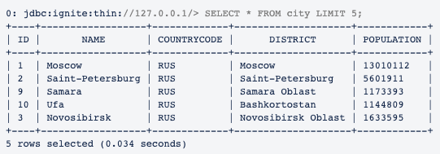

# Управляющие команды

DataGrid поддерживает стандартные управляющие команды.

## COPY

Копирует содержимое файла из локальной файловой системы на сервер и применяет его данные к таблице SQL.

При выполнении команды содержимое файла считывается в двоичной форме в пакеты данных, затем эти пакеты отправляются на сервер. Далее содержимое файла синтаксически анализируется и выполняется в потоковом режиме.

:::{admonition} Примечание
:class: note

Применяйте эту команду, если для хранения данных используется файл.
:::

### Синтаксис команды

:::{code-block} sql
:caption: SQL
COPY FROM '<path-to-local-file>' INTO tableName (columnName, columnName, ...) FORMAT CSV [CHARSET '<charset-name>']
:::

### Входные параметры

-   `</path-to-local-file>` — путь к файлу;
-   `tableName` — имя таблицы, в которую будут скопированы данные;
-   `columnName` — имя столбца таблицы, соответствущего столбцу в файле;
-   `<charset-name>` — необязательный параметр для указания кодировки.

:::{admonition} Внимание
:class: danger

Команда `COPY` поддерживается только при работе через JDBC-драйвер и может применяться только для файлов формата CSV.
:::

### Пример использования

В примере взят файл `city.csv`, который расположен в каталоге `{IGNITE_HOME}/examples/src/main/resources/sql/` дистрибутива DataGrid.

:::{code-block} sql
:caption: SQL
COPY FROM '/path/to/local/file.csv' INTO city (ID, Name, CountryCode, District, Population) FORMAT CSV
:::

## SET STREAMING

Управляет потоковой передачей массивов данных из файла в таблицу SQL на целевом кластере.

Если потоковая передача включена (`ON`), драйвер JDBC/ODBC упаковывает команды в пакеты и отправляет их на сервер — кластер DataGrid. На стороне сервера пакет преобразуется в поток команд обновления кеша, которые асинхронно распределяются между узлами сервера. Асинхронное выполнение этих операций увеличивает пиковую пропускную способность, так как в любой момент времени все узлы кластера заняты загрузкой данных.

### Синтаксис команды

:::{code-block} sql
:caption: SQL
SET STREAMING [OFF|ON];
:::

### Сценарий работы

1. Для потоковой передачи данных в кластер добавьте в скрипт команду `SET STREAMING ON`.
2. Потоковый режим передачи данных отключается после отправки команды `SET STREAMING OFF`

### Пример использования

В примере рассмотрена потоковая передача данных из заранее подготовленного SQL-файла.

:::{admonition} Внимание
:class: danger

На целевом кластере должна существовать таблица, в которую будут добавляться передаваемые данные. Если такой таблицы нет, ее необходимо создать непосредственно перед передачей данных.
:::

:::{code-block} sql
:caption: SQL
-- Создание таблицы --
CREATE TABLE City (
  ID INT(11),
  Name CHAR(35),
  CountryCode CHAR(3),
  District CHAR(20),
  Population INT(11),
  PRIMARY KEY (ID, CountryCode)
) WITH "template=partitioned, backups=1, affinityKey=CountryCode, CACHE_NAME=City, KEY_TYPE=demo.model.CityKey, VALUE_TYPE=demo.model.City";
-- Включение потоковой передачи --
SET STREAMING ON;
-- Добавление данных в таблицу --
INSERT INTO City(ID, Name, CountryCode, District, Population) VALUES (1,'Moscow','RUS','Moscow',13010112);
INSERT INTO City(ID, Name, CountryCode, District, Population) VALUES (2,'Saint-Petersburg','RUS','Saint-Petersburg',5601911);
INSERT INTO City(ID, Name, CountryCode, District, Population) VALUES (3,'Novosibirsk','RUS','Novosibirsk Oblast',1633595);
INSERT INTO City(ID, Name, CountryCode, District, Population) VALUES (4,'Yekaterinburg','RUS','Sverdlovsk Oblast',1588665);
INSERT INTO City(ID, Name, CountryCode, District, Population) VALUES (5,'Kazan','RUS','Tatarstan',1308660);
INSERT INTO City(ID, Name, CountryCode, District, Population) VALUES (6,'Nizhny Novgorod','RUS','Nizhny Novgorod Oblast',1249861);
INSERT INTO City(ID, Name, CountryCode, District, Population) VALUES (7,'Chelyabinsk','RUS','Chelyabinsk Oblast',1189525);
INSERT INTO City(ID, Name, CountryCode, District, Population) VALUES (8,'Krasnoyarsk','RUS','Krasnoyarsk Krai',1188533);
INSERT INTO City(ID, Name, CountryCode, District, Population) VALUES (9,'Samara','RUS','Samara Oblast',1173393);
INSERT INTO City(ID, Name, CountryCode, District, Population) VALUES (10,'Ufa','RUS','Bashkortostan',1144809);
-- Следующие команды INSERT --
:::

После подготовки файла запустите утилиту SQLLine (подробнее описано в разделе [«Утилиты SQLLine (sqlline.sh, ise-sqlline.sh)»](sqlline.md)) и выполните команду:

```bash
!run /apache_ignite_version/examples/sql/world.sql
```

:::{admonition} Примечание
:class: note

Для примера использован файл `world.sql`, который расположен в каталоге `{IGNITE_HOME}/examples/sql/` дистрибутива DataGrid.
:::

После выполнения вышеуказанной команды и завершения JDBC-соединения все данные будут загружены на кластер и станут готовы для дальнейших запросов.



:::{admonition} Внимание
:class: danger

После завершения загрузки данных обязательно завершите соединение JDBC/ODBC для полной загрузки данных на кластер.
:::

### Известные ограничения

Хотя потоковый режим позволяет загружать данные гораздо быстрее, чем другие упомянутые в этом руководстве методы загрузки, он имеет ограничения:

1. Разрешена только команда `INSERT`. При попытке использовать команду `SELECT` или любую другую команду DML или DDL эта команда завершится ошибкой выполнения, при этом команды `INSERT` будут выполнены.
2. Из-за асинхронной природы потокового режима пользователь не может получать значение количества обновлений для каждой выполненной команды. Все команды JDBC/ODBC, возвращающие количество обновлений, будут возвращать 0.

## KILL QUERY

Отменяет выполнение запущенного запроса.

Когда запрос отменяется командой `KILL`, все части запроса, запущенные на всех других узлах, также завершаются.

### Синтаксис команды

::::{md-tab-set}
:::{md-tab-item} SQL
```sql
KILL QUERY {ASYNC} 'query_id'
```
:::

:::{md-tab-item} JMX
```java
QueryMXBean mxBean = ...;
mxBean.cancelSQL(queryId);
```
:::

:::{md-tab-item} Unix
```bash
./control.sh --kill SQL query_id
```
:::

:::{md-tab-item} Windows
```bash
control.bat --kill SQL query_id
```
:::
::::

### Входные параметры

- `query_id` — идентификатор запроса, значение которого можно получить через системное представление `SQL_QUERIES` (см. документ [«Руководство по системному администрированию», раздел «События мониторинга», глава SQL_QUERIES](monitoring-events.md));
- `ASYNC` — необязательный параметр, который возвращает управление немедленно, не дожидаясь завершения отмены запроса.

## KILL TRANSACTION

Отменяет выполнение запущенной транзакции.

### Синтаксис команды

::::{md-tab-set}
:::{md-tab-item} SQL
```sql
KILL TRANSACTION 'xid'
```
:::

:::{md-tab-item} JMX
```java
TransactionMXBean mxBean = ...;
mxBean.cancel(xid);
```
:::

:::{md-tab-item} Unix
```bash
./control.sh --kill TRANSACTION xid
```
:::

:::{md-tab-item} Windows
```bash
control.bat --kill TRANSACTION xid
```
:::
::::

### Входные параметры

- `xid` — идентификатор транзакции, значение которого можно получить через системное представление `TRANSACTIONS`.

## KILL SCAN

Отменяет выполнение запущенного запроса на сканирование.

### Синтаксис команды

::::{md-tab-set}
:::{md-tab-item} SQL
```sql
KILL SCAN 'origin_node_id' 'cache_name' query_id
```
:::

:::{md-tab-item} JMX
```java
QueryMXBean mxBean = ....;
mxBean.cancelScan(originNodeId, cacheName, queryId);
```
:::

:::{md-tab-item} Unix
```bash
./control.sh --kill SCAN origin_node_id cache_name query_id
```
:::

:::{md-tab-item} Windows
```bash
control.bat --kill SCAN origin_node_id cache_name query_id
```
:::
::::

### Входные параметры

- `origin_node_id` — идентификатор узла, инициировавшего запрос;
- `cache_name` — имя кеша;
- `query_id` — идентификатор запроса.

Значения параметров можно получить через системное представление `SCAN_QUERIES` (см. документ [«Руководство по системному администрированию», раздел «События мониторинга», глава SCAN_QUERIES](monitoring-events.md)).

### Пример использования

:::{code-block} sql
:caption: SQL
KILL SCAN '6fa749ee-7cf8-4635-be10-36a1c75267a7_54321' 'cache-name' 1
:::

## KILL COMPUTE

Отменяет выполнение запущенного вычисления.

### Синтаксис команды

::::{md-tab-set}
:::{md-tab-item} SQL
```sql
KILL COMPUTE 'session_id'
```
:::

:::{md-tab-item} JMX
```java
ComputeMXBean#cancel
```
:::

:::{md-tab-item} Unix
```bash
./control.sh --kill COMPUTE session_id
```
:::

:::{md-tab-item} Windows
```bash
control.bat --kill COMPUTE session_id
```
:::
::::

### Входные параметры

- `session_id` — идентификатор сессии, значение которого можно получить через системное представление `TASKS` или `JOBS` (подробнее написано в подразделах `TASKS` и `JOBS` раздела [«События мониторинга»](monitoring-events.md) документа «Руководство по системному администрированию»).

## KILL CONTINUOUS

Отменяет выполнение запроса типа continuousQuery.

### Синтаксис команды

::::{md-tab-set}
:::{md-tab-item} SQL
```sql
KILL CONTINUOUS 'origin_node_id', 'routine_id'
```
:::

:::{md-tab-item} JMX
```java
QueryMXBean mxBean = ...;
mxBean.cancelContinuous(originNodeId, routineId);
```
:::

:::{md-tab-item} Unix
```bash
./control.sh --kill CONTINUOUS origin_node_id routine_id
```
:::

:::{md-tab-item} Windows
```bash
control.bat --kill CONTINUOUS origin_node_id routine_id
```
:::
::::

### Входные параметры

- `origin_node_id` — идентификатор узла, инициировавшего запрос;
- `routine_id` — идентификатор запроса.

Значения параметров можно получить через системное представление `CONTINUOUS_QUERIES` (см. документ [«Руководство по системному администрированию», раздел «События мониторинга», глава CONTINUOUS_QUERIES](monitoring-events.md)).

## KILL SERVICE

Останавливает запущенный сервис.

### Синтаксис команды

::::{md-tab-set}
:::{md-tab-item} SQL
```sql
KILL SERVICE 'name'
```
:::

:::{md-tab-item} JMX
```java
ServiceMXBean mxBean = ...;
mxBean.cancel(name);
```
:::

:::{md-tab-item} Unix
```bash
./control.sh --kill SERVICE name
```
:::

:::{md-tab-item} Windows
```bash
control.bat --kill SERVICE name
```
:::
::::

### Входные параметры

- `name` — имя сервиса, назначенное при развертывании. Можно получить через системное представление `SERVICES` (см. документ [«Руководство по системному администрированию», раздел «События мониторинга», глава SERVICES](monitoring-events.md)).

## KILL CONSISTENCY (операции по проверке и восстановлению согласованности данных)

Отменяет выполнение запущенных операций по проверке и восстановлению согласованности данных.

### Синтаксис команды

::::{md-tab-set}
:::{md-tab-item} Unix
```bash
./control.sh --kill CONSISTENCY
```
:::

:::{md-tab-item} Windows
```bash
control.bat --kill CONSISTENCY
```
:::
::::

## KILL CLIENT

Прерывает соединение с клиентом (тонкий клиент/JDBC/ODBC).

### Синтаксис команды

::::{md-tab-set}
:::{md-tab-item} Unix
```bash
./control.sh --kill CLIENT connection_id [--node-id node_id]
```
:::

:::{md-tab-item} Windows
```bash
control.bat --kill CLIENT connection_id [--node-id node_id]
```
:::
::::

### Входные параметры

- `connection_id` — идентификатор соединения клиента. Укажите `ALL` для прерывания всех соединений. Значение может отличаться для разных узлов на одном кластере. Его можно получить через системное представление `CLIENT_CONNECTIONS` (подробнее о нем написано в разделе «[](monitoring-events.md#client_connections)»).
- `node_id` — идентификатор узла, для которого нужно прервать соединение.

### Результат выполнения

После выполнения команды `--kill CLIENT` соединение с клиентом будет разорвано. Клиентский узел будет вести себя так же, как при сетевой недоступности между серверным узлом и клиентом. 

Чтобы повторно подключить клиентский узел, воспользуйтесь инструкцией в разделе «[](/documents/developer-guide/connecting_client_nodes.md#повторное-подключение-клиентского-узла)» документа «Руководство прикладного разработчика».