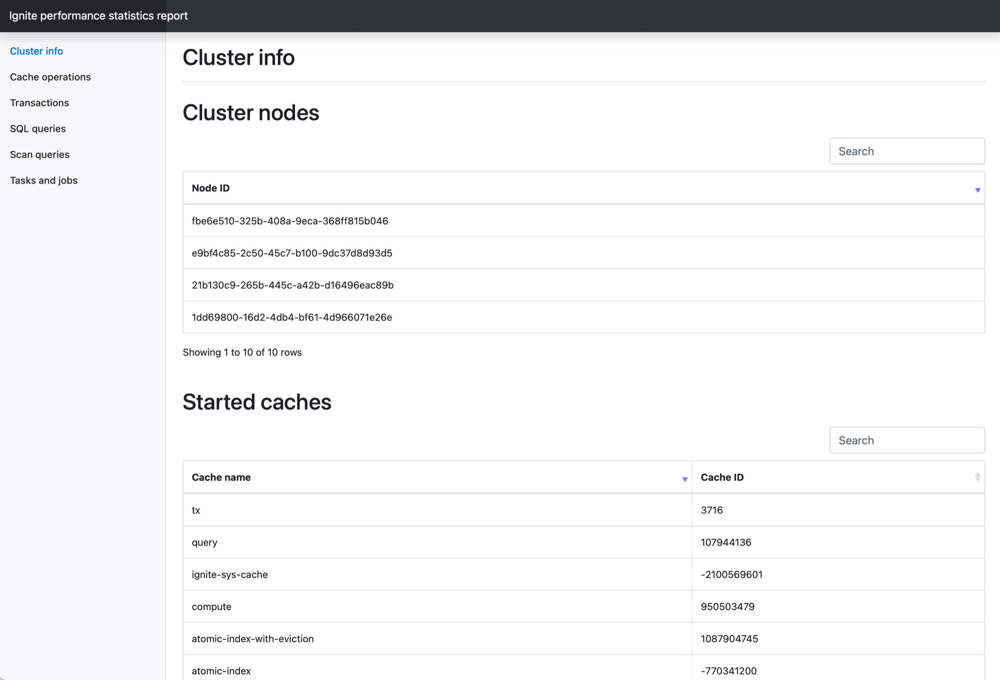
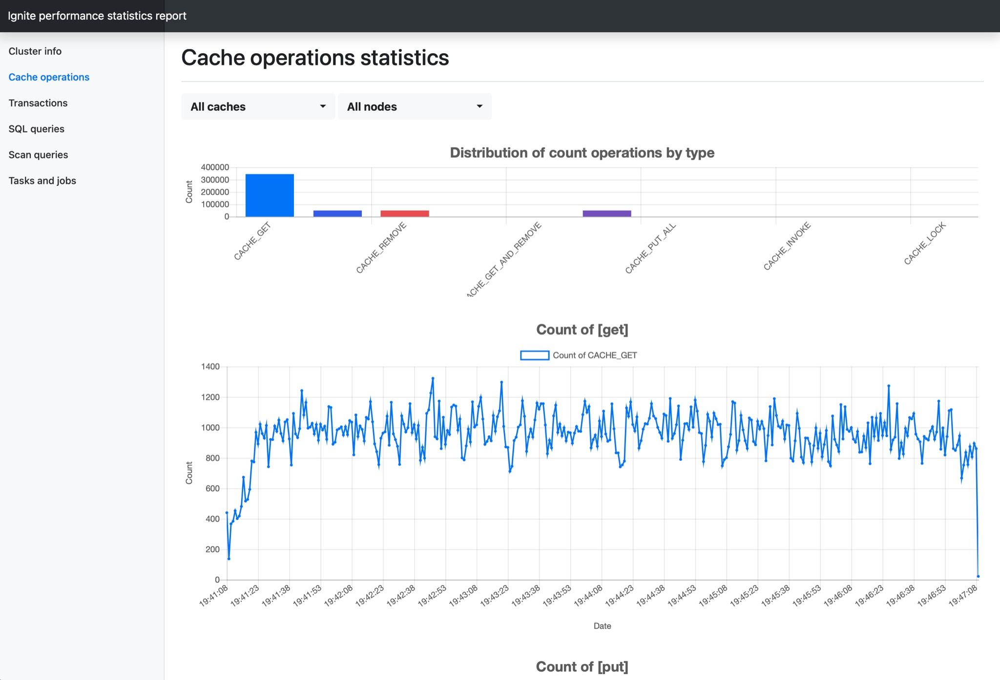
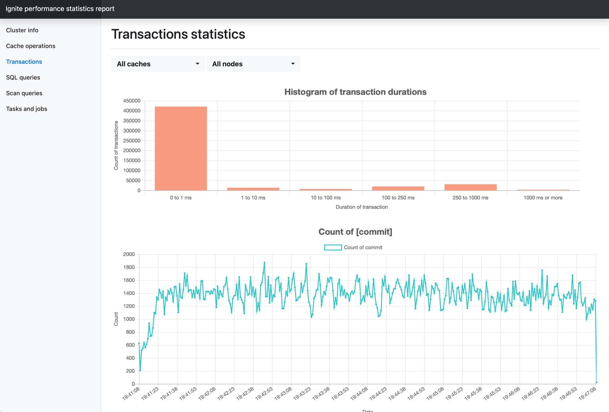
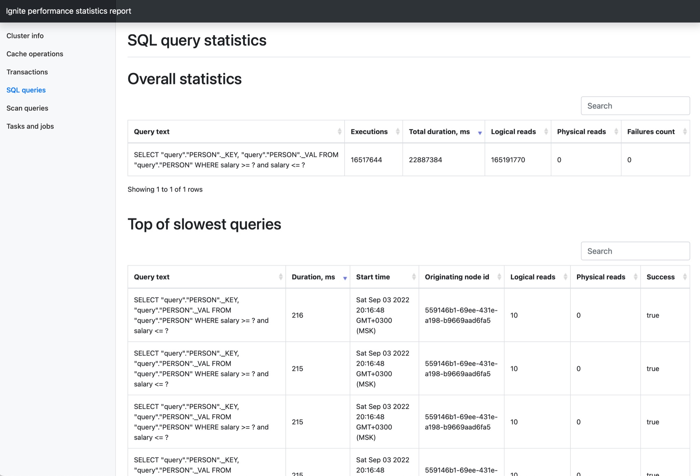
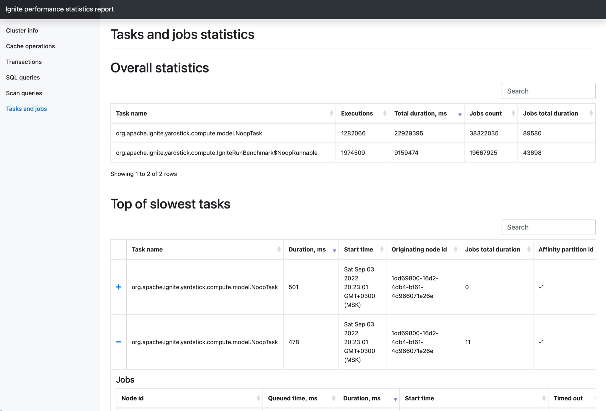

# Статистика производительности (Performance statistics)

DataGrid включает в себя встроенный инструмент профилирования кластера.

Работа с инструментом включает в себя два этапа:

1.  Сбор статистики на кластере. 
2.  Создание отчета о производительности.

## Сбор статистики производительности

Для сбора статистики производительности используются:

1.  Интерфейс JMX:

    | Метод | Описание |
    |---|---|
    | `start()` | Начать сбор статистики по кластеру |
    | `stop()` | Остановить сбор статистики по кластеру |
    | `rotate()` | Произвести ротацию файлов статистики в кластере |
    | `started()` | `true`, если сбор статистики начат |

2.  Утилита `control`:

    Синтаксис команды:

    ```bash
    control.sh|bat --performance-statistics [start|stop|rotate|status]
    ```

    где:

    -   `start` — начать сбор статистики по кластеру;
    -   `stop` — остановить сбор статистики по кластеру;
    -   `rotate` — произвести ротацию файлов статистики в кластере;
    -   `status` — получить статус сбора статистики по кластеру.

Каждый узел собирает статистику производительности в бинарный файл. Этот файл размещается в рабочей директории DataGrid в каталоге `Datagrid-work-directory/perf_stat`. Для имени используется следующая маска: `node-{nodeId}-{index}.prf`.

Файлы статистики производительности используются для создания отчета в режиме оффлайн.

Узлы используют циклический off-heap-буфер для временного хранения сериализованной статистики. Записывающий поток отправляет содержимое буфера в файл при достижении порога. Если буфер переполняется из-за медленного диска, некоторые показатели в статистике пропускаются. Для настройки обратитесь к разделу «Системные свойства» ниже.

Каждый процесс сбора статистики создает на узлах новый файл. Каждый следующий файл имеет такое же имя, как у предыдущего, но с соответствующим индексом, например:

-   `node-faedc6c9-3542-4610-ae10-4ff7e0600000.prf`;
-   `node-faedc6c9-3542-4610-ae10-4ff7e0600000-1.prf`;
-   `node-faedc6c9-3542-4610-ae10-4ff7e0600000-2.prf`.

## Создание отчета

DataGrid предоставляет инструмент для генерации отчета из файлов статистики производительности. Инструмент является расширением для DataGrid и находится в каталоге `utils` под именем `performance-statistics-ext`.

Для создания отчета:

1.  Остановите сбор статистики и поместите файлы со всех узлов в пустой каталог. Например:

    ```text
    /path_to_files/
        ├── node-162c7147-fef8-4ea2-bd25-8653c41fc7fa.prf
        ├── node-7b8a7c5c-f3b7-46c3-90da-e66103c00001.prf
        └── node-faedc6c9-3542-4610-ae10-4ff7e0600000.prf
    ```

2.  Запустите скрипт из поставки:

    ```bash
    performance-statistics-tool/build-report.sh path_to_files
    ```

Отчет о производительности создается в новом каталоге по пути файлов статистики производительности:

```text
path_to_files/report_yyyy-MM-dd_HH-mm-ss/
```

Для просмотра отчета откройте в браузере страницу `report_yyyy-MM-dd_HH-mm-ss/index.html`.

### Пример отчета

Информация о кластере:



Операции с кешами:



Транзакции:



Запросы:



Просмотр плана и других свойств запроса:


Вычисления:



## Печать статистики

DataGrid предоставляет инструмент для печати статистики в консоль или в файл в формате JSON.

Для печати статистики запустите скрипт из релиз-пакета инструмента:

```bash
performance-statistics-tool/print-statistics.sh <path_to_files>
```

где `path_to_files` — путь к файлу статистики или к каталогу с файлами статистики.

Скрипт позволяет фильтровать операции по типу операции, времени или кешу. Для получения более подробной информации вызовите справку:

```bash
performance-statistics-tool/print-statistics.sh --help
```

Пример печати статистики в терминал:

```text
{"op":"CACHE_GET","nodeId":"955130d1-5218-4e46-87f6-62755e92e9b4","cacheId":-1809642915,"startTime":1616837094237,"duration":64992213}
{"op":"CACHE_PUT","nodeId":"955130d1-5218-4e46-87f6-62755e92e9b4","cacheId":-1809642915,"startTime":1616837094237,"duration":879869}
{"op":"CACHE_GET_AND_PUT","nodeId":"955130d1-5218-4e46-87f6-62755e92e9b4","cacheId":1328364293,"startTime":1616837094248,"duration":17186240}
{"op":"TX_COMMIT","nodeId":"955130d1-5218-4e46-87f6-62755e92e9b4","cacheIds":[-1809642915],"startTime":1616837094172,"duration":184887787}
{"op":"QUERY","nodeId":"955130d1-5218-4e46-87f6-62755e92e9b4","type":"SQL_FIELDS","text":"create table Person (id int, val varchar, primary key (id))","id":0,"startTime":1616837094143,"duration":258741595,"success":true}
```

## Системные свойства

| Свойство | Тип | Значение по умолчанию | Описание |
|---|---|---|---|
| `IGNITE_PERF_STAT_FILE_MAX_SIZE` | `Long` | 32 Гб | Максимальный размер файла статистики производительности в байтах. Сбор статистики производительности прекращается при превышении максимального размера файла |
| `IGNITE_PERF_STAT_BUFFER_SIZE` | `Integer` | 32 Мб | Размер off-heap-буфера статистики производительности в байтах |
| `IGNITE_PERF_STAT_FLUSH_SIZE` | `Integer` | 8 Мб | Минимальный размер пакета данных статистики производительности для отправления в файл в байтах |
| `IGNITE_PERF_STAT_CACHED_STRINGS_THRESHOLD` | `Integer` | 1024 | Порог закешированных строк статистики производительности. Кеширование строк прекращается при превышении порога |

### Настройки для аудита событий

Для настройки аудита событий необходимо:

1.  Добавить `RestProcessorPluginProvider` в список плагинов.
2.  Включить события `RestEventType.EVT_REST_REQ_SUCCEEDED` и `RestEventType.EVT_REST_REQ_FAILED` в `IgniteConfiguration`.

    ::::{admonition} Пример
    :class: hint 
    :collapsible:

    :::{code-block} xml
    :caption: XML
    <bean id="ignite.cfg" class="org.apache.ignite.configuration.IgniteConfiguration" primary="true">
        ...
        <property name="pluginProviders">
            <list>
                ...
                <ref bean="restProcPlugin"/>
            </list>
        </property>

        <property name="includeEventTypes" ref="eventTypes"/>
        ...
        </bean>

    <bean id="restProcPlugin" class="com.sbt.security.ignite.core.rest.RestProcessorPluginProvider">
            <property name="configuration">
                <bean id="restProcPluginConfiguration" class="com.sbt.security.ignite.core.rest.RestProcessorPluginConfiguration"/>
            </property>
    </bean>

    <util:list id="eventTypes" value-type="java.lang.Integer">
        ...
        <util:constant static-field="com.sbt.security.ignite.core.events.RestEventType.EVT_REST_REQ_SUCCEEDED"/>
        <util:constant static-field="com.sbt.security.ignite.core.events.RestEventType.EVT_REST_REQ_FAILED"/>
        ...
    </util:list>
    :::
    ::::