# Использование Zabbix и Grafana для мониторинга

В разделе описано применение open-source системы мониторинга Zabbix совместно с системой визуализации данных Grafana для сбора метрик кластеров DataGrid.

## Общая концепция мониторинга

Мониторинг кластера DataGrid подразумевает мониторинг каждого отдельного узла этого кластера.

Для построения дашборда в Grafana по кластеру DataGrid каждый его узел должен быть внесен в отдельную группу хостов в Zabbix, которая содержит только узлы данного кластера.

Если JMX-метрики и метрики по поиску событий в логах разнесены на отдельные Zabbix-сервера, объединения в группы должны быть организованы на обоих серверах.

## Система мониторинга Zabbix

В данном разделе содержится описание организации мониторинга кластеров DataGrid в системе мониторинга Zabbix.

Основные понятия:

- Макрос — переменная, записанная в синтаксисе `{МАКРОС}`, которая раскрывается в требуемое значение в зависимости от контекста. Типичное применение макросов — в шаблонах.
- Элемент данных — конкретный фрагмент данных (метрика), который можно получить от узла сети.
- Низкоуровневое обнаружение (Low Level Discovery, далее LLD) — автоматическое обнаружение объектов на конкретном устройстве (например, файловые системы, ⁣⁣JMX MBeans, systemd-сервисы и так далее). Настройки LLD задаются через правила обнаружения (приведены ниже для каждого шаблона).
- Прототип элементов данных — метрика, у которой некоторые параметры представлены в виде переменных, готовых для низкоуровневого обнаружения. После низкоуровневого обнаружения эти переменные автоматически заменяются реальными обнаруженными параметрами, и метрика автоматически начинает сбор данных.
- Прототип элементов триггеров — триггер, у которого некоторые параметры представлены в виде переменных, готовых для низкоуровневого обнаружения. После низкоуровневого обнаружения эти переменные автоматически заменяются реальными обнаруженными параметрами, и триггер автоматически начинает оценку данных.
- История и тренды — два пути хранения собранных данных в Zabbix. История хранит каждое собранное значение, а тренды — усредненную информацию за каждый час.

Подробная информация по настройке Zabbix приведена в [официальной документации Zabbix](https://www.zabbix.com/documentation/6.0/en/manual).

### Требования

Для мониторинга кластера DataGrid требуется Zabbix версии 6.0 LTS.

### Установка

1. Импортируйте выбранный шаблон через веб-интерфейс Zabbix (**Configuration → Templates → Import**).
2. Создайте хосты в Zabbix для мониторинга JMX и агентского мониторинга логов и ОС.

    :::{admonition} Примечание
    :class: note

    Рекомендуется разъединять агентский и безагентский мониторинг в Zabbix по разным хостам.
    :::

    Примеры имен хостов:
    - `hostname1` — агентский хост для мониторинга ОС (операционной системы) и логов;
    - `hostname1.jmx1098` — безагентский хост для мониторинга JMX;
    - `hostname1.ignite` — безагентский хост для мониторинга JMX.

    :::{admonition} Примечание
    :class: note

    Имена хостов могут быть произвольными.
    :::

3. Создайте группы хостов, которые будут объединять хосты в кластер.

    Примеры имен групп:

    **IGN Test Cluster/ISE**, где:
    - `IGN` — префикс, который будет использоваться в Grafana для поиска кластеров;
    - `Test Cluster` — имя кластера;
    - `ISE` — признак продукта DataGrid.

    **IGN Test Cluster/OS**, где:
    - `IGN` — префикс, который будет использоваться в Grafana для поиска кластеров;
    - `Test Cluster` — имя кластера;
    - `OS` — признак агентского мониторинга.

    :::{admonition} Примечание
    :class: note

    Имена групп рекомендуется стандартизировать, так как впоследствии они будут использоваться в Grafana.
    :::

4. Добавьте созданные хосты в соответствующие группы.

    Например, хост `hostname1` добавьте в группу **IGN Test Cluster/OS**, `hostname1.jmx1098` добавьте в группу **IGN Test Cluster/ISE**.

5. Подключите шаблоны к хостам групп (на хостах → **Templates → Link new templates**).

    JMX-шаблоны подключите к хостам безагентского мониторинга, Log-шаблоны — к хостам агентского мониторинга.

    Например, на хост `hostname1` подключите шаблон **SBT DataGrid Log**. На хост `hostname.jmx1098` подключите шаблоны: **SBT DataGrid JMX**, **SBT DataGrid Caches JMX**.

6. При необходимости отредактируйте унаследованные макросы на хостах.

### Расчетные метрики

В шаблонах мониторинга DataGrid присутствует ряд метрик, которые рассчитываются из исходных показателей узлов, анализа log-файлов или с помощью стандартных средств Zabbix Agent.

Таким образом, мониторинг кластера DataGrid обогащается метриками, которые отсутствуют напрямую в продукте.

К таким метрикам относятся следующие показатели:

| Имя | Ключ | Описание |
|---|---|---|
| `DataRegion [{#JMXNAME}] - Utilisation` | `DataReg.util[{#JMXOBJ}]` | Утилизация региона данных в процентах | 
| `DataRegion [{#JMXNAME}] - OffHeapFree` | `DataReg.offHeapFree[{#JMXOBJ}]` | Объем свободной Off-Heap-памяти для региона данных | 
| `DataRegion [{#JMXNAME}] - EmptyPagesSize` | `DataReg.emptyPageSize[{#JMXOBJ}]` | Общий размер пустых страниц в регионе данных |
| `Cache Groups [{#JMXNAME}] - RebalancingPartitionsTotal` | `RebalancingPartitionsTotal[{#JMXNAME}]` | Ожидаемое количество партиций для кеш-группы |
| `JVM Memory Heap utilization percent` | `JVM.Memory[HeapMemoryUsage.used,percent]` | Процент утилизации heap-памяти JVM | 
| `JVM OS FileDescriptor utilization percent` | `JVM.OS[FileDescriptorUsed,percent]` | Процент открытых файлов (от максимального значения) |
| `JVM OS PhysicalMemory utilization percent` | `JVM.OS[PhysicalMemoryUsed,percent]` | Процент используемой физической памяти | 
| `Bin {#BINDIR} file size` | `vfs.file.size[{#BINDIR}]` | Размер файла `index.bin` для кеша в директории с базой данных | 
| `Found long running transaction` | `logrt[{$IGNITE_LOG},">>> Transaction.*duration=(\d+)",,,skip,\1,,mtime-noreread]` | Длительность обнаруженной LRT (Long Running Transaction) |
| `Server added to topology` | `logrt[{$IGNITE_LOG}," Added new node to topology.*isClient=false&#124; (id=\S+?),",,,skip,,,mtime-noreread]` | ID серверного узла, который вошел в топологию | 
| `Client added to topology` | `logrt[{$IGNITE_LOG}," Added new node to topology.*isClient=true&#124; (id=\S+?),",,,skip,,,mtime-noreread]` | ID клиентского узла, который вошел в топологию |
| `Server left/failed` | `logrt[{$IGNITE_LOG}," Node left topology.*isClient=false&#124; Node FAILED.*isClient=false",,,skip,,,mtime-noreread]` | Информация о вышедшем из топологии серверном узле | 
| `Finished checkpoint pages` | `logrt[{$IGNITE_LOG},"Checkpoint finished.*pages=(\d+),",,,skip,\1,,mtime-noreread]` | Количество страниц, записанных в PDS (Persistence Data Storage) за последнюю контрольную точку |
| `Finished checkpoint total time` | `logrt[{$IGNITE_LOG},"Checkpoint finished.*total=(\d+)",,,skip,\1,,mtime-noreread]` | Длительность последней процедуры контрольной точки | 
| `Failed to acquire lock within provided timeout for transaction` | `logrt[{$IGNITE_LOG},"Failed to acquire lock within provided timeout for transaction.*duration=(\d+)",,,skip,\1,,mtime-noreread]` | Длительность обнаруженной LRT | 
| `Long query duration` | `logrt[{$IGNITE_LOG},"Query [execution is too long&#124;produced big result set].*duration=(\d+)",,,skip,\1,,mtime-noreread]` | Длительность обнаруженного долгого запроса | 
| `ParametersChecker` | `logrt[{$IGNITE_LOG},ParametersChecker.\s*\^--\s(?!Configuration check failed)(.*),,,skip,\1,,mtime-noreread]` | Список проблем в конфигурации узла, найденных плагином ParametersChecker |
| `DCELL` | `logrt[{$IGNITE_LOG},".*[IgniteKernal&#124;ParametersChecker].*{$ABF}=(\S+?)[,&#124;\]&#124;\n]",,,skip,\1,,mtime-noreread]` | Имя ячейки кластера (BackupFilter) |

### Описание шаблонов мониторинга

Шаблоны мониторинга Zabbix расположены в дистрибутиве DataGrid в каталоге `/monitoring/zabbix`.

### Шаблон мониторинга SBT DataGrid Log v1.17

#### Макросы

| Имя | Значение | Описание |
|---|---|---|
| `{$DATAGRID.AFFINITI_BACKUP_FILTER.NAME}` | `DCELL` | `AffinityBackupFilter` — имя параметра, в котором задается название ячейки кластера |
| `{$DATAGRID.CDC.CLIENT.PORT.HIGH}` | `0000` | JMX-порт, который слушает CDC-узел |
| `{$DATAGRID.CDC.CLIENT_KAFKA.PORT.HIGH}` | `0000` | JMX-порт, который слушает CDC-узел |
| `{$DATAGRID.CDC.FAIL_CNT.AVERAGE}` | `5` | Максимально допустимое количество падений клиента CDC в заданном интервале `{$DATAGRID.ITEM.LAST_TIME}` |
| `{$DATAGRID.CDC.FAIL_INTERVAL.AVERAGE}` | `#5` | Интервал времени для подсчета падений CDC-клиентов |
| `{$DATAGRID.CDC.LOG.FILE_NAME}` | `ignite-cdc.log` | Путь к log-файлу процесса репликации |
| `{$DATAGRID.CHECKPOINT.TIME_LIMIT.HIGH}` | `30000` | Пороговое значение срабатывания триггера по `CheckpointFinished` |
| `{$DATAGRID.DISCOVERY.LOST_RESOURCES_PERIOD}` | `30d` | Время, через которое будет удален необнаруживаемый элемент данных |
| `{$DATAGRID.INDEX_FILE.PATH}` | `/test/ignite_self_monitoring_jar/ignite/work/db` | Путь к директории с базой данных (**важно:** без косой черты в конце) |
| `{$DATAGRID.ITEM.DELAY}` | `1m` | Время опроса метрики |
| `{$DATAGRID.ITEM.HISTORY}` | `2w` | Время хранения истории элемента данных |
| `{$DATAGRID.ITEM.LAST_TIME}` | `5m` | Время поиска данных в log-файле |
| `{$DATAGRID.ITEM.TRENDS}` | `2w` | Время хранения динамики изменений элемента данных |
| `{$DATAGRID.JVM.PAUSE_DURATION.WARNING}` | `500` | Максимально допустимая длительность JVM-пауз. Для корректной работы значение не должно быть меньше JVM-опции `DIGNITE_JVM_PAUSE_DETECTOR_THRESHOLD`. Значение по умолчанию — 500 |
| `{$DATAGRID.LOG.FILE_NAME}` | `ignite.log` | Имя log-файла DataGrid |
| `{$DATAGRID.LOG.PATH}` | `/opt/ignite/logs` | Путь к директории с log-файлами DataGrid |
| `{$DATAGRID.METRICS_LOG.PATH}` | `/opt/gridgain/gridgain/log/metrics-ignite.log` | Путь к файлу метрик (при использовании `LogExporterSpi`) |
| `{$DATAGRID.THREADS.LOCK.FILTER}` | `foobar` | Фильтрация потоков, о блокировке которых сообщать не нужно |
| `{$DATAGRID.WAL_ARCH.LIMIT.HIGH}` | `0` | Максимально допустимое количество WAL-архивов |
| `{$DATAGRID.WAL_ARCH.PATH}` | `/test/gav/ft/datagrid-cdc/wal_archive/cdc` | Путь к директории с WAL-архивами |

#### Правила обнаружения

##### Правило Cluster cell name discovery

**Ключ:** `ign.dependent.cell.name`

**Прототипы элементов данных**

| Имя | Ключ | Описание | Тип | Интервал | История | Тренд |
|---|---|---|---|---|---|---|
| `CellName_{#CELL_NAME}` | `logrt.count[{$DATAGRID.LOG.PATH},"{$DATAGRID.AFFINITI_BACKUP_FILTER.NAME}={#CELL_NAME}",,,skip,,mtime-noreread]` | Хранит имя ячейки `AffinityBackupFilter` | `Numeric (unsigned)` | `{$DATAGRID.ITEM.DELAY}` | `{$DATAGRID.ITEM.HISTORY}` | `{$DATAGRID.ITEM.TRENDS}` |

##### Правило Local node discovery port

**Ключ:** `ign.localnode.port.discovery`

**Прототипы элементов данных**

| Имя | Ключ | Описание | Тип | Интервал | История | Тренд |
|---|---|---|---|---|---|---|
| `DataGrid discovery port check {#IGNITE_AVALIABILITY_PORT}` | `net.tcp.listen[{#IGNITE_AVALIABILITY_PORT}]` | Значение `1` — сетевой порт открыт, приложение DataGrid запущено. Значение `0` — приложение DataGrid не запущено | `Numeric (unsigned)` | `{$DATAGRID.ITEM.DELAY}` | `{$DATAGRID.ITEM.HISTORY}` | `{$DATAGRID.ITEM.TRENDS}` |

**Прототипы триггеров**

| Имя | Приоритет | Выражение | Описание |
|---|---|---|---|
| `Ignite node not available on port {#IGNITE_AVALIABILITY_PORT}` | `HIGH` | `last(/SBT DataGrid Log v1.17/net.tcp.listen[{#IGNITE_AVALIABILITY_PORT}])=0` | Узел DataGrid перестал использовать сетевой порт `{#IGNITE_AVALIABILITY_PORT}` |

##### Правило Bin discovery

**Ключ:** `index-bin.list[{$DATAGRID.INDEX_FILE.PATH}]`

**Прототипы элементов данных**

| Имя | Ключ | Описание | Тип | Интервал | История | Тренд |
|---|---|---|---|---|---|---|
| `Bin {#BINDIR} file size` | `vfs.file.size[{#BINDIR}]` | Размер файла `index.bin` для кеша в директории с базой данных | `Numeric (unsigned)` | `{$DATAGRID.ITEM.DELAY}` | `{$DATAGRID.ITEM.HISTORY}` | `{$DATAGRID.ITEM.TRENDS}` |

##### Правило WAL discovery

**Ключ:** `wal-arc.path[{$DATAGRID.WAL_ARCH.PATH}]`

**Прототипы элементов данных**

| Имя | Ключ | Описание | Тип | Интервал | История | Тренд |
|---|---|---|---|---|---|---|
| `Number of wal archives in {#IGNCONSIST}` | `vfs.dir.count[{#WALPATH}]` | Количество WAL-архивов для узла кластера `{#IGNCONSIST}` | `Numeric (unsigned)` | `{$DATAGRID.ITEM.DELAY}` | `{$DATAGRID.ITEM.HISTORY}` | `{$DATAGRID.ITEM.TRENDS}` |

**Прототипы триггеров**

| Имя | Приоритет | Выражение | Описание |
|---|---|---|---|
| `Too many wal archives` | `HIGH` | `last(/SBT DataGrid Log v1.17/vfs.dir.count[{#WALPATH}])>{$DATAGRID.WAL_ARCH.LIMIT.HIGH} and {$DATAGRID.WAL_ARCH.LIMIT.HIGH}>0` | Количество WAL-архивов больше запланированного |

#### Метрики без LLD

| Имя | Ключ | Описание | Тип | Интервал | История | Тренд |
|---|---|---|---|---|---|---|
| `Nodes reserv` | `compute.node.reserv[{$DATAGRID.METRICS_LOG.PATH}]` | Наименьшее количество партиций на данном узле для всех кеш-групп. Возможные значения: • `-1` — узел не входит в baseline кластера; • `0` — потеря данных; • `1` — на этом узле хранится единственная копия партиции | `FLOAT` | `{$DATAGRID.ITEM.DELAY}` | `{$DATAGRID.ITEM.HISTORY}` | `{$DATAGRID.ITEM.TRENDS}` |
| `Total CDC errors` | `logrt.count[{$DATAGRID.LOG.PATH}/^{$DATAGRID.CDC.LOG.FILE_NAME}$,"(\[ERROR\]&#124;\[WARN \]).*",,,skip,,mtime-noreread]` | Общее количество событий `ERROR` в log-файле репликации за последний интервал проверки | `Numeric (unsigned)` | `{$DATAGRID.ITEM.DELAY}` | `{$DATAGRID.ITEM.HISTORY}` | `{$DATAGRID.ITEM.TRENDS}` |
| `CDC log heartbeat` | `logrt.count[{$DATAGRID.LOG.PATH}/^{$DATAGRID.CDC.LOG.FILE_NAME}$,"Metrics for local node",,,skip,,mtime-noreread]` | Время последней записи сообщения `Metrics for local node` в log-файл | `Numeric (unsigned)` | `{$DATAGRID.ITEM.DELAY}` | `{$DATAGRID.ITEM.HISTORY}` | `{$DATAGRID.ITEM.TRENDS}` |
| `Blocked system-critical thread has been detected` | `logrt.count[{$DATAGRID.LOG.PATH}/^{$DATAGRID.LOG.FILE_NAME}$,"Blocked system-critical thread has been detected.*threadName(?>(?!{$DATAGRID.THREADS.LOCK.FILTER}).)*$",,,skip,,mtime-noreread]` | Продолжительность блокировки системного потока | `Numeric (unsigned)` | `{$DATAGRID.ITEM.DELAY}` | `{$DATAGRID.ITEM.HISTORY}` | `{$DATAGRID.ITEM.TRENDS}` |
| `Cannot find metadata for object with compact footer` | `logrt.count[{$DATAGRID.LOG.PATH}/^{$DATAGRID.LOG.FILE_NAME}$,"Cannot find metadata for object with compact footer:",,,skip,,mtime-noreread]` | Критическое сообщение (проблемы с метаданными) | `Numeric (unsigned)` | `{$DATAGRID.ITEM.DELAY}` | `{$DATAGRID.ITEM.HISTORY}` | `{$DATAGRID.ITEM.TRENDS}` |
| `Cannot find schema for object` | `logrt.count[{$DATAGRID.LOG.PATH}/^{$DATAGRID.LOG.FILE_NAME}$,"Cannot find schema for object",,,skip,,mtime-noreread]` | Не найдена схема для объекта | `Numeric (unsigned)` | `{$DATAGRID.ITEM.DELAY}` | `{$DATAGRID.ITEM.HISTORY}` | `{$DATAGRID.ITEM.TRENDS}` |
| `Out of memory: in data region` | `logrt.count[{$DATAGRID.LOG.PATH}/^{$DATAGRID.LOG.FILE_NAME}$,"IgniteOutOfMemoryException: Out of memory in data region",,,skip,,mtime-noreread]` | Поиск ошибок об отсутствии свободного места в регионе данных | `Numeric (unsigned)` | `{$DATAGRID.ITEM.DELAY}` | `{$DATAGRID.ITEM.HISTORY}` | `{$DATAGRID.ITEM.TRENDS}` |
| `Out of memory: java heap space` | `logrt.count[{$DATAGRID.LOG.PATH}/^{$DATAGRID.LOG.FILE_NAME}$,"java.lang.OutOfMemoryError",,,skip,,mtime-noreread]` | Поиск сообщений об ошибках в `java heap space` | `Numeric (unsigned)` | `{$DATAGRID.ITEM.DELAY}` | `{$DATAGRID.ITEM.HISTORY}` | `{$DATAGRID.ITEM.TRENDS}` |
| `TimeStamp for trigger heartbeat` | `logrt.count[{$DATAGRID.LOG.PATH}/^{$DATAGRID.LOG.FILE_NAME}$,"Metrics for local node",,,skip,,mtime-noreread]` | Время последней записи сообщения `Metrics for local node` в log-файл | `Numeric (unsigned)` | `{$DATAGRID.ITEM.DELAY}` | `{$DATAGRID.ITEM.HISTORY}` | `{$DATAGRID.ITEM.TRENDS}` |
| `Heartbeat` | `logrt.count[{$DATAGRID.LOG.PATH}/^{$DATAGRID.LOG.FILE_NAME}$,"Metrics for local node.",,,skip,,mtime-noreread]` | Время последней записи сообщения `Metrics for local node` в log-файл | `Numeric (unsigned)` | `{$DATAGRID.ITEM.DELAY}` | `{$DATAGRID.ITEM.HISTORY}` | `{$DATAGRID.ITEM.TRENDS}` |
| `CDC Client left/failed count` | `logrt.count[{$DATAGRID.LOG.PATH}/^{$DATAGRID.LOG.FILE_NAME}$,"Node left topology.*consistentId=[CDC&#124;K2I].*isClient=true&#124; Node FAILED.*consistentId=[CDC&#124;K2I].*isClient=true",,,skip,,mtime-noreread]` | Счетчик сообщений о выходе CDC-клиентов | `Numeric (unsigned)` | `{$DATAGRID.ITEM.DELAY}` | `{$DATAGRID.ITEM.HISTORY}` | `{$DATAGRID.ITEM.TRENDS}` |
| `Partition divergency` | `logrt.count[{$DATAGRID.LOG.PATH}/^{$DATAGRID.LOG.FILE_NAME}$,"Partition states validation has failed for group",,,skip,,mtime-noreread]` | Поиск сообщений о расхождении партиций | `Numeric (unsigned)` | `{$DATAGRID.ITEM.DELAY}` | `{$DATAGRID.ITEM.HISTORY}` | `{$DATAGRID.ITEM.TRENDS}` |
| `Possible failure suppressed accordingly to a configured handler` | `logrt.count[{$DATAGRID.LOG.PATH}/^{$DATAGRID.LOG.FILE_NAME}$,"Possible failure suppressed accordingly to a configured handler",,,skip,,mtime-noreread]` | Возможная ошибка при работе `handler` | `Numeric (unsigned)` | `{$DATAGRID.ITEM.DELAY}` | `{$DATAGRID.ITEM.HISTORY}` | `{$DATAGRID.ITEM.TRENDS}` |
| `Possible starvation in striped pool` | `logrt.count[{$DATAGRID.LOG.PATH}/^{$DATAGRID.LOG.FILE_NAME}$,"Possible starvation in striped pool",,,skip,,mtime-noreread]` | Поиск сообщений о нехватке ресурсов для `Striped pool` | `Numeric (unsigned)` | `{$DATAGRID.ITEM.DELAY}` | `{$DATAGRID.ITEM.HISTORY}` | `{$DATAGRID.ITEM.TRENDS}` |
| `Socket write has timed out` | `logrt.count[{$DATAGRID.LOG.PATH}/^{$DATAGRID.LOG.FILE_NAME}$,"Socket write has timed out",,,skip,,mtime-noreread]` | Превышено допустимое время записи в сокет | `Numeric (unsigned)` | `{$DATAGRID.ITEM.DELAY}` | `{$DATAGRID.ITEM.HISTORY}` | `{$DATAGRID.ITEM.TRENDS}` |
| `Total errors` | `logrt.count[{$DATAGRID.LOG.PATH}/^{$DATAGRID.LOG.FILE_NAME}$,"\[ERROR\](?!.*nextSnapshotTag)",,,skip,,mtime-noreread]` | Общее количество событий `ERROR` в log-файле за последний интервал проверки | `Numeric (unsigned)` | `{$DATAGRID.ITEM.DELAY}` | `{$DATAGRID.ITEM.HISTORY}` | `{$DATAGRID.ITEM.TRENDS}` |
| `ConflictResolver errors count` | `logrt.count[{$DATAGRID.LOG.PATH}/^{$DATAGRID.LOG.FILE_NAME}$,"\[ERROR\].*CacheVersionConflictResolverImpl",,,skip,,mtime-noreread]` | Счетчик ошибок `CacheVersionConflictResolver` для CDC-репликации | `Numeric (unsigned)` | `{$DATAGRID.ITEM.DELAY}` | `{$DATAGRID.ITEM.HISTORY}` | `{$DATAGRID.ITEM.TRENDS}` |
| `Total warnings` | `logrt.count[{$DATAGRID.LOG.PATH}/^{$DATAGRID.LOG.FILE_NAME}$,"\[WARN \].*",,,skip,,mtime-noreread]` | Общее количество событий `WARNING` в log-файле за последний интервал проверки | `Numeric (unsigned)` | `{$DATAGRID.ITEM.DELAY}` | `{$DATAGRID.ITEM.HISTORY}` | `{$DATAGRID.ITEM.TRENDS}` |
| `Java Assertion Error` | `logrt.count[{$DATAGRID.LOG.PATH}/^{$DATAGRID.LOG.FILE_NAME}$,"^java.lang.AssertionError",,,skip,,mtime-noreread]` | Обнаружена ошибка `Assertion Error` в log-файле | `Numeric (unsigned)` | `{$DATAGRID.ITEM.DELAY}` | `{$DATAGRID.ITEM.HISTORY}` | `{$DATAGRID.ITEM.TRENDS}` |
| `DCELL` | `logrt[{$DATAGRID.LOG.PATH}/^{$DATAGRID.LOG.FILE_NAME}$,".*[IgniteKernal&#124;ParametersChecker].*{$DATAGRID.AFFINITI_BACKUP_FILTER.NAME}=(\S+?)[,&#124;\]&#124;\n]",,,skip,\1,,mtime-noreread]` | Имя ячейки кластера | `TEXT` | `{$DATAGRID.ITEM.DELAY}` | `{$DATAGRID.ITEM.HISTORY}` | `0` |
| `Found long running transaction` | `logrt[{$DATAGRID.LOG.PATH}/^{$DATAGRID.LOG.FILE_NAME}$,">>> Transaction.*duration=(\d+)",,,skip,\1,,mtime-noreread]` | Возвращает длительность LRT | `Numeric (unsigned)` | `{$DATAGRID.ITEM.DELAY}` | `{$DATAGRID.ITEM.HISTORY}` | `{$DATAGRID.ITEM.TRENDS}` |
| `Server added to topology` | `logrt[{$DATAGRID.LOG.PATH}/^{$DATAGRID.LOG.FILE_NAME}$," Added new node to topology.*isClient=false&#124; (id=\S+?),",,,skip,,,mtime-noreread]` | Сервер вошел в топологию | `LOG` | `{$DATAGRID.ITEM.DELAY}` | `{$DATAGRID.ITEM.HISTORY}` | `0` |
| `Client added to topology` | `logrt[{$DATAGRID.LOG.PATH}/^{$DATAGRID.LOG.FILE_NAME}$," Added new node to topology.*isClient=true&#124; (id=\S+?),",,,skip,,,mtime-noreread]` | Клиентский узел вошел в топологию | `LOG` | `{$DATAGRID.ITEM.DELAY}` | `{$DATAGRID.ITEM.HISTORY}` | `0` |
| `Finished checkpoint pages` | `logrt[{$DATAGRID.LOG.PATH}/^{$DATAGRID.LOG.FILE_NAME}$,"Checkpoint finished.*pages=(\d+),",,,skip,\1,,mtime-noreread]` | Количество страниц, записанных в PDS во время создания последней контрольной точки | `Numeric (unsigned)` | `{$DATAGRID.ITEM.DELAY}` | `{$DATAGRID.ITEM.HISTORY}` | `{$DATAGRID.ITEM.TRENDS}` |
| `Finished checkpoint total time` | `logrt[{$DATAGRID.LOG.PATH}/^{$DATAGRID.LOG.FILE_NAME}$,"Checkpoint finished.*total=(\d+)",,,skip,\1,,mtime-noreread]` | Длительность последней процедуры создания контрольной точки | `Numeric (unsigned)` | `{$DATAGRID.ITEM.DELAY}` | `{$DATAGRID.ITEM.HISTORY}` | `{$DATAGRID.ITEM.TRENDS}` |
| `Failed to acquire lock within provided timeout for transaction` | `logrt[{$DATAGRID.LOG.PATH}/^{$DATAGRID.LOG.FILE_NAME}$,"Failed to acquire lock within provided timeout for transaction.*duration=(\d+)",,,skip,\1,,mtime-noreread]` | Ошибка взятия блокировки | `Numeric (unsigned)` | `{$DATAGRID.ITEM.DELAY}` | `{$DATAGRID.ITEM.HISTORY}` | `{$DATAGRID.ITEM.TRENDS}` |
| `isCRD` | `logrt[{$DATAGRID.LOG.PATH}/^{$DATAGRID.LOG.FILE_NAME}$,"Finished exchange init.*crd=(.*\b)",,,skip,\1,,mtime-noreread]` | Признак узла-координатора кластера: `1` — узел является координатором, `0` — не является | `Numeric (unsigned)` | `{$DATAGRID.ITEM.DELAY}` | `{$DATAGRID.ITEM.HISTORY}` | `{$DATAGRID.ITEM.TRENDS}` |
| `Possible too long JVM pause` | `logrt[{$DATAGRID.LOG.PATH}/^{$DATAGRID.LOG.FILE_NAME}$,"jvm-pause-detector-worker.*Possible too long JVM pause: (\d+)",,,skip,\1,,mtime-noreread]` | Длительность последней обнаруженной JVM-паузы | `Numeric (unsigned)` | `{$DATAGRID.ITEM.DELAY}` | `{$DATAGRID.ITEM.HISTORY}` | `{$DATAGRID.ITEM.TRENDS}` |
| `Finished long running query duration` | `logrt[{$DATAGRID.LOG.PATH}/^{$DATAGRID.LOG.FILE_NAME}$,"Long running query is finished.*(execTime&#124;duration)=(\d+)",,,skip,\2,,mtime-noreread]` | Длительность долгого SQL-запроса | `Numeric (unsigned)` | `{$DATAGRID.ITEM.DELAY}` | `{$DATAGRID.ITEM.HISTORY}` | `{$DATAGRID.ITEM.TRENDS}` |
| `Local node discovery port` | `logrt[{$DATAGRID.LOG.PATH}/^{$DATAGRID.LOG.FILE_NAME}$,"Network.*discoPort=(\d+)",,,skip,\1]` | Возвращает текущий порт для `DiscoverySPI` | `Numeric (unsigned)` | `{$DATAGRID.ITEM.DELAY}` | `0` | `0` |
| `Client left/failed` | `logrt[{$DATAGRID.LOG.PATH}/^{$DATAGRID.LOG.FILE_NAME}$,"Node left topology.*consistentId=(?![CDC&#124;K2I]).*isClient=true&#124; Node FAILED.*consistentId=(?![CDC&#124;K2I]).*isClient=true",,,skip,,,mtime-noreread]` | Толстый клиент, `consistentId` которого не начинается с префикса `CDC` или `K2I`, покинул топологию | `LOG` | `{$DATAGRID.ITEM.DELAY}` | `{$DATAGRID.ITEM.HISTORY}` | `0` |
| `CDC Client left/failed` | `logrt[{$DATAGRID.LOG.PATH}/^{$DATAGRID.LOG.FILE_NAME}$,"Node left topology.*consistentId=[CDC&#124;K2I].*isClient=true&#124; Node FAILED.*consistentId=[CDC&#124;K2I].*isClient=true",,,skip,,,mtime-noreread]` | Толстый клиент, `consistentId` которого начинается с префикса `CDC` или `K2I`, покинул топологию | `LOG` | `{$DATAGRID.ITEM.DELAY}` | `{$DATAGRID.ITEM.HISTORY}` | `0` |
| `Server left/failed` | `logrt[{$DATAGRID.LOG.PATH}/^{$DATAGRID.LOG.FILE_NAME}$," Node left topology.*isClient=false&#124; Node FAILED.*isClient=false",,,skip,,,mtime-noreread]` | Серверный узел покинул топологию | `LOG` | `{$DATAGRID.ITEM.DELAY}` | `{$DATAGRID.ITEM.HISTORY}` | `0` |
| `Long query duration` | `logrt[{$DATAGRID.LOG.PATH}/^{$DATAGRID.LOG.FILE_NAME}$,"Query execution is too long.*(execTime&#124;duration)=(\d+)",,,skip,\2,,mtime-noreread]` | Отслеживает появление в log-файле событий `Query execution is too long` и записывает продолжительность этих событий | `Numeric (unsigned)` | `{$DATAGRID.ITEM.DELAY}` | `{$DATAGRID.ITEM.HISTORY}` | `{$DATAGRID.ITEM.TRENDS}` |
| `Query produced big result set duration` | `logrt[{$DATAGRID.LOG.PATH}/^{$DATAGRID.LOG.FILE_NAME}$,"Query produced big result set.*(execTime&#124;duration)=(\d+)",,,skip,\2,,mtime-noreread]` | Отслеживает появление в log-файле событий `Query produced big result set` и записывает продолжительность этих событий | `Numeric (unsigned)` | `{$DATAGRID.ITEM.DELAY}` | `{$DATAGRID.ITEM.HISTORY}` | `{$DATAGRID.ITEM.TRENDS}` |
| `ParametersChecker` | `logrt[{$DATAGRID.LOG.PATH}/^{$DATAGRID.LOG.FILE_NAME}$,ParametersChecker.\s*\^--\s(?!Configuration check failed)(.*),,,skip,\1,,mtime-noreread]` | Список проблем в конфигурации узла, которые нашел плагин `ParametersChecker` | `LOG` | `{$DATAGRID.ITEM.DELAY}` | `{$DATAGRID.ITEM.HISTORY}` | `0` |
| `CDC sender port listen` | `net.tcp.listen[{$DATAGRID.CDC.CLIENT.PORT.HIGH}]` | Проверка JXM-порта клиентского узла, выполняющего CDC-репликацию. **Внимание:** этот элемент данных следует активировать только на сервере, где запускается CDC-клиент | `Numeric (unsigned)` | `{$DATAGRID.ITEM.DELAY}` | `{$DATAGRID.ITEM.HISTORY}` | `{$DATAGRID.ITEM.TRENDS}` |
| `CDC receiver port listen` | `net.tcp.listen[{$DATAGRID.CDC.CLIENT_KAFKA.PORT.HIGH}]` | Проверка JXM-порта клиентского узла, выполняющего CDC-репликацию. **Внимание:** этот элемент данных следует активировать только на сервере, где запускается CDC-клиент | `Numeric (unsigned)` | `{$DATAGRID.ITEM.DELAY}` | `{$DATAGRID.ITEM.HISTORY}` | `{$DATAGRID.ITEM.TRENDS}` |

#### Триггеры без LLD

| Имя | Приоритет | Выражение | Описание |
|---|---|---|---|
| `CDC replication errors found` | `AVERAGE` | `sum(/SBT DataGrid Log v1.17/logrt.count[{$DATAGRID.LOG.PATH}/^{$DATAGRID.CDC.LOG.FILE_NAME}$,"(\[ERROR\]&#124;\[WARN \]).*",,,skip,,mtime-noreread],#5)>0` | Найдены ошибки в log-файле процесса репликации |
| `Blocked system-critical thread has been detected` | `HIGH` | `sum(/SBT DataGrid Log v1.17/logrt.count[{$DATAGRID.LOG.PATH}/^{$DATAGRID.LOG.FILE_NAME}$,"Blocked system-critical thread has been detected.*threadName(?>(?!{$DATAGRID.THREADS.LOCK.FILTER}).)*$",,,skip,,mtime-noreread],5m)>0` | Обнаружена блокировка системного потока |
| `Cannot find metadata for object with compact footer` | `HIGH` | `sum(/SBT DataGrid Log v1.17/logrt.count[{$DATAGRID.LOG.PATH}/^{$DATAGRID.LOG.FILE_NAME}$,"Cannot find metadata for object with compact footer:",,,skip,,mtime-noreread],5m)>0` | Обнаружены проблемы с метаданными |
| `Cannot find schema for object` | `HIGH` | `sum(/SBT DataGrid Log v1.17/logrt.count[{$DATAGRID.LOG.PATH}/^{$DATAGRID.LOG.FILE_NAME}$,"Cannot find schema for object",,,skip,,mtime-noreread],5m)>0` | Не найдена схема для объекта |
| `Out of memory in data region` | `DISASTER` | `sum(/SBT DataGrid Log v1.17/logrt.count[{$DATAGRID.LOG.PATH}/^{$DATAGRID.LOG.FILE_NAME}$,"IgniteOutOfMemoryException: Out of memory in data region",,,skip,,mtime-noreread],5m)>0` | Ошибка взаимодействия с регионом данных |
| `Out of memory in java heap space` | `DISASTER` | `sum(/SBT DataGrid Log v1.17/logrt.count[{$DATAGRID.LOG.PATH}/^{$DATAGRID.LOG.FILE_NAME}$,"java.lang.OutOfMemoryError",,,skip,,mtime-noreread],5m)>0` | Ошибка при взаимодействии с `java heap space` |
| `Metrics for local node returned nothing 5 times in a row - node do not respond` | `HIGH` | `last(/SBT DataGrid Log v1.17/logrt.count[{$DATAGRID.LOG.PATH}/^{$DATAGRID.LOG.FILE_NAME}$,"Metrics for local node.",,,skip,,mtime-noreread],#5)=0` | Данные `Metrics for local node` не были получены за последние пять проверок (может свидетельствовать о зависании узла) |
| `Partition divergency` | `HIGH` | `sum(/SBT DataGrid Log v1.17/logrt.count[{$DATAGRID.LOG.PATH}/^{$DATAGRID.LOG.FILE_NAME}$,"Partition states validation has failed for group",,,skip,,mtime-noreread],5m)>0` | Найдено сообщение о расхождении партиций |
| `Possible failure suppressed accordingly to a configured handler` | `HIGH` | `sum(/SBT DataGrid Log v1.17/logrt.count[{$DATAGRID.LOG.PATH}/^{$DATAGRID.LOG.FILE_NAME}$,"Possible failure suppressed accordingly to a configured handler",,,skip,,mtime-noreread],5m)>0` | Возможная ошибка при работе `handler` |
| `Possible starvation in striped pool` | `AVERAGE` | `sum(/SBT DataGrid Log v1.17/logrt.count[{$DATAGRID.LOG.PATH}/^{$DATAGRID.LOG.FILE_NAME}$,"Possible starvation in striped pool",,,skip,,mtime-noreread],5m)>0` | Найдено сообщение о нехватке ресурсов для `Striped pool` |
| `Socket write timeout` | `AVERAGE` | `sum(/SBT DataGrid Log v1.17/logrt.count[{$DATAGRID.LOG.PATH}/^{$DATAGRID.LOG.FILE_NAME}$,"Socket write has timed out",,,skip,,mtime-noreread],5m)>0` | Превышено допустимое время записи в сокет |
| `ConflictResolver errors found` | `HIGH` | `sum(/SBT DataGrid Log v1.17/logrt.count[{$DATAGRID.LOG.PATH}/^{$DATAGRID.LOG.FILE_NAME}$,"\[ERROR\].*CacheVersionConflictResolverImpl",,,skip,,mtime-noreread],5m)>0` | `ConflictResolver` не смог разрешить конфликт версий реплицируемого кеша |
| `Java Assertion Error` | `DISASTER` | `sum(/SBT DataGrid Log v1.17/logrt.count[{$DATAGRID.LOG.PATH}/^{$DATAGRID.LOG.FILE_NAME}$,"^java.lang.AssertionError",,,skip,,mtime-noreread],5m)>0` | Обнаружена ошибка `Assertion Error` в log-файле |
| `CDC node JMX port is not available` | `HIGH` | `last(/SBT DataGrid Log v1.17/net.tcp.listen[{$DATAGRID.CDC.CLIENT.PORT.HIGH}],#5)=0` | Клиентский узел CDC недоступен по порту `{$DATAGRID.CDC.CLIENT.PORT.HIGH}` |
| `CDC nodes fails too often` | `AVERAGE` | `sum(/SBT DataGrid Log v1.17/logrt.count[{$DATAGRID.LOG.PATH}/^{$DATAGRID.LOG.FILE_NAME}$,"Node left topology.*consistentId=[CDC&#124;K2I].*isClient=true&#124; Node FAILED.*consistentId=[CDC&#124;K2I].*isClient=true",,,skip,,mtime-noreread],{$DATAGRID.CDC.FAIL_INTERVAL.AVERAGE}:now-1m)>={$DATAGRID.CDC.FAIL_CNT.AVERAGE} and last(/SBT DataGrid Log v1.17/logrt[{$DATAGRID.LOG.PATH}/^{$DATAGRID.LOG.FILE_NAME}$,"Finished exchange init.*crd=(.*\b)",,,skip,\1,,mtime-noreread])=1` | CDC-узлы слишком часто выходят из кластера |
| `Client node {ITEM.VALUE1}` | `INFO` | `find(/SBT DataGrid Log v1.17/logrt[{$DATAGRID.LOG.PATH}/^{$DATAGRID.LOG.FILE_NAME}$," Added new node to topology.*isClient=true&#124; (id=\S+?),",,,skip,,,mtime-noreread],{$DATAGRID.ITEM.LAST_TIME},"like","added to the grid")=1 and last(/SBT DataGrid Log v1.17/logrt.count[{$DATAGRID.LOG.PATH}/^{$DATAGRID.LOG.FILE_NAME}$,"Metrics for local node",,,skip,,mtime-noreread],#2)<last(/SBT DataGrid Log v1.17/logrt.count[{$DATAGRID.LOG.PATH}/^{$DATAGRID.LOG.FILE_NAME}$,"Metrics for local node",,,skip,,mtime-noreread])` | Клиентский узел вошел в топологию |
| `Client node {ITEM.VALUE1}` | `HIGH` | `find(/SBT DataGrid Log v1.17/logrt[{$DATAGRID.LOG.PATH}/^{$DATAGRID.LOG.FILE_NAME}$,"Node left topology.*consistentId=(?![CDC&#124;K2I]).*isClient=true&#124; Node FAILED.*consistentId=(?![CDC&#124;K2I]).*isClient=true",,,skip,,,mtime-noreread],{$DATAGRID.ITEM.LAST_TIME},"like","has left the grid")=1 and last(/SBT DataGrid Log v1.17/logrt.count[{$DATAGRID.LOG.PATH}/^{$DATAGRID.LOG.FILE_NAME}$,"Metrics for local node",,,skip,,mtime-noreread],#2)<last(/SBT DataGrid Log v1.17/logrt.count[{$DATAGRID.LOG.PATH}/^{$DATAGRID.LOG.FILE_NAME}$,"Metrics for local node",,,skip,,mtime-noreread]) and last(/SBT DataGrid Log v1.17/logrt[{$DATAGRID.LOG.PATH}/^{$DATAGRID.LOG.FILE_NAME}$,"Finished exchange init.*crd=(.*\b)",,,skip,\1,,mtime-noreread])=1` | Клиентский узел покинул топологию |
| `Failed to acquire lock` | `AVERAGE` | `count(/SBT DataGrid Log v1.17/logrt[{$DATAGRID.LOG.PATH}/^{$DATAGRID.LOG.FILE_NAME}$,"Failed to acquire lock within provided timeout for transaction.*duration=(\d+)",,,skip,\1,,mtime-noreread],{$DATAGRID.ITEM.LAST_TIME},"gt","0")>0 and last(/SBT DataGrid Log v1.17/logrt.count[{$DATAGRID.LOG.PATH}/^{$DATAGRID.LOG.FILE_NAME}$,"Metrics for local node",,,skip,,mtime-noreread],#2)<last(/SBT DataGrid Log v1.17/logrt.count[{$DATAGRID.LOG.PATH}/^{$DATAGRID.LOG.FILE_NAME}$,"Metrics for local node",,,skip,,mtime-noreread])` | Ошибка взятия блокировки |
| `Finished checkpoint time > {$DATAGRID.CHECKPOINT.TIME_LIMIT.HIGH}ms` | `HIGH` | `count(/SBT DataGrid Log v1.17/logrt[{$DATAGRID.LOG.PATH}/^{$DATAGRID.LOG.FILE_NAME}$,"Checkpoint finished.*total=(\d+)",,,skip,\1,,mtime-noreread],{$DATAGRID.ITEM.LAST_TIME},"gt","{$DATAGRID.CHECKPOINT.TIME_LIMIT.HIGH}")>0 and last(/SBT DataGrid Log v1.17/logrt.count[{$DATAGRID.LOG.PATH}/^{$DATAGRID.LOG.FILE_NAME}$,"Metrics for local node",,,skip,,mtime-noreread])>last(/SBT DataGrid Log v1.17/logrt.count[{$DATAGRID.LOG.PATH}/^{$DATAGRID.LOG.FILE_NAME}$,"Metrics for local node",,,skip,,mtime-noreread],#2)` | Длительность последней процедуры создания контрольной точки превысила допустимое значение |
| `Found long running transaction` | `AVERAGE` | `count(/SBT DataGrid Log v1.17/logrt[{$DATAGRID.LOG.PATH}/^{$DATAGRID.LOG.FILE_NAME}$,">>> Transaction.*duration=(\d+)",,,skip,\1,,mtime-noreread],2m,"gt","0")>0 and last(/SBT DataGrid Log v1.17/logrt.count[{$DATAGRID.LOG.PATH}/^{$DATAGRID.LOG.FILE_NAME}$,"Metrics for local node",,,skip,,mtime-noreread],#2)<last(/SBT DataGrid Log v1.17/logrt.count[{$DATAGRID.LOG.PATH}/^{$DATAGRID.LOG.FILE_NAME}$,"Metrics for local node",,,skip,,mtime-noreread])` | Найдена LRT |
| `Foung long running query` | `HIGH` | `count(/SBT DataGrid Log v1.17/logrt[{$DATAGRID.LOG.PATH}/^{$DATAGRID.LOG.FILE_NAME}$,"Query execution is too long.*(execTime&#124;duration)=(\d+)",,,skip,\2,,mtime-noreread],2m,"gt","0")>0 and last(/SBT DataGrid Log v1.17/logrt.count[{$DATAGRID.LOG.PATH}/^{$DATAGRID.LOG.FILE_NAME}$,"Metrics for local node",,,skip,,mtime-noreread],#2)<last(/SBT DataGrid Log v1.17/logrt.count[{$DATAGRID.LOG.PATH}/^{$DATAGRID.LOG.FILE_NAME}$,"Metrics for local node",,,skip,,mtime-noreread])` | — |
| `Possible too long JVM pause` | `WARNING` | `count(/SBT DataGrid Log v1.17/logrt[{$DATAGRID.LOG.PATH}/^{$DATAGRID.LOG.FILE_NAME}$,"jvm-pause-detector-worker.*Possible too long JVM pause: (\d+)",,,skip,\1,,mtime-noreread],{$DATAGRID.ITEM.LAST_TIME},"ge","{$DATAGRID.JVM.PAUSE_DURATION.WARNING}")>0 and last(/SBT DataGrid Log v1.17/logrt.count[{$DATAGRID.LOG.PATH}/^{$DATAGRID.LOG.FILE_NAME}$,"Metrics for local node",,,skip,,mtime-noreread],#2)<last(/SBT DataGrid Log v1.17/logrt.count[{$DATAGRID.LOG.PATH}/^{$DATAGRID.LOG.FILE_NAME}$,"Metrics for local node",,,skip,,mtime-noreread])` | Обнаружена долгая JVM-пауза |
| `Server node {ITEM.VALUE1}` | `INFO` | `find(/SBT DataGrid Log v1.17/logrt[{$DATAGRID.LOG.PATH}/^{$DATAGRID.LOG.FILE_NAME}$," Added new node to topology.*isClient=false&#124; (id=\S+?),",,,skip,,,mtime-noreread],{$DATAGRID.ITEM.LAST_TIME},"like","added to the grid")=1 and last(/SBT DataGrid Log v1.17/logrt.count[{$DATAGRID.LOG.PATH}/^{$DATAGRID.LOG.FILE_NAME}$,"Metrics for local node",,,skip,,mtime-noreread],#2)<last(/SBT DataGrid Log v1.17/logrt.count[{$DATAGRID.LOG.PATH}/^{$DATAGRID.LOG.FILE_NAME}$,"Metrics for local node",,,skip,,mtime-noreread])` | Серверный узел вошел в топологию |
| `Server node {ITEM.VALUE1}` | `HIGH` | `find(/SBT DataGrid Log v1.17/logrt[{$DATAGRID.LOG.PATH}/^{$DATAGRID.LOG.FILE_NAME}$," Node left topology.*isClient=false&#124; Node FAILED.*isClient=false",,,skip,,,mtime-noreread],{$DATAGRID.ITEM.LAST_TIME},"like","has left the grid")=1 and last(/SBT DataGrid Log v1.17/logrt.count[{$DATAGRID.LOG.PATH}/^{$DATAGRID.LOG.FILE_NAME}$,"Metrics for local node",,,skip,,mtime-noreread],#2)<last(/SBT DataGrid Log v1.17/logrt.count[{$DATAGRID.LOG.PATH}/^{$DATAGRID.LOG.FILE_NAME}$,"Metrics for local node",,,skip,,mtime-noreread]) and last(/SBT DataGrid Log v1.17/logrt[{$DATAGRID.LOG.PATH}/^{$DATAGRID.LOG.FILE_NAME}$,"Finished exchange init.*crd=(.*\b)",,,skip,\1,,mtime-noreread])=1` | Серверный узел покинул топологию |
| `The CDC log is not updated` | `WARNING` | `last(/SBT DataGrid Log v1.17/logrt.count[{$DATAGRID.LOG.PATH}/^{$DATAGRID.CDC.LOG.FILE_NAME}$,"Metrics for local node",,,skip,,mtime-noreread],#5)=0 and last(/SBT DataGrid Log v1.17/net.tcp.listen[{$DATAGRID.CDC.CLIENT.PORT.HIGH}])=1` | Клиент CDC-репликации запущен, но не записывает в log-файл |

### Шаблон мониторинга SBT DataGrid JMX v1.8

#### Макросы

| Имя | Значение | Описание |
|---|---|---|
| `{$DATAGRID.CACHE_GROUPS.MAX}` | `100` | Максимальное количество кеш-групп, после достижения которого кеши не будут обнаруживаться по умолчанию |
| `{$DATAGRID.CHECKPOINT.TOTAL_TIME.AVERAGE}` | `30000` | Максимальная длительность процедуры создания контрольной точки |
| `{$DATAGRID.DATA_REGION.PAGE_SIZE}` | `4096` | Размер страницы памяти для регионов данных |
| `{$DATAGRID.DISCOVERY.INTERVAL}` | `30m` | Интервал для правил обнаружения |
| `{$DATAGRID.DISCOVERY.LOST_RESOURCES_PERIOD}` | `30d` | Время, спустя которое удаляется необнаруживаемый элемент данных |
| `{$DATAGRID.ITEM.DELAY}` | `1m` | Интервал опроса элемента данных |
| `{$DATAGRID.ITEM.HISTORY}` | `2w` | Время хранения истории элемента данных |
| `{$DATAGRID.ITEM.THROTTLING_HEARTBEAT}` | `600` | Интервал `heartbeat` для записи неменяющихся значений метрик |
| `{$DATAGRID.ITEM.TRENDS}` | `30d` | Время хранения динамики изменений элемента данных |
| `{$DATAGRID.JVM.DIRECT_BUFFER_POOL_LIMIT.DISASTER}` | `0` | Значение опции `-XX:MaxDirectMemorySize` |
| `{$DATAGRID.JVM.GC_PAUSE_LIMIT.AVERAGE}` | `6000` | Максимально допустимая продолжительность GC-паузы (мс) |
| `{$DATAGRID.JVM.METASPACE_POOL_LIMIT.HIGH}` | `0` | Максимально допустимое количество зарезервированной памяти для `Metaspace MemoryPool` (байты) |
| `{$DATAGRID.PME.TIME_LIMIT.DISASTER}` | `10000` | Пороговое значение длительности PME (мс) |
| `{$DATAGRID.QUEUE_LIMIT.HIGH}` | `1000` | Пороговое значение для очередей |
| `{$DATAGRID.SRV_NODES.PLAN_CNT}` | `0` | Плановое количество серверных узлов. При значении `0` отключает триггеры по проверке количества узлов |
| `{$DATAGRID.TCP_COMMUNICATION_OUT_MES_LIMIT.HIGH}` | `100` | Максимально допустимый размер очереди `OutboundMessages` в `TcpCommunicationSpi` |
| `{$DATAGRID.TCP_DISCOVERY_OUT_MES_LIMIT.HIGH}` | `100` | Максимально допустимый размер очереди `MessageWorker` в `DiscoverySpi` |
| `{$DATAGRID.TUZ_JMX.PASSWORD}` | `monitor` (см. примечание) | Пароль для подключения по JMX |
| `{$DATAGRID.TUZ_JMX.USERNAME}` | `monitor` (см. примечание) | Пользователь для подключения по JMX |

:::{admonition} Примечание
:class: note

После импорта шаблона необходимо заменить значения на актуальные логин и пароль.
:::

#### Правила обнаружения

##### Правило JVM Memory Pools

**Ключ:** `jmx.discovery[attributes,"java.lang:type=MemoryPool,name=*"]`

**Прототипы элементов данных**

| Имя | Ключ | Описание | Тип | Интервал | История | Тренд |
|---|---|---|---|---|---|---|
| `JVM Memory Pool {#JMXVALUE} ["{#JMXOBJ}"] - Usage.committed` | `jmx["{#JMXOBJ}","Usage.committed"]` | Зарезервированное количество памяти для использования потоком | `Numeric (unsigned)` | `{$DATAGRID.ITEM.DELAY}` | `{$DATAGRID.ITEM.HISTORY}` | `{$DATAGRID.ITEM.TRENDS}` |
| `JVM Memory Pool {#JMXVALUE} ["{#JMXOBJ}"] - Usage.max` | `jmx["{#JMXOBJ}","Usage.max"]` | Максимально доступное количество памяти для использования потоком | `FLOAT` | `{$DATAGRID.ITEM.DELAY}` | `{$DATAGRID.ITEM.HISTORY}` | `{$DATAGRID.ITEM.TRENDS}` |
| `JVM Memory Pool {#JMXVALUE} ["{#JMXOBJ}"] - Usage.used` | `jmx["{#JMXOBJ}","Usage.used"]` | Количество памяти, использованное для потока | `Numeric (unsigned)` | `{$DATAGRID.ITEM.DELAY}` | `{$DATAGRID.ITEM.HISTORY}` | `{$DATAGRID.ITEM.TRENDS}` |

**Прототипы триггеров**

| Имя | Приоритет | Выражение | Описание |
|---|---|---|---|
| `High JVM Metaspace MemoryPool utilization` | `HIGH` | `last(/SBT DataGrid JMX v1.8/jmx["{#JMXOBJ}","Usage.committed"])>={$DATAGRID.JVM.METASPACE_POOL_LIMIT.HIGH} and {$DATAGRID.JVM.METASPACE_POOL_LIMIT.HIGH}>0` | Зарезервированное количество памяти для `Metaspace MemoryPool` превысило допустимое значение |

##### Правило JVM GC Algo

**Ключ:** `jmx.discovery[beans,"java.lang:type=GarbageCollector,name=*"]`

**Прототипы элементов данных**

| Имя | Ключ | Описание | Тип | Интервал | История | Тренд |
|---|---|---|---|---|---|---|
| `JVM GC {#JMXNAME} LastGcInfo.duration` | `jmx.get[attributes,"java.lang:type=GarbageCollector,name={#JMXNAME}"]` | Длительность последней GC-паузы | `Numeric (unsigned)` | `5s` | `{$DATAGRID.ITEM.HISTORY}` | `{$DATAGRID.ITEM.TRENDS}` |
| `JVM GC {#JMXNAME} CollectionCount` | `jmx["{#JMXOBJ}","CollectionCount"]` | Количество GC-пауз с момента старта JVM | `Numeric (unsigned)` | `{$DATAGRID.ITEM.DELAY}` | `{$DATAGRID.ITEM.HISTORY}` | `{$DATAGRID.ITEM.TRENDS}` |
| `JVM GC {#JMXNAME} CollectionTime` | `jmx["{#JMXOBJ}","CollectionTime"]` | Общая продолжительность GC-пауз с момента старта JVM | `Numeric (unsigned)` | `{$DATAGRID.ITEM.DELAY}` | `{$DATAGRID.ITEM.HISTORY}` | `{$DATAGRID.ITEM.TRENDS}` |

**Прототипы триггеров**

| Имя | Приоритет | Выражение | Описание |
|---|---|---|---|
| `GC pause duration over {$DATAGRID.JVM.GC_PAUSE_LIMIT.AVERAGE} ms` | `AVERAGE` | `count(/SBT DataGrid JMX v1.8/jmx.get[attributes,"java.lang:type=GarbageCollector,name={#JMXNAME}"],1m,"gt","{$DATAGRID.JVM.GC_PAUSE_LIMIT.AVERAGE}")>0 and last(/SBT DataGrid JMX v1.8/jmx["java.lang:type=Runtime",Uptime])>0` | Продолжительность GC-паузы превысила допустимое значение |

##### Правило DataGrid Data Region Metrics

**Ключ:** `jmx.discovery[beans,"org.apache:*,group=io,name=\"dataregion*\""]`

**Прототипы элементов данных**

| Имя | Ключ | Описание | Тип | Интервал | История | Тренд |
|---|---|---|---|---|---|---|
| `DataRegion [{#JMXNAME}] - EmptyPagesSize` | `DataReg.emptyPageSize[{#JMXOBJ}]` | Общий размер пустых страниц в регионе данных | `FLOAT` | `{$DATAGRID.ITEM.DELAY}` | `{$DATAGRID.ITEM.HISTORY}` | `{$DATAGRID.ITEM.TRENDS}` |
| `DataRegion [{#JMXNAME}] - OffHeapFree` | `DataReg.offHeapFree[{#JMXOBJ}]` | Объем свободной off-heap-памяти для региона данных (байты) | `FLOAT` | `{$DATAGRID.ITEM.DELAY}` | `{$DATAGRID.ITEM.HISTORY}` | `{$DATAGRID.ITEM.TRENDS}` |
| `DataRegion [{#JMXNAME}] - Utilisation` | `DataReg.util[{#JMXOBJ}]` | Процент утилизации оперативной памяти для региона данных | `FLOAT` | `{$DATAGRID.ITEM.DELAY}` | `{$DATAGRID.ITEM.HISTORY}` | `{$DATAGRID.ITEM.TRENDS}` |
| `DataRegion [{#JMXNAME}] - AllocationRate` | `jmx["{#JMXOBJ}","AllocationRate"]` | Количество аллоцированных страниц в памяти для региона данных (страниц в секунду) | `FLOAT` | `{$DATAGRID.ITEM.DELAY}` | `{$DATAGRID.ITEM.HISTORY}` | `{$DATAGRID.ITEM.TRENDS}` |
| `DataRegion [{#JMXNAME}] - CheckpointBufferSize` | `jmx["{#JMXOBJ}","CheckpointBufferSize"]` | Размер буфера контрольной точки для региона данных | `Numeric (unsigned)` | `{$DATAGRID.ITEM.DELAY}` | `{$DATAGRID.ITEM.HISTORY}` | `{$DATAGRID.ITEM.TRENDS}` |
| `DataRegion [{#JMXNAME}] - DirtyPages` | `jmx["{#JMXOBJ}","DirtyPages"]` | Количество «грязных» страниц в регионе данных | `Numeric (unsigned)` | `{$DATAGRID.ITEM.DELAY}` | `{$DATAGRID.ITEM.HISTORY}` | `{$DATAGRID.ITEM.TRENDS}` |
| `DataRegion [{#JMXNAME}] - EmptyDataPages` | `jmx["{#JMXOBJ}","EmptyDataPages"]` | Количество «свободных» страниц в регионе данных | `Numeric (unsigned)` | `{$DATAGRID.ITEM.DELAY}` | `{$DATAGRID.ITEM.HISTORY}` | `{$DATAGRID.ITEM.TRENDS}` |
| `DataRegion [{#JMXNAME}] - EvictionRate` | `jmx["{#JMXOBJ}","EvictionRate"]` | Количество удаляемых из памяти страниц в секунду | `FLOAT` | `{$DATAGRID.ITEM.DELAY}` | `{$DATAGRID.ITEM.HISTORY}` | `{$DATAGRID.ITEM.TRENDS}` |
| `DataRegion [{#JMXNAME}] - MaxSize` | `jmx["{#JMXOBJ}","MaxSize"]` | Максимальный объем выделенной памяти (Off-Heap) для региона данных | `Numeric (unsigned)` | `{$DATAGRID.ITEM.DELAY}` | `{$DATAGRID.ITEM.HISTORY}` | `{$DATAGRID.ITEM.TRENDS}` |
| `DataRegion [{#JMXNAME}] - OffHeapSize` | `jmx["{#JMXOBJ}","OffHeapSize"]` | Текущий объем off-heap-памяти для региона данных (байты) | `Numeric (unsigned)` | `{$DATAGRID.ITEM.DELAY}` | `{$DATAGRID.ITEM.HISTORY}` | `{$DATAGRID.ITEM.TRENDS}` |
| `DataRegion [{#JMXNAME}] - OffheapUsedSize` | `jmx["{#JMXOBJ}","OffheapUsedSize"]` | Объем используемой off-heap-памяти для региона данных (байты) | `Numeric (unsigned)` | `{$DATAGRID.ITEM.DELAY}` | `{$DATAGRID.ITEM.HISTORY}` | `{$DATAGRID.ITEM.TRENDS}` |
| `DataRegion [{#JMXNAME}] - PagesFillFactor` | `jmx["{#JMXOBJ}","PagesFillFactor"]` | Процент используемого пространства | `FLOAT` | `{$DATAGRID.ITEM.DELAY}` | `{$DATAGRID.ITEM.HISTORY}` | `{$DATAGRID.ITEM.TRENDS}` |
| `DataRegion [{#JMXNAME}] - PagesRead` | `jmx["{#JMXOBJ}","PagesRead"]` | Количество страниц, прочитанных с момента последнего старта узла | `FLOAT` | `{$DATAGRID.ITEM.DELAY}` | `{$DATAGRID.ITEM.HISTORY}` | `{$DATAGRID.ITEM.TRENDS}` |
| `DataRegion [{#JMXNAME}] - PagesReadTime` | `jmx["{#JMXOBJ}","PagesReadTime"]` | Общее время чтения страниц (нс) с момента последнего старта узла | `FLOAT` | `{$DATAGRID.ITEM.DELAY}` | `{$DATAGRID.ITEM.HISTORY}` | `{$DATAGRID.ITEM.TRENDS}` |
| `DataRegion [{#JMXNAME}] - PagesReplaced` | `jmx["{#JMXOBJ}","PagesReplaced"]` | Количество страниц, замененных с момента последнего старта узла | `FLOAT` | `{$DATAGRID.ITEM.DELAY}` | `{$DATAGRID.ITEM.HISTORY}` | `{$DATAGRID.ITEM.TRENDS}` |
| `DataRegion [{#JMXNAME}] - PagesReplaceRate` | `jmx["{#JMXOBJ}","PagesReplaceRate"]` | Скорость, с которой страницы в памяти заменяются страницами из постоянного хранилища (страницы в секунду) | `FLOAT` | `{$DATAGRID.ITEM.DELAY}` | `{$DATAGRID.ITEM.HISTORY}` | `{$DATAGRID.ITEM.TRENDS}` |
| `DataRegion [{#JMXNAME}] - PagesReplaceTime` | `jmx["{#JMXOBJ}","PagesReplaceTime"]` | Общее время замены страниц (нс) с момента последнего старта узла | `FLOAT` | `{$DATAGRID.ITEM.DELAY}` | `{$DATAGRID.ITEM.HISTORY}` | `{$DATAGRID.ITEM.TRENDS}` |
| `DataRegion [{#JMXNAME}] - PagesWritten` | `jmx["{#JMXOBJ}","PagesWritten"]` | Количество страниц, записанных с момента последнего старта узла | `FLOAT` | `{$DATAGRID.ITEM.DELAY}` | `{$DATAGRID.ITEM.HISTORY}` | `{$DATAGRID.ITEM.TRENDS}` |
| `DataRegion [{#JMXNAME}] - PhysicalMemoryPages` | `jmx["{#JMXOBJ}","PhysicalMemoryPages"]` | Количество страниц, находящихся в физической оперативной памяти | `FLOAT` | `{$DATAGRID.ITEM.DELAY}` | `{$DATAGRID.ITEM.HISTORY}` | `{$DATAGRID.ITEM.TRENDS}` |
| `DataRegion [{#JMXNAME}] - TotalAllocatedPages` | `jmx["{#JMXOBJ}","TotalAllocatedPages"]` | Общее количество выделенных страниц | `FLOAT` | `{$DATAGRID.ITEM.DELAY}` | `{$DATAGRID.ITEM.HISTORY}` | `{$DATAGRID.ITEM.TRENDS}` |
| `DataRegion [{#JMXNAME}] - TotalAllocatedSize` | `jmx["{#JMXOBJ}","TotalAllocatedSize"]` | Общий размер памяти, выделенной в области данных (байты) | `FLOAT` | `{$DATAGRID.ITEM.DELAY}` | `{$DATAGRID.ITEM.HISTORY}` | `{$DATAGRID.ITEM.TRENDS}` |
| `DataRegion [{#JMXNAME}] - UsedCheckpointBufferSize` | `jmx["{#JMXOBJ}","UsedCheckpointBufferSize"]` | Используемый размер буфера контрольной точки (байты) | `FLOAT` | `{$DATAGRID.ITEM.DELAY}` | `{$DATAGRID.ITEM.HISTORY}` | `{$DATAGRID.ITEM.TRENDS}` |

**Прототипы триггеров**

| Имя | Приоритет | Выражение | Описание |
|---|---|---|---|
| `High DataRegion utilisation [{#JMXNAME}] on {HOST.NAME} (over 80% for #5)` | `AVERAGE` | `min(/SBT DataGrid JMX v1.8/DataReg.util[{#JMXOBJ}],#5)>80` | Память региона данных заполнена более чем на 80% |
| `High DataRegion utilisation [{#JMXNAME}] on {HOST.NAME} (over 90% for #5)` | `HIGH` | `min(/SBT DataGrid JMX v1.8/DataReg.util[{#JMXOBJ}],#5)>90` | Память региона данных заполнена более чем на 90% |
| `High DataRegion utilisation [{#JMXNAME}] on {HOST.NAME} (over 95% for #5)` | `DISASTER` | `min(/SBT DataGrid JMX v1.8/DataReg.util[{#JMXOBJ}],#5)>95` | Память региона данных заполнена более чем на 95% |

##### Правило DataGrid Cache Groups

**Ключ:** `jmx.discovery[beans,"org.apache:group=cacheGroups,*"]`

**Прототипы элементов данных**

| Имя | Ключ | Описание | Тип | Интервал | История | Тренд |
|---|---|---|---|---|---|---|
| `Cache Groups [{#JMXNAME}] - IndexBuildCountPartitionsLeft` | `jmx["{#JMXOBJ}","IndexBuildCountPartitionsLeft"]` | Количество партиций, которые необходимо обработать для создания или перестройки готовых индексов | `Numeric (unsigned)` | `{$DATAGRID.ITEM.DELAY}` | `{$DATAGRID.ITEM.HISTORY}` | `{$DATAGRID.ITEM.TRENDS}` |
| `Cache Groups [{#JMXNAME}] - LocalNodeMovingPartitionsCount` | `jmx["{#JMXOBJ}","LocalNodeMovingPartitionsCount"]` | Количество партиций в состоянии `MOVING` (ребалансировка данных) | `Numeric (unsigned)` | `{$DATAGRID.ITEM.DELAY}` | `{$DATAGRID.ITEM.HISTORY}` | `{$DATAGRID.ITEM.TRENDS}` |
| `Cache Groups [{#JMXNAME}] - LocalNodeOwningPartitionsCount` | `jmx["{#JMXOBJ}","LocalNodeOwningPartitionsCount"]` | Количество партиций для этой группы кеша, владельцем которых является текущий узел | `Numeric (unsigned)` | `{$DATAGRID.ITEM.DELAY}` | `{$DATAGRID.ITEM.HISTORY}` | `{$DATAGRID.ITEM.TRENDS}` |
| `Cache Groups [{#JMXNAME}] - LocalNodeRentingPartitionsCount` | `jmx["{#JMXOBJ}","LocalNodeRentingPartitionsCount"]` | Количество партиций в состоянии `RENTING` (evict данных) | `Numeric (unsigned)` | `{$DATAGRID.ITEM.DELAY}` | `{$DATAGRID.ITEM.HISTORY}` | `{$DATAGRID.ITEM.TRENDS}` |
| `Cache Groups [{#JMXNAME}] - MinimumNumberOfPartitionCopies` | `jmx["{#JMXOBJ}","MinimumNumberOfPartitionCopies"]` | Минимальное количество копий партиций | `Numeric (unsigned)` | `{$DATAGRID.ITEM.DELAY}` | `{$DATAGRID.ITEM.HISTORY}` | `{$DATAGRID.ITEM.TRENDS}` |
| `Cache Groups [{#JMXNAME}] - RebalancingEndTime` | `jmx["{#JMXOBJ}","RebalancingEndTime"]` | Время завершения ребалансировки | `Numeric (unsigned)` | `{$DATAGRID.ITEM.DELAY}` | `{$DATAGRID.ITEM.HISTORY}` | `{$DATAGRID.ITEM.TRENDS}` |
| `Cache Groups [{#JMXNAME}] - RebalancingPartitionsLeft` | `jmx["{#JMXOBJ}","RebalancingPartitionsLeft"]` | Количество партиций кеш-группы, оставшихся для ребалансировки | `Numeric (unsigned)` | `{$DATAGRID.ITEM.DELAY}` | `{$DATAGRID.ITEM.HISTORY}` | `{$DATAGRID.ITEM.TRENDS}` |
| `Cache Groups [{#JMXNAME}] - RebalancingStartTime` | `jmx["{#JMXOBJ}","RebalancingStartTime"]` | Время начала ребалансировки | `Numeric (unsigned)` | `{$DATAGRID.ITEM.DELAY}` | `{$DATAGRID.ITEM.HISTORY}` | `{$DATAGRID.ITEM.TRENDS}` |
| `Cache Groups [{#JMXNAME}] - StorageSize` | `jmx["{#JMXOBJ}","StorageSize"]` | Размер распределенного хранилища данных для кеша (байты) | `Numeric (unsigned)` | `{$DATAGRID.ITEM.DELAY}` | `{$DATAGRID.ITEM.HISTORY}` | `{$DATAGRID.ITEM.TRENDS}` |
| `Cache Groups [{#JMXNAME}] - RebalancingPartitionsTotal` | `RebalancingPartitionsTotal[{#JMXNAME}]` | Общее количество партиций кеш-группы, подлежащих ребалансировке | `Numeric (unsigned)` | `{$DATAGRID.ITEM.DELAY}` | `{$DATAGRID.ITEM.HISTORY}` | `{$DATAGRID.ITEM.TRENDS}` |

**Прототипы триггеров**

| Имя | Приоритет | Выражение | Описание |
|---|---|---|---|
| `Cache Groups in {#JMXNAME} MinimumNumberOfPartitionCopies exhaused - Data Lost` | `HIGH` | `last(/SBT DataGrid JMX v1.8/jmx["{#JMXOBJ}","MinimumNumberOfPartitionCopies"])=0` | Минимальное количество копий партиций — ноль. Ключи в данных партициях потеряны для кластера |

##### Правило DataGrid Clients

**Ключ:** `jmx.discovery[beans,"org.apache:group=client,name=connector,*"]`

**Прототипы элементов данных**

| Имя | Ключ | Описание | Тип | Интервал | История | Тренд |
|---|---|---|---|---|---|---|
| `Clients - Connections` | `jmx["{#JMXOBJ}","ActiveSessionsCount"]` | Количество активных сессий клиентских подключений | `Numeric (unsigned)` | `{$DATAGRID.ITEM.DELAY}` | `{$DATAGRID.ITEM.HISTORY}` | `{$DATAGRID.ITEM.TRENDS}` |
| `Clients - AffinityKeyRequestsHits` | `jmx["{#JMXOBJ}","AffinityKeyRequestsHits"]` | Количество запросов ключа кеша, отправка которых ожидалась на основной узел и которые были отправлены на основной узел | `Numeric (unsigned)` | `{$DATAGRID.ITEM.DELAY}` | `{$DATAGRID.ITEM.HISTORY}` | `{$DATAGRID.ITEM.TRENDS}` |
| `Clients - AffinityKeyRequestsMisses` | `jmx["{#JMXOBJ}","AffinityKeyRequestsMisses"]` | Количество запросов ключа кеша, отправка которых ожидалась на основной узел, но которые были отправлены не на основной узел | `Numeric (unsigned)` | `{$DATAGRID.ITEM.DELAY}` | `{$DATAGRID.ITEM.HISTORY}` | `{$DATAGRID.ITEM.TRENDS}` |
| `Clients - AffinityQueryRequestsHits` | `jmx["{#JMXOBJ}","AffinityQueryRequestsHits"]` | Количество scan-query- и index-query-запросов к кешу, отправка которых ожидалась на основной узел и которые были отправлены на основной узел | `Numeric (unsigned)` | `{$DATAGRID.ITEM.DELAY}` | `{$DATAGRID.ITEM.HISTORY}` | `{$DATAGRID.ITEM.TRENDS}` |
| `Clients - AffinityQueryRequestsMisses` | `jmx["{#JMXOBJ}","AffinityQueryRequestsMisses"]` | Количество scan-query- и index-query-запросов к кешу, отправка которых ожидалась на основной узел, но которые были отправлены не на основной узел | `Numeric (unsigned)` | `{$DATAGRID.ITEM.DELAY}` | `{$DATAGRID.ITEM.HISTORY}` | `{$DATAGRID.ITEM.TRENDS}` |
| `Clients - jdbc_ClientAcceptedSessions` | `jmx["{#JMXOBJ}","jdbc\.AcceptedSessions"]` | Количество успешно установленных сессий JDBC | `Numeric (unsigned)` | `{$DATAGRID.ITEM.DELAY}` | `{$DATAGRID.ITEM.HISTORY}` | `{$DATAGRID.ITEM.TRENDS}` |
| `Clients - jdbc_ClientActiveSessions` | `jmx["{#JMXOBJ}","jdbc\.ActiveSessions"]` | Количество активных сессий JDBC | `Numeric (unsigned)` | `{$DATAGRID.ITEM.DELAY}` | `{$DATAGRID.ITEM.HISTORY}` | `{$DATAGRID.ITEM.TRENDS}` |
| `Clients - odbc_ClientAcceptedSessions` | `jmx["{#JMXOBJ}","odbc\.AcceptedSessions"]` | Количество успешно установленных сессий ODBC | `Numeric (unsigned)` | `{$DATAGRID.ITEM.DELAY}` | `{$DATAGRID.ITEM.HISTORY}` | `{$DATAGRID.ITEM.TRENDS}` |
| `Clients - odbc_ClientActiveSessions` | `jmx["{#JMXOBJ}","odbc\.ActiveSessions"]` | Количество активных сессий ODBC | `Numeric (unsigned)` | `{$DATAGRID.ITEM.DELAY}` | `{$DATAGRID.ITEM.HISTORY}` | `{$DATAGRID.ITEM.TRENDS}` |
| `Clients - outboundMessagesQueueSize` | `jmx["{#JMXOBJ}","outboundMessagesQueueSize"]` | Количество сообщений, ожидающих отправки | `Numeric (unsigned)` | `{$DATAGRID.ITEM.DELAY}` | `{$DATAGRID.ITEM.HISTORY}` | `{$DATAGRID.ITEM.TRENDS}` |
| `Clients - receivedBytes` | `jmx["{#JMXOBJ}","receivedBytes"]` | Общее количество байт, полученных текущим узлом | `Numeric (unsigned)` | `{$DATAGRID.ITEM.DELAY}` | `{$DATAGRID.ITEM.HISTORY}` | `{$DATAGRID.ITEM.TRENDS}` |
| `Clients - RejectedSessionsAuthenticationFailed` | `jmx["{#JMXOBJ}","RejectedSessionsAuthenticationFailed"]` | Количество сессий, которые были отклонены из-за неудачной аутентификации | `Numeric (unsigned)` | `{$DATAGRID.ITEM.DELAY}` | `{$DATAGRID.ITEM.HISTORY}` | `{$DATAGRID.ITEM.TRENDS}` |
| `Clients - RejectedSessionsTimeout` | `jmx["{#JMXOBJ}","RejectedSessionsTimeout"]` | Количество сессий, которые были отклонены из-за тайм-аута рукопожатия | `Numeric (unsigned)` | `{$DATAGRID.ITEM.DELAY}` | `{$DATAGRID.ITEM.HISTORY}` | `{$DATAGRID.ITEM.TRENDS}` |
| `Clients - RejectedSessionsTotal` | `jmx["{#JMXOBJ}","RejectedSessionsTotal"]` | Общее количество отклоненных клиентских подключений | `Numeric (unsigned)` | `{$DATAGRID.ITEM.DELAY}` | `{$DATAGRID.ITEM.HISTORY}` | `{$DATAGRID.ITEM.TRENDS}` |
| `Clients - sentBytes` | `jmx["{#JMXOBJ}","sentBytes"]` | Общее количество байт, переданных текущим узлом | `Numeric (unsigned)` | `{$DATAGRID.ITEM.DELAY}` | `{$DATAGRID.ITEM.HISTORY}` | `{$DATAGRID.ITEM.TRENDS}` |
| `Clients - SslEnabled` | `jmx["{#JMXOBJ}","SslEnabled"]` | Флаг для проверки включения SSL | `Numeric (unsigned)` | `{$DATAGRID.ITEM.DELAY}` | `{$DATAGRID.ITEM.HISTORY}` | `{$DATAGRID.ITEM.TRENDS}` |
| `Clients - SslHandshakeDurationHistogram_0_250` | `jmx["{#JMXOBJ}","SslHandshakeDurationHistogram_0_250"]` | Продолжительность рукопожатия SSL (мс) | `Numeric (unsigned)` | `{$DATAGRID.ITEM.DELAY}` | `{$DATAGRID.ITEM.HISTORY}` | `{$DATAGRID.ITEM.TRENDS}` |
| `Clients - SslHandshakeDurationHistogram_250_500` | `jmx["{#JMXOBJ}","SslHandshakeDurationHistogram_250_500"]` | Продолжительность рукопожатия SSL (мс) | `Numeric (unsigned)` | `{$DATAGRID.ITEM.DELAY}` | `{$DATAGRID.ITEM.HISTORY}` | `{$DATAGRID.ITEM.TRENDS}` |
| `Clients - SslHandshakeDurationHistogram_500_1000` | `jmx["{#JMXOBJ}","SslHandshakeDurationHistogram_500_1000"]` | Продолжительность рукопожатия SSL (мс) | `Numeric (unsigned)` | `{$DATAGRID.ITEM.DELAY}` | `{$DATAGRID.ITEM.HISTORY}` | `{$DATAGRID.ITEM.TRENDS}` |
| `Clients - SslHandshakeDurationHistogram_1000_inf` | `jmx["{#JMXOBJ}","SslHandshakeDurationHistogram_1000_inf"]` | Продолжительность рукопожатия SSL (мс) | `Numeric (unsigned)` | `{$DATAGRID.ITEM.DELAY}` | `{$DATAGRID.ITEM.HISTORY}` | `{$DATAGRID.ITEM.TRENDS}` |
| `Clients - thin_ClientAcceptedSessions` | `jmx["{#JMXOBJ}","thin\.AcceptedSessions"]` | Количество успешно установленных сессий с тонким клиентом | `Numeric (unsigned)` | `{$DATAGRID.ITEM.DELAY}` | `{$DATAGRID.ITEM.HISTORY}` | `{$DATAGRID.ITEM.TRENDS}` |
| `Clients - thin_ClientActiveSessions` | `jmx["{#JMXOBJ}","thin\.ActiveSessions"]` | Количество активных сессий с тонким клиентом | `Numeric (unsigned)` | `{$DATAGRID.ITEM.DELAY}` | `{$DATAGRID.ITEM.HISTORY}` | `{$DATAGRID.ITEM.TRENDS}` |

##### Правило DataGrid Compute

**Ключ:** `jmx.discovery[beans,"org.apache:group=compute,name=jobs,*"]`

**Прототипы элементов данных**

| Имя | Ключ | Описание | Тип | Интервал | История | Тренд |
|---|---|---|---|---|---|---|
| `JobsActive` | `jmx["{#JMXOBJ}","Active"]` | Количество активных заданий, выполняемых в данный момент | `Numeric (unsigned)` | `{$DATAGRID.ITEM.DELAY}` | `{$DATAGRID.ITEM.HISTORY}` | `{$DATAGRID.ITEM.TRENDS}` |
| `JobsCancelled` | `jmx["{#JMXOBJ}","Canceled"]` | Количество отмененных заданий, которые все еще выполняются | `Numeric (unsigned)` | `{$DATAGRID.ITEM.DELAY}` | `{$DATAGRID.ITEM.HISTORY}` | `{$DATAGRID.ITEM.TRENDS}` |
| `JobsExecutionTime` | `jmx["{#JMXOBJ}","ExecutionTime"]` | Общее время выполнения заданий | `Numeric (unsigned)` | `{$DATAGRID.ITEM.DELAY}` | `{$DATAGRID.ITEM.HISTORY}` | `{$DATAGRID.ITEM.TRENDS}` |
| `JobsFinished` | `jmx["{#JMXOBJ}","Finished"]` | Количество выполненных заданий | `Numeric (unsigned)` | `{$DATAGRID.ITEM.DELAY}` | `{$DATAGRID.ITEM.HISTORY}` | `{$DATAGRID.ITEM.TRENDS}` |
| `JobsRejected` | `jmx["{#JMXOBJ}","Rejected"]` | Количество заданий, отклоненных после более поздней операции разрешения коллизий | `Numeric (unsigned)` | `{$DATAGRID.ITEM.DELAY}` | `{$DATAGRID.ITEM.HISTORY}` | `{$DATAGRID.ITEM.TRENDS}` |
| `JobsStarted` | `jmx["{#JMXOBJ}","Started"]` | Количество запущенных заданий | `Numeric (unsigned)` | `{$DATAGRID.ITEM.DELAY}` | `{$DATAGRID.ITEM.HISTORY}` | `{$DATAGRID.ITEM.TRENDS}` |
| `JobsWaiting` | `jmx["{#JMXOBJ}","Waiting"]` | Количество текущих заданий в очереди, ожидающих выполнения | `Numeric (unsigned)` | `{$DATAGRID.ITEM.DELAY}` | `{$DATAGRID.ITEM.HISTORY}` | `{$DATAGRID.ITEM.TRENDS}` |
| `JobsWaitingTime` | `jmx["{#JMXOBJ}","WaitingTime"]` | Общее время, затраченное заданиями на ожидание очереди | `Numeric (unsigned)` | `{$DATAGRID.ITEM.DELAY}` | `{$DATAGRID.ITEM.HISTORY}` | `{$DATAGRID.ITEM.TRENDS}` |

##### Правило DataGrid io Communication

**Ключ:** `jmx.discovery[beans,"org.apache:group=io,name=communication,*"]`

**Прототипы элементов данных**

| Имя | Ключ | Описание | Тип | Интервал | История | Тренд |
|---|---|---|---|---|---|---|
| `OutboundMessagesQueueSize` | `jmx["{#JMXOBJ}","OutboundMessagesQueueSize"]` | Размер исходящей очереди в подсистеме `TcpCommunicationSpi` | `Numeric (unsigned)` | `{$DATAGRID.ITEM.DELAY}` | `{$DATAGRID.ITEM.HISTORY}` | `{$DATAGRID.ITEM.TRENDS}` |
| `ReceivedBytesCount` | `jmx["{#JMXOBJ}","ReceivedBytesCount"]` | Количество принятых байт в `TcpCommunicationSpi` | `Numeric (unsigned)` | `{$DATAGRID.ITEM.DELAY}` | `{$DATAGRID.ITEM.HISTORY}` | `{$DATAGRID.ITEM.TRENDS}` |
| `ReceivedMessagesCount` | `jmx["{#JMXOBJ}","ReceivedMessagesCount"]` | Количество принятых сообщений в `TcpCommunicationSpi` | `Numeric (unsigned)` | `{$DATAGRID.ITEM.DELAY}` | `{$DATAGRID.ITEM.HISTORY}` | `{$DATAGRID.ITEM.TRENDS}` |
| `SentBytesCount` | `jmx["{#JMXOBJ}","SentBytesCount"]` | Количество отправленных байт в `TcpCommunicationSpi` | `Numeric (unsigned)` | `{$DATAGRID.ITEM.DELAY}` | `{$DATAGRID.ITEM.HISTORY}` | `{$DATAGRID.ITEM.TRENDS}` |
| `SentMessagesCount` | `jmx["{#JMXOBJ}","SentMessagesCount"]` | Количество отправленных сообщений в `TcpCommunicationSpi` | `Numeric (unsigned)` | `{$DATAGRID.ITEM.DELAY}` | `{$DATAGRID.ITEM.HISTORY}` | `{$DATAGRID.ITEM.TRENDS}` |

**Прототипы триггеров**

| Имя | Приоритет | Выражение | Описание |
|---|---|---|---|
| `{#JMXNAME} - the queue is frozen` | `AVERAGE` | `count(/SBT DataGrid JMX v1.8/jmx["{#JMXOBJ}","OutboundMessagesQueueSize"],#5,"gt","0")=5 and (max(/SBT DataGrid JMX v1.8/jmx["{#JMXOBJ}","OutboundMessagesQueueSize"],#5)-min(/SBT DataGrid JMX v1.8/jmx["{#JMXOBJ}","OutboundMessagesQueueSize"],#5))=0` | Очередь `OutboundMessages` в `TcpCommunicationSpi` зависла (метрики отдают одинаковое значение в течение 10 минут) |
| `{#JMXNAME} - the queue is growing` | `AVERAGE` | `last(/SBT DataGrid JMX v1.8/jmx["{#JMXOBJ}","OutboundMessagesQueueSize"])>max(/SBT DataGrid JMX v1.8/jmx["{#JMXOBJ}","OutboundMessagesQueueSize"],#10:now-{$DATAGRID.ITEM.DELAY}) and last(/SBT DataGrid JMX v1.8/jmx["{#JMXOBJ}","OutboundMessagesQueueSize"])>{$DATAGRID.QUEUE_LIMIT.HIGH} and count(/SBT DataGrid JMX v1.8/jmx["{#JMXOBJ}","OutboundMessagesQueueSize"],#10:now-{$DATAGRID.ITEM.DELAY},"eq","0")=0` | Очередь `OutboundMessages` в `TcpCommunicationSpi` превысила допустимое значение и продолжает расти |
| `{#JMXNAME} Queue > {$DATAGRID.TCP_COMMUNICATION_OUT_MES_LIMIT.HIGH}` | `HIGH` | `min(/SBT DataGrid JMX v1.8/jmx["{#JMXOBJ}","OutboundMessagesQueueSize"],10m)>{$DATAGRID.TCP_COMMUNICATION_OUT_MES_LIMIT.HIGH}` | Очередь `OutboundMessages` в `TcpCommunicationSpi` превысила допустимое значение |

##### Правило DataGrid io DataStorage

**Ключ:** `jmx.discovery[beans,"org.apache:group=io,name=datastorage,*"]`

**Прототипы элементов данных**

| Имя | Ключ | Описание | Тип | Интервал | История | Тренд |
|---|---|---|---|---|---|---|
| `CheckpointBeforeLockHistogram from 0 to 100` | `jmx["{#JMXOBJ}","CheckpointBeforeLockHistogram_0_100"]` | Гистограмма продолжительности операции контрольной точки до взятия блокировки | `Numeric (unsigned)` | `{$DATAGRID.ITEM.DELAY}` | `{$DATAGRID.ITEM.HISTORY}` | `{$DATAGRID.ITEM.TRENDS}` |
| `CheckpointBeforeLockHistogram from 100 to 500` | `jmx["{#JMXOBJ}","CheckpointBeforeLockHistogram_100_500"]` | Гистограмма продолжительности операции контрольной точки до взятия блокировки | `Numeric (unsigned)` | `{$DATAGRID.ITEM.DELAY}` | `{$DATAGRID.ITEM.HISTORY}` | `{$DATAGRID.ITEM.TRENDS}` |
| `CheckpointBeforeLockHistogram from 500 to 1000` | `jmx["{#JMXOBJ}","CheckpointBeforeLockHistogram_500_1000"]` | Гистограмма продолжительности операции контрольной точки до взятия блокировки | `Numeric (unsigned)` | `{$DATAGRID.ITEM.DELAY}` | `{$DATAGRID.ITEM.HISTORY}` | `{$DATAGRID.ITEM.TRENDS}` |
| `CheckpointBeforeLockHistogram from 1000 to 5000` | `jmx["{#JMXOBJ}","CheckpointBeforeLockHistogram_1000_5000"]` | Гистограмма продолжительности операции контрольной точки до взятия блокировки | `Numeric (unsigned)` | `{$DATAGRID.ITEM.DELAY}` | `{$DATAGRID.ITEM.HISTORY}` | `{$DATAGRID.ITEM.TRENDS}` |
| `CheckpointBeforeLockHistogram from 5000 to 30000` | `jmx["{#JMXOBJ}","CheckpointBeforeLockHistogram_5000_30000"]` | Гистограмма продолжительности операции контрольной точки до взятия блокировки | `Numeric (unsigned)` | `{$DATAGRID.ITEM.DELAY}` | `{$DATAGRID.ITEM.HISTORY}` | `{$DATAGRID.ITEM.TRENDS}` |
| `CheckpointBeforeLockHistogram from 30000 to infinity` | `jmx["{#JMXOBJ}","CheckpointBeforeLockHistogram_30000_inf"]` | Гистограмма продолжительности операции контрольной точки до взятия блокировки | `Numeric (unsigned)` | `{$DATAGRID.ITEM.DELAY}` | `{$DATAGRID.ITEM.HISTORY}` | `{$DATAGRID.ITEM.TRENDS}` |
| `CheckpointFsyncHistogram from 0 to 100` | `jmx["{#JMXOBJ}","CheckpointFsyncHistogram_0_100"]` | Гистограмма продолжительности операции контрольной точки на этапе `fsync` | `Numeric (unsigned)` | `{$DATAGRID.ITEM.DELAY}` | `{$DATAGRID.ITEM.HISTORY}` | `{$DATAGRID.ITEM.TRENDS}` |
| `CheckpointFsyncHistogram from 100 to 500` | `jmx["{#JMXOBJ}","CheckpointFsyncHistogram_100_500"]` | Гистограмма продолжительности операции контрольной точки на этапе `fsync` | `Numeric (unsigned)` | `{$DATAGRID.ITEM.DELAY}` | `{$DATAGRID.ITEM.HISTORY}` | `{$DATAGRID.ITEM.TRENDS}` |
| `CheckpointFsyncHistogram from 500 to 1000` | `jmx["{#JMXOBJ}","CheckpointFsyncHistogram_500_1000"]` | Гистограмма продолжительности операции контрольной точки на этапе `fsync` | `Numeric (unsigned)` | `{$DATAGRID.ITEM.DELAY}` | `{$DATAGRID.ITEM.HISTORY}` | `{$DATAGRID.ITEM.TRENDS}` |
| `CheckpointFsyncHistogram from 1000 to 5000` | `jmx["{#JMXOBJ}","CheckpointFsyncHistogram_1000_5000"]` | Гистограмма продолжительности операции контрольной точки на этапе `fsync` | `Numeric (unsigned)` | `{$DATAGRID.ITEM.DELAY}` | `{$DATAGRID.ITEM.HISTORY}` | `{$DATAGRID.ITEM.TRENDS}` |
| `CheckpointFsyncHistogram from 5000 to 30000` | `jmx["{#JMXOBJ}","CheckpointFsyncHistogram_5000_30000"]` | Гистограмма продолжительности операции контрольной точки на этапе `fsync` | `Numeric (unsigned)` | `{$DATAGRID.ITEM.DELAY}` | `{$DATAGRID.ITEM.HISTORY}` | `{$DATAGRID.ITEM.TRENDS}` |
| `CheckpointFsyncHistogram from 30000 to infinity` | `jmx["{#JMXOBJ}","CheckpointFsyncHistogram_30000_inf"]` | Гистограмма продолжительности операции контрольной точки на этапе `fsync` | `Numeric (unsigned)` | `{$DATAGRID.ITEM.DELAY}` | `{$DATAGRID.ITEM.HISTORY}` | `{$DATAGRID.ITEM.TRENDS}` |
| `CheckpointHistogram from 0 to 100` | `jmx["{#JMXOBJ}","CheckpointHistogram_0_100"]` | Гистограмма продолжительности операции контрольной точки | `Numeric (unsigned)` | `{$DATAGRID.ITEM.DELAY}` | `{$DATAGRID.ITEM.HISTORY}` | `{$DATAGRID.ITEM.TRENDS}` |
| `CheckpointHistogram from 100 to 500` | `jmx["{#JMXOBJ}","CheckpointHistogram_100_500"]` | Гистограмма продолжительности операции контрольной точки | `Numeric (unsigned)` | `{$DATAGRID.ITEM.DELAY}` | `{$DATAGRID.ITEM.HISTORY}` | `{$DATAGRID.ITEM.TRENDS}` |
| `CheckpointHistogram from 500 to 1000` | `jmx["{#JMXOBJ}","CheckpointHistogram_500_1000"]` | Гистограмма продолжительности операции контрольной точки | `Numeric (unsigned)` | `{$DATAGRID.ITEM.DELAY}` | `{$DATAGRID.ITEM.HISTORY}` | `{$DATAGRID.ITEM.TRENDS}` |
| `CheckpointHistogram from 1000 to 5000` | `jmx["{#JMXOBJ}","CheckpointHistogram_1000_5000"]` | Гистограмма продолжительности операции контрольной точки | `Numeric (unsigned)` | `{$DATAGRID.ITEM.DELAY}` | `{$DATAGRID.ITEM.HISTORY}` | `{$DATAGRID.ITEM.TRENDS}` |
| `CheckpointHistogram from 5000 to 30000` | `jmx["{#JMXOBJ}","CheckpointHistogram_5000_30000"]` | Гистограмма продолжительности операции контрольной точки | `Numeric (unsigned)` | `{$DATAGRID.ITEM.DELAY}` | `{$DATAGRID.ITEM.HISTORY}` | `{$DATAGRID.ITEM.TRENDS}` |
| `CheckpointHistogram from 30000 to inf` | `jmx["{#JMXOBJ}","CheckpointHistogram_30000_inf"]` | Гистограмма продолжительности операции контрольной точки | `Numeric (unsigned)` | `{$DATAGRID.ITEM.DELAY}` | `{$DATAGRID.ITEM.HISTORY}` | `{$DATAGRID.ITEM.TRENDS}` |
| `CheckpointListenersExecuteHistogram from 0 to 100` | `jmx["{#JMXOBJ}","CheckpointListenersExecuteHistogram_0_100"]` | Гистограмма продолжительности операции контрольной точки на этапе `listeners execution` | `Numeric (unsigned)` | `{$DATAGRID.ITEM.DELAY}` | `{$DATAGRID.ITEM.HISTORY}` | `{$DATAGRID.ITEM.TRENDS}` |
| `CheckpointListenersExecuteHistogram from 100 to 500` | `jmx["{#JMXOBJ}","CheckpointListenersExecuteHistogram_100_500"]` | Гистограмма продолжительности операции контрольной точки на этапе `listeners execution` | `Numeric (unsigned)` | `{$DATAGRID.ITEM.DELAY}` | `{$DATAGRID.ITEM.HISTORY}` | `{$DATAGRID.ITEM.TRENDS}` |
| `CheckpointListenersExecuteHistogram from 500 to 1000` | `jmx["{#JMXOBJ}","CheckpointListenersExecuteHistogram_500_1000"]` | Гистограмма продолжительности операции контрольной точки на этапе `listeners execution` | `Numeric (unsigned)` | `{$DATAGRID.ITEM.DELAY}` | `{$DATAGRID.ITEM.HISTORY}` | `{$DATAGRID.ITEM.TRENDS}` |
| `CheckpointListenersExecuteHistogram from 1000 to 5000` | `jmx["{#JMXOBJ}","CheckpointListenersExecuteHistogram_1000_5000"]` | Гистограмма продолжительности операции контрольной точки на этапе `listeners execution` | `Numeric (unsigned)` | `{$DATAGRID.ITEM.DELAY}` | `{$DATAGRID.ITEM.HISTORY}` | `{$DATAGRID.ITEM.TRENDS}` |
| `CheckpointListenersExecuteHistogram from 5000 to 30000` | `jmx["{#JMXOBJ}","CheckpointListenersExecuteHistogram_5000_30000"]` | Гистограмма продолжительности операции контрольной точки на этапе `listeners execution` | `Numeric (unsigned)` | `{$DATAGRID.ITEM.DELAY}` | `{$DATAGRID.ITEM.HISTORY}` | `{$DATAGRID.ITEM.TRENDS}` |
| `CheckpointListenersExecuteHistogram from 30000 to infinity` | `jmx["{#JMXOBJ}","CheckpointListenersExecuteHistogram_30000_inf"]` | Гистограмма продолжительности операции контрольной точки на этапе `listeners execution` | `Numeric (unsigned)` | `{$DATAGRID.ITEM.DELAY}` | `{$DATAGRID.ITEM.HISTORY}` | `{$DATAGRID.ITEM.TRENDS}` |
| `CheckpointLockHoldHistogram from 0 to 100` | `jmx["{#JMXOBJ}","CheckpointLockHoldHistogram_0_100"]` | Гистограмма продолжительности удержания блокировки во время операции контрольной точки | `Numeric (unsigned)` | `{$DATAGRID.ITEM.DELAY}` | `{$DATAGRID.ITEM.HISTORY}` | `{$DATAGRID.ITEM.TRENDS}` |
| `CheckpointLockHoldHistogram from 100 to 500` | `jmx["{#JMXOBJ}","CheckpointLockHoldHistogram_100_500"]` | Гистограмма продолжительности удержания блокировки во время операции контрольной точки | `Numeric (unsigned)` | `{$DATAGRID.ITEM.DELAY}` | `{$DATAGRID.ITEM.HISTORY}` | `{$DATAGRID.ITEM.TRENDS}` |
| `CheckpointLockHoldHistogram from 500 to 1000` | `jmx["{#JMXOBJ}","CheckpointLockHoldHistogram_500_1000"]` | Гистограмма продолжительности удержания блокировки во время операции контрольной точки | `Numeric (unsigned)` | `{$DATAGRID.ITEM.DELAY}` | `{$DATAGRID.ITEM.HISTORY}` | `{$DATAGRID.ITEM.TRENDS}` |
| `CheckpointLockHoldHistogram from 1000 to 5000` | `jmx["{#JMXOBJ}","CheckpointLockHoldHistogram_1000_5000"]` | Гистограмма продолжительности удержания блокировки во время операции контрольной точки | `Numeric (unsigned)` | `{$DATAGRID.ITEM.DELAY}` | `{$DATAGRID.ITEM.HISTORY}` | `{$DATAGRID.ITEM.TRENDS}` |
| `CheckpointLockHoldHistogram from 5000 to 30000` | `jmx["{#JMXOBJ}","CheckpointLockHoldHistogram_5000_30000"]` | Гистограмма продолжительности удержания блокировки во время операции контрольной точки | `Numeric (unsigned)` | `{$DATAGRID.ITEM.DELAY}` | `{$DATAGRID.ITEM.HISTORY}` | `{$DATAGRID.ITEM.TRENDS}` |
| `CheckpointLockHoldHistogram from 30000 to infinity` | `jmx["{#JMXOBJ}","CheckpointLockHoldHistogram_30000_inf"]` | Гистограмма продолжительности удержания блокировки во время операции контрольной точки | `Numeric (unsigned)` | `{$DATAGRID.ITEM.DELAY}` | `{$DATAGRID.ITEM.HISTORY}` | `{$DATAGRID.ITEM.TRENDS}` |
| `CheckpointLockWaitHistogram from 0 to 100` | `jmx["{#JMXOBJ}","CheckpointLockWaitHistogram_0_100"]` | Гистограмма продолжительности ожидания блокировки во время операции контрольной точки | `Numeric (unsigned)` | `{$DATAGRID.ITEM.DELAY}` | `{$DATAGRID.ITEM.HISTORY}` | `{$DATAGRID.ITEM.TRENDS}` |
| `CheckpointLockWaitHistogram from 100 to 500` | `jmx["{#JMXOBJ}","CheckpointLockWaitHistogram_100_500"]` | Гистограмма продолжительности ожидания блокировки во время операции контрольной точки | `Numeric (unsigned)` | `{$DATAGRID.ITEM.DELAY}` | `{$DATAGRID.ITEM.HISTORY}` | `{$DATAGRID.ITEM.TRENDS}` |
| `CheckpointLockWaitHistogram from 500 to 1000` | `jmx["{#JMXOBJ}","CheckpointLockWaitHistogram_500_1000"]` | Гистограмма продолжительности ожидания блокировки во время операции контрольной точки | `Numeric (unsigned)` | `{$DATAGRID.ITEM.DELAY}` | `{$DATAGRID.ITEM.HISTORY}` | `{$DATAGRID.ITEM.TRENDS}` |
| `CheckpointLockWaitHistogram from 1000 to 5000` | `jmx["{#JMXOBJ}","CheckpointLockWaitHistogram_1000_5000"]` | Гистограмма продолжительности ожидания блокировки во время операции контрольной точки | `Numeric (unsigned)` | `{$DATAGRID.ITEM.DELAY}` | `{$DATAGRID.ITEM.HISTORY}` | `{$DATAGRID.ITEM.TRENDS}` |
| `CheckpointLockWaitHistogram from 5000 to 30000` | `jmx["{#JMXOBJ}","CheckpointLockWaitHistogram_5000_30000"]` | Гистограмма продолжительности ожидания блокировки во время операции контрольной точки | `Numeric (unsigned)` | `{$DATAGRID.ITEM.DELAY}` | `{$DATAGRID.ITEM.HISTORY}` | `{$DATAGRID.ITEM.TRENDS}` |
| `CheckpointLockWaitHistogram from 30000 to infinity` | `jmx["{#JMXOBJ}","CheckpointLockWaitHistogram_30000_inf"]` | Гистограмма продолжительности ожидания блокировки во время операции контрольной точки | `Numeric (unsigned)` | `{$DATAGRID.ITEM.DELAY}` | `{$DATAGRID.ITEM.HISTORY}` | `{$DATAGRID.ITEM.TRENDS}` |
| `CheckpointMarkHistogram from 0 to 100` | `jmx["{#JMXOBJ}","CheckpointMarkHistogram_0_100"]` | Гистограмма продолжительности операции контрольной точки на этапе `mark` | `Numeric (unsigned)` | `{$DATAGRID.ITEM.DELAY}` | `{$DATAGRID.ITEM.HISTORY}` | `{$DATAGRID.ITEM.TRENDS}` |
| `CheckpointMarkHistogram from 100 to 500` | `jmx["{#JMXOBJ}","CheckpointMarkHistogram_100_500"]` | Гистограмма продолжительности операции контрольной точки на этапе `mark` | `Numeric (unsigned)` | `{$DATAGRID.ITEM.DELAY}` | `{$DATAGRID.ITEM.HISTORY}` | `{$DATAGRID.ITEM.TRENDS}` |
| `CheckpointMarkHistogram from 500 to 1000` | `jmx["{#JMXOBJ}","CheckpointMarkHistogram_500_1000"]` | Гистограмма продолжительности операции контрольной точки на этапе `mark` | `Numeric (unsigned)` | `{$DATAGRID.ITEM.DELAY}` | `{$DATAGRID.ITEM.HISTORY}` | `{$DATAGRID.ITEM.TRENDS}` |
| `CheckpointMarkHistogram from 1000 to 5000` | `jmx["{#JMXOBJ}","CheckpointMarkHistogram_1000_5000"]` | Гистограмма продолжительности операции контрольной точки на этапе `mark` | `Numeric (unsigned)` | `{$DATAGRID.ITEM.DELAY}` | `{$DATAGRID.ITEM.HISTORY}` | `{$DATAGRID.ITEM.TRENDS}` |
| `CheckpointMarkHistogram from 5000 to 30000` | `jmx["{#JMXOBJ}","CheckpointMarkHistogram_5000_30000"]` | Гистограмма продолжительности операции контрольной точки на этапе `mark` | `Numeric (unsigned)` | `{$DATAGRID.ITEM.DELAY}` | `{$DATAGRID.ITEM.HISTORY}` | `{$DATAGRID.ITEM.TRENDS}` |
| `CheckpointMarkHistogram from 30000 to infinity` | `jmx["{#JMXOBJ}","CheckpointMarkHistogram_30000_inf"]` | Гистограмма продолжительности операции контрольной точки на этапе `mark` | `Numeric (unsigned)` | `{$DATAGRID.ITEM.DELAY}` | `{$DATAGRID.ITEM.HISTORY}` | `{$DATAGRID.ITEM.TRENDS}` |
| `CheckpointPagesWriteHistogram from 0 to 100` | `jmx["{#JMXOBJ}","CheckpointPagesWriteHistogram_0_100"]` | Гистограмма продолжительности операции контрольной точки на этапе записи страниц | `Numeric (unsigned)` | `{$DATAGRID.ITEM.DELAY}` | `{$DATAGRID.ITEM.HISTORY}` | `{$DATAGRID.ITEM.TRENDS}` |
| `CheckpointPagesWriteHistogram from 100 to 500` | `jmx["{#JMXOBJ}","CheckpointPagesWriteHistogram_100_500"]` | Гистограмма продолжительности операции контрольной точки на этапе записи страниц | `Numeric (unsigned)` | `{$DATAGRID.ITEM.DELAY}` | `{$DATAGRID.ITEM.HISTORY}` | `{$DATAGRID.ITEM.TRENDS}` |
| `CheckpointPagesWriteHistogram from 500 to 1000` | `jmx["{#JMXOBJ}","CheckpointPagesWriteHistogram_500_1000"]` | Гистограмма продолжительности операции контрольной точки на этапе записи страниц | `Numeric (unsigned)` | `{$DATAGRID.ITEM.DELAY}` | `{$DATAGRID.ITEM.HISTORY}` | `{$DATAGRID.ITEM.TRENDS}` |
| `CheckpointPagesWriteHistogram from 1000 to 5000` | `jmx["{#JMXOBJ}","CheckpointPagesWriteHistogram_1000_5000"]` | Гистограмма продолжительности операции контрольной точки на этапе записи страниц | `Numeric (unsigned)` | `{$DATAGRID.ITEM.DELAY}` | `{$DATAGRID.ITEM.HISTORY}` | `{$DATAGRID.ITEM.TRENDS}` |
| `CheckpointPagesWriteHistogram from 5000 to 30000` | `jmx["{#JMXOBJ}","CheckpointPagesWriteHistogram_5000_30000"]` | Гистограмма продолжительности операции контрольной точки на этапе записи страниц | `Numeric (unsigned)` | `{$DATAGRID.ITEM.DELAY}` | `{$DATAGRID.ITEM.HISTORY}` | `{$DATAGRID.ITEM.TRENDS}` |
| `CheckpointPagesWriteHistogram from 30000 to infinity` | `jmx["{#JMXOBJ}","CheckpointPagesWriteHistogram_30000_inf"]` | Гистограмма продолжительности операции контрольной точки на этапе записи страниц | `Numeric (unsigned)` | `{$DATAGRID.ITEM.DELAY}` | `{$DATAGRID.ITEM.HISTORY}` | `{$DATAGRID.ITEM.TRENDS}` |
| `CheckpointSplitAndSortPagesHistogram from 0 to 100` | `jmx["{#JMXOBJ}","CheckpointSplitAndSortPagesHistogram_0_100"]` | Гистограмма продолжительности операции контрольной точки на этапе разделения и сортировки страниц | `Numeric (unsigned)` | `{$DATAGRID.ITEM.DELAY}` | `{$DATAGRID.ITEM.HISTORY}` | `{$DATAGRID.ITEM.TRENDS}` |
| `CheckpointSplitAndSortPagesHistogram from 100 to 500` | `jmx["{#JMXOBJ}","CheckpointSplitAndSortPagesHistogram_100_500"]` | Гистограмма продолжительности операции контрольной точки на этапе разделения и сортировки страниц | `Numeric (unsigned)` | `{$DATAGRID.ITEM.DELAY}` | `{$DATAGRID.ITEM.HISTORY}` | `{$DATAGRID.ITEM.TRENDS}` |
| `CheckpointSplitAndSortPagesHistogram from 500 to 1000` | `jmx["{#JMXOBJ}","CheckpointSplitAndSortPagesHistogram_500_1000"]` | Гистограмма продолжительности операции контрольной точки на этапе разделения и сортировки страниц | `Numeric (unsigned)` | `{$DATAGRID.ITEM.DELAY}` | `{$DATAGRID.ITEM.HISTORY}` | `{$DATAGRID.ITEM.TRENDS}` |
| `CheckpointSplitAndSortPagesHistogram from 1000 to 5000` | `jmx["{#JMXOBJ}","CheckpointSplitAndSortPagesHistogram_1000_5000"]` | Гистограмма продолжительности операции контрольной точки на этапе разделения и сортировки страниц | `Numeric (unsigned)` | `{$DATAGRID.ITEM.DELAY}` | `{$DATAGRID.ITEM.HISTORY}` | `{$DATAGRID.ITEM.TRENDS}` |
| `CheckpointSplitAndSortPagesHistogram from 5000 to 30000` | `jmx["{#JMXOBJ}","CheckpointSplitAndSortPagesHistogram_5000_30000"]` | Гистограмма продолжительности операции контрольной точки на этапе разделения и сортировки страниц | `Numeric (unsigned)` | `{$DATAGRID.ITEM.DELAY}` | `{$DATAGRID.ITEM.HISTORY}` | `{$DATAGRID.ITEM.TRENDS}` |
| `CheckpointSplitAndSortPagesHistogram from 30000 to infinity` | `jmx["{#JMXOBJ}","CheckpointSplitAndSortPagesHistogram_30000_inf"]` | Гистограмма продолжительности операции контрольной точки на этапе разделения и сортировки страниц | `Numeric (unsigned)` | `{$DATAGRID.ITEM.DELAY}` | `{$DATAGRID.ITEM.HISTORY}` | `{$DATAGRID.ITEM.TRENDS}` |
| `CheckpointWalRecordFsyncHistogram from 0 to 100` | `jmx["{#JMXOBJ}","CheckpointWalRecordFsyncHistogram_0_100"]` | Гистограмма продолжительности операции `WAL fsync` после записи контрольной точки | `Numeric (unsigned)` | `{$DATAGRID.ITEM.DELAY}` | `{$DATAGRID.ITEM.HISTORY}` | `{$DATAGRID.ITEM.TRENDS}` |
| `CheckpointWalRecordFsyncHistogram from 100 to 500` | `jmx["{#JMXOBJ}","CheckpointWalRecordFsyncHistogram_100_500"]` | Гистограмма продолжительности операции `WAL fsync` после записи контрольной точки | `Numeric (unsigned)` | `{$DATAGRID.ITEM.DELAY}` | `{$DATAGRID.ITEM.HISTORY}` | `{$DATAGRID.ITEM.TRENDS}` |
| `CheckpointWalRecordFsyncHistogram from 500 to 1000` | `jmx["{#JMXOBJ}","CheckpointWalRecordFsyncHistogram_500_1000"]` | Гистограмма продолжительности операции `WAL fsync` после записи контрольной точки | `Numeric (unsigned)` | `{$DATAGRID.ITEM.DELAY}` | `{$DATAGRID.ITEM.HISTORY}` | `{$DATAGRID.ITEM.TRENDS}` |
| `CheckpointWalRecordFsyncHistogram from 1000 to 5000` | `jmx["{#JMXOBJ}","CheckpointWalRecordFsyncHistogram_1000_5000"]` | Гистограмма продолжительности операции `WAL fsync` после записи контрольной точки | `Numeric (unsigned)` | `{$DATAGRID.ITEM.DELAY}` | `{$DATAGRID.ITEM.HISTORY}` | `{$DATAGRID.ITEM.TRENDS}` |
| `CheckpointWalRecordFsyncHistogram from 5000 to 30000` | `jmx["{#JMXOBJ}","CheckpointWalRecordFsyncHistogram_5000_30000"]` | Гистограмма продолжительности операции `WAL fsync` после записи контрольной точки | `Numeric (unsigned)` | `{$DATAGRID.ITEM.DELAY}` | `{$DATAGRID.ITEM.HISTORY}` | `{$DATAGRID.ITEM.TRENDS}` |
| `CheckpointWalRecordFsyncHistogram from 30000 to infinity` | `jmx["{#JMXOBJ}","CheckpointWalRecordFsyncHistogram_30000_inf"]` | Гистограмма продолжительности операции `WAL fsync` после записи контрольной точки | `Numeric (unsigned)` | `{$DATAGRID.ITEM.DELAY}` | `{$DATAGRID.ITEM.HISTORY}` | `{$DATAGRID.ITEM.TRENDS}` |
| `CheckpointWriteEntryHistogram from 0 to 100` | `jmx["{#JMXOBJ}","CheckpointWriteEntryHistogram_0_100"]` | Гистограмма продолжительности записи буфера входа в файл | `Numeric (unsigned)` | `{$DATAGRID.ITEM.DELAY}` | `{$DATAGRID.ITEM.HISTORY}` | `{$DATAGRID.ITEM.TRENDS}` |
| `CheckpointWriteEntryHistogram from 100 to 500` | `jmx["{#JMXOBJ}","CheckpointWriteEntryHistogram_100_500"]` | Гистограмма продолжительности записи буфера входа в файл | `Numeric (unsigned)` | `{$DATAGRID.ITEM.DELAY}` | `{$DATAGRID.ITEM.HISTORY}` | `{$DATAGRID.ITEM.TRENDS}` |
| `CheckpointWriteEntryHistogram from 500 to 1000` | `jmx["{#JMXOBJ}","CheckpointWriteEntryHistogram_500_1000"]` | Гистограмма продолжительности записи буфера входа в файл | `Numeric (unsigned)` | `{$DATAGRID.ITEM.DELAY}` | `{$DATAGRID.ITEM.HISTORY}` | `{$DATAGRID.ITEM.TRENDS}` |
| `CheckpointWriteEntryHistogram from 1000 to 5000` | `jmx["{#JMXOBJ}","CheckpointWriteEntryHistogram_1000_5000"]` | Гистограмма продолжительности записи буфера входа в файл | `Numeric (unsigned)` | `{$DATAGRID.ITEM.DELAY}` | `{$DATAGRID.ITEM.HISTORY}` | `{$DATAGRID.ITEM.TRENDS}` |
| `CheckpointWriteEntryHistogram from 5000 to 30000` | `jmx["{#JMXOBJ}","CheckpointWriteEntryHistogram_5000_30000"]` | Гистограмма продолжительности записи буфера входа в файл | `Numeric (unsigned)` | `{$DATAGRID.ITEM.DELAY}` | `{$DATAGRID.ITEM.HISTORY}` | `{$DATAGRID.ITEM.TRENDS}` |
| `CheckpointWriteEntryHistogram from 30000 to infinity` | `jmx["{#JMXOBJ}","CheckpointWriteEntryHistogram_30000_inf"]` | Гистограмма продолжительности записи буфера входа в файл | `Numeric (unsigned)` | `{$DATAGRID.ITEM.DELAY}` | `{$DATAGRID.ITEM.HISTORY}` | `{$DATAGRID.ITEM.TRENDS}` |
| `LastCheckpointBeforeLockDuration` | `jmx["{#JMXOBJ}","LastCheckpointBeforeLockDuration"]` | Длительность последней контрольной точки перед блокировкой записи (мс) | `Numeric (unsigned)` | `30s` | `{$DATAGRID.ITEM.HISTORY}` | `{$DATAGRID.ITEM.TRENDS}` |
| `LastCheckpointCopiedOnWritePagesNumber` | `jmx["{#JMXOBJ}","LastCheckpointCopiedOnWritePagesNumber"]` | Количество страниц, скопированных во временный буфер контрольной точки во время последней контрольной точки | `Numeric (unsigned)` | `30s` | `{$DATAGRID.ITEM.HISTORY}` | `{$DATAGRID.ITEM.TRENDS}` |
| `LastCheckpointDataPagesNumber` | `jmx["{#JMXOBJ}","LastCheckpointDataPagesNumber"]` | Количество страниц, записанных за последнюю контрольную точку | `Numeric (unsigned)` | `30s` | `{$DATAGRID.ITEM.HISTORY}` | `{$DATAGRID.ITEM.TRENDS}` |
| `LastCheckpointDuration` | `jmx["{#JMXOBJ}","LastCheckpointDuration"]` | Время последней контрольной точки (мс) | `Numeric (unsigned)` | `30s` | `{$DATAGRID.ITEM.HISTORY}` | `{$DATAGRID.ITEM.TRENDS}` |
| `LastCheckpointFsyncDuration` | `jmx["{#JMXOBJ}","LastCheckpointFsyncDuration"]` | Время фазы синхронизации последней контрольной точки (мс) | `Numeric (unsigned)` | `30s` | `{$DATAGRID.ITEM.HISTORY}` | `{$DATAGRID.ITEM.TRENDS}` |
| `LastCheckpointListenersExecuteDuration` | `jmx["{#JMXOBJ}","LastCheckpointListenersExecuteDuration"]` | Продолжительность операции контрольной точки на этапе `listeners execution` | `Numeric (unsigned)` | `30s` | `{$DATAGRID.ITEM.HISTORY}` | `{$DATAGRID.ITEM.TRENDS}` |
| `LastCheckpointLockHoldDuration` | `jmx["{#JMXOBJ}","LastCheckpointLockHoldDuration"]` | Продолжительность удержания блокировки во время операции контрольной точки | `Numeric (unsigned)` | `30s` | `{$DATAGRID.ITEM.HISTORY}` | `{$DATAGRID.ITEM.TRENDS}` |
| `LastCheckpointLockWaitDuration` | `jmx["{#JMXOBJ}","LastCheckpointLockWaitDuration"]` | Продолжительность ожидания блокировки во время операции контрольной точки | `Numeric (unsigned)` | `30s` | `{$DATAGRID.ITEM.HISTORY}` | `{$DATAGRID.ITEM.TRENDS}` |
| `LastCheckpointMarkDuration` | `jmx["{#JMXOBJ}","LastCheckpointMarkDuration"]` | Продолжительность операции контрольной точки на этапе `mark` | `Numeric (unsigned)` | `30s` | `{$DATAGRID.ITEM.HISTORY}` | `{$DATAGRID.ITEM.TRENDS}` |
| `LastCheckpointPagesWriteDuration` | `jmx["{#JMXOBJ}","LastCheckpointPagesWriteDuration"]` | Продолжительность последней операции контрольной точки на этапе записи страниц (мс) | `Numeric (unsigned)` | `30s` | `{$DATAGRID.ITEM.HISTORY}` | `{$DATAGRID.ITEM.TRENDS}` |
| `LastCheckpointSplitAndSortPagesDuration` | `jmx["{#JMXOBJ}","LastCheckpointSplitAndSortPagesDuration"]` | Длительность разделения и сортировки сохраняемых страниц последней контрольной точки (мс) | `Numeric (unsigned)` | `30s` | `{$DATAGRID.ITEM.HISTORY}` | `{$DATAGRID.ITEM.TRENDS}` |
| `LastCheckpointStart` | `jmx["{#JMXOBJ}","LastCheckpointStart"]` | Начальная временная метка последней контрольной точки | `Numeric (unsigned)` | `30s` | `{$DATAGRID.ITEM.HISTORY}` | `{$DATAGRID.ITEM.TRENDS}` |
| `LastCheckpointTotalPagesNumber` | `jmx["{#JMXOBJ}","LastCheckpointTotalPagesNumber"]` | Общее количество записанных страниц за последнюю контрольную точку | `Numeric (unsigned)` | `30s` | `{$DATAGRID.ITEM.HISTORY}` | `{$DATAGRID.ITEM.TRENDS}` |
| `LastCheckpointWalRecordFsyncDuration` | `jmx["{#JMXOBJ}","LastCheckpointWalRecordFsyncDuration"]` | Продолжительность `WAL fsync` после регистрации `CheckpointRecord` в начале последней контрольной точки (мс) | `Numeric (unsigned)` | `30s` | `{$DATAGRID.ITEM.HISTORY}` | `{$DATAGRID.ITEM.TRENDS}` |
| `LastCheckpointWriteEntryDuration` | `jmx["{#JMXOBJ}","LastCheckpointWriteEntryDuration"]` | Длительность записи буфера записи в файл последней контрольной точки (мс) | `Numeric (unsigned)` | `30s` | `{$DATAGRID.ITEM.HISTORY}` | `{$DATAGRID.ITEM.TRENDS}` |
| `WalArchiveSegments` | `jmx["{#JMXOBJ}","WalArchiveSegments"]` | Текущее количество сегментов в WAL-архиве | `Numeric (unsigned)` | `{$DATAGRID.ITEM.DELAY}` | `{$DATAGRID.ITEM.HISTORY}` | `{$DATAGRID.ITEM.TRENDS}` |
| `WalBuffPollSpinsRate` | `jmx["{#JMXOBJ}","WalBuffPollSpinsRate"]` | Число циклов опроса буфера WAL за последний интервал времени | `Numeric (unsigned)` | `{$DATAGRID.ITEM.DELAY}` | `{$DATAGRID.ITEM.HISTORY}` | `{$DATAGRID.ITEM.TRENDS}` |
| `WalCompressedBytes` | `jmx["{#JMXOBJ}","WalCompressedBytes"]` | Общий размер сжатых сегментов (байты) | `Numeric (unsigned)` | `{$DATAGRID.ITEM.DELAY}` | `{$DATAGRID.ITEM.HISTORY}` | `{$DATAGRID.ITEM.TRENDS}` |
| `WalFsyncTimeDuration` | `jmx["{#JMXOBJ}","WalFsyncTimeDuration"]` | Общая продолжительность `fsync` | `Numeric (unsigned)` | `{$DATAGRID.ITEM.DELAY}` | `{$DATAGRID.ITEM.HISTORY}` | `{$DATAGRID.ITEM.TRENDS}` |
| `WalFsyncTimeNum` | `jmx["{#JMXOBJ}","WalFsyncTimeNum"]` | Общее количество `fsync` | `Numeric (unsigned)` | `{$DATAGRID.ITEM.DELAY}` | `{$DATAGRID.ITEM.HISTORY}` | `{$DATAGRID.ITEM.TRENDS}` |
| `WalLastRollOverTime` | `jmx["{#JMXOBJ}","WalLastRollOverTime"]` | Время смены последнего WAL-сегмента | `Numeric (unsigned)` | `{$DATAGRID.ITEM.DELAY}` | `{$DATAGRID.ITEM.HISTORY}` | `{$DATAGRID.ITEM.TRENDS}` |
| `WalLoggingRate` | `jmx["{#JMXOBJ}","WalLoggingRate"]` | Среднее количество записей WAL в секунду, записанных за последний интервал времени | `Numeric (unsigned)` | `{$DATAGRID.ITEM.DELAY}` | `{$DATAGRID.ITEM.HISTORY}` | `{$DATAGRID.ITEM.TRENDS}` |
| `WalTotalSize` | `jmx["{#JMXOBJ}","WalTotalSize"]` | Общий размер файлов хранения WAL (байты) | `Numeric (unsigned)` | `{$DATAGRID.ITEM.DELAY}` | `{$DATAGRID.ITEM.HISTORY}` | `{$DATAGRID.ITEM.TRENDS}` |
| `WalWritingRate` | `jmx["{#JMXOBJ}","WalWritingRate"]` | Среднее количество байт в секунду, записанных за последний интервал времени | `Numeric (unsigned)` | `{$DATAGRID.ITEM.DELAY}` | `{$DATAGRID.ITEM.HISTORY}` | `{$DATAGRID.ITEM.TRENDS}` |
| `WalWrittenBytes` | `jmx["{#JMXOBJ}","WalWrittenBytes"]` | Общее количество зарегистрированных байтов в WAL | `Numeric (unsigned)` | `{$DATAGRID.ITEM.DELAY}` | `{$DATAGRID.ITEM.HISTORY}` | `{$DATAGRID.ITEM.TRENDS}` |
| `StorageSize` | `jmx["{#JMXOBJ}",StorageSize]` | Распределенный размер хранилища данных кластера | `Numeric (unsigned)` | `30s` | `{$DATAGRID.ITEM.HISTORY}` | `{$DATAGRID.ITEM.TRENDS}` |

**Прототипы триггеров**

| Имя | Приоритет | Выражение | Описание |
|---|---|---|---|
| `Last Checkpoint Total Time > {$DATAGRID.CHECKPOINT.TOTAL_TIME.AVERAGE} ms` | `AVERAGE` | `last(/SBT DataGrid JMX v1.8/jmx["{#JMXOBJ}","LastCheckpointDuration"])>={$DATAGRID.CHECKPOINT.TOTAL_TIME.AVERAGE}` | Продолжительность процесса `Checkpoint` превысила допустимое значение |

##### Правило DataGrid io Discovery

**Ключ:** `jmx.discovery[beans,"org.apache:group=io,name=discovery,*"]`

**Прототипы элементов данных**

| Имя | Ключ | Описание | Тип | Интервал | История | Тренд |
|---|---|---|---|---|---|---|
| `CoordinatorSinceTimestamp` | `jmx["{#JMXOBJ}","CoordinatorSince"]` | Время объявления координатора в кластере | `Numeric (unsigned)` | `{$DATAGRID.ITEM.DELAY}` | `{$DATAGRID.ITEM.HISTORY}` | `{$DATAGRID.ITEM.TRENDS}` |
| `TopologyVersion` | `jmx["{#JMXOBJ}","CurrentTopologyVersion"]` | Версия топологии | `Numeric (unsigned)` | `{$DATAGRID.ITEM.DELAY}` | `{$DATAGRID.ITEM.HISTORY}` | `{$DATAGRID.ITEM.TRENDS}` |
| `FailedNodes` | `jmx["{#JMXOBJ}","FailedNodes"]` | Количество узлов, вышедших из топологии по причине сбоя с момента старта узла | `Numeric (unsigned)` | `{$DATAGRID.ITEM.DELAY}` | `{$DATAGRID.ITEM.HISTORY}` | `{$DATAGRID.ITEM.TRENDS}` |
| `JoinedNodes` | `jmx["{#JMXOBJ}","JoinedNodes"]` | Количество узлов, добавленных в топологию с момента старта узла | `Numeric (unsigned)` | `{$DATAGRID.ITEM.DELAY}` | `{$DATAGRID.ITEM.HISTORY}` | `{$DATAGRID.ITEM.TRENDS}` |
| `LeftNodes` | `jmx["{#JMXOBJ}","LeftNodes"]` | Количество узлов вышедших из топологии не по причине сбоя с момента старта узла | `Numeric (unsigned)` | `{$DATAGRID.ITEM.DELAY}` | `{$DATAGRID.ITEM.HISTORY}` | `{$DATAGRID.ITEM.TRENDS}` |
| `MessageWorkerQueueSize` | `jmx["{#JMXOBJ}","MessageWorkerQueueSize"]` | Размер исходящей очереди в подсистеме `TcpDiscoverySpi` | `Numeric (unsigned)` | `{$DATAGRID.ITEM.DELAY}` | `{$DATAGRID.ITEM.HISTORY}` | `{$DATAGRID.ITEM.TRENDS}` |
| `TotalProcessedMessages` | `jmx["{#JMXOBJ}","TotalProcessedMessages"]` | Общее количество обработанных сообщений в `TcpDiscoverySpi` | `Numeric (unsigned)` | `{$DATAGRID.ITEM.DELAY}` | `{$DATAGRID.ITEM.HISTORY}` | `{$DATAGRID.ITEM.TRENDS}` |
| `TotalReceivedMessages` | `jmx["{#JMXOBJ}","TotalReceivedMessages"]` | Общее количество принятых сообщений в `TcpDiscoverySpi` | `Numeric (unsigned)` | `{$DATAGRID.ITEM.DELAY}` | `{$DATAGRID.ITEM.HISTORY}` | `{$DATAGRID.ITEM.TRENDS}` |

**Прототипы триггеров**

| Имя | Приоритет | Выражение | Описание |
|---|---|---|---|
| `{#JMXNAME} - the queue is frozen` | `AVERAGE` | `count(/SBT DataGrid JMX v1.8/jmx["{#JMXOBJ}","MessageWorkerQueueSize"],#10,"gt","0")=10 and (max(/SBT DataGrid JMX v1.8/jmx["{#JMXOBJ}","MessageWorkerQueueSize"],#10)-min(/SBT DataGrid JMX v1.8/jmx["{#JMXOBJ}","MessageWorkerQueueSize"],#10))` | Очередь `MessageWorker` в `DiscoverySpi` зависла (метрики отдают одинаковое значение в течение 10 минут) |
| `{#JMXNAME} - the queue is growing` | `AVERAGE` | `last(/SBT DataGrid JMX v1.8/jmx["{#JMXOBJ}","MessageWorkerQueueSize"])>max(/SBT DataGrid JMX v1.8/jmx["{#JMXOBJ}","MessageWorkerQueueSize"],#10:now-{$DATAGRID.ITEM.DELAY}) and last(/SBT DataGrid JMX v1.8/jmx["{#JMXOBJ}","MessageWorkerQueueSize"])>{$DATAGRID.QUEUE_LIMIT.HIGH} and count(/SBT DataGrid JMX v1.8/jmx["{#JMXOBJ}","MessageWorkerQueueSize"],#10:now-{$DATAGRID.ITEM.DELAY},"eq","0")=0` | Очередь `MessageWorker` в `DiscoverySpi` растет в течение 10 минут |
| `{#JMXNAME} Queue > {$DATAGRID.TCP_DISCOVERY_OUT_MES_LIMIT.HIGH}` | `HIGH` | `min(/SBT DataGrid JMX v1.8/jmx["{#JMXOBJ}","MessageWorkerQueueSize"],10m)>{$DATAGRID.TCP_DISCOVERY_OUT_MES_LIMIT.HIGH}` | Очередь `MessageWorker` в `DiscoverySpi` больше допустимого порога |

##### Правило DataGrid plugins ParamChecker

**Ключ:** `jmx.discovery[beans,"org.apache:group=plugins,name=paramchecker,*"]`

**Прототипы элементов данных**

| Имя | Ключ | Описание | Тип | Интервал | История | Тренд |
|---|---|---|---|---|---|---|
| `ParamChecker - jvmErrorCount` | `jmx["{#JMXOBJ}","jvmErrorCount"]` | Количество ошибок в параметрах JVM, обнаруженное плагином `ParamChecker` | `Numeric (unsigned)` | `{$DATAGRID.ITEM.DELAY}` | `{$DATAGRID.ITEM.HISTORY}` | `{$DATAGRID.ITEM.TRENDS}` |
| `ParamChecker - nodeAttrErrorCount` | `jmx["{#JMXOBJ}","nodeAttrErrorCount"]` | Количество ошибок конфигурации атрибутов узла, обнаруженных плагином `ParamChecker` | `Numeric (unsigned)` | `{$DATAGRID.ITEM.DELAY}` | `{$DATAGRID.ITEM.HISTORY}` | `{$DATAGRID.ITEM.TRENDS}` |
| `ParamChecker - sysctlErrorCount` | `jmx["{#JMXOBJ}","sysctlErrorCount"]` | Количество ошибок в параметрах `sysctl`, обнаруженных плагином `ParamChecker` | `Numeric (unsigned)` | `{$DATAGRID.ITEM.DELAY}` | `{$DATAGRID.ITEM.HISTORY}` | `{$DATAGRID.ITEM.TRENDS}` |

**Прототипы триггеров**

| Имя | Приоритет | Выражение | Описание |
|---|---|---|---|
| `ParamChecker: {ITEM.VALUE1} JVM error found` | `WARNING` | `last(/SBT DataGrid JMX v1.8/jmx["{#JMXOBJ}","jvmErrorCount"])>0` | Плагин `ParamChecker` обнаружил ошибки в конфигурации JVM |
| `ParamChecker: {ITEM.VALUE1} node attributes configuration errors found` | `WARNING` | `last(/SBT DataGrid JMX v1.8/jmx["{#JMXOBJ}","nodeAttrErrorCount"])>0` | Плагин `ParamChecker` обнаружил ошибки в конфигурации атрибутов узла |
| `ParamChecker: {ITEM.VALUE1} sysctl params errors found` | `WARNING` | `last(/SBT DataGrid JMX v1.8/jmx["{#JMXOBJ}","sysctlErrorCount"])>0` | Плагин `ParamChecker` обнаружил ошибки в параметрах `sysctl` |

##### Правило DataGrid sbt security

**Ключ:** `jmx.discovery[beans,"org.apache:group=sbt,name=security,*"]`

**Прототипы элементов данных**

| Имя | Ключ | Описание | Тип | Интервал | История | Тренд |
|---|---|---|---|---|---|---|
| `AuthenticationDuration_0_1` | `jmx["{#JMXOBJ}","AuthenticationDuration_0_1"]` | Гистограмма продолжительности аутентификации (мс) | `Numeric (unsigned)` | `{$DATAGRID.ITEM.DELAY}` | `{$DATAGRID.ITEM.HISTORY}` | `{$DATAGRID.ITEM.TRENDS}` |
| `AuthenticationDuration_1_10` | `jmx["{#JMXOBJ}","AuthenticationDuration_1_10"]` | Гистограмма продолжительности аутентификации (мс) | `Numeric (unsigned)` | `{$DATAGRID.ITEM.DELAY}` | `{$DATAGRID.ITEM.HISTORY}` | `{$DATAGRID.ITEM.TRENDS}` |
| `AuthenticationDuration_10_100` | `jmx["{#JMXOBJ}","AuthenticationDuration_10_100"]` | Гистограмма продолжительности аутентификации (мс) | `Numeric (unsigned)` | `{$DATAGRID.ITEM.DELAY}` | `{$DATAGRID.ITEM.HISTORY}` | `{$DATAGRID.ITEM.TRENDS}` |
| `AuthenticationDuration_100_1000` | `jmx["{#JMXOBJ}","AuthenticationDuration_100_1000"]` | Гистограмма продолжительности аутентификации (мс) | `Numeric (unsigned)` | `{$DATAGRID.ITEM.DELAY}` | `{$DATAGRID.ITEM.HISTORY}` | `{$DATAGRID.ITEM.TRENDS}` |
| `AuthenticationDuration_1000_10000` | `jmx["{#JMXOBJ}","AuthenticationDuration_1000_10000"]` | Гистограмма продолжительности аутентификации (мс) | `Numeric (unsigned)` | `{$DATAGRID.ITEM.DELAY}` | `{$DATAGRID.ITEM.HISTORY}` | `{$DATAGRID.ITEM.TRENDS}` |
| `AuthenticationDuration_10000_inf` | `jmx["{#JMXOBJ}","AuthenticationDuration_10000_inf"]` | Гистограмма продолжительности аутентификации (мс) | `Numeric (unsigned)` | `{$DATAGRID.ITEM.DELAY}` | `{$DATAGRID.ITEM.HISTORY}` | `{$DATAGRID.ITEM.TRENDS}` |

##### Правило DataGrid Security

**Ключ:** `jmx.discovery[beans,"org.apache:group=Security,name=\"com.sbt.security.ignite.core.expiration.CertificateMBeanImpl\",*"]`

**Прототипы элементов данных**

| Имя | Ключ | Описание | Тип | Интервал | История | Тренд |
|---|---|---|---|---|---|---|
| `DataGrid Security Current Timestamp` | `dependent.timestamp["{#JMXNAME}",current]` | Время получения информации о времени истечения срока годности сертификата | `Numeric (unsigned)` | `0` | `{$DATAGRID.ITEM.HISTORY}` | `0` |
| `Certificate Expiration Timestamp` | `jmx["{#JMXOBJ}","ExpirationTimestamp"]` | Дата и время истечения срока годности сертификата | `Numeric (unsigned)` | `{$DATAGRID.ITEM.DELAY}` | `{$DATAGRID.ITEM.HISTORY}` | `{$DATAGRID.ITEM.TRENDS}` |

**Прототипы триггеров**

| Имя | Приоритет | Выражение | Описание |
|---|---|---|---|
| `The node certificate expires in less then 7 days` | `HIGH` | `(last(/SBT DataGrid JMX v1.8/jmx["{#JMXOBJ}","ExpirationTimestamp"])-last(/SBT DataGrid JMX v1.8/dependent.timestamp["{#JMXNAME}",current]))<=604800` | До окончания действия сертификата осталось менее 7 дней |
| `The node certificate expires in less then 14 days` | `AVERAGE` | `(last(/SBT DataGrid JMX v1.8/jmx["{#JMXOBJ}","ExpirationTimestamp"])-last(/SBT DataGrid JMX v1.8/dependent.timestamp["{#JMXNAME}",current]))<=1209600` | До окончания действия сертификата осталось менее 14 дней |
| `The node certificate expires in less then 30 days` | `WARNING` | `(last(/SBT DataGrid JMX v1.8/jmx["{#JMXOBJ}","ExpirationTimestamp"])-last(/SBT DataGrid JMX v1.8/dependent.timestamp["{#JMXNAME}",current]))<=2592000` | До окончания действия сертификата осталось менее 30 дней |

##### Правило DataGrid SQL parser cache

**Ключ:** `jmx.discovery[beans,"org.apache:group=sql,name=\"parser.cache\",*"]`

**Прототипы элементов данных**

| Имя | Ключ | Описание | Тип | Интервал | История | Тренд |
|---|---|---|---|---|---|---|
| `{#JMXOBJ} - hits` | `jmx["{#JMXOBJ}","hits"]` | Количество удовлетворенных обращений к кешу запросов | `Numeric (unsigned)` | `{$DATAGRID.ITEM.DELAY}` | `{$DATAGRID.ITEM.HISTORY}` | `{$DATAGRID.ITEM.TRENDS}` |
| `{#JMXOBJ} - misses` | `jmx["{#JMXOBJ}","misses"]` | Количество не удовлетворенных обращений к кешу запросов | `Numeric (unsigned)` | `{$DATAGRID.ITEM.DELAY}` | `{$DATAGRID.ITEM.HISTORY}` | `{$DATAGRID.ITEM.TRENDS}` |

##### Правило DataGrid SQL user queries

**Ключ:** `jmx.discovery[beans,"org.apache:group=sql,name=\"queries.user\",*"]`

**Прототипы элементов данных**

| Имя | Ключ | Описание | Тип | Интервал | История | Тренд |
|---|---|---|---|---|---|---|
| `{#JMXOBJ} - canceled` | `jmx["{#JMXOBJ}","canceled"]` | Количество отмененных SQL-запросов на узле. Метрика включена в метрику SQL `Failed` | `Numeric (unsigned)` | `{$DATAGRID.ITEM.DELAY}` | `{$DATAGRID.ITEM.HISTORY}` | `{$DATAGRID.ITEM.TRENDS}` |
| `{#JMXOBJ} - failed` | `jmx["{#JMXOBJ}","failed"]` | Общее количество неудачно завершенных по той или иной причине (отмененных, прерванных и так далее) SQL-запросов, которые были запущены на узле | `Numeric (unsigned)` | `{$DATAGRID.ITEM.DELAY}` | `{$DATAGRID.ITEM.HISTORY}` | `{$DATAGRID.ITEM.TRENDS}` |
| `{#JMXOBJ} - success` | `jmx["{#JMXOBJ}","success"]` | Количество успешно завершенных пользовательских SQL-запросов на узле | `Numeric (unsigned)` | `{$DATAGRID.ITEM.DELAY}` | `{$DATAGRID.ITEM.HISTORY}` | `{$DATAGRID.ITEM.TRENDS}` |

##### Правило DataGrid Thread Pools

**Ключ:** `jmx.discovery[beans,"org.apache:group=threadPools,name=*,*"]`

**Прототипы элементов данных**

| Имя | Ключ | Описание | Тип | Интервал | История | Тренд |
|---|---|---|---|---|---|---|
| `Thread Pool [{#JMXNAME}] - CompletedTaskCount` | `jmx["{#JMXOBJ}","CompletedTaskCount"]` | Количество выполненных задач в потоке `{#JMXNAME}` | `Numeric (unsigned)` | `{$DATAGRID.ITEM.DELAY}` | `{$DATAGRID.ITEM.HISTORY}` | `{$DATAGRID.ITEM.TRENDS}` |
| `Thread Pool [{#JMXNAME}] - QueueSize` | `jmx["{#JMXOBJ}","QueueSize"]` | Количество задач, находящихся в очереди на выполнение, в потоке `{#JMXNAME}` | `Numeric (unsigned)` | `{$DATAGRID.ITEM.DELAY}` | `{$DATAGRID.ITEM.HISTORY}` | `{$DATAGRID.ITEM.TRENDS}` |
| `Thread Pool [{#JMXNAME}] - TaskExecutionTime_0_10` | `jmx["{#JMXOBJ}","TaskExecutionTime_0_10"]` | Время выполнения задач в виде гистограммы (мс) | `Numeric (unsigned)` | `{$DATAGRID.ITEM.DELAY}` | `{$DATAGRID.ITEM.HISTORY}` | `{$DATAGRID.ITEM.TRENDS}` |
| `Thread Pool [{#JMXNAME}] - TaskExecutionTime_10_50` | `jmx["{#JMXOBJ}","TaskExecutionTime_10_50"]` | Время выполнения задач в виде гистограммы (мс) | `Numeric (unsigned)` | `{$DATAGRID.ITEM.DELAY}` | `{$DATAGRID.ITEM.HISTORY}` | `{$DATAGRID.ITEM.TRENDS}` |
| `Thread Pool [{#JMXNAME}] - TaskExecutionTime_50_100` | `jmx["{#JMXOBJ}","TaskExecutionTime_50_100"]` | Время выполнения задач в виде гистограммы (мс) | `Numeric (unsigned)` | `{$DATAGRID.ITEM.DELAY}` | `{$DATAGRID.ITEM.HISTORY}` | `{$DATAGRID.ITEM.TRENDS}` |
| `Thread Pool [{#JMXNAME}] - TaskExecutionTime_100_500` | `jmx["{#JMXOBJ}","TaskExecutionTime_100_500"]` | Время выполнения задач в виде гистограммы (мс) | `Numeric (unsigned)` | `{$DATAGRID.ITEM.DELAY}` | `{$DATAGRID.ITEM.HISTORY}` | `{$DATAGRID.ITEM.TRENDS}` |
| `Thread Pool [{#JMXNAME}] - TaskExecutionTime_500_1000` | `jmx["{#JMXOBJ}","TaskExecutionTime_500_1000"]` | Время выполнения задач в виде гистограммы (мс) | `Numeric (unsigned)` | `{$DATAGRID.ITEM.DELAY}` | `{$DATAGRID.ITEM.HISTORY}` | `{$DATAGRID.ITEM.TRENDS}` |
| `Thread Pool [{#JMXNAME}] - TaskExecutionTime_1000_inf` | `jmx["{#JMXOBJ}","TaskExecutionTime_1000_inf"]` | Время выполнения задач в виде гистограммы (мс) | `Numeric (unsigned)` | `{$DATAGRID.ITEM.DELAY}` | `{$DATAGRID.ITEM.HISTORY}` | `{$DATAGRID.ITEM.TRENDS}` |

**Прототипы триггеров**

| Имя | Приоритет | Выражение | Описание |
|---|---|---|---|
| `{#JMXNAME} - the queue size is growing` | `AVERAGE` | `last(/SBT DataGrid JMX v1.8/jmx["{#JMXOBJ}","QueueSize"])>max(/SBT DataGrid JMX v1.8/jmx["{#JMXOBJ}","QueueSize"],#10:now-{$DATAGRID.ITEM.DELAY}) and last(/SBT DataGrid JMX v1.8/jmx["{#JMXOBJ}","QueueSize"])>{$DATAGRID.QUEUE_LIMIT.HIGH} and count(/SBT DataGrid JMX v1.8/jmx["{#JMXOBJ}","QueueSize"],#10:now-{$DATAGRID.ITEM.DELAY},"eq","0")=0` | Очередь в `{#JMXNAME}` превысила допустимое значение и продолжает расти |

##### Правило DataGrid Views Nodes

**Ключ:** `jmx.discovery[beans,"org.apache:group=views,name=nodes,*"]`

**Прототипы элементов данных**

| Имя | Ключ | Описание | Тип | Интервал | История | Тренд |
|---|---|---|---|---|---|---|
| `Views nodes json` | `jmx["{#JMXOBJ}",views]` | Карта топологии кластера | `TEXT` | `10m` | `{$DATAGRID.ITEM.HISTORY}` | `0` |

##### Правило DataGrid CDC Node Manager

**Ключ:** `jmx.discovery[beans,"org.apache:name=cdc,*"]`

**Прототипы элементов данных**

| Имя | Ключ | Описание | Тип | Интервал | История | Тренд |
|---|---|---|---|---|---|---|
| `CDC Node Manager - Buffer Utilisation` | `CDCNodeManager.buffer.utilisation[{#JMXNAME}]` | Текущее заполнение буфера `CDC Node Manager` в процентах | `Numeric (unsigned)` | `{$DATAGRID.ITEM.DELAY}` | `{$DATAGRID.ITEM.HISTORY}` | `{$DATAGRID.ITEM.TRENDS}` |
| `CDC Node Manager - BufferMaxUsedSize` | `jmx["{#JMXOBJ}","BufferMaxUsedSize"]` | Максимальный размер данных, хранившихся в буфере (байты) | `Numeric (unsigned)` | `{$DATAGRID.ITEM.DELAY}` | `{$DATAGRID.ITEM.HISTORY}` | `{$DATAGRID.ITEM.TRENDS}` |
| `CDC Node Manager - TotalBufferSize` | `jmx["{#JMXOBJ}","BufferSize"]` | Сконфигурированный размер CDC буфера (байты) | `Numeric (unsigned)` | `{$DATAGRID.ITEM.DELAY}` | `{$DATAGRID.ITEM.HISTORY}` | `{$DATAGRID.ITEM.TRENDS}` |
| `CDC Node Manager - BufferUsedSize` | `jmx["{#JMXOBJ}","BufferUsedSize"]` | Текущий объем данных, накопленных в буфере (байты) | `Numeric (unsigned)` | `{$DATAGRID.ITEM.DELAY}` | `{$DATAGRID.ITEM.HISTORY}` | `{$DATAGRID.ITEM.TRENDS}` |
| `CDC Node Manager - CdcManagerMode` | `jmx["{#JMXOBJ}","CdcManagerMode"]` | Текущий режим работы CDC: `IGNITE_NODE_ACTIVE` или `CDC_UTILITY_ACTIVE` | `TEXT` | `{$DATAGRID.ITEM.DELAY}` | `{$DATAGRID.ITEM.HISTORY}` | `0` |
| `CDC Node Manager - CommittedSegmentIndex` | `jmx["{#JMXOBJ}","CommittedSegmentIndex"]` | Индекс сегмента последней подтвержденной записи | `Numeric (unsigned)` | `{$DATAGRID.ITEM.DELAY}` | `{$DATAGRID.ITEM.HISTORY}` | `{$DATAGRID.ITEM.TRENDS}` |
| `CDC Node Manager - CommittedSegmentOffset` | `jmx["{#JMXOBJ}","CommittedSegmentOffset"]` | Позиция в сегменте последней подтвержденной записи | `Numeric (unsigned)` | `{$DATAGRID.ITEM.DELAY}` | `{$DATAGRID.ITEM.HISTORY}` | `{$DATAGRID.ITEM.TRENDS}` |
| `CDC Node Manager - EventCaptureTime_0_100` | `jmx["{#JMXOBJ}","EventCaptureTime_0_100"]` | Время между созданием `DataRecord`, содержащего изменения данных, и началом обработки этих данных в `CdcConsumer` (мс) | `Numeric (unsigned)` | `{$DATAGRID.ITEM.DELAY}` | `{$DATAGRID.ITEM.HISTORY}` | `{$DATAGRID.ITEM.TRENDS}` |
| `CDC Node Manager - EventCaptureTime_100_500` | `jmx["{#JMXOBJ}","EventCaptureTime_100_500"]` | Время между созданием `DataRecord`, содержащего изменения данных, и началом обработки этих данных в `CdcConsumer` (мс) | `Numeric (unsigned)` | `{$DATAGRID.ITEM.DELAY}` | `{$DATAGRID.ITEM.HISTORY}` | `{$DATAGRID.ITEM.TRENDS}` |
| `CDC Node Manager - EventCaptureTime_500_1000` | `jmx["{#JMXOBJ}","EventCaptureTime_500_1000"]` | Время между созданием `DataRecord`, содержащего изменения данных, и началом обработки этих данных в `CdcConsumer` (мс) | `Numeric (unsigned)` | `{$DATAGRID.ITEM.DELAY}` | `{$DATAGRID.ITEM.HISTORY}` | `{$DATAGRID.ITEM.TRENDS}` |
| `CDC Node Manager - EventCaptureTime_1000_5000` | `jmx["{#JMXOBJ}","EventCaptureTime_1000_5000"]` | Время между созданием `DataRecord`, содержащего изменения данных, и началом обработки этих данных в `CdcConsumer` (мс) | `Numeric (unsigned)` | `{$DATAGRID.ITEM.DELAY}` | `{$DATAGRID.ITEM.HISTORY}` | `{$DATAGRID.ITEM.TRENDS}` |
| `CDC Node Manager - EventCaptureTime_5000_inf` | `jmx["{#JMXOBJ}","EventCaptureTime_5000_inf"]` | Время между созданием `DataRecord`, содержащего изменения данных, и началом обработки этих данных в `CdcConsumer` (мс) | `Numeric (unsigned)` | `{$DATAGRID.ITEM.DELAY}` | `{$DATAGRID.ITEM.HISTORY}` | `{$DATAGRID.ITEM.TRENDS}` |
| `CDC Node Manager - EventsConsumptionTime_0_100` | `jmx["{#JMXOBJ}","EventsConsumptionTime_0_100"]` | Время, потраченное на обработку порций событий в `CdcConsumer` (мс) | `Numeric (unsigned)` | `{$DATAGRID.ITEM.DELAY}` | `{$DATAGRID.ITEM.HISTORY}` | `{$DATAGRID.ITEM.TRENDS}` |
| `CDC Node Manager - EventsConsumptionTime_100_500` | `jmx["{#JMXOBJ}","EventsConsumptionTime_100_500"]` | Время, потраченное на обработку порций событий в `CdcConsumer` (мс) | `Numeric (unsigned)` | `{$DATAGRID.ITEM.DELAY}` | `{$DATAGRID.ITEM.HISTORY}` | `{$DATAGRID.ITEM.TRENDS}` |
| `CDC Node Manager - EventsConsumptionTime_500_1000` | `jmx["{#JMXOBJ}","EventsConsumptionTime_500_1000"]` | Время, потраченное на обработку порций событий в `CdcConsumer` (мс) | `Numeric (unsigned)` | `{$DATAGRID.ITEM.DELAY}` | `{$DATAGRID.ITEM.HISTORY}` | `{$DATAGRID.ITEM.TRENDS}` |
| `CDC Node Manager - EventsConsumptionTime_1000_inf` | `jmx["{#JMXOBJ}","EventsConsumptionTime_1000_inf"]` | Время, потраченное на обработку порций событий в `CdcConsumer` (мс) | `Numeric (unsigned)` | `{$DATAGRID.ITEM.DELAY}` | `{$DATAGRID.ITEM.HISTORY}` | `{$DATAGRID.ITEM.TRENDS}` |
| `CDC Node Manager - EventsCount` | `jmx["{#JMXOBJ}","EventsCount"]` | Количество событий, обработанных потребителем | `Numeric (unsigned)` | `{$DATAGRID.ITEM.DELAY}` | `{$DATAGRID.ITEM.HISTORY}` | `{$DATAGRID.ITEM.TRENDS}` |
| `CDC Node Manager - LastCollectedSegmentIndex` | `jmx["{#JMXOBJ}","LastCollectedSegmentIndex"]` | Индекс сегмента последней обработанной записи | `Numeric (unsigned)` | `{$DATAGRID.ITEM.DELAY}` | `{$DATAGRID.ITEM.HISTORY}` | `{$DATAGRID.ITEM.TRENDS}` |
| `CDC Node Manager - LastCollectedSegmentOffset` | `jmx["{#JMXOBJ}","LastCollectedSegmentOffset"]` | Позиция в сегменте последней обработанной записи | `Numeric (unsigned)` | `{$DATAGRID.ITEM.DELAY}` | `{$DATAGRID.ITEM.HISTORY}` | `{$DATAGRID.ITEM.TRENDS}` |
| `CDC Node Manager - LastConsumptionTime` | `jmx["{#JMXOBJ}","LastConsumptionTime"]` | Временная метка последней обработки порции событий в `CdcConsumer` | `Numeric (unsigned)` | `{$DATAGRID.ITEM.DELAY}` | `{$DATAGRID.ITEM.HISTORY}` | `{$DATAGRID.ITEM.TRENDS}` |
| `CDC Node Manager - LastEventTime` | `jmx["{#JMXOBJ}","LastEventTime"]` | Временная метка последнего процесса обработки событий | `Numeric (unsigned)` | `{$DATAGRID.ITEM.DELAY}` | `{$DATAGRID.ITEM.HISTORY}` | `{$DATAGRID.ITEM.TRENDS}` |
| `CDC Node Manager - MetadataUpdateTime_0_100` | `jmx["{#JMXOBJ}","MetadataUpdateTime_0_100"]` | Время, потраченное на обработку метаданных в `CdcConsumer` (мс) | `Numeric (unsigned)` | `{$DATAGRID.ITEM.DELAY}` | `{$DATAGRID.ITEM.HISTORY}` | `{$DATAGRID.ITEM.TRENDS}` |
| `CDC Node Manager - MetadataUpdateTime_100_500` | `jmx["{#JMXOBJ}","MetadataUpdateTime_100_500"]` | Время, потраченное на обработку метаданных в `CdcConsumer` (мс) | `Numeric (unsigned)` | `{$DATAGRID.ITEM.DELAY}` | `{$DATAGRID.ITEM.HISTORY}` | `{$DATAGRID.ITEM.TRENDS}` |
| `CDC Node Manager - MetadataUpdateTime_500_1000` | `jmx["{#JMXOBJ}","MetadataUpdateTime_500_1000"]` | Время, потраченное на обработку метаданных в `CdcConsumer` (мс) | `Numeric (unsigned)` | `{$DATAGRID.ITEM.DELAY}` | `{$DATAGRID.ITEM.HISTORY}` | `{$DATAGRID.ITEM.TRENDS}` |
| `CDC Node Manager - MetadataUpdateTime_1000_inf` | `jmx["{#JMXOBJ}","MetadataUpdateTime_1000_inf"]` | Время, потраченное на обработку метаданных в `CdcConsumer` (мс) | `Numeric (unsigned)` | `{$DATAGRID.ITEM.DELAY}` | `{$DATAGRID.ITEM.HISTORY}` | `{$DATAGRID.ITEM.TRENDS}` |

**Прототипы триггеров**

| Имя | Приоритет | Выражение | Описание |
|---|---|---|---|
| `CdcManagerMode switched to CDC_UTILITY_ACTIVE` | `AVERAGE` | `find(/SBT DataGrid JMX v1.8/jmx["{#JMXOBJ}","CdcManagerMode"],10,"like","CDC_UTILITY_ACTIVE")=1` | Режим `Cdc Manager` переключен из `IGNITE_NODE_ACTIVE` на `CDC_UTILITY_ACTIVE` |

##### Правило DataGrid Cluster

**Ключ:** `jmx.discovery[beans,"org.apache:name=cluster,*"]`

**Прототипы элементов данных**

| Имя | Ключ | Описание | Тип | Интервал | История | Тренд |
|---|---|---|---|---|---|---|
| `ActiveBaselineNodes` | `jmx["{#JMXOBJ}","ActiveBaselineNodes"]` | Количество активных узлов в baseline | `Numeric (unsigned)` | `{$DATAGRID.ITEM.DELAY}` | `{$DATAGRID.ITEM.HISTORY}` | `{$DATAGRID.ITEM.TRENDS}` |
| `Cluster - Rebalanced` | `jmx["{#JMXOBJ}","Rebalanced"]` | `TRUE`, если кластер достиг полностью сбалансированного состояния. Обратите внимание, что у неактивного кластера эта метрика всегда будет `FALSE` независимо от реального состояния раздела | `Numeric (unsigned)` | `{$DATAGRID.ITEM.DELAY}` | `{$DATAGRID.ITEM.HISTORY}` | `{$DATAGRID.ITEM.TRENDS}` |
| `TotalBaselineNodes` | `jmx["{#JMXOBJ}","TotalBaselineNodes"]` | Общее количество узлов в baseline | `Numeric (unsigned)` | `{$DATAGRID.ITEM.DELAY}` | `{$DATAGRID.ITEM.HISTORY}` | `{$DATAGRID.ITEM.TRENDS}` |
| `TotalClientNodes` | `jmx["{#JMXOBJ}","TotalClientNodes"]` | Общее количество клиентских узлов в топологии | `Numeric (unsigned)` | `{$DATAGRID.ITEM.DELAY}` | `{$DATAGRID.ITEM.HISTORY}` | `{$DATAGRID.ITEM.TRENDS}` |
| `TotalServerNodes` | `jmx["{#JMXOBJ}","TotalServerNodes"]` | Общее количество серверных узлов в топологии | `Numeric (unsigned)` | `{$DATAGRID.ITEM.DELAY}` | `{$DATAGRID.ITEM.HISTORY}` | `{$DATAGRID.ITEM.TRENDS}` |

**Прототипы триггеров**

| Имя | Приоритет | Выражение | Описание |
|---|---|---|---|
| `Active baseline nodes count does not match plan ({ITEM.VALUE1} from {$DATAGRID.SRV_NODES.PLAN_CNT})` | `DISASTER` | `last(/SBT DataGrid JMX v1.8/jmx["{#JMXOBJ}","ActiveBaselineNodes"])<>{$DATAGRID.SRV_NODES.PLAN_CNT} and {$DATAGRID.SRV_NODES.PLAN_CNT}<>0 and last(/SBT DataGrid JMX v1.8/jmx.get[attributes,"org.apache:group=io,name=discovery,*","CoordinatorSince"])>0` | Количество действующих узлов в baseline не соответствует запланированному |
| `Server nodes count does not match plan ({ITEM.VALUE1} from {$DATAGRID.SRV_NODES.PLAN_CNT})` | `DISASTER` | `last(/SBT DataGrid JMX v1.8/jmx["{#JMXOBJ}","TotalServerNodes"])<>{$DATAGRID.SRV_NODES.PLAN_CNT} and {$DATAGRID.SRV_NODES.PLAN_CNT}<>0 and last(/SBT DataGrid JMX v1.8/jmx.get[attributes,"org.apache:group=io,name=discovery,*","CoordinatorSince"])>0` | Количество серверных узлов не соответствует запланированному |
| `Total baseline nodes count does not match plan ({ITEM.VALUE1} from {$DATAGRID.SRV_NODES.PLAN_CNT})` | `DISASTER` | `last(/SBT DataGrid JMX v1.8/jmx["{#JMXOBJ}","TotalBaselineNodes"])<>{$DATAGRID.SRV_NODES.PLAN_CNT} and {$DATAGRID.SRV_NODES.PLAN_CNT}<>0 and last(/SBT DataGrid JMX v1.8/jmx.get[attributes,"org.apache:group=io,name=discovery,*","CoordinatorSince"])>0` | Общее количество узлов в baseline не соответствует запланированному |
| `Number of client nodes in topology decreased` | `HIGH` | `last(/SBT DataGrid JMX v1.8/jmx["{#JMXOBJ}","TotalClientNodes"])<last(/SBT DataGrid JMX v1.8/jmx["{#JMXOBJ}","TotalClientNodes"],#2)` | Количество клиентских узлов в топологии уменьшилось |
| `Number of server nodes in topology decreased` | `HIGH` | `last(/SBT DataGrid JMX v1.8/jmx["{#JMXOBJ}","TotalServerNodes"])<last(/SBT DataGrid JMX v1.8/jmx["{#JMXOBJ}","TotalServerNodes"],#2)` | Количество серверных узлов в топологии уменьшилось |

##### Правило DataGrid Node Metrics

**Ключ:** `jmx.discovery[beans,"org.apache:name=ignite,*"]`

**Прототипы элементов данных**

| Имя | Ключ | Описание | Тип | Интервал | История | Тренд |
|---|---|---|---|---|---|---|
| `Ignite Cluster State` | `jmx[{#JMXOBJ},"clusterState"]` | Метрика возвращает одно из трех состояний кластера: `INACTIVE`, `ACTIVE`, `ACTIVE_READ_ONLY` | `Numeric (unsigned)` | `{$DATAGRID.ITEM.DELAY}` | `{$DATAGRID.ITEM.HISTORY}` | `{$DATAGRID.ITEM.TRENDS}` |
| `currentCoordinatorFormatted` | `jmx[{#JMXOBJ},"currentCoordinatorFormatted"]` | Имя текущего сервера-координатора в кластере | `TEXT` | `{$DATAGRID.ITEM.DELAY}` | `{$DATAGRID.ITEM.HISTORY}` | `0` |
| `IgniteVersion` | `jmx[{#JMXOBJ},"fullVersion"]` | Версия DataGrid | `TEXT` | `{$DATAGRID.ITEM.DELAY}` | `{$DATAGRID.ITEM.HISTORY}` | `0` |
| `NodeInBaseline` | `jmx[{#JMXOBJ},"isNodeInBaseline"]` | Флаг включения узла в baseline. Если узел состоит в baseline, возвращается значение `TRUE`, в противном случае — `FALSE` | `Numeric (unsigned)` | `{$DATAGRID.ITEM.DELAY}` | `{$DATAGRID.ITEM.HISTORY}` | `{$DATAGRID.ITEM.TRENDS}` |
| `uptime` | `jmx[{#JMXOBJ},"uptime"]` | Время, прошедшее с момента запуска узла (мс) | `Numeric (unsigned)` | `{$DATAGRID.ITEM.DELAY}` | `{$DATAGRID.ITEM.HISTORY}` | `{$DATAGRID.ITEM.TRENDS}` |

##### Правило DataGrid PME

**Ключ:** `jmx.discovery[beans,"org.apache:name=pme,*"]`

**Прототипы элементов данных**

| Имя | Ключ | Описание | Тип | Интервал | История | Тренд |
|---|---|---|---|---|---|---|
| `CacheOperationsBlockedDuration` | `jmx["{#JMXOBJ}","CacheOperationsBlockedDuration"]` | Длительность блокировки текущих операций кеша PME (мс) | `Numeric (unsigned)` | `{$DATAGRID.ITEM.DELAY}` | `{$DATAGRID.ITEM.HISTORY}` | `{$DATAGRID.ITEM.TRENDS}` |
| `CacheOperationsBlockedDurationHistogram_0_500` | `jmx["{#JMXOBJ}","CacheOperationsBlockedDurationHistogram_0_500"]` | Гистограмма заблокированных операций кеша с длительностью PME (мс) | `Numeric (unsigned)` | `{$DATAGRID.ITEM.DELAY}` | `{$DATAGRID.ITEM.HISTORY}` | `{$DATAGRID.ITEM.TRENDS}` |
| `CacheOperationsBlockedDurationHistogram_500_1000` | `jmx["{#JMXOBJ}","CacheOperationsBlockedDurationHistogram_500_1000"]` | Гистограмма заблокированных операций кеша с длительностью PME (мс) | `Numeric (unsigned)` | `{$DATAGRID.ITEM.DELAY}` | `{$DATAGRID.ITEM.HISTORY}` | `{$DATAGRID.ITEM.TRENDS}` |
| `CacheOperationsBlockedDurationHistogram_1000_5000` | `jmx["{#JMXOBJ}","CacheOperationsBlockedDurationHistogram_1000_5000"]` | Гистограмма заблокированных операций кеша с длительностью PME (мс) | `Numeric (unsigned)` | `{$DATAGRID.ITEM.DELAY}` | `{$DATAGRID.ITEM.HISTORY}` | `{$DATAGRID.ITEM.TRENDS}` |
| `CacheOperationsBlockedDurationHistogram_5000_30000` | `jmx["{#JMXOBJ}","CacheOperationsBlockedDurationHistogram_5000_30000"]` | Гистограмма заблокированных операций кеша с длительностью PME (мс) | `Numeric (unsigned)` | `{$DATAGRID.ITEM.DELAY}` | `{$DATAGRID.ITEM.HISTORY}` | `{$DATAGRID.ITEM.TRENDS}` |
| `CacheOperationsBlockedDurationHistogram_30000_inf` | `jmx["{#JMXOBJ}","CacheOperationsBlockedDurationHistogram_30000_inf"]` | Гистограмма заблокированных операций кеша с длительностью PME (мс) | `Numeric (unsigned)` | `{$DATAGRID.ITEM.DELAY}` | `{$DATAGRID.ITEM.HISTORY}` | `{$DATAGRID.ITEM.TRENDS}` |
| `Current PME Duration` | `jmx["{#JMXOBJ}","Duration"]` | Длительность выполняемого PME | `Numeric (unsigned)` | `{$DATAGRID.ITEM.DELAY}` | `{$DATAGRID.ITEM.HISTORY}` | `{$DATAGRID.ITEM.TRENDS}` |
| `DurationHistogram_0_500` | `jmx["{#JMXOBJ}","DurationHistogram_0_500"]` | Гистограмма длительностей PME (мс) | `Numeric (unsigned)` | `{$DATAGRID.ITEM.DELAY}` | `{$DATAGRID.ITEM.HISTORY}` | `{$DATAGRID.ITEM.TRENDS}` |
| `DurationHistogram_500_1000` | `jmx["{#JMXOBJ}","DurationHistogram_500_1000"]` | Гистограмма длительностей PME (мс) | `Numeric (unsigned)` | `{$DATAGRID.ITEM.DELAY}` | `{$DATAGRID.ITEM.HISTORY}` | `{$DATAGRID.ITEM.TRENDS}` |
| `DurationHistogram_1000_5000` | `jmx["{#JMXOBJ}","DurationHistogram_1000_5000"]` | Гистограмма длительностей PME (мс) | `Numeric (unsigned)` | `{$DATAGRID.ITEM.DELAY}` | `{$DATAGRID.ITEM.HISTORY}` | `{$DATAGRID.ITEM.TRENDS}` |
| `DurationHistogram_5000_30000` | `jmx["{#JMXOBJ}","DurationHistogram_5000_30000"]` | Гистограмма длительностей PME (мс) | `Numeric (unsigned)` | `{$DATAGRID.ITEM.DELAY}` | `{$DATAGRID.ITEM.HISTORY}` | `{$DATAGRID.ITEM.TRENDS}` |
| `DurationHistogram_30000_inf` | `jmx["{#JMXOBJ}","DurationHistogram_30000_inf"]` | Гистограмма длительностей PME (мс) | `Numeric (unsigned)` | `{$DATAGRID.ITEM.DELAY}` | `{$DATAGRID.ITEM.HISTORY}` | `{$DATAGRID.ITEM.TRENDS}` |

**Прототипы триггеров**

| Имя | Приоритет | Выражение | Описание |
|---|---|---|---|
| `PME is not finished > {ITEM.VALUE1} ms` | `DISASTER` | `last(/SBT DataGrid JMX v1.8/jmx["{#JMXOBJ}","Duration"])>{$DATAGRID.PME.TIME_LIMIT.DISASTER}` | Продолжительность процесса PME превысила допустимое значение |

##### Правило DataGrid Snapshot

**Ключ:** `jmx.discovery[beans,"org.apache:name=snapshot,*"]`

**Прототипы элементов данных**

| Имя | Ключ | Описание | Тип | Интервал | История | Тренд |
|---|---|---|---|---|---|---|
| `CurrentSnapshotProcessedSize` | `jmx["{#JMXOBJ}","CurrentSnapshotProcessedSize"]` | Обработанный на этом узле размер текущего снепшота кластера (байты) | `FLOAT` | `{$DATAGRID.ITEM.DELAY}` | `{$DATAGRID.ITEM.HISTORY}` | `{$DATAGRID.ITEM.TRENDS}` |
| `CurrentSnapshotTotalSize` | `jmx["{#JMXOBJ}","CurrentSnapshotTotalSize"]` | Предполагаемый размер текущего снепшота кластера на этом узле (байты). Значение может увеличиваться во время создания моментального снимка | `FLOAT` | `{$DATAGRID.ITEM.DELAY}` | `{$DATAGRID.ITEM.HISTORY}` | `{$DATAGRID.ITEM.TRENDS}` |
| `LastSnapshotRequestId` | `jmx["{#JMXOBJ}","LastRequestId"]` | Идентификатор последней запущенной операции создания снепшота кластера | `TEXT` | `{$DATAGRID.ITEM.DELAY}` | `{$DATAGRID.ITEM.HISTORY}` | `0` |
| `LastSnapshotEndTime` | `jmx["{#JMXOBJ}","LastSnapshotEndTime"]` | Системное время окончания последнего снепшота кластера на этом узле | `Numeric (unsigned)` | `{$DATAGRID.ITEM.DELAY}` | `{$DATAGRID.ITEM.HISTORY}` | `{$DATAGRID.ITEM.TRENDS}` |
| `LastSnapshotErrorMessage` | `jmx["{#JMXOBJ}","LastSnapshotErrorMessage"]` | Сообщение об ошибке последнего запущенного снепшота кластера, который завершается с ошибкой. Это значение будет пустым, если последний запрос снепшота был успешно выполнен | `TEXT` | `{$DATAGRID.ITEM.DELAY}` | `{$DATAGRID.ITEM.HISTORY}` | `0` |
| `LastSnapshotName` | `jmx["{#JMXOBJ}","LastSnapshotName"]` | Имя последнего снепшота кластера, запущенного на этом узле | `TEXT` | `{$DATAGRID.ITEM.DELAY}` | `{$DATAGRID.ITEM.HISTORY}` | `0` |
| `LastSnapshotStartTime` | `jmx["{#JMXOBJ}","LastSnapshotStartTime"]` | Системное время последнего снепшота кластера, время запуска на этом узле | `Numeric (unsigned)` | `{$DATAGRID.ITEM.DELAY}` | `{$DATAGRID.ITEM.HISTORY}` | `{$DATAGRID.ITEM.TRENDS}` |

##### Правило DataGrid Transaction Histogram

**Ключ:** `jmx.discovery[beans,"org.apache:name=tx,*"]`

**Прототипы элементов данных**

| Имя | Ключ | Описание | Тип | Интервал | История | Тренд |
|---|---|---|---|---|---|---|
| `LockedKeysNumber` | `jmx["{#JMXOBJ}","LockedKeysNumber"]` | Количество заблокированных на узле ключей | `Numeric (unsigned)` | `{$DATAGRID.ITEM.DELAY}` | `{$DATAGRID.ITEM.HISTORY}` | `{$DATAGRID.ITEM.TRENDS}` |
| `System Time in the range {0s - 0.001s}` | `jmx["{#JMXOBJ}","nodeSystemTimeHistogram_0_1"]` | Гистограмма времени, затраченного на транзакции внутренним механизмом DataGrid (`SystemTime`), в диапазоне 0–0,001 с | `Numeric (unsigned)` | `{$DATAGRID.ITEM.DELAY}` | `{$DATAGRID.ITEM.HISTORY}` | `{$DATAGRID.ITEM.TRENDS}` |
| `System Time in the range {0.001s - 0.002s}` | `jmx["{#JMXOBJ}","nodeSystemTimeHistogram_1_2"]` | Гистограмма времени, затраченного на транзакции внутренним механизмом DataGrid (`SystemTime`), в диапазоне 0,001–0,002 с | `Numeric (unsigned)` | `{$DATAGRID.ITEM.DELAY}` | `{$DATAGRID.ITEM.HISTORY}` | `{$DATAGRID.ITEM.TRENDS}` |
| `System Time in the range {0.002s - 0.004s}` | `jmx["{#JMXOBJ}","nodeSystemTimeHistogram_2_4"]` | Гистограмма времени, затраченного на транзакции внутренним механизмом DataGrid (`SystemTime`), в диапазоне 0,002–0,004 с | `Numeric (unsigned)` | `{$DATAGRID.ITEM.DELAY}` | `{$DATAGRID.ITEM.HISTORY}` | `{$DATAGRID.ITEM.TRENDS}` |
| `System Time in the range {0.004s - 0.008s}` | `jmx["{#JMXOBJ}","nodeSystemTimeHistogram_4_8"]` | Гистограмма времени, затраченного на транзакции внутренним механизмом DataGrid (`SystemTime`), в диапазоне 0,004–0,008 с | `Numeric (unsigned)` | `{$DATAGRID.ITEM.DELAY}` | `{$DATAGRID.ITEM.HISTORY}` | `{$DATAGRID.ITEM.TRENDS}` |
| `System Time in the range {0.008s - 0.016s}` | `jmx["{#JMXOBJ}","nodeSystemTimeHistogram_8_16"]` | Гистограмма времени, затраченного на транзакции внутренним механизмом DataGrid (`SystemTime`), в диапазоне 0,008–0,016 с | `Numeric (unsigned)` | `{$DATAGRID.ITEM.DELAY}` | `{$DATAGRID.ITEM.HISTORY}` | `{$DATAGRID.ITEM.TRENDS}` |
| `System Time in the range {0.016s - 0.025s}` | `jmx["{#JMXOBJ}","nodeSystemTimeHistogram_16_25"]` | Гистограмма времени, затраченного на транзакции внутренним механизмом DataGrid (`SystemTime`), в диапазоне 0,016–0,025 с | `Numeric (unsigned)` | `{$DATAGRID.ITEM.DELAY}` | `{$DATAGRID.ITEM.HISTORY}` | `{$DATAGRID.ITEM.TRENDS}` |
| `System Time in the range {0.025s - 0.050s}` | `jmx["{#JMXOBJ}","nodeSystemTimeHistogram_25_50"]` | Гистограмма времени, затраченного на транзакции внутренним механизмом DataGrid (`SystemTime`), в диапазоне 0,025–0,050 с | `Numeric (unsigned)` | `{$DATAGRID.ITEM.DELAY}` | `{$DATAGRID.ITEM.HISTORY}` | `{$DATAGRID.ITEM.TRENDS}` |
| `System Time in the range {0.050s - 0.075s}` | `jmx["{#JMXOBJ}","nodeSystemTimeHistogram_50_75"]` | Гистограмма времени, затраченного на транзакции внутренним механизмом DataGrid (`SystemTime`), в диапазоне 0,050–0,075 с | `Numeric (unsigned)` | `{$DATAGRID.ITEM.DELAY}` | `{$DATAGRID.ITEM.HISTORY}` | `{$DATAGRID.ITEM.TRENDS}` |
| `System Time in the range {0.075s - 0.1s}` | `jmx["{#JMXOBJ}","nodeSystemTimeHistogram_75_100"]` | Гистограмма времени, затраченного на транзакции внутренним механизмом DataGrid (`SystemTime`), в диапазоне 0,075–0,1 с | `Numeric (unsigned)` | `{$DATAGRID.ITEM.DELAY}` | `{$DATAGRID.ITEM.HISTORY}` | `{$DATAGRID.ITEM.TRENDS}` |
| `System Time in the range {0.1s - 0.25s}` | `jmx["{#JMXOBJ}","nodeSystemTimeHistogram_100_250"]` | Гистограмма времени, затраченного на транзакции внутренним механизмом DataGrid (`SystemTime`), в диапазоне 0,1–0,25 с | `Numeric (unsigned)` | `{$DATAGRID.ITEM.DELAY}` | `{$DATAGRID.ITEM.HISTORY}` | `{$DATAGRID.ITEM.TRENDS}` |
| `System Time in the range {0.25s - 0.5s}` | `jmx["{#JMXOBJ}","nodeSystemTimeHistogram_250_500"]` | Гистограмма времени, затраченного на транзакции внутренним механизмом DataGrid (`SystemTime`), в диапазоне 0,25–0,5 с | `Numeric (unsigned)` | `{$DATAGRID.ITEM.DELAY}` | `{$DATAGRID.ITEM.HISTORY}` | `{$DATAGRID.ITEM.TRENDS}` |
| `System Time in the range {0.5s - 0.75s}` | `jmx["{#JMXOBJ}","nodeSystemTimeHistogram_500_750"]` | Гистограмма времени, затраченного на транзакции внутренним механизмом DataGrid (`SystemTime`), в диапазоне 0,5–0,75 с | `Numeric (unsigned)` | `{$DATAGRID.ITEM.DELAY}` | `{$DATAGRID.ITEM.HISTORY}` | `{$DATAGRID.ITEM.TRENDS}` |
| `System Time in the range {0.75s - 1s}` | `jmx["{#JMXOBJ}","nodeSystemTimeHistogram_750_1000"]` | Гистограмма времени, затраченного на транзакции внутренним механизмом DataGrid (`SystemTime`), в диапазоне 0,75–1 с | `Numeric (unsigned)` | `{$DATAGRID.ITEM.DELAY}` | `{$DATAGRID.ITEM.HISTORY}` | `{$DATAGRID.ITEM.TRENDS}` |
| `System Time in the range {1s - 3s}` | `jmx["{#JMXOBJ}","nodeSystemTimeHistogram_1000_3000"]` | Гистограмма времени, затраченного на транзакции внутренним механизмом DataGrid (`SystemTime`), в диапазоне 1–3 с | `Numeric (unsigned)` | `{$DATAGRID.ITEM.DELAY}` | `{$DATAGRID.ITEM.HISTORY}` | `{$DATAGRID.ITEM.TRENDS}` |
| `System Time in the range {3s - 5s}` | `jmx["{#JMXOBJ}","nodeSystemTimeHistogram_3000_5000"]` | Гистограмма времени, затраченного на транзакции внутренним механизмом DataGrid (`SystemTime`), в диапазоне 3–5 с | `Numeric (unsigned)` | `{$DATAGRID.ITEM.DELAY}` | `{$DATAGRID.ITEM.HISTORY}` | `{$DATAGRID.ITEM.TRENDS}` |
| `System Time in the range {5s - 10s}` | `jmx["{#JMXOBJ}","nodeSystemTimeHistogram_5000_10000"]` | Гистограмма времени, затраченного на транзакции внутренним механизмом DataGrid (`SystemTime`), в диапазоне 5–10 с | `Numeric (unsigned)` | `{$DATAGRID.ITEM.DELAY}` | `{$DATAGRID.ITEM.HISTORY}` | `{$DATAGRID.ITEM.TRENDS}` |
| `System Time in the range {10s - 25s}` | `jmx["{#JMXOBJ}","nodeSystemTimeHistogram_10000_25000"]` | Гистограмма времени, затраченного на транзакции внутренним механизмом DataGrid (`SystemTime`), в диапазоне 10–25 с | `Numeric (unsigned)` | `{$DATAGRID.ITEM.DELAY}` | `{$DATAGRID.ITEM.HISTORY}` | `{$DATAGRID.ITEM.TRENDS}` |
| `System Time in the range {25s - 1m}` | `jmx["{#JMXOBJ}","nodeSystemTimeHistogram_25000_60000"]` | Гистограмма времени, затраченного на транзакции внутренним механизмом DataGrid (`SystemTime`), в диапазоне 25 с–1 мин | `Numeric (unsigned)` | `{$DATAGRID.ITEM.DELAY}` | `{$DATAGRID.ITEM.HISTORY}` | `{$DATAGRID.ITEM.TRENDS}` |
| `System Time {The number of operations is more than 1 minute}` | `jmx["{#JMXOBJ}","nodeSystemTimeHistogram_60000_inf"]` | Гистограмма времени, затраченного на транзакции внутренним механизмом DataGrid (`SystemTime`), длившихся больше 1 минуты | `Numeric (unsigned)` | `{$DATAGRID.ITEM.DELAY}` | `{$DATAGRID.ITEM.HISTORY}` | `{$DATAGRID.ITEM.TRENDS}` |
| `User Time in the range {0s - 0.001s}` | `jmx["{#JMXOBJ}","nodeUserTimeHistogram_0_1"]` | Гистограмма времени, затраченного на транзакции внешним механизмом/пользовательским кодом (`UserTime`), в интервале 0–0,001 с | `Numeric (unsigned)` | `{$DATAGRID.ITEM.DELAY}` | `{$DATAGRID.ITEM.HISTORY}` | `{$DATAGRID.ITEM.TRENDS}` |
| `User Time in the range {0.001s - 0.002s}` | `jmx["{#JMXOBJ}","nodeUserTimeHistogram_1_2"]` | Гистограмма времени, затраченного на транзакции внешним механизмом/пользовательским кодом (`UserTime`), в интервале 0,001–0,002 с | `Numeric (unsigned)` | `{$DATAGRID.ITEM.DELAY}` | `{$DATAGRID.ITEM.HISTORY}` | `{$DATAGRID.ITEM.TRENDS}` |
| `User Time in the range {0.002s - 0.004s}` | `jmx["{#JMXOBJ}","nodeUserTimeHistogram_2_4"]` | Гистограмма времени, затраченного на транзакции внешним механизмом/пользовательским кодом (`UserTime`), в интервале 0,002–0,004 с | `Numeric (unsigned)` | `{$DATAGRID.ITEM.DELAY}` | `{$DATAGRID.ITEM.HISTORY}` | `{$DATAGRID.ITEM.TRENDS}` |
| `User Time in the range {0.004s - 0.008s}` | `jmx["{#JMXOBJ}","nodeUserTimeHistogram_4_8"]` | Гистограмма времени, затраченного на транзакции внешним механизмом/пользовательским кодом (`UserTime`), в интервале 0,004–0,008 с | `Numeric (unsigned)` | `{$DATAGRID.ITEM.DELAY}` | `{$DATAGRID.ITEM.HISTORY}` | `{$DATAGRID.ITEM.TRENDS}` |
| `User Time in the range {0.008s - 0.016s}` | `jmx["{#JMXOBJ}","nodeUserTimeHistogram_8_16"]` | Гистограмма времени, затраченного на транзакции внешним механизмом/пользовательским кодом (`UserTime`), в интервале 0,008–0,016 с | `Numeric (unsigned)` | `{$DATAGRID.ITEM.DELAY}` | `{$DATAGRID.ITEM.HISTORY}` | `{$DATAGRID.ITEM.TRENDS}` |
| `User Time in the range {0.016s - 0.025s}` | `jmx["{#JMXOBJ}","nodeUserTimeHistogram_16_25"]` | Гистограмма времени, затраченного на транзакции внешним механизмом/пользовательским кодом (`UserTime`), в интервале 0,016–0,025 с | `Numeric (unsigned)` | `{$DATAGRID.ITEM.DELAY}` | `{$DATAGRID.ITEM.HISTORY}` | `{$DATAGRID.ITEM.TRENDS}` |
| `User Time in the range {0.025s - 0.050s}` | `jmx["{#JMXOBJ}","nodeUserTimeHistogram_25_50"]` | Гистограмма времени, затраченного на транзакции внешним механизмом/пользовательским кодом (`UserTime`), в интервале 0,025–0,050 с | `Numeric (unsigned)` | `{$DATAGRID.ITEM.DELAY}` | `{$DATAGRID.ITEM.HISTORY}` | `{$DATAGRID.ITEM.TRENDS}` |
| `User Time in the range {0.050s - 0.075s}` | `jmx["{#JMXOBJ}","nodeUserTimeHistogram_50_75"]` | Гистограмма времени, затраченного на транзакции внешним механизмом/пользовательским кодом (`UserTime`), в интервале 0,050–0,075 с | `Numeric (unsigned)` | `{$DATAGRID.ITEM.DELAY}` | `{$DATAGRID.ITEM.HISTORY}` | `{$DATAGRID.ITEM.TRENDS}` |
| `User Time in the range {0.075s - 0.1s}` | `jmx["{#JMXOBJ}","nodeUserTimeHistogram_75_100"]` | Гистограмма времени, затраченного на транзакции внешним механизмом/пользовательским кодом (`UserTime`), в интервале 0,075–0,1 с | `Numeric (unsigned)` | `{$DATAGRID.ITEM.DELAY}` | `{$DATAGRID.ITEM.HISTORY}` | `{$DATAGRID.ITEM.TRENDS}` |
| `User Time in the range {0.1s - 0.25s}` | `jmx["{#JMXOBJ}","nodeUserTimeHistogram_100_250"]` | Гистограмма времени, затраченного на транзакции внешним механизмом/пользовательским кодом (`UserTime`), в интервале 0,1–0,25 с | `Numeric (unsigned)` | `{$DATAGRID.ITEM.DELAY}` | `{$DATAGRID.ITEM.HISTORY}` | `{$DATAGRID.ITEM.TRENDS}` |
| `User Time in the range {0.25s - 0.5s}` | `jmx["{#JMXOBJ}","nodeUserTimeHistogram_250_500"]` | Гистограмма времени, затраченного на транзакции внешним механизмом/пользовательским кодом (`UserTime`), в интервале 0,25–0,5 с | `Numeric (unsigned)` | `{$DATAGRID.ITEM.DELAY}` | `{$DATAGRID.ITEM.HISTORY}` | `{$DATAGRID.ITEM.TRENDS}` |
| `User Time in the range {0.5s - 0.75s}` | `jmx["{#JMXOBJ}","nodeUserTimeHistogram_500_750"]` | Гистограмма времени, затраченного на транзакции внешним механизмом/пользовательским кодом (`UserTime`), в интервале 0,5–0,75 с | `Numeric (unsigned)` | `{$DATAGRID.ITEM.DELAY}` | `{$DATAGRID.ITEM.HISTORY}` | `{$DATAGRID.ITEM.TRENDS}` |
| `User Time in the range {0.75s - 1s}` | `jmx["{#JMXOBJ}","nodeUserTimeHistogram_750_1000"]` | Гистограмма времени, затраченного на транзакции внешним механизмом/пользовательским кодом (`UserTime`), в интервале 0,75–1 с | `Numeric (unsigned)` | `{$DATAGRID.ITEM.DELAY}` | `{$DATAGRID.ITEM.HISTORY}` | `{$DATAGRID.ITEM.TRENDS}` |
| `User Time in the range {1s - 3s}` | `jmx["{#JMXOBJ}","nodeUserTimeHistogram_1000_3000"]` | Гистограмма времени, затраченного на транзакции внешним механизмом/пользовательским кодом (`UserTime`), в интервале 1–3 с | `Numeric (unsigned)` | `{$DATAGRID.ITEM.DELAY}` | `{$DATAGRID.ITEM.HISTORY}` | `{$DATAGRID.ITEM.TRENDS}` |
| `User Time in the range {3s - 5s}` | `jmx["{#JMXOBJ}","nodeUserTimeHistogram_3000_5000"]` | Гистограмма времени, затраченного на транзакции внешним механизмом/пользовательским кодом (`UserTime`), в интервале 3–5 с | `Numeric (unsigned)` | `{$DATAGRID.ITEM.DELAY}` | `{$DATAGRID.ITEM.HISTORY}` | `{$DATAGRID.ITEM.TRENDS}` |
| `User Time in the range {5s - 10s}` | `jmx["{#JMXOBJ}","nodeUserTimeHistogram_5000_10000"]` | Гистограмма времени, затраченного на транзакции внешним механизмом/пользовательским кодом (`UserTime`), в интервале 5–10 с | `Numeric (unsigned)` | `{$DATAGRID.ITEM.DELAY}` | `{$DATAGRID.ITEM.HISTORY}` | `{$DATAGRID.ITEM.TRENDS}` |
| `User Time in the range {10s - 25s}` | `jmx["{#JMXOBJ}","nodeUserTimeHistogram_10000_25000"]` | Гистограмма времени, затраченного на транзакции внешним механизмом/пользовательским кодом (`UserTime`), в интервале 10–25 с | `Numeric (unsigned)` | `{$DATAGRID.ITEM.DELAY}` | `{$DATAGRID.ITEM.HISTORY}` | `{$DATAGRID.ITEM.TRENDS}` |
| `User Time in the range {25s - 1m}` | `jmx["{#JMXOBJ}","nodeUserTimeHistogram_25000_60000"]` | Гистограмма времени, затраченного на транзакции внешним механизмом/пользовательским кодом (`UserTime`), в интервале 25 с–1 мин | `Numeric (unsigned)` | `{$DATAGRID.ITEM.DELAY}` | `{$DATAGRID.ITEM.HISTORY}` | `{$DATAGRID.ITEM.TRENDS}` |
| `User Time {The number of operations is more than 1 minute}` | `jmx["{#JMXOBJ}","nodeUserTimeHistogram_60000_inf"]` | Гистограмма времени, затраченного на транзакции внешним механизмом/пользовательским кодом (`UserTime`), длившихся больше 1 минуты | `Numeric (unsigned)` | `{$DATAGRID.ITEM.DELAY}` | `{$DATAGRID.ITEM.HISTORY}` | `{$DATAGRID.ITEM.TRENDS}` |
| `OwnerTransactionsNumber` | `jmx["{#JMXOBJ}","OwnerTransactionsNumber"]` | Количество активных транзакций, инициированных узлом | `Numeric (unsigned)` | `{$DATAGRID.ITEM.DELAY}` | `{$DATAGRID.ITEM.HISTORY}` | `{$DATAGRID.ITEM.TRENDS}` |
| `TransactionsHoldingLockNumber` | `jmx["{#JMXOBJ}","TransactionsHoldingLockNumber"]` | Количество выполняющихся на узле транзакций, удерживающих блокировку хотя бы на одном ключе | `Numeric (unsigned)` | `{$DATAGRID.ITEM.DELAY}` | `{$DATAGRID.ITEM.HISTORY}` | `{$DATAGRID.ITEM.TRENDS}` |
| `Transactions Committed Number` | `jmx["{#JMXOBJ}","txCommits"]` | Счетчик количества транзакций в состоянии `commited` на узле | `Numeric (unsigned)` | `{$DATAGRID.ITEM.DELAY}` | `{$DATAGRID.ITEM.HISTORY}` | `{$DATAGRID.ITEM.TRENDS}` |
| `Transactions Rolled Back Number` | `jmx["{#JMXOBJ}","txRollbacks"]` | Счетчик количества транзакций в состоянии `rollback` на узле | `Numeric (unsigned)` | `{$DATAGRID.ITEM.DELAY}` | `{$DATAGRID.ITEM.HISTORY}` | `{$DATAGRID.ITEM.TRENDS}` |

**Прототипы триггеров**

| Имя | Приоритет | Выражение | Описание |
|---|---|---|---|
| `Too many transaction rollbacks` | `AVERAGE` | `(last(/SBT DataGrid JMX v1.8/jmx["{#JMXOBJ}","txRollbacks"])/last(/SBT DataGrid JMX v1.8/jmx["{#JMXOBJ}","txCommits"]))>0.5` | Большое количество транзакций завершается откатом |

##### Правило DataGrid Snapshot Restore

**Ключ:** `jmx.discovery[beans,"org.apache:name=\"snapshot-restore\",*"]`

**Прототипы элементов данных**

| Имя | Ключ | Описание | Тип | Интервал | История | Тренд |
|---|---|---|---|---|---|---|
| `SnapshotRestore_EndTime` | `jmx["{#JMXOBJ}","endTime"]` | Системное время завершения операции восстановления снепшота кластера на этом узле | `Numeric (unsigned)` | `{$DATAGRID.ITEM.DELAY}` | `{$DATAGRID.ITEM.HISTORY}` | `{$DATAGRID.ITEM.TRENDS}` |
| `SnapshotRestore_Error` | `jmx["{#JMXOBJ}","error"]` | Сообщение об ошибке последней запущенной операции восстановления снепшота кластера на этом узле | `TEXT` | `{$DATAGRID.ITEM.DELAY}` | `{$DATAGRID.ITEM.HISTORY}` | `0` |
| `SnapshotRestore_incrementIndex` | `jmx["{#JMXOBJ}","incrementIndex"]` | Индекс инкрементного снепшота последней операции восстановления снепшота на этом узле | `FLOAT` | `{$DATAGRID.ITEM.DELAY}` | `{$DATAGRID.ITEM.HISTORY}` | `{$DATAGRID.ITEM.TRENDS}` |
| `SnapshotRestore_ProcessedPartitions` | `jmx["{#JMXOBJ}","processedPartitions"]` | Количество обработанных разделов на этом узле | `Numeric (unsigned)` | `{$DATAGRID.ITEM.DELAY}` | `{$DATAGRID.ITEM.HISTORY}` | `{$DATAGRID.ITEM.TRENDS}` |
| `SnapshotRestore_processedWalEntries` | `jmx["{#JMXOBJ}","processedWalEntries"]` | Количество обработанных записей из инкрементного снепшота на этом узле | `FLOAT` | `{$DATAGRID.ITEM.DELAY}` | `{$DATAGRID.ITEM.HISTORY}` | `{$DATAGRID.ITEM.TRENDS}` |
| `SnapshotRestore_processedWalSegments` | `jmx["{#JMXOBJ}","processedWalSegments"]` | Количество обработанных WAL-сегментов в инкрементном моментальном снимке на этом узле | `FLOAT` | `{$DATAGRID.ITEM.DELAY}` | `{$DATAGRID.ITEM.HISTORY}` | `{$DATAGRID.ITEM.TRENDS}` |
| `SnapshotRestore_RequestId` | `jmx["{#JMXOBJ}","requestId"]` | Идентификатор запроса последней запущенной операции восстановления моментального снепшота кластера на этом узле | `TEXT` | `{$DATAGRID.ITEM.DELAY}` | `{$DATAGRID.ITEM.HISTORY}` | `0` |
| `SnapshotRestore_SnapshotName` | `jmx["{#JMXOBJ}","snapshotName"]` | Имя последнего восстановленного снепшота | `TEXT` | `{$DATAGRID.ITEM.DELAY}` | `{$DATAGRID.ITEM.HISTORY}` | `0` |
| `SnapshotRestore_StartTime` | `jmx["{#JMXOBJ}","startTime"]` | Системное время начала операции восстановления моментального снепшота кластера на этом узле | `Numeric (unsigned)` | `{$DATAGRID.ITEM.DELAY}` | `{$DATAGRID.ITEM.HISTORY}` | `{$DATAGRID.ITEM.TRENDS}` |
| `SnapshotRestore_TotalPartitions` | `jmx["{#JMXOBJ}","totalPartitions"]` | Общее количество разделов, подлежащих восстановлению на этом узле | `FLOAT` | `{$DATAGRID.ITEM.DELAY}` | `{$DATAGRID.ITEM.HISTORY}` | `{$DATAGRID.ITEM.TRENDS}` |
| `SnapshotRestore_totalWalSegments` | `jmx["{#JMXOBJ}","totalWalSegments"]` | Общее количество WAL-сегментов в инкрементном снепшоте, подлежащем восстановлению на этом узле | `FLOAT` | `{$DATAGRID.ITEM.DELAY}` | `{$DATAGRID.ITEM.HISTORY}` | `{$DATAGRID.ITEM.TRENDS}` |

##### Правило DataGrid Incremental Snapshot

**Ключ:** `jmx.get[beans,"org.apache:*,group=snapshot,name=*"]`

**Прототипы элементов данных**

| Имя | Ключ | Описание | Тип | Интервал | История | Тренд |
|---|---|---|---|---|---|---|
| `IncrementalSnapshot_EndTime` | `jmx["{#OBJ_INC_SNAP}","endTime"]` | Системное время окончания последнего создания инкрементного снепшота на этом узле | `Numeric (unsigned)` | `{$DATAGRID.ITEM.DELAY}` | `{$DATAGRID.ITEM.HISTORY}` | `{$DATAGRID.ITEM.TRENDS}` |
| `IncrementalSnapshot_Error` | `jmx["{#OBJ_INC_SNAP}","error"]` | Сообщение об ошибке последнего запущенного инкрементного снепшота на этом узле | `TEXT` | `{$DATAGRID.ITEM.DELAY}` | `{$DATAGRID.ITEM.HISTORY}` | `0` |
| `IncrementalSnapshot_IncrementIndex` | `jmx["{#OBJ_INC_SNAP}","incrementIndex"]` | Индекс последнего инкрементного снепшота, созданного на этом узле | `Numeric (unsigned)` | `{$DATAGRID.ITEM.DELAY}` | `{$DATAGRID.ITEM.HISTORY}` | `{$DATAGRID.ITEM.TRENDS}` |
| `IncrementalSnapshot_snapshotName` | `jmx["{#OBJ_INC_SNAP}","snapshotName"]` | Имя полного снепшота, для которого был создан последний инкрементный снепшот на этом узле | `TEXT` | `{$DATAGRID.ITEM.DELAY}` | `{$DATAGRID.ITEM.HISTORY}` | `0` |
| `IncrementalSnapshot_StartTime` | `jmx["{#OBJ_INC_SNAP}","startTime"]` | Системное время начала последнего создания инкрементного снепшота на этом узле | `Numeric (unsigned)` | `{$DATAGRID.ITEM.DELAY}` | `{$DATAGRID.ITEM.HISTORY}` | `{$DATAGRID.ITEM.TRENDS}` |

##### Правило DataGrid Thread Pool [StripedExecutor]

**Ключ:** `jmx.get[beans,"org.apache:*,group=threadPools,name=*"]`

**Прототипы элементов данных**

| Имя | Ключ | Описание | Тип | Интервал | История | Тренд |
|---|---|---|---|---|---|---|
| `Thread Pool [{#JMXNAME}] - ActiveTaskCount` | `jmx["{#OBJ_STRIPEX}","ActiveCount"]` | Количество активных задач во всех потоках `{#JMXNAME}` | `Numeric (unsigned)` | `{$DATAGRID.ITEM.DELAY}` | `{$DATAGRID.ITEM.HISTORY}` | `{$DATAGRID.ITEM.TRENDS}` |
| `Thread Pool [{#JMXNAME}] - DetectedPossibleStarvation` | `jmx["{#OBJ_STRIPEX}","DetectStarvation"]` | Обнаружение `Thread Starvation` в `Stripped Executor` | `Numeric (unsigned)` | `{$DATAGRID.ITEM.DELAY}` | `{$DATAGRID.ITEM.HISTORY}` | `{$DATAGRID.ITEM.TRENDS}` |
| `Thread Pool [{#JMXNAME}] - StripesCount` | `jmx["{#OBJ_STRIPEX}","StripesCount"]` | Количество потоков в `{#JMXNAME}` | `Numeric (unsigned)` | `{$DATAGRID.ITEM.DELAY}` | `{$DATAGRID.ITEM.HISTORY}` | `{$DATAGRID.ITEM.TRENDS}` |
| `Thread Pool [{#JMXNAME}] - TaskExecutionTime_0_10` | `jmx["{#OBJ_STRIPEX}","TaskExecutionTime_0_10"]` | Гистограмма времени выполнения задач (мс) | `Numeric (unsigned)` | `{$DATAGRID.ITEM.DELAY}` | `{$DATAGRID.ITEM.HISTORY}` | `{$DATAGRID.ITEM.TRENDS}` |
| `Thread Pool [{#JMXNAME}] - TaskExecutionTime_10_50` | `jmx["{#OBJ_STRIPEX}","TaskExecutionTime_10_50"]` | Гистограмма времени выполнения задач (мс) | `Numeric (unsigned)` | `{$DATAGRID.ITEM.DELAY}` | `{$DATAGRID.ITEM.HISTORY}` | `{$DATAGRID.ITEM.TRENDS}` |
| `Thread Pool [{#JMXNAME}] - TaskExecutionTime_50_100` | `jmx["{#OBJ_STRIPEX}","TaskExecutionTime_50_100"]` | Гистограмма времени выполнения задач (мс) | `Numeric (unsigned)` | `{$DATAGRID.ITEM.DELAY}` | `{$DATAGRID.ITEM.HISTORY}` | `{$DATAGRID.ITEM.TRENDS}` |
| `Thread Pool [{#JMXNAME}] - TaskExecutionTime_100_500` | `jmx["{#OBJ_STRIPEX}","TaskExecutionTime_100_500"]` | Гистограмма времени выполнения задач (мс) | `Numeric (unsigned)` | `{$DATAGRID.ITEM.DELAY}` | `{$DATAGRID.ITEM.HISTORY}` | `{$DATAGRID.ITEM.TRENDS}` |
| `Thread Pool [{#JMXNAME}] - TaskExecutionTime_500_1000` | `jmx["{#OBJ_STRIPEX}","TaskExecutionTime_500_1000"]` | Гистограмма времени выполнения задач (мс) | `Numeric (unsigned)` | `{$DATAGRID.ITEM.DELAY}` | `{$DATAGRID.ITEM.HISTORY}` | `{$DATAGRID.ITEM.TRENDS}` |
| `Thread Pool [{#JMXNAME}] - TaskExecutionTime_1000_inf` | `jmx["{#OBJ_STRIPEX}","TaskExecutionTime_1000_inf"]` | Гистограмма времени выполнения задач (мс) | `Numeric (unsigned)` | `{$DATAGRID.ITEM.DELAY}` | `{$DATAGRID.ITEM.HISTORY}` | `{$DATAGRID.ITEM.TRENDS}` |
| `Thread Pool [{#JMXNAME}] - CompletedTaskCount` | `jmx["{#OBJ_STRIPEX}","TotalCompletedTasksCount"]` | Количество выполненных задач в потоке `{#JMXNAME}` | `Numeric (unsigned)` | `{$DATAGRID.ITEM.DELAY}` | `{$DATAGRID.ITEM.HISTORY}` | `{$DATAGRID.ITEM.TRENDS}` |
| `Thread Pool [{#JMXNAME}] - QueueSize` | `jmx["{#OBJ_STRIPEX}","TotalQueueSize"]` | Размер очереди в потоке `{#JMXNAME}` | `Numeric (unsigned)` | `{$DATAGRID.ITEM.DELAY}` | `{$DATAGRID.ITEM.HISTORY}` | `{$DATAGRID.ITEM.TRENDS}` |

**Прототипы триггеров**

| Имя | Приоритет | Выражение | Описание |
|---|---|---|---|
| `Possible starvation in striped pool` | `AVERAGE` | `sum(/SBT DataGrid JMX v1.8/jmx["{#OBJ_STRIPEX}","DetectStarvation"],#5)>0` | Обнаружен `starvation` в `striped pool` |
| `Striped Executor Queue Size > {$DATAGRID.QUEUE_LIMIT.HIGH}` | `HIGH` | `min(/SBT DataGrid JMX v1.8/jmx["{#OBJ_STRIPEX}","TotalQueueSize"],5m)>{$DATAGRID.QUEUE_LIMIT.HIGH}` | Очередь в `Striped Executor` превысила допустимое значение |
| `{#JMXNAME} - the queue is growing` | `AVERAGE` | `last(/SBT DataGrid JMX v1.8/jmx["{#OBJ_STRIPEX}","TotalQueueSize"])>max(/SBT DataGrid JMX v1.8/jmx["{#OBJ_STRIPEX}","TotalQueueSize"],#10:now-{$DATAGRID.ITEM.DELAY}) and last(/SBT DataGrid JMX v1.8/jmx["{#OBJ_STRIPEX}","TotalQueueSize"])>{$DATAGRID.QUEUE_LIMIT.HIGH} and count(/SBT DataGrid JMX v1.8/jmx["{#OBJ_STRIPEX}","TotalQueueSize"],#10:now-{$DATAGRID.ITEM.DELAY},"eq","0")=0` | Очередь в `{#JMXNAME}` увеличивается более 10 измерений подряд |

##### Правило DataGrid CDC Consumer

**Ключ:** `jmx.get[beans,"org.apache:group=cdc,name=consumer,*"]`

**Прототипы элементов данных**

| Имя | Ключ | Описание | Тип | Интервал | История | Тренд |
|---|---|---|---|---|---|---|
| `CDC Consumer - EventsCount` | `jmx["{#OBJ_CDC}","EventsCount"]` | Количество сообщений, отправленных в целевой кластер | `Numeric (unsigned)` | `{$DATAGRID.ITEM.DELAY}` | `{$DATAGRID.ITEM.HISTORY}` | `{$DATAGRID.ITEM.TRENDS}` |
| `CDC Consumer - LastEventTime` | `jmx["{#OBJ_CDC}","LastEventTime"]` | Временная метка последнего примененного события | `Numeric (unsigned)` | `{$DATAGRID.ITEM.DELAY}` | `{$DATAGRID.ITEM.HISTORY}` | `{$DATAGRID.ITEM.TRENDS}` |

#### Метрики без LLD

| Имя | Ключ | Описание | Тип | Интервал | История | Тренд |
|---|---|---|---|---|---|---|
| `isCoordinator` | `jmx.get[attributes,"org.apache:group=io,name=discovery,*","CoordinatorSince"]` | Признак узла-координатора. `1` — узел является координатором, `0` — не является | `Numeric (unsigned)` | `{$DATAGRID.ITEM.DELAY}` | `{$DATAGRID.ITEM.HISTORY}` | `{$DATAGRID.ITEM.TRENDS}` |
| `JVM ClassLoading LoadedClassCount` | `jmx["java.lang:type=ClassLoading",LoadedClassCount]` | Количество загруженных классов | `Numeric (unsigned)` | `{$DATAGRID.ITEM.DELAY}` | `{$DATAGRID.ITEM.HISTORY}` | `{$DATAGRID.ITEM.TRENDS}` |
| `JVM ClassLoading TotalLoadedClassCount` | `jmx["java.lang:type=ClassLoading",TotalLoadedClassCount]` | Общее количество загруженных классов | `Numeric (unsigned)` | `{$DATAGRID.ITEM.DELAY}` | `{$DATAGRID.ITEM.HISTORY}` | `{$DATAGRID.ITEM.TRENDS}` |
| `JVM ClassLoading UnloadedClassCount` | `jmx["java.lang:type=ClassLoading",UnloadedClassCount]` | Количество выгруженных классов | `Numeric (unsigned)` | `{$DATAGRID.ITEM.DELAY}` | `{$DATAGRID.ITEM.HISTORY}` | `{$DATAGRID.ITEM.TRENDS}` |
| `JVM Memory HeapMemoryUsage.committed` | `jmx["java.lang:type=Memory",HeapMemoryUsage.committed]` | Объем зарезервированной памяти для `Heap` в рамках максимально возможного значения (`JVM Memory HeapMemoryUsage.max`) | `Numeric (unsigned)` | `{$DATAGRID.ITEM.DELAY}` | `{$DATAGRID.ITEM.HISTORY}` | `{$DATAGRID.ITEM.TRENDS}` |
| `JVM Memory HeapMemoryUsage.max` | `jmx["java.lang:type=Memory",HeapMemoryUsage.max]` | Объем выделенной `Heap` памяти | `Numeric (unsigned)` | `{$DATAGRID.ITEM.DELAY}` | `{$DATAGRID.ITEM.HISTORY}` | `{$DATAGRID.ITEM.TRENDS}` |
| `JVM Memory HeapMemoryUsage.used` | `jmx["java.lang:type=Memory",HeapMemoryUsage.used]` | Объем используемой `Heap` памяти | `Numeric (unsigned)` | `{$DATAGRID.ITEM.DELAY}` | `{$DATAGRID.ITEM.HISTORY}` | `{$DATAGRID.ITEM.TRENDS}` |
| `JVM Memory NonHeapMemoryUsage.committed` | `jmx["java.lang:type=Memory",NonHeapMemoryUsage.committed]` | Объем зарезервированной `NonHeap` памяти, в рамках максимально возможного значения (`JVM Memory NonHeapMemoryUsage.max`) | `Numeric (unsigned)` | `{$DATAGRID.ITEM.DELAY}` | `{$DATAGRID.ITEM.HISTORY}` | `{$DATAGRID.ITEM.TRENDS}` |
| `JVM Memory NonHeapMemoryUsage.used` | `jmx["java.lang:type=Memory",NonHeapMemoryUsage.used]` | Объем используемой `NonHeap` памяти | `Numeric (unsigned)` | `{$DATAGRID.ITEM.DELAY}` | `{$DATAGRID.ITEM.HISTORY}` | `{$DATAGRID.ITEM.TRENDS}` |
| `JVM OS CommittedVirtualMemorySize` | `jmx["java.lang:type=OperatingSystem",CommittedVirtualMemorySize]` | Объем виртуальной памяти, доступной для запущенного процесса | `Numeric (unsigned)` | `{$DATAGRID.ITEM.DELAY}` | `{$DATAGRID.ITEM.HISTORY}` | `{$DATAGRID.ITEM.TRENDS}` |
| `JVM OS FreePhysicalMemorySize` | `jmx["java.lang:type=OperatingSystem",FreePhysicalMemorySize]` | Объем свободной физической памяти (байты) | `Numeric (unsigned)` | `{$DATAGRID.ITEM.DELAY}` | `{$DATAGRID.ITEM.HISTORY}` | `{$DATAGRID.ITEM.TRENDS}` |
| `JVM OS MaxFileDescriptorCount` | `jmx["java.lang:type=OperatingSystem",MaxFileDescriptorCount]` | Максимально возможное количество открытых файлов | `Numeric (unsigned)` | `{$DATAGRID.ITEM.DELAY}` | `{$DATAGRID.ITEM.HISTORY}` | `{$DATAGRID.ITEM.TRENDS}` |
| `JVM OS OpenFileDescriptorCount` | `jmx["java.lang:type=OperatingSystem",OpenFileDescriptorCount]` | Текущее количество открытых файлов | `Numeric (unsigned)` | `{$DATAGRID.ITEM.DELAY}` | `{$DATAGRID.ITEM.HISTORY}` | `{$DATAGRID.ITEM.TRENDS}` |
| `JVM OS TotalPhysicalMemorySize` | `jmx["java.lang:type=OperatingSystem",TotalPhysicalMemorySize]` | Общий объем физической памяти (байты) | `Numeric (unsigned)` | `{$DATAGRID.ITEM.DELAY}` | `{$DATAGRID.ITEM.HISTORY}` | `{$DATAGRID.ITEM.TRENDS}` |
| `JVM SpecVersion` | `jmx["java.lang:type=Runtime",SpecVersion]` | Версия спецификации Java | `TEXT` | `{$DATAGRID.ITEM.DELAY}` | `{$DATAGRID.ITEM.HISTORY}` | `0` |
| `JVM Uptime` | `jmx["java.lang:type=Runtime",Uptime]` | Время работы виртуальной машины | `Numeric (unsigned)` | `{$DATAGRID.ITEM.DELAY}` | `{$DATAGRID.ITEM.HISTORY}` | `{$DATAGRID.ITEM.TRENDS}` |
| `JVM VmName` | `jmx["java.lang:type=Runtime",VmName]` | Имя виртуальной машины | `TEXT` | `{$DATAGRID.ITEM.DELAY}` | `{$DATAGRID.ITEM.HISTORY}` | `0` |
| `JVM Version` | `jmx["java.lang:type=Runtime",VmVersion]` | Версия виртуальной машины Java | `CHAR` | `{$DATAGRID.ITEM.DELAY}` | `{$DATAGRID.ITEM.HISTORY}` | `0` |
| `JVM Threading ThreadCount` | `jmx["java.lang:type=Threading",ThreadCount]` | Количество потоков виртуальной машины Java | `Numeric (unsigned)` | `{$DATAGRID.ITEM.DELAY}` | `{$DATAGRID.ITEM.HISTORY}` | `{$DATAGRID.ITEM.TRENDS}` |
| `JVM Direct Memory Buffer Pool` | `jmx["java.nio:type=BufferPool,name=direct","MemoryUsed"]` | Количество занятой памяти для `JVM Direct Memory Buffer Pool` | `Numeric (unsigned)` | `{$DATAGRID.ITEM.DELAY}` | `{$DATAGRID.ITEM.HISTORY}` | `{$DATAGRID.ITEM.TRENDS}` |
| `JVM Memory Heap utilization percent` | `JVM.Memory[HeapMemoryUsage.used,percent]` | Процент используемой `Heap` памяти | `FLOAT` | `{$DATAGRID.ITEM.DELAY}` | `{$DATAGRID.ITEM.HISTORY}` | `{$DATAGRID.ITEM.TRENDS}` |
| `JVM OS FileDescriptor utilization percent` | `JVM.OS[FileDescriptorUsed,percent]` | Процент открытых файлов (от максимального значения) | `FLOAT` | `{$DATAGRID.ITEM.DELAY}` | `{$DATAGRID.ITEM.HISTORY}` | `{$DATAGRID.ITEM.TRENDS}` |
| `JVM OS PhysicalMemory utilization percent` | `JVM.OS[PhysicalMemoryUsed,percent]` | Процент используемой физической памяти | `FLOAT` | `{$DATAGRID.ITEM.DELAY}` | `{$DATAGRID.ITEM.HISTORY}` | `{$DATAGRID.ITEM.TRENDS}` |

#### Триггеры без LLD

| Имя | Приоритет | Выражение | Описание |
|---|---|---|---|
| `JVM direct buffer pool memory utilization > 80%` | `AVERAGE` | `{$DATAGRID.JVM.DIRECT_BUFFER_POOL_LIMIT.DISASTER}<>0 and (last(/SBT DataGrid JMX v1.8/jmx["java.nio:type=BufferPool,name=direct","MemoryUsed"]) / {$DATAGRID.JVM.DIRECT_BUFFER_POOL_LIMIT.DISASTER}) >= 0.8` | Утилизация `JVM direct buffer pool memory` более 80% |
| `JVM direct buffer pool memory utilization > 90%` | `HIGH` | `{$DATAGRID.JVM.DIRECT_BUFFER_POOL_LIMIT.DISASTER}<>0 and (last(/SBT DataGrid JMX v1.8/jmx["java.nio:type=BufferPool,name=direct","MemoryUsed"]) / {$DATAGRID.JVM.DIRECT_BUFFER_POOL_LIMIT.DISASTER}) >= 0.9` | Утилизация `JVM direct buffer pool memory` более 90% |
| `JVM direct buffer pool memory utilization > 95%` | `DISASTER` | `{$DATAGRID.JVM.DIRECT_BUFFER_POOL_LIMIT.DISASTER}<>0 and (last(/SBT DataGrid JMX v1.8/jmx["java.nio:type=BufferPool,name=direct","MemoryUsed"]) / {$DATAGRID.JVM.DIRECT_BUFFER_POOL_LIMIT.DISASTER}) >= 0.95` | Утилизация `JVM direct buffer pool memory` более 95% |
| `High Memory Heap Utilisation > 80%` | `AVERAGE` | `min(/SBT DataGrid JMX v1.8/JVM.Memory[HeapMemoryUsage.used,percent],#3)>80` | Утилизация `HEAP` более 80% |
| `High Memory Heap Utilisation > 90%` | `HIGH` | `min(/SBT DataGrid JMX v1.8/JVM.Memory[HeapMemoryUsage.used,percent],#3)>90` | Утилизация `HEAP` более 90% |
| `High Memory Heap Utilisation > 95%` | `DISASTER` | `min(/SBT DataGrid JMX v1.8/JVM.Memory[HeapMemoryUsage.used,percent],#3)>95` | Утилизация `HEAP` более 95% |
| `FileDescriptor utilization > 80%` | `AVERAGE` | `min(/SBT DataGrid JMX v1.8/JVM.OS[FileDescriptorUsed,percent],#3)>80` | Утилизация файловых дескрипторов более 80% |
| `FileDescriptor utilization > 90%` | `HIGH` | `min(/SBT DataGrid JMX v1.8/JVM.OS[FileDescriptorUsed,percent],#3)>90` | Утилизация файловых дескрипторов более 90% |
| `FileDescriptor utilization > 95%` | `DISASTER` | `min(/SBT DataGrid JMX v1.8/JVM.OS[FileDescriptorUsed,percent],#3)>95` | Утилизация файловых дескрипторов более 95% |

### Шаблон мониторинга SBT DataGrid Caches JMX v1.5

#### Макросы

| Имя | Значение | Описание |
|---|---|---|
| `{$DATAGRID.CACHE.OFFHEAP_ENTRIES_COUNT.DISASTER}` | `1900000` | Максимально допустимое количество записей в области `Off-Heap` для кеша |
| `{$DATAGRID.CACHES.MAX}` | `100` | Максимальное количество кешей, которые могут быть обнаружены |
| `{$DATAGRID.CACHE_MATCHES}` | `.*` | Шаблон имени кеша для использования в правиле обнаружения |

#### Правила обнаружения

##### Правило DataGrid Caches

**Ключ:** `jmx.get[beans,"org.apache:*,group=cache"]`

**Прототипы элементов данных**

| Имя | Ключ | Описание | Тип | Интервал | История | Тренд |
|---|---|---|---|---|---|---|
| `{#CACHENAME} Cache Evictions` | `jmx["org.apache:{#CLSLDR}{#IGNITEINSTANCENAME}group=cache,name={#CACHENAME}","CacheEvictions"]` | Общее количество удалений записей кеша по причине их перемещения на другие узлы | `Numeric (unsigned)` | `{$DATAGRID.ITEM.DELAY}` | `{$DATAGRID.ITEM.HISTORY}` | `{$DATAGRID.ITEM.TRENDS}` |
| `{#CACHENAME} CacheGets` | `jmx["org.apache:{#CLSLDR}{#IGNITEINSTANCENAME}group=cache,name={#CACHENAME}","CacheGets"]` | Общее количество чтений из кеша | `Numeric (unsigned)` | `{$DATAGRID.ITEM.DELAY}` | `{$DATAGRID.ITEM.HISTORY}` | `{$DATAGRID.ITEM.TRENDS}` |
| `{#CACHENAME} CachePuts` | `jmx["org.apache:{#CLSLDR}{#IGNITEINSTANCENAME}group=cache,name={#CACHENAME}","CachePuts"]` | Общее количество вставок в кеш | `Numeric (unsigned)` | `{$DATAGRID.ITEM.DELAY}` | `{$DATAGRID.ITEM.HISTORY}` | `{$DATAGRID.ITEM.TRENDS}` |
| `{#CACHENAME} CacheRemovals` | `jmx["org.apache:{#CLSLDR}{#IGNITEINSTANCENAME}group=cache,name={#CACHENAME}","CacheRemovals"]` | Общее количество удалений из кеша | `Numeric (unsigned)` | `{$DATAGRID.ITEM.DELAY}` | `{$DATAGRID.ITEM.HISTORY}` | `{$DATAGRID.ITEM.TRENDS}` |
| `{#CACHENAME} CacheSize` | `jmx["org.apache:{#CLSLDR}{#IGNITEINSTANCENAME}group=cache,name={#CACHENAME}","CacheSize"]` | Количество ключей в кеше (не включая ключи, значение которых равно `null`) | `Numeric (unsigned)` | `{$DATAGRID.ITEM.DELAY}` | `{$DATAGRID.ITEM.HISTORY}` | `{$DATAGRID.ITEM.TRENDS}` |
| `{#CACHENAME} IndexRebuildKeyProcessed` | `jmx["org.apache:{#CLSLDR}{#IGNITEINSTANCENAME}group=cache,name={#CACHENAME}","IndexRebuildKeyProcessed"]` | Количество ключей, обработанных во время восстановления индекса | `Numeric (unsigned)` | `{$DATAGRID.ITEM.DELAY}` | `{$DATAGRID.ITEM.HISTORY}` | `{$DATAGRID.ITEM.TRENDS}` |
| `{#CACHENAME} OffHeapBackupEntriesCount` | `jmx["org.apache:{#CLSLDR}{#IGNITEINSTANCENAME}group=cache,name={#CACHENAME}","OffHeapBackupEntriesCount"]` | Количество резервных записей в области `Off-Heap` | `Numeric (unsigned)` | `{$DATAGRID.ITEM.DELAY}` | `{$DATAGRID.ITEM.HISTORY}` | `{$DATAGRID.ITEM.TRENDS}` |
| `{#CACHENAME} OffHeapEntriesCount` | `jmx["org.apache:{#CLSLDR}{#IGNITEINSTANCENAME}group=cache,name={#CACHENAME}","OffHeapEntriesCount"]` | Общее количество записей в области `Off-Heap` | `Numeric (unsigned)` | `{$DATAGRID.ITEM.DELAY}` | `{$DATAGRID.ITEM.HISTORY}` | `{$DATAGRID.ITEM.TRENDS}` |
| `{#CACHENAME} OffHeapHits` | `jmx["org.apache:{#CLSLDR}{#IGNITEINSTANCENAME}group=cache,name={#CACHENAME}","OffHeapHits"]` | Количество запросов `get`, которые были удовлетворены из `
off-heap-памяти | `Numeric (unsigned)` | `{$DATAGRID.ITEM.DELAY}` | `{$DATAGRID.ITEM.HISTORY}` | `{$DATAGRID.ITEM.TRENDS}` |
| `{#CACHENAME} OffHeapMisses` | `jmx["org.apache:{#CLSLDR}{#IGNITEINSTANCENAME}group=cache,name={#CACHENAME}","OffHeapMisses"]` | Промах — `get`-запрос, который не удовлетворяется off-heap-памятью | `Numeric (unsigned)` | `{$DATAGRID.ITEM.DELAY}` | `{$DATAGRID.ITEM.HISTORY}` | `{$DATAGRID.ITEM.TRENDS}` |
| `{#CACHENAME} OffHeapPrimaryEntriesCount` | `jmx["org.apache:{#CLSLDR}{#IGNITEINSTANCENAME}group=cache,name={#CACHENAME}","OffHeapPrimaryEntriesCount"]` | Количество первичных записей в области `Off-Heap` | `Numeric (unsigned)` | `{$DATAGRID.ITEM.DELAY}` | `{$DATAGRID.ITEM.HISTORY}` | `{$DATAGRID.ITEM.TRENDS}` |
| `{#CACHENAME} Rebalancing Bytes Rate` | `jmx["org.apache:{#CLSLDR}{#IGNITEINSTANCENAME}group=cache,name={#CACHENAME}","RebalancingBytesRate"]` | Расчетная скорость ребалансировки (байты) | `Numeric (unsigned)` | `{$DATAGRID.ITEM.DELAY}` | `{$DATAGRID.ITEM.HISTORY}` | `{$DATAGRID.ITEM.TRENDS}` |

**Прототипы триггеров**

| Имя | Приоритет | Выражение | Описание |
|---|---|---|---|
| `Cache evictions found` | `HIGH` | `change(/SBT DataGrid Caches JMX v1.5/jmx["org.apache:{#CLSLDR}{#IGNITEINSTANCENAME}group=cache,name={#CACHENAME}","CacheEvictions"])>0` | На кеше `{#CACHENAME}` обнаружен процесс `CacheEvictions` |
| `Number OffHeap entries in cache {#CACHENAME} is greater than allowed` | `DISASTER` | `last(/SBT DataGrid Caches JMX v1.5/jmx["org.apache:{#CLSLDR}{#IGNITEINSTANCENAME}group=cache,name={#CACHENAME}","OffHeapEntriesCount"])>{$DATAGRID.CACHE.OFFHEAP_ENTRIES_COUNT.DISASTER}` | Количество записей в области `Off-Heap` для кеша `{#CACHENAME}` превысило допустимое значение |

### Шаблон мониторинга SBT DataGrid CacheHistogram JMX v1.4

#### Макросы

| Имя | Значение | Описание |
|---|---|---|
| `{$DATAGRID.CACHE_MATCHES}` | `.*` | Шаблон имени кеша для использования в правиле обнаружения |

#### Правила обнаружения

##### Правило DataGrid Cache Histogram

**Ключ:** `jmx.get[beans,"org.apache:*,group=cache,name=*"]`

**Прототипы элементов данных**

| Имя | Ключ | Описание | Тип | Интервал | История | Тренд |
|---|---|---|---|---|---|---|
| `{#JMXNAME} - CommitTime in the range {0s - 0.001s}` | `jmx["{#JMXOBJ}","CommitTime_0_1000000"]` | Метрика отображает количество операций `commit` во временном интервале от 0 секунд до 0,001 секунды | `Numeric (unsigned)` | `{$DATAGRID.ITEM.DELAY}` | `{$DATAGRID.ITEM.HISTORY}` | `{$DATAGRID.ITEM.TRENDS}` |
| `{#JMXNAME} - CommitTime in the range {0.001s - 0.01s}` | `jmx["{#JMXOBJ}","CommitTime_1000000_10000000"]` | Метрика отображает количество операций `commit` во временном интервале от 0,001 секунд до 0,01 секунды | `Numeric (unsigned)` | `{$DATAGRID.ITEM.DELAY}` | `{$DATAGRID.ITEM.HISTORY}` | `{$DATAGRID.ITEM.TRENDS}` |
| `{#JMXNAME} - CommitTime in the range {0.01s - 0.1s}` | `jmx["{#JMXOBJ}","CommitTime_10000000_100000000"]` | Метрика отображает количество операций `commit` во временном интервале от 0,01 секунд до 0,1 секунды | `Numeric (unsigned)` | `{$DATAGRID.ITEM.DELAY}` | `{$DATAGRID.ITEM.HISTORY}` | `{$DATAGRID.ITEM.TRENDS}` |
| `{#JMXNAME} - CommitTime in the range {0.1s - 0.25s}` | `jmx["{#JMXOBJ}","CommitTime_100000000_250000000"]` | Метрика отображает количество операций `commit` во временном интервале от 0,1 секунд до 0,25 секунды | `Numeric (unsigned)` | `{$DATAGRID.ITEM.DELAY}` | `{$DATAGRID.ITEM.HISTORY}` | `{$DATAGRID.ITEM.TRENDS}` |
| `{#JMXNAME} - CommitTime in the range {0.25s - 1s}` | `jmx["{#JMXOBJ}","CommitTime_250000000_1000000000"]` | Метрика отображает количество операций `commit` во временном интервале от 0,25 секунд до 1 секунды | `Numeric (unsigned)` | `{$DATAGRID.ITEM.DELAY}` | `{$DATAGRID.ITEM.HISTORY}` | `{$DATAGRID.ITEM.TRENDS}` |
| `{#JMXNAME} - CommitTime {Number of operations more than 1 second}` | `jmx["{#JMXOBJ}","CommitTime_1000000000_inf"]` | Метрика отображает количество операций `commit` во временном интервале от 1 секунды до бесконечности | `Numeric (unsigned)` | `{$DATAGRID.ITEM.DELAY}` | `{$DATAGRID.ITEM.HISTORY}` | `{$DATAGRID.ITEM.TRENDS}` |
| `{#JMXNAME} - GetTime in the range {0s - 0.001s}` | `jmx["{#JMXOBJ}","GetTime_0_1000000"]` | Метрика отображает количество операций `get` во временном интервале от 0 секунд до 0,001 секунды | `Numeric (unsigned)` | `{$DATAGRID.ITEM.DELAY}` | `{$DATAGRID.ITEM.HISTORY}` | `{$DATAGRID.ITEM.TRENDS}` |
| `{#JMXNAME} - GetTime in the range {0.001s - 0.01s}` | `jmx["{#JMXOBJ}","GetTime_1000000_10000000"]` | Метрика отображает количество операций `get` во временном интервале от 0,001 секунд до 0,01 секунды | `Numeric (unsigned)` | `{$DATAGRID.ITEM.DELAY}` | `{$DATAGRID.ITEM.HISTORY}` | `{$DATAGRID.ITEM.TRENDS}` |
| `{#JMXNAME} - GetTime in the range {0.01s - 0.1s}` | `jmx["{#JMXOBJ}","GetTime_10000000_100000000"]` | Метрика отображает количество операций `get` во временном интервале от 0,01 секунд до 0,1 секунды | `Numeric (unsigned)` | `{$DATAGRID.ITEM.DELAY}` | `{$DATAGRID.ITEM.HISTORY}` | `{$DATAGRID.ITEM.TRENDS}` |
| `{#JMXNAME} - GetTime in the range {0.1s - 0.25s}` | `jmx["{#JMXOBJ}","GetTime_100000000_250000000"]` | Метрика отображает количество операций `get` во временном интервале от 0,1 секунд до 0,25 секунды | `Numeric (unsigned)` | `{$DATAGRID.ITEM.DELAY}` | `{$DATAGRID.ITEM.HISTORY}` | `{$DATAGRID.ITEM.TRENDS}` |
| `{#JMXNAME} - GetTime in the range {0.25s - 1s}` | `jmx["{#JMXOBJ}","GetTime_250000000_1000000000"]` | Метрика отображает количество операций `get` во временном интервале от 0,25 секунд до 1 секунды | `Numeric (unsigned)` | `{$DATAGRID.ITEM.DELAY}` | `{$DATAGRID.ITEM.HISTORY}` | `{$DATAGRID.ITEM.TRENDS}` |
| `{#JMXNAME} - GetTime {Number of operations more than 1 second}` | `jmx["{#JMXOBJ}","GetTime_1000000000_inf"]` | Метрика отображает количество операций `get` во временном интервале от 1 секунды до бесконечности | `Numeric (unsigned)` | `{$DATAGRID.ITEM.DELAY}` | `{$DATAGRID.ITEM.HISTORY}` | `{$DATAGRID.ITEM.TRENDS}` |
| `{#JMXNAME} - PutTime in the range {0s - 0.001s}` | `jmx["{#JMXOBJ}","PutTime_0_1000000"]` | Метрика отображает количество операций `put` во временном интервале от 0 секунд до 0,001 секунды | `Numeric (unsigned)` | `{$DATAGRID.ITEM.DELAY}` | `{$DATAGRID.ITEM.HISTORY}` | `{$DATAGRID.ITEM.TRENDS}` |
| `{#JMXNAME} - PutTime in the range {0.001s - 0.01s}` | `jmx["{#JMXOBJ}","PutTime_1000000_10000000"]` | Метрика отображает количество операций `put` во временном интервале от 0,001 секунд до 0,01 секунды | `Numeric (unsigned)` | `{$DATAGRID.ITEM.DELAY}` | `{$DATAGRID.ITEM.HISTORY}` | `{$DATAGRID.ITEM.TRENDS}` |
| `{#JMXNAME} - PutTime in the range {0.01s - 0.1s}` | `jmx["{#JMXOBJ}","PutTime_10000000_100000000"]` | Метрика отображает количество операций `put` во временном интервале от 0,01 секунд до 0,1 секунды | `Numeric (unsigned)` | `{$DATAGRID.ITEM.DELAY}` | `{$DATAGRID.ITEM.HISTORY}` | `{$DATAGRID.ITEM.TRENDS}` |
| `{#JMXNAME} - PutTime in the range {0.1s - 0.25s}` | `jmx["{#JMXOBJ}","PutTime_100000000_250000000"]` | Метрика отображает количество операций `put` во временном интервале от 0,1 секунд до 0,25 секунды | `Numeric (unsigned)` | `{$DATAGRID.ITEM.DELAY}` | `{$DATAGRID.ITEM.HISTORY}` | `{$DATAGRID.ITEM.TRENDS}` |
| `{#JMXNAME} - PutTime in the range {0.25s - 1s}` | `jmx["{#JMXOBJ}","PutTime_250000000_1000000000"]` | Метрика отображает количество операций `put` во временном интервале от 0,25 секунд до 1 секунды | `Numeric (unsigned)` | `{$DATAGRID.ITEM.DELAY}` | `{$DATAGRID.ITEM.HISTORY}` | `{$DATAGRID.ITEM.TRENDS}` |
| `{#JMXNAME} - PutTime {Number of operations more than 1 second}` | `jmx["{#JMXOBJ}","PutTime_1000000000_inf"]` | Метрика отображает количество операций `put` во временном интервале от 1 секунды до бесконечности | `Numeric (unsigned)` | `{$DATAGRID.ITEM.DELAY}` | `{$DATAGRID.ITEM.HISTORY}` | `{$DATAGRID.ITEM.TRENDS}` |
| `{#JMXNAME} - RemoveTime in the range {0s - 0.001s}` | `jmx["{#JMXOBJ}","RemoveTime_0_1000000"]` | Метрика отображает количество операций `remove` во временном интервале от 0 секунд до 0,001 секунды | `Numeric (unsigned)` | `{$DATAGRID.ITEM.DELAY}` | `{$DATAGRID.ITEM.HISTORY}` | `{$DATAGRID.ITEM.TRENDS}` |
| `{#JMXNAME} - RemoveTime in the range {0.001s - 0.01s}` | `jmx["{#JMXOBJ}","RemoveTime_1000000_10000000"]` | Метрика отображает количество операций `remove` во временном интервале от 0,001 секунд до 0,01 секунды | `Numeric (unsigned)` | `{$DATAGRID.ITEM.DELAY}` | `{$DATAGRID.ITEM.HISTORY}` | `{$DATAGRID.ITEM.TRENDS}` |
| `{#JMXNAME} - RemoveTime in the range {0.01s - 0.1s}` | `jmx["{#JMXOBJ}","RemoveTime_10000000_100000000"]` | Метрика отображает количество операций `remove` во временном интервале от 0,01 секунд до 0,1 секунды | `Numeric (unsigned)` | `{$DATAGRID.ITEM.DELAY}` | `{$DATAGRID.ITEM.HISTORY}` | `{$DATAGRID.ITEM.TRENDS}` |
| `{#JMXNAME} - RemoveTime in the range {0.1s - 0.25s}` | `jmx["{#JMXOBJ}","RemoveTime_100000000_250000000"]` | Метрика отображает количество операций `remove` во временном интервале от 0,1 секунд до 0,25 секунды | `Numeric (unsigned)` | `{$DATAGRID.ITEM.DELAY}` | `{$DATAGRID.ITEM.HISTORY}` | `{$DATAGRID.ITEM.TRENDS}` |
| `{#JMXNAME} - RemoveTime in the range {0.25s - 1s}` | `jmx["{#JMXOBJ}","RemoveTime_250000000_1000000000"]` | Метрика отображает количество операций `remove` во временном интервале от 0,25 секунд до 1 секунды | `Numeric (unsigned)` | `{$DATAGRID.ITEM.DELAY}` | `{$DATAGRID.ITEM.HISTORY}` | `{$DATAGRID.ITEM.TRENDS}` |
| `{#JMXNAME} - RemoveTime {Number of operations more than 1 second}` | `jmx["{#JMXOBJ}","RemoveTime_1000000000_inf"]` | Метрика отображает количество операций `remove` во временном интервале от 1 секунды до бесконечности | `Numeric (unsigned)` | `{$DATAGRID.ITEM.DELAY}` | `{$DATAGRID.ITEM.HISTORY}` | `{$DATAGRID.ITEM.TRENDS}` |

### Шаблон мониторинга SBT DataGrid CDC v1.2

#### Макросы

| Имя | Значение | Описание |
|---|---|---|
| `{$DATAGRID.DISCOVERY.INTERVAL}` | `30m` | Интервал для правил обнаружения |
| `{$DATAGRID.DISCOVERY.LOST_RESOURCES_PERIOD}` | `30d` | Время, спустя которое удаляется необнаруживаемый элемент данных |
| `{$DATAGRID.ITEM.DELAY}` | `1m` | Интервал опроса элемента данных |
| `{$DATAGRID.ITEM.HISTORY}` | `2w` | Время хранения истории элемента данных |
| `{$DATAGRID.ITEM.TRENDS}` | `30d` | Время хранения динамики изменений элемента данных |
| `{$DATAGRID.TUZ_JMX.PASSWORD}` | `monitor` (см. примечание) | Пароль для подключения по JMX |
| `{$DATAGRID.TUZ_JMX.USERNAME}` | `monitor` (см. примечание) | Пользователь для подключения по JMX |

:::{admonition} Примечание
:class: note

После импорта шаблона необходимо заменить значения на актуальные логин и пароль.
:::

#### Правила обнаружения

##### Правило DataGrid Security

**Ключ:** `jmx.discovery[beans,"org.apache:group=Security,name=\"com.sbt.security.ignite.core.expiration.CertificateMBeanImpl\",*"]`

**Прототипы элементов данных**

| Имя | Ключ | Описание | Тип | Интервал | История | Тренд |
|---|---|---|---|---|---|---|
| `DataGrid Security Current Timestamp` | `dependent.timestamp["{#JMXNAME}",current]` | Время получения информации о времени истечения срока годности сертификата | `Numeric (unsigned)` | `0` | `{$DATAGRID.ITEM.HISTORY}` | `0` |
| `Certificate Expiration Timestamp` | `jmx["{#JMXOBJ}","ExpirationTimestamp"]` | Дата и время истечения срока годности сертификата | `Numeric (unsigned)` | `{$DATAGRID.ITEM.DELAY}` | `{$DATAGRID.ITEM.HISTORY}` | `{$DATAGRID.ITEM.TRENDS}` |

**Прототипы триггеров**

| Имя | Приоритет | Выражение | Описание |
|---|---|---|---|
| `The node certificate expires in less then 7 days` | `HIGH` | `last(/SBT DataGrid CDC v1.2/jmx["{#JMXOBJ}","ExpirationTimestamp"])-last(/SBT DataGrid CDC v1.2/dependent.timestamp["{#JMXNAME}",current])<=604800` | До окончания действия сертификата осталось менее 7 дней |
| `The node certificate expires in less then 14 days` | `AVERAGE` | `last(/SBT DataGrid CDC v1.2/jmx["{#JMXOBJ}","ExpirationTimestamp"])-last(/SBT DataGrid CDC v1.2/dependent.timestamp["{#JMXNAME}",current])<=1209600` | До окончания действия сертификата осталось менее 14 дней |
| `The node certificate expires in less then 30 days` | `WARNING` | `last(/SBT DataGrid CDC v1.2/jmx["{#JMXOBJ}","ExpirationTimestamp"])-last(/SBT DataGrid CDC v1.2/dependent.timestamp["{#JMXNAME}",current])<=2592000` | До окончания действия сертификата осталось менее 30 дней |

##### Правило DataGrid CDC Consumer

**Ключ:** `jmx.get[beans,"org.apache:igniteInstanceName=cdc*,group=cdc,name=consumer,*"]`

**Прототипы элементов данных**

| Имя | Ключ | Описание | Тип | Интервал | История | Тренд |
|---|---|---|---|---|---|---|
| `CDC Consumer Last Event Time` | `jmx["{#CDCCONSUMEROBJ}","LastEventTime"]` | Отметка времени последнего примененного события | `Numeric (unsigned)` | `{$DATAGRID.ITEM.DELAY}` | `{$DATAGRID.ITEM.HISTORY}` | `{$DATAGRID.ITEM.TRENDS}` |
| `CDC consumer Events Count` | `jmx[{#CDCCONSUMEROBJ},"EventsCount"]` | Количество сообщений, примененных к удаленному кластеру | `Numeric (unsigned)` | `{$DATAGRID.ITEM.DELAY}` | `{$DATAGRID.ITEM.HISTORY}` | `{$DATAGRID.ITEM.TRENDS}` |

##### Правило DataGrid CDC

**Ключ:** `jmx.get[beans,"org.apache:igniteInstanceName=cdc*,name=cdc,*"]`

**Прототипы элементов данных**

| Имя | Ключ | Описание | Тип | Интервал | История | Тренд |
|---|---|---|---|---|---|---|
| `CDC BinaryMetaDir` | `jmx[{#CDCOBJ},"BinaryMetaDir"]` | Путь к каталогу `binary-meta` | `TEXT` | `{$DATAGRID.ITEM.DELAY}` | `{$DATAGRID.ITEM.HISTORY}` | `0` |
| `CDC Directory` | `jmx[{#CDCOBJ},"CdcDir"]` | Путь к каталогу CDC | `TEXT` | `{$DATAGRID.ITEM.DELAY}` | `{$DATAGRID.ITEM.HISTORY}` | `0` |
| `Committed Segment Index` | `jmx[{#CDCOBJ},"CommittedSegmentIndex"]` | Индекс фиксированного сегмента | `Numeric (unsigned)` | `{$DATAGRID.ITEM.DELAY}` | `{$DATAGRID.ITEM.HISTORY}` | `{$DATAGRID.ITEM.TRENDS}` |
| `Committed Segment Offset` | `jmx[{#CDCOBJ},"CommittedSegmentOffset"]` | Зафиксированное смещение сегмента | `Numeric (unsigned)` | `{$DATAGRID.ITEM.DELAY}` | `{$DATAGRID.ITEM.HISTORY}` | `{$DATAGRID.ITEM.TRENDS}` |
| `Current Segment Index` | `jmx[{#CDCOBJ},"CurrentSegmentIndex"]` | Индекс текущего сегмента | `Numeric (unsigned)` | `{$DATAGRID.ITEM.DELAY}` | `{$DATAGRID.ITEM.HISTORY}` | `{$DATAGRID.ITEM.TRENDS}` |
| `EventCaptureTime_0_5000` | `jmx[{#CDCOBJ},"EventCaptureTime_0_5000"]` | Время между созданием `DataRecord`, содержащего изменения данных, и началом обработки этих данных в `CdcConsumer` (мc) | `Numeric (unsigned)` | `{$DATAGRID.ITEM.DELAY}` | `{$DATAGRID.ITEM.HISTORY}` | `{$DATAGRID.ITEM.TRENDS}` |
| `EventCaptureTime_5000_10000` | `jmx[{#CDCOBJ},"EventCaptureTime_5000_10000"]` | Время между созданием `DataRecord`, содержащего изменения данных, и началом обработки этих данных в `CdcConsumer` (мc) | `Numeric (unsigned)` | `{$DATAGRID.ITEM.DELAY}` | `{$DATAGRID.ITEM.HISTORY}` | `{$DATAGRID.ITEM.TRENDS}` |
| `EventCaptureTime_10000_15000` | `jmx[{#CDCOBJ},"EventCaptureTime_10000_15000"]` | Время между созданием `DataRecord`, содержащего изменения данных, и началом обработки этих данных в `CdcConsumer` (мc) | `Numeric (unsigned)` | `{$DATAGRID.ITEM.DELAY}` | `{$DATAGRID.ITEM.HISTORY}` | `{$DATAGRID.ITEM.TRENDS}` |
| `EventCaptureTime_15000_30000` | `jmx[{#CDCOBJ},"EventCaptureTime_15000_30000"]` | Время между созданием `DataRecord`, содержащего изменения данных, и началом обработки этих данных в `CdcConsumer` (мc) | `Numeric (unsigned)` | `{$DATAGRID.ITEM.DELAY}` | `{$DATAGRID.ITEM.HISTORY}` | `{$DATAGRID.ITEM.TRENDS}` |
| `EventCaptureTime_30000_60000` | `jmx[{#CDCOBJ},"EventCaptureTime_30000_60000"]` | Время между созданием `DataRecord`, содержащего изменения данных, и началом обработки этих данных в `CdcConsumer` (мc) | `Numeric (unsigned)` | `{$DATAGRID.ITEM.DELAY}` | `{$DATAGRID.ITEM.HISTORY}` | `{$DATAGRID.ITEM.TRENDS}` |
| `EventCaptureTime_60000_inf` | `jmx[{#CDCOBJ},"EventCaptureTime_60000_inf"]` | Время между созданием `DataRecord`, содержащего изменения данных, и началом обработки этих данных в `CdcConsumer` (мc) | `Numeric (unsigned)` | `{$DATAGRID.ITEM.DELAY}` | `{$DATAGRID.ITEM.HISTORY}` | `{$DATAGRID.ITEM.TRENDS}` |
| `CDC Events Count` | `jmx[{#CDCOBJ},"EventsCount"]` | Количество событий, выполненных с помощью `Consumer` | `Numeric (unsigned)` | `{$DATAGRID.ITEM.DELAY}` | `{$DATAGRID.ITEM.HISTORY}` | `{$DATAGRID.ITEM.TRENDS}` |
| `CDC Last Event Time` | `jmx[{#CDCOBJ},"LastEventTime"]` | Время последнего события, выполненного с помощью `Consumer` | `Numeric (unsigned)` | `{$DATAGRID.ITEM.DELAY}` | `{$DATAGRID.ITEM.HISTORY}` | `{$DATAGRID.ITEM.TRENDS}` |
| `Last Segment Consumption Time` | `jmx[{#CDCOBJ},"LastSegmentConsumptionTime"]` | Последнее время потребления WAL-сегмента | `Numeric (unsigned)` | `{$DATAGRID.ITEM.DELAY}` | `{$DATAGRID.ITEM.HISTORY}` | `{$DATAGRID.ITEM.TRENDS}` |
| `Marshaller Directory` | `jmx[{#CDCOBJ},"MarshallerDir"]` | Путь к каталогу `Marshaller` | `TEXT` | `{$DATAGRID.ITEM.DELAY}` | `{$DATAGRID.ITEM.HISTORY}` | `0` |
| `MetadataUpdateTime_0_100` | `jmx[{#CDCOBJ},"MetadataUpdateTime_0_100"]` | Время, потраченное на обработку метаданных в `CdcConsumer` (мc) | `Numeric (unsigned)` | `{$DATAGRID.ITEM.DELAY}` | `{$DATAGRID.ITEM.HISTORY}` | `{$DATAGRID.ITEM.TRENDS}` |
| `MetadataUpdateTime_100_500` | `jmx[{#CDCOBJ},"MetadataUpdateTime_100_500"]` | Время, потраченное на обработку метаданных в `CdcConsumer` (мc) | `Numeric (unsigned)` | `{$DATAGRID.ITEM.DELAY}` | `{$DATAGRID.ITEM.HISTORY}` | `{$DATAGRID.ITEM.TRENDS}` |
| `MetadataUpdateTime_500_1000` | `jmx[{#CDCOBJ},"MetadataUpdateTime_500_1000"]` | Время, потраченное на обработку метаданных в `CdcConsumer` (мc) | `Numeric (unsigned)` | `{$DATAGRID.ITEM.DELAY}` | `{$DATAGRID.ITEM.HISTORY}` | `{$DATAGRID.ITEM.TRENDS}` |
| `MetadataUpdateTime_1000_inf` | `jmx[{#CDCOBJ},"MetadataUpdateTime_1000_inf"]` | Время, потраченное на обработку метаданных в `CdcConsumer` (мc) | `Numeric (unsigned)` | `{$DATAGRID.ITEM.DELAY}` | `{$DATAGRID.ITEM.HISTORY}` | `{$DATAGRID.ITEM.TRENDS}` |

##### Правило DataGrid CDC PME

**Ключ:** `jmx.get[beans,"org.apache:igniteInstanceName=cdc*,name=pme,*"]`

**Прототипы элементов данных**

| Имя | Ключ | Описание | Тип | Интервал | История | Тренд |
|---|---|---|---|---|---|---|
| `CacheOperationsBlockedDurationHistogram_0_500` | `jmx[{#CDCPMEOBJ},"CacheOperationsBlockedDurationHistogram_0_500"]` | Гистограмма заблокированных операций кеширования с длительностью PME от 0 до 500 мс | `Numeric (unsigned)` | `{$DATAGRID.ITEM.DELAY}` | `{$DATAGRID.ITEM.HISTORY}` | `{$DATAGRID.ITEM.TRENDS}` |
| `CacheOperationsBlockedDurationHistogram_500_1000` | `jmx[{#CDCPMEOBJ},"CacheOperationsBlockedDurationHistogram_500_1000"]` | Гистограмма заблокированных операций кеширования с длительностью PME от 500 до 1000 мс | `Numeric (unsigned)` | `{$DATAGRID.ITEM.DELAY}` | `{$DATAGRID.ITEM.HISTORY}` | `{$DATAGRID.ITEM.TRENDS}` |
| `CacheOperationsBlockedDurationHistogram_1000_5000` | `jmx[{#CDCPMEOBJ},"CacheOperationsBlockedDurationHistogram_1000_5000"]` | Гистограмма заблокированных операций кеширования с длительностью PME от 1000 до 5000 мс | `Numeric (unsigned)` | `{$DATAGRID.ITEM.DELAY}` | `{$DATAGRID.ITEM.HISTORY}` | `{$DATAGRID.ITEM.TRENDS}` |
| `CacheOperationsBlockedDurationHistogram_5000_30000` | `jmx[{#CDCPMEOBJ},"CacheOperationsBlockedDurationHistogram_5000_30000"]` | Гистограмма заблокированных операций кеширования с длительностью PME от 5000 до 30000 мс | `Numeric (unsigned)` | `{$DATAGRID.ITEM.DELAY}` | `{$DATAGRID.ITEM.HISTORY}` | `{$DATAGRID.ITEM.TRENDS}` |
| `CacheOperationsBlockedDurationHistogram_30000_inf` | `jmx[{#CDCPMEOBJ},"CacheOperationsBlockedDurationHistogram_30000_inf"]` | Гистограмма заблокированных операций кеширования с длительностью PME от 30000 мс до бесконечности | `Numeric (unsigned)` | `{$DATAGRID.ITEM.DELAY}` | `{$DATAGRID.ITEM.HISTORY}` | `{$DATAGRID.ITEM.TRENDS}` |
| `DurationHistogram_0_500` | `jmx[{#CDCPMEOBJ},"DurationHistogram_0_500"]` | Гистограмма длительностей PME от 0 до 500 мс | `Numeric (unsigned)` | `{$DATAGRID.ITEM.DELAY}` | `{$DATAGRID.ITEM.HISTORY}` | `{$DATAGRID.ITEM.TRENDS}` |
| `DurationHistogram_500_1000` | `jmx[{#CDCPMEOBJ},"DurationHistogram_500_1000"]` | Гистограмма длительностей PME от 500 до 1000 мс | `Numeric (unsigned)` | `{$DATAGRID.ITEM.DELAY}` | `{$DATAGRID.ITEM.HISTORY}` | `{$DATAGRID.ITEM.TRENDS}` |
| `DurationHistogram_1000_5000` | `jmx[{#CDCPMEOBJ},"DurationHistogram_1000_5000"]` | Гистограмма длительностей PME от 1000 до 5000 мс | `Numeric (unsigned)` | `{$DATAGRID.ITEM.DELAY}` | `{$DATAGRID.ITEM.HISTORY}` | `{$DATAGRID.ITEM.TRENDS}` |
| `DurationHistogram_5000_30000` | `jmx[{#CDCPMEOBJ},"DurationHistogram_5000_30000"]` | Гистограмма длительностей PME от 5000 до 30000 мс | `Numeric (unsigned)` | `{$DATAGRID.ITEM.DELAY}` | `{$DATAGRID.ITEM.HISTORY}` | `{$DATAGRID.ITEM.TRENDS}` |
| `DurationHistogram_30000_inf` | `jmx[{#CDCPMEOBJ},"DurationHistogram_30000_inf"]` | Гистограмма длительностей PME от 30000 мс до бесконечности | `Numeric (unsigned)` | `{$DATAGRID.ITEM.DELAY}` | `{$DATAGRID.ITEM.HISTORY}` | `{$DATAGRID.ITEM.TRENDS}` |

##### Правило DataGrid CDC sys

**Ключ:** `jmx.get[beans,"org.apache:igniteInstanceName=cdc*,name=sys,*"]`

**Прототипы элементов данных**

| Имя | Ключ | Описание | Тип | Интервал | История | Тренд |
|---|---|---|---|---|---|---|
| `Cpu Load` | `jmx[{#CDCSYSOBJ},"CpuLoad"]` | Нагрузка на ЦПУ | `FLOAT` | `{$DATAGRID.ITEM.DELAY}` | `{$DATAGRID.ITEM.HISTORY}` | `{$DATAGRID.ITEM.TRENDS}` |
| `Current Thread Cpu Time` | `jmx[{#CDCSYSOBJ},"CurrentThreadCpuTime"]` | — | `Numeric (unsigned)` | `{$DATAGRID.ITEM.DELAY}` | `{$DATAGRID.ITEM.HISTORY}` | `{$DATAGRID.ITEM.TRENDS}` |
| `Current Thread User Time` | `jmx[{#CDCSYSOBJ},"CurrentThreadUserTime"]` | — | `Numeric (unsigned)` | `{$DATAGRID.ITEM.DELAY}` | `{$DATAGRID.ITEM.HISTORY}` | `{$DATAGRID.ITEM.TRENDS}` |
| `Daemon Thread Count` | `jmx[{#CDCSYSOBJ},"DaemonThreadCount"]` | Количество `daemon`-потоков | `Numeric (unsigned)` | `{$DATAGRID.ITEM.DELAY}` | `{$DATAGRID.ITEM.HISTORY}` | `{$DATAGRID.ITEM.TRENDS}` |
| `Gc Cpu Load` | `jmx[{#CDCSYSOBJ},"GcCpuLoad"]` | Влияние сборщика мусора на нагрузку ЦПУ в процентах | `FLOAT` | `{$DATAGRID.ITEM.DELAY}` | `{$DATAGRID.ITEM.HISTORY}` | `{$DATAGRID.ITEM.TRENDS}` |
| `Peak Thread Count` | `jmx[{#CDCSYSOBJ},"PeakThreadCount"]` | — | `Numeric (unsigned)` | `{$DATAGRID.ITEM.DELAY}` | `{$DATAGRID.ITEM.HISTORY}` | `{$DATAGRID.ITEM.TRENDS}` |
| `System Load Average` | `jmx[{#CDCSYSOBJ},"SystemLoadAverage"]` | Средняя нагрузка системы в процентах | `FLOAT` | `{$DATAGRID.ITEM.DELAY}` | `{$DATAGRID.ITEM.HISTORY}` | `{$DATAGRID.ITEM.TRENDS}` |
| `Thread Count` | `jmx[{#CDCSYSOBJ},"ThreadCount"]` | Количество потоков | `Numeric (unsigned)` | `{$DATAGRID.ITEM.DELAY}` | `{$DATAGRID.ITEM.HISTORY}` | `{$DATAGRID.ITEM.TRENDS}` |
| `Total Started Thread Count` | `jmx[{#CDCSYSOBJ},"TotalStartedThreadCount"]` | Общее количество запущенных потоков | `Numeric (unsigned)` | `{$DATAGRID.ITEM.DELAY}` | `{$DATAGRID.ITEM.HISTORY}` | `{$DATAGRID.ITEM.TRENDS}` |
| `UpTime` | `jmx[{#CDCSYSOBJ},"UpTime"]` | Рабочее время жизни CDC | `Numeric (unsigned)` | `{$DATAGRID.ITEM.DELAY}` | `{$DATAGRID.ITEM.HISTORY}` | `{$DATAGRID.ITEM.TRENDS}` |
| `memory.heap.committed` | `jmx[{#CDCSYSOBJ},memory\.heap\.committed]` | — | `Numeric (unsigned)` | `{$DATAGRID.ITEM.DELAY}` | `{$DATAGRID.ITEM.HISTORY}` | `{$DATAGRID.ITEM.TRENDS}` |
| `memory.heap.init` | `jmx[{#CDCSYSOBJ},memory\.heap\.init]` | — | `Numeric (unsigned)` | `{$DATAGRID.ITEM.DELAY}` | `{$DATAGRID.ITEM.HISTORY}` | `{$DATAGRID.ITEM.TRENDS}` |
| `memory.heap.max` | `jmx[{#CDCSYSOBJ},memory\.heap\.max]` | — | `Numeric (unsigned)` | `{$DATAGRID.ITEM.DELAY}` | `{$DATAGRID.ITEM.HISTORY}` | `{$DATAGRID.ITEM.TRENDS}` |
| `memory.heap.utilization` | `jmx[{#CDCSYSOBJ},memory\.heap\.used\.percent]` | — | `FLOAT` | `{$DATAGRID.ITEM.DELAY}` | `{$DATAGRID.ITEM.HISTORY}` | `{$DATAGRID.ITEM.TRENDS}` |
| `memory.heap.used` | `jmx[{#CDCSYSOBJ},memory\.heap\.used]` | — | `Numeric (unsigned)` | `{$DATAGRID.ITEM.DELAY}` | `{$DATAGRID.ITEM.HISTORY}` | `{$DATAGRID.ITEM.TRENDS}` |
| `memory.nonheap.committed` | `jmx[{#CDCSYSOBJ},memory\.nonheap\.committed]` | — | `Numeric (unsigned)` | `{$DATAGRID.ITEM.DELAY}` | `{$DATAGRID.ITEM.HISTORY}` | `{$DATAGRID.ITEM.TRENDS}` |
| `memory.nonheap.init` | `jmx[{#CDCSYSOBJ},memory\.nonheap\.init]` | — | `Numeric (unsigned)` | `{$DATAGRID.ITEM.DELAY}` | `{$DATAGRID.ITEM.HISTORY}` | `{$DATAGRID.ITEM.TRENDS}` |
| `memory.nonheap.max` | `jmx[{#CDCSYSOBJ},memory\.nonheap\.max]` | — | `Numeric (unsigned)` | `{$DATAGRID.ITEM.DELAY}` | `{$DATAGRID.ITEM.HISTORY}` | `{$DATAGRID.ITEM.TRENDS}` |
| `memory.nonheap.used` | `jmx[{#CDCSYSOBJ},memory\.nonheap\.used]` | — | `Numeric (unsigned)` | `{$DATAGRID.ITEM.DELAY}` | `{$DATAGRID.ITEM.HISTORY}` | `{$DATAGRID.ITEM.TRENDS}` |

## Система визуализации Grafana

В данном разделе содержится описание добавления дашбордов для мониторинга кластеров DataGrid в систему визуализации Grafana.

### Требования

Для мониторинга кластера DataGrid с помощью системы визуализации требуется следующее ПО:

- Grafana версии 9.3.1.
- Плагины Grafana:
    - Zabbix версии 6.0;
    - HTML Graphics версии 1.5.0;
    - Singlestat Math версии 1.1.8.

### Установка

1. Убедитесь, что в Grafana присутствует настроенный Data Source к целевому Zabbix-серверу.
2. Произведите импорт выбранного дашборда через веб-интерфейс Grafana (**Create → Import → Upload JSON file**).
3. При импорте дашборда укажите целевые Data Source вашего Zabbix сервера.

    :::{admonition} Внимание
    :class: danger

    Дашборды разработаны с учетом того, что мониторинг JMX-метрик и метрик ОС с логами находится на разных Zabbix-серверах. Если используется только один Zabbix-сервер, при импорте дашборда укажите целевой Data Source во всех предлагаемых случаях.
    :::

### Настройка шаблонизации и переменных

Переменные позволяют создавать интерактивные дашборды. Они отображаются в виде выпадающих списков в верхней части дашборда.

**Общие переменные**

| Имя переменной Grafana | Коментарий | Label | RegEx |
|---|---|---|---|
| `$ds_os` | Выбор сервера Zabbix с агентским мониторингом | `Select Zabbix for OS` | `/.*/` |
| `$ds_jmx` | Выбор сервера Zabbix с мониторингом JMX | `Select Zabbix for JMX` | `/.*/` |
| `$group` | Выбор кластера DataGrid | `Select cluster name` | `/IGN.*/` |
| `$group_jmx` | Служебная переменная для подстановки в запросы | — | `/^IGN.*$group\/[G|I]/` |
| `$group_os` | Служебная переменная для подстановки в запросы | — | `/$group\/OS/` |
| `$host_jmx` | Переменная для выполнения запросов по выбранным хостам JMX-группы, где это необходимо | `Select JMX host` | `/.*/` |
| `$host_os` | Переменная для выполнения запросов по выбранным хостам группы ОС, где это необходимо | `Select OS host` | `/.*/` |

:::{admonition} Примечание
:class: note

Если все хост-группы для кластеров DataGrid начинаются с префикса IGN (IGN Cluster1, IGN Cluster2, IGN Cluster3), регулярное выражение `/IGN (.*)/` отфильтрует список с названиями кластеров `[Cluster1, Cluster2, Cluster3]`.
:::

Для некоторых дашбордов используются специфические переменные, описание которых приводится на самом дашборде.

### Описание дашбордов

Дашборды Grafana расположены в дистрибутиве Datagrid в каталоге `/monitoring/grafana`.

#### Datagrid MAIN

Главный дашборд по мониторингу кластера DataGrid. На данном дашборде представлены все основные метрики кластера, с помощью которых можно оценить общее состояние запущенного кластера. Панели, размещенные на нем, позволяют изучить такие показатели, как:

- количество узлов в топологии и BLT;
- количество подключений к кластеру;
- количество операций `put`, `get`, `remove` на кешах;
- количество транзакций;
- утилизация `HEAP` и региона данных;
- очереди в различных внутренних потоках узлов;
- другие важные метрики.

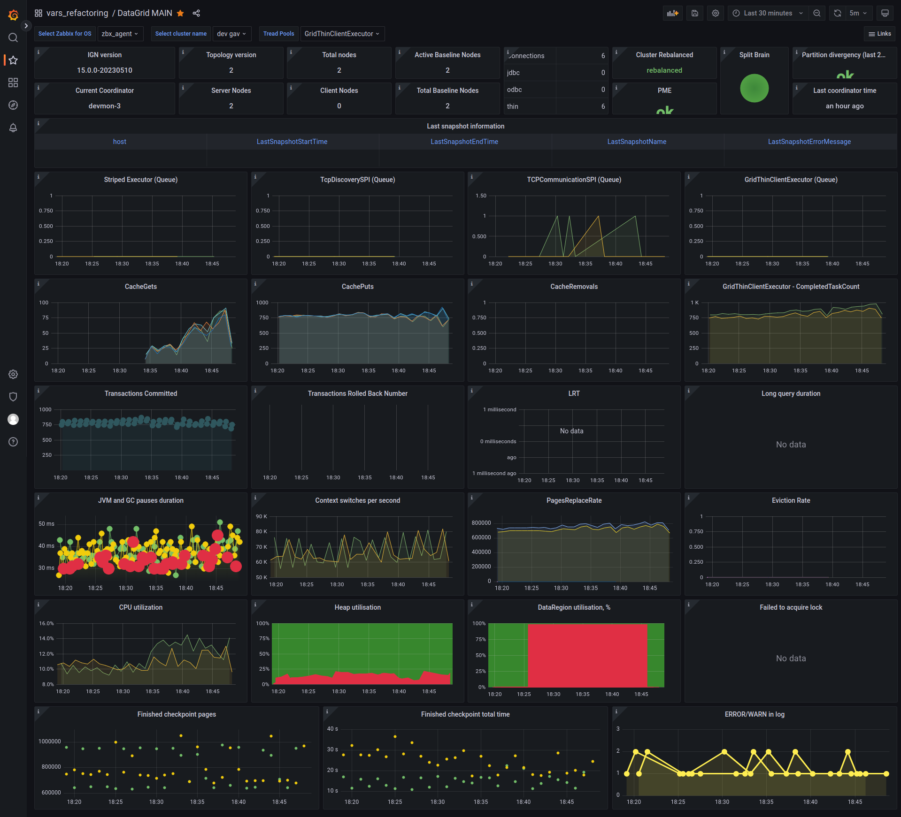

##### Элементы управления

К элементам управления относятся:

- **Select Zabbix for OS** — выбор сервера Zabbix с агентским мониторингом;
- **Select cluster name** — выбор кластера DataGrid;
- **Tread Pools** — выбор имени пула потоков для отображения информации о размере очереди и количестве завершенных задач.

##### Описание панелей

| Название панели | Описание |
|---|---|
| **IGN version** | Версия приложения DataGrid |
| **Topology version** | Текущая версия топологии кластера |
| **Total nodes** | Общее количество узлов в топологии |
| **Active Baseline Nodes** | Количество узлов в baseline в состоянии *online* |
| **Connections** | Количество клиентских подключений сторонних приложений |
| **Cluster Rebalanced** | Показывает состояние кластера: `Rebalanced` / `Not rebalanced` |
| **Split Brain** | Отображает состояние `Split Brain` на основании метрики `CoordinatorSinceTimestamp` |
| **Partition divergency (last 24h)** | Отслеживает в log-файле сообщения о расхождении партиций |
| **Current Coordinator** | Имя узла-координатора |
| **Server Nodes** | Количество серверных узлов в топологии |
| **Client Nodes** | Количество толстых клиентов в топологии |
| **Total Baseline Nodes** | Количество активных серверных узлов в baseline |
| **PME** | Наличие активного процесса Partition Map Exchenge (PME) |
| **Last coordinator time** | Показывает время, прошедшее с момента назначения нового координатора кластера |
| **Last snapshot information** | Информация о последней резервной копии данных кластера |
| **Striped Executor (Queue)** | Размер очереди в потоке `Striped Executor` |
| **TcpDiscoverySPI (Queue)** | Размер очереди на интерфейсе `TCPDiscovery` |
| **TCPCommunicationSPI (Queue)** | Размер очереди на интерфейсе `TCPCommunication` |
| **$threadpool (Queue)** | Размер очереди выбранного пула потоков |
| **CacheGets** | Количество операций `get` для каждого кеша |
| **CachePuts** | Количество операций `put` для каждого кеша |
| **CacheRemovals** | Количество операций `remove` для каждого кеша |
| **$threadpool - CompletedTaskCount** | Количество завершенных заданий для выбранного пула потоков |
| **Transactions Committed** | Количество успешно завершенных транзакций |
| **Transactions Rolled Back Number** | Количество неуспешно завершенных транзакций |
| **LRT** | Показывает наличие и продолжительность Long Running Transaction (LRT) |
| **Long query duration** | Отслеживает в log-файле появление событий `Long query duration` и `Finished long running query` и записывает продолжительность (duration) этих событий |
| **JVM and GC pauses duration** | Продолжительность пауз при работе JVM и `garbage collector` |
| **Context switches per second** | Частота переключений потоков CPU |
| **PagesReplaceRate** | Частота замещения страниц из памяти при обмене данными между `Off-Heap` и PDS |
| **Eviction Rate** | Скорость освобождения страниц памяти в `Off-Heap` |
| **CPU utilization** | Утилизация CPU |
| **Heap utilisation** | Доля занятой памяти в `Heap` |
| **DataRegion utilisation, %** | Доля занятой памяти от выделенной для каждого региона данных |
| **Failed to acquire lock** | Отслеживает в log-файле сообщения о неудачном получении блокировок записей для проведения транзакций (`Failed to acquire lock within provided timeout for transaction`) |
| **Finished checkpoint pages** | Количество страниц памяти, записанных в постоянное хранилище за каждую операцию `checkpoint`. Метрика забирается один раз в минуту. Если в течение минуты было несколько контрольных точек, результаты суммируются |
| **Finished checkpoint total time** | Время, потраченное на процесс `checkpoint`. Метрика забирается раз в минуту. Если в течение минуты было несколько контрольных точек, результаты суммируются |
| **ERROR/WARN in log** | Общее количество сообщений уровня `ERROR` или `Warning` в log-файле DataGrid для каждого узла |

#### DataGrid Rebalancing

Дашборд предназначен для наблюдения за процессами ребалансировки кластера, перемещения партиций, перестроения индексов и для получения прогноза завершения этих процессов.

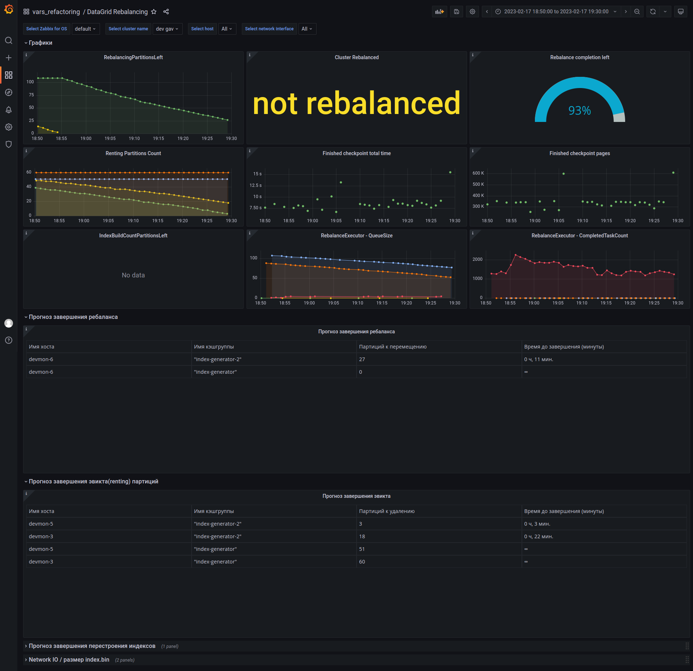

##### Элементы управления

К элементам управления относятся:

- **Select Zabbix for OS** — выбор сервера Zabbix с агентским мониторингом.
- **Select cluster name** — выбор кластера DataGrid.
- **Select host** — переменная для выполнения запросов по выбранным хостам группы ОС.
- **Select network interface** — выбор сетевого интерфейса для панели `Network I/O`.

##### Описание панелей

| Название панели | Описание |
|---|---|
| **RebalancingPartitionsLeft** | Количество партиций, оставшихся до завершения ребалансировки (для каждой кеш-группы) |
| **Cluster Rebalanced** | Текущее состояние кластера: `Not rebalanced` — не ребалансирован; `Rebalanced` — ребалансирован |
| **Rebalance completion left** | Процент выполнения процесса ребалансировки |
| **Renting Partitions Count** | Количество партиций, помеченных на удаление из узла (отдельно для каждого кеша) |
| **Finished checkpoint total time** | Время, за которое был завершен процесс создания контрольной точки |
| **Finished checkpoint pages** | Количество страниц памяти, записанных в постоянное хранилище за каждую операцию `checkpoint` |
| **IndexBuildCountPartitionsLeft** | Количество разделов, которые необходимо обработать для создания или перестройки готовых индексов |
| **RebalanceExecutor - QueueSize** | Размер очереди пула потоков `GridRebalanceExecutor` |
| **RebalanceExecutor - CompletedTaskCount** | Количество завершенных задач пула потоков `GridRebalanceExecutor` |
| **Прогноз завершения ребаланса** | Приблизительное время до завершения процесса ребалансировки (в минутах) для конкретной кеш-группы на конкретном узле кластера |
| **Прогноз завершения эвикта** | Приблизительное время до завершения процесса вытеснения данных (в минутах) для конкретной кеш-группы на конкретном узле кластера |
| **Прогноз завершения перестроения индексов** | Приблизительное время завершения процесса перестроения индексов (в минутах) для конкретной кеш-группы на конкретном узле кластера |
| **Network I/O** | Системные метрики входящего/исходящего трафика для выбранного сетевого интерфейса |
| **.bin file size table** | Размер индексных файлов для каждого кеша на каждом узле кластера |

#### DataGrid Transaction Histogram

Дашборд отображает время, затраченное на выполнение транзакционных операций на уровнях системы (`SystemTime`) и прикладного кода (`UserTime`).

Дашборд будет полезен для оценки производительности транзакционных операций в кластере и поиска проблемной области при выходе за рамки SLA прогнозируемых значений.

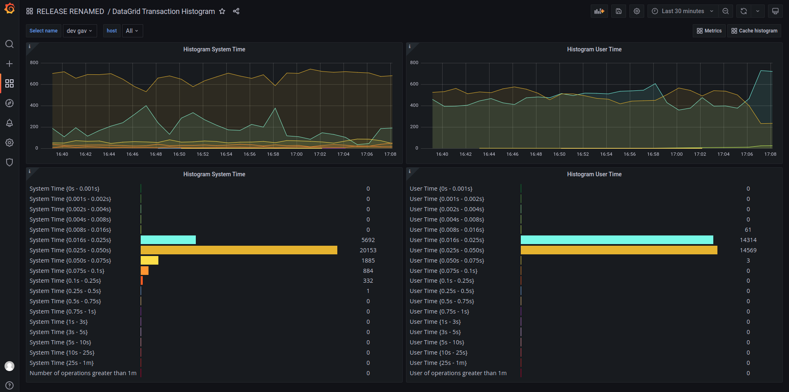

##### Элементы управления

К элементам управления относятся:

- **Select cluster name** — выбор кластера DataGrid.
- **Select JMX host** — переменная для выполнения запросов по выбранным хостам JMX-группы.

##### Описание панелей

Дашборд разделен на две логические части. В левой половине экрана находятся панели с гистограммами времени, затраченного на выполнение транзакций кластером DataGrid. В правой половине экрана — панели с гистограммами времени, затраченного на выполнение клиентской логики транзакций.

#### DataGrid Cache Histogram

Дашборд предназначен для анализа времени выполнения операций с кешами (`put`, `get`, `remove`, `commit`).

Дашборд будет полезен для оценки производительности операций над кешами в кластере и отслеживание выполнения SLA.

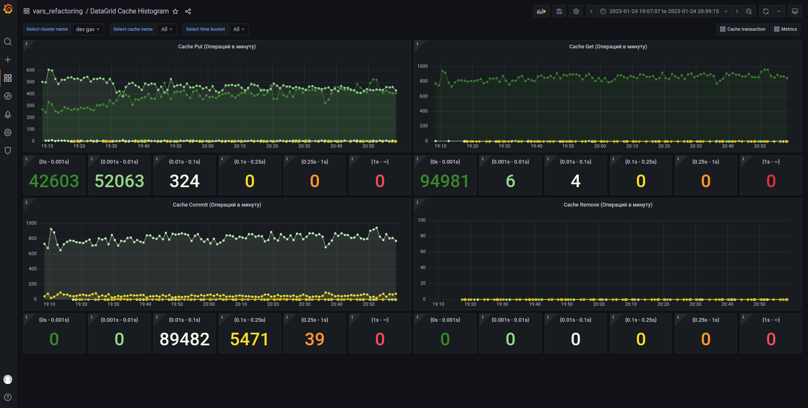

##### Элементы управления

К элементам управления относятся:

- **Select cluster name** — выбор кластера DataGrid.
- **Select cache name** — выбор кешей для анализа.

##### Описание панелей

Дашборд состоит из четырех логических блоков, основанных на метриках-гистограммах `PutTime`, `GetTime`, `CommitTime` и `RemoveTime` соответственно. Эти метрики разбиты на «корзины», соответствующие стандартным временным интервалам:

- **0–0.001 с**;
- **0.001–0.01 с**;
- **0.01–0.1 с**;
- **0.1–0.25 с**;
- **0.25–1 с**;
- **1–бесконечность**.

Каждый блок содержит семь панелей:

- верхняя панель блока отображает изменение метрик в динамике; 
- нижние панели показывают суммарное количество операций, попавших в каждую «корзину» в заданном интервале времени.

#### DataGrid Total status board

Дашборд «здоровья» кластеров. Показывает наличие/отсутствие событий мониторинга на всех кластерах на одном экране.

С помощью данного дашборда можно быстро изучить общую картину наличия возможных проблем на всех доступных кластерах.

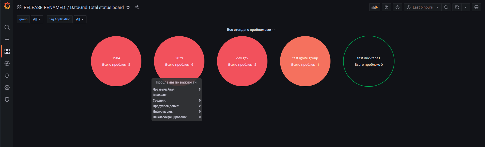

##### Элементы управления

В правом верхнем углу экрана расположены стандартные элементы управления Grafana: выбор временного интервала и интервала обновления данных на дашборде.

:::{admonition} Примечание
:class: note

По умолчанию дашборд показывает проблемы за последний год и выбор временного интервала не влияет на глубину поиска проблем.
:::

- **Select cluster name** — выбор кластера DataGrid.
- **tag Application** — выбор типов проблем.

##### Описание панелей

Каждый кластер обозначен окружностью. Окружности окрашены в цвет самой важной проблемы в соответствии со шкалой важности проблем Zabbix:

| Важность | Severity | Определение | Цвет |
|---|---|---|---|
| Не классифицировано | `Not classified` | Неизвестная важность | Серый |
| Информация | `Information` | В информационных целях | Светло-синий |
| Предупреждение | `Warning` | Предупреждающий | Желтый |
| Средняя | `Average` | Средняя проблема | Оранжевый |
| Высокая | `High` | Произошло что-то важное | Светло-красный |
| Чрезвычайная | `Disaster` | Чрезвычайный. Финансовые потери и так далее | Красный |

Внутри каждой окружности написано имя кластера и общее количество активных проблем на всех узлах кластера. Окружности-кластеры отсортированы в порядке убывания важности проблем. При наведении указателя мыши на окружность появляется `tooltip`-подсказка с таблицей количества проблем каждой важности.

При клике на окружность кластера в новой вкладке браузера откроется дашборд `DataGrid cluster problem list`.

#### DataGrid cluster problem list

Дашборд отображает список активных проблем, найденных системой мониторинга Zabbix. Каждая найденная проблема будет отображаться в разрезе каждого узла кластера.

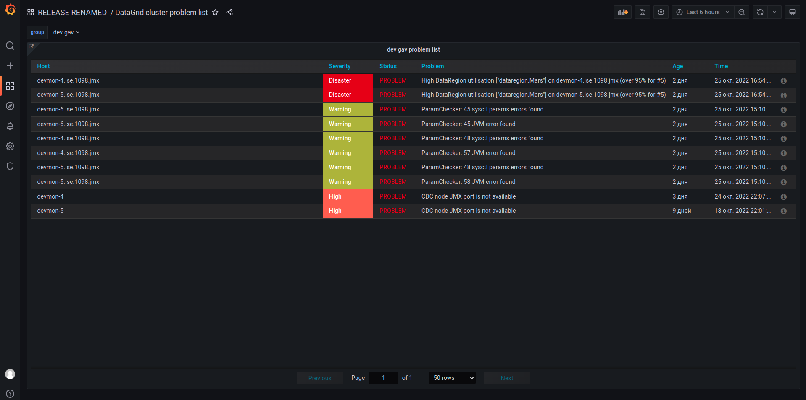

##### Элементы управления

К элементам управления относится **Select cluster name** — выбор кластера DataGrid.

##### Описание панелей

| Название панели | Описание |
|---|---|
| **$group problem list** | Отображает список активных проблем, найденных системой мониторинга Zabbix для выбранного кластера |

:::{admonition} Внимание
:class: danger

Если данный дашборд открыт по ссылке с дашборда `DataGrid Total status board`, будет унаследована настройка фильтрации проблем по типу (Application).

Если дашборд открыт из меню Grafana, то будет отображен полный список проблем без возможности фильтрации.
:::

#### DataGrid Topology Table

Дашборд показывает текущую топологию кластера и историю изменений топологии за выбранный интервал времени. С помощью данного дашборда можно уточнить порядок следования узлов в топологии и узнать имя узла координатора.

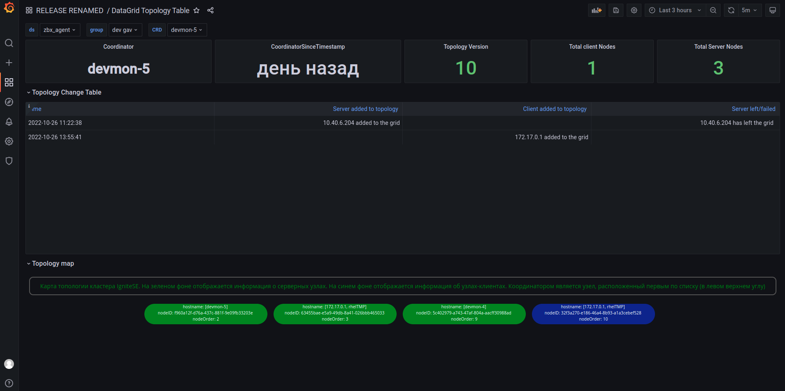

##### Элементы управления

К элементам управления относятся:

- **Select Zabbix for OS** — выбор сервера Zabbix с агентским мониторингом.
- **Select cluster name** — выбор кластера DataGrid.
- **CRD** — выбор узла-координатора.

##### Описание панелей

| Название панели | Описание |
|---|---|
| **Coordinator** | Имя узла-координатора |
| **CoordinatorSinceTimestamp** | Показывает время, прошедшее с момента назначения нового координатора кластера |
| **Topology Version** | Текущая версия топологии кластера |
| **Total client Nodes** | Количество клиентских узлов в кластере |
| **Total Server Nodes** | Количество серверных узлов в кластере |
| **Topology Change Table** | Таблица событий изменения топологии кластера. Берется с координатора |
| **Topology map** | Графическая визуализация топологии кластера. Берется с координатора. Зеленым цветом помечаются серверные узлы, синим цветом — клиентские |

#### DataGrid DCELL Status

Показывает распределение узлов кластера по ячейкам аффинити фильтра (backup filter) и статус узлов (online/offline). С помощью данного дашборда можно понять, какая ячейка деградировала — в случае, если топологию покинул серверный узел. Помимо этого можно узнать, сколько еще узлов в ячейке можно потерять до момента потери данных в кластере.

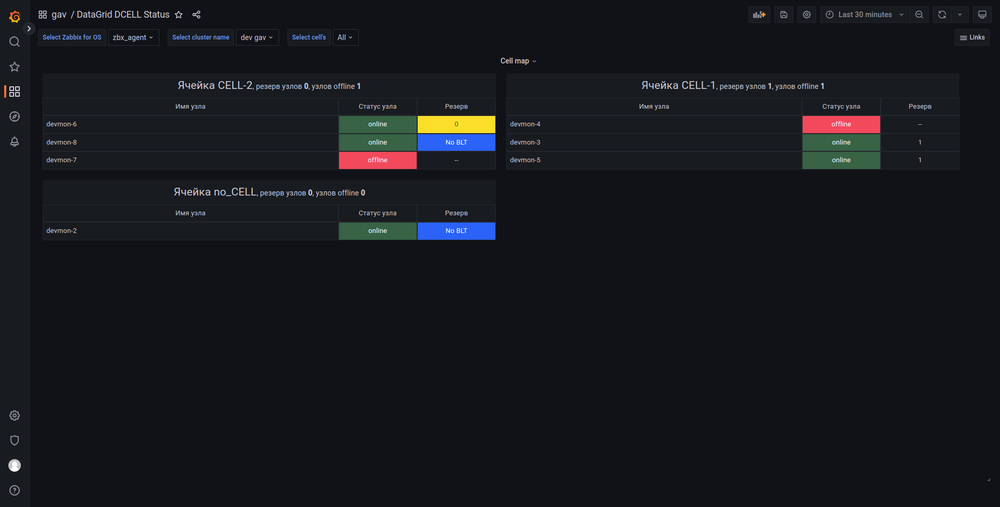

##### Элементы управления

К элементам управления относятся:

- **Select Zabbix for OS** — выбор сервера Zabbix с агентским мониторингом.
- **Select cluster name** — выбор кластера DataGrid.
- **Select cell's** — выбор ячеек для просмотра.

##### Описание панелей

| Название панели | Описание |
|---|---|
| **Cell map** | На панели показано состояние ячеек кластера (Backup Filter) |

**Cell map — условные обозначения:**
- распределение узлов по ячейкам кластера — каждая ячейка представлена отдельной таблицей;
- статус узлов (online/offline);
- резерв узлов в ячейке — количествово узлов, которое можно вывести из топологии без потери данных в кластере;
- узлы, которые нельзя выводить из топологии, чтобы не допустить потери данных (подсвечены желтым цветом в поле **Резерв**);
- наличие факта потери партиций в кластере (узлы подсвечены красным цветом в поле **Резерв**);
- узлы, которые по каким-либо причинам не принадлежат ячейкам (узлы отображаются в отдельной таблице **no_CELL**);
- узлы, которые не входят в базовую (baseline) топологию кластера (узлы подсвечены синим цветом в поле **Резерв**).

#### DataGrid Thread Pools Histogram

Дашборд предназначен для анализа работы потоков кластера. Анализ работы потоков может быть полезен при изучении возможной деградации работы кластера в случае инцидента.

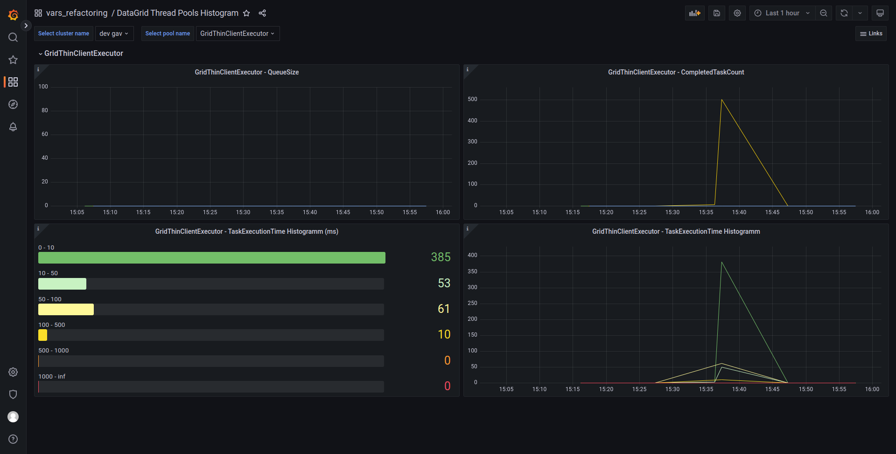

##### Элементы управления

К элементам управления относятся:

- **Select cluster name** — выбор кластера DataGrid.
- **Select pool name** — выбор `tread pool` для анализа.

##### Описание панелей

| Название панели | Описание |
|---|---|
| **$executor - QueueSize** | Размер очереди выбранного пула потоков |
| **$executor - CompletedTaskCount** | Количество завершенных заданий для выбранного пула потоков |
| **$executor - TaskExecutionTime Histogramm (ms)** | Гистограмма времени выполнения заданий выбранным пулом потоков |
| **$executor - TaskExecutionTime Histogramm** | Гистограмма времени выполнения заданий выбранным пулом потоков в динамике |

#### DataGrid Client connector

Дашборд для изучения клиентских подключений к кластеру.

С помощью панелей на данном дашборде можно получить следующую информацию:

- общее количество клиентских подключений на кластере;
- количество клиентских подключений в разрезе технологии подключения (Thin, JDBC, ODBC) на всем кластере или на выбранном узле кластера.

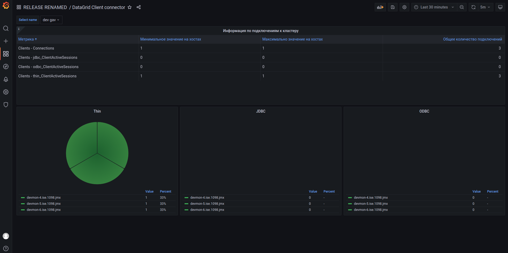

##### Элементы управления

К элементам управления относится **Select cluster name** — выбор кластера DataGrid.

##### Описание панелей

| Название панели | Описание |
|---|---|
| **Информация по подключениям к кластеру** | Сводная таблица всех активных подключений |
| **Thin** | Диаграмма распределения подключений тонких клиентов по узлам кластера |
| **JDBC** | Диаграмма распределения подключений JDBC по узлам кластера |
| **ODBC** | Диаграмма распределения подключений ODBC по узлам кластера |

#### DataGrid Cluster node left

Дашборд показывает кластеры, для которых в выбранный интервал времени в Zabbix зафиксированы события `Active baseline nodes count does not match plan`.

Событие `Active baseline nodes count does not match plan` наступает тогда, когда количество узлов в baseline не соответствует ожидаемому.

Ожидаемое количество узлов указывается в макросе `{$PLAN_CNT_SRV_NODES}` для шаблона `SBT DataGrid JMX`.

Красным цветом выделены кластеры с активными событиями, желтым — кластеры, для которых это событие фиксировалось в выбранном интервале времени, но сейчас проблема решена.

При клике по строке открывается дашборд `DataGrid Topology Table` для выбранного кластера.

##### Элементы управления

Пользовательские элементы управления расположены в левом верхнем углу окна дашборда: **Select cluster name** — выбор одного или нескольких имен кластеров для отображения на дашборде.

:::{admonition} Примечание
:class: note

Будут показаны только те кластеры, для которых в выбранный интервал времени Zabbix зафиксировал события `Active baseline nodes count does not match plan`.
:::

#### DataGrid JVM Memory Pools Usage

Дашборд для анализа загруженности областей пулов памяти. С помощью данных панелей можно более детально оценить утилизацию `heap` JVM.

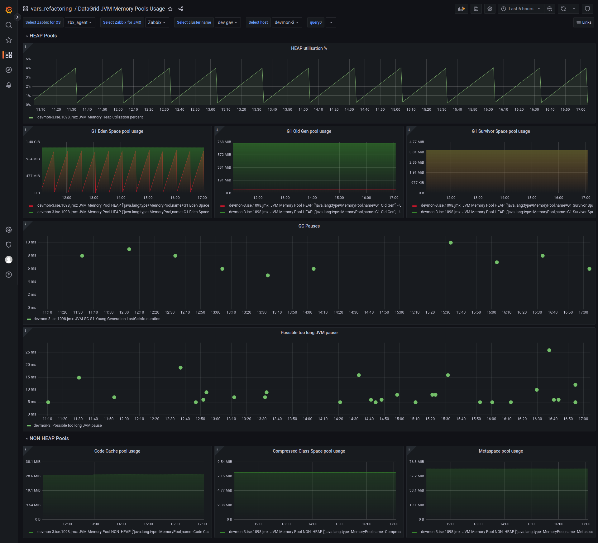

##### Элементы управления

К элементам управления относятся:

- **Select Zabbix for OS** — выбор сервера Zabbix с агентским мониторингом.
- **Select Zabbix for JMX** — выбор сервера Zabbix с мониторингом JMX.
- **Select cluster name** — выбор кластера DataGrid.
- **Select host** — переменная для выполнения запросов по выбранным хостам группы ОС.

##### Описание панелей

| Название панели | Описание |
|---|---|
| **HEAP utilisation %** | Динамика изменения использования памяти `heap` в процентах от максимально возможной |
| **$HEAP_POOLS pool usage** | Группа панелей показывает использование пулов памяти `heap`. Количество и названия панелей зависят от конфигурации JVM |
| **GC Pauses** | Продолжительность пауз при работе `garbage collector` |
| **Possible too long JVM pause** | Продолжительность JVM-пауз |
| **$NON_HEAP_POOLS pool usage** | Группа панелей показывает использование пулов памяти `heap`. Количество и названия панелей зависят от конфигурации JVM |

#### DataGrid Cache info

Дашборд показывает размер кешей в кластере и распределение ключей между основными и резервными партициями на узлах кластера.

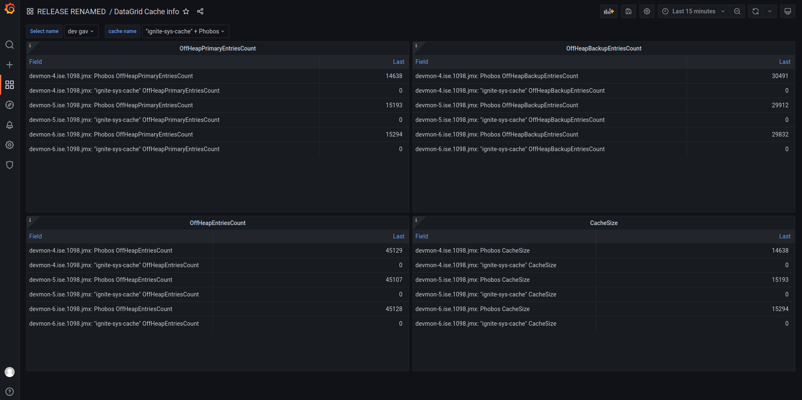

##### Элементы управления

К элементам управления относятся:

- **Select cluster name** — выбор кластера DataGrid.
- **cache name** — выбор одного или нескольких кешей для отображения.

##### Описание панелей

| Название панели | Описание |
|---|---|
| **OffHeapPrimaryEntriesCount** | Количество записей в основных партициях |
| **OffHeapBackupEntriesCount** | Количество записей в резервных партициях |
| **OffHeapEntriesCount** | Общее количество записей |
| **CacheSize** | Количество ключей в кеше (не включая ключи, у которых значение равно `null`) |

#### DataGrid CDC replication union

Дашборд предназначен для контроля процесса репликации кластера (CDC). С помощью панелей, которые размещены на дашборде, можно отслеживать количество переданных событий репликации и статус узлов CDC.

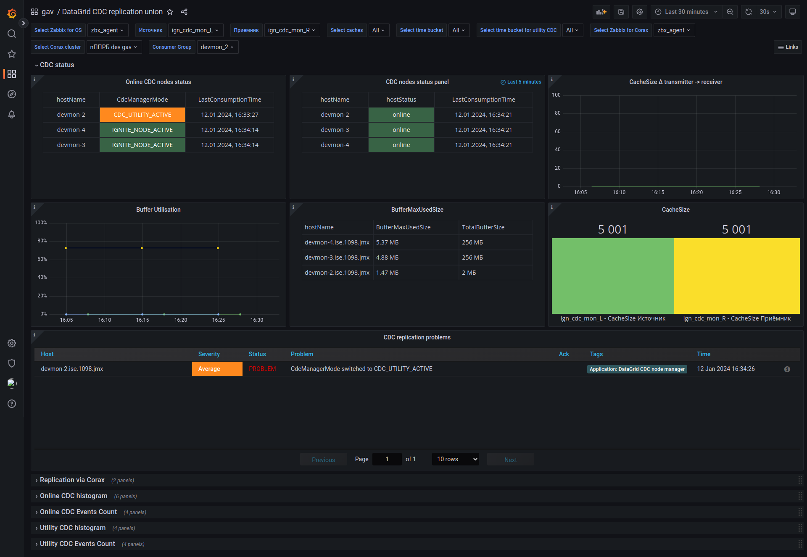

##### Элементы управления

К элементам управления относятся:

- **Select Zabbix for OS** — выбрать сервер Zabbix с агентским мониторингом.
- **Источник** — выбрать кластер-источник данных для репликации.
- **Приемник** — выбрать кластер, принимающий данные.
- **Select caches** — выбрать кеши для контроля процесса репликации.
- **Select time bucket** — выбрать временные корзины для отображения.
- **Select time bucket for utility CDC** — выбрать временные корзины для отображения.
- **Select Zabbix for Corax** — выбрать сервер Zabbix с агентским мониторингом целевого кластера Corax.
- **Select Corax cluster** — выбрать целевой кластер Corax.
- **Consumer Group** — выбрать группу потребителей.

##### Описание панелей

| Название панели | Описание |
|---|---|
| **Online CDC nodes status** | Состояние узлов (`online-CDC`), выполняющих репликацию |
| **Utility-CDC nodes status** | Состояние узлов (`utility-CDC`), выполняющих репликацию |
| **CacheSize Δ transmitter → receiver** | Количество ключей в выбранных кешах в передающем и принимающем кластере. Большое отставание принимающего кластера от передающего может свидетельствовать о проблемах репликации |
| **Buffer Utilisation** | Текущий объем данных, накопленных в буфере |
| **BufferMaxUsedSize** | Максимальный размер данных, хранившихся в буфере |
| **CacheSize** | Количество ключей в выбранных кешах в передающем и принимающем кластере. Большое отставание принимающего кластера от передающего может свидетельствовать о проблемах репликации |
| **CDC replication problems** | Список проблем, обнаруженных Zabbix на CDC-узлах |
| **Kafka to ignite nodes** | Состояние узлов `kafka-to-ignite`, выполняющих репликацию |
| **Динамика изменений лага по выбранным топикам и группам** | Отставание данных на принимающем кластере от передающего. Большие значения задержки могут говорить о проблемах в работе процесса репликации |
| **EventCaptureTime histogram** | Гистограмма времени, которое прошло между созданием `DataRecord`, содержащего изменения данных, и началом обработки этих данных в `CdcConsumer` |
| **EventCaptureTime histogram** | Гистограмма времени, которое прошло между созданием `DataRecord`, содержащего изменения данных, и началом обработки этих данных в `CdcConsumer` в динамике |
| **EventsConsumptionTime histogram** | Гистограмма времени, потраченного на обработку порций событий в `CdcConsumer` |
| **EventsConsumptionTime histogram** | Гистограмма времени, потраченного на обработку порций событий в `CdcConsumer` в динамике |
| **MetadataUpdateTime histogram** | Гистограмма времени, потраченного на обработку метаданных в `CdcConsumer` |
| **MetadataUpdateTime histogram** | Гистограммы времени, потраченного на обработку метаданных в `CdcConsumer` в динамике |
| **CDC Events Count** | Количество событий, обработанных в кластере-источнике |
| **CDC Events Count, Δ** | Количество событий, обработанных в кластере-источнике |
| **CDC consumer  Events Count** | Количество сообщений, переданных в целевой кластер |
| **CDC consumer  Events Count, Δ** | Количество сообщений, переданных в целевой кластер |
| **EventCaptureTime histogram** | Гистограмма времени, которое прошло между созданием `DataRecord`, содержащего изменения данных, и началом обработки этих данных утилитой `Ignite-CDC` в `CdcConsumer` |
| **EventCaptureTime histogram** | Гистограмма времени, которое прошло между созданием `DataRecord`, содержащего изменения данных, и началом обработки этих данных утилитой `Ignite-CDC` в `CdcConsumer` в динамике |
| **MetadataUpdateTime histogram** | Гистограммы времени, потраченного утилитой `Ignite-CDC` на обработку мета данных в `CdcConsumer` |
| **MetadataUpdateTime histogram** | Гистограммы времени, потраченного утилитой `Ignite-CDC` на обработку метаданных в `CdcConsumer` в динамике |
| **CDC Events Count** | Количество событий, обработанных в кластере-источнике утилитой `Ignite-CDC` |
| **CDC Events Count, Δ** | Количество событий, обработанных в кластере-источнике утилитой `Ignite-CDC` |
| **CDC consumer  Events Count** | Количество сообщений, переданных утилитой `Ignite-CDC` в целевой кластер |
| **CDC consumer  Events Count, Δ** | Количество сообщений, переданных утилитой `Ignite-CDC` в целевой кластер |

**Описание полей в таблице Online CDC nodes status:**

- **hostName** — имя хоста, на котором запущен процесс CDC.
- **LastConsumptionTime** — время последней обработки порции событий в `CdcConsumer`.
- **CdcManagerMode** — состояние процесса CDC:
  - `IGNITE_NODE_ACTIVE` — плагин обрабатывает события и поставляет данные в `CdcConsumer` внутри узла DataGrid;
  - `CDC_UTILITY_ACTIVE` — утилита `Ignite-CDC` обрабатывает архивные WAL-сегменты и поставляет данные в `CdcConsumer`.

**Описание полей в таблице Utility-CDC nodes status:**

- **hostName** — имя хоста, на котором запущен процесс CDC.
- **hostStatus** — состояние процесса CDC:
  - `online` — процесс запущен;
  - `offline` — процесс не запущен;

#### DataGrid CDC replication

Дашборд предназначен для контроля процесса репликации кластера (CDC). С помощью панелей, размещенных на дашборде, можно отслеживать количество переданных событий репликации и статус узлов CDC.

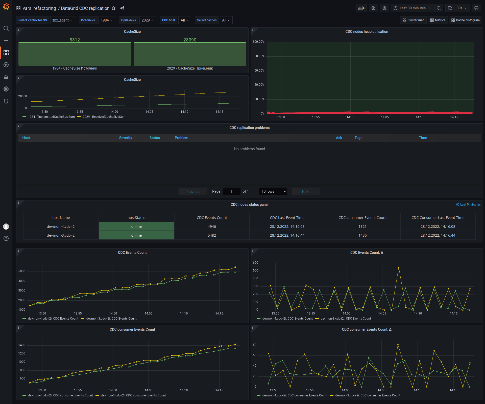

##### Элементы управления

К элементам управления относятся:

- **Select Zabbix for OS** — выбрать сервер Zabbix с агентским мониторингом.
- **Источник** — выбрать кластер-источник данных для репликации.
- **Приемник** — выбрать кластер, принимающий данные.
- **CDC host** — выбрать узлы, осуществляющие перенос данных.
- **Select caches** — выбрать кеши для контроля процесса репликации.

##### Описание панелей

| Название панели | Описание |
|---|---|
| **CacheSize** | Количество ключей в выбранных кешах в передающем и принимающем кластере. Большое отставание принимающего кластера от передающего может свидетельствовать о проблемах репликации |
| **CDC nodes heap utilisation** | Утилизация heap-памяти на узлах (CDC), выполняющих репликацию |
| **CacheSize** | Количество ключей в выбранных кешах в передающем и принимающем кластере. Большое отставание принимающего кластера от передающего может свидетельствовать о проблемах репликации |
| **CDC replication problems** | Список проблем, обнаруженных Zabbix на CDC-узлах |
| **CDC nodes status panel** | Состояние узлов (CDC), выполняющих репликацию |
| **CDC Events Count** | Количество событий, обработанных в кластере-источнике |
| **CDC Events Count, Δ** | Количество событий, обработанных в кластере-источнике |
| **CDC consumer Events Count** | Количество сообщений, переданных в целевой кластер |
| **CDC consumer Events Count, Δ** | Количество сообщений, переданных в целевой кластер |

**Описание полей в таблице CDC nodes status panel:**

- **hostName** — имя хоста, на котором запущен процесс CDC.
- **hostStatus** — состояние процесса CDC:
  - `online` — процесс запущен;
  - `offline` — процесс не запущен.
- **CDC Events Count** — количество событий, полученных процессом CDC.
- **CDC Last Event Time** — время последнего события, полученного процессом CDC.
- **CDC Сonsumer Events Count** — количество событий, переданных в принимающий кластер.
- **CDC Consumer Last Event Time** — время последнего события, обработанного процессом CDC.

#### DataGrid CDC replication via Corax

Дашборд предназначен для контроля процесса CDC-репликации кластера с использованием транспорта Corax. С помощью панелей, которые размещены на дашборде, можно отслеживать количество переданных событий репликации и статус CDC-узлов. Дополнительно можно оценить задержку чтения сообщений в топиках Corax, которые используются для репликации — так можно оценить задержку репликации между кластерами.

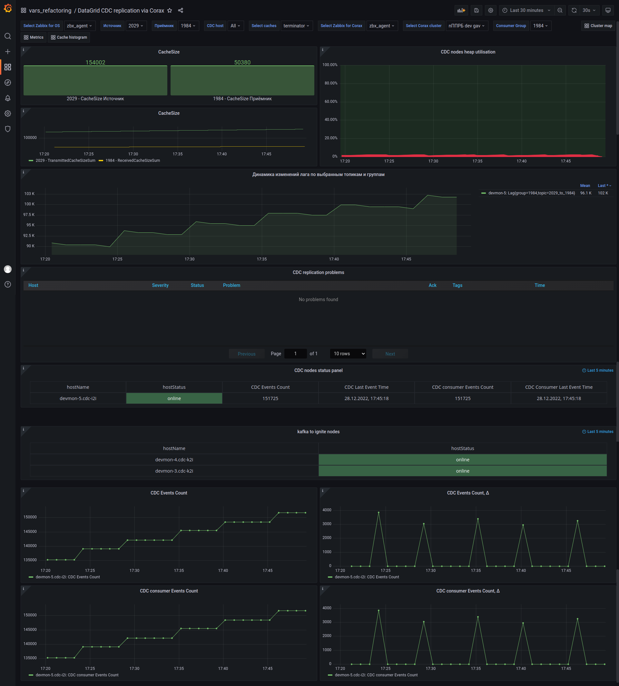

##### Элементы управления

К элементам управления относятся:

- **Select Zabbix for OS** — выбрать сервер Zabbix с агентским мониторингом.
- **Источник** — выбрать кластер-источник данных для репликации.
- **Приемник** — выбрать кластер, принимающий данные.
- **CDC host** — выбрать узлы, осуществляющие перенос данных.
- **Select caches** — выбрать кеши для контроля процесса репликации.
- **Select Zabbix for Corax** — выбрать сервер Zabbix с агентским мониторингом целевого кластера Corax.
- **Select Corax cluster** — выбрать целевой кластер Corax.
- **Consumer Group** — выбрать группу потребителей.

##### Описание панелей

| Название панели | Описание |
|---|---|
| **CacheSize** | Количество ключей в выбранных кешах в передающем и принимающем кластере. Большое отставание принимающего кластера от передающего может свидетельствовать о проблемах репликации |
| **CDC nodes heap utilisation** | Утилизация heap-памяти на узлах (CDC), выполняющих репликацию |
| **CacheSize** | Количество ключей в выбранных кешах в передающем и принимающем кластере. Большое отставание принимающего кластера от передающего может свидетельствовать о проблемах репликации |
| **Динамика изменений лага по выбранным топикам и группам** | Отставание данных на принимающем кластере от передающего. Большие значения задержки могут говорить о проблемах в работе процесса репликации |
| **CDC replication problems** | Список проблем, обнаруженных Zabbix на CDC-узлах |
| **CDC nodes status panel** | Состояние узлов (CDC), выполняющих репликацию |
| **Kafka to ignite nodes** | Состояние узлов `kafka-to-ignite`, выполняющих репликацию |
| **CDC Events Count** | Количество событий, обработанных в кластере-источнике |
| **CDC Events Count, Δ** | Количество событий, обработанных в кластере-источнике |
| **CDC consumer Events Count** | Количество сообщений, переданных в целевой кластер |
| **CDC consumer Events Count, Δ** | Количество сообщений, переданных в целевой кластер |

**Описание полей в таблице CDC nodes status panel**

- **hostName** — имя хоста, на котором запущен процесс CDC.
- **hostStatus** — состояние процесса CDC:
  - `online` — процесс запущен;
  - `offline` — процесс не запущен.

- **CDC Events Count** — количество событий, полученных процессом CDC.
- **CDC Last Event Time** — время последнего события, полученного процессом CDC.
- **CDC Сonsumer Events Count** — количество событий, переданных в топик Corax.
- **CDC Consumer Last Event Time** — время последнего события, переданного процессом CDC.

#### DataGrid SnapshotList

Дашборд для контроля создания снепшотов на выбранных кластерах DataGrid. Желтым выделены кластеры, на которых снепшоты не делались более 48 часов. Красным выделяются кластеры, на которых процесс создания снепшота завершился с ошибкой или снепшот не найден.

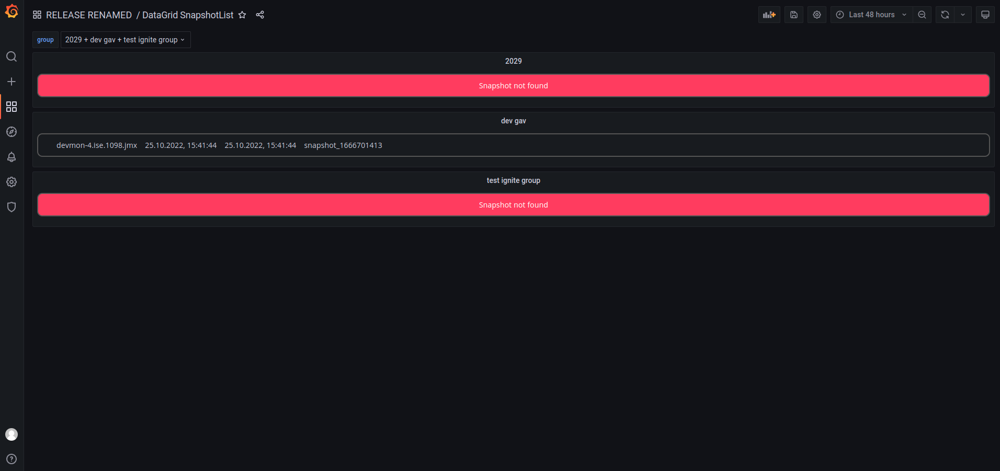

**Выводимая информация о снепшоте:**

- имя узла, на котором находится самая новая версия снепшота;
- время начала создания снепшота;
- время окончания создания снепшота;
- имя снепшота;
- сообщение об ошибке (если есть).

##### Элементы управления

К элементам управления относится **Select cluster name** — выбор кластера DataGrid.

#### DataGrid ParametersChecker

Дашборд предназначен для просмотра расхождений, найденных плагином `ParametersChecker`, в конфигурации узла кластера.

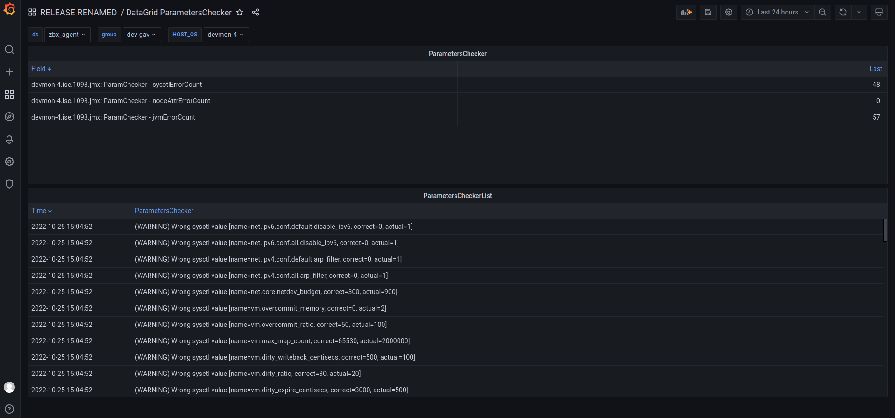

##### Элементы управления

К элементам управления относятся:

- **Select Zabbix for OS** — выбрать сервер Zabbix с агентским мониторингом.
- **Select cluster name** — выбрать кластер DataGrid.
- **Select OS host** — переменная для выполнения запросов по выбранным хостам группы ОС.

##### Описание панелей

| Название панели | Описание |
|---|---|
| **ParametersChecker** | Количество проблем, обнаруженных на выбранных узлах с помощью `ParametersChecker` |
| **ParametersCheckerList** | Список проблем для выбранных узлов (на основании сообщений в log-файле каждого узла) |

#### DataGrid PDS forecast

Дашборд предназначен для анализа утилизации памяти, выделенной под Persistence Data Storage (PDS) и прогнозирования времени, оставшегося до исчерпания выделенных объемов памяти.

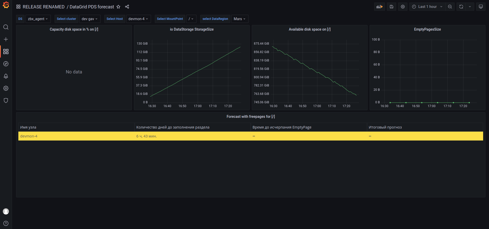

##### Элементы управления

К элементам управления относятся:

- **Select Zabbix for OS** — выбрать сервер Zabbix с агентским мониторингом.
- **Select cluster name** — выбрать кластер DataGrid.
- **Select Host** — переменная для выполнения запросов по выбранным хостам группы ОС.
- **Select MountPoint** — выбрать дисковое хранилище, на котором размещено PDS.
- **select DataRegion** — выбрать регион данных для анализа.

##### Описание панелей

| Название панели | Описание |
|---|---|
| **Capacity disk space in % on [$mount]** | Динамика изменения занятого дискового пространства для выбранного дискового хранилища в процентах |
| **Available disk space on [$mount]** | Динамика изменения свободного объема выбранного дискового хранилища (байты) |
| **io DataStorage StorageSize** | Динамика изменения дискового пространства, занимаемого для хранения PDS, (байты) |
| **EmptyPagesSize** | Динамика изменения объемов памяти, занимаемой пустыми страницами для каждого региона данных, (байты) |
| **Forecast with freepages for [$mount]** | Прогноз времени, оставшегося до исчерпания дискового пространства с учетом использования пустых страниц |

#### DataGrid Dataregion utilization

Дашборд служит для наблюдения за утилизацией оперативной памяти, выделенной под регионы данных, и позволяет определить приблизительное количество дней, оставшихся до заполнения региона данных на узле.

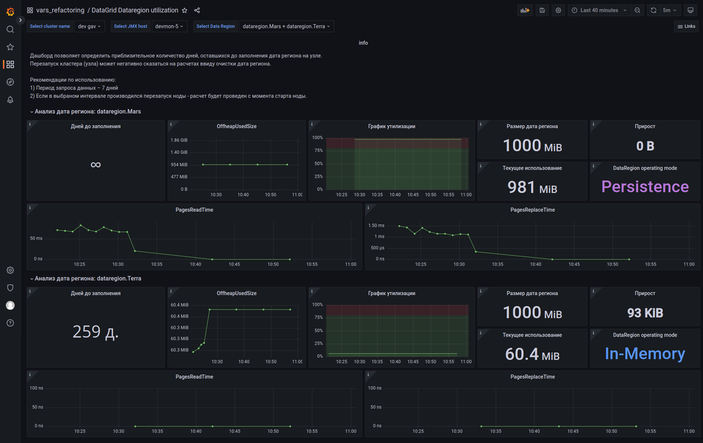

##### Элементы управления

К элементам управления относятся:

- **Select cluster name** — выбрать кластер DataGrid.
- **Select JMX host** — переменная для выполнения запросов по выбранным хостам группы JMX.
- **Select Data Region** — выбрать регионов данных для анализа.

##### Описание панелей

| Название панели | Описание |
|---|---|
| **Дней до заполнения** | Прогноз времени до заполнения региона данных |
| **OffheapUsedSize** | Динамика изменения использования памяти региона данных (байты) |
| **График утилизации** | Динамика изменения использования памяти `$dataRegion` в процентах от максимально возможного |
| **Размер региона данных** | Максимальный размер региона данных `$dataRegion` |
| **Прирост** | Прирост региона данных `$dataRegion` в выбранном интервале времени |
| **Текущее использование** | Текущее использование региона данных `$dataRegion` |
| **DataRegion operating mode** | Режим работы региона данных |
| **PagesReadTime** | Общее время чтения страниц (нс) для региона данных `$dataRegion` |
| **PagesReplaceTime** | Общее время замены страниц (нс) для региона данных `$dataRegion` |

**Варианты DataRegion operating mode:**
- **In-Memory** — данные региона данных хранятся только в оперативной памяти.
- **Persistence** — данные региона данных копируются на жесткий диск.
- **INACTIVE/Unknown** — кластер не активирован или не удалось определить режим региона данных.

:::{admonition} Примечание
:class: note

Перечисленный набор панелей будет показан для каждого выбранного региона данных.
:::