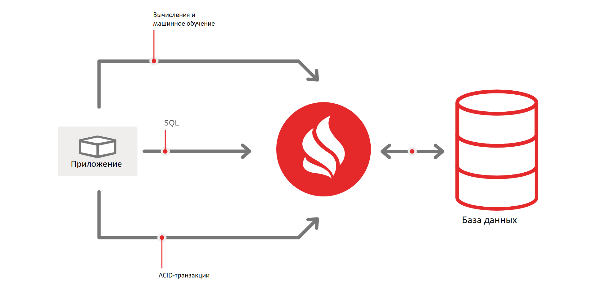

# Назначение

Компонент DataGrid (IGNT) продукта Platform V DataGrid (IGN) (далее – DataGrid) может использоваться для решения следующих задач:

-   хранение любых данных в формате «ключ-значение»;
-   создание индексов по данным и использование SQL;
-   хранение данных одновременно в оперативной памяти и, при необходимости, на диске (native persistence);
-   выполнение быстрых распределенных вычислений (map reduce);
-   использование DataGrid как in-memory слоя (интеграция с реляционными СУБД и No-SQL БД «из коробки»);
-   хранение веб-сессий при использовании микросервисной архитектуры;
-   обработка больших объемов данных онлайн в параллельных процессах (OLAP).

DataGrid обладает следующим функционалом:

-   возможность сохранения данных на диск;
-   распределенное хранилище «ключ-значение»;
-   резервное копирование;
-   прозрачное шифрование хранимых данных;
-   поддержка требований ACID к транзакциям;
-   распределенный SQL-кластер;
-   возможность кеширования данных из реляционных СУБД;
-   распределенные вычисления над большим объемом данных;
-   параллельная обработка массивов данных (MPP);
-   отслеживание изменений данных в кеше;
-   разработка функциональности на заказ под нужды клиента;
-   распределенная инфраструктура для микросервисных приложений.

## Цель создания

DataGrid — это горизонтально масштабируемая, отказоустойчивая платформа для хранения и обработки больших объемов данных в оперативной памяти кластера. DataGrid — доработанное решение на основе программного обеспечения с открытым исходным кодом Apache Ignite.

DataGrid может использоваться в составе решения Platform V, а также в составе других решений.

Основное отличие DataGrid от Apache Ignite — плагин безопасности DataGrid.

## Основные функции

| Название функции | Потребитель функции | Аргументы функции | Результат |
|---|---|---|---|
| Сохранение данных в хранилище «ключ-значение» | Любое прикладное приложение | Ключ, данные | В хранилище «ключ-значение» появляется запись с данными |
| Считывание данных из хранилища «ключ-значение» по ключу | Любое прикладное приложение | Ключ | Приложение получает данные из хранилища «ключ-значение» по ключу |
| Удаление данных из хранилища «ключ-значение» по ключу | Любое прикладное приложение | Ключ | Данные удаляются из хранилища «ключ-значение» |
| Изменение данных в хранилище «ключ-значение» по ключу | Любое прикладное приложение | Ключ, данные | В хранилище «ключ-значение» изменяются данные |

Работоспособность программного компонента предусмотрена только и исключительно при его использовании способами, описанными в документации продукта. При использовании программного продукта иными способами, работоспособность программного продукта не гарантируется.

## Топология

### Базовая топология (Baseline Topology)

**Baseline Topology (BLT)** — это набор серверных узлов в кластере DataGrid, одновременно сохраняющих данные в ОЗУ и в Persistence-хранилище (Persistent Store).

Функциональность узлов BLT ничем не ограничена и они работают так же, как и обычные серверные узлы, выступая в роли контейнера для данных DataGrid.

BLT используется:

-   для избежания ненужной ребалансировки данных при перезагрузке узла;
-   для автоматической активации кластера после его перезагрузки и подключения к нему всех узлов.

:::{admonition} Примечание
:class: note

При перезапуске узла ребалансировка происходит дважды:

1. При отключении узла.
2. При повторном добавлении узла в кластер.
:::

Базовая топология изменяется автоматически при включенной функции автоматической настройки.

#### Автоматическая настройка базовой топологии

Когда данная функция включена, кластер отслеживает состояние своих серверных узлов и автоматически настраивает базовую топологию, если топология кластера остается стабильной в течение заданного периода времени.

Автоматическая настройка базовой топологии происходит по следующему алгоритму:

1.  DataGrid ожидает в течение заданного периода времени (по умолчанию 5 минут).
2.  Если топология не меняется в заданный период времени ожидания, DataGrid автоматически настраивает базовую топологию для текущего набора узлов.
3.  Если набор узлов изменяется в течение заданного периода времени ожидания, счетчик времени ожидания сбрасывается и процесс повторяется.

Это поведение используется по умолчанию для in-memory-кластеров, значение тайм-аута равно «0». Это означает, что базовая топология изменяется сразу после подключения или отключения серверных узлов от кластера. 

Для persistence-кластеров функция автонастройки базовой топологии по умолчанию отключена. Чтобы включить функцию, воспользуйтесь командой `control.sh|bat --baseline auto_adjust enable timeout 30000`. Подробнее о подключении и отключении функции с помощью `control.sh` смотрите в разделе [«Автоматическая настройка базовой топологии (Autoadjustment)»](../../administration-guide/md/control-sh.md) документа «Руководство по системному администрированию».

### In-Memory Data Grid (IMDG)

**IMDG** — это read-through/write-through-стратегия кеширования, в которой приложение использует DataGrid в качестве первичного хранилища данных. Для записи и чтения данных приложения используют in-memory-кластер. Он автоматически сохраняет все изменения в любые доступные БД. Это позволяет достичь полной согласованности изменений в БД с данными в памяти. Platform V DataGrid сохраняет объекты off-heap и на диске в случае включения функции «Persistence» («Сохранение»).

IMDG сохраняет данные непосредственно в ОЗУ, а традиционные RDBMS — в файловую систему. Это дает значительное ускорение выполнения CRUD-операций (создание, чтение, обновление и удаление).

#### Характеристики IMDG в DataGrid

-   поддержка распределенных ACID-транзакций — одновременно можно выполнить более одной операции кеширования;
-   гибкое масштабирование узлов в DataGrid, позволяющее добавлять дополнительные узлы и увеличивать объем сохраняемых данных; сохранение данных off-heap;
-   возможность сохранения данных в RDBMS и базы данных NoSQL; кеш-API, совместимые с J-cache (JSR 107);
-   поддержка интеграции со Spring Framework — возможность помечать Java-методы кеш-аннотацией Spring для доступа к данным из кеша DataGrid;
-   возможность настройки гибернации на сохранение кеша L2 в сетке данных; кластеризация данных веб-сессий.

### In-memory Database (IMDB)

**IMDB** — это полнофункциональная KVDBMS, которая, как и IMDG, сохраняет данные в ОЗУ. При запросе в базу данных осуществляется доступ к оперативной памяти, а не к файловой системе, тогда как обычная RDBMS обращается к диску, за счет чего быстродействие IMDB гораздо выше, чем у стандартной RDBMS.

:::{admonition} Примечание
:class: note

В отличие от IMDG, IMDB не имеет функции параллельной обработки распределенных SQL-соединений и не поддерживает масштабирование на уровне IMDG.
:::

#### Характеристики IMDB

-   сохранение данных в ОЗУ, а не в файловую систему, что повышает быстродействие по сравнению со стандартными RDBMS;
-   защита данных в ОЗУ от потери при перезагрузках/ошибках, благодаря возможности настройки восстановления данных из журнала транзакций, содержащего в себе данные по каждой транзакции;
-   полная поддержка ANSI SQL.

### In-memory caching

DataGrid — это распространенная система in-memory-кеширования, поддерживающая ANSI SQL, ACID-транзакции, совместные вычисления и библиотеки машинного обучения. DataGrid имеет все необходимые компоненты, необходимые для ускорения работы приложений (в том числе API) и кеширования сессий, а также ускорения работы баз данных и микросервисов.

#### Характеристики in-memory caching

Кластер в DataGrid может состоять из нескольких соединенных между собой физических или виртуальных компьютеров. Это, как и в случае с классическим распределенным кешем, позволяет использовать всю доступную память и ресурсы процессора.

Разница между DataGrid и классическим распределенным кешем состоит в способе использования кластера. При использовании DataGrid, кроме запуска API с данными в формате «ключ-значение», пользователь также может создавать распределенные SQL-запросы и объединять или группировать различные наборы данных. При необходимости соблюдения строгой последовательности данных, пользователь может выполнять кросс-кеш-ACID-транзакции как в оптимистическом, так и в пессимистическом режимах. А если приложение, например, производит вычисления, смешиваемость данных и нагрузка на сеть может быть снижена при помощи запуска API совместных вычислений и распределенного машинного обучения на узлах кластера, на которых хранятся данные.

### IMDG с поддержкой SQL

Распределенная data grid, в которой пользователь может выполнять запросы ANSI SQL-99 (`SELECT`, `UPDATE`, `INSERT`, `MERGE`, `DELETE`) для управления кешем.

#### Характеристики IMDG с поддержкой SQL

Кеш-API DataGrid использует методы `get / put / remove` для взаимодействия с кешем, однако SQL API предлагает бо́льшую гибкость. Например, можно выполнить запрос `SELECT` для выгрузки объектов или обновления определенных записей (используя `where`), а также для удаления объектов из кеша.

Приложения могут взаимодействовать с DataGrid, используя собственные API и синтаксис ANSI SQL-99 посредством ODBC и JDBC API DataGrid.

::::{admonition} Пример
:class: hint 
:collapsible:

**Задача:** сохранить данные по студентам в таблицу базы данных под названием `student`.

**Решение:** in-memory-решение позволит создать кеш студентов, куда будут сохраняться данные. В качестве «ключа» будет сохраняться ID студента, а в качестве «значения» – его персональные данные. Это значит, что, зная ID студента, можно легко выгрузить его персональные данные при помощи `cache.get(StudentId)`. API SQL позволяет запросить информацию о студенте, используя их поля.

:::{code-block} sql
:caption: SQL
SELECT * FROM student WHERE firstName = 'john'
:::

Класс `student` должен быть сериализуемым, как в примере ниже:

:::{code-block} java
:caption: Java
public class Student implements Serializable {
private static final long serialVersionUID = 1L;
@QuerySqlField(index = true)
private Long studentId;
@QuerySqlField(index= true)
private String firstName;
@QuerySqlField(index= true)
private String lastName;
 ...
}
:::
::::

Некоторые поля в данном примере аннотированы при помощи `@QuerySqlField`, что дает пользователям возможность создавать запросы по этим полям. То есть, можно создать SQL-запрос и получить данные о студенте по его ID (`studentId`), имени (`firstName`) или фамилии (`lastName`).

### Compute Grid

**Compute Grid** — это распространенная in-memory-платформа MapReduce/ForkJoin или Splitter-Aggregator. Она позволяет обрабатывать данные параллельно, что сокращает общее время обработки.

Платформа также полезна и при отсутствии необходимости разделения и параллелизации вычислительных задач: благодаря имеющейся в функциональности Compute Grid возможности выгрузки вычислительных задач на доступные узлы значительно улучшается масштабируемость и повышается отказоустойчивость системы.

Compute Grid предоставляет пользователю набор простых API, позволяющих:

-   распределять вычислительные задачи;
-   обрабатывать данные на нескольких машинах в кластере, настраивать политики отказоустойчивости для управления поведением определенной задачи в случае возникновения ошибок.

#### Характеристики Compute Grid

-   возможность автоматического распространения и развертывания классов и ресурсов, необходимых для выполнения определенной задачи;
-   управление узлами на основе характеристик определенного узла или пользовательской конфигурации;
-   управление выполнением/невыполнением определенных задач, параллелизацией задач и порядком их исполнения;
-   регулировка пользователем нагрузки на data grid. Поддерживается три алгоритма регулировки: Round Robin (Циклический алгоритм), Random (Случайная), Adaptive (Адаптивная);
-   affinity Load Balancing — выполнение задач на одном и том же узле на основании ключа узла записи данных, что позволяет выполнить код, близкий к данным;
-   возможность настройки автоматического или ручного восстановления после отказа таким образом, чтобы задачи автоматически восстанавливались на других узлах в случае отказа узла или возникновения иной нештатной ситуации.

### Service Grid

**Service Grid** используется для развертывания сервиса в кластере DataGrid.

За счет возможности развертывания пользовательского микросервиса непосредственно в кластере Service Grid, сервис будет обрабатывать относящиеся к БД вычислительные запросы гораздо быстрее, чем в традиционной модели развертывания.

Несмотря на некоторую схожесть Service Grid и Compute Grid, их отличие состоит в том, что в Compute Grid вычислительная задача отправляется на узел и необходимо, чтобы была включена функция загрузки кластера узла, а для Service Grid необходимо наличие сервиса и его зависимостей во всем classpath узла.

#### Характеристики Service Grid

-   развертывание в кластере нескольких сервисов с применением микросервисной архитектуры;
-   возможность развертывания синглтонов (узла, кластера и т. д.); сильная распределенность: если один узел перестал работать, запросы будут обрабатываться другим узлом;
-   возможность развертывания на платформе клиента;
-   возможность развертывания микросервиса при загрузке узла (наподобие автозагрузки программ в Windows);
-   возможность удаления сервиса в любое время.

### OLTP и OLAP

**OLTP (Online Transaction Processing)** — технология, поддерживающая проведение транзакционных операций, таких как вставка, обновление, удаление онлайн и сохранение данных в нормализованной форме. Нормализация позволяет минимизировать повторение данных.

Например, необходимо сохранить имя и адрес студента в две таблицы. Если нужно обновить существующий адрес студента или добавить дополнительный, есть возможность эффективно сделать это в одной таблице, не затрагивая другую.

Однако чтобы запросить данные студента, потребуется объединить таблицы с именами студентов и их адресами.

**OLAP (Online Analytical Processing)** — технология обработки исторических или архивных данных для получения информации о бизнесе. Данные здесь, в отличие от OLTP, обычно денормализованы и повторяются в многомерных схемах для повышения эффективности запросов. При использовании OLAP, в отличие от OLTP, для получения информации пользователю не нужно объединять несколько таблиц в одну.

OLAP является основой бизнес-аналитики.
