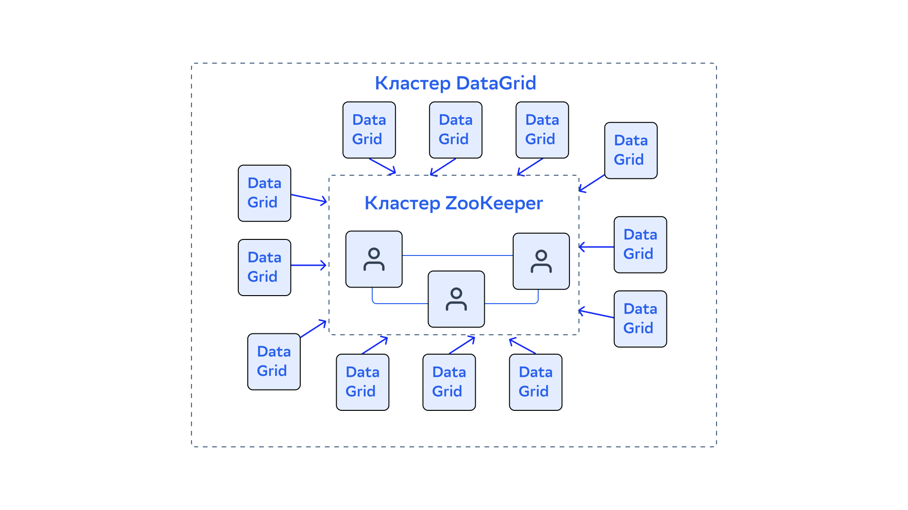
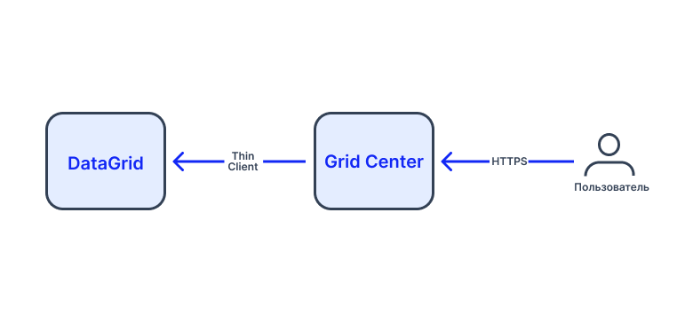

# Структура

## Компонентно-логическая диаграмма


## Компоненты программного компонента

| Название компонента | Ответственность компонента |
|---|---|
| Серверные узлы (Server Node) | Хранят данные и позволяют исполнять загружаемый на них код |
| Клиентские узлы (Thick Client) | Являются частью топологии, позволяют запускать вычислительные задачи, но не хранят данные. Имеют доступ к полному набору API кластера |
| Клиентские узлы (Thin Client) | Не являются частью топологии кластера. Позволяют запускать вычислительные задачи и не хранят данные. Не имеют доступа к внутреннему API кластера, но более легкие по сравнению с толстым клиентом. Поддерживаются библиотеки для тонких клиентов на (Java, .NET, C++, Node.JS, Python, PHP) |

## Интерфейсы

### `TopologyValidator`

#### Введение

В поставку DataGrid входит плагин Topology Validator.

Включение плагина Topology Validator в конфигурацию серверных узлов DataGrid позволяет автоматически блокировать запись во все кеши кластера в случае потери связи с частью узлов.

:::{admonition} Внимание
:class: danger

Штатный ввод и вывод узлов игнорируется плагином и не приводит к блокировке записи в кеши.
:::

#### Пример использования плагина

**Проблема**

Предположим, существует кластер из узлов, разнесенных по нескольким центрам обработки данных (ЦОД). Из-за потери связи между ЦОД узлы, относящиеся к разным ЦОД, формируют независимые кластеры (сегменты). Если каждый из сегментов продолжит независимо обрабатывать запросы на запись, согласованность данных, хранящихся в каждом сегменте, нарушится (они окажутся несогласованными между собой).

**Решение**

Так как со стороны каждого из сегментов складывается ситуация, что изначальный кластер теряет связь с частью узлов, относящихся к другим ЦОД, то плагин Topology Validator дает возможность оставить доступной запись в кеши не более чем для одного сегмента.

Конфигурация `TopologyValidator` приводится в подразделе «Механизмы» раздела «Сценарии использования» документа «Руководство по системному администрированию».

### IgniteCluster

Функциональность кластера обеспечивается интерфейсом `IgniteCluster`. Для получения от Ignite экземпляра `IgniteCluster` выполните следующий код:

:::{code-block} java
:caption: Java
Ignite ignite = Ignition.ignite();
IgniteCluster cluster = ignite.cluster();
:::

Интерфейс `IgniteCluster` дает возможность:

-   запускать и останавливать удаленные узлы кластера;
-   получать списки всех участников кластера;
-   создавать логические группы кластеров.

### ClusterNode

Интерфейс `ClusterNode` работает только с узлом как с логической конечной точкой сети в топологии: его глобальным уникальным идентификатором, метриками и статическими атрибутами, установленными пользователем.

### Атрибуты узла кластера

Все узлы кластера при запуске автоматически регистрируют все свойства среды ОС и системы компьютера в качестве атрибутов узла. Дополнительно, пользователь может вручную назначить в конфигурации свои собственные атрибуты узлов:

:::{code-block} xml
:caption: XML
<bean class="org.apache.ignite.IgniteConfiguration">
...
<property name="userAttributes">
<map>
<entry key="ROLE" value="worker"/>
</map>
</property>
...
</bean>
:::

Пример ниже показывает, как получить узлы, в которых установлен атрибут `worker`:

:::{code-block} java
:caption: Java
ClusterGroup workers = ignite.cluster().forAttribute("ROLE", "worker");
Collection<ClusterNode> nodes = workers.nodes();
:::

:::{admonition} Примечание
:class: note

Значение любого из атрибутов узла доступно при помощи метода `ClusterNode.attribute("propertyName")`.
:::

### Обнаружение и коммуникация

DataGrid использует два базовых механизма обнаружения и коммуникации:

-   DiscoverySpi;
-   CommunicationSpi.

#### Discovery

Механизм обнаружения (Discovery) — это базовая часть функциональности, целью которой является формирование кластера из отдельных узлов DataGrid.

Основной целью данного механизма является построение определенного представления кластера (количество узлов, порядок узлов и так далее), которое будет являться общим для всего кластера. Кроме того, механизм служит для обеспечения согласованности данного представления.

В данном разделе рассматривается реализация механизма Discovery в интерфейсе `DiscoverySpi` через `TcpDiscoverySpi`.

:::{admonition} Внимание
:class: danger

В настоящий момент используется только реализация `TcpDiscoverySpi`.
:::

##### Multicast IP Finder

`TcpDiscoveryMulticastIpFinder` использует Multicast для обнаружения других узлов DataGrid. Данный способ является IP Finder-механизмом по умолчанию.

##### Static IP Finder

Во многих случаях, например, когда отключен Multicast, следует использовать механизм `TcpDiscoveryVmIpFinder`, который работает с заранее предопределенным списком IP-адресов узлов.

Для успешного обнаружения кластера достаточно указать адрес хотя бы одного узла, принадлежащего этому кластеру. Но обычно рекомендуется указать 2-3 адреса узлов кластера. После успешного подключения нового узла к одному из кластерных узлов из списка, DataGrid автоматически обнаруживает остальные узлы кластера. Альтернативой определению списка адресов в конфигурационном файле может быть задание этого списка в переменной окружения `IGNITE_TCP_DISCOVERY_ADDRESSES`. Адреса должны быть разделены запятыми и могут содержать определение диапазона портов.

По умолчанию, `TcpDiscoveryVmIpFinder` работает в режиме non-shared. Если вы планируете запустить серверный узел в этом режиме, то список адресов должен содержать адрес локального узла. Это позволит узлу стать первым узлом кластера, а не ожидать подключения других серверных узлов.

##### Одновременное использование Multicast и Static IP Finder

Также возможно совместное использование обоих механизмов обнаружения. В этом случае помимо получения адресов через Multicast, `TcpDiscoveryMulticastIpFinder` также может работать и с предопределенным списком статических IP-адресов.

##### Развертывание изолированных кластеров DataGrid на одних и тех же физических серверах

Развертывание двух изолированных кластеров на одном и том же наборе серверов возможно при условии, что кластеры используют непересекающиеся диапазоны портов для `TcpDiscoverySpi` и `TcpCommunicationSpi`.

**Задача:**

Развернуть два изолированных кластера на одной машине.

**Решение:**

Конфигурация `TcpDiscoverySpi` и `TcpCommunicationSpi` для узлов первого кластера будет выглядеть следующим образом:

::::{md-tab-set}
:::{md-tab-item} Spring XML
```xml
<bean class="org.apache.ignite.configuration.IgniteConfiguration">
    ...
    <!--
    Чтобы предоставить список начальных узлов первого кластера, явно настройте TCP Discovery SPI.
    -->
    <property name="discoverySpi">
        <bean class="org.apache.ignite.spi.discovery.tcp.TcpDiscoverySpi">
            <!-- Начальный локальный порт для прослушивания. -->
            <property name="localPort" value="48500"/>

            <!-- Изменение диапазона локальных портов (необязательное действие). -->
            <property name="localPortRange" value="20"/>

            <!-- Настройка IP Finder для данного кластера. -->
            <property name="ipFinder">
                <bean class="org.apache.ignite.spi.discovery.tcp.ipfinder.vm.TcpDiscoveryVmIpFinder">
                    <property name="addresses">
                        <list>
                            <!--
                            Адреса и диапазон портов узлов первого кластера. `xxx.x.x.x` можно заменить на реальные IP-адреса или имена хостов. Диапазон портов не является обязательным.
                            -->
                            <value>xxx.x.x.x:48500..48520</value>
                        </list>
                    </property>
                </bean>
            </property>
        </bean>
    </property>

    <!--
    Явно настройте TCP Communication SPI: измените номер локального порта для узлов первого кластера.
    -->
    <property name="communicationSpi">
        <bean class="org.apache.ignite.spi.communication.tcp.TcpCommunicationSpi">
            <property name="localPort" value="48100"/>
        </bean>
    </property>
</bean>
```
:::

:::{md-tab-item} Java
```java
IgniteConfiguration cfg = new IgniteConfiguration();

// Чтобы предоставить список начальных узлов первого кластера, явно настройте TCP Discovery SPI.
TcpDiscoverySpi discoverySpi = new TcpDiscoverySpi();

// Начальный локальный порт для прослушивания.
discoverySpi.setLocalPort(48500);

// Изменение диапазона локальных портов (необязательное действие).
discoverySpi.setLocalPortRange(20);

TcpDiscoveryVmIpFinder ipFinder = new TcpDiscoveryVmIpFinder();

// Адреса и диапазон портов узлов первого кластера.
// `xxx.x.x.x` можно заменить на реальные IP-адреса или имена хостов.
// Диапазон портов не является обязательным.
ipFinder.setAddresses(Arrays.asList("xxx.x.x.x:48500..48520"));

// Переопределение IP Finder.
discoverySpi.setIpFinder(ipFinder);

// Явно настройте TCP Communication SPI: измените номер локального порта для узлов первого кластера.
TcpCommunicationSpi commSpi = new TcpCommunicationSpi();

commSpi.setLocalPort(48100);

// Переопределение Discovery SPI.
cfg.setDiscoverySpi(discoverySpi);

// Переопределение Communication SPI.
cfg.setCommunicationSpi(commSpi);

// Запуск узла.
Ignition.start(cfg);
```
:::
::::

Конфигурация `TcpDiscoverySpi` и `TcpCommunicationSpi` для узлов второго кластера будет выглядеть следующим образом:

::::{md-tab-set}
:::{md-tab-item} Spring XML
```xml
<bean id="ignite.cfg" class="org.apache.ignite.configuration.IgniteConfiguration">
    <!--
    Чтобы предоставить список начальных узлов второго кластера, явно настройте TCP Discovery SPI.
    -->
    <property name="discoverySpi">
        <bean class="org.apache.ignite.spi.discovery.tcp.TcpDiscoverySpi">
            <!-- Начальный локальный порт для прослушивания. -->
            <property name="localPort" value="49500"/>

            <!-- Изменение диапазона локальных портов (необязательное действие). -->
            <property name="localPortRange" value="20"/>

            <!-- Настройка IP Finder для данного кластера. -->
            <property name="ipFinder">
                <bean class="org.apache.ignite.spi.discovery.tcp.ipfinder.vm.TcpDiscoveryVmIpFinder">
                    <property name="addresses">
                        <list>
                            <!--
                            Адреса и диапазон портов узлов второго кластера. `xxx.x.x.x` можно заменить на реальные IP-адреса или имена хостов. Диапазон портов не является обязательным.
                            -->
                            <value>xxx.x.x.x:49500..49520</value>
                        </list>
                    </property>
                </bean>
            </property>
        </bean>
    </property>

    <!--
    Явно настройте TCP Communication SPI: измените номер локального порта для узлов второго кластера.
    -->
    <property name="communicationSpi">
        <bean class="org.apache.ignite.spi.communication.tcp.TcpCommunicationSpi">
            <property name="localPort" value="49100"/>
        </bean>
    </property>
</bean>
```
:::

:::{md-tab-item} Java
```java
IgniteConfiguration cfg = new IgniteConfiguration();

// Чтобы предоставить список начальных узлов второго кластера, явно настройте TCP Discovery SPI.
TcpDiscoverySpi discoverySpi = new TcpDiscoverySpi();

// Начальный локальный порт для прослушивания.
discoverySpi.setLocalPort(49500);

// Изменение диапазона локальных портов (необязательное действие).
discoverySpi.setLocalPortRange(20);

TcpDiscoveryVmIpFinder ipFinder=new TcpDiscoveryVmIpFinder();

// Адреса и диапазон портов узлов второго кластера.
// `xxx.x.x.x` можно заменить на реальные IP-адреса или имена хостов.
// Диапазон портов не является обязательным.
ipFinder.setAddresses(Arrays.asList("xxx.x.x.x:49500..49520"));

// Переопределение IP Finder.
discoverySpi.setIpFinder(ipFinder);

// Явно настройте TCP Communication SPI: измените номер локального порта для узлов второго кластера.
TcpCommunicationSpi commSpi = new TcpCommunicationSpi();

commSpi.setLocalPort(49100);

// Переопределение Discovery SPI.
cfg.setDiscoverySpi(discoverySpi);

// Переопределение Communication SPI.
cfg.setCommunicationSpi(commSpi);

// Запуск узла.
Ignition.start(cfg);
```

-   Если в данном сценарии требуется использовать Multicast-обнаружение, то следует заменить `TcpDiscoveryVmIpFinder` на `TcpDiscoveryMulticastIpFinder` и указать уникальное значение для `TcpDiscoveryMulticastIpFinder.multicastGroups` в конфигурации каждого отдельного кластера.
-   Если используется конфигурация со включенным Persistence, то следует помнить, что для каждого кластера необходимо указывать разные пути для хранения данных. Для этого можно использовать методы `setStoragePath(...)`, `setWalPath(...)` и `setWalArchivePath(...)` класса `DataStorageConfiguration`.
:::
::::

##### Failure Detection Timeout

Параметр `failureDetectionTimeout` используется для определения времени, по истечении которого узел кластера обнаруживает сбой соединения с другим узлом.

Данный параметр работает по следующему алгоритму:

1.  Узел А направляет узлу В heartbeat-сообщения (а также прочие системные сообщения).
2.  Узел А, в течение времени, заданного `failureDetectionTimeout`, ожидает ответа от узла В.
3.  В случае неполучения узлом А ответа в заданное время, узел В исключается из кластера.

Данный параметр является самым простым способом настройки функции обнаружения неисправностей механизма Discovery SPI в соответствии с конфигурацией рабочей среды.

Параметр `failureDetectionTimeout` автоматически устанавливает параметры конфигурации `TcpDiscoverySpi`, такие, как `SocketTimeout`, `AckTimeout` и прочие. Если какой-либо из этих параметров будет настроен вручную, то значение, заданное автоматически, будет игнорироваться.

Failure Detection Timeout настраивается:

-   для серверных узлов — с помощью метода `IgniteConfiguration.setFailureDetectionTimeout(long)`;
-   для клиентских узлов — с помощью метода `IgniteConfiguration.setClientFailureDetectionTimeout(long)`.

Значения Failure Detection Timeout по умолчанию:

-   для серверных узлов — 10 секунд;
-   для клиентских узлов — 30 секунд.

:::{admonition} Примечание
:class: note

Для более оперативного обнаружения неисправностей в стабильных сетях с низкой задержкой значение данного параметра может составлять ~200 мс.
:::

##### Процесс подключения узлов

Процесс подключения узлов состоит из нескольких фаз:

1.  Запрос на подключение (`JoinReq`).
2.  Сообщение о добавлении узла (`NodeAdded`).
3.  Сообщение о завершении добавления узла (`NodeAddFinished`).

В ходе процесса новый узел проверяется, и, в случае успешной валидации, происходит обмен конфигурационной информацией, а информация о топологии на всех узлах обновляется.

В случае успешного подключения узла он размещается в «кольце» между серверным узлом и координатором кластера.

**Запрос на подключение (`JoinReq`)**

Отправной точкой процесса подключения является событие присоединения узла к топологии, которое использует метод `joinTopology`, представленный в классах `ServerImpl` и `ClientImpl`.

Процесс подключения проходит по следующему алгоритму:

1.  Узел собирает данные обнаружения со всех его компонентов (например, конфигурации кешей с `GridCacheProcessor`).
2.  Механизм `TcpDiscoverySpi#collectExchangeData` вызывает `GridComponent#collectJoiningNodeData` для каждого компонента.
3.  Данные обнаружения «упаковываются» в запрос на подключение и отправляются в кластер.
4.  Когда координатор получает `JoinReq`, он проверяет это сообщение и, в случае успешной валидации, создает сообщение `NodeAdded` (`ServerImpl.RingMessageWorker#processJoinRequestMessage`). Кластер добавляет в сообщение информацию о подключаемом узле (включая данные обнаружения подключаемого узла из `JoinReq`) и отправляет его дальше по топологии. Далее используется только сообщение `NodeAdded`.

После этого жизненный цикл запроса на подключение завершается.

**Сообщение о добавлении узла (`NodeAdded`)**

Логика обработки находится в `ServerImpl.RingMessageWorker#processNodeAddedMessage`. При получении сообщения `NodeAdded` каждый узел в кластере (включая узел-координатор) выполняет следующие действия:

1.  Применяет данные обнаружения подключаемого узла к компонентам.
2.  Собирает локальные данные обнаружения.
3.  Добавляет их к сообщению `NodeAdded`.
4.  Отправляет сообщение `NodeAdded` следующему узлу посредством вызова метода `ServerImpl.RingMessageWorker#sendMessageAcrossRing`.

Жизненный цикл сообщения `NodeAdded` завершается, когда оно проходит по всему «кольцу» и вновь приходит к координатору.

После этого координатор создает сообщение `NodeAddFinished` и отправляет его по «кольцу».

:::{admonition} Примечание
:class: note

Подключаемый узел также получает сообщение `NodeAdded`, но в самом конце процесса, после обработки данного сообщения остальными узлами.
:::

**Сообщение о завершении добавления узла (`NodeAddFinished`)**

Сообщение `NodeAddFinished` завершает процесс подключения узла.

При получении данного сообщения каждый узел (и серверный, и клиентский) запускает событие `NODE_JOINED`, чтобы уведомить Discovery manager о подключении нового узла.

:::{admonition} Дополнительные запросы на подключение
:class: hint

В случае несвоевременного получения сообщения `NodeAddFinished` (время ожидания сообщения истекло) подключаемый узел направляет дополнительный запрос на подключение. Время ожидания сообщения определяется параметром `TcpDiscoverySpi#networkTimeout`, значение которого по умолчанию равно 5 секундам (`TcpDiscoverySpi#DFLT_NETWORK_TIMEOUT`).
:::

##### Обнаружение и удаление неработающих серверных узлов из топологии

За обнаружение неработающих узлов отвечает каждый серверный узел в кластере.

**Сбои серверных узлов — общее**

В топологии «кольцо» каждый узел обнаруживает сбой на следующем за ним узле: при отправке следующего discovery-сообщения произойдет ошибка. Координатор управляет процессом удаления неработающего узла из «кольца», который состоит из двух шагов, описанных ниже.

**Шаг первый**

Алгоритм первого шага выглядит следующим образом:

1.  Сервер, обнаруживающий, что на следующем за ним узле произошел сбой, добавляет его в специальную локальную карту под названием `failedNodes`.
2.  Используя карту `failedNodes`, сервер отфильтрует неработающие узлы от всех остальных, представленных в «кольце» до завершения второго шага процесса для каждого из неработающих узлов.
3.  Помимо добавления неработающего узла в карту `failedNodes`, сервер попытается установить соединение со следующим (за неактивным) узлом:

    -   в случае успешного подключения, найденный сервер занимает место отключенного;
    -   в случае неудачного подключения процесс повторяется: добавление узла в карту `failedNodes`, подключение к следующему за неактивным узлу и так далее.

4.  При восстановлении кольца и наличии следующего активного серверного узла, текущий узел добавляет информацию обо всех узлах из карты `failedNodes` в любое discovery-сообщение и отсылает его (данное поле обрабатывается методом `ServerImpl$RingMessageWorker#sendMessageAcrossRing`).
5.  Кроме того, узел, обнаруживший неработающий узел, отвечает за создание `TcpDiscoveryNodeFailedMessage` — специального discovery-сообщения, которое инициирует второй шаг процесса удаления неработающего узла из топологии. Для каждого неработающего узла создается по одному сообщению. То есть, если из обслуживания вышли три узла, создается три сообщения `TcpDiscoveryNodeFailedMessage`.

:::{admonition} `TcpDiscoveryAbstractMessage` и его функция
:class: hint

Любое discovery-сообщение может дать информацию о неработающих узлах в топологии, и все узлы, получающие любое discovery-сообщение, начинают его обработку с обновления локальных карт `failedNodes`, используя информацию из этого discovery-сообщения (`ServerImpl$RingMessageWorker#processMessage`, где метод `processMessageFailedNodes` вызывается практически в самом начале).
:::

**Шаг второй**

Алгоритм второго шага выглядит следующим образом:

1.  Координатор получает сообщение `TcpDiscoveryNodeFailedMessage`.
2.  Координатор подтверждает его и отправляет его всем серверным узлам в «кольце».
3.  Все серверы, включая координатор, обновляют локальные версии своих представлений топологии и удаляют неработающие серверы из «кольца» и с карты `failedNodes`.

**Конфигурация**

Ниже описаны наиболее часто используемые методы конфигурации `TcpDiscoverySpi`. Вы можете ознакомиться с полным перечнем методов в [официальной документации Apache Ignite](https://ignite.apache.org/releases/latest/javadoc/org/apache/ignite/spi/discovery/tcp/TcpDiscoverySpi.html).

| Метод | Описание | Значение по умолчанию |
|---|---|---|
| `setIpFinder(TcpDiscoveryIpFinder)` | Задает IP Finder, использующийся для предоставления информации об узлах и IP-адресах | `TcpDiscoveryMulticastIpFinder` Другие возможные реализации: `TcpDiscoverySharedFsIpFinder TcpDiscoveryS3IpFinder TcpDiscoveryJdbcIpFinder TcpDiscoveryVmIpFinder` |
| `setLocalAddress(String)` | Задает IP-адрес локального сервера, используемого механизмом Discovery SPI | Если не установлено, то будет использован первый найденный незамыкающийся адрес (non-loopback address) по умолчанию. Если незамыкающегося адреса нет, то будет использоваться `java.net.InetAddress.getLocalHost()` |
| `setLocalPort(int)` | Задает порт, прослушиваемый механизмом SPI | 47500 |
| `setLocalPortRange(int)` | Задает диапазон локальных портов. Локальный узел будет пытаться привязаться к ближайшему доступному порту от локального порта до локального порта + диапазон локальных портов | 100 |
| `setReconnectCount(int)` | Задает количество попыток одного узла установить (восстановить) соединение с другим | 2 |
| `setNetworkTimeout(long)` | Задает максимальное время ожидания сети в миллисекундах для использования в операциях сети | 5000 |
| `setSocketTimeout(long)` | Задает время ожидания операций сокета. Данное время ожидания используется для ограничения времени соединения и записи в сокет | 2000 |
| `setAckTimeout(long)` | Задает время ожидания подтверждения получения отправленного сообщения. Если подтверждение за это время не получено, отправка признается неудачной, и SPI пытается повторить отправку сообщения | 2000 |
| `setJoinTimeout(long)` | Задает время ожидания подключения (`join`). В случае, если используется раздельный IP finder, а узлу не удается подключиться к любому адресу из списка IP Finder, узел в течение данного времени ожидания будет продолжать пытаться подключиться. Если ни один адрес не отвечает, узел выдает исключение и не запускается | 0 |
| `setThreadPriority(int)` | Задает приоритет для потоков, запущенных SPI | 0 |
| `setStatisticsPrintFrequency(int)` | Задает частоту отображения статистики в миллисекундах. Значение 0 — вывод статистики не нужен. Если данное значение больше нуля, а в логах отображается информация, то это значит, что статистика отображается вместе с уровнем INFO раз в период. Это может быть крайне полезно для отслеживания проблем топологии | `true` |

#### Communication

Механизм коммуникации (Communication) — это базовая часть функциональности, целью которой является обеспечение обмена данными между узлами DataGrid.

`Communication SPI` является одним из наиболее важных SPI в DataGrid. Он предоставляет все необходимые средства для обмена данными между узлами, такие как внутренние механизмы реализации и возможность отправки пользовательских сообщений.

В качестве стандартной реализации класса `CommunicationSpi` DataGrid использует `TcpCommunicationSpi`. Для связи с другими узлами данная реализация использует протокол TCP/IP.

В кластере DataGrid узлы находят друг друга, используя механизм `TcpDiscoverySpi`, который может быть сконфигурирован для обнаружения узлов через Multicast IP Finder или при помощи Static IP Finder.

`CommunicationSpi` — основной путь для отправки и получения сообщений в гриде. Он используется для всех распределенных операций data grid, таких, как:

-   выполнение задач (task execution);
-   мониторинг;
-   обмен данными.

Чтобы узлы могли общаться друг с другом, для локального узла определяются параметры: `TcpCommunicationSpi.ATTR_ADDRS` и `TcpCommunicationSpi.ATTR_PORT`. При запуске узла SPI начинает прослушивать порт, определенный методом `TcpCommunicationSpi.setLocalPort(int)`. Если порт занят, SPI автоматически увеличивает номер порта, пока не удастся открыть его на прослушивание. Параметр `TcpCommunicationSpi.setLocalPortRange(int)` определяет максимальное количество портов, которое механизму SPI нужно перебрать, прежде чем завершиться с ошибкой.

:::{admonition} Local port
:class: hint

В случае, если нужно запустить несколько узлов на одном сервере, настройте локальные порты для узлов вручную так, чтобы они не пересекались. Если запуск узлов выполняется на разных серверах, то менять конфигурацию не требуется.
:::

:::{admonition} IPv4 vs IPv6
:class: hint

DataGrid поддерживает как IPv4, так и IPv6. Но иногда одновременное использование протоколов приводит к прекращению работы кластера. Чтобы избежать подобной ситуации, используйте параметр JVM `-Djava.net.preferIPv4Stack=true`, который ограничивает DataGrid до IPv4.
:::

##### Конфигурация

Следующие методы класса `TcpCommunicationSpi` могут быть сконфигурированы опционально:

| Метод| Описание| Значение по умолчанию|
|---|---|---|
| `setLocalAddress(String)` | Задает адрес локального сервера для привязки сокета | Любой доступный локальный IP-адрес |
| `setLocalPort(int)` | Задает локальный порт для привязки сокета | 47100 |
| `setLocalPortRange(int)` | Контролирует максимальное количество локальных портов, к которым осуществлялось подключение в случае, если заняты все порты, к которым ранее выполнялось подключение | 100 |
| `setTcpNoDelay(boolean)` | Задает значение для опции сокета `TCP_NODELAY`. Каждый принятый или созданный сокет будет использовать установленное значение. Для сокращения времени запроса/ответа при коммуникации по протоколу TCP данный метод должен иметь значение `true` (по умолчанию). В большинстве случаев изменять данное значение не нужно | `true` |
| `setConnectTimeout(long)` | Задает время ожидания соединения. Данное значение используется при установке соединения с удаленными узлами | 1000 |
| `setIdleConnectionTimeout(long)` | Задает максимальное время ожидания неактивного соединения, по прошествии которого соединение сервера с клиентом будет прервано | 30000 |
| `setBufferSizeRatio(double)` | Задает диапазон размера буфера для данного SPI. При отправке сообщений, размер буфера настраивается в заданном диапазоне | 0.8 или значение системной функции `IGNITE_COMMUNICATION_BUF_RESIZE_RATIO`, если имеется |
| `setMinimumBufferedMessageCount(int)` | Задает минимальное число сообщений, попадающих в буфер до отправки | 512 или значение системной функции `IGNITE_MIN_BUFFERED_COMMUNICATION_MSG_CNT`, если имеется |
| `setUsePairedConnections(boolean)` | Устанавливает признак, обозначающий необходимость принудительной установки двухсокетного соединения между узлами. Если значение данного метода `true`, то между соединяющими узлами будет установлено два отдельных соединения: одно для исходящих сообщений, а второе — для входящих. Если значение метода `false`, то для обоих направлений будет установлено одно TCP-соединение. Данный признак полезен в некоторых ОС, когда доставка сообщений занимает длительное время | `false` |
| `setConnectionBufferSize(int)` | Данный метод используется только в случае, если значение метода `setAsyncSend(boolean)` установлено в `false`. Задает размер буфера для синхронных соединений. Увеличение размера буфера возможно при использовании синхронной отправки и отправке большого количества небольших сообщений. В большинстве случаев используется значение по умолчанию, равное 0 | 0 |
| `setSelectorsCount(int)` | Задает количество селекторов, используемых на TCP-сервере | Количество селекторов по умолчанию равно результату выражения `Math.min(4, Runtime.getRuntime() .availableProcessors())` |
| `setConnectionBufferFlushFrequency(long)` | Данный метод используется только в случае, если значение метода `setAsyncSend(boolean)` установлено в `false`. Задает частоту очистки буфера в миллисекундах. Данный параметр необходим только при использовании синхронной отправки сообщений, когда размер буфера соединения не равен 0. В случае, если количества сообщений в буфере недостаточно для его автоматической очистки, он будет очищаться один раз в течение определенного периода времени | 100 |
| `setDirectBuffer(boolean)` | Переключение между использованием буфера прямого распределения NIO и буфера heap-распределения NIO. Несмотря на то, что буферы прямого распределения работают лучше, в некоторых случаях (особенно при использовании ОС Windows) их использование может приводить к сбоям в работе JVM. Если это происходит в вашей среде, задайте для данного метода значение `false` | `true` |
| `setDirectSendBuffer(boolean)` | Переключение между использованием буфера прямого распределения NIO и буфера heap-распределения NIO для отправки сообщений в асинхронном режиме | `false` |
| `setAsyncSend(boolean)` | Переключение между синхронным и асинхронным режимом отправки сообщений. В случае, если узлы grid отправляют большое количество данных по сети в несколько потоков, значение данного метода должно быть установлено в `true` (по умолчанию). Однако то, какое значение необходимо использовать, может зависеть от среды и приложения. Прежде чем определиться с тем, какое значение необходимо использовать, рекомендуется протестировать приложение в обоих режимах | `true` |
| `setSharedMemoryPort(int)` | Задает порт, который будет использоваться параметром `IpcSharedMemoryServerEndpoint`. Узлы, запущенные на одном и том же сервере, будут связываться через разделяемую память IPC (только для серверов на Linux и macOS). Для отключения связи через разделяемую память IPC установите значение данного метода в -1 | 48100 |
| `setSocketReceiveBuffer(int)` | Задает размер буфера приема для сокетов, созданных или принятых данным SPI. Если значение не указано, устанавливается значение по умолчанию, равное 0. Оно оставляет буфер после создания сокета без изменений (используя значение, по умолчанию устанавливаемое ОС) | 0 |
| `setSocketSendBuffer(int)` | Задает размер буфера отправки для сокетов, созданных или принятых данным SPI. Если значение не указано, устанавливается значение по умолчанию, равное 0. Оно оставляет буфер после создания сокета без изменений (используя значение, по умолчанию устанавливаемое ОС) | 0 |

## Элементы развертывания

| Название элемента развертывания | Тип | Названия компонентов, входящих в данный элемент развертывания | Среда исполнения |
|---|---|---|---|
| DataGrid | jar | IGNT | JVM |

## Диаграммы развертывания

**Развертывание DataGrid на виртуальной машине или сервере Bare Metal:**

:::{drawio-image} ./resources/dd-datagrid-vm-no-zookeeper.drawio
:::

**Развертывание DataGrid на виртуальной машине или сервере Bare Metal с ZooKeeper и репликацией:**

:::{drawio-image} ./resources/dd-datagrid-vm.drawio
:::

## Варианты использования DataGrid

### ZooKeeper

:::{admonition} Важно
:class: attention

ZooKeeper — функциональность, которая унаследована от программного обеспечения с открытым исходным кодом Apache Ignite.
:::

Механизм обнаружения ZooKeeper Discovery создан для массовых развертываний, которые требуют легкого масштабирования кластера и линейной производительности. Но использовать одновременно две распределенные системы — DataGrid и ZooKeeper — может быть сложной задачей. Для большинства случаев предпочтительнее использовать протокол TCP/IP Discovery.

ZooKeeper Discovery использует ZooKeeper в качестве единой точки синхронизации и для организации кластера в топологию «звезда». В ней кластер ZooKeeper находится в центре, и через него узлы DataGrid обмениваются событиями протокола Discovery. Подробнее об этом написано в [официальной документации Apache ZooKeeper](https://zookeeper.apache.org/documentation.html).



### Platform V Grid Center

Platform V Grid Center — графическая консоль управления. Сценарии администрирования графического интерфейса для управления кластером DataGrid описаны в [документации продукта Platform V Grid Center](doc://GCE).

