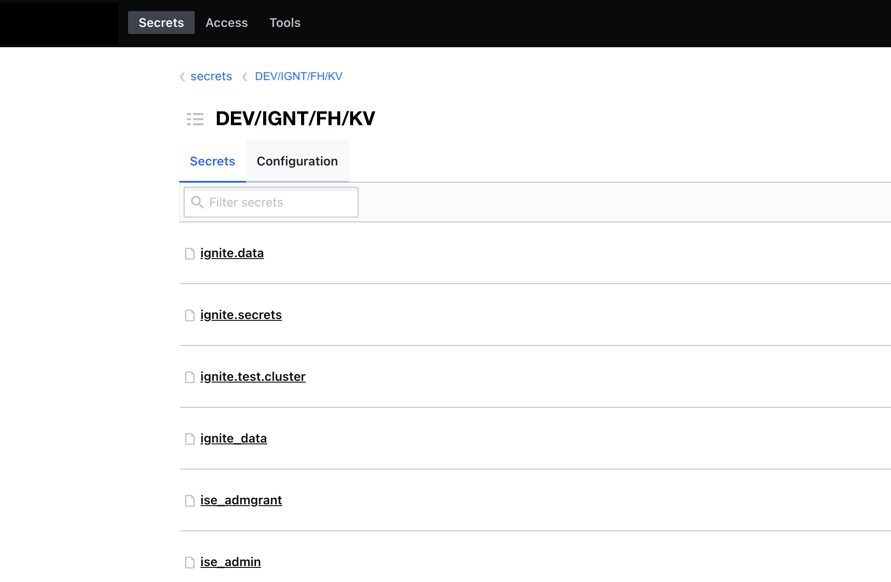
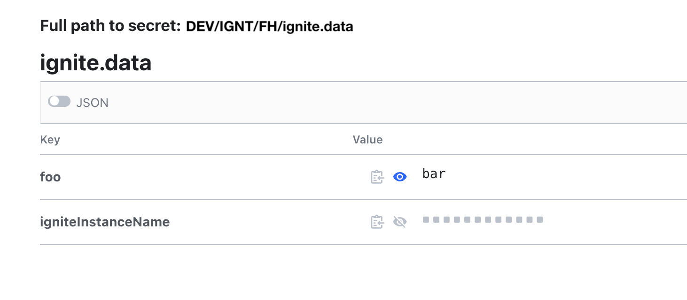

# Интеграция с Secret Management System (SecMan)

## Описание интеграции

Особенности интеграции с SecMan:

-   централизованным местом хранения и изменения секретов является SecMan;
-   работа с SecMan осуществляется с использованием REST API по протоколу HTTPs;
-   ссылки на секреты указаны в конфигурационных файлах приложения;
-   в качестве «движка» SecMan может использоваться KV (Key/Value) и SberCA engine;
-   аутентификация в SecMan осуществляется при помощи механизма AppRole.

SberCA используется для получения сертификата и приватного ключа, которые будут использоваться в настройках SSL. При интеграции с помощью SberCA используется только SecMan-расширение — метод `fetch`.

:::{admonition} Примечание
:class: note

Одна конфигурация SecMan не может содержать одновременно конфигурацию для работы и с KV, и с SberCA.
:::

## Базовые обязательные параметры

Список базовых обязательных параметров:

-   `endpoint` — URL SecMan сервера;
-   `token.path` — путь к файлу, содержащему обернутый токен (wrapped token);
-   `namespace` — используемый namespace.

## Параметры KV 

Интеграция с SecMan использует систему управления KV (Key/Value), которая необходима для получения Map (таблицы или словаря) с секретами для их использования в конфигурационных параметрах.

### Обязательные параметры для чтения секрета из KV

Для чтения секрета из KV обязательно укажите параметр `path`, который содержит полный путь к секрету в KV движке.

:::{admonition} Пример
:class: hint

Путь к используемому KV движку — `DEV/IGNT/FH/KV`:



Используемый секрет — `ignite.data`:



В этом случае полный путь к секрету: `path=DEV/IGNT/FH/KV/ignite.data`.
:::

Поля секрета можно использовать в значениях свойств в конфигурации сервисов. Синтаксис использования отличается в разных сервисах.

## Параметры SberCA

### Обязательные параметры для SberCA

Список обязательных параметров для SberCA:

-   путь к движку;
-   имя роли для доступа к SberCA;
-   CN запрашиваемого сертификата.

    :::{admonition} Внимание
    :class: danger

    CN должен быть указан полностью, но на сервере может быть включена валидация CN. Чаще всего используется валидация суффикса CN для заданной роли (суффикс определяется на сервере). В случае изменения или отключения валидации обращайтесь к администраторам SecMan.
    :::

## Необязательные параметры (работа с wrapped token)

Список необязательных параметров:

-   `token.rewrite_on_start` (true/false) — по умолчанию `true`. Значения:
    
    - `true` — после выполнения разворачивания токена и получения значений данные заново передаются на wrap. Файл с wrapped token перезаписывается с новым значением токена. Запускается поток, периодически обновляющий файл с токеном.
    - `false` — процесс не обновляет файл с токеном.

-   `token.ttl.sec` (int) — время жизни wrapped token, созданного библиотекой. По умолчанию составляет 24 часа. Обратите внимание, что значение в конфигурации или значение по умолчанию библиотеки не может увеличить время жизни токена, если максимальный TTL на сервере указан меньше.
-   `token.refresh.period.sec` (int) — период обновления wrapped token (в случае, если запущен поток). По умолчанию составляет один час.

## Необязательные параметры (взаимодействие с SecMan-сервером)

Список необязательных параметров:

-   `open.timeout.sec` (int) — тайм-аут подключения (connection timeout) при отправке запроса на SecMan-сервер. По умолчанию составляет пять секунд;
-   `read.timeout.sec` (int) — тайм-аут считывания (read timeout) при отправке/чтении ответа от SecManсервера. По умолчанию составляет пять секунд.

## Настройка интеграции с SecMan

Настройка интеграции между SecMan и DataGrid возможна за счет конфигурирования серверного узла, клиентского узла, а также через консольные утилиты `control.sh` и `ise-user-control`.

### Интеграция с серверным узлом DataGrid

Интеграция между серверным узлом и SecMan устроена следующим образом:

-   на старте узла считывается и разворачивается (unwrap) значение токена;
-   токен внутри файла обновляется, в файл записывается новое значение;
-   считываются сертификаты и секреты.

    :::{admonition} Внимание
    :class: danger

    Сертификаты и секреты не сохраняются на локальном диске узла.
    :::

#### Загрузка сертификатов

Загрузка сертификатов из SecMan происходит автоматически при конфигурации плагина безопасности с SecMan. В качестве параметра для конфигурации используйте `secmanConfig`. Подробнее смотрите в разделе [Интеграция SecMan с плагином безопасности](#интеграция-secman-с-плагином-безопасности) текущего документа.

:::{admonition} Примечание
:class: note

Для протоколов, по которым узлы DataGrid обмениваются данными между собой, используется TLS без шифрования. Соответствующие наборы шифров, в названиях которых присутствует аргумент `WITH_NULL`, по умолчанию отключены в JVM. Чтобы избежать плохо диагностируемых ошибок, необходимо включить эти шифры: убрать значение `NULL` из параметра `jdk.tls.disabledAlgorithms` в файле `lib/security/java.security` в JRE. 

Переход на TLS с шифрованием возможен, однако это повлечет за собой существенное падение производительности.
:::

Данные, получаемые с помощью wrapped-токена, должны содержать параметры логина к SecMan – ID роли и ID секрета.

::::{admonition} Пример синтаксиса в JSON-файле
:class: hint

:::{code-block} json
:caption: JSON
{
"roleId" : "<roleId_credential>", 
"secretId": "<secretId_credential>"
}
:::
::::

Сертификат с заданным значением `Common Name` (CN) извлекается из SecMan. Если сертификата с указанным CN не существует или истек срок его действия, SecMan-сервис создает сертификат с указанным CN и сохраняет его значение в своем внутреннем хранилище. 

Для запросов на SecMan-сервер (например, чтобы найти конкретный сертификат) используйте параметр `SecmanFetchCertificateConfig` с заданными атрибутами:

-   `cn` — имя `Common Name` для получаемого или генерируемого сертификата. Обратите внимание, что настройки используемой SecMan-роли могут ограничивать применение произвольного имени роли, например, SecMan-роль может требовать использование конкретного суффикса, определенного этой ролью;
-   `role` — название SecMan-роли для SberCA;
-   `mountPath` — путь для SecMan SberCA `endpoint` (обычно этот путь называется «SberCA»).

#### Чтение секретов из SecMan

Для чтения секретов из SecMan сконфигурируйте `SecManPropertyProvider` следующим образом:

:::{code-block} xml
:caption: XML
<bean id="secmanProperties" class="com.sbt.security.ignite.core.secman.SecmanPropertyProvider">
        <property name="secmanConfig">
            <bean class="ru.sbrf.kafka.secman.SecmanConfig">
                <property name="tokenPath" value="/path/to/secman.token"/>
                <property name="endpoint" value="path/to/default-endpoint"/>
                <property name="namespace" value="path/to/default-namespace"/>
                <property name="path" value="/path/to/secman/secrets"/>
            </bean>
        </property>
    </bean>
    <!-- Пример использования `SecmanPropertyProvider`. Property можно использовать, как показано ниже. -->
    <bean id="ignSslContextFactoryNoEnc" сlass="com.sbt.security.ignite.core.ssl.SecmanSslContextFactory">
        <!-- Используется значение `trustore.password` из SecMan. -->
        <property name="trustStorePassword" value="#{secmanProperties.getProperty('trustore.password')}"/>
        ...
    </bean>
:::

### Интеграция SecMan с плагином безопасности

Интеграция осуществляется автоматически через класс `secmanConfig`, чтобы сконфигурировать плагин безопасности, который автоматически загрузит необходимые сертификаты из SecMan. Подробнее смотрите в разделе [«Конфигурация плагина безопасности»](../../administration-guide/md/administration-scenarios.md#конфигурация-плагина-безопасности) документа «Руководство по системному администрированию».

::::{admonition} Пример конфигурационного файла
:class: hint 
:collapsible:

:::{code-block} xml
:caption: XML
<beans xmlns="http://www.springframework.org/schema/beans"
       xmlns:xsi="http://www.w3.org/2001/XMLSchema-instance"
       xmlns:context="http://www.springframework.org/schema/context"
       xmlns:util="http://www.springframework.org/schema/util"
       xsi:schemaLocation="http://www.springframework.org/schema/beans
        http://www.springframework.org/schema/beans/spring-beans.xsd
        http://www.springframework.org/schema/context
        http://www.springframework.org/schema/context/spring-context.xsd http://www.springframework.org/schema/util https://www.springframework.org/schema/util/spring-util.xsd">
    <context:property-placeholder/>

    <bean id="secmanProperties" class="com.sbt.security.ignite.core.secman.SecmanPropertyProvider">
        <property name="secmanConfig">
            <bean class="ru.sbrf.kafka.secman.SecmanConfig">
                <property name="tokenPath" value="/path/to/secman.token"/>
                <property name="endpoint" value="path/to/default-endpoint"/>
                <property name="namespace" value="path/to/default-namespace"/>
                <property name="path" value="path/to/default"/>
            </bean>
        </property>
    </bean>

    <bean id="grid.cfg" class="org.apache.ignite.configuration.IgniteConfiguration">
        <property name="igniteInstanceName" value="#{secmanProperties.getProperty('instance.name')}" />
        <property name="pluginProviders">
            <list>
                <ref bean="securityPlugin"/>
            </list>
        </property>
    </bean>

    <bean id="securityPlugin" class="com.sbt.security.ignite.core.SecurityPluginProvider">
        <constructor-arg ref="securityPluginConfiguration"/>
    </bean>

    <bean id="securityPluginConfiguration" class="com.sbt.security.ignite.core.SecurityPluginConfiguration">
        <property name="nodeLogin" value="name-node-login"/>
        <property name="nodePassword" value="default-node-password"/>
        <property name="userDataStore">
            <bean class="com.sbt.security.ignite.core.AbstractSecurityTest" factory-method="/path/to/default-security-data"/>
        </property>
        <property name="secmanConfig">
            <bean class="ru.sbrf.kafka.secman.SecmanConfig">
                <property name="tokenPath" value="/path/to/secman.token"/>
                <property name="endpoint" value="path/to/default-endpoint"/>
                <property name="namespace" value="path/to/default-namespace"/>
                <property name="fetchConfig">
                    <bean class="ru.sbrf.kafka.secman.SecmanFetchCertificateConfig">
                        <property name="role" value="name-role"/>
                        <property name="mountPath" value="path/to/mount"/>
                        <property name="cn" value="name-cn"/>
                        <property name="altNames"  value="testAltName"/>
                    </bean>
                </property>
            </bean>
        </property>
        <property name="trustStorePath" value="path/to/default-trust-store">
        </property>
        <property name="trustStorePassword" value="#{secmanProperties.getProperty('trustore.password')}"/>
    </bean>
</beans>
:::
::::

### Интеграция с помощью консольных утилит

Для интеграции с SecMan через консольные утилиты `control.sh` и `ise-user-control` подключитесь к кластеру, используя атрибут `--ssl-factory SSL_FACTORY_PATH`, в котором укажите пользовательский путь к конфигурационному xml-файлу.

::::{admonition} Пример конфигурационного файла
:class: hint 
:collapsible:

:::{code-block} xml
:caption: XML
    <?xml version="1.0" encoding="UTF-8"?>
    <beans xmlns="https://secman.url"
        xmlns:xsi="https://secman.url"
        xmlns:context="https://secman.url_context"
        xsi:schemaLocation="
            https://secman.url_beans
            https://secman.url_file-beans.xsd
            https://secman.url_context
            https://secman.url_context.xsd">
        <context:property-placeholder/>

        <bean id="ignSslContextFactoryNoEnc" class="com.sbt.security.ignite.core.ssl.SecmanSslContextFactory">
            <property name="trustStoreFilePath" value="path/to/default-truststore.jks"/>
            <property name="trustStorePassword" value="password"/>
            <property name="secmanConfig">
                <bean class="ru.sbrf.kafka.secman.SecmanConfig">
                    <property name="tokenPath" value="/path/to/secman.token"/>
                    <property name="endpoint" value="path/to/default-endpoint"/>
                    <property name="namespace" value="path/to/default-namespace"/>
                    <property name="fetchConfig">
                        <bean class="ru.sbrf.kafka.secman.SecmanFetchCertificateConfig">
                            <property name="role" value="name-role"/>
                            <property name="mountPath" value="path/to/mount"/>
                            <property name="cn" value="name-cn"/>
                            <property name="altNames"  value="testAltName"/>
                        </bean>
                    </property>
                </bean>
            </property>
        </bean>
    </beans>
:::
::::

## Включение интеграции с SecMan

Для включения интеграции DataGrid с SeсMan создайте файл `configCustomIgniteConfiguration.xml`.

Подробнее об установке и развертывании DataGrid с помощью Ansible Role читайте в разделе [«Установка DataGrid с помощью Ansible»](../../installation-guide/md/ansible-role-datagrid.md) документа «Руководство по установке».

Для настройки интеграции с SecMan добавьте параметры в файл `inventory.yml`. Создание файла описано в разделе [«Предварительная подготовка на управляющем хосте»](../../installation-guide/md/ansible-role-datagrid.md) документа «Руководство по установке».

При взаимодействии с SecMan для запуска DataGrid необходим token-файл. Если используете Ansible-роль в задаче `tasks/start.yml`, token-файл будет автоматически получен из SecMan.

Для подключения к SecMan и получения token-файла заполните параметры в конфигурационном файле `inventory.yml`:

```bash
# Включите интеграцию c SecMan (для получения сертификатов и хранения паролей).
datagrid_secman: yes
# Укажите адрес сервиса SecMan.
datagrid_secman_url: 'https://secman.sber.ru:8443'
# Укажите нужное пространство в SecMan.
datagrid_secman_namespace: 'DEV_DZO'
# Укажите путь к контейнерам с паролями в SecMan.
datagrid_secman_secret_path: 'A/DEV/KFKA/KV'
# Укажите роль для работы с УЦ.
datagrid_secman_fetchrole: 'role-ga-secman-ospt'
# Укажите путь к движку УЦ в SecMan.
datagrid_secman_pki: 'PKI'
# Включите процесс создания контейнеров с паролями в SecMan (при значении `false` создайте контейнеры вручную).
datagrid_secman_put_enable: true
# Укажите имя контейнера с паролями в SecMan для серверного узла.
datagrid_secman_secret_name_server: "{{ datagrid_cluster_name }}-{{ datagrid_cluster_type }}-server"
# Укажите ключи AppRole для получения token-файла для подключения к SecMan.
datagrid_secman_connectDict:
  "role_id": "eebf220f-e42b-b364-0b05-c28a42bbe270"
  "secret_id": "15de34f0-f9c6-0cac-e8fb-69e0f57c15b9"
```

Если параметр `datagrid_secman_put_enable: false`, создайте контейнер в SecMan. В контейнере укажите:

```bash
{
  "login": "{{ datagrid_userIgniteSrv }}", 
  "pass": "{{ datagrid_keystore_password_for_everyone }}",
  "truststore.password": "{{ datagrid_ssl_truststore_password }}"
}
```

где:

-   `{{ datagrid_userIgniteSrv }}` — логин серверного узла;
-   `{{ datagrid_keystore_password_for_everyone }}` — пароль серверного узла;
-   `{{ datagrid_ssl_truststore_password }}` — пароль для  доверенного хранилища `truststore-jks`.

Укажите имя контейнера в параметре `datagrid_secman_secret_name_server` (по умолчанию установлено значение `datagrid_secman_secret_name_server: "{{ datagrid_cluster_name }}-{{ datagrid_cluster_type }}-server"`).

### Конфигурирование CDC I2I для SecMan

Подробнее о настройке CDC I2I и общих настройках читайте в разделе [«Конфигурирование CDC-I2I (ignite-to-ignite)»](../../installation-guide/md/ansible-role-datagrid.md) документа «Руководство по установке».

#### Дополнительные параметры для работы по SSL

:::{admonition} Важно
:class: attention

Принимающий и отправляющий кластеры должны быть настроены на интеграцию с SecMan.
:::

Настройте кластер, который отправляет данные:

```bash
# Укажите логин клиента с кластера, на который необходимо передать данные.
datagrid_cdc_client_login: "ise_client"
# Укажите пароль клиента с кластера, на который необходимо передать данные.
datagrid_cdc_client_pass: "ise_client_password"
# Укажите имя кластера, на который необходимо передать данные.
datagrid_cdc_client_cluster_name: "Cluster2"
# Укажите тип кластера, на который необходимо передать данные (DEV, IFT, NT, PSI, PROM, PROD).
datagrid_cdc_client_cluster_type: "DEV"
```

Проверьте значение параметра `datagrid_secman_put_enable`:

-   если `true`, задайте логин и пароль клиента:

    ```bash
    # Укажите логин клиента с кластера, на который необходимо передать данные.
    datagrid_cdc_client_login: "ise_client"
    # Укажите пароль клиента с кластера, на который необходимо передать данные.
    datagrid_cdc_client_pass: "ise_client_password"
    datagrid_cdc_client_ssl_truststore_password: "jks_truststore_password"
    ```

-   если `false`, создайте в SecMan контейнер `key-value` с именем `{{ datagrid_cdc_client_cluster_type }}-{{ datagrid_cdc_client_cluster_name }}-cdc`, где:

    -   `datagrid_cdc_client_cluster_type` — тип принимающего кластера;
    -   `datagrid_cdc_client_cluster_name` — имя принимающего кластера.
    
    :::{admonition} Пример содержимого контейнера
    :class: hint

    ```bash
    {
        "login": "{{ datagrid_cdc_client_login }}",
        "pass":  "{{ datagrid_cdc_client_pass }}",
        "truststore.password": "{{ datagrid_cdc_client_ssl_trust_pass }}"
    }
    ```
    :::

### Конфигурирование CDC K2I для SecMan

Подробнее о настройке CDC K2I и общих настройках читайте в разделе [«Конфигурирование CDC K2I (kafka-to-ignite)»](../../installation-guide/md/ansible-role-datagrid.md) документа «Руководство по установке».

#### Дополнительные параметры для работы по SSL

:::{admonition} Важно
:class: attention

Принимающий кластер должен быть настроен на интеграцию с SecMan.
:::

Настройте кластер, который принимает данные:

```bash
# Укажите логин клиента с кластера, на который необходимо передать данные.
datagrid_cdc_client_login: "ise_client"
# Укажите пароль клиента с кластера,  на который необходимо передать данные.
datagrid_cdc_client_pass: "ise_client_password"
# Укажите имя кластера, на который необходимо передать данные.
datagrid_cdc_client_cluster_name: "Cluster2"
# Укажите тип кластера, на который необходимо передать данные (DEV, IFT, NT, PSI, PROM, PROD).
datagrid_cdc_client_cluster_type: "DEV"
```

Проверьте значение параметра `datagrid_secman_put_enable`:

-   если `true`, задайте логин и пароль клиента, пароль для контейнера с сертификатами:

    ```bash
    # Укажите логин клиента с кластера, на который необходимо передать данные.
    datagrid_cdc_client_login: "ise_client"
    # Укажите пароль клиента с кластера, на который необходимо передать данные.
    datagrid_cdc_client_pass: "ise_client_password"
    # Укажите пароль для контейнера с доверенными сертификатами.
    datagrid_cdc_client_ssl_truststore_password: "jks_truststore_password"
    ```
-   если `false`, cоздайте в SecMan контейнер `key-value` с именем `{{ datagrid_cdc_client_cluster_type }}-{{ datagrid_cdc_client_cluster_name }}-cdc`, где:

    -   `datagrid_cdc_client_cluster_type` — тип принимающего кластера;
    -   `datagrid_cdc_client_cluster_name` — имя принимающего кластера.
    
    :::{admonition} Пример содержимого контейнера
    :class: hint

    ```bash
    {
    "login": "{{ datagrid_cdc_client_login }}",
    "pass":  "{{ datagrid_cdc_client_pass }}",
    "truststore.password": "{{ datagrid_cdc_client_ssl_trust_pass }}"
    }
    ```
    :::

## Справочник переменных DataGrid Ansible Role

### Переменные безопасности для работы по SSL

| Переменная | Тип | Значение по умолчанию | Описание |
|---|---|---|---|
| `datagrid_secman` | `boolean` | `no` | Включает интеграцию c SecMan (получение сертификатов и хранение паролей) |
| `datagrid_secman_url` | `string` | `https://secman-dzo.solution.sbt:8443` | Путь к SecMan |
| `datagrid_secman_namespace` | `string` | `DEV_DZO` | Пространство в SecMan |
| `datagrid_secman_secret_path` | `string` | `A/DEV/KFKA/KV` | Путь в SecMan к контейнерам с паролями |
| `datagrid_secman_opentimeout` | `integer` | 20 | Ожидание соединения (в секундах) |
| `datagrid_secman_readtimeout` | `integer` | 20 | Ожидание чтения (в секундах) |
| `datagrid_secman_token` | `string` | `"{{ datagrid_secrets_dir }}/datagrid.token"` | Путь к файлу с токеном для авторизации в SecMan |
| `datagrid_secman_tokenttl` | `integer` | 120 | Время жизни токена |
| `datagrid_secman_fetchrole` | `string` | `'role-ga-secman-ospt'` | Роль для работы с УЦ |
| `datagrid_secman_pki` | `string` | `PKI` | Путь к движку УЦ в SecMan |
| `datagrid_secman_put_enable` | `boolean` | `true` | Включение создания контейнеров с паролями в SecMan |
| `datagrid_secman_connectDict` | `map` | `{"role_id": "bebf220f-e42b-b364-0b05-c28a42bbe270","secret_id": "55de34f0-f9c6-0cac-e8fb-69e0f57c15b9"}` | Ключи AppRole для получения токена при подключении к SecMan |
| `datagrid_secman_secret_name_server` | `string` | `"{{ datagrid_cluster_name }}-{{ datagrid_cluster_type }}-server"` | Имя контейнера с паролями в SecMan для серверного узла |
| `datagrid_secman_secret_name_client` | `string` | `"{{ datagrid_cluster_name }}-{{ datagrid_cluster_type }}-client"` | Имя контейнера с паролями в SecMan для клиентского узла |
| `datagrid_secman_cn_server` | `string` | `"00ca0000S{{ datagrid_userIgniteSrv }}.snnode.{{ datagrid_cluster_type }}.{{ datagrid_cluster_name }}"` | CommonName сертификата для серверного узла |
| `datagrid_secman_cn_client` | `string` | `"00ca0000C{{ datagrid_userIgniteClient }}.snnode.{{ datagrid_cluster_type }}.{{ datagrid_cluster_name }}"` | CommonName сертификата для клиентского узла |
| `datagrid_secman_cn_admin` | `string` | `"00ca0000A{{ datagrid_userIgniteAdmin }}.snnode.{{ datagrid_cluster_type }}.{{ datagrid_cluster_name }}"` | CommonName сертификата для администратора |