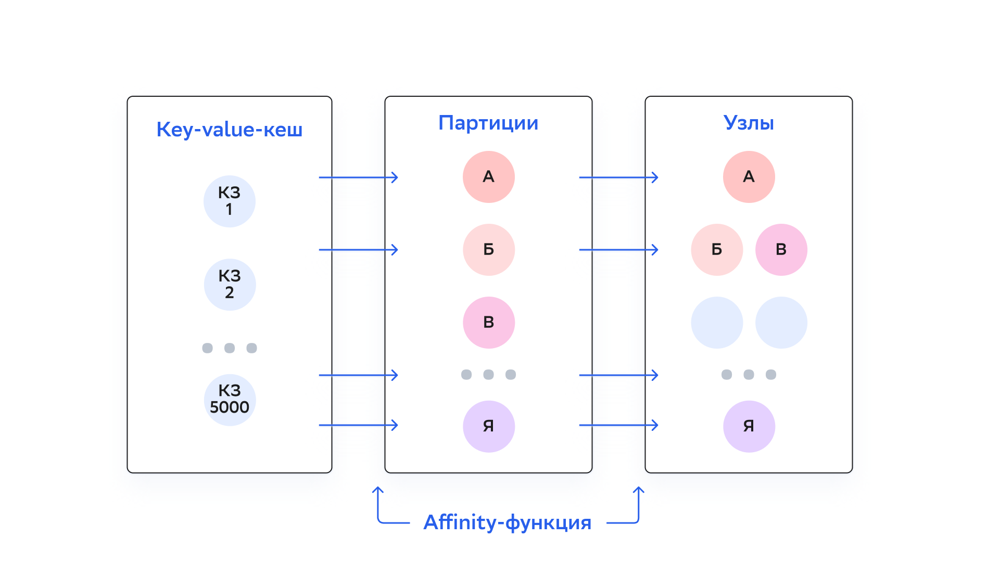
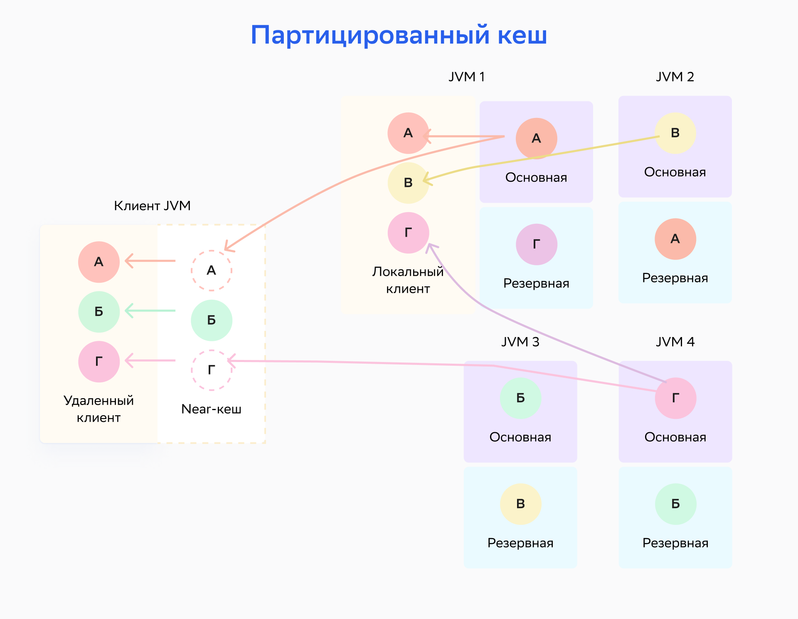
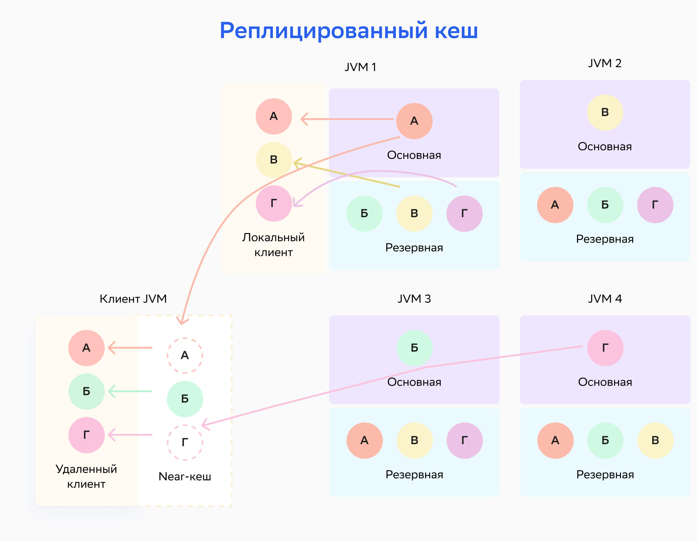

# Партиционирование данных

Партиционирование данных — метод разделения большого набора данных на мелкие части и равномерного распределения этих частей между серверными узлами.

Партиционирование данных контролируется affinity-функцией, которая устанавливает взаимно-однозначные сопоставления ключей и партиций. Каждая партиция определяется числом из ограниченного набора (для `RendezvousAffinityFunction` — от 0 до 1023 по умолчанию). Наборы партиций распределяются между доступными серверными узлами в топологии. Таким образом, каждый ключ соответствует определенному серверному узлу и хранится на нем. Структура данных в кластере DataGrid близка к распределенной хеш-таблице, в которой партиции — аналог корзин (buckets).

Когда количество серверных узлов в топологии меняется, партиции перераспределяются между узлами — этот процесс называется ребалансировкой (подробнее об этом написано в разделе [«Ребалансировка»](rebalancing.md)). В данном случае под топологией подразумевается базовая топология (Baseline). В персистентных кластерах выход узла не приводит к изменению базовой топологии и ребалансировке. Чтобы перераспределить данные на персистентных узлах, нужно менять базовую топологию вручную.

Affinity-функция принимает affinity-ключ в качестве аргумента. Affinity-ключом может быть любое поле объектов, которое хранится в кеше (любой столбец в SQL-таблице). Если affinity-ключ не указан, используется ключ по умолчанию (в случае SQL-таблиц — столбец `PRIMARY KEY`).

Партиционирование данных повышает производительность за счет распределения операций записи и чтения между серверными узлами. Также можно разработать свою модель данных таким образом, чтобы записи, которые используются вместе, хранились в одной партиции или на одном узле. В такой модели при запросе данных будет отсканировано небольшое количество партиций. Эта техника называется [Affinity Collocation](affinity_collocation.md).

Партиционирование данных помогает достичь горизонтальной масштабируемости на практически любом уровне. По мере роста объема данных в кластер можно добавить больше узлов. DataGrid гарантирует, что эти данные будут равномерно распределяться по всем узлам.

## Affinity-функция

Affinity-функция устанавливает, как записи данных распределяются по партициям, а партиции — по серверным узлам. Affinity-функция по умолчанию реализует алгоритм Rendezvous hashing. С ним возможны небольшие расхождения в распределении партиций по узлам: некоторые узлы могут быть ответственными за большее количество партиций, чем другие. Affinity-функция гарантирует, что при изменении топологии партиции перенесутся только на новый узел или только из вышедшего узла. Между остальными узлами обмен данными не происходит.

## Режимы PARTITIONED и REPLICATED

При создании кеша или SQL-таблицы можно выбрать partitioned (партицированный) или replicated (реплицированный) режим работы кеша. Режимы предназначены для разных сценариев использования и дают разные преимущества производительности и доступности.

### Режим PARTITIONED

В партицированном режиме все партиции равномерно распределены между всеми серверными узлами. Это наиболее масштабируемый режим распределенного кеша: он позволяет хранить столько данных, сколько позволяет общая память, которая доступна на всех узлах (ОЗУ и диск). То есть чем больше узлов, тем больше данных можно хранить.

Партицированный режим рекомендуется использовать при частых обновлениях данных, так как в нем обновляется только основная (primary) копия и соответствующее число резервных (backup) копий каждой пары «ключ-значение». При этом чтение данных занимает больше времени, так как только определенные основные и резервные узлы хранят конкретную пару «ключ-значение». Реплицированный режим, напротив, не рекомендуется использовать при частых обновлениях данных, так как в нем должен быть обновлен каждый узел.

:::{admonition} Внимание
:class: danger

Партицированный режим кеширования подходит для больших объемов данных с частыми обновлениями.
:::

На схеме ниже изображено распределение партицированного кеша. Ключ A присвоен узлу, который работает в JVM1; ключ B назначен узлу, который работает в JVM3, и так далее.

### Режим REPLICATED

В реплицированном режиме все данные (каждая партиция) копируются на каждый узел кластера. Этот режим обеспечивает максимальную доступность данных, так как они есть на каждом узле. Однако каждое обновление данных должно распространяться на все узлы кластера — это может влиять на производительность и масштабируемость.

:::{admonition} Внимание
:class: danger

Реплицированный режим кеширования подходит при небольшом объеме данных и редких обновлениях.
:::

На схеме ниже узел, который работает в JVM1, является основным для ключа А, но также хранит резервные копии для всех остальных ключей — Б, В и Г.

Так как одни и те же данные хранятся на всех узлах кластера, размер реплицированного кеша ограничен объемом памяти (ОЗУ и диска), который доступен на узле. Этот режим подходит для сценариев с небольшими наборами данных, где чтения кеша происходят гораздо чаще, чем записи. Если система выполняет поиск кеша в 80% случаев, стоит рассмотреть возможность использования режима `REPLICATED`.

## Резервные копии в партицированных кешах

По умолчанию для партицированных кешей DataGrid сохраняет одну копию каждой партиции, то есть одну копию всего набора данных. Если один или несколько узлов станут недоступными, пропадут партиции, которые хранятся на этих узлах. Чтобы избежать этого, настройте DataGrid для обеспечения резервных (backup) копий каждой партиции.

:::{admonition} Внимание
:class: danger

По умолчанию резервные копии данных в кешах отключены.
:::

Конфигурация резервных копий настраивается для каждого партицированного кеша (таблицы). При настройке двух резервных копий в кластере будут храниться три копии каждой партиции. Одна из партиций называется основной (primary), две остальные — резервными (backup). Серверный узел с основной партицией называется основным (primary) узлом для ключей, которые хранятся в этой партиции. Узлы с резервными копиями называются резервными (backup) узлами.

При выходе узла из кластера DataGrid запускает PME — Partition Map Exchange или процесс обмена партициями. Если резервные копии ключа настроены, PME установит одну из них в качестве основной.

Резервные копии увеличивают доступность данных и в некоторых случаях скорость операций чтения. По умолчанию DataGrid считывает данные с резервных копий партиций, если они доступны на локальном узле (эту настройку можно изменить, подробнее написано в подразделе [«Конфигурация кешей»](cache_setup.md) раздела «Настройка кешей»). Но резервирование приводит к росту потребления памяти и размера персистентного хранения, если оно включено.

:::{admonition} Внимание
:class: danger

Резервные копии партиций можно настроить только в режиме `PARTITIONED` — подробнее об этом написано в подразделе [«Настройка резервных партиций»](setting_up_backup_partitions.md) раздела «Настройка кешей».
:::

## PME

PME (Partition Map Exchange) — процесс обмена информацией между узлами об актуальном состоянии партиций по всему кластеру (карта партиций). Цель PME — установить актуальное состояние партиций для всего кластера, чтобы у всех узлов была информация, где искать ключи. PME требуется каждый раз, когда меняется распределение или доступность партиций для любого кеша. Например, когда узел входит топологию или выходит из нее по требованию пользователя или из-за сбоя.

Примеры событий, которые запускают процесс обмена партициями:

- вход и выход узлов из топологии (даже без смены базовой топологии);
- смена базовой топологии;
- смена состояния кластера (cluster state);
- создание и удаление кешей;
- создание снепшота и другие события.

При возникновении таких событий кластер ждет завершения всех текущих транзакций и запускает процесс PME. Новые транзакции откладываются до его завершения.

Exchange-процесс:

1. Узел-координатор запрашивает информацию о партициях у остальных узлов.
2. Узлы кластера отправляют свою локальную информацию узлу-координатору.
3. Когда узел-координатор получает информацию от всех узлов кластера, он объединяет ее в виде полной карты партиций и отправляет всем узлам.
4. Когда узел-координатор получает сообщения с подтверждением от всех узлов, процесс PME завершается.

## Ребалансировка

Подробнее написано в разделе [«Ребалансировка»](rebalancing.md).

## Политика потери партиций

Сбои в работе основных и резервных узлов могут привести к временной недоступности кластера и потере части данных. Подробнее о настройке работы кластера при сбоях написано в подразделе [«Политика потери партиций (Partition Loss Policy)»](partition_loss_policy.md) раздела «Настройка кешей».