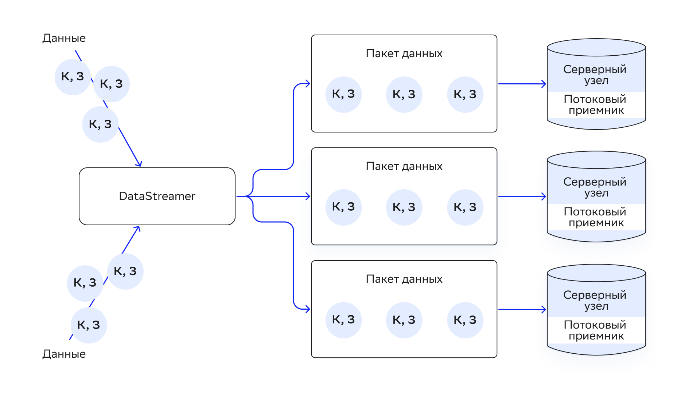

# Data Streaming

DataGrid предоставляет API `IgniteDataStreamer`, который предназначен для загрузки большого объема данных в кластер. Реализация данного API позволяет более эффективно и быстро загружать данные в кластер за счет параллелизма, буферизации и доставки на узлы согласно affinity-функции:



## Применение

Пользователь получает экземпляр `IgniteDataStreamer` для конкретного кеша и использует один из его методов для добавления данных.

Пример использования `IgniteDataStreamer`:

::::{md-tab-set}
:::{md-tab-item} Java
```java
// Получите DataStreamer и загрузите данные.
try (IgniteDataStreamer<Integer, String> stmr = ignite.dataStreamer("myCache")) {
    // Записи для Data Streaming.
    for (int i = 0; i < 100000; i++)
        stmr.addData(i, Integer.toString(i));
}
System.out.println("dataStreamerExample output:" + cache.get(99999));
```
:::

:::{md-tab-item} C\#/.NET
```c#
using (var stmr = ignite.GetDataStreamer<int, string>("myCache"))
{
    for (var i = 0; i < 1000; i++)
        stmr.AddData(i, i.ToString());
}
```
:::
::::

## Ограничения

`DataStreamer` не гарантирует:

- Согласованность данных до успешного выполнения их загрузки (при настройке по умолчанию).
- Моментальную загрузку данных. Данные могут буферизироваться на источнике перед отправкой на узел.
- Порядок данных. Записи данных могут быть загружены в кеш в порядке, который отличается от порядка в процессе загрузки в `DataStreamer`.
- Работу с внешними хранилищами данных (при настройке по умолчанию).

Если у свойства `allowOverwrite` указано значение `false` (поведение по умолчанию):
- В данных, которые загружаются в `DataStreamer`, не должны повторяться ключи.
- Остановка `DataStreamer` или сбои в работе узла, в который выполняется загрузка данных, могут вызвать их несогласованность.
- Загрузка данных в persistent-кеш с одновременным снятием снепшотов может привести к несогласованности данных в снепшоте и невозможности их полного восстановления.

Наиболее важное поведение `DataStreamer` определяется потоковым приемником и настройкой `AllowOverWrite`.

## StreamReceiver

`IgniteDataStreamer` — оркестратор, который не пишет данные сам. Запись данных выполняет приемник `StreamerReceiver`. Он по умолчанию предназначен для самой быстрой загрузки данных и меньшего числа сетевых запросов. С помощью этого приемника `DataStreamer` фокусируется на параллельной передаче резервных копий партиций и первичных записей.

Можно создать собственный `StreamerReceiver`. Логика приемника `DataStreamer` выполняется на узле, на котором хранятся данные.

::::{md-tab-set}
:::{md-tab-item} Java
```java
try (IgniteDataStreamer<Integer, String> stmr = ignite.dataStreamer("myCache")) {

    stmr.allowOverwrite(true);

    stmr.receiver((StreamReceiver<Integer, String>) (cache, entries) -> entries.forEach(entry -> {

        // Выполните действие с записью.
        cache.put(entry.getKey(), entry.getValue());
    }));
}
```
:::

:::{md-tab-item} C\#/.NET
```c#
private class MyStreamReceiver : IStreamReceiver<int, string>
{
    public void Receive(ICache<int, string> cache, ICollection<ICacheEntry<int, string>> entries)
    {
        foreach (var entry in entries)
        {
            // Выполните действие с записью.
            cache.Put(entry.Key, entry.Value);
        }
    }
}

public static void StreamReceiverDemo()
{
    var ignite = Ignition.Start();

    using (var stmr = ignite.GetDataStreamer<int, string>("myCache"))
    {
        stmr.AllowOverwrite = true;
        stmr.Receiver = new MyStreamReceiver();
   
}
```
:::
::::

:::{admonition} Внимание
:class: danger

Определения классов приемников потока, которые выполняются на удаленных узлах, должны быть доступны на узлах. Это можно сделать одним из двух способов:

- добавить классы в classpath узлов;
- включить функцию загрузки классов по сети — подробнее написано в подразделе [Peer Class Loading](peer_class_loading.md) раздела «Развертывание кода».
:::

Изменение `StreamerReceiver` по умолчанию меняет алгоритм распределения данных. Приемник, который используется не по умолчанию, отправляет пакеты данных только приемнику основного (primary) узла. Основному узлу также нужны запросы, чтобы отправлять записи для резервного копирования.

:::{admonition} Важно
:class: attention

Приемник потоков не помещает данные в кеш автоматически. Для этого нужно явно вызвать один из методов `PUT`.
:::

## Перезапись данных

По умолчанию существующие ключи в приемнике (receiver) не перезаписываются. Чтобы изменить это поведение, установите значение `true` для свойства `DataStreamer` `allowOverwrite`. Приемник по умолчанию не перезаписывает данные, поэтому автоматически выберется другой внутренний приемник. В некоторых случаях для достижения максимальной производительности может потребоваться пользовательская реализация приемника. Также в приемнике можно использовать метод `putIfAbsent`.

:::{code-block} java
:caption: Java
/**

 * Устанавливает пользовательский потоковый приемник для данного `DataStreamer`.

 * <p>

 * Останавливает {@link #allowOverwrite(boolean)} и устанавливает {@link #allowOverwrite()}, который возвращает {@code true}.

 *

 * @param rcvr Потоковый приемник.

 */

public void receiver(StreamReceiver<K, V> rcvr);
:::

:::{admonition} Внимание
:class: danger

При `allowOverwrite=false` (по умолчанию) обновления не распространяются на внешнее хранилище, если оно используется.
:::

::::{md-tab-set}
:::{md-tab-item} Java
```java
stmr.allowOverwrite(true);
```
:::

:::{md-tab-item} C\#/.NET
```c#
stmr.AllowOverwrite = true;
```
:::
::::

### StreamTransformer

Преобразователь `DataStreamer` — реализация приемника, которая обновляет данные. Поточные преобразователи используют преимущества коллокации и обновляют данные на узле, на котором они будут храниться.

Ниже находится пример, как использовать `StreamTransformer`, чтобы увеличить значение счетчика для каждого отдельного слова, которое найдено в текстовом потоке.

::::{md-tab-set}
:::{md-tab-item} Java
```java
String[] text = { "hello", "world", "hello", "Ignite" };
CacheConfiguration<String, Long> cfg = new CacheConfiguration<>("wordCountCache");

IgniteCache<String, Long> stmCache = ignite.getOrCreateCache(cfg);

try (IgniteDataStreamer<String, Long> stmr = ignite.dataStreamer(stmCache.getName())) {
    // Включите обновления данных.
    stmr.allowOverwrite(true);

    // Настройте преобразователь данных для подсчета экземпляров одного и того же слова.
    stmr.receiver(StreamTransformer.from((e, arg) -> {
        // Получите текущее значение.
        Long val = e.getValue();

        // Увеличьте значение на `1`.
        e.setValue(val == null ? 1L : val + 1);

        return null;
    }));

    // Добавьте слова в кеш `DataStreamer`.
    for (String word : text)
        stmr.addData(word, 1L);

}
```
:::

:::{md-tab-item} C\#/.NET
```c#
class MyEntryProcessor : ICacheEntryProcessor<string, long, object, object>
{
    public object Process(IMutableCacheEntry<string, long> e, object arg)
    {
        // Получите текущее значение.
        var val = e.Value;

        // Увеличьте значение на `1`.
        e.Value = val == 0 ? 1L : val + 1;

        return null;
    }
}

public static void StreamTransformerDemo()
{
    var ignite = Ignition.Start(new IgniteConfiguration
    {
        DiscoverySpi = new TcpDiscoverySpi
        {
            LocalPort = 48500,
            LocalPortRange = 20,
            IpFinder = new TcpDiscoveryStaticIpFinder
            {
                Endpoints = new[]
                {
                    "xxx.x.x.x:48500..48520"
                }
            }
        }
    });
    var cfg = new CacheConfiguration("wordCountCache");
    var stmCache = ignite.GetOrCreateCache<string, long>(cfg);

    using (var stmr = ignite.GetDataStreamer<string, long>(stmCache.Name))
    {
        // Включите обновления данных.
        stmr.AllowOverwrite = true;

        // Настройте преобразователь данных для подсчета экземпляров одного и того же слова.
        stmr.Receiver = new StreamTransformer<string, long, object, object>(new MyEntryProcessor());

        // Добавьте слова в кеш `DataStreamer`.
        foreach (var word in GetWords())
        {
            stmr.AddData(word, 1L);
        }
    }

    Console.WriteLine(stmCache.Get("a"));
    Console.WriteLine(stmCache.Get("b"));
}

static IEnumerable<string> GetWords()
{
    // Сгенерируйте список слов произвольным образом.
    return Enumerable.Repeat("a", 3).Concat(Enumerable.Repeat("b", 2));
}
```
:::
::::

### StreamVisitor

`StreamVisitor` — реализация потокового приемника, которая посещает каждую пару «ключ-значение» в потоке.

Ниже приведен пример, в котором есть два кеша: `marketData` и `instruments`. В примере в кеш `DataStreamer` `marketData` при поступлении помещаются рыночные данные. Поток `StreamVisitor` для `marketData` вызывается на участнике кластера, который связан с отдельным рыночным символом. При получении отдельных отметок по данным рынка кеш `instruments` обновляется последней рыночной ценой.

Кеш `marketData` не обновляется и остается пустым. Он используется для коллоцированной обработки рыночных данных в кластере непосредственно на узле, где хранятся данные.

::::{md-tab-set}
:::{md-tab-item} Java
```java
static class Instrument {
    final String symbol;
    Double latest;
    Double high;
    Double low;

    public Instrument(String symbol) {
        this.symbol = symbol;
    }

}

static Map<String, Double> getMarketData() {
    // Сгенерируйте рыночные данные произвольным образом.
    return new HashMap<>();
}

@Test
void streamVisitorExample() {
    try (Ignite ignite = Ignition.start()) {
        CacheConfiguration<String, Double> mrktDataCfg = new CacheConfiguration<>("marketData");
        CacheConfiguration<String, Instrument> instCfg = new CacheConfiguration<>("instruments");

        // Кеш для рыночных данных, которые загружаются в систему.
        IgniteCache<String, Double> mrktData = ignite.getOrCreateCache(mrktDataCfg);

        // Кеш для финансовых инструментов.
        IgniteCache<String, Instrument> instCache = ignite.getOrCreateCache(instCfg);

        try (IgniteDataStreamer<String, Double> mktStmr = ignite.dataStreamer("marketData")) {
             // Не загружайте данные в кеш 'marketData' (он остается пустым).
             // Вместо этого обновите кеш 'instruments' последней рыночной ценой.
 	            mktStmr.receiver(StreamVisitor.from((cache, e) -> {
                String symbol = e.getKey();
                Double tick = e.getValue();

                Instrument inst = instCache.get(symbol);

                if (inst == null)
                    inst = new Instrument(symbol);

                // Обновите цену инструмента по последним данным с рынка.
                inst.high = Math.max(inst.high, tick);
                inst.low = Math.min(inst.low, tick);
                inst.latest = tick;

                // Обновите кеш инструмента.
                instCache.put(symbol, inst);
            }));

            // Загрузите рыночные данные в кластер.
            Map<String, Double> marketData = getMarketData();
            for (Map.Entry<String, Double> tick : marketData.entrySet())
                mktStmr.addData(tick);
        }
    }
}
```
:::

:::{md-tab-item} C\#/.NET
```c#
class Instrument
{
    public readonly string Symbol;
    public double Latest { get; set; }
    public double High { get; set; }
    public double Low { get; set; }

    public Instrument(string symbol)
    {
        this.Symbol = symbol;
    }
}

private static Dictionary<string, double> getMarketData()
{
    // Сгенерируйте рыночные данные.
    return new Dictionary<string, double>
    {
        ["foo"] = 1.0,
        ["foo"] = 2.0,
        ["foo"] = 3.0
    };
}

public static void StreamVisitorDemo()
{
    var ignite = Ignition.Start(new IgniteConfiguration
    {
        DiscoverySpi = new TcpDiscoverySpi
        {
            LocalPort = 48500,
            LocalPortRange = 20,
            IpFinder = new TcpDiscoveryStaticIpFinder
            {
                Endpoints = new[]
                {
                    "xxx.x.x.x:48500..48520"
                }
            }
        }
    });

    var mrktDataCfg = new CacheConfiguration("marketData");
    var instCfg = new CacheConfiguration("instruments");

    // Кеш для отметок по данным с рынка, которые зугружаются в систему.
    var mrktData = ignite.GetOrCreateCache<string, double>(mrktDataCfg);
    // Кеш для финансовых инструментов.
    var instCache = ignite.GetOrCreateCache<string, Instrument>(instCfg);

    using (var mktStmr = ignite.GetDataStreamer<string, double>("marketData"))
    {
        // Не загружайте данные в кеш 'marketData' (он остается пустым).
        // Вместо этого обновите кеш 'instruments' последней рыночной ценой.
        mktStmr.Receiver = new StreamVisitor<string, double>((cache, e) =>
        {
            var symbol = e.Key;
            var tick = e.Value;

            Instrument inst = instCache.Get(symbol);

            if (inst == null)
            {
                inst = new Instrument(symbol);
            }

            // Обновите цены инструментов последними рыночными данными.
            inst.High = Math.Max(inst.High, tick);
            inst.Low = Math.Min(inst.Low, tick);
            inst.Latest = tick;
        });
        var marketData = getMarketData();
        foreach (var tick in marketData)
        {
            mktStmr.AddData(tick);
        }
        mktStmr.Flush();
        Console.Write(instCache.Get("foo"));
    }
}
```
:::
::::

## Настройка размера пула тредов DataStreamer

Пул тредов `DataStreamer` нужен для обработки пакетов данных. Размер пула по умолчанию рассчитывается по формуле:

```bash
max(8, total number of cores)
```
 
Изменить размер пула можно с помощью `IgniteConfiguration.setDataStreamerThreadPoolSize(…​)`:

::::{md-tab-set}
:::{md-tab-item} XML
```xml
<bean class="org.apache.ignite.configuration.IgniteConfiguration">
    <property name="dataStreamerThreadPoolSize" value="10"/>

    <!-- Другие свойства. -->

</bean>
```
:::

:::{md-tab-item} Java
```java
IgniteConfiguration cfg = new IgniteConfiguration();
cfg.setDataStreamerThreadPoolSize(10);

Ignite ignite = Ignition.start(cfg);
```
:::
::::