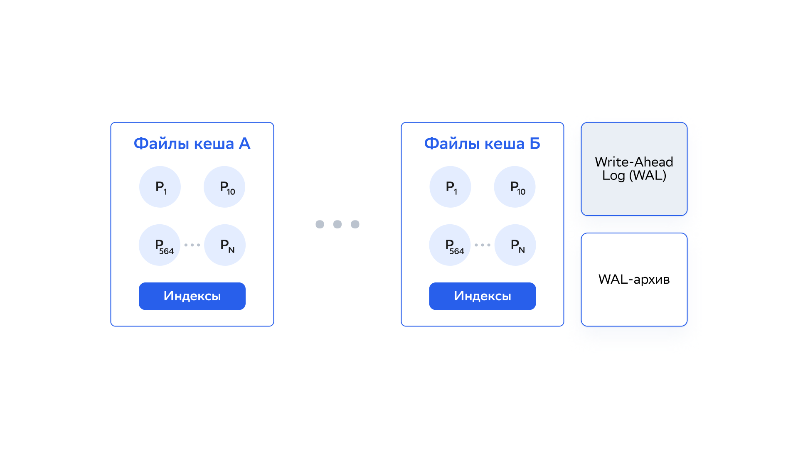
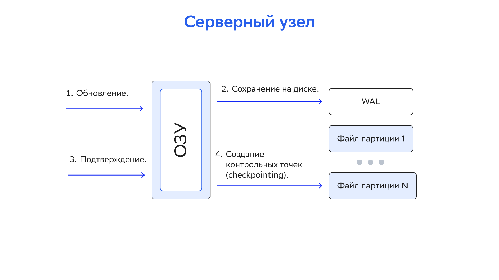

# Персистентность DataGrid

## Введение

DataGrid Persistence или Native Persistence — набор функций, которые предназначены для обеспечения постоянного хранения. При включенном Native Persistence DataGrid всегда сохраняет все данные на диске и загружает как можно больше данных в оперативную память для обработки. Например, если есть 100 записей, а ОЗУ способна хранить только 20, все 100 записей хранятся на диске и только 20 кешируются в ОЗУ для повышения производительности.

:::{admonition} Внимание
:class: danger

Подробнее о Native Persistence можно узнать из архитектуры внутреннего устройства хранилища DataGrid.
:::

Если Native Persistence отключен и внешнее хранилище данных не используется, DataGrid работает исключительно как in-memory-хранилище.

При включенном Native Persistence каждый серверный узел выделяет для постоянного хранения подмножество данных, которое включает только партиции этого узла. Если включено резервное копирование, в подмножество данных также входят резервные партиции — подробнее о них написано в подразделе [«Партиционирование данных»](data_partitioning.md) раздела «Моделирование данных».

Native Persistence основан на следующих функциях:

- хранение данных партиций на диске;
- WAL (журнал предзаписи);
- checkpoints (контрольные точки);
- CDC — подробнее написано в разделе [Change Data Capture (CDC)](change_data_capture.md);
- использование подкачки (swap) операционной системы.

При включенной персистентности DataGrid хранит все партиции в отдельном файле на диске. Формат данных в файлах партиций такой же, как и у данных, которые хранятся в памяти. Если резервное копирование партиций включено, резервные копии также хранятся на диске. Кроме данных партиций, DataGrid хранит индексы и метаданные.



Изменить расположение файлов данных по умолчанию можно в конфигурации — подробнее написано ниже в разделе [«Свойства конфигурации DataStorage»](#свойства-конфигурации-datastorage).

## Включение постоянного хранения

Native Persistence настраивается отдельно для каждого региона данных — подробнее о них написано в подразделе [«Конфигурация регионов данных»](configuration_of_data_regions.md) раздела «Настройка памяти». Можно одновременно пользоваться регионами данных с хранением в памяти и на диске. Чтобы включить Native Persistence, установите свойство `persistenceEnabled=true` в конфигурации региона данных.

Ниже пример, как включить постоянное хранилище для региона данных по умолчанию.

::::{md-tab-set}
:::{md-tab-item} XML
```xml
<bean class="org.apache.ignite.configuration.IgniteConfiguration">
    <property name="dataStorageConfiguration">
        <bean class="org.apache.ignite.configuration.DataStorageConfiguration">
            <property name="defaultDataRegionConfiguration">
                <bean class="org.apache.ignite.configuration.DataRegionConfiguration">
                    <property name="persistenceEnabled" value="true"/>
                </bean>
            </property>
        </bean>
    </property>
</bean>
```
:::

:::{md-tab-item} Java
```java
IgniteConfiguration cfg = new IgniteConfiguration();

// Настройка хранилища данных.
DataStorageConfiguration storageCfg = new DataStorageConfiguration();

storageCfg.getDefaultDataRegionConfiguration().setPersistenceEnabled(true);


cfg.setDataStorageConfiguration(storageCfg);

Ignite ignite = Ignition.start(cfg);
```
:::

:::{md-tab-item} С#/.NET
```c#
var cfg = new IgniteConfiguration
{
    DataStorageConfiguration = new DataStorageConfiguration
    {
        DefaultDataRegionConfiguration = new DataRegionConfiguration
        {
            Name = "Default_Region",
            PersistenceEnabled = true
        }
    }
};

Ignition.Start(cfg);
```
:::
::::

## Настройка каталога постоянного хранения данных

При включенном Native Persistence пользовательские данные, индексы и WAL-файлы хранятся в узлах в `{ignite_work_dir}/db` — каталоге хранения. Чтобы изменить его, установите свойство `storagePath` объекта `DataStorageConfiguration`, как показано в примере ниже.

В каждом узле в подкаталогах постоянного хранения есть данные кеша, WAL-файлов и файлов WAL-архива:

| Название подкаталога | Описание |
|---|---|
| `{WORK_DIR}/db/{nodeId}` | Каталог содержит данные кеша и индексы |
| `{WORK_DIR}/db/wal/{nodeId}` | Каталог содержит WAL-файлы |
| `{WORK_DIR}/db/wal/archive/{nodeId}` | Каталог содержит файлы WAL-архива |

В данном случае `nodeId` — согласованный идентификатор узла (consistent ID), если он определен в конфигурации узла, или автоматически генерируемый идентификатор. `nodeId` нужен, чтобы гарантировать уникальность каталогов узла. Если у нескольких узлов один и тот же рабочий каталог `WORK_DIR`, они используют разные подкаталоги.

Если рабочий каталог содержит файлы постоянного хранения для нескольких узлов (если существует несколько подкаталогов `nodeId` для разных узлов), узел выбирает первый неиспользуемый подкаталог. Если в настройках узла установить уникальное значение для `IgniteConfiguration.setConsistentId`, он всегда будет использовать определенные подкаталог и партиции данных — даже после перезапуска.

Ниже пример, как изменить каталог хранения:

::::{md-tab-set}
:::{md-tab-item} XML
```xml
<bean class="org.apache.ignite.configuration.IgniteConfiguration">
    <property name="dataStorageConfiguration">
        <bean class="org.apache.ignite.configuration.DataStorageConfiguration">
            <property name="defaultDataRegionConfiguration">
                <bean class="org.apache.ignite.configuration.DataRegionConfiguration">
                    <property name="persistenceEnabled" value="true"/>
                </bean>
            </property>
            <property name="storagePath" value="/opt/storage"/>
        </bean>
    </property>
</bean>
```
:::

:::{md-tab-item} Java
```java
IgniteConfiguration cfg = new IgniteConfiguration();

// Настройка хранилища данных.
DataStorageConfiguration storageCfg = new DataStorageConfiguration();

storageCfg.getDefaultDataRegionConfiguration().setPersistenceEnabled(true);

storageCfg.setStoragePath("/opt/storage");

cfg.setDataStorageConfiguration(storageCfg);

Ignite ignite = Ignition.start(cfg);
```
:::

:::{md-tab-item} С#/.NET
```c#
var cfg = new IgniteConfiguration
{
    DataStorageConfiguration = new DataStorageConfiguration
    {
        StoragePath = "/ssd/storage",

        DefaultDataRegionConfiguration = new DataRegionConfiguration
        {
            Name = "Default_Region",
            PersistenceEnabled = true
        }
    }
};

Ignition.Start(cfg);
```
:::
::::

Также можно изменить пути к WAL и WAL-архиву: укажите пути к каталогам вне `DataStorage`. Подробнее об этом написано в разделах ниже.

## WAL-журнал

WAL — журнал всех операций изменения и удаления данных, которые происходят на узле. Когда запись обновляется в оперативной памяти, обновление не записывается напрямую в файл с данными партиции, а добавляется в конец WAL. Только после регистрации в журнале предзаписи операция считается завершенной.

Цель WAL-журнала — предоставить механизм восстановления в сценариях, когда один узел или весь кластер выходит из строя. В случае сбоя или перезапуска кластер всегда можно восстановить до последней успешно зафиксированной транзакции с помощью содержимого WAL.

WAL состоит из нескольких файлов (активных сегментов) и архива. Активные сегменты заполняются последовательно и перезаписываются в циклическом порядке. Когда первый сегмент заполняется, его содержание копируется в [WAL-архив](#wal-архив). Пока копируется первый сегмент, второй рассматривается как активный WAL-файл и принимает все обновления со стороны приложения. По умолчанию существует 10 активных сегментов.

### Режимы WAL

Режимы отличаются по влиянию на производительность и гарантиям согласованности данных:

| Режим | Описание | Гарантии согласованности данных |
|---|---|---|
| `FSYNC` | Изменения гарантированно сохраняются на диске для каждой атомарной записи или транзакционного коммита | Обновления данных никогда не теряются при сбоях операционной системы или процесса и при отключении питания |
| `LOG_ONLY` | Режим по умолчанию.<br><br>Изменения для каждой атомарной записи или транзакционного коммита гарантированно сбросятся в буферный кеш операционной системы или в файл, который отображается в памяти.<br><br>Чтобы отключить режим, установите свойство системы `IGNITE_WAL_MMAP=false` | Обновления данных не теряются при сбоях в процессах |
| `BACKGROUND` | При включенном свойстве `IGNITE_WAL_MMAP` (включено по умолчанию) режим работает так же, как и `LOG_ONLY`.<br><br>Если свойство `IGNITE_WAL_MMAP` отключено, изменения остаются во внутреннем буфере узла и периодически сбрасываются на диск. Частота сброса определяется в параметре `walFlushFrequency` | При включенном свойстве `IGNITE_WAL_MMAP` (включено по умолчанию) режим дает такие же гарантии согласованности, как и `LOG_ONLY`.<br><br>В противном случае можно потерять недавние обновления данных при сбое процесса или перебоях в питании |
| `NONE` | WAL отключен. Изменения попадают на постоянное хранение только при корректном отключении узла. Чтобы деактивировать кластер или отключить узел, используйте `Ignite.active(false)` | Возможна потеря данных.<br><br>Если узел внезапно остановится во время операций обновления, хранящиеся на диске данные могут стать асинхронными или повредиться |

### WAL-архив

WAL-архив используется для хранения WAL-сегментов, которые могут потребоваться для восстановления узла после сбоя. Общий размер всех сегментов не должен превышать указанный размер WAL-архива.

По умолчанию максимальный размер WAL-архива (общее место, которое он занимает на диске) в 4 раза больше, чем размер checkpoint-буфера — подробнее о нем написано в разделе [«Настройка Persistence»](setting_up_persistence.md). Это значение можно изменить в [настройках](#свойства-конфигурации-datastorage).

:::{admonition} Внимание
:class: danger

Снижение размера WAL-архива до значения меньше, чем значение по умолчанию, может ухудшить производительность и должно быть протестировано перед использованием в production-окружении.
:::

### Изменение размера WAL-сегмента

Размер WAL-сегмента по умолчанию (64 Мб) может быть неэффективным в сценариях с высокой нагрузкой: WAL слишком часто переключается между сегментами — это дорогостоящая операция. Установка размера WAL-сегментов больше значения по умолчанию может помочь повысить производительность при высоких нагрузках за счет увеличения общего размера WAL-файлов и WAL-архива.

Изменить размер файлов WAL-сегмента можно в настройках хранения данных. Значение должно быть от 512 Кб до 2 Гб:

::::{md-tab-set}
:::{md-tab-item} XML
```xml
<bean class="org.apache.ignite.configuration.IgniteConfiguration" id="ignite.cfg">

    <property name="dataStorageConfiguration">
        <bean class="org.apache.ignite.configuration.DataStorageConfiguration">

            <!-- Установите размер WAL-сегментов 128 Мб. -->
            <property name="walSegmentSize" value="#{128 * 1024 * 1024}"/>

            <property name="defaultDataRegionConfiguration">
                <bean class="org.apache.ignite.configuration.DataRegionConfiguration">
                    <property name="persistenceEnabled" value="true"/>
                </bean>
            </property>

        </bean>
    </property>
</bean>
```
:::

:::{md-tab-item} Java
```java
IgniteConfiguration cfg = new IgniteConfiguration();
DataStorageConfiguration storageCfg = new DataStorageConfiguration();
storageCfg.getDefaultDataRegionConfiguration().setPersistenceEnabled(true);

storageCfg.setWalSegmentSize(128 * 1024 * 1024);

cfg.setDataStorageConfiguration(storageCfg);

Ignite ignite = Ignition.start(cfg);
```
:::
::::

### Отключение WAL

:::{admonition} Внимание
:class: danger

Отключение или включение WAL должно происходить только при стабильной топологии кластера. Все базовые узлы должны присутствовать, никакие узлы не должны присоединяться к кластеру или покидать его во время этой операции. В противном случае кеш может попасть в ситуацию несогласованности данных, и его нужно будет удалить.
:::

В некоторых ситуациях отключение WAL нужно для улучшения производительности. Например, полезно отключить WAL во время начальной загрузки данных и включить его после завершения предварительной загрузки данных.

::::{md-tab-set}
:::{md-tab-item} Java
```java
IgniteConfiguration cfg = new IgniteConfiguration();
DataStorageConfiguration storageCfg = new DataStorageConfiguration();
storageCfg.getDefaultDataRegionConfiguration().setPersistenceEnabled(true);

cfg.setDataStorageConfiguration(storageCfg);

Ignite ignite = Ignition.start(cfg);

ignite.cluster().state(ClusterState.ACTIVE);

String cacheName = "myCache";

ignite.getOrCreateCache(cacheName);

ignite.cluster().disableWal(cacheName);

// Загрузите данные.
ignite.cluster().enableWal(cacheName);
```
:::

:::{md-tab-item} С#/.NET
```c#
var cacheName = "myCache";
var ignite = Ignition.Start();
ignite.GetCluster().DisableWal(cacheName);

// Загрузите данные.

ignite.GetCluster().EnableWal(cacheName);
```
:::

:::{md-tab-item} SQL
```sql
ALTER TABLE Person NOLOGGING

//...

ALTER TABLE Person LOGGING
```
:::
::::

:::{admonition} Внимание
:class: danger

Если WAL отключен при перезагрузке узла, все данные на этом узле удалятся из постоянного хранилища. Без WAL нет гарантии согласованности данных при сбоях узлов и перезапуске.
:::

### Сжатие WAL-архива

Операция сжатия WAL-архива уменьшает место, которое он занимает. По умолчанию WAL-архив содержит сегменты по последним 20 контрольным точкам (это значение можно настроить). При включенном сжатии WAL-архива все заархивированные сегменты, которые сохранились до первой контрольной точки, сжимаются в формате `ZIP`. Если эти сегменты понадобятся, например для повторной ребалансировки между узлами, они будут распакованы в формате `RAW`.

Подробнее о том, как настроить сжатие WAL-архива, написано в разделе ниже.

### Сжатие записей WAL

Физические и логические записи, которые представляют обновления данных, записываются в WAL-файлы до подтверждения операции пользователя. DataGrid может сжать записи WAL в памяти до их попадания на диск, чтобы сохранить место.

Для сжатия записей WAL нужен включенный модуль `Ignite-Compress`. Подробнее о включении модулей написано в разделе [«Установка»](../../installation-guide/md/installation.md) документа «Руководство по установке».

По умолчанию сжатие записей WAL отключено. Чтобы включить его, установите алгоритм и уровень сжатия в настройках хранения данных:

::::{md-tab-set}
:::{md-tab-item} XML
```xml
<bean class="org.apache.ignite.configuration.IgniteConfiguration" id="ignite.cfg">
	<property name="dataStorageConfiguration">
		<bean class="org.apache.ignite.configuration.DataStorageConfiguration">
			<!-- Параметры сжатия страницы WAL. -->
			<property name="walPageCompression" value="LZ4"/>
			<property name="walPageCompressionLevel" value="8"/>
			<property name="defaultDataRegionConfiguration">
				<bean class="org.apache.ignite.configuration.DataRegionConfiguration">
					<property name="persistenceEnabled" value="true"/>
				</bean>
			</property>
		</bean>
	</property>
</bean>
```
:::

:::{md-tab-item} Java
```java
IgniteConfiguration cfg = new IgniteConfiguration();

DataStorageConfiguration dsCfg = new DataStorageConfiguration();
dsCfg.getDefaultDataRegionConfiguration().setPersistenceEnabled(true);

// Параметры сжатия страницы WAL.
dsCfg.setWalPageCompression(DiskPageCompression.LZ4);
dsCfg.setWalPageCompressionLevel(8);

cfg.setDataStorageConfiguration(dsCfg);
Ignite ignite = Ignition.start(cfg);
```
:::
::::

### Отключение WAL-архива

Архивирование WAL увеличивает накладные расходы, которые связаны с копированием WAL-сегментов в архив. Возможны ситуации, в которых DataGrid записывает данные в WAL-сегменты быстрее, чем они копируются в архив. Это может привести к возникновению узкого места ввода/вывода, которое остановит работу узла. В таких случаях попробуйте отключить архивирование WAL.

Для этого установите одно и то же значение для путей к WAL и WAL-архиву. DataGrid не будет копировать сегменты в архив и создаст новые сегменты в папке WAL. Старые сегменты удалятся по мере роста WAL (в зависимости от настроенного размера WAL-архива).

## Checkpointing

Checkpointing (создание контрольных точек) — процесс копирования «грязных» страниц из оперативной памяти в файлы партиций на диске. «Грязная» страница — страница, которая обновилась в оперативной памяти, но не записалась в соответствующий файл партиций (при этом обновление добавилось в WAL).

После создания контрольной точки все изменения сохранятся на диске и будут доступны при сбоях узла и его перезапуске.

Контрольные точки и WAL-журнал предназначены для обеспечения сохранности данных и восстановления в случае сбоя узла.



Процесс checkpointing помогает экономно использовать дисковое пространство и поддерживать страницы на диске в самом актуальном состоянии. После завершения процесса WAL-сегменты, которые были созданы до этого момента, можно удалять.

Подробнее о регулировании размера checkpoint-буфера написано в разделе [«Настройка Persistence»](setting_up_persistence.md).

## Свойства конфигурации DataStorage

Таблица свойств конфигурации `DataStorage` с описаниями и значениями по умолчанию:

| Свойство | Описание | Значение по умолчанию |
|---|---|---|
| `persistenceEnabled` | Чтобы включить Native Persistence, установите значение `true` | `false` |
| `storagePath` | Путь к каталогу, где хранятся данные | `${IGNITE_HOME}/work/db/node{IDX}-{UUID}` |
| `walPath` | Путь к каталогу, где хранятся активные WAL-сегменты | `${IGNITE_HOME}/work/db/wal/` |
| `walArchivePath` | Путь к WAL-архиву | `${IGNITE_HOME}/work/db/wal/archive/` |
| `walCompactionEnabled` | Чтобы включить [сжатие WAL-архива](#сжатие-wal-архива), установите значение `true` | `false` |
| `walSegmentSize` | Размер файла WAL-сегмента в байтах | `64MB` |
| `walMode` | [Режим WAL](#режимы-wal) | `LOG_ONLY` |
| `walCompactionLevel` | Уровень сжатия архива WAL: `1` — максимальная скорость сжатия, `9` — лучшее сжатие | `1` |
| `maxWalArchiveSize` | Максимальный размер (в байтах), который WAL-архив может занимать в файловой системе | 4 размера checkpoint-буфера — подробнее о нем написано в разделе [«Настройка Persistence»](setting_up_persistence.md) |