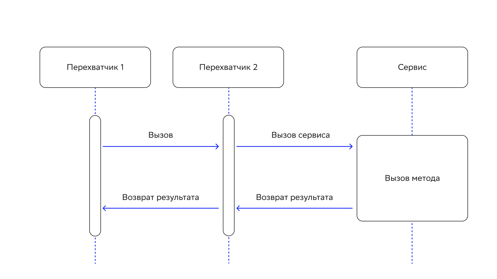

# Сервисы DataGrid

## Введение

Сервис — часть функциональности, которую можно развернуть в кластере DataGrid и с которой можно выполнять конкретные операции. На одном или нескольких узлах может быть несколько экземпляров сервиса.

У сервисов DataGrid есть функциональные особенности:

- **Балансировка нагрузки**. Во всех случаях, кроме развертывания сервисов Singleton, DataGrid гарантирует, что примерно одинаковое количество сервисов разворачивается на каждом узле кластера. При изменении топологии кластера DataGrid заново оценивает развертывание и может повторно развернуть сервис на другом узле для лучшего распределения нагрузки.
- **Отказоустойчивость**. DataGrid гарантирует постоянную доступность сервисов и то, что они всегда будут развернуты в соответствии с указанной конфигурацией, независимо от любых изменений топологии и сбоев узлов.
- **Горячее перераспределение**. Можно использовать конфигурацию `DeploymentSpi` кластера DataGrid для повторного развертывания сервисов без перезапуска кластера.

Сервисы DataGrid можно использовать в качестве основных решений по микросервисам в приложении.

## Внедрение сервиса

Сервисы внедряют интерфейс `Service`, в котором есть три метода:

- `init()` — DataGrid вызывает метод до развертывания сервиса (`execute()`);
- `execute()` — начинает выполнение сервиса;
- `cancel()` — отменяет выполнение сервиса.

## Развертывание сервиса

Сервис можно разворачивать программно во время выполнения или через передачу конфигурации как части настроек узла (в этом случае сервис разворачивается вместе с запуском кластера).

### Развертывание сервисов во время выполнения

Разворачивать сервисы во время выполнения можно с помощью экземпляра `IgniteServices`. Чтобы получить его из экземпляра `Ignite`, вызовите метод `Ignite.services()`.

В интерфейсе `IgniteServices` есть несколько методов для развертывания сервисов:

- `deploy(ServiceConfiguration)` развертывает сервис, который определен через конфигурацию.
- `deployNodeSingleton(…​)` проверяет, что экземпляр сервиса выполняется на каждом серверном узле.
- `deployClusterSingleton(…​)` развертывает один экземпляр сервиса на кластер. Если узел, на котором развернут сервис, останавливается, DataGrid автоматически повторно развертывает сервис на другом узле.
- `deployKeyAffinitySingleton(…​)` развертывает один экземпляр сервиса на основном узле по определенному ключу кеша.
- `deployMultiple(…​)` развертывает указанное количество экземпляров сервиса.

::::{admonition} Пример развертывания кластера Singleton
:class: hint

:::{code-block} java
:caption: Java
Ignite ignite = Ignition.start();

// Получите интерфейс сервисов, который относится ко всем серверным узлам.
IgniteServices services = ignite.services();

// Запустите узел Singleton.
services.deployClusterSingleton("myCounterService", new MyCounterServiceImpl());
:::
::::

::::{admonition} Пример, как развернуть отдельный кластер с помощью `ServiceConfiguration`
:class: hint

:::{code-block} java
:caption: Java
Ignite ignite = Ignition.start();

ServiceConfiguration serviceCfg = new ServiceConfiguration();

serviceCfg.setName("myCounterService");
serviceCfg.setMaxPerNodeCount(1);
serviceCfg.setTotalCount(1);
serviceCfg.setService(new MyCounterServiceImpl());

ignite.services().deploy(serviceCfg);
:::
::::

### Развертывание сервисов при запуске узла

Если указать настройки сервиса в конфигурации узла, можно запустить сервис одновременно с ним. Если сервис является Singleton для узла, он запускается на каждом узле кластера. Если сервис является Singleton для кластера, он запускается на первом узле кластера и повторно развертывается на одном из узлов, когда первый завершает работу. Сервис нужно указывать в classpath каждого узла.

Ниже пример настройки сервиса Singleton для кластера.

::::{md-tab-set}
:::{md-tab-item} XML
```xml
<bean class="org.apache.ignite.configuration.IgniteConfiguration">

    <property name="serviceConfiguration">
        <list>
            <bean class="org.apache.ignite.services.ServiceConfiguration">
                <property name="name" value="myCounterService"/>
                <property name="maxPerNodeCount" value="1"/>
                <property name="totalCount" value="1"/>
                <property name="service">
                    <bean class="org.apache.ignite.snippets.services.MyCounterServiceImpl"/>
                </property>
            </bean>
        </list>
    </property>

</bean>
```
:::

:::{md-tab-item} Java
```java
ServiceConfiguration serviceCfg = new ServiceConfiguration();

serviceCfg.setName("myCounterService");
serviceCfg.setMaxPerNodeCount(1);
serviceCfg.setTotalCount(1);
serviceCfg.setService(new MyCounterServiceImpl());

IgniteConfiguration igniteCfg = new IgniteConfiguration()
        .setServiceConfiguration(serviceCfg);

// Запустите узел.
Ignite ignite = Ignition.start(igniteCfg);
```
:::
::::

## Развертывание сервисов в подмножестве узлов

Если получить интерфейс `IgniteServices` с помощью вызова метода `ignite.services()`, экземпляр `IgniteServices` будет связан со всеми серверными узлами. Так DataGrid выбирает, на каком серверном узле из набора развернуть сервис. Изменить набор узлов, которые рассматриваются для развертывания сервисов, можно с помощью подходов, описанных в разделах ниже.

### Кластер Singleton

Кластер-одиночка — стратегия развертывания, при которой есть только один экземпляр сервиса в кластере, и DataGrid гарантирует его доступность. Если узел кластера, на котором развернут сервис, отключится или выйдет из строя, DataGrid автоматически выполнит повторное развертывание экземпляра на другом узле.

### Интерфейс ClusterGroup

Для развертывания сервисов в подмножестве узлов можно использовать интерфейс `ClusterGroup`. Если сервис является Singleton для узла, его разворачивают на всех узлах подмножества. Если сервис является Singleton для кластера, он разворачивается только на одном из узлов подмножества.

:::{code-block} java
:caption: Java
Ignite ignite = Ignition.start();

// Разверните сервис на узлах, которые содержат кеш `myCache`.
ignite.services(ignite.cluster().forCacheNodes("myCache"));
:::

### Node Filter (фильтр узла)

Атрибуты узла помогут определить подмножества для размещения сервисов. Сделать это можно через фильтр узла — предикат `IgnitePredicate<ClusterNode>`. DataGrid вызывает его для каждого узла, который связан с интерфейсом `IgniteService`. Если предикат возвращает значение `true` для данного узла, значит он включен в подмножество узлов для размещения сервисов.

:::{admonition} Внимание
:class: danger

Класс фильтра узла нужно указывать в classpath всех узлов.
:::

Фильтр включает серверные узлы, в которых есть атрибут `west.coast.node`. 

:::{admonition} Пример фильтра узла
:class: hint

```bash
public static class ServiceFilter implements IgnitePredicate<ClusterNode> {
    @Override
    public boolean apply(ClusterNode node) {
        // Сервис будет размещен на серверных узлах,
        // в которых есть атрибут 'west.coast.node'.
        return !node.isClient() && node.attributes().containsKey("west.coast.node");
    }
}
```
:::

:::{admonition} Пример, как развернуть сервис с помощью фильтра узла
:class: hint

```bash
Ignite ignite = Ignition.start();

ServiceConfiguration serviceCfg = new ServiceConfiguration();

// Установите экземпляр сервиса для развертывания.
serviceCfg.setService(new MyCounterServiceImpl());
serviceCfg.setName("serviceName");
serviceCfg.setMaxPerNodeCount(1);

// Установите фильтр узлов.
serviceCfg.setNodeFilter(new ServiceFilter());

// Получите экземпляр `IgniteService`.
IgniteServices services = ignite.services();

// Разверните сервис.
services.deploy(serviceCfg);
```
:::

### Кеш-ключ

С помощью Affinity можно развернуть сервис на основном узле для конкретного ключа определенного кеша. Подробнее об этом написано в подразделе [Affinity Collocation](affinity_collocation.md) раздела «Моделирование данных».

Для развертывания с помощью Affinity укажите желаемый кеш и ключ в конфигурации сервиса. Кеш необязательно должен содержать ключ; узел определяет affinity-функция. Если топология кластера меняется и ключ назначается на другой узел, сервис также переводится на этот узел.

:::{code-block} java
:caption: Java
Ignite ignite = Ignition.start();

// Убедитесь, что кеш существует.
ignite.getOrCreateCache("orgCache");

ServiceConfiguration serviceCfg = new ServiceConfiguration();

// Установите экземпляр сервиса для развертывания.
serviceCfg.setService(new MyCounterServiceImpl());

// Установите название сервиса.
serviceCfg.setName("serviceName");
serviceCfg.setTotalCount(1);

// Укажите название кеша и ключ для развертывания с помощью Affinity.
serviceCfg.setCacheName("orgCache");
serviceCfg.setAffinityKey(123);

IgniteServices services = ignite.services();

// Разверните сервис.
services.deploy(serviceCfg);
:::

## Доступ к сервисам

Доступ к сервисам можно получить во время выполнения через прокси. Они могут быть `sticky` или `non-sticky`. `Sticky`-прокси всегда подключается к одному и тому же узлу кластера, чтобы получить доступ к удаленно развернутому сервису. `Non-sticky`-прокси выравнивает нагрузку вызовов с удаленных сервисов по узлам кластера, на которых развернут сервис.

::::{admonition} Пример, как получить `non-sticky`-прокси сервиса и вызвать его метод
:class: hint

:::{code-block} java
:caption: Java
// Получите доступ к сервису по названию.
MyCounterService counterService = ignite.services().serviceProxy("myCounterService",
        MyCounterService.class, false); // Non-sticky-прокси.

// Вызовите метод сервиса.
counterService.increment();
:::
::::

## Service Awareness

Для тонкого клиента Java можно подключить осведомленность о сервисах (Service Awareness). Для этого включите функцию Partition Awareness — подробнее о ней написано в подразделе [«Тонкий клиент Java»](java_thin_client.md) раздела «Тонкие клиенты».

Без включенной функции Service Awareness вызовы запросов направляются произвольному узлу. Без развернутого экземпляра сервиса запросы перенаправляются разным узлам. Дополнительные сетевые переходы добавляют накладные расходы.

С включенной функцией Service Awareness тонкий клиент знает, где развернуты экземпляры сервиса, и отправляет запрос напрямую нужному узлу.

:::{admonition} Внимание
:class: danger

Топология сервиса обновляется асинхронно, начиная с первого вызова сервиса, то есть возможны некоторые перенаправления вызова.
:::

## Отключение развертывания сервисов

Чтобы прекратить развертывание сервисов, вызовите метод `IgniteServices.cancel(serviceName)` или `IgniteServices.cancelAll()`:

:::{code-block} java
:caption: Java
services.cancel("myCounterService");
:::

## Повторное развертывание сервисов

Для повторного развертывания сервиса:

1. Обновите JAR-файл(ы) в месте, где хранится сервис (на него указывает свойство `UriDeploymentSpi.uriList`). DataGrid перезагрузит новые классы после заданного периода обновления.
2. Добавьте реализацию сервиса в classpath клиентского узла и запустите его.
3. Вызовите метод `Ignite.services().cancel()` на клиентском узле для остановки сервиса.
4. Разверните сервис с клиентского узла.
5. Остановите клиентский узел.

## Сбор статистики по работе сервисов

Данные по продолжительности работы методов сервиса собираются в статистику. Чтобы получить ее, подключите сбор статистики в конфигурации методов сервиса. Статистика по сервисам собирается в метриках (`Services`), в виде системных представлений и в JMX.

::::{admonition} Пример, как подключить статистику
:class: hint

:::{code-block} java
:caption: Java
Ignite ignite = Ignition.start();

ServiceConfiguration serviceCfg = new ServiceConfiguration();

serviceCfg.setName("myService");
serviceCfg.setMaxPerNodeCount(1);
serviceCfg.setService(new MyCounterServiceImpl());

// Подключите статистику по сервисам.
serviceCfg.setStatisticsEnabled(true);

ignite.services().deploy(serviceCfg);

// Работает через прокси. Прямые ссылки, например 'IgniteServices#service()', повреждают статистические данные.
MyCounterService svc = ignite.services().serviceProxy("myService", MyCounterService.class, true);
:::
::::

:::{admonition} Важно
:class: attention

Стоит учитывать, что:

- Прямые ссылки на сервисы, например `IgniteServices.service(name)`, повреждают статистические данные. Вместо них используйте прокси `IgniteServices.serviceProxy(…)`.
- У перегруженных методов сервиса одинаковая метрика по названию метода.
- Статистика по сервисам не учитывает вопросы сериализации и связи.
- Сбор статистики по сервисам замедляет вызов их методов. Это не создает проблем для работы с базой данных и кешем.
:::

## Промежуточное программное обеспечение сервиса (Service Middleware)

:::{admonition} Внимание
:class: danger

Это экспериментальная функциональность, которая может измениться в будущих релизах. Она также может влиять на эффективность выполнения сервисов.
:::

DataGrid позволяет внедрять пользовательскую логику промежуточного программного обеспечения для сервисов с возможностями:

- неявно передавать пользовательские неизменяемые параметры от прокси к сервису (аналогично заголовкам запросов);
- определять пользовательский перехватчик для вызова методов сервиса.

### Контекст вызова сервисов

Функциональность позволяет явно передавать параметры для любого метода сервиса без его повторного развертывания.

Можно создавать контекст и связывать его с прокси сервиса. После этого каждый вызов прокси-метода также будет косвенно передавать параметры контекста в сервис:

:::{code-block} java
:caption: Java
try (Ignite ignite = Ignition.start()) {
    ignite.services().deployClusterSingleton("EchoService", new EchoServiceImpl());

    // Создайте контекст.
    ServiceCallContext johnCtx = ServiceCallContext.builder().put("user", "John").build();
    ServiceCallContext maryCtx = ServiceCallContext.builder().put("user", "Mary").build();

    // Свяжите его с прокси сервиса.
    EchoService johnProxy = ignite.services().serviceProxy("EchoService", EchoService.class, false, johnCtx);
    EchoService maryProxy = ignite.services().serviceProxy("EchoService", EchoService.class, false, maryCtx);

    // Выведите "Hello John!".
    System.out.println(johnProxy.hello());

    // Выведите "Hello Mary!".
    System.out.println(maryProxy.hello());
}
:::

Прочитать `call context` можно с помощью метода `currentCallContext` от `ServiceContext`.

:::{admonition} Внимание
:class: danger

Контекст вызова сервиса доступен из текущего потока во время выполнения метода сервиса.
:::

:::{code-block} java
:caption: Java
@ServiceContextResource
private ServiceContext ctx;

/** {@inheritDoc} */
@Override public String hello() {
    ServiceCallContext callCtx = ctx.currentCallContext();

    String proxyUser = callCtx != null ? callCtx.attribute("user") : null;

    return String.format("Hello %s!", (proxyUser == null || proxyUser.isEmpty() ? "anonymous" : proxyUser));
}
:::

### Перехватчик сервисов (Service Interceptor)

Функциональность позволяет перехватывать вызов любого метода сервиса, кроме методов жизненного цикла (`init()`, `execute()` и `cancel()`).

Можно установить один или несколько перехватчиков в `ServiceConfiguration`. Их развертывают вместе с сервисами при помощи одного загрузчика классов.

Перехватчики ссылаются друг на друга по цепочке с помощью делегированного вызова, в котором последний перехватчик вызывает метод сервиса. Перехватчик, который указан первым в конфигурации, также является последним и обрабатывает результат выполнения метода сервиса:



:::{admonition} Внимание
:class: danger

Неправильное внедрение перехватчика может привести к неопределенному поведению сервисов.
:::

### Пример создания перехватчика

Ниже пример, как создать перехватчик вызова сервиса:

::::{md-tab-set}
:::{md-tab-item} Java
```java
public class EchoServiceAccessInterceptor implements ServiceCallInterceptor {
    /** {@inheritDoc} */
    @Override public Object invoke(String mtd, Object[] args, ServiceContext ctx, Callable<Object> next) throws Exception {
        ServiceCallContext callCtx = ctx.currentCallContext();

        if (callCtx == null || callCtx.attribute("user") == null)
            throw new SecurityException("Anonymous access is restricted.");

        return next.call();
    }
}
```
:::

:::{md-tab-item} C\#/.NET 
```c#
public class EchoServiceAccessInterceptor : IServiceCallInterceptor {
    /** <inheritdoc /> */
    public object Invoke(string mtd, object[] args, IServiceContext ctx, Func<object> next)
    {
        IServiceCallContext callCtx = ctx.CurrentCallContext;

         if (callCtx == null || callCtx.GetAttribute("user") == null)
             throw new SecurityException("Anonymous access is restricted.");

         return next.Invoke();
     }
}
```
:::
::::