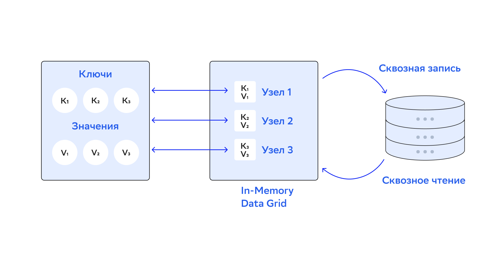

# Внешнее хранение

## Введение

DataGrid может выполнять роль слоя кеширования в существующей базе данных, например в реляционных базах или базах NoSQL (Apache Cassandra, MongoDB). Обработка данных в памяти ускоряет работу основной базы. DataGrid обеспечивает нестандартную интеграцию с Apache Cassandra. Для других баз данных NoSQL, с которыми интеграция недоступна, можно создать собственную реализацию интерфейса `CacheStore` — подробнее написано в разделе [«Реализация пользовательского интерфейса CacheStore»](implementation_of_cachestore_user_interface.md).

Два основных варианта использования внешнего хранилища:

- Уровень кеширования для существующей базы данных. Загрузка данных в память улучшит скорость их обработки. Можно подключить поддержку SQL для базы данных, в которой ее нет (при загрузке всех данных в память).
- Хранение данных во внешней базе вместо использования Native Persistence — подробнее написано в разделе [«Персистентность DataGrid»](datagrid_persistence.md).



Интерфейс `Cachestore` наследует `javax.cache.integration.CacheLoader` и `javax.cache.integration.CacheWriter`, которые используются для сквозных чтения и записи. Можно сделать реализацию каждого интерфейса и по отдельности добавить их в конфигурацию кеша.

:::{admonition} Внимание
:class: danger

Дополнительно к операциям «ключ-значение» DataGrid записывает результаты SQL-запросов `INSERT`, `UPDATE` и `MERGE`. Запросы `SELECT` никогда не вычитывают данные из внешней базы.
:::

### Сквозные чтение и запись

Сквозное чтение означает, что недоступные в кеше данные считываются из постоянного хранилища. Это работает только для запросов `GET`, которые выполняются через Key-Value API. Запросы `SELECT` никогда не вычитывают данные из внешней базы. Чтобы выполнить запросы `SELECT`, загрузите данные в кеш базы с помощью метода `loadCache()`.

Сквозная запись означает, что при обновлении в кеше данные автоматически сохраняются в постоянном хранилище. Все операции сквозных чтения и записи участвуют в транзакциях с кешем и завершаются или откатываются целиком.

### Кеширование отложенной записи 

В режиме сквозной записи все операции `put` и `remove` выполняют соответствующие запросы в постоянное хранилище, поэтому общая продолжительность операции обновления может быть довольно долгой. Также высокая скорость обновления кеша может вызвать увеличение нагрузки на хранилище.

Для таких случаев можно включить режим отложенной записи (write-behind), при котором операции обновления выполняются асинхронно. Основной принцип этого подхода — накапливать обновления и асинхронно сбрасывать их в базу данных в виде пакетной (bulk) операции. Можно запустить сброс данных на основе:

- событий времени — ограничить максимальное время, которое запись может находиться в очереди;
- событий по размеру очереди — сбрасывать очередь, когда она достигает определенного размера;
- обоих типов событий в зависимости от того, какое из них произошло первым.

:::{admonition} Производительность и согласованность
:class: hint

Включение кеширования отложенной записи повышает производительность с помощью выполнения асинхронных обновлений. Это может привести к потенциальному снижению согласованности, так как можно потерять некоторые обновления из-за отказов узлов и аварийных ситуаций.
:::

При использовании подхода отложенной записи в базовое хранилище записывается только последнее обновление записи. Если запись кеша с ключом `key1` последовательно обновляется значениями `value1`, `value2` и `value3` соответственно, только одна пара `(key1, value3)` попадет в постоянное хранилище.

:::{admonition} Производительность операций `UPDATE`
:class: hint

Пакетные операции обычно эффективнее последовательности отдельных операции. Чтобы воспользоваться пакетными операциями, подключите их отдельно в режиме отложенной записи. Последовательности обновлений похожих типов (`put` или `remove`) можно сгруппировать в одну пакетную операцию. Например, если поместить пары `(key1, value1)`, `(key2, value2)` и `(key3, value3)` последовательно, все три операции попадут в одну пакетную `Cachestore.putAll(…)`.
:::

## Интеграция с реляционными базами данных

Если реляционная база данных — основная база приложений, используйте одну из реализаций `CacheStore`:

- `CacheJdbcPojoStore` хранит объекты как набор полей с помощью рефлексии (reflection). Используйте эту реализацию, если добавляете DataGrid к существующей базе данных и хотите использовать определенные (или все) поля базовой таблицы.
- `CacheJdbcBlobStore` хранит объекты в основной базе данных в формате BLOB-объекта. Опция полезна в сценариях, когда внешняя база данных используется для постоянного хранения и данные хранятся в простом формате.

Ниже указаны примеры настроек для обеих реализаций `CacheStore`.

### CacheJdbcPojoStore

Позволяет хранить объекты как набор полей и настраивать сопоставления между колонками таблиц или полями объектов через конфигурацию. Настройка реализации:

1. Установите свойство `CacheConfiguration.cacheStoreFactory` для `org.apache.ignite.cache.store.jdbc.CacheJdbcPojoStoreFactory` и укажите свойства:
   - `dataSourceBean` — учетные данные для подключения к базе данных: URL, имя пользователя, пароль.
   - `dialect` — применяет SQL-диалект, который совместим с используемой базой данных. DataGrid предоставляет готовые реализации для баз данных MySQL, H2, SQLServer и DB2. Найти эти диалекты можно в пакете `org.apache.ignite.cache.store.jdbc.dialect` дистрибутива DataGrid.
   - `types` — определяет сопоставления между таблицей баз данных и соответствующим POJO (пример конфигурации POJO есть ниже).

2. Дополнительно можно настроить объекты (query entities) для выполнения SQL-запросов в кеше.

Пример ниже показывает, как настроить кеш DataGrid в качестве слоя для таблицы MySQL. В ней есть 2 столбца: идентификатор (`INTEGER`) и название (`VARCHAR`) — они сопоставлены с объектами класса `Person`.

Пример, как настроить `CacheJdbcPojoStore`:

::::{md-tab-set}
:::{md-tab-item} XML
```xml
<beans xmlns="http://www.springframework.org/schema/beans" xmlns:util="http://www.springframework.org/schema/util" xmlns:xsi="http://www.w3.org/2001/XMLSchema-instance" xsi:schemaLocation="         http://www.springframework.org/schema/beans              http://www.springframework.org/schema/beans/spring-beans.xsd              http://www.springframework.org/schema/util              http://www.springframework.org/schema/util/spring-util.xsd">
    <!-- Источник данных bean. -->
    <bean class="com.mysql.cj.jdbc.MysqlDataSource" id="mysqlDataSource">
        <property name="URL" value="jdbc:mysql://[host]:[port]/[database]"/>
        <property name="user" value="YOUR_USER_NAME"/>
        <property name="password" value="YOUR_PASSWORD"/>
    </bean>
    <!-- Конфигурация DataGrid. -->
    <bean class="org.apache.ignite.configuration.IgniteConfiguration">
        <property name="cacheConfiguration">
            <list>
                <!-- Конфигурация `PersonCache`. -->
                <bean class="org.apache.ignite.configuration.CacheConfiguration">
                    <property name="name" value="PersonCache"/>
                    <property name="cacheMode" value="PARTITIONED"/>
                    <property name="atomicityMode" value="ATOMIC"/>
                    <property name="cacheStoreFactory">
                        <bean class="org.apache.ignite.cache.store.jdbc.CacheJdbcPojoStoreFactory">
                            <property name="dataSourceBean" value="mysqlDataSource"/>
                            <property name="dialect">
                                <bean class="org.apache.ignite.cache.store.jdbc.dialect.MySQLDialect"/>
                            </property>
                            <property name="types">
                                <list>
                                    <bean class="org.apache.ignite.cache.store.jdbc.JdbcType">
                                        <property name="cacheName" value="PersonCache"/>
                                        <property name="keyType" value="java.lang.Integer"/>
                                        <property name="valueType" value="org.apache.ignite.snippets.Person"/>
                                        <!-- Если применимо: укажите схему -->
                                        <!--`property name="databaseSchema" value="MY_DB_SCHEMA"/`.-->
                                        <property name="databaseTable" value="PERSON"/>
                                        <property name="keyFields">
                                            <list>
                                                <bean class="org.apache.ignite.cache.store.jdbc.JdbcTypeField">
                                                    <constructor-arg>
                                                        <util:constant static-field="java.sql.Types.INTEGER"/>
                                                    </constructor-arg>
                                                    <constructor-arg value="id"/>
                                                    <constructor-arg value="int"/>
                                                    <constructor-arg value="id"/>
                                                </bean>
                                            </list>
                                        </property>
                                        <property name="valueFields">
                                            <list>
                                                <bean class="org.apache.ignite.cache.store.jdbc.JdbcTypeField">
                                                    <constructor-arg>
                                                        <util:constant static-field="java.sql.Types.INTEGER"/>
                                                    </constructor-arg>
                                                    <constructor-arg value="id"/>
                                                    <constructor-arg value="int"/>
                                                    <constructor-arg value="id"/>
                                                </bean>
                                                <bean class="org.apache.ignite.cache.store.jdbc.JdbcTypeField">
                                                    <constructor-arg>
                                                        <util:constant static-field="java.sql.Types.VARCHAR"/>
                                                    </constructor-arg>
                                                    <constructor-arg value="name"/>
                                                    <constructor-arg value="java.lang.String"/>
                                                    <constructor-arg value="name"/>
                                                </bean>
                                            </list>
                                        </property>
                                    </bean>
                                </list>
                            </property>
                        </bean>
                    </property>
                    <property name="readThrough" value="true"/>
                    <property name="writeThrough" value="true"/>
                    <!-- Если хотите использовать SQL-запросы, настройте объекты запросов. -->
                    <property name="queryEntities">
                        <list>
                            <bean class="org.apache.ignite.cache.QueryEntity">
                                <property name="keyType" value="java.lang.Integer"/>
                                <property name="valueType" value="org.apache.ignite.snippets.Person"/>
                                <property name="keyFieldName" value="id"/>
                                <property name="keyFields">
                                    <list>
                                        <value>id</value>
                                    </list>
                                </property>
                                <property name="fields">
                                    <map>
                                        <entry key="name" value="java.lang.String"/>
                                        <entry key="id" value="java.lang.Integer"/>
                                    </map>
                                </property>
                            </bean>
                        </list>
                    </property>
                </bean>
                <!-- Предоставьте аналогичные конфигурации для других кешей/таблиц. -->
            </list>
        </property>
    </bean>
</beans>
```
:::

:::{md-tab-item} Java
```java
IgniteConfiguration igniteCfg = new IgniteConfiguration();

CacheConfiguration<Integer, Person> personCacheCfg = new CacheConfiguration<>();

personCacheCfg.setName("PersonCache");
personCacheCfg.setCacheMode(CacheMode.PARTITIONED);
personCacheCfg.setAtomicityMode(CacheAtomicityMode.ATOMIC);

personCacheCfg.setReadThrough(true);
personCacheCfg.setWriteThrough(true);

CacheJdbcPojoStoreFactory<Integer, Person> factory = new CacheJdbcPojoStoreFactory<>();
factory.setDialect(new MySQLDialect());
factory.setDataSourceFactory((Factory<DataSource>)() -> {
    MysqlDataSource mysqlDataSrc = new MysqlDataSource();
    mysqlDataSrc.setURL("jdbc:mysql://[host]:[port]/[database]");
    mysqlDataSrc.setUser("YOUR_USER_NAME");
    mysqlDataSrc.setPassword("YOUR_PASSWORD");
    return mysqlDataSrc;
});

JdbcType personType = new JdbcType();
personType.setCacheName("PersonCache");
personType.setKeyType(Integer.class);
personType.setValueType(Person.class);
// Если применимо: укажите схему
// `personType.setDatabaseSchema("MY_DB_SCHEMA")`.
personType.setDatabaseTable("PERSON");

personType.setKeyFields(new JdbcTypeField(java.sql.Types.INTEGER, "id", Integer.class, "id"));

personType.setValueFields(new JdbcTypeField(java.sql.Types.INTEGER, "id", Integer.class, "id"));
personType.setValueFields(new JdbcTypeField(java.sql.Types.VARCHAR, "name", String.class, "name"));

factory.setTypes(personType);

personCacheCfg.setCacheStoreFactory(factory);

QueryEntity qryEntity = new QueryEntity();

qryEntity.setKeyType(Integer.class.getName());
qryEntity.setValueType(Person.class.getName());
qryEntity.setKeyFieldName("id");

Set<String> keyFields = new HashSet<>();
keyFields.add("id");
qryEntity.setKeyFields(keyFields);

LinkedHashMap<String, String> fields = new LinkedHashMap<>();
fields.put("id", "java.lang.Integer");
fields.put("name", "java.lang.String");

qryEntity.setFields(fields);

personCacheCfg.setQueryEntities(Collections.singletonList(qryEntity));

igniteCfg.setCacheConfiguration(personCacheCfg);
```
:::
::::

Класс `Person`:

```bash
class Person implements Serializable {
    private static final long serialVersionUID = 0L;

    private int id;

    private String name;

    public Person() {
    }

    public String getName() {
        return name;
    }

    public void setName(String name) {
        this.name = name;
    }

    public int getId() {
        return id;
    }

    public void setId(int id) {
        this.id = id;
    }
}
```

### CacheJdbcBlobStore

`CacheJdbcBlobStore` хранит объекты в основной базе данных в формате BLOB-объекта. Он создает таблицу с названием `ENTRIES` и столбцами `akey` и `val` (тип данных обоих столбцов — `binary`).

Чтобы изменить определение таблицы по умолчанию, предоставьте пользовательский запрос на создание таблицы и DML-запросы для загрузки, удаления и обновления данных.

В примере объекты класса `Person` хранятся как массив байтов в одном столбце:

::::{md-tab-set}
:::{md-tab-item} XML
```xml
<bean id="mysqlDataSource" class="com.mysql.jdbc.jdbc2.optional.MysqlDataSource">
  <property name="URL" value="jdbc:mysql://[host]:[port]/[database]"/>
  <property name="user" value="YOUR_USER_NAME"/>
  <property name="password" value="YOUR_PASSWORD"/>
</bean>

<bean id="ignite.cfg" class="org.apache.ignite.configuration.IgniteConfiguration">
   <property name="cacheConfiguration">
     <list>
       <bean class="org.apache.ignite.configuration.CacheConfiguration">
           <property name="name" value="PersonCache"/>
           <property name="cacheStoreFactory">
             <bean class="org.apache.ignite.cache.store.jdbc.CacheJdbcBlobStoreFactory">
               <property name="dataSourceBean" value = "mysqlDataSource" />
             </bean>
           </property>
       </bean>
      </list>
    </property>
</bean>
```
:::

:::{md-tab-item} Java
```java
IgniteConfiguration igniteCfg = new IgniteConfiguration();

CacheConfiguration<Integer, Person> personCacheCfg = new CacheConfiguration<>();
personCacheCfg.setName("PersonCache");

CacheJdbcBlobStoreFactory<Integer, Person> cacheStoreFactory = new CacheJdbcBlobStoreFactory<>();

cacheStoreFactory.setUser("USER_NAME");

MysqlDataSource mysqlDataSrc = new MysqlDataSource();
mysqlDataSrc.setURL("jdbc:mysql://[host]:[port]/[database]");
mysqlDataSrc.setUser("USER_NAME");
mysqlDataSrc.setPassword("PASSWORD");

cacheStoreFactory.setDataSource(mysqlDataSrc);

personCacheCfg.setCacheStoreFactory(cacheStoreFactory);

personCacheCfg.setWriteThrough(true);
personCacheCfg.setReadThrough(true);

igniteCfg.setCacheConfiguration(personCacheCfg);
```
:::
::::

## Загрузка данных

После настройки хранилища кешей и запуска кластера загрузите данные из базы в кластер:

```bash
// Загрузите данные из таблицы `Person` в `PersonCache`.
IgniteCache<Integer, Person> personCache = ignite.cache("PersonCache");

personCache.loadCache(null);
```

## Интеграция с базами данных NoSQL

DataGrid можно интегрировать с базами данных NoSQL с помощью интерфейса `CacheStore`.

:::{admonition} Внимание
:class: danger

DataGrid поддерживает распределенные транзакции, но не делает базы данных NoSQL транзакционными — только если сама база данных поддерживает транзакции.
:::

### Интеграция с Cassandra

DataGrid предоставляет реализацию `CacheStore`, которая позволяет использовать Apache Cassandra в качестве постоянного хранилища. В этой реализации асинхронные запросы Apache Cassandra используются для обеспечения высокопроизводительных пакетных операций, например `loadAll()`, `writeAll()` и `deleteAll()`. Все необходимые таблицы и пространства имен в Apache Cassandra создаются автоматически.