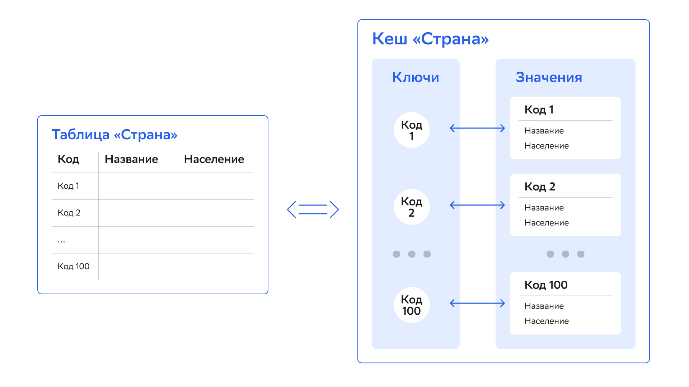

# Введение

Корректно спроектированная модель данных может улучшить производительность приложения, помочь эффективнее использовать ресурсы и достичь бизнес-целей. При проектировании модели важно понимать, как данные распределяются в кластере DataGrid, и знать различные способы доступа к ним.

В этом разделе находится информация о важных компонентах модели распределения данных DataGrid, включая партиционирование данных и Affinity colocation, а также о двух интерфейсах, которые можно использовать для доступа к данным — Key-Value API и SQL.

Чтобы понять, как хранятся и используются данные в DataGrid, важно знать различие между физической организацией данных в кластере и их логическим представлением — тем, как пользователи будут видеть данные в приложениях.

На физическом уровне каждая запись данных — и строка таблицы, и запись в кеше — хранится в виде [бинарного объекта (Binary Object)](#формат-хранения-записей-данных). Весь набор данных разделен на небольшие части, которые называются партициями. Партиции обычно равномерно распределены между всеми серверными узлами. Способ, с помощью которого данные распределяются по партициям, а партиции — по узлам, контролирует affinity-функция (подробнее о ней написано в разделе [Affinity Collocation](affinity_collocation.md)).

На логическом уровне данные должны быть представлены так, чтобы с ними было легко работать и чтобы конечным пользователям было удобно использовать их в своих приложениях. В DataGrid есть два варианта логического представления: в виде кешей с парами типа «ключ-значение» (Key-Value API) и SQL-таблиц. Эти варианты равноценны и могут представлять одинаковый набор данных.

:::{admonition} Важно
:class: attention

В DataGrid концепции SQL-таблицы и кеша «ключ-значение» — два равноценных представления одной и той же (внутренней) структуры данных. Получить доступ к  данным можно с помощью Key-Value API, SQL-запросов или обоих способов.
:::

## Сравнение Key-Value API и SQL API

Кеш — коллекция пар ключ-значение, которую можно получить через Key-Value API. SQL-таблица в DataGrid совпадает с концепцией таблиц в традиционных СУБД с некоторыми ограничениями. Например, в каждой SQL-таблице должен быть первичный ключ.

Таблицу с первичным ключом можно представить в виде кеша с парами «ключ-значение», в котором столбец первичного ключа служит ключом, а остальные столбцы таблицы представляют поля объекта (значение):

Разница между этими представлениями заключается в способе доступа к данным. Кеш «ключ-значение» позволяет работать с объектами с использованием всех языков программирования, которые поддерживает продукт. SQL-таблицы поддерживают традиционный синтаксис SQL и могут пригодиться, например при миграции из существующей базы данных. Можно объединить подходы и применять один или оба в зависимости от сценария использования.

Key-Value API поддерживает функции для работы с данными:

- поддержка спецификации JCache (JSR 107);
- ACID-транзакции;
- Continuous Query API;
- Index Query (запросы по индексированным полям объектов);
- Scan Query;
- Entry Processor API;
- подписка на события (Events API).

:::{admonition} Важно
:class: attention

Даже после запуска кластера можно динамически создавать кеши «ключ-значение» и SQL-таблицы. Кроме Key-Value API, работать с данными можно через API Service Grid и Compute Grid. Подробнее о динамичческом создании кешей написано в подразделе [«Основные операции с кешем»](basic_cache_operations.md) раздела «Использование Key-Value API».
:::

## Формат хранения записей данных

DataGrid хранит записи данных в специальном формате — в виде бинарных объектов (binary object). У этого формата сериализации есть ряд преимуществ:

- Можно читать произвольное поле из сериализованного объекта без его полной десериализации. Это снимает требование развертывать классы ключа и значения на серверном узле в classpath.
- Можно добавлять и удалять поля из объектов одного типа. На серверных узлах нет определений классов модели данных — это позволяет динамически изменять структуру объекта и сосуществовать нескольким клиентам с разными версиями определений классов.
- Позволяет создавать новые объекты на основе названия типа даже без определений классов. Это обеспечивает динамическое создание типа.
- Обеспечивает возможность беспрепятственного взаимодействия между платформами Java, .NET и C++.

Бинарные объекты можно использовать, если в конфигурации установлен `marshaller` по умолчанию и не установлены другие.

Подробнее о том, как настроить и использовать бинарные объекты, написано в подразделе [«Работа с бинарными объектами»](working_with_binary_objects.md) раздела «Использование Key-Value API».

## Партиционирование данных

Партиционирование данных — метод разделения большого набора данных на мелкие части и равномерного распределения этих частей между серверными узлами. Подробнее о партицировании написано в разделе [«Партиционирование данных»](data_partitioning.md).