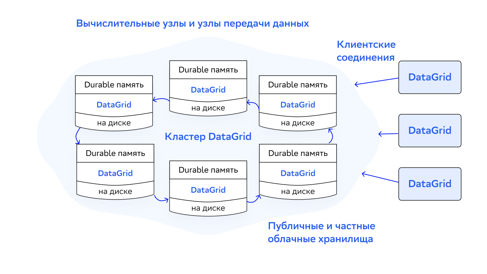

# Введение

В этом разделе описана информация о способах, с помощью которых узлы могут обнаруживать друг друга для формирования кластера.

При запуске узлу присваивается роль: серверный или клиентский. На серверные узлы приходится основная нагрузка кластера — кеширование данных, выполнение вычислительных задач и так далее. Клиентские узлы присоединяются к топологии как серверные, но не хранят данные. Они используются для выполнения запросов пользователя и передачи данных в кластер.

Для формирования кластера у каждого узла должна быть возможность подключиться ко всем другим узлам. Для этого нужно правильно настроить механизм обнаружения узлов Discovery (подробнее о нем написано в разделе ниже).

Клиентские узлы обычно избыточны: для пользовательских запросов к DataGrid достаточно использовать тонкие клиенты — подробнее о них написано в разделе [«Обзор тонких клиентов»](thin_clients_overview.md). Они доступны для языков Java, .NET, C++, Node.JS, Python и PHP. 

В отличие от обычных клиентских узлов, тонкие клиенты не входят в топологию кластера. Вместо этого они устанавливают сетевое соединение с одним из узлов и выполняют все операции с помощью бинарного протокола — подробнее о нем написано в разделе [«Обзор бинарного протокола клиента»](binary_client_protocol_overview.md).

##  Механизмы обнаружения (Discovery)

Узлы DataGrid могут автоматически находить друг друга и формировать кластер. Это позволяет при необходимости масштабировать его без перезапуска.

В DataGrid есть две реализации механизма обнаружения:

- TCP/IP Discovery (подробнее о нем написано в разделе [TCP/IP Discovery](tcp_ip_discovery.md)) — реализация механизма `DiscoverySpi` по умолчанию, которая организует узлы кластера в топологию «кольцо».
- ZooKeeper Discovery (подробнее о нем написано в разделе [ZooKeeper Discovery](zookeeper_discovery.md)) — альтернативная реализация механизма `DiscoverySpi`, которая организует узлы в топологию «звезда», позволяет масштабировать кластеры DataGrid и сохранять производительность и линейную масштабируемость.