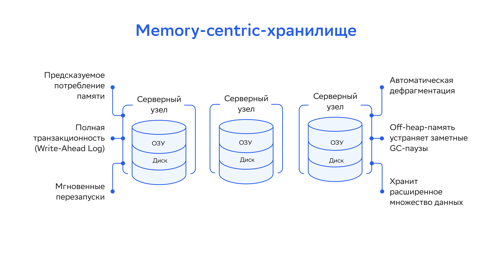
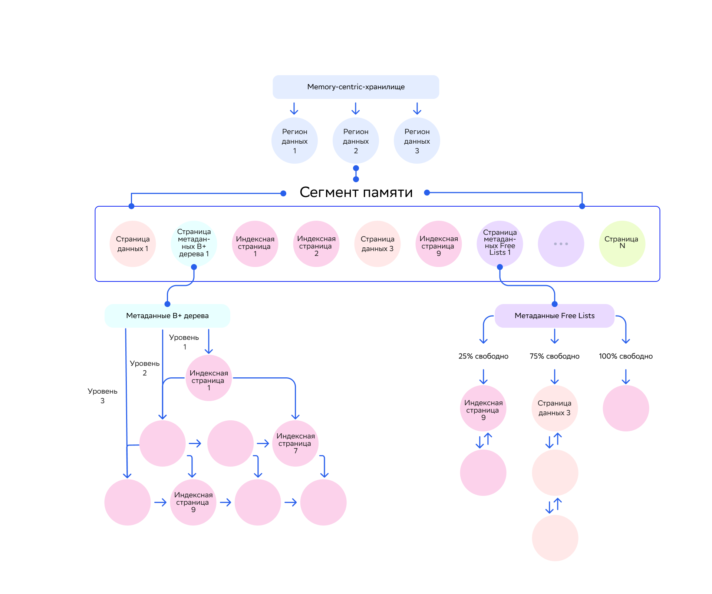
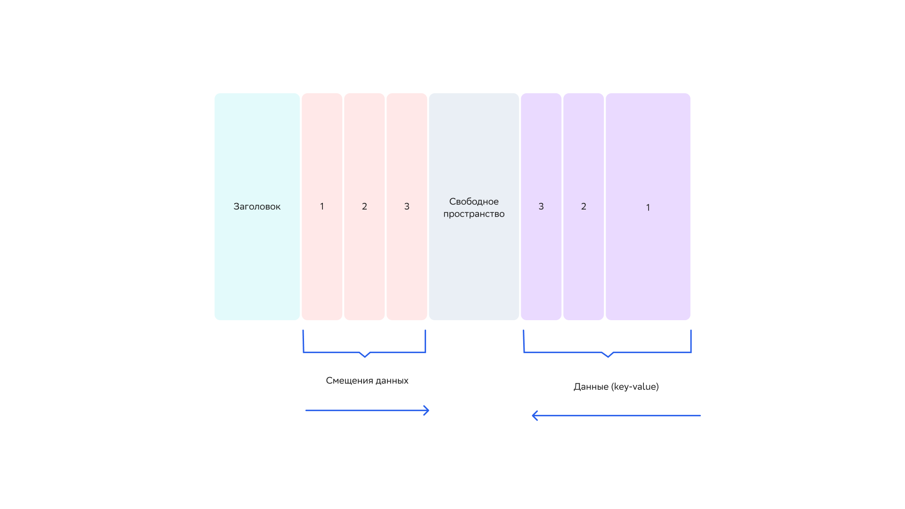
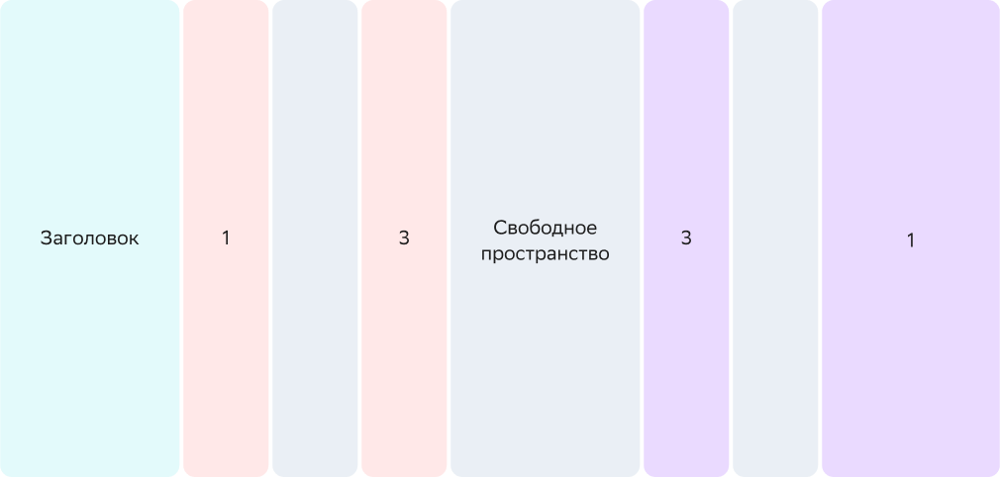

# Архитектура памяти

Архитектура памяти DataGrid позволяет хранить и обрабатывать данные и индексы в памяти и на диске. Это обеспечивает высокую in-memory-производительность и надежность хранения на диске.

Многоуровневое хранилище работает аналогично виртуальной памяти операционных систем, например Linux. Разница в том, что многоуровневое хранилище всегда использует диск как надмножество данных (в персистентном режиме), которое способно выдерживать сбои и перезапуски. Традиционная виртуальная память использует диск только как дополнение подкачки (swapping), которое стирается после остановки процесса.

## Архитектура памяти

В многоуровневой архитектуре DataGrid страничная структура, у страниц фиксированный размер. Они хранятся в управляемых областях данных оперативной памяти вне Java Heap и организованы в виде определенной иерархии на диске.

В DataGrid у данных на диске и в памяти одинаковые бинарные представления. Это устраняет необходимость затратной сериализации при перемещении данных между памятью и диском.

Архитектура многоуровневого хранилища:

### Cегменты памяти

Размер региона данных расширяется от начального до максимального с помощью выделения непрерывных сегментов памяти.

Сегмент памяти — непрерывный массив байтов или физическая память, которую выделяет операционная система. Массив байтов делится на страницы фиксированного размера. В сегменте может находиться несколько типов страниц, как показано на схеме:

### Страницы данных (data pages)

На странице данных хранятся записи, которые помещаются в кеш с помощью программного кода.

Обычно на одной странице данных хранится несколько записей «ключ-значение», чтобы максимально эффективно использовать память и избежать фрагментации данных. При добавлении в кеш новой записи DataGrid ищет страницу, которая может вместить запись «ключ-значение» целиком.

Если общий размер записи превышает размер страницы, который настроен через `DataStorageConfiguration.setPageSize(..)`, запись займет более одной страницы данных.

:::{admonition} Важно
:class: attention

Если есть много записей больше настроенного размера страницы, рекомендуется увеличить ее размер.
:::

Если во время обновления размер записи увеличивается и выходит за пределы свободного места на странице данных, DataGrid:

1. Ищет новую страницу данных, в которой достаточно места для размещения обновленной записи.
2. Перемещает туда обновленную запись.

### Дефрагментация памяти

В DataGrid настроена автоматическая дефрагментация памяти. Дополнительных действий для ее подключения не требуется.

Многократное обновление отдельной страницы с помощью разных CRUD-операций может привести к фрагментации страницы и общей фрагментации памяти. Когда страница становится слишком фрагментированной, DataGrid использует сжатие (page compaction) — это также позволяет снизить общую фрагментацию памяти.

Пример сжатой страницы данных:

Страница содержит заголовок, который хранит информацию для внутреннего использования. Все записи «ключ-значение» всегда добавляются справа налево и могут быть разного размера. На схеме выше представлены три записи, которые хранятся на странице.

Смещения (offsets) или ссылки на расположения записей внутри страницы хранятся слева направо, у них всегда фиксированный размер. Offsets используются в качестве указателей для поиска записей на странице.

Пространство посередине — свободное место, которое заполняется при поступлении новых данных в кластер.

Если со временем вторая запись удалится, это приведет к прерывистому свободному пространству на странице данных. Пример фрагментированной страницы данных:

Когда на странице данных потребуется все свободное пространство или будет достигнут порог фрагментации, процесс сжатия страницы проведет дефрагментацию. Страница данных вернется в состояние, в котором свободное пространство не прерывается (показано на схеме выше). Это автоматический процесс, который не требует дополнительных действий.

## Персистентность регионов данных

В DataGrid есть ряд функций, которые позволяют сохранять данные на диске с гарантиями согласованности. С помощью этих функций можно:

- перезапустить кластер без потери данных;
- получить устойчивость к сбоям;
- получить хранилище для данных, когда объема оперативной памяти недостаточно.

При включении Native Persistence DataGrid всегда сохраняет данные на диске и использует всю доступную в регионе данных оперативную память. Подробнее об этом написано в подразделе [«Персистентность DataGrid»](datagrid_persistence.md) раздела «Настройка Persistence».