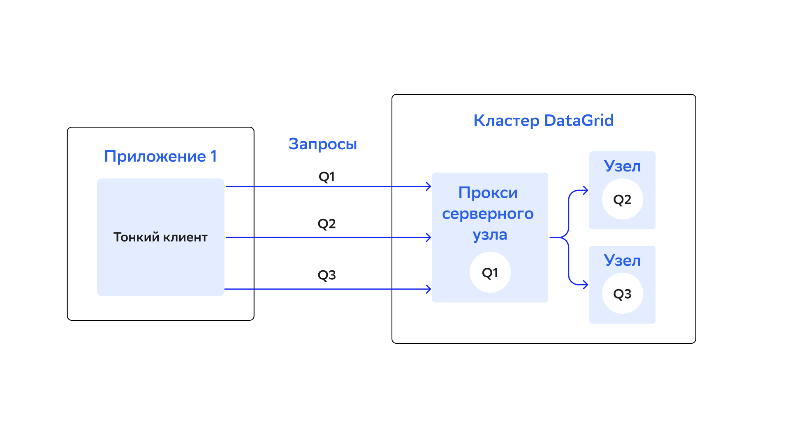
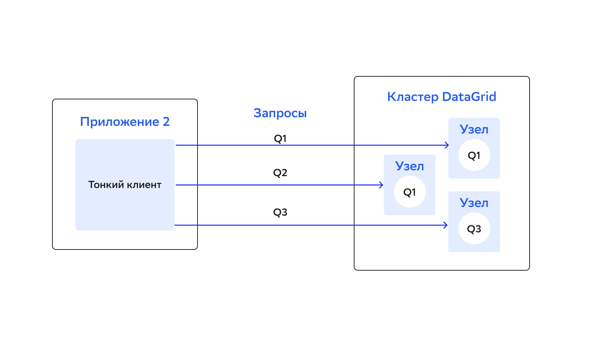

# Обзор тонких клиентов

Тонкий клиент — легковесный клиент DataGrid, который подключается к кластеру по стандартному сокетному соединению. Он не является частью топологии кластера, не хранит данные и не используется в качестве пункта назначения для вычислений при использовании DataGrid в качестве Compute Grid. Тонкий клиент устанавливает сокетное соединение с серверным узлом DataGrid и выполняет все операции через него. Тонкие клиенты основаны на протоколе Binary Client, который позволяет поддерживать подключение DataGrid с любого языка программирования. Подробнее о протоколе написано в разделе [«Обзор бинарного протокола клиента»](binary_client_protocol_overview.md).

DataGrid поставляется со следующими тонкими клиентами:

- [Тонкий клиент Java](java_thin_client.md)
- [Тонкий клиент .NET/C#](net_thin_client.md)
- [Тонкий клиент C++](c_thin_client.md)
- [Тонкий клиент Python](python_thin_client.md)
- [Тонкий клиент PHP](php_thin_client.md)
- [Тонкий клиент Node.js](nodejs_thin_client.md)

## Функции тонких клиентов

В таблице ниже описаны функции, которые поддерживает каждый клиент:

| Функция тонкого клиента | Java | .NET | C++ | Python | Node.js | PHP |
|---|---|---|---|---|---|---|
| Scan query | Да | Да | Нет | Да | Да | Да |
| Scan query с фильтром | Да | Да | Нет | Нет | Нет | Нет |
| `SqlFieldsQuery` | Да | Да | Нет | Да | Да | Да |
| `BinaryObject` API | Да | Да | Нет | Нет | Да | Да |
| Отказоустойчивость | Да | Да | Да | Да | Да | Да |
| Асинхронные операции | Да | Да | Нет | Да | Да | Да |
| TLS версии 1.2 и выше | Да | Да | Да | Да | Да | Да |
| Аутентификация | Да | Да | Да | Да | Да | Да |
| Partition Awareness | Да | Да | Да | Да | Да | Нет |
| Транзакции | Да | Да | Да | Нет | Нет | Нет |
| API кластера | Да | Да | Нет | Нет | Нет | Нет |
| Вычислительный API | Да | Да | Да | Нет | Нет | Нет |
| Сontinuous query | Да | Да | Да | Нет | Нет | Нет |
| Вызов сервиса | Да | Да | Нет | Нет | Нет | Нет |
| Server Discovery | Да | Да | Нет | Нет | Нет | Нет |
| Server Discovery в Kubernetes | Да | Нет | Нет | Нет | Нет | Нет |
| `DataStreamer` | Нет | Да | Нет | Нет | Нет | Нет |
| Политика повторных попыток | Да | Да | Нет | Нет | Нет | Нет |

### Отказоустойчивость клиентского соединения

Все тонкие клиенты поддерживают механизм отказоустойчивого соединения: клиент автоматически переключается на доступный узел в случае отключения текущего или сбоя соединения. Чтобы механизм работал, в конфигурации клиента добавьте список адресов узлов, которые будут использоваться при возможных отказах. Подробности настройки описаны в разделе каждого тонкого клиента.

### Partition Awareness

Данные в кластере равномерно распределяются между узлами по соображениям масштабируемости и производительности. В каждом узле кластера сохранены подмножество данных и карта распределения партиций. Она используется для определения узла, в котором хранятся основная (primary) и резервная (backup) копии нужных записей. Подробнее о партицировании написано в подразделе [«Партиционирование данных»](data_partitioning.md) раздела «Моделирование данных».

Функция Partition Awareness позволяет тонкому клиенту отправлять запросы напрямую узлу, который содержит нужные данные. Без этой функции приложение, которое подключено к кластеру с помощью тонкого клиента, выполняет все запросы и операции на одном серверном узле (он служит прокси-сервером для входящих запросов). Затем эти операции перенаправляются на узел, где хранятся нужные данные. Это приводит к возникновению узкого места, которое может помешать линейному масштабированию приложения.

Запросы должны проходить через прокси-сервер, откуда они перенаправляются на корректный узел:



С функцией Partition Awareness тонкий клиент может напрямую отправлять запросы основным узлам, где хранятся нужные данные. Функция устраняет узкое место и позволяет приложению проще масштабироваться:



Функция Partition Awareness доступна для тонких клиентов:
- [Java](java_thin_client.md)
- [.NET](net_thin_client.md)
- [C++](c_thin_client.md)
- [Python](python_thin_client.md)
- [Node.js](nodejs_thin_client.md)

### Аутентификация

Все тонкие клиенты поддерживают аутентификацию на стороне кластера. Она настраивается в конфигурации кластера, а клиент предоставляет учетные данные пользователя. Подробности настройки описаны в разделе каждого тонкого клиента.

## Конфигурация кластера

Параметры подключения тонкого клиента настраиваются в конфигурации клиентского коннектора. По умолчанию DataGrid принимает клиентские соединения через порт `10800`. Можно изменить порт, размер буфера соединения и тайм-аут, включить TLS версии 1.2 и выше и так далее.

### Конфигурация коннектора тонкого клиента

Ниже описан пример настройки параметров подключения тонкого клиента:

::::{md-tab-set}
:::{md-tab-item} XML
```xml
<bean class="org.apache.ignite.configuration.IgniteConfiguration" id="ignite.cfg">
    <property name="clientConnectorConfiguration">
        <bean class="org.apache.ignite.configuration.ClientConnectorConfiguration">
            <property name="port" value="10000"/>
        </bean>
    </property>
</bean>
```
:::

:::{md-tab-item} Java
```java
ClientConnectorConfiguration clientConnectorCfg = new ClientConnectorConfiguration();
// Установите диапазон портов от 10000 до 10005.
clientConnectorCfg.setPort(10000);
clientConnectorCfg.setPortRange(5);

IgniteConfiguration cfg = new IgniteConfiguration().setClientConnectorConfiguration(clientConnectorCfg);

// Запустите узел.
Ignite ignite = Ignition.start(cfg);
```
:::

:::{md-tab-item} C\#/.NET
```c#
var cfg = new IgniteConfiguration
{
    ClientConnectorConfiguration = new ClientConnectorConfiguration
    {
        // Установите диапазон портов от 10000 до 10005.
        Port = 10000,
        PortRange = 5
    }
};

var ignite = Ignition.Start(cfg);
```
:::
::::

В таблице описаны параметры, которые можно изменить при настройке:

| Параметр | Описание | Значение по умолчанию |
|---|---|---|
| `thinClientEnabled` | Включает или выключает возможность соединения с тонким клиентом | `true` |
| `port` | Порт для подключения тонкого клиента | `10800` |
| `portRange` | Задает диапазон портов для подключения тонкого клиента. Например, если задано значение `10`, тонкие клиенты могут подключиться к любому порту в диапазоне от `10800` до `18010`. Узел пытается связаться с каждым портом из диапазона (начиная со значения параметра `port`), пока не найдет доступный. Если все порты недоступны, узел не запустится | `100` |
| `sslEnabled` | Если задано значение `true`, для подключений тонких клиентов будет работать протокол SSL | `false` |

Полный список параметров находится в [официальной документации Apache Ignite](https://ignite.apache.org/releases/2.16.0/javadoc/org/apache/ignite/configuration/ClientConnectorConfiguration.html).

## Переподключение тонкого клиента к кластеру и механизм троттлинга

### Политики переподключения

Политика переподключения — алгоритм поведения тонкого клиента при потере соединения с кластером DataGrid. Переподключение происходит при потере соединения между клиентом и кластером, инициирует его тонкий клиент. Возможные результаты переподключения:

- Клиент успешно переподключился к кластеру, продолжил работу и выполнил поставленные задачи.
- Клиент не смог переподключиться к кластеру и выполнить свои задачи. В этом случае необходимо перезапустить клиент вручную.

:::{list-table} Параметры политик переподключения в конфигурации тонкого клиента
:widths: 15 30 15
:header-rows: 1

+   * Параметр
    * Описание
    * Значение по умолчанию

+   * `retryPolicy`
    * Устанавливает политику переподключения: 
      - `ClientRetryReadPolicy` — для операций чтения переподключения разрешены, а для операций записи — нет;
      - `ClientRetryAllPolicy` — позволяет совершать переподключения для всех видов операций, выбрана по умолчанию;
      - `ClientRetryNonePolicy` — переподключения запрещены для всех операций.
  
      Таким образом, параметр `retryPolicy` определяет, возможно ли переподключение клиента к кластеру в целом и для конкретных операций. Если у параметра установлено значение `NULL`, попытки переподключения будут запрещены для любых операций данного клиента (подробнее написано в примере ниже).

      Значения для параметра `retryPolicy` устанавливаются с помощью метода `setRetryPolicy`, который вызывается на объекте конфигурации клиента:

      :::{code-block} java
      :caption: Java
      ClientConfiguration cfg = new ClientConfiguration(); // Создать объект конфигурации тонкого клиента (политика переподключения выбрана по умолчанию — `ClientRetryAllPolicy`).

      cfg.setRetryPolicy(null); // Запретить переподключения (первый способ).
      cfg.setRetryPolicy(new ClientRetryNonePolicy()); // Запретить переподключения (второй способ).
      cfg.setRetryPolicy(new ClientRetryReadPolicy()); // Разрешить переподключения только для операций чтения.
      cfg.setRetryPolicy(new ClientRetryAllPolicy()); // Разрешить переподключения для всех операций.
      :::
    * `ClientRetryAllPolicy`

+   * `retryLimit`
    * Устанавливает максимальное количество переподключений в рамках выбранной политики.
    
      Например, если разрешены переподключения для операций чтения, количество таких переподключений будет ограничено данным параметром. В отличие от троттлинга (подробнее о нем написано в разделе ниже), количество попыток не восстанавливается после истечения тайм-аута. Например, при `retryLimit=1` даже после истечения тайм-аута троттлинга (по умолчанию 30 секунд) клиент не сможет переподключиться к кластеру.
    
      Если значение параметра не задано, количество попыток переподключения будет неограниченным (только в рамках настройки троттлинга)
    * `0` (количество попыток переподключения не ограничено)

:::

### Троттлинг

 Троттлинг — механизм ограничения количества попыток совершить какую-либо операцию. Цель троттлинга тонких клиентов — ограничить попытки переподключения клиента к кластеру, чтобы его производительность не упала от большого количества запросов. Троттлинг в данном случае — дополнительная настройка клиента, которая устанавливает, как ему вести себя в рамках выбранной политики переподключения. 
 
 Если выбрана политика, при которой переподключения не предусмотрены, настройки троттлинга не имеют значения (так как они не будут работать). Если политика предусматривает переподключения, с помощью параметров троттлинга можно конкретизировать, как именно будут происходить переподключения на определенном отрезке времени.

 У параметров троттлинга меньший приоритет относительно настроек политики переподключения. Параметр `reconnectThrottlingRetries` определяет максимальное количество попыток переподключения в течение времени, которое задано в параметре `reconnectThrottlingPeriod` (только в рамках выбранной политики). Если количество попыток переподключения в течение тайм-аута исчерпано, можно дождаться его окончания и повторить попытки снова.

:::{admonition} Пример
:class: hint

В политике установлен лимит переподключений 15 попыток (параметр `retryLimit=15`). В настройках троттлинга указано, что можно сделать не более 5 попыток в течение 10 секунд. Это значит, что клиент попытается выполнить 15 попыток переподключения в течение 20 секунд (по 5 попыток с интервалом 10 секунд). 

Если установить параметры троттлинга `reconnectThrottlingRetries` 3 попытки и `reconnectThrottlingPeriod` 30 секунд (не более трех попыток переподключения в течение 30 секунд), на те же 15 попыток клиент потратит 120 секунд. При одинаковых настройках политики переподключения поведение клиента будет отличаться — но строго в рамках этой политики.
:::

Значения параметров троттлнинга по умолчанию:

- `reconnectThrottlingPeriod` — 30 секунд;
- `reconnectThrottlingRetries` — 3 попытки.

:::{admonition} Важно
:class: attention

Количество попыток переподключения в рамках настроек троттлинга (`reconnectThrottlingRetries`) не может превышать общее количество попыток переподключения (`retryLimit`). Например, если заданы параметры `retryLimit=2` и `reconnectThrottlingRetries=3`, попыток переподключения будет две.
:::

### Пример конфигурации тонкого клиента

В примере ниже тонкий клиент настроен так, что попытки переподключения к кластеру будут производиться только для операций чтения. Общее количество таких попыток — 20. По параметрам троттлинга в течение 10 секунд клиент сможет попытаться переподключиться к кластеру не более 5 раз.

:::{code-block} java
:caption: Java
ClientConfiguration clientConfiguration = new ClientConfiguration();

clientConfiguration
    .setRetryPolicy(new ClientRetryReadPolicy())
    .setRetryLimit(20)
    .setReconnectThrottlingRetries(5)
    .setReconnectThrottlingPeriod(10_000);
:::