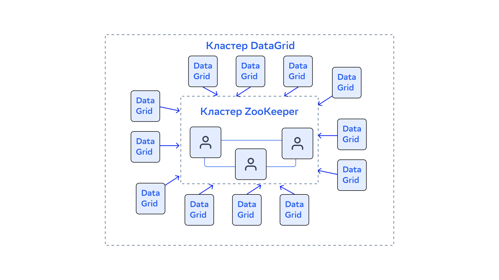
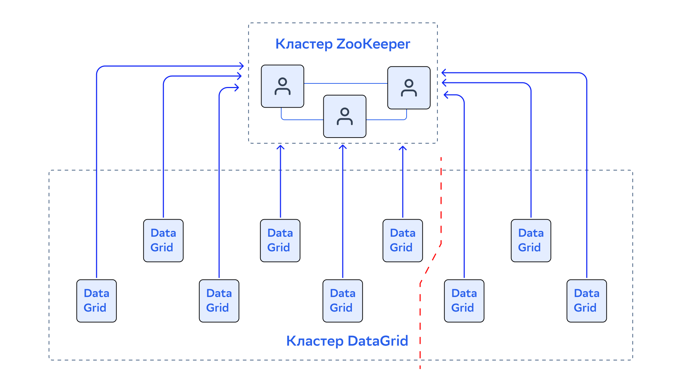
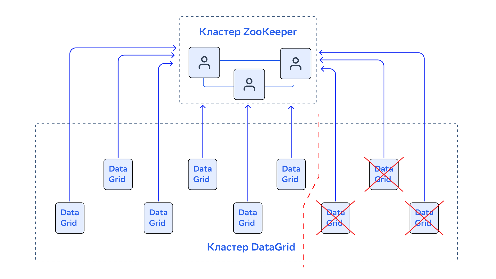
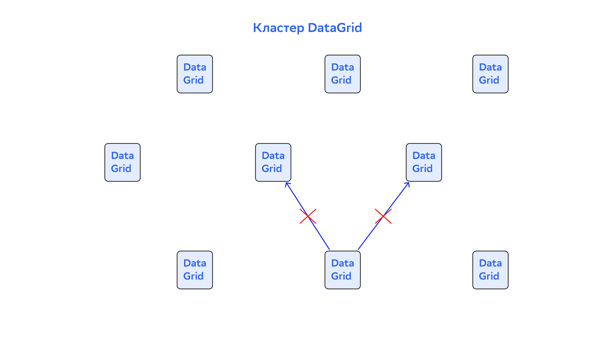
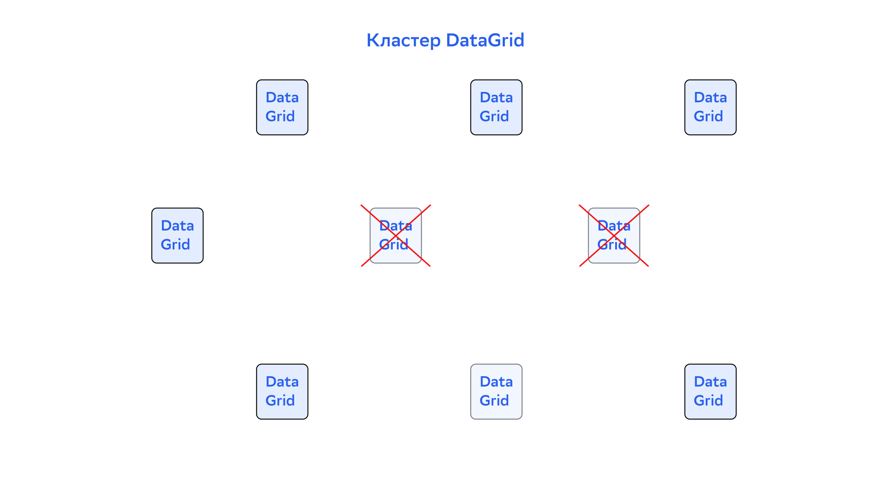
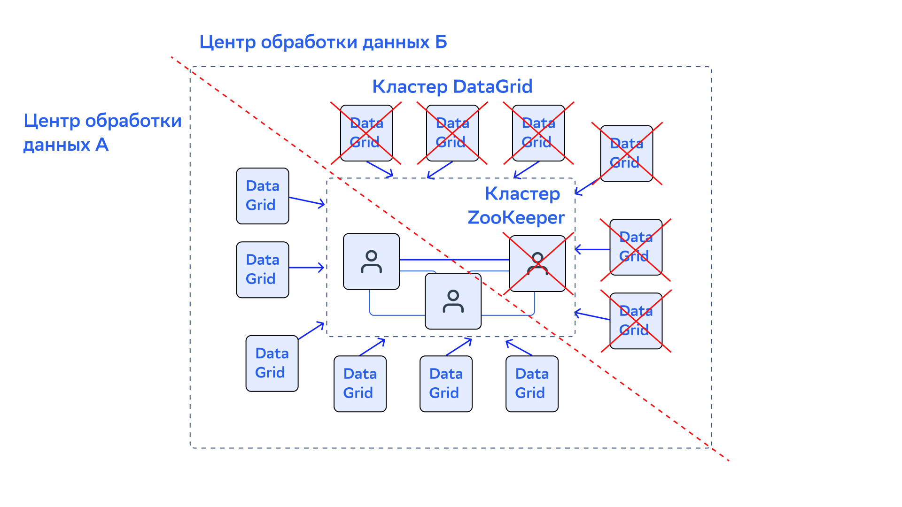

# ZooKeeper Discovery

В кластере DataGrid серверные узлы по умолчанию находят друг друга через протокол TCP/IP Discovery и образуют топологию «кольцо». У нее есть преимущества и недостатки. Например, если в топологии кластера сотни узлов, передача системного сообщения «по кольцу» через все узлы может занять несколько секунд. В результате некоторые базовые операции — добавление нового узла в кластер или обнаружение выпавшего узла — могут занимать много времени. Это негативно влияет на общую производительность и время реагирования кластера.

Механизм обнаружения ZooKeeper Discovery создан для массовых развертываний, которые требуют легкого масштабирования кластера и линейной производительности. Но использовать одновременно две распределенные системы — DataGrid и ZooKeeper — может быть сложной задачей. Для большинства случаев предпочтительнее использовать протокол [TCP/IP Discovery](tcp_ip_discovery.md).

ZooKeeper Discovery использует ZooKeeper в качестве единой точки синхронизации и для организации кластера в топологию «звезда». В ней кластер ZooKeeper находится в центре, и через него узлы DataGrid обмениваются событиями протокола Discovery.



ZooKeeper Discovery — альтернативная реализация Discovery SPI, которая не влияет на Communication SPI. Когда узлы находят друг друга через ZooKeeper Discovery, они используют Communication SPI для взаимодействия.

## Конфигурация

Чтобы активировать ZooKeeper Discovery, настройте `ZookeeperDiscoverySpi`:

::::{md-tab-set}
:::{md-tab-item} XML
```xml
<bean class="org.apache.ignite.configuration.IgniteConfiguration">

  <property name="discoverySpi">
    <bean class="org.apache.ignite.spi.discovery.zk.ZookeeperDiscoverySpi">
      <property name="zkConnectionString" value="xxx.x.x.x:34076,xxx.x.x.x:43310,xxx.x.x.x:36745"/>
      <property name="sessionTimeout" value="30000"/>
      <property name="zkRootPath" value="/apacheIgnite"/>
      <property name="joinTimeout" value="10000"/>
    </bean>
  </property>
</bean>
```
:::

:::{md-tab-item} Java
```java
ZookeeperDiscoverySpi zkDiscoverySpi = new ZookeeperDiscoverySpi();

zkDiscoverySpi.setZkConnectionString("xxx.x.x.x:34076,xxx.x.x.x:43310,xxx.x.x.x:36745");
zkDiscoverySpi.setSessionTimeout(30_000);

zkDiscoverySpi.setZkRootPath("/ignite");
zkDiscoverySpi.setJoinTimeout(10_000);

IgniteConfiguration cfg = new IgniteConfiguration();

// Переопределите Discovery SPI по умолчанию.
cfg.setDiscoverySpi(zkDiscoverySpi);

// Запустите узел.
Ignite ignite = Ignition.start(cfg);
```
:::
::::

Необходимые параметры:

- `zkConnectionString` — содержит список адресов серверов ZooKeeper.
- `sessionTimeput` — указывает время, спустя которое узел DataGrid будет считаться отключенным, если он не реагирует на события, передаваемые через Discovery SPI.

## Обработка ошибок и проблемы Split Brain

В случае сетевой сегментации (Split Brain) некоторые узлы не могут взаимодействовать друг с другом, так как они расположены в отдельных сегментах сети. Это может привести к сбоям в обработке запросов пользователя и несогласованным изменениям данных.

ZooKeeper Discovery решает вопросы со Split Brain и сбоями в коммуникациях между узлами следующим образом:

:::{admonition} Важно
:class: attention

Предполагается, что кластер ZooKeeper всегда виден всем узлам кластера. На самом деле, если узел отключается от кластера ZooKeeper, он завершает свою работу. Другие узлы считают его выпавшим или отключенным.
:::

1. Когда узел обнаруживает, что больше не может подключиться к другим узлам в кластере, он инициирует процесс устранения сбоев в коммуникации. Для этого он отправляет специальные запросы в кластер ZooKeeper.
2. Все узлы пытаются подключиться друг к другу и отправляют результаты попыток узлу, который координирует процесс (узел-координатор).
3. На основе полученной информации узел-координатор создает схему подключения, которая отражает сетевую ситуацию в кластере.
4. Дальнейшие действия зависят от типа сегментации сети и описываются в разделах ниже.

### Кластер разделен на несколько изолированных

Если кластер разделен на несколько независимых частей, каждая часть (подкластер) может считать себя главной и продолжать обработку запросов пользователей. Это приводит к несогласованности данных. Чтобы избежать проблемы, один подкластер с наибольшим количеством узлов оставляют активным, а узлы из других подкластеров выключают.

На схемах ниже показана ситуация, в которой кластер разделился на два подкластера. Узлы из меньшего подкластера (сегмент справа) выключаются.





Если в кластере есть несколько крупных сегментов, остается активным один подкластер с наибольшим количеством клиентских узлов. Остальные подкластеры выключаются.

### Отсутствуют несколько ссылок между узлами

Возможна проблема, при которой некоторые узлы не могут подключиться к нескольким другим узлам кластера. Это значит, что узлы не отключены от кластера полностью, но не могут обмениваться данными с некоторыми другими узлами — и поэтому не могут быть частью кластера. На изображении ниже один узел не может подключиться к двум другим.



В этом случае нужно найти самый большой подкластер, в котором каждый узел может подключиться ко всем другим узлам — в большинстве случаев это сложная задача. Для расчета наилучшего приближенного решения узел-координатор использует эвристический алгоритм. Узлы, которые не входят в найденное решение, исключаются из кластера.



### Сегментация кластера ZooKeeper

В крупномасштабных развертываниях, где кластер с ZooKeeper может охватывать несколько центров обработки данных и может быть разнесен географически, кластер может разделиться на несколько частей из-за cегментации сети. Если это происходит, ZooKeeper проверяет, есть ли сегмент, который содержит больше половины всех узлов ZooKeeper (такое количество узлов нужно для продолжения работы). Если такой сегмент обнаружен, он берет на себя управление кластером DataGrid, а остальные сегменты отключаются. Если такого сегмента нет, ZooKeeper отключает все свои узлы

Если кластер ZooKeeper разделился, кластер DataGrid может также разделиться или не разделяться по Split Brain. В любом случае, когда узлы ZooKeeper выключаются, соответствующие узлы DataGrid пытаются подключиться к доступным узлам ZooKeeper. Если подключиться не получилось, узлы DataGrid выключаются.

На схеме ниже показан пример разделения сети, которое разбивает кластеры DataGrid и ZooKeeper на два сегмента. Это может произойти, если кластеры развернуты в двух центрах обработки данных. В данном случае узел ZooKeeper, который расположен в центре обработки данных Б, завершает работу. Узлы DataGrid, которые расположены в том же центре, не могут подключиться к оставшимся узлам ZooKeeper и также завершают работу.



## Расширенные события Discovery

Изменение формы топологии с «кольца» на «звезду» влияет на то, как компонент Discovery SPI обрабатывает расширенные события обнаружения. Топология «кольца» линейна, поэтому узлы обрабатывают каждое discovery-сообщение последовательно.

С помощью ZooKeeper Discovery узел-координатор отправляет discovery-сообщения на все узлы одновременно, то есть сообщения обрабатываются параллельно. В результате ZooKeeper Discovery запрещает вносить изменения в расширенные события обнаружения. Например, узлы не могут добавить дополнительную информацию в discovery-сообщения.

## Рекомендации по конфигурации DataGrid и ZooKeeper

При использовании ZooKeeper Discovery параметры конфигурации кластеров ZooKeeper и DataGrid должны совпадать.

:::{admonition} Пример конфигурации кластера
:class: hint ZooKeeper

```bash
# Количество миллисекунд каждого тика.
tickTime = 2000  
# Количество миллисекунд, которое может пройти между отправкой запроса и получением подтверждения.
syncLimit = 5
```
:::

Если кластер настроен как в примере выше, узел ZooKeeper обнаружит свое отделение от остальной части кластера после истечения `tickTime * syncLimit`. Пока это событие не будет обнаружено на уровне ZooKeeper, все узлы DataGrid, которые подключены к отделившемуся серверу ZooKeeper, не будут пытаться восстановить подключение к другим серверам.

На стороне DataGrid есть параметр `sessionTimeout`. Он определяет, когда ZooKeeper закрывает сессию узла DataGrid, если он отключается от кластера ZooKeeper. Если `sessionTimeout` меньше `tickTime * syncLimit`, узел DataGrid получит информацию от отделившегося сервера ZooKeeper слишком поздно. Сессия узла завершится до того, как он попытается присоединиться к другим серверам ZooKeeper.

Чтобы этого не произошло, `sessionTimeout` должен быть больше, чем `tickTime * syncLimit`.