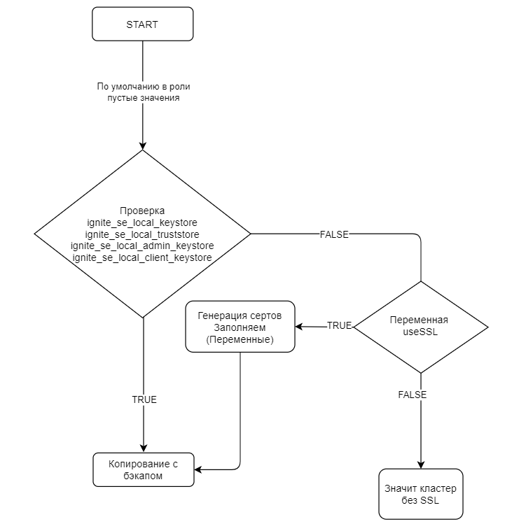

# Установка DataGrid с помощью Ansible

## Подготовка окружения

### Общие требования

При подготовке окружения убедитесь в выполнении требований:

-   Предоставлен доступ по SSH-соединению между узлами управления Ansible и хостами DataGrid. Инструкции и команды для проверки SSH-соединений для всех задействованных хостов смотрите в разделе [«Предварительная подготовка на управляющем хосте»](#предварительная-подготовка-на-управляющем-хосте).

-   Имеются привилегированные права для разделения задач. Ansible Role для DataGrid поддерживает разделение задач на основе тегов. Задачи разделяются на требующие и не требующие привилегированных прав `root`. Обратите внимание: на некоторых шагах установки потребуется `root`-доступ; подробнее смотрите в разделе [«Выполнение задач с привилегированными правами (root-доступом)»](#выполнение-задач-с-привилегированными-правами-root-доступом).

### Настройка виртуального окружения в Python и установка Ansible

Для настройки окружения и установки Ansible Role:

-   Установите пакет Ansible 2.9.10. Рекомендуем установить пакет Ansible вместо Ansible Core (`ansible-core`), который содержит минимальное количество модулей и плагинов. Установка пакета Ansible избавляет от ручной установки дополнительных модулей и плагинов, которые необходимы для DataGrid Ansible Role.

-   Установите виртуальное окружение:

    `python -m venv $HOME/python-venv/ansible`

-   Активируйте виртуальное окружение:

    `source $HOME/python-venv/ansible/bin/activate`

-   Установите `ansible pip install ansible` или `pip install ansible` с версией 2.9.10:

    `pip install ansible == 2.9.10`

## Предварительная подготовка на управляющем хосте

### Подготовка рабочей директории

В примерах ниже подразумевается, что на управляющем хосте, с которого выполняется установка, рабочей директорией для процесса установки является `/tmp/installer/`:

1.  Перенесите дистрибутив `DataGrid-<version>.zip` в `/tmp/installer/` на управляющем хосте.
2.  Создайте директорию и распакуйте дистрибутив:

    ```bash
    mkdir -pv /tmp/installer/distrib
    unzip /tmp/installer/Ignite-SE-<version>.zip -d /tmp/installer/distrib/
    ```

3.  Создайте директорию и распакуйте архив с `ansible`-сценариями:

    ```bash
    mkdir -pv /tmp/installer/roles
    unzip /tmp/installer/distrib/Ignite-SE-<version>/Ignite-SE-ansibleRole-<version>.zip -d /tmp/installer/roles/datagrid
    ```

### Подготовка файла Ansible-Inventory для установки DataGrid

1.  Перед запуском Ansible создайте файл инвентаризации, где укажите хосты, на которых будет установлен DataGrid.
2.  Задайте переменные подключения, чтобы узел управления Ansible мог подключаться к каждому хосту DataGrid, и переменную `datagrid_java_home`.

3.  Создайте файл с описанием конфигурации и переменными `inventory.yml`:

    ```yaml
    cat <<'EOF' > /tmp/installer/inventory.yml
    cluster_datagrid:
      vars:
        ansible_connection: ssh
        ansible_user: sshlogin
        ansible_ssh_pass: sshpsw
        ansible_become_pass: sshpsw
        datagrid_local_distr_path: "Ignite-SE-16.0.0-81-distrib.zip"
        datagrid_java_home: "/usr/lib/jvm/openjdk-11"
      hosts:
        xx.xx.xx.xx:
          ansible_host: "xx.xx.xx.xx" 
        xx.xx.xx.xy:
          ansible_host: "xx.xx.xx.xy"
        xx.xx.xx.xz:
          ansible_host: "xx.xx.xx.xz"
    EOF
    ```

4.  Создайте файл установки `install-datagrid.yml`:

    ```yaml
    cat <<'EOF' > /tmp/installer/datagrid-install.yml
    ---
    - hosts: 'cluster_datagrid'
      tasks:
      - name: "Install DataGrid"
        include_role:
          name: datagrid
        vars:
          datagrid_addresses: "{{ groups[ansible_play_name] }}"
        tags:
        - root
        - datagrid_stop_process
        - datagrid_start_process
        - backup
        - restore
        - clean
        - clean-root
    EOF
    ```

5.  Создайте файл `control-datagrid.yml` для проверки состояния, активации, деактивации DataGrid:

    ```yaml
    cat <<'EOF' > /tmp/installer/datagrid-control.yml
    ---
    - hosts: 'cluster_datagrid'
      tasks:     
      - name: "call control_sh"
        include_role:
          name: "datagrid"
          tasks_from: "control_sh.yml"
    EOF
    ```

### Проверка SSH-соединений

Чтобы убедиться в подключении Ansible через SSH, выполните команду:

`ansible -i /tmp/installer/inventory.yml all -m ping`

В результате выполнения команды происходит проверка доступности интерпретатора Python для использования на всех хостах. В случае успешной проверки команда возвращает `pong` в качестве результата.

Рекомендуется хранить файл инвентаризации в собственном репозитории Git для каждого из ваших развертываний.

## Установка DataGrid с помощью Ansible

### Выполнение задач с привилегированными правами (root-доступом)

При выполнении задач с привилегированными правами создаются группа, пользователь, директории, службы, а также устанавливаются разрешения и добавляются права в `sudoers`.

Для запуска задач с привилегированными правами используйте теги:

-   `root` — тег для задач, связанных с созданием группы, пользователя, директории, службы, для установки разрешений и добавления прав в `sudoers`;
-   `clean-root` — тег для задач, связанных с удалением DataGrid, группы, пользователя, директории, службы.

Для выполнения задач, связанных с созданием группы, пользователя, директории, службы, установкой разрешения и добавкой прав в `sudoers`, перейдите в каталог с ansible-сценарием, запустите ansible-playbook с тегом `root` и дождитесь завершения выполнения:

```bash
cd /tmp/installer/
ansible-playbook -i ./inventory.yml ./datagrid-install.yml --tags=root
```

:::{admonition} Примечание
:class: note

В случае успешного выполнения в выводе команды в разделе `PLAY RECAP` напротив каждого хоста появится строчка `unreachable=0 failed=0`.
:::

### Выполнение задач по установке DataGrid

Для запуска предполагается, что на серверах кластера DataGrid созданы группа, пользователь, директория, а также установлены разрешения на доступ к директории.

В примере ниже подразумевается, что установлены группа и пользователь `ignite`; чтобы изменить на другую группу и на другого пользователя, добавьте соответствующие изменения в файл с описанием конфигурации `inventory.yml`.

```yaml
cluster_datagrid:
  vars:
    # Пользователь, под учетной записью которого идет установка DataGrid.
    datagrid_user: ignite

    # UID пользователя, под учетной записью которого идет установка DataGrid.
    datagrid_user_uid: 15000

    # Группа пользователя.
    datagrid_group: ignite

    # GID группы.
    datagrid_group_gid: 15000

    # Путь для установки DataGrid.
    datagrid_dir: "/opt/ignite"
```

Для установки DataGrid перейдите в каталог с ansible-сценарием, запустите ansible-playbook и дождитесь завершения выполнения:

```bash
cd /tmp/installer/
ansible-playbook -i ./inventory.yml ./datagrid-install.yml 
```

:::{admonition} Примечание
:class: note

В случае успешного выполнения в выводе команды в разделе `PLAY RECAP` напротив каждого хоста появится строчка `unreachable=0 failed=0`.
:::

### Обновление DataGrid

Для обновления DataGrid: 

1.  Перейдите в каталог с ansible-сценарием. 
2.  В файле с описанием конфигурации `inventory.yml` измените переменную `datagrid_local_distr_path` на новый архив с DataGrid. 
3.  Запустите ansible-playbook:

    `ansible-playbook -i ./inventory.yml ./datagrid-install.yml`

4.  Дождитесь завершения обновления.

### Обновление конфигурации DataGrid

Для обновления конфигурации DataGrid:

1.  Перейдите в каталог с ansible-сценарием. 
2.  В файле с описанием конфигурации `inventory.yml` добавьте или измените переменные.
3.  Запустите ansible-playbook:
    `ansible-playbook -i ./inventory.yml ./datagrid-install.yml`

4.  Дождитесь завершения обновления.

### Запуск DataGrid

Для запуска DataGrid:

1.  Перейдите в каталог с ansible-сценарием. 
2.  Запустите ansible-playbook с тегом `datagrid_start_process`:

    `ansible-playbook -i ./inventory.yml ./datagrid-install.yml -t datagrid_start_process`

 3. Дождитесь завершения запуска.

### Остановка DataGrid

Для остановки DataGrid:

1. Перейдите в каталог с ansible-сценарием. 
2. Запустите ansible-playbook с тегом `datagrid_stop_process`:
 
    `ansible-playbook -i ./inventory.yml ./datagrid-install.yml -t datagrid_stop_process`
 
3. Дождитесь завершения остановки.

### Проверка состояния DataGrid

Для проверки состояния DataGrid:

1.  Перейдите в каталог с ansible-сценарием.
2.  Запустите ansible-playbook:

    ```bash
    cd /tmp/installer/
    ansible-playbook -i ./inventory.yml ./datagrid-control.yml -e "datagrid_control_sh_cmd=--baseline"
    ```

3. Дождитесь завершения проверки.

### Активация DataGrid

Для активации DataGrid:

1.  Перейдите в каталог с ansible-сценарием.
2.  Запустите ansible-playbook: 

    ```bash
    cd /tmp/installer/
    ansible-playbook -i ./inventory.yml ./datagrid-control.yml -e "datagrid_control_sh_cmd='--set-state active --yes '"
    ```

3.  Дождитесь завершения активации.

:::{admonition} Примечание
:class: note

В случае успешного выполнения в выводе команды в разделе `PLAY RECAP` напротив каждого хоста появится строчка `unreachable=0 failed=0`.
:::

### Деактивация DataGrid

Для деактивации DataGrid:

1.  Перейдите в каталог с ansible-сценарием. 
2.  Запустите ansible-playbook:

    ```bash
    cd /tmp/installer/
    ansible-playbook -i ./inventory.yml ./datagrid-control.yml -e "datagrid_control_sh_cmd='--set-state inactive --force --yes '"
    ```

3.  Дождитесь завершения деактивации.

:::{admonition} Примечание
:class: note

В случае успешного выполнения в выводе команды в разделе `PLAY RECAP` напротив каждого хоста появится строчка `unreachable=0 failed=0`.
:::

## Настройка сетевого взаимодействия между серверами

Для настройки взаимодействия между серверами одного кластера DataGrid используйте переменные `datagrid_TcpDiscoverySpi_addresses` или `datagrid_addresses`. Задайте переменные в файле с описанием конфигурации `inventory.yml`:

```yaml
# Укажите IP-адреса серверов с портами для `org.apache.ignite.spi.discovery.tcp.ipfinder.vm.TcpDiscoveryVmIpFinder`.
# Пример 1:
datagrid_TcpDiscoverySpi_addresses:
  - "x.x.x.x:47500..47520"
  - "x.x.x.y:47500..47520"
# Пример 2:  
datagrid_addresses:
 - "x.x.x.x"
 - "x.x.x.y"
```

## Настройка защищенного сетевого взаимодействия между серверами

Для настройки защищенного сетевого взаимодействия между серверами одного кластера DataGrid используйте переменная `datagrid_use_ssl`. Задайте переменную в файле с описанием конфигурации `inventory.yml`:

```yaml
datagrid_use_ssl: yes
```

:::{admonition} Внимание
:class: danger

При каждом применении DataGrid Ansible Role генерируются самоподписанные сертификаты, создаются java-контейнеры с сертификатами на управляющем сервере и переносятся на каждый сервер кластера DataGrid.
:::

Для использования собственных сертификатов или выключения генерации самоподписанных сертификатов в файле с описанием конфигурации `inventory.yml`, задайте переменные:

```yaml
datagrid_local_ssl_truststore: "{{ inventory_dir }}/путь/к/контейнеру"
datagrid_ssl_truststore_password: "change-it"

datagrid_local_ssl_keystore: "{{ inventory_dir }}/путь/к/контейнеру"
datagrid_ssl_keystore_password: "change-it" # Пароль от хранилища ключей (keystore).

datagrid_local_client_keystore: "{{ inventory_dir }}/путь/к/контейнеру"
datagrid_ssl_client_keystore_password: "change-it" # Пароль от хранилища ключей (keystore).

datagrid_local_admin_keystore: "{{ inventory_dir }}/путь/к/контейнеру"
datagrid_ssl_admin_keystore_password: "change-it" # Пароль от хранилища ключей (keystore).

datagrid_local_grantadmin_keystore: "{{ inventory_dir }}/путь/к/контейнеру"
datagrid_ssl_grantadmin_keystore_password: "change-it" # Пароль от хранилища ключей (keystore).
```

### Создание новых кешей

В процессе установки внутри конфигурации можно сформировать новые кеши с необходимыми опциями. Для этого в файле с описанием конфигурации `inventory.yml` опишите нужный параметр. Например, для получения различных настроек для кеша my_SQLcache опишите параметр `datagrid_cacheConfiguration` в конфигурационном файле:

```yaml
datagrid_cacheConfiguration:
     my_SQLcache:
       sqlSchema: "public"
       cacheMode: "PARTITIONED"
       atomicityMode: "TRANSACTIONAL"
       backups: "0"
       statisticsEnabled: "true"
      expiryPolicy:
         expirePolicyFactory: "javax.cache.expiry.CreatedExpiryPolicy"
         duration:
          - "HOURS"
          - "2"
      queryEntities:
        myTable:
          keyType: "java.util.UUID"
          keyFieldName: "ID"
          valueType: "valueType_myTable"
          fields:
            ID: "java.util.UUID"
            column1: "java.lang.Boolean"
            column2: "java.lang.String"
            column3: "java.lang.String"
            column4: "java.lang.String"
          indexes:
            my_SQLcache_myTable_idx:
              fields:
                column2: "true"
              inlineSize: "34"
```

Также при создании кешей можно привязать имя к определенному региону данных (data region), используя параметр `dataRegionName`.

:::{admonition} Пример конфигурации кеша
:class: hint

```yaml
datagrid_cacheConfiguration:
   ExampleCache:
     backups: "1"
     atomicityMode: "ATOMIC"
     dataRegionName: "default" ## Или имя из примера ниже — `for_general_app`.
     expiryPolicy:
         expirePolicyFactory: "javax.cache.expiry.TouchedExpiryPolicy"
         duration:
           - "MINUTES"
           - "10"
```
:::

## Конфигурирование региона данных

:::{admonition} Внимание
:class: danger

Добавляйте переменные в файл с описанием конфигурации `inventory.yml`.
:::

Для конфигурирования региона данных по умолчанию `defaultDataRegionConfigurations` используйте переменные:

-   `datagrid_DataRegionConfiguration_name: "default"` — изменяет используемое имя для `org.apache.ignite.configuration.DataRegionConfiguration`;
-   `datagrid_DataRegionConfiguration_persistenceEnabled: "false"` — включает/отключает признак персистентности кластера ISE;
-   `datagrid_DataRegionConfiguration_maxSize: "#{16L * 1024 * 1024 * 1024}"` — определяет размер региона данных; расчет значения по умолчанию смотрите [в таблице «Переменные для подготовки конфигурационного файла кластера DataGrid»](#переменные-для-подготовки-конфигурационного-файла-кластера-datagrid);
-   `datagrid_DataRegionConfiguration_metricsEnabled: "true"` — включает сбор метрик для `org.apache.ignite.configuration.DataRegionConfiguration`;
-   `datagrid_DataRegionConfiguration_metricsRateTimeInterval: "1000"` — указывает интервал сбора метрик;
-   `datagrid_DataRegionConfiguration_checkpointPageBufferSize: "#{18*1024*1024*1024L}"` — определяет размер буфера контрольной точки.

Для добавления дополнительных свойств (`evictionThreshold` или `emptyPagesPoolSize`) в регионе данных по умолчанию используйте переменную `defaultDataRegionConfigurations`:

```yaml
datagrid_defaultdataRegionConfigurations:
    persistenceEnabled: "{{ datagrid_DataRegionConfiguration_persistenceEnabled }}"
    maxSize: "{{ datagrid_DataRegionConfiguration_maxSize }}"
    metricsEnabled: "{{ datagrid_DataRegionConfiguration_metricsEnabled }}"
    metricsRateTimeInterval: "{{ datagrid_DataRegionConfiguration_metricsRateTimeInterval }}"
    evictionThreshold: "0.8"
    emptyPagesPoolSize: "1000"
```

При добавлении дополнительного региона данных используйте переменную `datagrid_dataRegionConfigurations`:

```yaml
datagrid_dataRegionConfigurations:
   for_general_app: ## Название региона данных.
     maxSize: "#{2L*1024*1024*1024}"
     pageEvictionMode: "RANDOM_LRU"
       evictionThreshold: "0.8"
     emptyPagesPoolSize: "1000"
```

### Включение NUMA

Для конфигурирования узла DataGrid c NUMA в параметре `datagrid_DataRegionConfiguration_numa_strategy`:

1.  Установите значение `yes`:

    `datagrid_DataRegionConfiguration_numa: yes`.

2.  Укажите стратегию `org.apache.ignite.mem.InterleavedNumaAllocationStrategy`:

    `datagrid_DataRegionConfiguration_numa_strategy: "org.apache.ignite.mem.InterleavedNumaAllocationStrategy"`.

При включении узла DataGrid c NUMA:

1. Добавьте свойство `memoryAllocator` в конфигурационный файл в раздел `dataregion`:

    ```bash
    <property name="memoryAllocator">
      <bean class="org.apache.ignite.mem.NumaAllocator">
        <constructor-arg>
            <bean class="{{ datagrid_DataRegionConfiguration_numa_strategy }}"/>
        </constructor-arg>
      </bean>
    </property>
    ```

2.  Добавьте свойство `-XX:+UseNUMA` в JVM-опции.
3.  Перенесите библиотеки `ignite-numa-allocator` из директории `optional` в `libs`.

Подробнее о NUMA читайте в разделе [«Многопроцессорные серверы, NUMA»](../../troubleshooting-and-performance/md/performance-tuning.md) документа «Настройка производительности».

## Включение снепшотов

Снепшоты включены по умолчанию для кластеров с типом `persist`:

```bash
# Значение переменной задано в конфигурации `inventory.yml`.
datagrid_DataRegionConfiguration_persistenceEnabled = true
```

Чтобы изменить путь хранения снепшотов, воспользуйтесь переменной `datagrid_snapshots_dir`:

```bash
datagrid_snapshots_dir: "/dir/snapdir", default = "{{ datagrid_instance_home }}/snapshot"
```

После изменения пути хранения снепшотов и переконфигурирования кластера в конфигурационном файле `customIgniteConfiguration.xml` изменится свойство `SnapshotPath`.

## Конфигурирование ячеек

Для группировки серверов в ячейки и их дальнейшего использования в одном кластере DataGrid установите значение `true` в переменной `datagrid_use_cells`. В конфигурационном файле `inventory.yml` для каждого сервера задайте переменную `datagrid_cell_number="n"`.

:::{admonition} Пример синтаксиса
:class: hint 
:collapsible:

```yaml
cluster_datagrid:
  vars:
    ansible_connection: ssh
    ansible_user: sshlogin
    ansible_ssh_pass: sshpsw
    ansible_become_pass: sshpsw
    datagrid_use_cells: true
  hosts:
    "xx.xx.xx.xx":
      ansible_host: "xx.xx.xx.xx"
      datagrid_cell_number: "1"
    "xx.xx.xx.xy":
      ansible_host: "xx.xx.xx.xy"
      datagrid_cell_number: "1"
    "xx.xx.xx.xz":
      ansible_host: "xx.xx.xx.xz"
      datagrid_cell_number: "1"
    "xx.xx.xy.xx":
      ansible_host: "xx.xx.xy.xx"
      datagrid_cell_number: "2"
    "xx.xx.xy.xy":
      ansible_host: "xx.xx.xy.xy"
      datagrid_cell_number: "2"
    "xx.xx.xy.xz":
      ansible_host: "xx.xx.xy.xz"
      datagrid_cell_number: "2"
```
:::

## Плагин ignite-check-parameters-plugin

Условия, при которых включается плагин:

-    указано значение `yes` в параметре `datagrid_use_security_plugin` (по умолчанию): `datagrid_use_security_plugin: yes`;
-    указан `bean` с классом `com.sbt.ignite.CheckParametersPluginProvider ` в параметре `pluginProviders` (для версии IgniteSE 4.2100.2 и выше):

      ```bash
      <property name="pluginProviders">
          <list>
              <bean class="com.sbt.ignite.CheckParametersPluginProvider">        
                  <property name="stopNodeOnCheckFailure" value="false"/>
                  <property name="nodeAttributesHardCheck" value="true"/>
              </bean>
          </list>
      </property>
      ```

Чтобы включить или выключить плагин, укажите значение `yes` или `no`, соответственно, в переменных конфигурации `inventory.yml`:

```bash
# Значения по умолчанию:
datagrid_CheckParametersPluginProvider_stopNodeOnCheckFailure: "yes"
datagrid_CheckParametersPluginProvider_nodeAttributesHardCheck: "no"
```

## Отключение модуля ignite-rest-http

Модуль `ignite-rest-http` по умолчанию включен.

Для отключения `ignite-rest-http` установите переменную `datagrid_disable_rest_http` в конфигурации `inventory.yml`:

`datagrid_disable_rest_http: true`

После этого каталог `ignite-rest-http` будет перенесен из директории `libs` в `libs/optional`.

## Включение модуля cache-object-compression-plugin (сжатие объектов в кешах)

Модуль `cache-object-compression-plugin` по умолчанию выключен.

Чтобы включить модуль, заполните переменные в конфигурации `inventory.yml`:

```yaml
datagrid_CacheObjectCompressionPluginProvider_enable: yes
# Значения по умолчанию:
datagrid_CacheObjectCompressionPluginProvider_class: "com.sbt.ignite.compress.config.Lz4CacheObjectCompressionPluginConfiguration"
datagrid_CacheObjectCompressionPluginProvider_compressionLevel: "10"
datagrid_CacheObjectCompressionPluginProvider_recordSize: "300"
```

Варианты заполнения переменной `datagrid_CacheObjectCompressionPluginProvider_class`:

- `com.sbt.ignite.compress.config.SnappyCacheObjectCompressionPluginConfiguration`;
- `com.sbt.ignite.compress.config.ZstdCacheObjectCompressionPluginConfiguration`;
- `com.sbt.ignite.compress.config.Lz4CacheObjectCompressionPluginConfiguration`.

## Включение модуля ise-audit-syslog-integration (события аудита отправляются в syslog)

Модуль `ise-audit-syslog-integration` по умолчанию выключен.

Чтобы включить модуль, заполните переменную `datagrid_audit` в конфигурации `inventory.yml`:

```yaml
# Пример для Audit Syslog:
datagrid_audit:
  class:
    name: "com.sbt.security.ignite.integration.audit.syslog.SyslogIntegrationConfiguration"
    property:
      sourceSystemName: "IgniteSE"
      moduleName: "IgniteSE"
      nodeName: "#{localhostInetAddress.hostName}"

# Пример для UDP Audit Syslog:
datagrid_audit:
  class:
    name: "com.sbt.security.ignite.integration.audit.syslog.UdpSyslogIntegrationConfiguration"
    property:
      sourceSystemName: "IgniteSE"
      moduleName: "IgniteSE"
      nodeName: "#{localhostInetAddress.hostName}"
      host: "localhost"
      port: 4555
      facility: "LOCAL3"
      severity: "INFORMATIONAL"
```

При установке каталог `ise-audit-syslog-integration` будет перенесен из директории `libs/optional` в `libs`. В файле конфигурации DataGrid при установке на сервер, будет добавлено:

```xml
<bean id="auditIntegrationConfiguration" class="com.sbt.security.ignite.integration.audit.syslog.SyslogIntegrationConfiguration">
    <property name="moduleName" value="IgniteSE"/>
    <property name="sourceSystemName" value="IgniteSE"/>
    <property name="nodeName" value="#{localhostInetAddress.hostName}"/>
</bean>
```

## Конфигурирование CDC I2I (ignite-to-ignite)

При конфигурировании CDC I2I создаются: 

-    конфигурационный файл `configcustomIgniteConfiguration.xml`; 
-    файлы старта (`startCDC.sh`) и остановки (`stopCDC.sh`) CDC; 
-    файл с JVM-опциями `config/cdc-jvm.opts`.

Для использования CDC-I2I добавьте параметры в файл `inventory.yml`; создание файла описано в разделе [«Предварительная подготовка на управляющем хосте»](#предварительная-подготовка-на-управляющем-хосте).

### Общие параметры CDC I2I

Укажите общие параметры в отправляющем и в принимающем кластере:

```bash
# Укажите перечень кешей для межкластерной репликации.
datagrid_cdc_caches:
  - "NameCache1"
  - "NameCache2"
  - "NameCache3"

# В конфигурацию региона данных добавьте свойство `cdcEnabled: True`.
datagrid_defaultdataRegionConfigurations: "{{ datagrid_defaultdataRegionConfigurations | combine({'cdcEnabled': True}) }}"
```

### Параметры для CDC I2I через толстый клиент

Настройте кластер, который отправляет данные:

```bash
# Настройте отправку данных межкластерной репликации.
datagrid_cdc_deploy_transmitter: yes
# Укажите имя экземпляра CDC.
datagrid_cdc_igniteInstanceName: "cdc_cluster_1"
# Укажите локальный порт для связи с кластером, на который нужно передать данные.
datagrid_cdc_localPort: "47600"
# Укажите адреса серверов принимающего кластера (передаются в класс `TcpDiscoverySpi`).
datagrid_cdc_remote:
  - "xx.xx.xx.x:47500..47520"
  - "xx.xx.xx.y:47500..47520"
```

Настройте кластер, который принимает данные:

```bash
# Настройте прием данных межкластерной репликации.
datagrid_cdc_deploy_receiver: yes
# Укажите имя экземпляра CDC.
datagrid_cdc_igniteInstanceName: "cdc_cluster_2"

# Укажите адреса кластера, который принимает данные (передаются в класс `TcpDiscoverySpi`).
# Обязательно добавьте адрес сервера, с которого передаются данные, и имя порта, которое указано в `datagrid_cdc_localPort`.
datagrid_TcpDiscoverySpi_addresses:
- "xx.xx.xx.x:47500..47520"
- "xx.xx.xx.y:47500..47520"
- "xx.xx.xx.z:47600..47620"
```

### Дополнительные параметры для CDC I2I через тонкий клиент

Настройте кластер, который отправляет данные:

```bash
# Настройте отправку данных межкластерной репликации.
datagrid_cdc_deploy_transmitter: yes
# Укажите имя экземпляра CDC.
datagrid_cdc_igniteInstanceName: "cdc_cluster_1"
datagrid_cdc_thin_client: yes
# Укажите адреса серверов принимающего кластера.
datagrid_cdc_addresses:
   - "xx.xx.xx.x"
   - "xx.xx.xx.y"
   - "xx.xx.xx.z"
# Имя порта должно совпадать с именем порта принимающего кластера.
datagrid_cdc_client_port: "10800"
```

Настройте кластер, который принимает данные:

```bash
# Настройте прием данных межкластерной репликации.
datagrid_cdc_deploy_receiver: yes
# Укажите имя экземпляра CDC.
datagrid_cdc_igniteInstanceName: "cdc_cluster_2"
# Укажите доступ для тонких клиентов.
datagrid_ClientConnectorConfiguration_thinClientEnabled: yes
# Имя порта принимающего кластера должно совпадать с именем порта передающего кластера.
datagrid_ClientConnectorConfiguration_port: "10800"
```

### Дополнительные параметры для работы по SSL

Настройте кластер, который отправляет данные:

```bash
# Включите CDC с SSL (значение по умолчанию зависит от переменной `datagrid_use_ssl`).
datagrid_cdc_client_use_ssl: "yes"
# Укажите имя кластера, на который нужно передать данные.
datagrid_cdc_client_cluster_name: "cluster_2"
# Укажите тип кластера, на который нужно передать данные.
datagrid_cdc_client_cluster_type: "DEV"
# Укажите логин клиента с кластера, на который нужно передать данные.
datagrid_cdc_client_login: "datagrid_client"
# Укажите пароль клиента с кластера, на который нужно передать данные.
datagrid_cdc_client_pass: "qwe123"
# Укажите путь к контейнеру с ключом клиента.
datagrid_cdc_client_local_keystore: "{{ inventory_dir }}/путь/к/контейнеру"
# Укажите пароль от контейнера с ключом клиента.
datagrid_cdc_client_ssl_keystore_password: "qwe123"
# Укажите путь к контейнеру с доверенными сертификатами УЦ.
datagrid_cdc_client_local_truststore: "{{ inventory_dir }}/путь/к/контейнеру"
# Укажите пароль к контейнеру с доверенными сертификатами УЦ.
datagrid_cdc_client_ssl_truststore_password: "qwe123"
```

Настройте кластер, который принимает данные:

```bash
# Проверьте работу кластера по SSL. Для этого установите значение `yes`.
datagrid_use_ssl: yes
# Имя и тип должны совпадать с настройками, указанными в первом кластере в параметрах CDC.
# Укажите имя кластера DataGrid.
datagrid_cluster_name: "cluster_2"
# Укажите тип кластера Ignite (`DEV`, `IFT`, `NT`, `PSI`, `PROM`, `PROD`).
datagrid_cluster_type: "DEV"
```

## Конфигурирование CDC K2I (kafka-to-ignite)

При конфигурировании CDC K2I создаются: 

-    конфигурационный файл `configCustomIgniteConfiguration.xml` для DataGrid;
-    конфигурационный файл `config/cdc-kafka.properties` для подключения к Kafka;
-    файлы старта (`startCDC.sh`) и остановки (`stopCDC.sh`) CDC на кластере, отправляющем данные; 
-    файл с JVM-опциями `config/cdc-jvm.opts`.

Для использования CDC-K2I добавьте параметры в файл `inventory.yml`; создание файла описано в разделе [«Предварительная подготовка на управляющем хосте»](#предварительная-подготовка-на-управляющем-хосте).

### Общие параметры CDC K2I

Предварительно создайте топики в Kafka:

-    `from_cluster_1` — для передачи данных;
-    `metaData_from_cluster_1` — для передачи метаданных.

Укажите общие параметры в отправляющем и в принимающем кластере:

```bash
# Укажите перечень кешей для межкластерной репликации.
datagrid_cdc_caches:
  - "NameCache1"
  - "NameCache2"
  - "NameCache3"

# В конфигурацию региона данных добавьте свойство `cdcEnabled: True`.
datagrid_defaultdataRegionConfigurations: "{{ datagrid_defaultdataRegionConfigurations | combine({'cdcEnabled': True}) }}"
```

### Параметры для CDC K2I через толстый клиент

Настройте кластер, отправляющий данные:

```bash
# Настройте отправку данных межкластерной репликации.
datagrid_cdc_deploy_transmitter: yes
# Включите отправку данных через Kafka.
datagrid_cdc_use_kafka: yes
# Настройке время ожидания подключения к кластеру DataGrid.
datagrid_cdc_joinTimeout: "10000"
# Укажите JMX порт для CDC.
datagrid_cdc_jmx_port: 1095
# Укажите имя топика для передачи данных межкластерной репликации.
datagrid_cdc_cdcStreamer_kafkaTopic: "from_cluster_1"
# Укажите количество частей для Kafka.
datagrid_cdc_cdcStreamer_kafkaParts: 10
# Укажите адрес и порт для подключения к Kafka.
datagrid_cdc_kafka_properties_bootstrap_servers: 
  - "xx.xx.xx.xx:9093"
```

Настройте кластер, который принимает данные:

```bash
# Настройте прием данных межкластерной репликации.
datagrid_cdc_deploy_receiver: yes
# Укажите адреса серверов Kafka для получения данных межкластерной репликации.
datagrid_cdc_kafka_properties_bootstrap_servers:
  - "xx.xx.xx.xx:9093"

# Укажите адрес серверов кластера DataGrid для получения данных межкластерной репликации.
datagrid_cdc_k2i_clients:
  "xx.xx.x.xx":
    from: 0
    to: 10
    threadCount: 2
# Укажите JMX-порт для подключения через `jconsole`.
datagrid_cdc_k2i_jmx_port: 1096
# Укажите имя топика для приема данных межкластерной репликации.
datagrid_cdc_k2iStreamer_kafkaTopic: "from_cluster_1"
```

### Дополнительные параметры для работы CDC K2I через тонкий клиент

Настройте кластер, который принимает данные:

```bash
# Настройте конфигурирование передачи данных через тонкий клиент.
datagrid_cdc_thin_client: yes
# Укажите адреса серверов принимающего кластера.
datagrid_cdc_addresses:
   - "xx.xx.xx.x"
   - "xx.xx.xx.y"
   - "xx.xx.xx.z"
# Укажите порт подключения тонкого клиента.
datagrid_cdc_client_port: "10800"
```

### Дополнительные параметры для работы с Kafka по SSL

Настройте отправляющий и принимающий кластеры:

```bash
# Укажите подключение к Kafka по SSL.
datagrid_cdc_kafka_use_ssl: yes
# Укажите путь к контейнеру с ключом.
datagrid_cdc_kafka_local_keystore: "{{ inventory_dir }}/путь/к/контейнеру"
# Укажите путь к контейнеру с доверенными сертификатами УЦ.
datagrid_cdc_kafka_local_truststore: "{{ inventory_dir }}/путь/к/контейнеру"

# Укажите пароль от контейнера с ключом клиента.
datagrid_cdc_kafka_ssl_keystore_password: "qwe123"
# Укажите пароль от контейнера с доверенными сертификатами.
datagrid_cdc_kafka_ssl_truststore_password: "qwe123"
```

### Дополнительные параметры для работы с DataGrid по SSL

Настройте кластер, который принимает данные:

```bash
# Укажите логин клиента DataGrid принимающего кластера.
datagrid_cdc_client_login: "ise_client"
# Укажите пароль клиента DataGrid принимающего кластера.
datagrid_cdc_client_pass: "ise_client_password"
# Укажите путь к контейнеру с ключом клиента.
datagrid_cdc_client_local_keystore:   "{{ inventory_dir }}/путь/к/контейнеру"
# Укажите пароль от контейнера с ключом клиента.
datagrid_cdc_client_ssl_key_pass:     "{{ datagrid_ssl_client_keystore_password }}"
# Укажите путь к контейнеру с доверенными сертификатами УЦ.
datagrid_cdc_client_local_truststore: "{{ inventory_dir }}/путь/к/контейнеру"
# Укажите пароль для контейнера с доверенными сертификатами.
datagrid_cdc_client_ssl_trust_pass:   "{{ datagrid_ssl_truststore_password }}"
```

## Генерация сертификатов

Генерация самоподписанных сертификатов происходит при соблюдении условий:

-   на кластере включен SSL (по умолчанию выключен):

    `datagrid_use_ssl: yes`

-   не заполнены переменные:

    ```bash
    datagrid_local_ssl_keystore: ""
    datagrid_local_ssl_truststore: ""
    datagrid_local_admin_keystore: ""
    datagrid_local_client_keystore: ""
    datagrid_local_grantadmin_keystore: ""
    ```
-   заполнена переменная `datagrid_keystore_password_for_everyone` (на все создаваемые контейнеры устанавливается один пароль); значение по умолчанию:

    `datagrid_keystore_password_for_everyone: "Ignite@1"`

-   пароль указан в зашифрованном виде, например:

    ```bash
    datagrid_keystore_password_for_everyone: !vault |
      $ANSIBLE_VAULT;1.1;AES256
    **************************
    ```

Для отключения генерации сертификатов в `inventory` переопределите и заполните одну из переменных:

```bash
datagrid_local_ssl_keystore: "{{ inventory_dir }}/../files/meim_kb/psi/psi-meim_kb-gg_server-keystore.jks"
datagrid_local_ssl_truststore: "{{ inventory_dir }}/../files/meim_kb/psi/psi-truststore.jks"
```

Чтобы выполнить задание на генерацию сертификатов, проверьте, что:

-   переменные пустые:

    ```bash
    datagrid_local_ssl_keystore: ""
    datagrid_local_ssl_truststore: ""
    datagrid_local_admin_keystore: ""
    datagrid_local_client_keystore: ""
    datagrid_local_grantadmin_keystore: ""
    ```

-   включен SSL:

    `datagrid_use_ssl: yes`

-   заполнен пароль:

    `datagrid_keystore_password_for_everyone: "Ignite@1`

Если условия выполнены, на управляющем сервере создается скрипт из шаблона `templates/genCert.sh.j2`. Запустите скрипт и передайте параметры:

```bash
sh {{ datagrid_local_tmp_path }}/genCert.sh --keyPassword={{ datagrid_keystore_password_for_everyone }} --userIgniteSrv={{ datagrid_userIgniteSrv }} --userIgniteClient={{ datagrid_userIgniteClient }} --userIgniteAdmin={{ datagrid_userIgniteAdmin }} --userIgniteGrantAdmin={{ datagrid_userIgniteGrantAdmin }} --pathWork={{ datagrid_local_tmp_path }} --clusterType={{ datagrid_cluster_type }} --clusterName={{ datagrid_cluster_name }} --csr --pfx
```

После этого получите `keystore` и проверьте его наличие на управляющем сервере. Заполните переменные:

```bash
datagrid_local_ssl_keystore: "{{ datagrid_userIgniteSrv_path }}"
datagrid_local_ssl_truststore: "{{ datagrid_truststore_path }}"
datagrid_local_admin_keystore: "{{ datagrid_userIgniteAdmin_path }}"
datagrid_local_client_keystore: "{{ datagrid_userIgniteClient_path }}"
datagrid_local_grantadmin_keystore: "{{ datagrid_userIgniteGrantAdmin_path }}"
```

Схема процесса генерации сертификатов:



## Удаление DataGrid

После удаления DataGrid, помимо данных, будут также удалены log-файлы, библиотеки, исполняемые файлы.

Для удаления DataGrid:

1.  Используйте созданный при установке `inventory.ini`.
2.  Создайте файл `unistall-datagrid.yml`:

    ```yaml
    cat <<'EOF' > /home/installer/unistall-datagrid.yml
    ---
    - hosts: 'datagrid'
      tasks:
    - name: "Install DataGrid"
      include_role:
        name: datagrid
        tasks_from: "clean_server.yml"   
    EOF
    ```

3.  Перейдите в каталог со сценарием `ansible`: `cd/home/installer/`.
4.  Выполните `ansible-playbook -i ./inventories/DEV/inventory.ini ./unistall-datagrid.yml -t clean`.
5.  Дождитесь завершения выполнения. В случае успешного выполнения в `stdout` в разделе `PLAY RECAP` напротив каждого хоста будет виден статус `unreachable=0 failed=0`.

## Справочник переменных DataGrid Ansible Role

### Основные переменные

| Переменная | Тип | Значение по умолчанию | Описание |
|---|---|---|---|
| `datagrid_java_home` | `string` | `/usr/lib/jvm/openjdk-11` | Путь к `java_home` |
| `datagrid_dir` | `string` | `/opt/ignite` | Путь для установки DataGrid |
| `datagrid_user` | `string` | `ignite` | Пользователь ОС для установки DataGrid |
| `datagrid_user_uid` | `integer` | `15000` | UID пользователя ОС |
| `datagrid_group` | `string` | `ignite` | Группа пользователя ОС |
| `datagrid_group_gid` | `number` | `15000` | GID группы ОС |
| `datagrid_cluster_name` | `string` | — | Имя кластера DataGrid |
| `datagrid_cluster_type` | `string` | — | Тип кластера DataGrid (DEV, IFT, NT, PSI, PROD) |
| `datagrid_service_name` | `string` | `ignite-server` | Имя сервиса |
| `datagrid_instance` | `string` | — | Имя экземпляра |

#### Переменные для определения путей, с которыми работает DataGrid

| Переменная | Тип | Значение по умолчанию | Описание |
|---|---|---|---|
| `datagrid_instance_home` | `string` | `{{ datagrid_dir }}/server{{ datagrid_instance }}` | Путь к файлам, с которыми работает DataGrid |
| `datagrid_bin_dir` | `string` | `{{ datagrid_instance_home }}/bin` | Путь к исполняемым файлам |
| `datagrid_log_dir` | `string` | `{{ datagrid_instance_home }}/logs` | Путь к log-файлам |
| `datagrid_wal_dir` | `string` | `{{ datagrid_instance_home }}/wal` | Путь к папке с журналами предзаписи |
| `datagrid_conf_dir` | `string` | `{{ datagrid_instance_home }}/config` | Путь к файлам с конфигурацией |
| `datagrid_work_dir` | `string` | `{{ datagrid_instance_home }}/work)` | Путь к рабочей папке |
| `datagrid_diag_dir` | `string` | `{{ datagrid_instance_home }}/diag` | Путь к папке с файлами диагностики |
| `datagrid_data_dir` | `string` | `{{ datagrid_instance_home }}/data` | Путь к папке с файлами данных  |
| `datagrid_temp_dir` | `string` | `{{ datagrid_instance_home }}/temp` | Путь к папке с временными файлами |
| `datagrid_libs_dir` | `string` | `{{ datagrid_instance_home }}/libs` | Путь к папке с библиотеками DataGrid |
| `datagrid_gclog_dir` | `string` | `{{ datagrid_instance_home }}/logs/gc` | Путь к GC log-файлам |
| `datagrid_backup_dir` | `string` | `{{ datagrid_instance_home }}/backup` | Путь к папке с бэкап-файлами |
| `datagrid_secrets_dir` | `string` | `{{ datagrid_conf_dir }}` | Путь к конфиденциальным файлам |
| `datagrid_snapshots_dir` | `string` | `{{ datagrid_instance_home }}/snapshot` | Путь к папке со срезами данных |
| `datagrid_user_libs_dir` | `string` | `{{ datagrid_instance_home }}/user_libs` | Путь к библиотекам пользователя |
| `datagrid_wal_archive_dir` | `string` | `{{ datagrid_instance_home }}/wal_archive` | Путь к папке с архивами журналов предзаписи |
| `datagrid_log_list` | `list` | `["ignite.log","console.err","console.out"]` | Список файлов для переименования при установке или обновлении DataGrid |
| `datagrid_dirs` | `list` | Значение по умолчанию смотрите внизу таблицы | Список используемых папок |
| `datagrid_rm_before_update_dirs` | `list` | Значение по умолчанию смотрите внизу таблицы | Список очищаемых папок при обновлении/установке |
| `datagrid_bin_templates` | `list` | `["startServer.sh","stopServer.sh","setEnv.sh"]` | Список генерируемых скриптов |
| `datagrid_conf_templates` | `list` | Значение по умолчанию смотрите внизу таблицы | Список шаблонов, по которым генерируются аналогичные конфигурационные файлы |

**Значение по умолчанию в переменной `datagrid_dirs`:**

```bash
[ 
  {{ datagrid_instance_home }}, {{ datagrid_bin_dir }}, {{ datagrid_bin_dir }}, {{ datagrid_wal_dir }}, 
  {{ datagrid_conf_dir }}, {{ datagrid_work_dir }}, {{ datagrid_diag_dir }}, {{ datagrid_data_dir }},
  {{ datagrid_temp_dir }}, {{ datagrid_temp_dir }}, {{ datagrid_libs_dir }}, {{ datagrid_gclog_dir }},
  {{ datagrid_backup_dir }}, {{ datagrid_secrets_dir }}, {{ datagrid_snapshots_dir }}, {{ datagrid_user_libs_dir }},
  {{ datagrid_wal_archive_dir }}
]
```

**Значение по умолчанию в переменной `datagrid_rm_before_update_dirs`:**

```bash
[
  {{ datagrid_bin_dir }},{{ datagrid_diag_dir }},
  {{ datagrid_temp_dir }},{{ datagrid_libs_dir }},{{ datagrid_user_libs_dir }}
] 
```

**Значение по умолчанию в переменной `datagrid_conf_templates`:**

```bash
[
  "jvm.opts","ignite-log4j.xml","java.util.logging.properties","environment","{{ datagrid_logrotate_config_file }}"
]
```

#### Переменные для управления запуском DataGrid

| Переменная | Тип | Значение по умолчанию | Описание |
|---|---|---|---|
| `datagrid_cmd` | `string` | `"${IGNITE_HOME}/bin/ignite.sh"` | Строка запуска DataGrid |
| `datagrid_command_line` | `string` | `"${IGNITE_CMD} -v -nojmx"` | Строка параметров для запуска DataGrid |
| `datagrid_pidfile_path` | `string` | `"{{ datagrid_log_dir }}/{{ datagrid_service_name }}.pid"` | Путь к файлу `pid`, в котором хранится номер процесса DataGrid |
| `datagrid_config_template` | `string` | `config-server.j2` | Имя шаблона, который используется для генерации конфигурационного файла DataGrid |
| `datagrid_source_config_template` | `string` | `configs/{{ datagrid_config_template }}` | Путь к используемому шаблону |
| `datagrid_config_file` | `string` | `customIgniteConfiguration.xml` | Имя серверного-конфигурационного файла DataGrid |
| `datagrid_startup_config_path_local` | `string` | — | Путь к конфигурационному файлу DataGrid в `inventory` |
| `datagrid_startup_config_path` | `string` | `"{{ datagrid_conf_dir }}/{{ datagrid_config_file }}"` | Путь к серверно-конфигурационному файлу DataGrid на серверах |
| `datagrid_startup_config_backup` | `boolean` | `yes` | Параметр, который позволяет делать бэкап серверного-конфигурационного файла DataGrid на серверах |
| `datagrid_client_config_template` | `string` | `"config-client.j2"` | Имя клиентского шаблона, который используется для генерации конфигурационого файла DataGrid |
| `datagrid_source_client_config_template` | `string` | `"configs/{{ datagrid_client_config_template }}"` | Путь к используемому клиентскому шаблону |
| `datagrid_client_config_file` | `string` | `"clientIgniteConfiguration.xml"` | Имя клиентского конфигурационного файла DataGrid |
| `datagrid_is_client` | `boolean` | `no` | Обозначение узла с клиентским DataGrid |
| `datagrid_server_kill_retry` | `integer` | 100 | Количество попыток «корректной» остановки сервера DataGrid до остановки процесса |
| `datagrid_server_start_timeout` | `integer` | 10 | Время ожидания запуска процесса сервера (в секундах) |
| `datagrid_control_sh_skip_failed` | `boolean` | `no` | Игнорирование ошибок при выполнении `control.sh` |
| `datagrid_control_sh_print_stdout` | `boolean` | `yes` | Вывод выполнения `control.sh` |
| `datagrid_exclude_memory_gb` | `integer` | 0 | Оперативная память для исключения из расчета XMX |
| `datagrid_jvm_xmx_gb` | `integer` | Значение по умолчанию смотрите внизу таблицы | Определяет XMX для Java |
| `datagrid_jvm_xms_gb` | `integer` | `"{{ datagrid_jvm_xmx_gb }}"` | Выставляет значение XMS равным XMX |

**Значение по умолчанию в переменной `datagrid_jvm_xmx_gb`:**

```bash
"13815"
```

#### Дополнительные переменные

| Переменная | Тип | Значение по умолчанию | Описание |
|---|---|---|---|
| `datagrid_external_libs_distr` | `list` | `[]` | Список ссылок на сторонние дистрибутивы для поиска дополнительных библиотек и загрузки в `classpath` |
| `datagrid_external_libs_pattern` | `list` | `["*.jar",]` | Паттерн для поиска дополнительных библиотек в сторонних дистрибутивах |
| `datagrid_backup` | `boolean` | `yes` | Включает создание архива с конфигурацией DataGrid при установке/обновлении |
| `datagrid_backup_numbers` | `integer` | 1 | Количество бэкапов |
| `datagrid_backup_data` | `string` | `{{ datagrid_backup_data }}` | Создание архива с данными |
| `datagrid_jvm_error_file_path` | `string` | `"{{ datagrid_diag_dir }}/crash-dump-%p.err"` | Путь к файлу `crash-dump-%p.err` |
| `datagrid_jvm_gc_log_file_path` | `string` | `"{{ datagrid_gclog_dir }}/gc.log"` | Путь к файлу `gc.log` |
| `datagrid_jvm_safepoint_log` | `string` | `"{{ datagrid_gclog_dir }}/safepoint.log"` | Путь к файлу `safepoint.log` |
| `datagrid_custom_jvm_options` | `list` | `[]` | Список дополнительных JVM-опций |
| `datagrid_user_libs` | `list` | `[]` | Список дополнительных библиотек, которые необходимо скопировать на серверы и добавить в `classpath` |
| `datagrid_custom_optional_libs` | `list` | `[]` | Список библиотек для перемещения из `libs/optional` |
| `datagrid_disable_rest_http` | `boolean` | `no` | Выключение REST-протокола |
| `java_ver_openjdk` | `boolean` | `no` | Служебная переменная, далее определяется в `common.yml` |

#### Переменные для управления JMX

| Переменная | Тип | Значение по умолчанию | Описание |
|---|---|---|---|
| `datagrid_jmx_port` | `integer` | 1098 | JMX порт |
| `datagrid_jmx_auth` | `string` | `false` | JMX авторизация |
| `datagrid_jmx_ssl` | `string` | `false` | JMX включение зашифрованного соединения |
| `datagrid_jmx_local_only` | `string` | `true` | JMX может принимать соединения только с локального хоста |
| `datagrid_jmx_properties` | `string` | `"{{ datagrid_conf_dir }}/jmx.properties"` | Путь к файлу со свойствами JMX на серверах |
| `datagrid_jmx_ssl_config` | `string` | `"{{ datagrid_conf_dir }}/ssl.properties"` | Путь к файлу с SSL-свойствами на серверах |
| `datagrid_jmx_access_file` | `string` | `"{{ datagrid_conf_dir }}/jmxremote.access"` | Путь к файлу с назначенными ролями на серверах |
| `datagrid_jmx_ssl_need_client_auth` | `string` | `false` | JMX включение SSL-аутентификации |
| `datagrid_jmx_password_file` | `string` | `"{{ datagrid_secrets_dir }}/jmxremote.password"` | Путь к файлу с пользователями на серверах |
| `datagrid_jmxremote_access_contents` | `list` | `["monitor readonly","admin readwrite"]` | Текст (содержание) в файле с ролями |
| `datagrid_jmxremote_password_contents` | `list` | `["monitor monitor","admin bob"]` | Текст (содержание) в файле с пользователями |

#### Переменные для управления профилированием JFR

| Переменная | Тип | Значение по умолчанию | Описание |
|---|---|---|---|
| `datagrid_jfr_enable` | `string` | `true` | Включение профилирования |
| `datagrid_jfr_disk` | `string` | `true` | Флаг, обозначающий, что запись должна сохраняться на диске по мере работы |
| `datagrid_jfr_maxage` | `string` | 48h | Максимальное время, в течение которого будут сохраняться записанные данные |
| `datagrid_jfr_maxsize` |  `string` | 1000m | Максимальное количество данных; после достижения максимального значения происходит ротация записанных файлов |
| `datagrid_jfr_dumponexit` | `string` | `true` | Cброс данных на диск при завершении работы JVM, включая аварийное завершение |
| `datagrid_jfr_maxchunksize` | `string` | 30M | Размер одного файлового блока (одного файла) |
| `datagrid_jfr_profiling_path` | `string` | `{{ datagrid_conf_dir }}/{{ datagrid_jfr_profiling_file }}` | Путь к файлу профилирования на серверах |
| `datagrid_jfr_profiling_openjdk17_templates` | `string` | `"profiling-openjdk17.jfc"` | Шаблон для open-jdk17 |
| `datagrid_jfr_profiling_openjdk11_templates` | `string` | "profiling-openjdk11.jfc" | Шаблон для open-jdk11 |
| `datagrid_jfr_profiling_openjdk1_8_templates` | `string` | `"profiling-openjdk1_8.jfc"` | Шаблон для open-jdk8 |
| `datagrid_jfr_profiling_file` | `string` | `"{{ datagrid_jfr_profiling_openjdk_templates if (java_ver_openjdk\|bool) else datagrid_jfr_profiling_oracle_templates }}"` | Выбор шаблона `jdk-profiling` в зависимости от Java |
| `datagrid_jfr_profiling_openjdk_templates` | `string` | Значение по умолчанию смотрите внизу таблицы | Выбор шаблона `jdk-profiling` в зависимости от версии Openjdk |

**Значение по умолчанию в переменной `datagrid_jfr_profiling_openjdk_templates`:**

`"{{ datagrid_jfr_profiling_openjdk17_templates }}{{ datagrid_jfr_profiling_openjdk11_templates }}{{datagrid_jfr_profiling_openjdk1_8_templates }}"`

#### Переменные для управления логированием

| Переменная | Тип | Значение по умолчанию | Описание |
|---|---|---|---|
| `datagrid_Log4J2_enable` | `boolean` | `yes` | Включение `Log4J2` |
| `datagrid_Log4J2_template` | `string` | `"ignite-log4j2.xml.j2"` | Имя шаблона, который используется для генерации конфигурационного файла `Log4J2` |
| `datagrid_Log4J2_file` | `string` | `"ignite-log4j2.xml"` | Имя конфигурационного файла `Log4J2` |
| `datagrid_Log4J2_path` | `string` | `"{{ datagrid_conf_dir }}/{{ datagrid_Log4J2_file }}"` | Путь к конфигурационному файлу `Log4J2` на серверах |
| `log4j2_ignite_enable` | `boolean` | `true` | Включение log-файла DataGrid |
| `log4j2_ignite_SizeBasedTriggeringPolicy` | `string` | `""` | Ротация log-файлов по размеру |
| `log4j2_ignite_DefaultRolloverStrategy_max` | `true` | `""` | Максимальное количество log-файлов для хранения в день |
| `log4j2_ignite_LastModified_agex` | `string` | `""` | Удаление архивных log-файлов по истечении времени |
| `log4j2_ignite_FilesizeExceeds` | `string` | `""` | Удаление архивных log-файлов по достижению максимального размера |
| `log4j2_ignite_FileCountExceeds` | `string` | `""` | Удаление архивных log-файлов по достижению максимального количества файлов |
| `datagrid_logger_custom` | `string` | `{}` |  Включение логировния для определенного класса, например, `{"org.apache.ignite.internal.processors.odbc.ClientListenerNioListener": { "level": "DEBUG","additivity": "false", "AppenderRef": "IGNITE"})` |

### Переменные для подготовки конфигурационного файла кластера DataGrid

| Переменная | Тип | Значение по умолчанию | Описание |
|---|---|---|---|
| `datagrid_CacheTopologyValidatorPluginProvider_enable` | `boolean` | `no` | Включает `org.apache.ignite.plugin.cache.CacheTopologyValidatorPluginProvider` |
| `datagrid_IgniteConfiguration_main_class` | `string` | `"org.apache.ignite.configuration.IgniteConfiguration"` | Основной класс для конфигурирования DataGrid |
| `datagrid_CheckParametersPluginProvider_stopNodeOnCheckFailure` | `string` | `false` | Остановка процесса Ignite при несоответствии параметров ОС рекомендованным настройкам для DataGrid |
| `datagrid_CheckParametersPluginProvider_nodeAttributesHardCheck` | `string` | `true` | Включение рекомендованных настроек для DataGrid |
| `datagrid_IgniteConfiguration_igniteInstanceName` | `string` | `""` | Имя экземпляра DataGrid |
| `datagrid_IgniteConfiguration_metricsLogFrequency` | `string` | 30000 | Частота регистрации метрик |
| `datagrid_IgniteConfiguration_failureDetectionTimeout` | `string` | 30000 | Время ожидания обнаружения отказа (время ожидания ответа от других узлов) |
| `datagrid_IgniteConfiguration_networkSendRetryCount` | `string` | 1 | Количество повторных попыток отправки сообщения |
| `datagrid_IgniteConfiguration_rebalanceThreadPoolSize` | `string` | 4 | Количество потоков для ребалансировки |
| `datagrid_IgniteConfiguration_peerClassLoadingEnabled` | `string` | `true` | Загрузка однорангового класса |
| `datagrid_IgniteConfiguration_BuildIndexThreadPoolSize` | `string` | `""` | Размер количества очередей для построения индекса |
| `datagrid_IgniteConfiguration_consistentId` | `string` | `"#{systemProperties['IGNITE_CLUSTER_NAME'] + '_' + localhostInetAddress.hostName}"` | Уникальный идентификатор узла DataGrid |
| `datagrid_jmx_metric_exporter_enable` | `boolean` | `yes` | Включение публикации метрик DataGrid через JMX |
| `datagrid_http_metrics_exporter_enable` | `boolean` | `no` | Включение публикации метрик DataGrid через HTTP |
| `datagrid_http_metrics_exporter_port` | `integer` | 8081 | Порт для публикации метрик DataGrid через HTTP |
| `datagrid_http_metrics_exporter_groups` | `list` | Значение по умолчанию смотрите внизу таблицы | Список параметров публикации метрик Ignite через HTTP |
| `datagrid_TcpCommunicationSpi_localAddress` | `string` | `"#{localhostInetAddress.getHostAddress()}"` | Определяет IP-адрес, на котором можно слушать порт `TcpCommunicationSpi` |
| `datagrid_TcpCommunicationSpi_localPort` | `string` | 47100 | Порт для связи с другими узлами |
| `datagrid_TcpCommunicationSpi_sharedMemoryPort` | `string` | –1 | Порт для приема подключений к общей памяти (не рекомендуется использование параметра) |
| `datagrid_TcpCommunicationSpi_idleConnectionTimeout` | `string` | 600000 | Время простоя, по истечении которого соединение с клиентом будет закрыто |
| `datagrid_TcpCommunicationSpi_socketWriteTimeout` | `string` | 30000 | Период записи сообщения в сокет; по истечении времени соединение закрывается и предпринимается попытка переподключения |
| `datagrid_TcpCommunicationSpi_selectorsCount` | `string` | 18 | Количество селекторов для TCP |
| `datagrid_TcpCommunicationSpi_connectionsPerNode` | `string` | 1 | Количество подключений на узел |
| `datagrid_TcpCommunicationSpi_usePairedConnections` | `string` | `false` | Использование отдельных соединений для входящих и исходящих данных |
| `datagrid_TcpCommunicationSpi_messageQueueLimit` | `string` | 0 | Предел очереди сообщений для входящих и исходящих сообщений |
| `datagrid_addresses` | `list` | `[]` | Список адресов Ignite-серверов, которые входят в кластер |
| `datagrid_TcpDiscoverySpi_addresses` | `list` | `[]` | Список адресов с портами Ignite-серверов, которые входят в кластер |
| `datagrid_TcpDiscoverySpi_localAddress` | `string` | `""` | Адрес сервера, на котором слушается порт для `TcpDiscoverySp`i |
| `datagrid_TcpDiscoverySpi_localPort` | `string` | 47500 | Порт для обмена информацией об IP-адресах узлов |
| `datagrid_TcpDiscoverySpi_localPortRange` | `string` | 9 | Диапазон локальных портов для попытки привязки |
| `datagrid_TcpDiscoverySpi_ipFinder_class` | `string` | `"org.apache.ignite.spi.discovery.tcp.ipfinder.vm.TcpDiscoveryVmIpFinder"` | Класс для поиска адресов Ignite-серверов, которые входят в кластер |
| `datagrid_TcpDiscoverySpi_joinTimeout` | `integer` | 300 | Время ожидания присоединения к кластеру |
| `datagrid_useConnectorConfiguration` | `string` | `true` | Добавляет конфигурацию подключения к узлам DataGrid |
| `datagrid_ConnectorConfiguration_host` | `string` | 0.0.0.0 | IP-адрес, на котором слушается порт бинарного протокола TCP |
| `datagrid_ConnectorConfiguration_port` | `string` | 11211 | Порт для сервера бинарного протокола TCP |
| `datagrid_ConnectorConfiguration_idleTimeout` | `string` | 180000 | Время простоя для сервера |
| `datagrid_useClientConnectorConfiguration` | `string` | `true` | Включает возможность подключения клиентов |
| `datagrid_ClientConnectorConfiguration_host` | `string` | 0.0.0.0 | Адрес для клиентских подключений |
| `datagrid_ClientConnectorConfiguration_port` | `string` | 10800 | Порт для клиентских подключений |
| `datagrid_ClientConnectorConfiguration_portRange` | `string` | 100 | Диапазон локальных портов для попытки клиентских подключений |
| `datagrid_ClientConnectorConfiguration_jdbcEnabled` | `string` | `false` | Доступ через JDBC |
| `datagrid_ClientConnectorConfiguration_odbcEnabled` | `string` | `false` | Доступ через ODBC |
| `datagrid_MaxActiveComputeTasksPerConnection` | `string` | 100 | Максимальное число активных задач на одном подключении |
| `datagrid_MaxActiveTxPerConnection` | `string` | `""` | Установка максимального количества транзакций для тонкого клиента |
| `datagrid_ClientConnectorConfiguration_threadPoolSize` | `string` | `"{{ ansible_processor_count\|int*2 }}"` | Установка размера системных потоков |
| `datagrid_ClientConnectorConfiguration_thinClientEnabled` | `string` | `yes` | Доступ тонким клиентам |
| `datagrid_ConnectorConfiguration_sslEnabled` | `string` | `"{{ false if not (datagrid_use_ssl\|bool) else true }}"` | Определяет работу по SSL |
| `datagrid_IgniteConfiguration_sslContextFactory` | `string` | `"ignSslContextFactoryNoEnc"` <br> (возможное значение: `ignSslContextFactoryEnc`) | Определяет взаимодействие между серверными узлами |
| `datagrid_ConnectorConfiguration_sslClientAuth` | `string` | `"{{ false if no (datagrid_use_ssl\|bool) else true }}"` | Определяет работу с клиентом по SSL |
| `datagrid_ConnectorConfiguration_sslFactory` | `string` | `"ignSslContextFactoryEnc"` <br> (возможное значение: `ignSslContextFactoryNoEnc`) | Определяет подключение клиентов к кластеру Ignite по SSL с шифрованием |
| `datagrid_ClientConnectorConfiguration_sslContextFactory` | `string` | `"ignSslContextFactoryEnc"` | Определяет работу по SSL с тонким-клиентом |
| `datagrid_ssl_client_sslContextFactory` | `string` | `"ignSslContextFactoryNoEnc"` <br> (возможное значение: `ignSslContextFactoryEnc`) | Тип работы с клиентами по шифрованию |
| `datagrid_use_cipherSuites_NoEnc` | `string` | `yes` | Включение/отключение `cipherSuite` |
| `datagrid_use_cipherSuites_Enc` | `string` | `yes` | Включение/отключение `cipherSuite` |
| `datagrid_use_cipherSuitesEnc_list` | `list` | Значение по умолчанию смотрите внизу таблицы | Настройки `cipherSuite` |
| `datagrid_DataRegionConfiguration_name` | `string` | `default` | Имя региона данных |
| `datagrid_DataRegionConfiguration_persistenceEnabled` | `string` | `false` | Включение хранения данных на диске |
| `datagrid_DataRegionConfiguration_maxSize` | `string` | Значение по умолчанию смотрите внизу таблицы | Максимальный размер данных, которые находятся в оперативной памяти |
| `datagrid_DataRegionConfiguration_metricsEnabled` | `string` | `true` | Включение метрик для региона данных |
| `datagrid_DataRegionConfiguration_metricsRateTimeInterval` | `string` | 1000 | Период снятия метрик |
| `datagrid_defaultdataRegionConfigurations` | `map` | Значение по умолчанию смотрите внизу таблицы | Свойства в регионе данных по умолчанию |
| `datagrid_DataRegionConfiguration_checkpointPageBufferSize` | `string` | `""` | Размер буфера страницы для контрольных точек |
| `datagrid_DataRegionConfiguration_numa` | `string` | `no` | Включает NUMA для всех регионов данных |
| `datagrid_DataRegionConfiguration_numa_strategy` | `string` | `"org.apache.ignite.mem.InterleavedNumaAllocationStrategy"` | Определяет стратегию для NUMA |
| `datagrid_DataStorageConfiguration_systemRegionMaxSize` | `string` | `""` | Максимальный размер для системного региона данных |
| `datagrid_DataStorageConfiguration_pageSize` | `string` | `"#{4 * 1024}"` | Размер страницы |
| `datagrid_DataStorageConfiguration_storagePath` | `string` | `"{{ datagrid_data_dir }}"` | Путь хранения данных |
| `datagrid_DataStorageConfiguration_checkpointFrequency` | `integer` | 60000 | Частота создания контрольных точек |
| `datagrid_DataStorageConfiguration_walHistorySize` | `integer` | 2147483647 | Устанавливает максимальный размер (в байтах) WAL архива в файловой системе |
| `datagrid_DataStorageConfiguration_maxWalArchiveSize` | `string` | `""` | Устанавливает максимальный размер (в байтах) WAL архива в файловой системе |
| `datagrid_DataStorageConfiguration_walArchivePath` | `string` | `"{{ datagrid_wal_archive_dir }}"` | Путь к WAL архиву |
| `datagrid_DataStorageConfiguration_walPath` | `string` | `"{{ datagrid_wal_dir }}"` | Путь к WAL архиву на серверах |
| `datagrid_DataStorageConfiguration_walSegmentSize` | `string` | `"#{1024*1024*1024}"` | Размер одного сегмента WAL (в байтах). По умолчанию используется 64 Мб. Максимальное значение — 2 Гб |
| `datagrid_DataStorageConfiguration_walMode` | `string` | `"LOG_ONLY"` | Режим работы WAL |
| `datagrid_DataStorageConfiguration_walBufferSize` | `integer` | 5242880 | Размер буфера WAL (в байтах) |
| `datagrid_DataStorageConfiguration_walCompactionEnabled` | `string` | `true` | Включает сжатие WAL |
| `datagrid_DataStorageConfiguration_walForceArchiveTimeout` | `string` | `""` | Устанавливает время (в милисекундах) для автоматического запуска архивирования (даже если процесс неполный) |
| `datagrid_DataStorageConfiguration_metricsEnabled` | `string` | `true` | Включает метрики для `dataStorage` |
| `datagrid_DataStorageConfiguration_metricsRateTimeInterval` | `string` | 60000 | Период снятия метрик |
| `datagrid_TransactionConfiguration_defaultTxIsolation` | `string` | `"READ_COMMITTED"` | Уровень изоляции по умолчанию |
| `datagrid_TransactionConfiguration_defaultTxTimeout` | `string` | 300000 | тайм-аут для транзакции по умолчанию |
| `datagrid_TransactionConfiguration_txTimeoutOnPartitionMapExchange` | `string` | 10000 | тайм-аут процесса обмена картами разделов внутри DataGrid при транзакции |
| `datagrid_AtomicConfiguration` | `string` | `no` | Включает конфигурацию для атомарных кешей |
| `datagrid_atomicSequenceReserveSize` | `string` | 50000 | Количество значений последовательностей, которые зарезервированы для каждого узла |
| `datagrid_AtomicConfiguration_cacheMode` | `string` | `"REPLICATED"` | Режим работы атомарных кешей |
| `datagrid_AtomicConfiguration_backups` | `string` | 1 | Количество узлов, используемых для резервного копирования одного раздела атомарного кеша |
| `datagrid_custom_config_lines` | `list` | `[]` | Дополнительный список строк после раздела `IgniteConfiguration` |
| `datagrid_custom_config_lines_ign_cfg` | `list` | `[]` | Дополнительный список строк в разделе `IgniteConfiguration` |
| `datagrid_misc_files` | `map` | `{}` | Разложить на сервер дополнительные необходимые файлы (`{"misc_file_local": "misc_file_dest"}`) |
| `datagrid_custom_config_ConnectorConfiguration_lines` | `list` | `[]` | Дополнительные строки `ConnectorConfiguration` |
| `datagrid_custom_config_pluginProviders_lines` | `list` | `[]` | Дополнительные строки `pluginProviders` |
| `datagrid_cacheConfiguration` | `map` | `{}` | Конфигурация кешей в DataGrid (`{"cache_name_1": {"property_1": "1","property_2": "2"},"cache_name_2": {"property_1": "1","property_2": "2"}}`) |
| `datagrid_serviceConfiguration` | `map` | `{}` | Конфигурация сервиса (`{"ServiceName1": {"property_1": "1","property_2": "2"},"ServiceName2": {"property_1": "1","property_2": "2"}}`) |
| `datagrid_dataRegionConfigurations` | `map` | `{}` | Конфигурация региона с данными (`{"dataRegion1": {"property_1": "1","property_2": "2"},"dataRegion2": {"property_1": "1","property_2": "2"}}`) |

**Значение по умолчанию в переменной `datagrid_http_metrics_exporter_groups`:**

```bash
[
   {"class": "RegExpGroup", "properties": {"context": "/all", "regExp": ".*"}},
   {"class": "RegExpGroup", "properties": {"context": "/threadPools", "regExp": "threadPools\..*"}},
   {"class": "NamesListGroup", "properties": {"context": "/pme", "names": "pme"}},
   {"class": "NamesListGroup", "properties": {"context": "/sql", "names": "sql"}},
   {"class": "NamesListGroup", "properties": {"context": "/cluster", "names": "cluster"}},
   {"class": "RegExpGroup", "properties": {"context": "/io", "regExp": "io\..*"}},
   {"class": "NamesListGroup", "properties": {"context": "/cacheGroups", "names": "cacheGroups"}},
   {"class": "RegExpGroup", "properties": {"context": "/cache", "regExp": "cache\..*"}},
   {"class": "NamesListGroup", "properties": {"context": "/ignite", "names": "ignite"}},
   {"class": "NamesListGroup", "properties": {"context": "/sys", "names": "sys"}},
   {"class": "NamesListGroup", "properties": {"context": "/communication", "names": "communication"}},
   {"class": "NamesListGroup", "properties": {"context": "/tx", "names": "tx"}}
]
```

**Значение по умолчанию в переменной `datagrid_use_cipherSuitesEnc_list`:**

```bash
[
  "TLS_ECDHE_RSA_WITH_AES_128_GCM_SHA256",
  "TLS_ECDHE_RSA_WITH_AES_256_GCM_SHA384",
  "TLS_ECDHE_ECDSA_WITH_AES_128_GCM_SHA256",
  "TLS_DHE_RSA_WITH_AES_128_GCM_SHA256",
  "TLS_DHE_RSA_WITH_AES_256_GCM_SHA384",
  "TLS_RSA_WITH_AES_256_GCM_SHA384",
  "TLS_RSA_WITH_AES_128_GCM_SHA256"
]
```

**Значение по умолчанию в переменной `datagrid_DataRegionConfiguration_maxSize`:**

```bash
"{{ '#{' }}{{ (((((ansible_memtotal_mb - datagrid_exclude_memory_gb|int*1024) - (datagrid_jvm_xmx_gb|int*1024)-1024)*0.8)/1024)|int) }}{{ 'L * 1024 * 1024 * 1024}' }}"
```

**Значение по умолчанию в переменной `datagrid_defaultdataRegionConfigurations`:**

```bash
{
  persistenceEnabled: "{{ datagrid_DataRegionConfiguration_persistenceEnabled }}"
  maxSize: "{{ datagrid_DataRegionConfiguration_maxSize }}"
  metricsEnabled: "{{ datagrid_DataRegionConfiguration_metricsEnabled }}"
  metricsRateTimeInterval: "{{ datagrid_DataRegionConfiguration_metricsRateTimeInterval }}"
}
```

### Переменные для определения JVM-опций

| Переменная | Тип | Значение по умолчанию | Описание |
|---|---|---|---|
| `datagrid_custom_jvm_options` | `list` | `[]` | Список дополнительных JVM-опций |
| `datagrid_Log4J2` | `list` | `"-Dlog4j2.formatMsgNoLookups=true"]` | Список JVM-опций для `Log4J2` |
| `datagrid_Log4J2_jvm` | `list` | `"{{ datagrid_Log4J2 if (datagrid_Log4J2_enable\|bool) else [] }}"` | Включает дополнительные JVM-опции по `Log4J2` |
| `datagrid_jvm_jmx_opts` | `list` | Значение по умолчанию смотрите внизу таблицы | Список JVM-опций по JMX |
| `datagrid_xmx_jvm_opts` | `list` | Значение по умолчанию смотрите внизу таблицы | Определяет начальный и максимальный размер памяти JVM |
| `datagrid_cluster_jvm_opts` | `list` | Значение по умолчанию смотрите внизу таблицы | Определяет параметры имени и типа кластера |
| `datagrid_common_jvm_opts` | `list` | Значение по умолчанию смотрите внизу таблицы | Список основных JVM-опций |
| `datagrid_jvm_jfr_openjdk17_opts` | `list` | `"{{ datagrid_jvm_jfr_openjdk11_opts }}"` | Список JVM-опций для профилирования Openjdk17 |
| `datagrid_jvm_jfr_openjdk11_opts` | `list` | Значение по умолчанию смотрите внизу таблицы | Список JVM-опций для профилирования при Openjdk11 |
| `datagrid_jvm_jfr_openjdk1_8_opts` | `list` | Значение по умолчанию смотрите внизу таблицы | Список JVM-опций для профилирования при Openjdk8 |
| `datagrid_jvm_jfr_openjdk_opts` | `list` | Значение по умолчанию смотрите внизу таблицы | Определение JVM-опций в зависимости от версии Java |
| `datagrid_jvm_jfr_opts` | `list` | `"{{ datagrid_jvm_jfr_openjdk_opts if (java_ver_openjdk\|bool) else datagrid_jvm_jfr_oracle_opts }}"` | Определение JVM-опций в зависимости от версии Java |
| `datagrid_gc_jvm_opts` | `list` | Значение по умолчанию смотрите внизу таблицы | Список JVM-опций для сборщика мусора (GC) |
| `datagrid_gc_jvm_openjdk17_opts` | `list` | Значение по умолчанию смотрите внизу таблицы | Список JVM-опций GC для версии Openjdk17 |
| `datagrid_gc_jvm_openjdk11_opts` | `list` | Значение по умолчанию смотрите внизу таблицы | Список JVM-опций GC для версии Openjdk11 |
| `datagrid_gc_jvm_openjdk1_8_opts` | `list` | `"{{ datagrid_gc_jvm_opts }}"` | Список JVM-опций GC для версии Openjdk8 |
| `datagrid_gc_jvm_openjdk_opts` | `list` | Значение по умолчанию смотрите внизу таблицы | Определение JVM-опций GC в зависимости от версии Java |
| `datagrid_cell_jvm_opt` | `list` | `["-DCELL=CELL_{{ datagrid_cell_number }}"]` | Определение номера ячейки для сервера |
| `datagrid_jvm_numa` | `list` | `"{{ ['-XX:+UseNUMA'] if (datagrid_DataRegionConfiguration_numa\|bool) else [] }}"` | Параметры для NUMA |
| `datagrid_jvm_openjdk_opts` | `list` | Значение по умолчанию смотрите внизу таблицы | Определение JVM-опций GC в зависимости от версии Java |
| `datagrid_jvm_openjdk1_8_opts` | `list` | `[]` | Список JVM-опций GC для версии Openjdk8 |
| `datagrid_jvm_openjdk11_opts` | `list` | `["--add-opens jdk.management/com.sun.management.internal=ALL-UNNAMED"]` | Список JVM-опций для версии Openjdk11 |
| `datagrid_jvm_openjdk17_opts` | `list` | `["--add-opens jdk.management/com.sun.management.internal=ALL-UNNAMED"]` | Список JVM-опций для версии Openjdk17 |
| `datagrid_jvm_openjdk` | `list` | `"{{ datagrid_jvm_openjdk_opts if (java_ver_openjdk\|bool) else [] }}"` | Определение JVM-опций в зависимости от версии Java |
| `datagrid_java_security_opts` | `list` | `["-Djava.security.properties={{ datagrid_java_security_file_path }}"]` | Список JVM-опций для безопасности |
| `datagrid_java_security` | `list` | `"{{ datagrid_java_security_opts if (datagrid_use_java_security_file\|bool) else [] }}"` | Определение JVM-опции в зависимости от параметра `datagrid_use_java_security_file` |
| `datagrid_gc_opts` | `list` | `"{{ datagrid_gc_jvm_openjdk_opts if (java_ver_openjdk\|bool) else datagrid_gc_jvm_opts }}"` | Определение JVM-опций GC в зависимости от версии Java |
| `datagrid_java_options` | `list` | Значение по умолчанию смотрите внизу таблицы | Итоговый список JVM-опций |
| `datagrid_configurator_jvm_options` | `list` | Значение по умолчанию смотрите внизу таблицы | Список JVM-опций для модуля конфигуратор |
| `datagrid_jvm_configurator` | `list` | `"{{ datagrid_configurator_jvm_options if (datagrid_use_configurator\|bool) else [] }}"` | Добавляет список JVM-опций при включенном модуле конфигуратор |
| `datagrid_jvm_jfr` | `list` | `"{{ datagrid_jvm_jfr_opts if (datagrid_jfr_enable\|bool) else [] }}"` | Добавляет список JVM-опций при включенном профилировании JDK |
| `datagrid_cell_opt` | `list` | `"{{ datagrid_cell_jvm_opt if (datagrid_use_cells\|bool) else [] }}"` | Добавляет JVM-опцию по ячейки |
| `datagrid_jvm_options ` | `list` | `"{{ datagrid_java_options + datagrid_jvm_jfr + datagrid_jvm_configurator +  + datagrid_custom_jvm_options + datagrid_cell_opt + datagrid_jvm_numa }}"` | Определяет итоговый список JVM-опций |

**Значение по умолчанию в переменной `datagrid_jvm_jmx_opts`:**

```bash
[
  "-Dcom.sun.management.jmxremote",
  "-Dcom.sun.management.jmxremote.port={{ datagrid_jmx_port }}",
  "-Dcom.sun.management.jmxremote.authenticate={{ datagrid_jmx_auth }}",
  "-Dcom.sun.management.jmxremote.ssl={{ datagrid_jmx_ssl }}",
  "-Dcom.sun.management.config.file={{ datagrid_jmx_properties }}"
]
```

**Значение по умолчанию в переменной `datagrid_xmx_jvm_opts`:**

```bash
[
  "-Xmx{{ datagrid_jvm_xmx_gb }}g",
  "-Xms{{ datagrid_jvm_xms_gb }}g"
]
```

**Значение по умолчанию в переменной `datagrid_cluster_jvm_opts`:**

```bash
[
  "-DIGNITE_CLUSTER_NAME={{ datagrid_cluster_name }}",
  "-DIGNITE_CLUSTER_TYPE={{ datagrid_cluster_type }}",
  "-DIGNITE_QUIET=false"
]
```

**Значение по умолчанию в переменной `datagrid_cluster_jvm_opts`:**

```bash
[
  "-ea","-server","-XX:+ScavengeBeforeFullGC","-XX:+AlwaysPreTouch","-XX:+UnlockDiagnosticVMOptions",
  "-Djava.net.preferIPv4Stack=true","-Dnetworkaddress.cache.ttl=-1","-DIGNITE.DEPLOYMENT.ADDITIONAL.CHECK=true",
  "-DIGNITE_EXCHANGE_HISTORY_SIZE=100","-DIGNITE_TO_STRING_INCLUDE_SENSITIVE={{ datagrid_jvm_option_include_sensitive|default('false') }}",
  "-XX:+ExitOnOutOfMemoryError","-XX:+HeapDumpOnOutOfMemoryError","-XX:ErrorFile={{ datagrid_jvm_error_file_path }}",
  "-XX:HeapDumpPath={{ datagrid_diag_dir }}","-Djava.io.tmpdir={{ datagrid_temp_dir }}","-DIGNITE_MBEAN_APPEND_CLASS_LOADER_ID=false"
  "-Dfile.encoding=UTF-8","-XX:+PerfDisableSharedMem","-XX:+UnlockExperimentalVMOptions","-XX:-OmitStackTraceInFastThrow",
  "-XX:+LogVMOutput","-DIGNITE_REUSE_MEMORY_ON_DEACTIVATE=true","-DIGNITE_DISCOVERY_DISABLE_CACHE_METRICS_UPDATE=true",
  "-DIGNITE_AFFINITY_HISTORY_SIZE=50","-DIGNITE_USE_ASYNC_FILE_IO_FACTORY=true","-DIGNITE_ENABLE_EXTRA_INDEX_REBUILD_LOGGING=true",
  "-DIGNITE_DUMP_THREADS_ON_FAILURE=false","-DIGNITE_ENABLE_FORCIBLE_NODE_KILL=true","-DIGNITE_DIAGNOSTIC_ENABLED=false",
  "-DIGNITE_UPDATE_NOTIFIER=false","-XX:-UseBiasedLocking"
]
```

**Значение по умолчанию в переменной `datagrid_jvm_jfr_oracle_opts`:**

```bash
[
  "-XX:+UnlockCommercialFeatures",
  "-XX:+FlightRecorder",
  "-XX:FlightRecorderOptions=defaultrecording={{ datagrid_jfr_enable | bool | string | lower }},disk={{ datagrid_jfr_disk }},settings={{ datagrid_jfr_profiling_path }},repository={{ datagrid_diag_dir }},maxage={{ datagrid_jfr_maxage }},maxsize={{ datagrid_jfr_maxsize }},maxchunksize={{ datagrid_jfr_maxchunksize }},dumponexit={{ datagrid_jfr_dumponexit }},dumponexitpath={{ datagrid_diag_dir }}"
]
```

**Значение по умолчанию в переменной `datagrid_jvm_jfr_openjdk11_opts`:**

```bash
[
  "-XX:StartFlightRecording=disk={{ datagrid_jfr_disk }},settings={{ datagrid_jfr_profiling_path }},maxage={{ datagrid_jfr_maxage }},maxsize={{ datagrid_jfr_maxsize }},dumponexit={{ datagrid_jfr_dumponexit }},filename={{ datagrid_diag_dir }}/dumpjfr.jfr",
  "-XX:FlightRecorderOptions=repository={{ datagrid_diag_dir }},maxchunksize={{ datagrid_jfr_maxchunksize }}"
]
```

**Значение по умолчанию в переменной `datagrid_jvm_jfr_openjdk1_8_opts`:**

```bash
[
  "-XX:StartFlightRecording=disk={{ datagrid_jfr_disk }},settings={{ datagrid_jfr_profiling_path }},maxage={{ datagrid_jfr_maxage }},maxsize={{ datagrid_jfr_maxsize }},dumponexit={{ datagrid_jfr_dumponexit }},filename={{ datagrid_diag_dir }}/dumpjfr.jfr",
  "-XX:FlightRecorderOptions=repository={{ datagrid_diag_dir }},maxchunksize={{ datagrid_jfr_maxchunksize }}"
]
```

**Значение по умолчанию в переменной `datagrid_jvm_jmx_opts`:**

```bash
"{{datagrid_jvm_jfr_openjdk17_opts}}{{datagrid_jvm_jfr_openjdk11_opts}}{{datagrid_jvm_jfr_openjdk1_8_opts}}"
```

**Значение по умолчанию в переменной `datagrid_jvm_jmx_opts`:**

```bash
[
  "-XX:+UseG1GC","-XX:+AggressiveOpts","-XX:+PrintGCApplicationConcurrentTime",
  "-XX:+PrintClassHistogramBeforeFullGC","-XX:+PrintClassHistogramAfterFullGC",
  "-XX:+PrintGC","-XX:+PrintGCDetails","-XX:+PrintGCDateStamps","-XX:+PrintGCTimeStamps",
  "-XX:+PrintGCApplicationStoppedTime","-XX:+UseGCLogFileRotation","-XX:+PrintTenuringDistribution",
  "-XX:+TraceMetadataHumongousAllocation","-Xloggc:{{ datagrid_jvm_gc_log_file_path }}",
  "-XX:NumberOfGCLogFiles=50","-XX:GCLogFileSize=50M","-XX:G1LogLevel=finest",
  "-XX:+G1TraceEagerReclaimHumongousObjects","-XX:+PrintSafepointStatistics",
  "-XX:PrintSafepointStatisticsCount=1","-XX:LogFile={{ datagrid_jvm_safepoint_log }}"
]
```

**Значение по умолчанию в переменной `datagrid_gc_jvm_openjdk17_opts`:**

```bash
[
"-Xlog:gc*=debug:file={{ datagrid_jvm_gc_log_file_path }}:time,uptime,tags:filecount=50,filesize=50M",
"-Xlog:safepoint=debug:file={{ datagrid_jvm_safepoint_log }}:time,uptime,tags:filecount=50,filesize=50M"
]
```

**Значение по умолчанию в переменной `datagrid_gc_jvm_openjdk11_opts`:**

```bash
[
  "-Xlog:gc*=debug:file={{ datagrid_jvm_gc_log_file_path }}:time,uptime,tags:filecount=50,filesize=50M",
  "-Xlog:safepoint=debug:file={{ datagrid_jvm_safepoint_log }}:time,uptime,tags:filecount=50,filesize=50M"
]
```

**Значение по умолчанию в переменной `datagrid_gc_jvm_openjdk_opts`:**

```bash
"{{ datagrid_gc_jvm_openjdk17_opts }}{{ datagrid_gc_jvm_openjdk11_opts }}{{ datagrid_gc_jvm_openjdk1_8_opts }}"
```

**Значение по умолчанию в переменной `datagrid_jvm_openjdk_opts`:**

```bash
"{{ datagrid_jvm_openjdk17_opts }}{{ datagrid_jvm_openjdk17_opts }}{{ datagrid_jvm_openjdk1_8_opts }}"
```

**Значение по умолчанию в переменной `datagrid_java_options`:**

```bash
"{{ datagrid_xmx_jvm_opts + datagrid_cluster_jvm_opts + datagrid_common_jvm_opts + datagrid_jvm_jmx_opts + datagrid_gc_opts + datagrid_java_security + datagrid_jvm_openjdk + datagrid_Log4J2_jvm }}"
```

**Значение по умолчанию в переменной `datagrid_configurator_jvm_options`:**

```bash
[
  "-Dgroup.id={{ datagrid_configurator_group_id }}{{ '_client' if datagrid_is_client else '' }}",
  "-Dnode.id={{ datagrid_configurator_host_id }}",
  "-Dmodule.id={{ datagrid_audit_moduleId }}",
  "-Dconfig-store.disabled={{ 'false' if not (datagrid_use_configurator_property_from_file|bool) else 'true' }}",
  "-Dplatform-config=file:{{ datagrid_platform_config_path }}"
]
```

### Переменные безопасности для работы по SSL

| Переменная | Тип | Значение по умолчанию | Описание |
|---|---|---|---|
| `datagrid_use_ssl` | `boolean` | `no` | Включает SSL |
| `datagrid_use_security_plugin` | `boolean` | `yes` | Использует плагин безопасности |
| `datagrid_certificate_expiring` | `integer` | 90 | Количество времени, за сколько будет предупреждение об истечении сертификата |
| `datagrid_keystore_password_for_everyone` | `string` | `"Ignite@1"` | Устанавливает генерацию самоподписанных хранилищ с ключами |
| `datagrid_ssl_keystore_type` | `string` | `"JKS"` | Используемый тип хранилища |
| `datagrid_ssl_standard` | `string` | `"PKIX"` | Стандарт открытых ключей |
| `datagrid_ssl_keystore_password` | `string` | `"{{ datagrid_keystore_password_for_everyone }}"` | Пароль для хранилища с ключами |
| `datagrid_userIgniteSrv` | `string` | `"ise_server"` | Пользователь серверверных узлов |
| `datagrid_userIgniteClient` | `string` | `"ise_client"` | Пользователь клиентских узлов (для тонких клиентов) |
| `datagrid_userIgniteClientPassword` | `string` | `"{{ datagrid_keystore_password_for_everyone }}"` | Пароль пользователя клиентских узлов |
| `datagrid_userIgniteAdmin` | `string` | `"ise_admin"` | Администратор DataGrid |
| `datagrid_userIgniteAdminPassword` | `string` | `"{{ datagrid_keystore_password_for_everyone }}"` | Пароль администратора DataGrid |
| `datagrid_userIgniteGrantAdmin` | `string` | `"ise_admgrant"` | Администратор привилегий DataGrid |
| `datagrid_userIgniteGrantAdminPassword` | `string` | `"{{ datagrid_keystore_password_for_everyone }}"` | Пароль администратора привилегий DataGrid |
| `datagrid_userIgniteSrv_path` | `string` | `"{{ datagrid_local_tmp_path }}/{{ datagrid_cluster_name }}_{{ datagrid_cluster_type }}_s_{{ datagrid_userIgniteSrv }}.jks"` | Имя файла и директория, в которой создаются `keystore` |
| `datagrid_userIgniteClient_path` | `string` | `"{{ datagrid_local_tmp_path }}/{{ datagrid_cluster_name }}_{{ datagrid_cluster_type }}_c_{{ datagrid_userIgniteClient }}.jks"` | Имя файла и директория, в которой создаются `keystore` |
| `datagrid_userIgniteAdmin_path` | `string` | `"{{ datagrid_local_tmp_path }}/{{ datagrid_cluster_name }}_{{ datagrid_cluster_type }}_a_{{ datagrid_userIgniteAdmin }}.jks"` | Имя файла и директория, в которой создаются `keystore` |
| `datagrid_userIgniteGrantAdmin_path` | `string` | `"{{ datagrid_local_tmp_path }}/{{ datagrid_cluster_name }}_{{ datagrid_cluster_type }}_g_{{ datagrid_userIgniteGrantAdmin }}.jks"` | Имя файла и директория, в которой создаются `keystore` |
| `datagrid_truststore_path` | `string` | `"{{ datagrid_local_tmp_path }}/{{ datagrid_cluster_name }}_{{ datagrid_cluster_type }}_truststore.jks"` | Имя файла и директория, в которой создаются `keystore` |
| `datagrid_userIgniteSrv_key_pem_path` | `string` | `"{{ datagrid_local_tmp_path }}/{{ datagrid_cluster_name }}_{{ datagrid_cluster_type }}_s_{{ datagrid_userIgniteSrv }}.key.pem"` | Имя файла и директория, в которой создаются `keystore` |
| `datagrid_userIgniteClient_key_pem_path` | `string` | `"{{ datagrid_local_tmp_path }}/{{ datagrid_cluster_name }}_{{ datagrid_cluster_type }}_c_{{ datagrid_userIgniteClient }}.key.pem"` | Имя файла и директория, в которой создаются `keystore` |
| `datagrid_userIgniteAdmin_key_pem_path` | `string` | `"{{ datagrid_local_tmp_path }}/{{ datagrid_cluster_name }}_{{ datagrid_cluster_type }}_a_{{ datagrid_userIgniteAdmin }}.key.pem"` | Имя файла и директория, в которой создаются `keystore` |
| `datagrid_userIgniteSrv_cert_pem_path` | `string` | `"{{ datagrid_local_tmp_path }}/{{ datagrid_cluster_name }}_{{ datagrid_cluster_type }}_s_{{ datagrid_userIgniteSrv }}.cert.pem"` | Имя файла и директория, в которой создаются `keystore` |
| `datagrid_userIgniteClient_cert_pem_path` | `string` | `"{{ datagrid_local_tmp_path }}/{{ datagrid_cluster_name }}_{{ datagrid_cluster_type }}_c_{{ datagrid_userIgniteClient }}.cert.pem"` | Имя файла и директория, в которой создаются `keystore` |
| `datagrid_userIgniteAdmin_cert_pem_path` | `string` | `"{{ datagrid_local_tmp_path }}/{{ datagrid_cluster_name }}_{{ datagrid_cluster_type }}_a_{{ datagrid_userIgniteAdmin }}.cert.pem"` | Имя файла и директория, в которой создаются `keystore` |
| `datagrid_userIgniteGrantAdmin_cert_pem_path` | `string` | `"{{ datagrid_local_tmp_path }}/{{ datagrid_cluster_name }}_{{ datagrid_cluster_type }}_g_{{ datagrid_userIgniteGrantAdmin }}.cert.pem"` | Имя файла и директория, в которой создаются `keystore` |
| `datagrid_truststore_cert_ca_pem_path` | `string` | `"{{ datagrid_local_tmp_path }}/{{ datagrid_cluster_name }}_{{ datagrid_cluster_type }}_truststore_ca.pem"` | Имя файла и директория, в которой создаются `keystore` |
| `datagrid_local_ssl_keystore` | `string` | `""` | Путь к хранилищу ключей на управляющем сервере |
| `datagrid_local_ssl_truststore` | `string` | `""` | Путь к хранилищу ключей на управляющем сервере |
| `datagrid_local_ssl_ca_pem` | `string` | `""` | Путь к доверенным сертификатам на управляющем сервере |
| `datagrid_local_ssl_srv_key_pem` | `string` | `""` | Путь к закрытому ключу от серверного сертификата на управляющем сервере |
| `datagrid_local_ssl_srv_cert_pem` | `string` | `""` | Путь к сертификату сервера на управляющем сервере |
| `datagrid_ssl_keystore_path` | `string` | `"{{ datagrid_secrets_dir }}/{{ datagrid_local_ssl_keystore \| basename }}"` | Путь к хранилищу ключей на сервере |
| `datagrid_ssl_srv_key_pem_path` | `string` | `"{{ datagrid_secrets_dir }}/{{ datagrid_local_ssl_srv_key_pem \| basename }}"` | Путь к хранилищу ключей на сервере |
| `datagrid_ssl_srv_cert_pem_path` | `string` | `"{{ datagrid_secrets_dir }}/{{ datagrid_local_ssl_srv_cert_pem \| basename }}"` | Путь к хранилищу ключей на сервере |
| `datagrid_ssl_truststore_path` | `string` | `"{{ datagrid_secrets_dir }}/{{ datagrid_local_ssl_truststore \| basename }}"` | Путь к хранилищу ключей на сервере |
| `datagrid_ssl_truststore_password` | `string` | `"{{ datagrid_keystore_password_for_everyone }}"` | Пароль для хранилища с ключами |
| `datagrid_ssl_ca_pem_path` | `string` | `"{{ datagrid_secrets_dir }}/{{ datagrid_local_ssl_ca_pem \| basename }}"` | Путь к хранилищу с ключами |
| `datagrid_deploy_admin_keystore` | `boolean` | `yes` | Переносит хранилище с ключом для администратора Ignite на серверы |
| `datagrid_local_admin_keystore` | `string` | `""` | Путь к хранилищу ключей на управляющем сервере |
| `datagrid_local_admin_key_pem` | `string` | `""` | Путь к закрытому ключу на управляющем сервере |
| `datagrid_local_admin_cert_pem` | `string` | `""` | Путь к сертификату на управляющем сервере |
| `datagrid_ssl_admin_keystore_path` | `string` | `"{{ datagrid_secrets_dir }}/{{ datagrid_local_admin_keystore \| basename }}"` | Путь к хранилищу ключей на сервере |
| `datagrid_ssl_admin_keystore_password` | `string` | `"{{ datagrid_keystore_password_for_everyone }}"` | Пароль для хранилища с ключами |
| `datagrid_ssl_admin_truststore_path` | `string` | `"{{ datagrid_ssl_truststore_path }}"` | Путь к хранилищу ключей на сервере |
| `datagrid_ssl_admin_truststore_password` | `string` | `"{{ datagrid_keystore_password_for_everyone }}"` | Пароль для хранилища с ключами |
| `datagrid_ssl_admin_key_pem_path` | `string` | `"{{ datagrid_secrets_dir }}/{{ datagrid_local_admin_key_pem \| basename }}"` |  |
| `datagrid_ssl_admin_cert_pem_path` | `string` | `"{{ datagrid_secrets_dir }}/{{ datagrid_local_admin_cert_pem \| basename }}"` |  |
| `datagrid_deploy_grantadmin_keystoree` | `boolean` | `yes` | Переносит хранилище с ключом для администратора привилегий Ignite на серверы |
| `datagrid_local_grantadmin_keystore` | `string` | `""` | Путь к хранилищу ключей на управляющем сервере |
| `datagrid_local_grantadmin_key_pem` | `string` | `""` | Путь к закрытому ключу на управляющем сервере |
| `datagrid_local_grantadmin_cert_pem` | `string` | `""` | Путь к сертификату на управляющем сервере |
| `datagrid_ssl_grantadmin_keystore_path` | `string` | `"{{ datagrid_secrets_dir }}/{{ datagrid_local_grantadmin_keystore \| basename }}"` | Путь к хранилищу ключей на сервере |
| `datagrid_ssl_grantadmin_key_pem_path` | `string` | `"{{ datagrid_secrets_dir }}/{{ datagrid_local_grantadmin_key_pem \| basename }}"` | Путь к хранилищу ключей на сервере |
| `datagrid_ssl_grantadmin_cert_pem_path` | `string` | `"{{ datagrid_secrets_dir }}/{{ datagrid_local_grantadmin_cert_pem \| basename }}"` | Путь к хранилищу ключей на сервере |
| `datagrid_credentials_admin_username` | `string` | `"{{ datagrid_userIgniteAdmin }}"` | Имя администратора DataGrid |
| `datagrid_credentials_admin_password` | `string` | `"{{ datagrid_keystore_password_for_everyone }}"` | Пароль администратора DataGrid |
| `datagrid_credentials_overwrite` | `boolean` | `no` | Включение перезаписи файла `default-security-data.json.j2` на серверах |
| `datagrid_deploy_client_config` | `boolean` | `yes` | Формирование конфигурационного файла для клиентского узла DataGrid |
| `datagrid_local_client_keystore` | `string` | `""` | Путь к хранилищу ключей на управляющем сервере |
| `datagrid_local_client_key_pem` | `string` | `""` | Путь к закрытому ключу на управляющем сервере |
| `datagrid_local_client_cert_pem` | `string` | `""` | Путь к сертификату на управляющем сервере |
| `datagrid_ssl_client_keystore_path` | `string` | `"{{ datagrid_secrets_dir }}/{{ datagrid_local_client_keystore \| basename }}"` | Путь к хранилищу ключей на сервере |
| `datagrid_ssl_client_keystore_password` | `string` | `"{{ datagrid_keystore_password_for_everyone }}"` | Пароль для хранилища с ключами |
| `datagrid_ssl_client_truststore_path` | `string` | `"{{ datagrid_ssl_truststore_path }}"` | Путь к хранилищу ключей на сервере |
| `datagrid_ssl_client_truststore_password` | `string` | `"{{ datagrid_keystore_password_for_everyone }}"` | Пароль для хранилища с ключами |
| `datagrid_ssl_client_key_pem_path` | `string` | `"{{ datagrid_secrets_dir }}/{{ datagrid_local_client_key_pem \| basename }}"` |  |
| `datagrid_ssl_client_cert_pem_path` | `string` | `"{{ datagrid_secrets_dir }}/{{ datagrid_local_client_cert_pem \| basename }}"` |  |
| `datagrid_credentials_SecurityCredentials_login` | `string` | `"{{ datagrid_userIgniteSrv }}"` | Имя пользователя для серверных узлов |
| `datagrid_credentials_SecurityCredentials_password` | `string` | `"ise_server-password"` | Пароль пользователя для серверных узлов |
| `datagrid_json_credentials_template` | `string` | `"templates/credentials/default-security-data.json.j2"` | Путь к шаблону для файла с ролями, привилегиями и пользователями DataGrid |
| `datagrid_json_credentials_path` | `string` | `"{{ datagrid_secrets_dir }}/ansible-security-data.json"` | Путь к файлу на серверах |
| `datagrid_json_credentials_update` | `boolean` | `yes` | Включение перезаписи файла `ansible-security-data.json` на серверах |
| `datagrid_credentials_SecurityCredentials_client_login` | `string` | `"{{ datagrid_userIgniteClient }}"` | Имя пользователя для клиента DataGrid |
| `datagrid_credentials_SecurityCredentials_client_password` | `string` | `"Ignite@1"` | Пароль пользователя для клиента DataGrid |
| `datagrid_local_ssl_certs` | `list` | `[]` | Список всех хранилищ ключей и сертификатов на управляющем сервере |

### Переменные для настройки проверки ОС

#### Переменные для управления скриптом проверки ОС

| Переменная | Тип | Значение по умолчанию | Описание |
|---|---|---|---|
| `datagrid_checklist_enable` | `boolean` | `yes` | Включает проверку ОС на соответствие требованиям DataGrid |
| `datagrid_checklist_script` | `string` | `{{ datagrid_checklist_bin_dir }}/checklist.sh"` | Путь с именем скрипта |
| `datagrid_checklist_bin_dir` | `string` | `"{{ datagrid_bin_dir }}"` | Путь к сформированному скрипту проверки (checklist.sh) |
| `datagrid_checklist_log_dir` | `string` | `"{{ datagrid_log_dir }}"` | Путь, по которому создан отчет о проверке |
| `datagrid_checklist_ignore_fail` | `boolean` | `yes` | Включает игнорирование результатов работы скрипта проверки |
| `datagrid_checklist_printPassed` | `boolean` | `no` | Включает вывод в log-файл успешно пройденных этапов в скрипте проверки |
| `datagrid_checklist_printSkipped` | `boolean` | `no` | Включает вывод в log-файл пропущенных этапов в скрипте проверки |
| `datagrid_checklist_to_stdout` | `boolean` | `yes` | Включает вывод в консоль работу скрипта проверки |
| `datagrid_checklist_color_output` | `boolean` | `no` | Включает цветной вывод в консоль работу скрипта проверки |
| `datagrid_checklist_enable_log` | `boolean` | `yes` | Включает создание log-файла работы скрипта |
| `datagrid_checklist_logfile` | `string` | `"{{ datagrid_checklist_log_dir }}/check_config_{{ inventory_hostname }}.log"` | Определяет путь к log-файлу |

#### Переменные для определения пороговых значений и настройки скрипта тестирования

| Переменная | Тип | Значение по умолчанию | Описание |
|---|---|---|---|
| `datagrid_checklist_skip_test_names` | `list` | `[]` | Список игнорируемых тестов для скрипта проверки |
| `datagrid_checklist_network_skip_interfaces` | `list` | `["veth","br-","docker"]` | Список игнорируемых сетевых интерфейсов |
| `datagrid_checklist_network_int_tx_rx` | `boolean` | `yes` | Включает проверку физического сетевого интерфейса |
| `datagrid_checklist_network_buffer_rx` | `integer` | 4096 | Значение для проверки |
| `datagrid_checklist_network_buffer_tx` | `integer` | 4096 | Значение для проверки |
| `datagrid_checklist_network_rx_usecs` | `integer` | 0 | Значение для проверки |
| `datagrid_checklist_verify_etc_hosts` | `boolean` | `yes` | Проверка имени сервера в `/etc/hosts` |
| `datagrid_checklist_print_dir_info` | `boolean` | `yes` | Исключение вывода в консоль типа используемого диска |
| `datagrid_checklist_net_core_netdev_budget_val` | `integer` | 900 | Значение для проверки опции `net/core/netdev_budget` |
| `datagrid_checklist_net_ipv6_conf_all_disable_ipv6_val` | `integer` | 1 | Значение для проверки опции `net/ipv6/conf/all/disable_ipv6` |
| `datagrid_checklist_net_ipv6_conf_bond0_disable_ipv6_val` | `integer` | 1 | Значение для проверки опции `net/ipv6/conf/bond0/disable_ipv6` |
| `datagrid_checklist_net_ipv6_conf_default_disable_ipv6_val` | `integer` | 1 | Значение для проверки опции `net/ipv6/conf/default/disable_ipv6` |
| `datagrid_checklist_net_ipv4_ip_local_port_range_min` | `integer` | 10240 | Минимальное значение для проверки портов TCP |
| `datagrid_checklist_net_ipv4_ip_local_port_range_max` | `integer` | 46000 | Максимальное значение для проверки портов TCP |
| `datagrid_checklist_net_ipv4_tcp_syncookies_val` | `integer` | 1 | Значение для проверки опции `net/ipv4/tcp_syncookies` |
| `datagrid_checklist_fs_nr_open_val` | `integer` | 1500000 | Значение для проверки опции `fs/nr_open` |
| `datagrid_checklist_fs_file_max_val` | `integer` | 1600000 | Значение для проверки опции `fs/file-max` |
| `datagrid_checklist_kernel_core_uses_pid_val` | `integer` | 1 | Значение для проверки опции `kernel/core_uses_pid` |
| `datagrid_checklist_kernel_panic_val` | `integer` | 3 | Значение для проверки опции `kernel/panic` |
| `datagrid_checklist_kernel_printk_ratelimit_val` | `integer` | 3 | Значение для проверки опции `kernel/printk_ratelimit` |
| `datagrid_checklist_kernel_printk_ratelimit_burst_val` | `integer` | 10 | Значение для проверки опции `kernel/printk_ratelimit_burst` |
| `datagrid_checklist_kernel_sysrq_val` | `integer` | 0 | Значение для проверки опции `kernel/sysrq` |
| `datagrid_checklist_vm_dirty_background_ratio_val` | `integer` | 1 | Значение для проверки опции `vm/dirty_background_ratio` |
| `datagrid_checklist_vm_dirty_expire_centisecs_val` | `integer` | 500 | Значение для проверки опции `vm/dirty_expire_centisecs` |
| `datagrid_checklist_vm_dirty_ratio_val` | `integer` | 20 | Значение для проверки опции `vm/dirty_ratio` |
| `datagrid_checklist_vm_dirty_writeback_centisecs_val` | `integer` | 100 | Значение для проверки опции `vm/dirty_writeback_centisecs` |
| `datagrid_checklist_vm_overcommit_memory_val` | `integer` | 2 | Значение для проверки опции `vm/overcommit_memory` |
| `datagrid_checklist_vm_overcommit_ratio_val ` | `integer` | 100 | Значение для проверки опции `vm/overcommit_ratio` |
| `datagrid_checklist_vm_swappiness_val` | `integer` | 0 | Значение для проверки опции `vm/swappiness` |
| `datagrid_checklist_vm_zone_reclaim_mode_val` | `integer` | 0 | Значение для проверки опции `vm/zone_reclaim_mode` |
| `datagrid_checklist_vm_min_free_kbytes_val` | `integer` | 10496000 | Значение для проверки опции `vm/min_free_kbytes` |
| `datagrid_checklist_transparent_hugepages_val` | `string` | `never` | Значение для проверки опции `redhat_transparent_hugepage` |
| `datagrid_checklist_selinux_val` | `string` | `disabled` | Значение для проверки опции `selinux` |
| `datagrid_checklist_nozeroconf_val` | `string` | `yes` | Значение для проверки опции `nozeroconf` |
| `datagrid_checklist_ulimits_soft_nofile_val` | `integer` | 300000 | Значение для проверки опции `soft_nofile_limit` |
| `datagrid_checklist_ulimits_hard_nofile_val` | `integer` | 300000 | Значение для проверки опции `hard_nofile_limit` |
| `datagrid_checklist_ulimits_soft_nproc_val` | `integer` | 300000 | Значение для проверки опции `soft_nproc_limit` |
| `datagrid_checklist_ulimits_hard_nproc_val` | `integer` | 300000 | Значение для проверки опции `hard_nproc_limit` |
| `datagrid_checklist_net_ipv4_tcp_keepalive_time_val` | `integer` | 300 | Значение для проверки опции `net/ipv4/tcp_keepalive_time` |
| `datagrid_checklist_net_ipv4_tcp_keepalive_probes_val` | `integer` | 7 | Значение для проверки опции `net/ipv4/tcp_keepalive_probes` |
| `datagrid_checklist_net_ipv4_tcp_keepalive_intvl_val` | `integer` | 30 | Значение для проверки опции `net/ipv4/tcp_keepalive_intvl` |
| `datagrid_checklist_net_ipv4_tcp_retries2_val` | `integer` | 3 | Значение для проверки опции `net/ipv4/tcp_retries2` |
| `datagrid_role_check_min_ansible_version` | `string` | 2.9 | Минимальная версия Ansible для работы роли |
| `datagrid_role_check_max_ansible_version` | `string` | 2.11 | Максимальная версия Ansible ограничивающая работу роли |
| `datagrid_checklist_dirs` | `list` | Значение по умолчанию смотрите внизу таблицы | Список папок для проверки базового типа диска |

**Значение по умолчанию в переменной `datagrid_checklist_dir`:**

```bash
[
  "{{ datagrid_work_dir }}",
  "{{ datagrid_data_dir }}",
  "{{ datagrid_wal_dir }}",
  "{{ datagrid_wal_archive_dir }}",
  "{{ datagrid_diag_dir }}",
  "{{ datagrid_log_dir }}"
]
```
