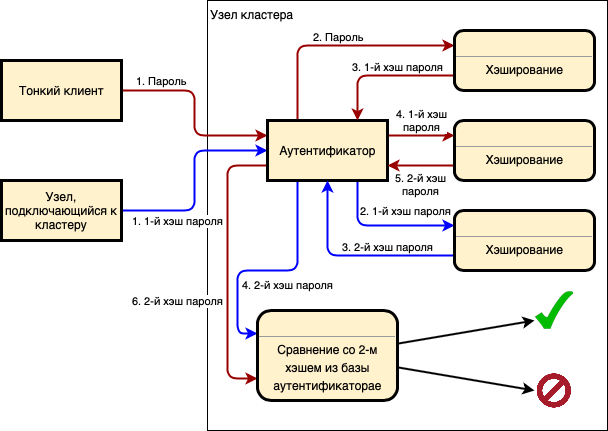

# Идентификация и аутентификация 

В поставку DataGrid входит плагин безопасности, обеспечивающий безопасную идентификацию и двухфакторную аутентификацию пользователей и сервисов. Подробнее о включении плагина безопасности и настройке параметров для идентификации см. в разделе [«Конфигурация плагина безопасности»](../../administration-guide/md/administration-scenarios.md) документа «Руководство системного администратора».

Аутентификация пользователей выполняется с использованием следующего алгоритма:

1. Проверка логина и пароля пользователя. Парольная политика описывается в разделе [«Парольная политика и рекомендации по заданию стойких паролей»](#парольная-политика-и-рекомендации-по-заданию-стойких-паролей).
2. Проверка сертификата. Создание сертификатов и настройки описываются в разделе [«Безопасность и аудит»](../../administration-guide/md/administration-scenarios.md#безопасность-и-аудит) документа «Руководство по системному администрированию».
3. Проверка LDAP. Подробнее об LDAP написано в подразделе [«LDAP Authenticator»](../../administration-guide/md/administration-scenarios.md#ldap-authenticator) раздела «Сценарии администрирования» документа «Руководство по системному администрированию».

DataGrid реализует собственный механизм идентификации и аутентификации пользователей. Формат идентификатора — имя пользователя, которое состоит из:

- комбинации строчных латинских букв (a–z);
- цифр (0–9);
- символов тире и подчеркивания.

Подробнее о формате паролей написано ниже в разделе [«Парольная политика и рекомендации по заданию стойких паролей»](#парольная-политика-и-рекомендации-по-заданию-стойких-паролей).

Узел DataGrid выполняет аутентификацию подключающегося субъекта. Таким субъектом может быть соседний узел, желающий войти в состав кластера, или входящее клиентское подключение одного из видов:

- `IgniteClient` — тонкий клиент, который на данный момент является рекомендуемым средством подключения приложений в кластере DataGrid, поскольку на данный момент не уступает в функциональности клиентскому подключению `GridClient`;
- `GridClient` — более старая реализация тонкого клиента. Основной функциональностью являлась возможность запуска compute tasks, которая позволяла использовать данный вид клиентского подключения для реализации средств администрирования, таких как `control.sh` и Visor;
- `JDBC`- или `ODBC`-подключение.

Аутентификационные данные пользователей хранятся и обрабатываются с помощью плагина безопасности; подробнее в разделе [«Авторизация»](../../security-guide/md/authorisation.md).

## Аутентификация при работе с внешними сервисами

При межсервисной аутентификации DataGrid с внешними сервисами для защищенного взаимодействия используется плагин безопасности. Подробнее в разделе [«Сетевая безопасность»](../../security-guide/md/network-security.md).

## Средство валидации паролей

Плагин безопасности содержит встроенное средство валидации паролей `PasswordQualityValidator.java`.

Данное средство определяет, какое количество, тип и последовательность символов может использоваться при создании пароля.

Средство валидации паролей запускает при выполнении команды `generate-hash`.

### Схема хеширования паролей в процессе аутентификации

В процессе аутентификации выполняется хеширование паролей по алгоритму `PBKDF2WithHmacSHA512` по следующей схеме:



### Парольная политика и рекомендации по заданию стойких паролей

**Парольная политика по умолчанию:**

1. Длина пароля: не менее 8 символов.
2. Минимальное количество уникальных символов: не менее 8.
3. Пароль должен содержать хотя бы одну букву верхнего регистра.
4. Пароль должен содержать хотя бы одну букву нижнего регистра.
5. Пароль должен содержать хотя бы одну цифру.
6. Пароль должен содержать хотя бы один специальный символ.
7. Пароль должен состоять из буквенных символов (латиница и кириллица), цифр и специальных символов.
8. Пароль не должен совпадать с именем пользователя.
9. Пароль не должен содержать три и более символа, которые расположены подряд на клавиатуре.

Неверной последовательностью символов считается использование в пароле трех и более символов, стоящих подряд на клавиатуре, например:

`QWERTYUIOP[]ASDFGHJKL;’ZXCVBNM,./`

При соблюдении данной политики средство валидации подтвердит надежность пароля.

Изменить парольную политику по умолчанию невозможно.

## Использование утилиты SQLLine с плагином безопасности и SSL

Для работы утилиты SQLLine используется класс `com.sbt.security.ignite.sqlline.SqlPlugin`.

:::{admonition} Пример запуска утилиты
:class: hint 
:collapsible:

```bash
$IGNITE_HOME/bin/ise-sqlline.sh -u "jdbc:ignite:thin://xxx.x.x.x/?sslMode=require
&sslClientCertificateKeyStoreUrl=path/to/keystore
&sslTrustCertificateKeyStoreUrl=path/to/truststore"
-n username
```

где указываются следующие обязательные параметры:

-   `sslMode=require` — включение SSL;
-   `sslClientCertificateKeyStoreUrl=path/to/keystore` — путь к хранилищу ключей SSL-сертификатов клиентов;
-   `sslTrustCertificateKeyStoreUrl=path/to/truststore` — путь к доверенному хранилищу ключей SSL-сертификатов.
-   `-n username` — ключ передает имя пользователя. Если не указать ключ, система запросит имя пользователя через консоль.
:::

Подробное описание утилиты находится в разделе [«Утилиты SQLLine (sqlline.sh, ise-sqlline.sh)»](../../administration-guide/md/sqlline.md) документа «Руководство по системному администрированию».