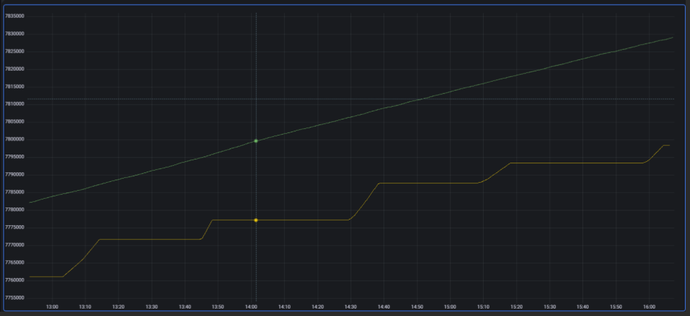

# Часто встречающиеся проблемы и пути их устранения

## Проблемы и их решения

### Лишние узлы в топологии

#### Проблема

Возможные проблемы:

- В топологии есть узлы, которых там быть не должно.
- Запущен новый кластер, в котором версия топологии (`topVer` в log-файле) отличается от `1`.

#### Причина

При конфигурировании узла/узлов для Discovery SPI мог использоваться поисковый механизм Multicast. Пример такой конфигурации:

:::{code-block} xml
:caption: XML
<property name="ipFinder">
                <bean class="org.apache.ignite.spi.discovery.tcp.ipfinder.multicast.TcpDiscoveryMulticastIpFinder">
                    <property name="multicastGroup" value="xxx.xx.xx.xxx"/>
                </bean>
            </property>
:::

Чтобы проверить количество узлов в топологии, используйте один из способов:

- Heartbeat-сообщение в log-файле `ignite.log`, в котором записывается количество узлов (`hosts`). Пример heartbeat-сообщения:
   ```bash
   Cluster [hosts=6, CPUs=9, servers=1, clients=5, topVer=10, minorTopVer=0]
   ```
- Команда `--baseline` с помощью консоли `control.sh`. Команда вернет `consistency id` узлов топологии, по которым можно обнаружить лишний узел.

#### Решение

Настройте класс `TcpDiscoveryVmIpFinder` в конфигурационном файле DataGrid. `TcpDiscoveryVmIpFinder` — статический IP Finder, в его конфигурации указывается набор хостов и портов, которые проверяются при поиске узлов данного кластера.

:::{code-block} xml
:caption: XML
<bean class="org.apache.ignite.spi.discovery.tcp.ipfinder.vm.TcpDiscoveryVmIpFinder">
    <property name="addresses">
        <list>
            <value>xxx.x.x.x:47500..47509</value>
        </list>
    </property>
</bean>
:::

### Долгий запуск первого узла в топологии

#### Проблема

Запуск первого узла занимает значительное время, при этом последующие узлы запускаются гораздо быстрее.

#### Причина

Большое количество адресов и портов в конфигурации Discovery SPI.

DataGrid сканирует все заданные в конфигурации порты. При включенной защите от сканирования портов может не приходить сообщение `Connection refused`. В этом случае проверка порта будет занимать все время, которое задано в значении тайм-аута `IgniteConfiguration.failureDetectionTimeout` (по умолчанию 10 секунд).

Например, если в конфигурации 3 адреса и 10 портов на каждый из них, время запуска займет 5 минут (3 адреса \* 10 портов \* 10 секунд).

:::{code-block} xml
:caption: XML
<bean class="org.apache.ignite.spi.discovery.tcp.ipfinder.vm.TcpDiscoveryVmIpFinder">
    <property name="addresses">
        <list>
            <value>ignite1.local.net:47500..47509</value>
            <value>ignite2.local.net:47500..47509</value>
            <value>ignite3.local.net:47500..47509</value>
        </list>
    </property>
</bean>
:::

#### Решение

Чтобы решить проблему:

1. Не прописывайте лишние порты и адреса. Указывайте только те, которые используются на самом деле.
2. Во внутренней сети отключите защиту от сканирования портов.
3. Снизьте значение `failureDetectionTimeout`, чтобы процесс сканирования проходил быстрее.

### Проблемы при использовании IPv6

#### Проблема

Возможные проблемы:

- Различные сетевые ошибки, которые связаны с невозможностью доставить сообщения и передать данные.
- Сообщения в log-файле вида:
   ```bash
   Failed to connect to address

   Node SEGMENTED

   Failed to send message to remote node
   ```

#### Причина

По умолчанию решения DataGrid тестируются с использованием четвертой версии интернет-протокола (IPv4). При передаче данных с использованием шестой версии (IPv6) могут возникать ошибки, которые описаны выше.

Причина возникновения таких ошибок — смешение окружений IPv4 и IPv6 при переходе с четвертой версии интернет-протокола на шестую.

#### Решение

Для решения конфликта между версиями установите значение `true` для параметра `-Djava.net.preferIPv4Stack` в конфигурационном файле `Ignite-SE-15.0.0/config/jvm.opts`.

### Узел в режиме Maintenance Mode

#### Проблема

Возможные проблемы:

- Узел не входит в топологию.
- В log-файле во время загрузки вместо обычной шапки вида:
   ```bash
   >>> Ignite ver. 2.12.0-p7#YYYYMMDD-sha1:00000xxxx
   >>> OS name: Linux 3.10.0-1160.59.1.el7.x86_64 amd64
   >>> CPU(s): 16
   >>> Heap: 15.0GB
   >>> VM name: 1532437@tvldd-pprb00615
   >>> Local node[ID=1A60DC51-1655-4527-96B6-2D1D27E033F8, order=2, clientMode=false]
   >>> Local node addresses:[hostname, /xxx.x.x.x]
   >>> Local ports: TCP:8080 TCP:10800 TCP:11211 TCP:47100 TCP:4750
   ```

   появляется шапка вида:

   ```bash
   >>> Ignite ver. 2.12.0-p7#YYYYMMDD-sha1:00000xxxx
   >>> --------------------------------------------------------------------------
   >>> OS name: Linux 3.10.0-1160.59.1.el7.x86_64 amd64
   >>> CPU(s): -1
   >>> Heap: 0.1GB
   >>> VM name: 1963884@tvldd-pprb00614
   >>> Local node [ID=6D7810F8-C65A-42A8-AA78-35D4FDA29BD6, order=1, clientMode=false]
   >>> Local node addresses: [localhost/xxx.x.x.x]
   >>> Local ports: TCP:8080 TCP:10800 TCP:11211 TCP:47100
   ```

   Также в log-файле появляется сообщение об ошибке:
   ```bash
   [INFO ][main][org.apache.ignite.internal.IgniteKernal] Node is being started in maintenance mode. Starting IsolatedDiscoverySpi instead of configured discovery SPI.
   ```

#### Причина

Узел загрузился в режиме Maintenance Mode — он предназначен для обслуживания узлов кластера с включенной персистентностью. Когда узел находится в этом режиме, на нем можно выполнять разные команды через скрипты и подключаться через JMX, но в топологию он не входит.

Возможные причины перехода в режим Maintenance:

- очистка поврежденных файлов PDS (Persistence Data Store);
- дефрагментация Native Persistence.

Конкретная причина указывается в сообщении log-файла:

```bash
[INFO ][main][org.apache.ignite.internal.maintenance.MaintenanceProcessor] Node requires maintenance, non-empty set of maintenance tasks is found: [*corrupted-cache-data-files-task*]
```

#### Решение

##### Очистка поврежденных файлов PDS

Возможный сценарий:

1. Узел падает в процессе checkpointing, пока WAL-архив отключен для одного или нескольких кешей.
2. При следующем перезапуске узел обнаруживает, что файлы данных кеша могут быть повреждены, поэтому создает соответствующий Maintenance Task и отключается.
3. Во время следующего перезапуска узел переходит в Maintenance Mode и ожидает от пользователя решения проблемы.

В управляемых средах (например, Kubernetes) это означает, что узел не перезапустится автоматически и пользователь сможет найти возможные поврежденные файлы и удалить их. Когда файлы удаляются вручную, пользователь также удаляет Maintenance Task из регистра и перезапускает узел. В результате узел запускается в нормальном режиме и присоединяется к кластеру.

##### Дефрагментация Native Persistence

Возможный сценарий:

1. Пользователь с помощью скрипта `control.sh` или запросов других API создает Maintenance Task для дефрагментации Native Persistence на узле или определенных кешах.
2. Пользователь перезапускает узел. Он входит в режим Maintenance, находит Maintenance Task по дефрагментации и начинает выполнение задачи.
3. Когда дефрагментация завершается, Maintenance Task автоматически удаляется. При следующем перезапуске узел присоединяется к топологии.

### Проблемы с маршалингом или сериализацией

#### Проблема

Сообщения в log-файле одного из видов:

- ```bash
  Some classes in query configuration cannot be written in binary format...
  ```

- ```bash
  Class FooBar cannot be serialized using BinaryMarshaller
  ```

#### Решение

При взаимодействии продуктового кода с кодом DataGrid происходит сериализация. Это процесс, при котором продуктовый код преобразуется в формат, пригодный для хранения или передачи. Подробнее о сериализации написано в разделе [«Термины и определения»](../../glossary/md/glossary.md).

При записи данных в память для дальнейшего использования DataGrid сериализует объекты с помощью трех механизмов:

- `JDK Marshaller` — обычная Java-сериализация.
- `Optimized Marshaller` — оптимизированная Java-сериализация, при которой используются те же механизмы, что и в случае `JDK Marshaller`. Этот механизм обеспечивает обратную совместимость с Ignite 1.9.
- `Binary Marshaller` — сериализация, которая создана специально для Apache Ignite и используется в DataGrid по умолчанию. Это наиболее быстрый механизм, который позволяет избегать дополнительной сериализации и десериализации, а также работать с объектом напрямую в бинарном формате.

Проблемы с сериализацией классов могут возникать при использовании пользовательской реализации методов `readObject()` и `writeObject()` с помощью интерфейса `Externalizable`. В этом случае невозможна сериализация с помощью механизма `Binary Marshaller` по умолчанию, так как он сериализует объекты с помощью обычной записи полей и простых методов. В случае пользовательской сериализации DataGrid переключится на механизм `Optimized Marshaller` — это может привести к падению производительности.

### Тайм-ауты записи на клиентских узлах

#### Проблема

Возможные проблемы:

- При подключении клиентских узлов и попытке записи на них `TcpCommunicationSpi` перестает работать по тайм-аутам:
   ```bash
   YYYY-MM-DD 17:23:40:275 [WARN ] [org.apache.ignite.spi.communication.tcp.TcpCommunicationSpi] [grid-timeout-worker-#118%DPL_GRID%DplGridNodeName%] - Handshake timed out (will stop attempts to perform the handshake) [node=xxxxxxxx-xxxx-xxxx-xxxx-xxxxxxxxxxxx, connTimeoutStrategy=ExponentialBackoffTimeoutStrategy [maxTimeout=600000, totalTimeout=30000, startNanos=xxxxxxxxxxxxxxxx, currTimeout=600000], err=Operation timed out [timeoutStrategy= ExponentialBackoffTimeoutStrategy [maxTimeout=600000, totalTimeout=30000, startNanos=xxxxxxxxxxxxxxxx, currTimeout=600000]], addr=/xxx.xxx.xxx.x:xxxxx, failureDetectionTimeoutEnabled=true, timeout=0]
   ```
- В log-файлах сервера при наличии данной проблемы отображается много попыток входящих соединений:
   ```bash
   YYYY-MM-DD 17:24:29.141 [INFO ][grid-nio-worker-tcp-comm-10-#129%TcpCommunicationSpi%][org.apache.ignite.spi.communication.tcp.TcpCommunicationSpi] Accepted incoming communication connection [locAddr=/xxx.xxx.xxx.x:xxxxx, rmtAddr=/xxx.xxx.xxx.x:42776]
   ```

В целях диагностики обратите внимание на:

- IP-адрес, по которому происходит `time out handshake`;
- IP-адрес, с которым запущен кластер.

#### Причина

Проблема появляется, когда:

- в операционной системе настроено несколько сетевых интерфейсов;
- `TcpCommunicationSpi` запускается в интерфейсе, отличающемся от того, на котором работает кластер:
   ```bash
   YYYY-MM-DD 00:00:10.362 [INFO ][grid-timeout-worker-#118][org.apache.ignite.internal.IgniteKernal]
   Metrics for local node (to disable set 'metricsLogFrequency' to 0)
       ^-- Node [id=7eace3d5, uptime=1 day, 05:29:46.136]
       ^-- Cluster [hosts=32, CPUs=1792, servers=32, clients=9, topVer=53, minorTopVer=0]
       ^-- Network [addrs=[xx.xxx.xxx.xxx, xxx.x.x.x, xxx.xxx.xxx.x], discoPort=47500, commPort=47100]
       ^-- CPU [CPUs=56, curLoad=0.03%, avgLoad=0.05%, GC=0%]
       ^-- Heap [used=10953MB, free=65.49%, comm=31744MB]
       ^-- Off-heap memory [used=132MB, free=99.98%, allocated=592071MB]
       ^-- Page memory [pages=33435]
       ^--   sysMemPlc region [type=internal, persistence=true, lazyAlloc=false,
         ...  initCfg=40MB, maxCfg=100MB, usedRam=0MB, freeRam=99.99%, allocRam=99MB, allocTotal=0MB]
       ^--   default region [type=default, persistence=true, lazyAlloc=true,
         ...  initCfg=256MB, maxCfg=591872MB, usedRam=130MB, freeRam=99.98%, allocRam=591871MB, allocTotal=129MB]
       ^--   metastoreMemPlc region [type=internal, persistence=true, lazyAlloc=false,
         ...  initCfg=40MB, maxCfg=100MB, usedRam=2MB, freeRam=97.99%, allocRam=0MB, allocTotal=2MB]
       ^--   TxLog region [type=internal, persistence=true, lazyAlloc=false,
         ...  initCfg=40MB, maxCfg=100MB, usedRam=0MB, freeRam=100%, allocRam=99MB, allocTotal=0MB]
       ^--   volatileDsMemPlc region [type=user, persistence=false, lazyAlloc=true,
         ...  initCfg=40MB, maxCfg=100MB, usedRam=0MB, freeRam=100%, allocRam=0MB]
       ^-- Ignite persistence [used=131MB]
       ^-- Outbound messages queue [size=0]
       ^-- Public thread pool [active=0, idle=0, qSize=0]
       ^-- System thread pool [active=0, idle=7, qSize=0]
   ```

#### Решение

Укажите в bean `TcpCommunicationSpi` свойство с локальным IP-адресом, на котором запущен кластер (`TcpDiscoveryVmIpFinder`).

:::{code-block} xml
:caption: XML
<property name="localAddress" value="x.x.x.x"/>
:::

### Долгие транзакции и LRT

#### Проблема

Возможные проблемы:

- Сработала метрика `LRT Found long running transaction NEW` в Grafana.
- В log-файле `ignite.log` есть сообщения вида:
   ```bash
   [YYYY-MM-DD 11:41:53,530][WARN ][sys-#206%client%][root] First 10 long running transactions [total=10]
   [YYYY-MM-DD 11:41:53,530][WARN ][sys-#206%client%][root] >>> Transaction [startTime=11:41:52.961, curTime=11:41:53.518, systemTime=0, userTime=557, tx=GridNearTxLocal [mappings=IgniteTxMappingsImpl [], nearLocallyMapped=false, colocatedLocallyMapped=false, needCheckBackup=null, hasRemoteLocks=false, trackTimeout=false, systemTime=0, systemStartTime=0, prepareStartTime=0, prepareTime=0, commitOrRollbackStartTime=0, commitOrRollbackTime=0, lb=null, mvccOp=null, qryId=-1, crdVer=0, thread=async-tx-with-delay-#240%testscope%, mappings=IgniteTxMappingsImpl [], super=GridDhtTxLocalAdapter [nearOnOriginatingNode=false, span=o.a.i.i.processors.tracing.NoopSpan@60d3a365, nearNodes=KeySetView [], dhtNodes=KeySetView [], explicitLock=false, super=IgniteTxLocalAdapter [completedBase=null, sndTransformedVals=false, depEnabled=false, txState=IgniteTxStateImpl [activeCacheIds=[], recovery=null, mvccEnabled=null, mvccCachingCacheIds=[], txMap=EmptySet []], super=IgniteTxAdapter [xidVer=GridCacheVersion [topVer=244989714, order=1633509712519, nodeOrder=3], writeVer=null, implicit=false, loc=true, threadId=264, startTime=1633509712961, nodeId=390487f0-99c2-4890-992c-c9c3ac93d505, isolation=REPEATABLE_READ, concurrency=PESSIMISTIC, timeout=0, sysInvalidate=false, sys=false, plc=2, commitVer=null, finalizing=NONE, invalidParts=null, state=ACTIVE, timedOut=false, topVer=AffinityTopologyVersion [topVer=-1, minorTopVer=0], mvccSnapshot=null, skipCompletedVers=false, parentTx=null, duration=557ms, onePhaseCommit=false], size=0]]]]
   ...
   ```

#### Решение

Некоторые события кластера запускают процесс обмена данными между узлами и их ребалансировку, чтобы обеспечить равномерное распределение данных по всему кластеру. Примеры таких событий — изменение топологии при подключении нового или отключении существующего узла, создание новых кешей или SQL-таблиц.

При возникновении подобных событий в DataGrid может увеличиться порог времени проведения транзакций (по умолчанию 60 секунд). Проблема часто связана с появлением LRT — длительных транзакций, которые долго выполняются в кластере. Незавершенные транзакции препятствуют обмену данными, так как они блокируют операции кластера, например процесс подключения нового узла.

Для решения проблемы проанализируйте содержимое log-файла, в котором присутствуют сообщения вида `Found long running transaction NEW`. Возможные причины увеличения длительности транзакции:

- Длительная работа прикладного кода. Об этой проблеме свидетельствует наличие транзакции в активном статусе (`status=active`).
- Неисправное состояние кластера, при котором транзакции перестали выполняться, например при отказе дисков.

При первом сообщении о появлении LRT в log-файле серверного узла выведется дамп потока, который запустил LRT на узле-координаторе транзакции. Часто этот узел является клиентским, то есть дамп потока транзакции также будет получен с клиентского узла. Дамп показывает тип выполняемой операции (бизнес-операция или взаимодействие с DataGrid). Признаки, которые присутствуют в дампах транзакций и свидетельствуют о наличии задержек:

- атрибуты `TransactionProxyImpl.commit`, `TransactionProxyImpl.rollback` и `TransactionProxyImpl.prepare` свидетельствуют о задержках работы сети или GC-задержках (очистка мусора);
- бизнес-коды, кеш-операции и другие параметры промежуточного состояния свидетельствуют о задержках в работе прикладного кода или о низких тайм-аутах транзакций.

Пример записи в log-файле:

```bash
YYYY-MM-DD 05:31:08.093 [WARN ][sys-#112111][org.apache.ignite.internal.diagnostic] Dumping the near node thread that started transaction [xidVer=GridCacheVersion [topVer=267985566, order=1658822904791, nodeOrder=29, dataCenterId=0], nodeId=b1076c6d-e26d-44ff-bd30-af41845a42ed]
Stack trace of the transaction owner thread:
Thread [name="se-53", id=1353, state=WAITING, blockCnt=1, waitCnt=1788]
Lock [object=java.util.concurrent.locks.AbstractQueuedSynchronizer$ConditionObject@a19d495, ownerName=null, ownerId=-1]
at sun.misc.Unsafe.park(Native Method)
at java.util.concurrent.locks.LockSupport.park(LockSupport.java:175)
at java.util.concurrent.locks.AbstractQueuedSynchronizer$ConditionObject.await(AbstractQueuedSynchronizer.java:2039)
at java.util.concurrent.ArrayBlockingQueue.take(ArrayBlockingQueue.java:403)
at java.util.concurrent.ThreadPoolExecutor.getTask(ThreadPoolExecutor.java:1074)
at java.util.concurrent.ThreadPoolExecutor.runWorker(ThreadPoolExecutor.java:1134)
at java.util.concurrent.ThreadPoolExecutor$Worker.run(ThreadPoolExecutor.java:624)
at java.lang.Thread.run(Thread.java:748)
```

LRT-транзакции часто возникают в результате следующих причин:

- повышенная загрузка узлов кластера;
- наличие сетевых проблем, которые приводят к деградации вычислений;
- системные проблемы — длительные GC-паузы на узлах, неоптимальный код, падение узлов кластера.

Чтобы настроить время срабатывания для вывода сообщений о наличии LTR-транзакций, используйте JVM-опцию `IGNITE_LONG_OPERATIONS_DUMP_TIMEOUT`. По умолчанию время вывода сообщений — 1 секунда.

Чтобы установить максимальное время для длительных транзакций, используйте метод `TransactionConfiguration.setTxTimeoutOnPartitionMapExchange(...)`. Когда сработал тайм-аут, происходит откат всех незавершенных транзакций, после этого процесс обмена данными в кластере продолжается.

Пример XML-файла для конфигурации времени тайм-аута:

:::{code-block} xml
:caption: XML
<bean class="org.apache.ignite.configuration.IgniteConfiguration">

    <property name="transactionConfiguration">
        <bean class="org.apache.ignite.configuration.TransactionConfiguration">
            <!-- Установите тайм-аут на 20 секунд .-->
            <property name="TxTimeoutOnPartitionMapExchange" value="20000"/>
        </bean>
    </property>

</bean>
:::

Чек-лист вопросов для анализа LRT-транзакций:

- В чем причина возникновения LRT?
- Каким способом можно восстановить LRT — автоматически или вручную?
- Что нужно сделать, чтобы снизить вероятность повторения сбоя в будущем?
- Как LRT-транзакция повлияла на данные и дальнейшую работу?

### Долгий PME

#### Проблема

PME занимает продолжительное время.

PME (Partition Map Exchange) — процесс обмена информацией о партициях между узлами кластера. Его цель — установить актуальное состояние партиций для всех узлов кластера.

#### Причина

Продолжительность PME зависит от количества партиций и длительности транзакций, которые должны завершиться перед началом процесса обмена. Чем меньше длительность PME, тем лучше.

К симптомам относится срабатывание метрик по LRT, например `Found Long Running Transactions NEW`.

Симптомы вызваны следующими проблемами:

- создание транзакций без тайм-аутов или с большими тайм-аутами;
- наличие дефектов.

Есть вероятность, что транзакция никогда не будет завершена. Например, если пользователь запустил `PESSIMISTIC`-транзакции и выполнил  `cache put`, который вызывает блокировку и настройку версии топологии транзакций. Для этого случая вводится `timeout` транзакции на PME. Если транзакция не может завершиться в рамках указанного`timeout`, она принудительно отменяется перед началом PME.

#### Решение

Установите время в `setTxTimeoutOnPartitionMapExchange(long txTimeoutOnPartitionMapExchange)`. Если на момент начала PME транзакция не завершится, начнется отсчет этого тайм-аута. Когда он истечет, произойдет откат транзакции.

Если тайм-ауты для транзакций не настроили должным образом, есть большая вероятность возникновения «повисших» транзакций. Их придется искать вручную и останавливать с помощью скрипта `control.sh`.

### Поломка H2-индексов

#### Проблема

Узлы завершают работу с ошибками вида `Critical system error detected. Will be handled accordingly to configured handler`. Поломка индексов выявляется в результате выполнения команды `control.sh` `--cache validate_indexes <optional arguments>`.

В log-файле появятся сообщения об ошибке. О поломке индексов свидетельствует сообщение `CorruptedTreeException: B+Tree is corrupted`:

```bash
YYYY-MM-DD 17:33:43.466 [ERROR][sys-stripe-9-#10][] Critical system error detected. Will be handled accordingly to configured handler [hnd=StopNodeOrHaltFailureHandler [tryStop=false, timeout=0, super=AbstractFailureHandler [ignoredFailureTy
pes=UnmodifiableSet [SYSTEM_WORKER_BLOCKED, SYSTEM_CRITICAL_OPERATION_TIMEOUT]]], failureCtx=FailureContext [type=CRITICAL_ERROR, err=class o.a.i.i.processors.cache.persistence.tree.CorruptedTreeException: B+Tree is corrupted [pages(groupId,
pageId)=[IgniteBiTuple [val1=544320549, val2=844420635174666]], cacheId=-227153373, cacheName=APPLY_ERROR_V1, indexName=_key_PK, msg=Runtime failure on row: Row@4118366a[ key: BinaryObject [idHash=974233043, hash=1604362618], val: Data hidd
en due to IGNITE_TO_STRING_INCLUDE_SENSITIVE flag. ][ data hidden, data hidden, data hidden, data hidden, data hidden, data hidden, data hidden, data hidden, data hidden, data hidden, data hidden, data hidden, data hidden, data hidden ]]]]
org.apache.ignite.internal.processors.cache.persistence.tree.CorruptedTreeException: B+Tree is corrupted [pages(groupId, pageId)=[IgniteBiTuple [val1=544320549, val2=844420635174666]], cacheId=-227153373, cacheName=APPLY_ERROR_V1, indexName=
_key_PK, msg=Runtime failure on row: Row@4118366a[ key: BinaryObject [idHash=974233043, hash=1604362618], val: Data hidden due to IGNITE_TO_STRING_INCLUDE_SENSITIVE flag. ][ data hidden, data hidden, data hidden, data hidden, data hidden, da
ta hidden, data hidden, data hidden, data hidden, data hidden, data hidden, data hidden, data hidden, data hidden ]]
```

#### Решение

Перестройте индексы:

1. Остановите проблемные узлы.
2. Удалите проблемный файл `index.bin`.
3. Запустите узлы.
4. Выполните процесс перестройки всех индексов с помощью команды `control.sh` `z--cache indexes_force_rebuild --node-ids nodeId1,...nodeIdN|--all-nodes --cache-names cacheName1,...cacheNameN|--group-names groupName1,...groupNameN`.
5. Дождитесь завершения процесса перестройки индексов.

### Неравномерная загрузка узлов

#### Проблема

Неравномерное распределение данных по узлам кластера и неравномерная нагрузка на них.

Некорректное распределение данных и ошибки кода могут приводить к скоплению запросов на одном узле. Из-за этого возникает неравномерная загрузка на остальные узлы:

- на уровне аппаратных и/или физических ресурсов, к которым относятся CPU, SSD, RAM, LAN, аппаратные ресурсы узлов кластера;
- на уровне неаппаратных ресурсов, к которым относятся системные потоки кластера (thread pools), все виды памяти в операционной системе, партиции и так далее.

Каждый вид ресурсов может утилизироваться преимущественно на одном из узлов. Из-за этого кластер не сможет отрабатывать запросы со скоростью, которая требуется по SLA, или развалится.

Мониторинг симптомов возможен с помощью сбора фактуры `ignite.log`, метрик DataGrid и операционной системы.

#### Причина

Возможные причины проблемы:

- некорректная конфигурация, например указан только один IP-адрес;
- ошибки в коде, из-за которых данные и запросы направляются на один узел.

#### Решение

Для решения проблемы установите причину концентрации данных.

Если причина в некорректной конфигурации, настройте ее. Если проблема в коде, найдите ошибки и решите проблему с ключами, разнесением данных по узлам и партициям.

### Медленная работа диска

#### Проблема

Возможные причины проблемы:

- увеличение продолжительности процесса Checkpointing;
- checkpoints spikes на графике;
- кластер «тормозит».

#### Причина

Вероятная причина проблемы — несбалансированность пропускной способности памяти и диска. В целях диагностики проверьте метрику, которая показывает количество сбрасываемых страниц (`LastCheckpointTotalPagesNumber`). Если она коррелирует с увеличением длительности checkpointing, с большой вероятностью проблемы нет, а время увеличилось за счет роста нагрузки на диск.

Если метрика не коррелирует с длительностью checkpointing, проанализируйте содержимое `ignite.log`, `dmesg` и  `messages`— возможно, диск утилизирован или возникла проблема на уровне операционной системы или железа. Для решения проблемы передайте службе поддержки DataGrid содержимое файлов `ignite`, `dmesg` и `messages`.

#### Решение

Решение зависит от результатов, которые будут получены после изучения log-файла на наличие сообщений уровня `ERROR` и `WARN`.

### Взаимоблокировка (deadlock)

#### Проблема

Возможные проблемы:

- Замедление бизнес-операций.
- Завершение транзакций сообщениями вида:
  - на серверных узлах:
    ```bash
     [ERROR][grid-timeout-worker-#118][org.apache.ignite.internal.processors.cache.distributed.dht.colocated.GridDhtColocatedCache] <tw.transactions> Failed to acquire lock for request: GridNearLockRequest [topVer=AffinityTopologyVersion [topVer=418, minorTopVer=0], miniId=1, dhtVers=GridCacheVersion[] [null], subjId=088f0b3b-8b8c-4d41-ab0c-73cd0d5af2f8, taskNameHash=0, createTtl=-1, accessTtl=-1, flags=5, txLbl=null, filter=null, super=GridDistributedLockRequest [nodeId=088f0b3b-8b8c-4d41-ab0c-73cd0d5af2f8, nearXidVer=GridCacheVersion [topVer=245981357, order=1637825079145, nodeOrder=400], threadId=8689, futId=334a5c5cc71-0864976c-edcc-4d9e-bb9a-92b2b91a2bd2, timeout=30000, isInTx=true, isInvalidate=false, isRead=true, isolation=REPEATABLE_READ, retVals=[true], txSize=0, flags=2, keysCnt=1, super=GridDistributedBaseMessage [ver=GridCacheVersion [topVer=245981357, order=1637825079145, nodeOrder=400], committedVers=null, rolledbackVers=null, cnt=0, super=GridCacheIdMessage [cacheId=92902112, super=GridCacheMessage [msgId=155993, depInfo=null, lastAffChangedTopVer=AffinityTopologyVersion [topVer=24, minorTopVer=71], err=null, skipPrepare=false]]]]]
     org.apache.ignite.internal.transactions.IgniteTxTimeoutCheckedException: Failed to acquire lock within provided timeout for transaction [timeout=30000, tx=GridDhtTxLocal[xid=8776bf55d71-00000000-0ea9-60ad-0000-000000000004, xidVersion=GridCacheVersion [topVer=245981357, order=1637825079160, nodeOrder=4], nearXidVersion=GridCacheVersion [topVer=245981357, order=1637825079145, nodeOrder=400], concurrency=PESSIMISTIC, isolation=REPEATABLE_READ, state=MARKED_ROLLBACK, invalidate=false, rollbackOnly=true, nodeId=63a1650c-7291-44be-a5b7-3be796c4ad6f, timeout=30000, startTime=1635424056538, duration=30007]]
     at org.apache.ignite.internal.processors.cache.transactions.IgniteTxLocalAdapter$PostLockClosure1.apply(IgniteTxLocalAdapter.java:1798) ~[ignite-core-2.10.0-p1.jar:2.10.0-p1]
     at org.apache.ignite.internal.processors.cache.transactions.IgniteTxLocalAdapter$PostLockClosure1.apply(IgniteTxLocalAdapter.java:1746) ~[ignite-core-2.10.0-p1.jar:2.10.0-p1]
     at org.apache.ignite.internal.util.future.GridEmbeddedFuture$2.applyx(GridEmbeddedFuture.java:86) ~[ignite-core-2.10.0-p1.jar:2.10.0-p1]
     at org.apache.ignite.internal.util.future.GridEmbeddedFuture$AsyncListener1.apply(GridEmbeddedFuture.java:292) [ignite-core-2.10.0-p1.jar:2.10.0-p1]
     at org.apache.ignite.internal.util.future.GridEmbeddedFuture$AsyncListener1.apply(GridEmbeddedFuture.java:285) [ignite-core-2.10.0-p1.jar:2.10.0-p1]
     at org.apache.ignite.internal.util.future.GridFutureAdapter.notifyListener(GridFutureAdapter.java:399) [ignite-core-2.10.0-p1.jar:2.10.0-p1]
     at org.apache.ignite.internal.util.future.GridFutureAdapter.unblock(GridFutureAdapter.java:347) [ignite-core-2.10.0-p1.jar:2.10.0-p1]
     at org.apache.ignite.internal.util.future.GridFutureAdapter.unblockAll(GridFutureAdapter.java:335) [ignite-core-2.10.0-p1.jar:2.10.0-p1]
     at org.apache.ignite.internal.util.future.GridFutureAdapter.onDone(GridFutureAdapter.java:511) [ignite-core-2.10.0-p1.jar:2.10.0-p1]
     at org.apache.ignite.internal.processors.cache.GridCacheCompoundIdentityFuture.onDone(GridCacheCompoundIdentityFuture.java:56) [ignite-core-2.10.0-p1.jar:2.10.0-p1]
     at org.apache.ignite.internal.util.future.GridFutureAdapter.onDone(GridFutureAdapter.java:490) [ignite-core-2.10.0-p1.jar:2.10.0-p1]
     at org.apache.ignite.internal.processors.cache.distributed.dht.GridDhtLockFuture.onComplete(GridDhtLockFuture.java:802) [ignite-core-2.10.0-p1.jar:2.10.0-p1]
     at org.apache.ignite.internal.processors.cache.distributed.dht.GridDhtLockFuture.access$900(GridDhtLockFuture.java:93) [ignite-core-2.10.0-p1.jar:2.10.0-p1]
     at org.apache.ignite.internal.processors.cache.distributed.dht.GridDhtLockFuture$LockTimeoutObject.onTimeout(GridDhtLockFuture.java:1202) [ignite-core-2.10.0-p1.jar:2.10.0-p1]
     at org.apache.ignite.internal.processors.timeout.GridTimeoutProcessor$TimeoutWorker.body(GridTimeoutProcessor.java:234) [ignite-core-2.10.0-p1.jar:2.10.0-p1]
     at org.apache.ignite.internal.util.worker.GridWorker.run(GridWorker.java:120) [ignite-core-2.10.0-p1.jar:2.10.0-p1]
     at java.lang.Thread.run(Thread.java:748) [?:1.8.0_301]
     ```
   - на инициаторе транзакции:
     ```bash
     Caused by: javax.cache.CacheException: class org.apache.ignite.transactions.TransactionTimeoutException: Failed to acquire lock within provided timeout for transaction [timeout=30000, tx=GridNearTxLocal[xid=f3c4b265d71-00000000-0ea9-60ad-0000-00000000019a, xidVersion=GridCacheVersion [topVer=245981357, order=1637828217919, nodeOrder=410], nearXidVersion=GridCacheVersion [topVer=245981357, order=1637828217919, nodeOrder=410], concurrency=PESSIMISTIC, isolation=REPEATABLE_READ, state=MARKED_ROLLBACK, invalidate=false, rollbackOnly=true, nodeId=68ca22f4-38be-4027-8c81-94b0ea81559e, timeout=30000, startTime=1635430164207, duration=30016, label=null]]
        at org.apache.ignite.internal.processors.cache.GridCacheUtils.convertToCacheException(GridCacheUtils.java:1263)
        at org.apache.ignite.internal.processors.cache.IgniteCacheProxyImpl.cacheException(IgniteCacheProxyImpl.java:2083)
        at org.apache.ignite.internal.processors.cache.IgniteCacheProxyImpl.get(IgniteCacheProxyImpl.java:1110)
        at org.apache.ignite.internal.processors.cache.GatewayProtectedCacheProxy.get(GatewayProtectedCacheProxy.java:676)
        at com.sbt.processing.data.ignite.IgniteWriter.writeIdentifiableInternal(IgniteWriter.java:95)
        at com.sbt.processing.data.ignite.IgniteWriter.appendIdentifiable(IgniteWriter.java:74)
        ... 17 more
        Caused by: class org.apache.ignite.transactions.TransactionTimeoutException: Failed to acquire lock within provided timeout for transaction [timeout=30000, tx=GridNearTxLocal[xid=f3c4b265d71-00000000-0ea9-60ad-0000-00000000019a, xidVersion=GridCacheVersion [topVer=245981357, order=1637828217919, nodeOrder=410], nearXidVersion=GridCacheVersion [topVer=245981357, order=1637828217919, nodeOrder=410], concurrency=PESSIMISTIC, isolation=REPEATABLE_READ, state=MARKED_ROLLBACK, invalidate=false, rollbackOnly=true, nodeId=68ca22f4-38be-4027-8c81-94b0ea81559e, timeout=30000, startTime=1635430164207, duration=30016, label=null]]
        at org.apache.ignite.internal.util.IgniteUtils$13.apply(IgniteUtils.java:987)
        at org.apache.ignite.internal.util.IgniteUtils$13.apply(IgniteUtils.java:984)
        ... 23 more
        Caused by: class org.apache.ignite.transactions.TransactionDeadlockException:
        Deadlock detected:
     K1: TX1 holds lock, TX2 waits lock.
     K2: TX2 holds lock, TX1 waits lock.
     Transactions:
     TX1 [txId=GridCacheVersion [topVer=245981357, order=1637828217886, nodeOrder=418], nodeId=1d0a56c0-cc47-4369-b9c5-c5fe1fffe7bf, threadId=1176]
     TX2 [txId=GridCacheVersion [topVer=245981357, order=1637828217919, nodeOrder=410], nodeId=68ca22f4-38be-4027-8c81-94b0ea81559e, threadId=12957]
     Keys:
     K1 [key=d6oDXoRGCvEAAAF8x+CxoMaIDaIpVm6K, cache=tw.transactions_bundle]
     K2 [key=d6oDXoRGCvEAAAF8x+CxoMaIDaIpVm6K, cache=tw.transactions]
         at org.apache.ignite.internal.processors.cache.distributed.dht.colocated.GridDhtColocatedLockFuture$LockTimeoutObject$1.apply(GridDhtColocatedLockFuture.java:1539)
         at org.apache.ignite.internal.processors.cache.distributed.dht.colocated.GridDhtColocatedLockFuture$LockTimeoutObject$1.apply(GridDhtColocatedLockFuture.java:1532)
         at org.apache.ignite.internal.util.future.GridFutureAdapter.notifyListener(GridFutureAdapter.java:399)
         at org.apache.ignite.internal.util.future.GridFutureAdapter.unblock(GridFutureAdapter.java:347)
         at org.apache.ignite.internal.util.future.GridFutureAdapter.unblockAll(GridFutureAdapter.java:335)
         at org.apache.ignite.internal.util.future.GridFutureAdapter.onDone(GridFutureAdapter.java:511)
         at org.apache.ignite.internal.util.future.GridFutureAdapter.onDone(GridFutureAdapter.java:490)
         at org.apache.ignite.internal.processors.cache.transactions.TxDeadlockDetection$TxDeadlockFuture.onDone(TxDeadlockDetection.java:538)
         at org.apache.ignite.internal.processors.cache.transactions.TxDeadlockDetection$TxDeadlockFuture.onDone(TxDeadlockDetection.java:163)
         at org.apache.ignite.internal.util.future.GridFutureAdapter.onDone(GridFutureAdapter.java:467)
         at org.apache.ignite.internal.processors.cache.transactions.TxDeadlockDetection$TxDeadlockFuture.detect(TxDeadlockDetection.java:314)
         at org.apache.ignite.internal.processors.cache.transactions.TxDeadlockDetection$TxDeadlockFuture.onResult(TxDeadlockDetection.java:514)
         at org.apache.ignite.internal.processors.cache.transactions.IgniteTxManager$DeadlockDetectionListener.onMessage(IgniteTxManager.java:3593)
         at org.apache.ignite.internal.managers.communication.GridIoManager.invokeListener(GridIoManager.java:1908)
         at org.apache.ignite.internal.managers.communication.GridIoManager.processRegularMessage0(GridIoManager.java:1529)
         at org.apache.ignite.internal.managers.communication.GridIoManager.access$5300(GridIoManager.java:242)
         at org.apache.ignite.internal.managers.communication.GridIoManager$9.execute(GridIoManager.java:1422)
         at org.apache.ignite.internal.managers.communication.TraceRunnable.run(TraceRunnable.java:55)
         at org.apache.ignite.internal.util.StripedExecutor$Stripe.body(StripedExecutor.java:569)
         at org.apache.ignite.internal.util.worker.GridWorker.run(GridWorker.java:120)
         ... 1 more
     ```

#### Решение

По сообщению на инициаторе транзакции определите, на каком ключе произошла взаимоблокировка:

```bash
K1 [key=d6oDXoRGCvEAAAF8x+CxoMaIDaIpVm6K, cache=tw.transactions_bundle]
K2 [key=d6oDXoRGCvEAAAF8x+CxoMaIDaIpVm6K, cache=tw.transactions]
```

Обычно данную информацию нужно передать на анализ прикладным разработчикам, чтобы они смогли определить причины возникновения взаимоблокировки в коде. Если добавлен параметр `-DIGNITE_TO_STRING_INCLUDE_SENSITIVE=false`, значение ключей не будет попадать в log-файл и по сообщениям не получится узнать, на каких ключах произошла взаимоблокировка.

```bash
K1 [key=, cache=tw.transactions_bundle]
K2 [key=, cache=tw.transactions]
```

Обнаружение взаимоблокировок — многоэтапная процедура, для которой может понадобиться много итераций в зависимости от количества узлов в кластере, ключей и транзакций, которые участвуют в возможном deadlock.

Инициатор обнаружения взаимоблокировки — узел, на котором транзакция началась, но была прервана с исключением `TransactionTimeOutException`. Этот узел будет исследовать, произошла ли взаимоблокировка: обмениваться запросами/ответами с другими удаленными узлами. Затем он подготовит отчет о взаимоблокировке с помощью `TransactionDeadlockException`. Каждое такое сообщение (запрос/ответ) — одна итерация.

Для предсказуемого времени отката транзакции настройте максимальное количество итераций для процедуры обнаружения взаимоблокировки — `Ignitesystemproperties.ignite_tx_deadlock_detection_max_iters`. Если значение свойства — `0` и меньше, `deadlock detection` будет отключен (по умолчанию 1000). `Ignitesystemproperties.ignite_tx_deadlock_detection_timeout` указывает время ожидания для обнаружения взаимоблокировки (по умолчанию 1 минута).

Настроить другой тайм-аут можно с помощью опции `-DIGNITE_TX_DEADLOCK_DETECTION_TIMEOUT=<new_timeout>`.

### Не запускается узел (общие рекомендации)

Чтобы установить причины, проведите анализ log-файлов. Рекомендуется следующая последовательность анализа:

1. Просмотрите содержимое `ignite.log` — в нем будет присутствовать сообщение о причине прерывания запуска. Если log-файл пустой или обрывается без сообщения об ошибке, перейдите к следующему пункту.
2. Проверьте содержимое `err.out` — в нем может присутствовать сообщение об ошибке.
3. Проверьте `gc.log` и узнайте, запустилась ли JVM. Проверьте, не создался ли файл `crush dump`.
4. Изучите `dmesg` и `messages`.

### Не запускается клиентский узел (Unable to establish secure connection)

#### Проблема

Возможные проблемы:

- Не запускается клиентский узел.
- В log-файле клиентского узла есть сообщение:
  ```bash
  DD.MM.YYYY 15:36:44,654 INFO  [stdout] (ServerService Thread Pool – 105) Caused by: org.apache.ignite.spi.IgniteSpiException: Unable to establish secure connection. Was remote cluster configured with SSL? [rmtAddr=/xx.xxx.xx.xxx:47500, errMsg="Received fatal alert: handshake_failure"]
  ```

#### Решение

Убедитесь, что в XML-конфигурации клиентского и серверного узлов установлено одно и то же значение:

:::{code-block} xml
:caption: XML
<property name="protocols" value="#{systemProperties['https.protocols']}" />
:::

### Не запускается серверный узел (Failed to bind to any [host:port] from the range)

#### Проблема

Возможные проблемы:

- Не запускается серверный узел.
- В log-файле серверного узла есть сообщение:
  ```bash
  YYYY-MM-DD 15:35:07.381 [ERROR][main][org.apache.ignite.internal.IgniteKernal] Got exception while starting (will rollback startup routine).
  org.apache.ignite.IgniteCheckedException: Failed to start processor: GridProcessorAdapter []
  at org.apache.ignite.internal.IgniteKernal.startProcessor(IgniteKernal.java:1960) ~[ignite-core-2.9.0-p8.jar:2.9.0-p8]
  at org.apache.ignite.internal.IgniteKernal.start(IgniteKernal.java:1237) [ignite-core-2.9.0-p8.jar:2.9.0-p8]
  at org.apache.ignite.internal.IgnitionEx$IgniteNamedInstance.start0(IgnitionEx.java:2046) [ignite-core-2.9.0-p8.jar:2.9.0-p8]
  at org.apache.ignite.internal.IgnitionEx$IgniteNamedInstance.start(IgnitionEx.java:1698) [ignite-core-2.9.0-p8.jar:2.9.0-p8]
  at org.apache.ignite.internal.IgnitionEx.start0(IgnitionEx.java:1114) [ignite-core-2.9.0-p8.jar:2.9.0-p8]
  at org.apache.ignite.internal.IgnitionEx.startConfigurations(IgnitionEx.java:1032) [ignite-core-2.9.0-p8.jar:2.9.0-p8]
  at org.apache.ignite.internal.IgnitionEx.start(IgnitionEx.java:918) [ignite-core-2.9.0-p8.jar:2.9.0-p8]
  at org.apache.ignite.internal.IgnitionEx.start(IgnitionEx.java:817) [ignite-core-2.9.0-p8.jar:2.9.0-p8]
  at org.apache.ignite.internal.IgnitionEx.start(IgnitionEx.java:687) [ignite-core-2.9.0-p8.jar:2.9.0-p8]
  at org.apache.ignite.internal.IgnitionEx.start(IgnitionEx.java:656) [ignite-core-2.9.0-p8.jar:2.9.0-p8]
  at org.apache.ignite.Ignition.start(Ignition.java:353) [ignite-core-2.9.0-p8.jar:2.9.0-p8]
  at org.apache.ignite.startup.cmdline.CommandLineStartup.main(CommandLineStartup.java:300) [ignite-core-2.9.0-p8.jar:2.9.0-p8]
  Caused by: org.apache.ignite.IgniteCheckedException: Failed to start client connector processor.
  at org.apache.ignite.internal.processors.odbc.ClientListenerProcessor.start(ClientListenerProcessor.java:215) ~[ignite-core-2.9.0-p8.jar:2.9.0-p8]
  at org.apache.ignite.internal.IgniteKernal.startProcessor(IgniteKernal.java:1957) ~[ignite-core-2.9.0-p8.jar:2.9.0-p8]
  ... 11 more
  Caused by: org.apache.ignite.IgniteCheckedException: Failed to bind to any [host:port] from the range [host=0.0.0.0, portFrom=10800, portTo=10800, lastErr=class org.apache.ignite.IgniteCheckedException: Failed to initialize NIO selector.]
  at org.apache.ignite.internal.processors.odbc.ClientListenerProcessor.start(ClientListenerProcessor.java:203) ~[ignite-core-2.9.0-p8.jar:2.9.0-p8]
  at org.apache.ignite.internal.IgniteKernal.startProcessor(IgniteKernal.java:1957) ~[ignite-core-2.9.0-p8.jar:2.9.0-p8]
  ... 11 more
  ```

#### Решение

Проверьте, кем заняты порты из диапазона `portFrom` – `portTo`:

```bash
netstat -anp | grep ПОРТ;
```

С большой вероятностью диапазон занят клиентским узлом. Если это так, отключите клиентский узел и перезапустите серверный, который не удавалось запустить. Когда серверный узел подключится, запустите клиентский.

### Не запускается ignite-provider

#### Проблема

Возможные проблемы:

- Не запускается `ignite-provider 4.1.0` после обновления на WildFly (WF).
- В `server.log` WildFly есть сообщение:
  ```bash
  Caused by: java.lang.ClassNotFoundException: org.apache.commons.lang.StringUtils from [Module "deployment.ignite-provider-ear-4.1.0.ear" from Service Module Loader] at org.jboss.modules.ModuleClassLoader.findClass(ModuleClassLoader.java:255) at org.jboss.modules.ConcurrentClassLoader.performLoadClassUnchecked(ConcurrentClassLoader.java:410) at org.jboss.modules.ConcurrentClassLoader.performLoadClass(ConcurrentClassLoader.java:398) at org.jboss.modules.ConcurrentClassLoader.loadClass(ConcurrentClassLoader.java:116) ... 37 common frames omitted
  ```

#### Решение

Перезапустите WildFly (WF). Данная проблема возникает, если после обновления не перезапустить WF.

### Превышение количества открытых файловых дескрипторов

#### Проблема

Возможные проблемы:

- Узел не запускается.
- Узел упал во время работы.
- В log-файле узла есть сообщение вида:
  ```bash
  Caused by: java.io.IOException: Too many open files
  at java.base/sun.nio.ch.ServerSocketChannelImpl.accept0(Native Method)
  at java.base/sun.nio.ch.ServerSocketChannelImpl.accept(ServerSocketChannelImpl.java:533)
  at java.base/sun.nio.ch.ServerSocketChannelImpl.accept(ServerSocketChannelImpl.java:285)
  at org.apache.ignite.internal.util.nio.GridNioServer$GridNioAcceptWorker.processSelectedKeys(GridNioServer.java:2998)
  at org.apache.ignite.internal.util.nio.GridNioServer$GridNioAcceptWorker.accept(GridNioServer.java:2928)
  ... 3 more
  ```

#### Причина

Для диагностики проверьте лимиты количества открытых файлов. Посмотреть полную информацию об открытых файлах можно с помощью команды `lsof`. Если большинство открытых файлов относится к пользователю Ignite, убедитесь, что максимальное количество файлов рассчитано корректно.

Проверка файловых дескрипторов в разрезе пользователей (`user` — имя пользователя):

```bash
sudo lsof -u user | wc -l
```

Проверка дескрипторов по всей файловой системе — файлы `/proc/sys/fs/file-nr` и `/proc/sys/fs/file-max`. В файле `/proc/sys/fs/file-nr` указаны 3 значения:

1. Количество выделенных файловых дескрипторов.
2. Количество выделенных, но не используемых файловых дескрипторов.
3. Максимально возможное количество файловых дескрипторов (соответствует значению в файле `file-max`).

Если второе значение всегда равно нулю — это не ошибка. Это означает, что все выделенные дескрипторы используются (ранее дескрипторы могли динамически назначаться, но не освобождаться после использования).

Установка лимитов в разрезе пользователей в файле `/etc/security/limits.conf` с помощью строки вида:

```bash
<domain> <type> <item> <value>
```

Где:

- `domain` — пользователь;
- `type` — тип ограничения (жесткое/мягкое);
- `item` — объект ограничения для пользователя (максимальный размер файла, максимальное количество процессов, максимальное количество логинов и так далее);
- `value` — значение ограничения.

Установка лимитов по всей файловой системе в файле `/etc/sysctl.conf` с помощью добавления строки вида (`number` — лимит):

```bash
fs.file-max=number
```

#### Решение

Увеличьте лимиты в случае необходимости и/или снизьте потребление.

```bash
quantity = (partition-number / server-number) + cache-groups
```

Где:

- `quantity` — количество требуемых файловых дескрипторов;
- `partition-number` — число партиций (файлов), которые распределены в соответствии с affinity-функцией во всем кластере DataGrid;
- `server-number` — количество серверов;
- `cache-groups` — количество партиций в реплицированных кеш-группах.

### Рост очереди striped pool

#### Проблема

При резком росте нагрузки запросы (кеш-операции и транзакции) могут накапливаться в очереди `striped pool executor`.

Если очередь обслуживается неуспешно, график метрики `IgniteStripedThreadPoolExecutor` может выглядеть как кривая с резким ростом и продолжительным линейным падением или как прямая с долгим линейным ростом. Такие виды графиков свидетельствуют о проблемах с обработкой очереди запросов. Они связаны с тем, что очередь запросов накапливается слишком быстро и отдельные операции не успевают обрабатываться. Также о проблеме с накоплением очереди могут говорить сообщения о долгом выполнении запросов в log-файлах. Если очередь обслуживается успешно, на графике `IgniteStripedThreadPoolExecutor` будут наблюдаться узкие пики. Они демонстрируют резкие рост и спад.

#### Решение

Подобные проблемы вызваны неравномерным распределением данных и/или неверным распределением ключей по партициям. Например, если ключи попали в одну партицию, запросы тоже будут попадать в одну и ту же партицию. Из-за этого остальные кеш-операции и транзакции будут находиться в режиме ожидания и формировать очередь на выполнение в одном потоке.

Для решения проблемы найдите медленно выполняющиеся транзакции и передайте информацию о проблеме для оптимизации прикладным разработчикам.

### Высокая утилизация CPU

#### Проблема

Высокая утилизация CPU.

#### Решение

Для решения проблемы высокой утилизации CPU с помощью Java-процесса нужно знать идентификатор PID (process identifier) проблемного процесса. Выполните следующие шаги:

1. Получите потоки процесса по PID с помощью команды:
   ```bash
   ps aux -T | grep PID > psaux.txt
   ```

   В результате выполнения этой команды будет выведен список всех потоков процесса с утилизацией CPU по каждому из них. Чтобы понять, какой участок кода внутри JVM утилизировал CPU и в какой период времени, используйте атрибуты `SPID` и `%CPU`. Отсортируйте данные из столбца `%CPU` по убыванию.

2. Соберите `thread dumps` с помощью команды:
   ```bash
   jstack -l PID > jstack.txt
   ```

   Для дальнейшей работы используйте атрибуты `SPID`, представленные в шестнадцатеричной системе счисления в поле `nid`.

3. Сопоставьте атрибуты `%CPU` и `SPID`, которые получили на предыдущих двух шагах. Это сравнение поможет понять, какой участок кода внутри JVM утилизировал CPU и на какой период времени.

:::{admonition} Пример
:class: hint 
:collapsible:

В качестве примера используйется поток JVM с PID `2350369`.

1. Запросите потоки процесса:
   ```bash
   ps aux -T | grep 2350369 > [psaux.txt]
   ```

2. Соберите `thread dumps`:
   ```bash
   jstack -l 2350369 > [jstack.txt]
   ```

   В примере самые нагруженные по CPU потоки — `738903` и `747596`. В шестнадцатеричной системе они соответствуют `b4657` и `b684C` соответственно.

3. Найдите в `jstack` потоки с идентификаторами (`nid`) `b4657` и `b684c`:
   ```bash
   "kafka-producer-network-thread | transport-lib-producer-[hostname]-[union-module]-[default]-[5ac8b7d4-b6c7-4506-bf4c-77a390e9ecad]" #99 daemon prio=5 os_prio=0 tid=0x00007f8e098ea000 nid=0xb4657 runnable [0x00007f8e05964000]
   java.lang.Thread.State: RUNNABLE

   "[union-module]-[com.sbt.core.commons.config_impl.PlatformPropertyLoaderImpl-pci-union-module-D-01.021.01------]-kafka-processor-thread-2" #622 prio=5 os_prio=0 tid=0x00007f8a98043000 nid=0xb684c runnable [0x00007ef40abe9000]
   java.lang.Thread.State: RUNNABLE
   ```
:::

### Падение серверных узлов (ошибка Unknown connection detected в log-файле)

#### Проблема

Возможные проблемы:

- Серверные узлы аварийно завершают работу с трассировкой стека вида:
   ```bash
    YYYY-MM-DD 01:08:25.603 [ERROR][tcp-disco-srvr-[:47500]-#3-#57][] Critical system error detected. Will be handled accordingly to configured handler [hnd=StopNodeOrHaltFailureHandler [tryStop=false, timeout=0, super=AbstractFailureHandler [ignoredFailureTypes=UnmodifiableSet [SYSTEM_WORKER_BLOCKED, SYSTEM_CRITICAL_OPERATION_TIMEOUT]]], failureCtx=FailureContext [type=SYSTEM_WORKER_TERMINATION, err=java.net.SocketTimeoutException: Accept timed out]]
   java.net.SocketTimeoutException: Accept timed out
   at java.net.PlainSocketImpl.socketAccept(Native Method) ~[?:?]
   at java.net.AbstractPlainSocketImpl.accept(AbstractPlainSocketImpl.java:458) ~[?:?]
   at java.net.ServerSocket.implAccept(ServerSocket.java:565) ~[?:?]
   at java.net.ServerSocket.accept(ServerSocket.java:533) ~[?:?]
   at org.apache.ignite.spi.discovery.tcp.ServerImpl$TcpServer.body(ServerImpl.java:6603) [ignite-core-2.9.0-p8.jar:2.9.0-p8]
   at org.apache.ignite.internal.util.worker.GridWorker.run(GridWorker.java:120) [ignite-core-2.9.0-p8.jar:2.9.0-p8]
   at org.apache.ignite.spi.discovery.tcp.ServerImpl$TcpServerThread.body(ServerImpl.java:6526) [ignite-core-2.9.0-p8.jar:2.9.0-p8]
   at org.apache.ignite.spi.IgniteSpiThread.run(IgniteSpiThread.java:58) [ignite-core-2.9.0-p8.jar:2.9.0-p8]
   YYYY-MM-DD 01:08:25.609 [ERROR][tcp-disco-srvr-[:47500]-#3-#57][] JVM will be halted immediately due to the failure: [failureCtx=FailureContext [type=SYSTEM_WORKER_TERMINATION, err=java.net.SocketTimeoutException: Accept timed out]]
   ```

- Перед падением появляются предупреждения вида:
   ```bash
   Unknown connection detected (is some other software connecting to this Ignite port?) [rmtAddr=/<rmtAddr>:52082, locAddr=/<localAddr>:47100]
   ```

#### Решение

Источником попыток подключения в большинстве случаев может быть сканер безопасности.

Дополнительная обработка `SocketTimeoutException` добавлена в DataGrid в версиях 4.2110.4 и 4.2120.0. Чтобы решить проблему, перейдите на одну из указанных версий.

### Ошибка OutOfMemoryError (Unable to create new native thread)

#### Проблема

Узел падает с ошибкой:

```bash
OutOfMemoryError: unable to create new native thread
```

#### Решение

`OutOfMemoryError` в данном случае говорит не о нехватке места в Java Heap или RAM, а о проблеме `OutOfResources`. У операционной системы недостаточно ресурсов для создания дополнительных потоков. Проблема редкая, так как обычно не требуется так много потоков.

Количество потоков в операционной системе ограничено и отличается для разных систем. В качестве решения проблемы рассмотрите возможность переписать прикладной код таким образом, чтобы Callable- и Runnable-потоки создавались с помощью `Executor`, то есть чтобы был контроль количества создаваемых потоков.

Если JVM запускается через `systemd`, найдите `service status` и проверьте `maxTasks (tasks = threads) per process limit`.

### Ошибки при использовании NULL Cipher Suites

#### Проблема

Возможные проблемы:

- Узел не присоединяется к топологии.
- В log-файле есть сообщения вида:
   ```bash
   org.apache.ignite.IgniteException: Unable to establish secure connection. Was remote cluster configured with SSL? [rmtAddr=/xxx.x.x.x:47500, errMsg="No appropriate protocol (protocol is disabled or cipher suites are inappropriate)"]
   ```

#### Решение

По умолчанию при использовании плагина безопасности и SSL шифрование не используется (в целях снижения нагрузки на кластер). Для этого используются NULL Cipher Suites, которые отключены в версиях JDK 8u201 и новее. При попытке использования шифров в версии Java с отключенными NULL Cipher Suites можно наблюдать описанную выше ошибку.

Варианты решения проблемы:

- Исключите значения `NULL` из параметра `jdk.tls.disabledAlgorithms` файла `java.security`. Для этого в файле `$JAVA_HOME/jre/lib/security/java.security` (в версии 11 файл называется `jdk-11.0.2.jdk/Contents/Home/conf/security/java.security`) найдите строку:
   ```bash
   jdk.tls.disabledAlgorithms=SSLv3, RC4, DES, MD5withRSA, DH keySize < 1024, \ 
   EC keySize < 224, 3DES_EDE_CBC, anon, NULL
   ```

   И замените ее на строку:

   ```bash
   jdk.tls.disabledAlgorithms=SSLv3, RC4, DES, MD5withRSA, DH keySize < 1024, \ 
   EC keySize < 224, 3DES_EDE_CBC, anon
   ```

   Если не получается отредактировать файл `java.security`, скопируйте JDK в другую папку и измените `java.security` там. Измененный файл можно скопировать и использовать в среде разработки.

- Создайте отдельный файл, например `disabledAlgorithms.properties`, и пропишите в нем:
   ```bash
   jdk.tls.disabledAlgorithms=SSLv3, RC4, DES, MD5withRSA, DH keySize < 1024, EC keySize < 224, 3DES_EDE_CBC, anon
   ```

- Запустите Java с опцией `java -Djava.security.properties=disabledAlgorithms.properties`.

### Ошибки при попытке подключения с разными настройками jdk.tls.disabledAlgorithms

По умолчанию в настройках файла `jdk.tls.disabledAlgorithms` указано значение `NULL` — удалите его. Если на стороне сервера и клиента используются файлы `jdk.tls.disabledAlgorithms` с разными настройками (с `NULL` и без него), могут возникнуть ошибки:

- `No appropriate protocol (protocol is disabled or cipher suites are inappropriate)` появляется, если сервер использует файл `jdk.tls.disabledAlgorithms` без `NULL`, а клиент — файл с `NULL`. Для решения проблемы удалите значение `NULL` в файле клиента.
- `Received fatal alert: handshake_failure` появляется, если сервер использует файл `jdk.tls.disabledAlgorithms` с `NULL`, а клиент — файл без `NULL`. Для решения проблемы удалите значение `NULL` в файле сервера.

### Некорреткные признаки EKU в сертификатах

#### Проблема

Ошибки handshake SSL (`javax.net.ssl.SSLHandshakeException`): узел не может присоединиться к топологии.

У толстого клиента отсутствие `serverAuth` при наличии `clientAuth` приводит к тому, что клиенты входят в топологию и через некоторое время выходят из нее из-за ошибки взаимодействия по `TcpCommunication`.

#### Решение

EKU (Extended Key Usage) должны содержать оба признака: `serverAuth` и `clientAuth`.

В плагине безопасности есть валидация параметров EKU. При неверных признаках узел будет завершать работу с одной из указанных ниже ошибок.

Пустой EKU:

```bash
YYYY-MM-DD 09:00:38.616 [ERROR][main][org.apache.ignite.internal.IgniteKernal] Got exception while starting (will rollback startup routine).
org.apache.ignite.plugin.security.SecurityException: The ExtendedKeyUsage extension of the local node certificate is not set. Make sure ExtendedKeyUsage contains both 'serverAuth' and 'clientAuth'.
```

Не хватает какого-то признака в EKU:

```bash
YYYY-MM-DD 09:00:38.616 [ERROR][main][org.apache.ignite.internal.IgniteKernal] Got exception while starting (will rollback startup routine).
org.apache.ignite.plugin.security.SecurityException: The ExtendedKeyUsage extension of the local node certificate is not valid. Make sure ExtendedKeyUsage contains both 'serverAuth' and 'clientAuth' [expEku=[x.x.x.x.x.x.x.x.x, "x.x.x.x.x.x.x.x.x], certEku=[x.x.x.x.x.x.x.x.x]]
```

### Ошибка Unacknowledged messages queue size overflow в log-файлах и низкая скорость операций

#### Проблема

При включенном SSL и/или плагине безопасности наблюдается снижение производительности и сообщения в log-файле вида:

```bash
[YYYY-MM-DDT15:16:46,231][WARN ][grid-nio-worker-tcp-comm-3-#26%TcpCommunicationSpi%][TcpCommunicationSpi] Unacknowledged messages queue size overflow, will attempt to reconnect [remoteAddr=/<ip-address:port>, queueLimit=4096]
```

```bash
[YYYY-MM-DDT15:16:47,233][ERROR][grid-nio-worker-tcp-comm-3-#26%TcpCommunicationSpi%][TcpCommunicationSpi] Failed to process selector key ... at org.apache.ignite.internal.util.nio.ssl.GridNioSslHandler.encrypt(GridNioSslHandler.java:393) ~[ignite-core-2.15.0.jar:2.15.0] at org.apache.ignite.internal.util.nio.ssl.GridNioSslFilter.encrypt(GridNioSslFilter.java:337) ~[ignite-core-2.15.0.jar:2.15.0] at org.apache.ignite.internal.util.nio.GridNioServer$DirectNioClientWorker.processWriteSsl(GridNioServer.java:1506) ~[ignite-core-2.15.0.jar:2.15.0] at org.apache.ignite.internal.util.nio.GridNioServer$DirectNioClientWorker.processWrite(GridNioServer.java:1405) ~[ignite-core-2.15.0.jar:2.15.0] at org.apache.ignite.internal.util.nio.GridNioServer$AbstractNioClientWorker.processSelectedKeysOptimized(GridNioServer.java:2529) [ignite-core-2.15.0.jar:2.15.0] at org.apache.ignite.internal.util.nio.GridNioServer$AbstractNioClientWorker.bodyInternal(GridNioServer.java:2281) [ignite-core-2.15.0.jar:2.15.0] at org.apache.ignite.internal.util.nio.GridNioServer$AbstractNioClientWorker.body(GridNioServer.java:1910) [ignite-core-2.15.0.jar:2.15.0] at org.apache.ignite.internal.util.worker.GridWorker.run(GridWorker.java:125) [ignite-core-2.15.0.jar:2.15.0] at java.lang.Thread.run(Thread.java:834) [?:?] [YYYY-MM-DDT15:16:47,234][WARN ][grid-nio-worker-tcp-comm-3-#26%TcpCommunicationSpi%][TcpCommunicationSpi] Client disconnected abruptly due to network connection loss or because the connection was left open on application shutdown ... at org.apache.ignite.internal.util.nio.ssl.GridNioSslHandler.encrypt(GridNioSslHandler.java:393) ~[ignite-core-2.15.0.jar:2.15.0] at org.apache.ignite.internal.util.nio.ssl.GridNioSslFilter.encrypt(GridNioSslFilter.java:337) ~[ignite-core-2.15.0.jar:2.15.0] at org.apache.ignite.internal.util.nio.GridNioServer$DirectNioClientWorker.processWriteSsl(GridNioServer.java:1506) ~[ignite-core-2.15.0.jar:2.15.0] at org.apache.ignite.internal.util.nio.GridNioServer$DirectNioClientWorker.processWrite(GridNioServer.java:1405) ~[ignite-core-2.15.0.jar:2.15.0] at org.apache.ignite.internal.util.nio.GridNioServer$AbstractNioClientWorker.processSelectedKeysOptimized(GridNioServer.java:2529) [ignite-core-2.15.0.jar:2.15.0] at org.apache.ignite.internal.util.nio.GridNioServer$AbstractNioClientWorker.bodyInternal(GridNioServer.java:2281) [ignite-core-2.15.0.jar:2.15.0] at org.apache.ignite.internal.util.nio.GridNioServer$AbstractNioClientWorker.body(GridNioServer.java:1910) [ignite-core-2.15.0.jar:2.15.0] at org.apache.ignite.internal.util.worker.GridWorker.run(GridWorker.java:125) [ignite-core-2.15.0.jar:2.15.0] at java.lang.Thread.run(Thread.java:834) [?:?]
```

#### Решение

В потоке `grid-nio-worker-tcp-comm-3-#26%TcpCommunicationSpi%` сначала происходит превышение очереди неподтвержденных (unacknowledged) сообщений `TcpCommunication`, а затем принудительный разрыв соединения.

Проблема возникает из-за роста очереди неподтвержденных сообщений `TcpCommunication` во время всплеска нагрузки, особенно при `putAll`. Оптимизируйте бизнес-нагрузку на кластер и/или выполните вертикальное и горизонтальное масштабирование кластера DataGrid.

В качестве обходного решения можно увеличить размер очереди (по умолчанию 4096). Для этого укажите параметр `TcpCommunicationSpi#unacknowledgedMessagesBufferSize`. Может потребоваться установить его больше в несколько раз, например `65535`. Выбранное значение нужно тщательно проверить во время нагрузочного тестирования.

### Потеря данных в persistence-кластерах

Потеря данных в кластере с режимом Native Persistence возможна при реализации сценария:

1. Запускается один узел.
2. Кластер активируется.
3. Запускается еще несколько узлов.
4. Останавливается первый узел.

Причина проблемы в данном случае — запуск узлов после активации кластера. Они находятся вне базовой топологии (baseline topology) и не хранят persistence-данные. Базовая топология определяется в момент первой активации кластера.

Если узлы добавляются или выходят из кластера, их можно добавить в топологию или исключить из нее с помощью скрипта `control.sh`.

Проверка состояния топологии:

```bash
control.sh --baseline
```

Добавление узлов в топологию:

```bash
control.sh --baseline add consistentId1,consistentId2,... [--yes]
```

Удаление узлов из топологии:

```bash
control.sh --baseline remove consistentId1,consistentId2,... [–yes]
```

Настройка топологии с помощью списка узлов:

```bash
control.sh --baseline set consistentId1,consistentId2,... [--yes]
```

Для решения проблемы потери данных в persistence-кластерах:

- активируйте кластер только после запуска всех серверных узлов;
- если в кластер добавляются новые узлы или удаляются добавленные, обновите топологию с помощью скрипта `control.sh`.

### Потеря основных (primary) партиций после перезапуска кластера

#### Проблема

После перезапуска кластера в log-файлах узлов появляется сообщение:

```bash
[YYYY-MM-DD 15:30:43,662][WARN ]sys-#60%gridCommandHandlerTest0%[GridDhtPartitionTopologyImpl] Detected lost partitions [grp=default, parts=[3, 7, 13], topVer=AffinityTopologyVersion [topVer=6, minorTopVer=0]]
```

#### Решение

Сообщения говорят о потере основных партиций после перезапуска кластера, но данные все еще можно загрузить с диска.

Для решения проблемы выполните действия:

1. Запустите команду `control.sh --cache reset_lost_partitions cacheName1,cacheName2,...`.
2. Запустите команду `control.sh --cache idle_verify`.

### Расхождение партиций

#### Проблема

Косвенные симптомы:

- данные периодически не находятся по ключу, находятся не те данные или данные отсутствуют;
- запрос уходит на один узел и выполняется корректно, но при запросе на другой ничего не возвращает.

#### Решение

Расхождением партиций называется состояние, при котором содержимое резервной (backup) партиции отличается от содержимого соответствующей ей основной (primary) партиции. Такие расхождения можно зафиксировать по следующим атрибутам партиции:

- `counter` — счетчик изменения партиций;
- размер — количество записей;
- хеш-сумма — результат обработки хеш-функцией данных, которые находятся в партиции.

Расхождения в партициях могут возникать из-за дефектов при работе с транзакционными кешами или в результате аварийных остановок узлов.

Если в партициях обнаружились расхождения, их нужно устранить, так как они могут привести к некорректному выполнению бизнес-логики.

У проблемы есть следующие симптомы:

- значения метрик;
- сообщения в log-файлах;
- ошибки в отчете `idle_verify`.

В целях диагностики запустите утилиту `idle-verify` с помощью команды:

```bash
--cache idle_verify [--dump] [--skip-zeros] [--check-crc] [--exclude-caches cacheName1,...,cacheNameN] [--cache-filter DEFAULT|SYSTEM|PERSISTENT|NOT_PERSISTENT|USER|ALL] [cacheName1,...,cacheNameN]
```

Где:

- `--dump` — перенаправление вывода результата работы в файл по пути `$IGNITE_HOME/work/`, формат названия файла `idle-dump-YYYY-MM-DDTHH24-MI-SS_sss.txt`.
- `--skip-zeros` — пропуск партиций, в которых нет записей.
- `--check-crc` — проверка CRC-страниц.
- `--exclude-caches cacheName1,...,cacheNameN` — исключение кешей, по которым не нужно искать расхождения.
- `--cache-filter DEFAULT|SYSTEM|PERSISTENT|NOT_PERSISTENT|USER|ALL` — тип кешей, по которым нужно искать расхождения:
  - `DEFAULT` — пользовательские кеши или все кеши, которые явно указаны;
  - `SYSTEM` — системные кеши;
  - `PERSISTENT` — персистентные кеши;
  - `NOT_PERSISTENT` — неперсистентные кеши;
  - `USER` — пользовательские кеши (все кеши, кроме системных);
  - `ALL` — все кеши независимо от типа и места хранения их данных.
- `cacheName1,...,cacheNameN` — имена кешей, в которых нужно искать расхождения.

Утилита может отработать с двумя результатами:

- Отсутствие расхождений:
   ```bash
    The check procedure has finished, no conflicts have been found.
   ```

- Наличие расхождений:
   ```bash
   idle_verify task was executed with the following args: caches=[], excluded=[], cacheFilter=[DEFAULT] # Аргументы, с которыми запущен `idle_verify`.
  idle_verify check has finished, found 3 conflict partitions: [counterConflicts=0, hashConflicts=148] # Количество конфликтов (в данном примере — три) с разбивкой по типам `counterConflicts` и `hashConflicts`.
   Hash conflicts: # Все, что идет ниже, относится к расхождениям по хешу.

   Conflict partition: PartitionKeyV2 [grpId=1095989593, grpName=card-stream-linker-service-cache-prom, partId=851] # Сообщение указывает на то, в какой партиции (`partId=851`) и какой кеш-группе (`grpId=1095989593`, `grpName=card-stream-linker-service-cache-prom`) выявлены расхождения.
   Partition instances: [
   PartitionHashRecordV2 [isPrimary=false, consistentId=93dce233-c0b2-4b3c-8562-28d621a69954, updateCntr=20600, partitionState=OWNING, size=17, partHash=318600276],
   PartitionHashRecordV2 [isPrimary=true, consistentId=158db893-e309-407e-9cb5-32d14ade1748, updateCntr=20600, partitionState=OWNING, size=16, partHash=-119291370]]

   Conflict partition: PartitionKeyV2 [grpId=1095989593, grpName=card-stream-linker-service-cache-prom, partId=286]
   Partition instances: [
   PartitionHashRecordV2 [isPrimary=false, consistentId=93dce233-c0b2-4b3c-8562-28d621a69954, updateCntr=20541, partitionState=OWNING, size=22, partHash=623413003],
   PartitionHashRecordV2 [isPrimary=true, consistentId=158db893-e309-407e-9cb5-32d14ade1748, updateCntr=20541, partitionState=OWNING, size=21, partHash=845648234],
   PartitionHashRecordV2 [isPrimary=false, consistentId=e6775c04-5c1d-416c-831c-ff5b37d23985, updateCntr=20541, partitionState=OWNING, size=21, partHash=845648234]]

   Conflict partition: PartitionKeyV2 [grpId=1095989593, grpName=card-stream-linker-service-cache-prom, partId=285]
   Partition instances: [
   PartitionHashRecordV2 [isPrimary=false, consistentId=93dce233-c0b2-4b3c-8562-28d621a69954, updateCntr=20599, partitionState=OWNING, size=25, partHash=481674619],
   PartitionHashRecordV2 [isPrimary=false, consistentId=158db893-e309-407e-9cb5-32d14ade1748, updateCntr=20599, partitionState=OWNING, size=24, partHash=1206168917],
   PartitionHashRecordV2 [isPrimary=true, consistentId=e6775c04-5c1d-416c-831c-ff5b37d23985, updateCntr=20599, partitionState=OWNING, size=24, partHash=1206168917]]
   ```

#### Полуавтоматическое выравнивание

В качестве решения используйте механизм полуавтоматического выравнивания (Read repair). Он позволяет контролируемо устранить расхождения партиций с применением разнообразных стратегий (`LWW`, `PRIMARY`, `MAJORITY`, `REMOVE`, `REMOVE`, `CHECK_ONLY`). Подробнее о механизме написано в разделе [«Режим Read repair»](../../developer-guide/md/read_repair_mode.md) документа «Руководство прикладного разработчика».

### Нехватка CPU при развертывании на виртуальных машинах

#### Проблема

Возможные проблемы:

- узлы выпадают с разными ошибками;
- у метрики на `Steal Time` ненулевое значение.

#### Решение

Для виртуальных машин выделено недостаточно CPU. Эскалируйте проблему на сопровождение виртуальной инфраструктуры.

### Заморозки (freeze) на виртуальных машинах

#### Проблема

Возможные проблемы:

- Узлы выпадают по тайм-ауту.
- В GC-log присутствуют длительные GC-паузы. Содержимое GC-log выглядит так, как будто мусор некоторое время не собирался.

#### Решение

Передайте проблему на анализ администраторам виртуальной инфраструктуры.

### Проблемы с хранением данных

:::{list-table} Симптомы проблем с хранением данных
:header-rows: 1
 
+   *   Симптом проблемы
    *   Возможная причина
    *   Решение
+   *   В Java возникает ошибка вида `OutOfMemory Errors`
    *   Недостаточный размер Java Heap или выполнение объемных SQL-запросов
    *   - Увеличьте `-Xmx` и `-Xms`.
        - Уменьшите `-XX:InitiatingHeapOccupancyPercent`. Данная опция указывает процент утилизации Java Heap, при котором следует начать параллельную сборку мусора (по умолчанию 45%). Более низкие значениям могут уменьшить среднюю утилизацию Heap.
        - Используйте ленивые (lazy) запросы — подробнее о них написано в [официальной документации Apache Ignite](https://apacheignite-sql.readme.io/docs/performance-and-debugging#section-result-set-lazy-loading).
        - Избегайте большого количества одновременных запросов.
        - Разделите SQL-запрос для снижения размера объема данных
+   *   Генерируется исключение вида `IgniteOutOfMemoryException`
    *   Недостаточный размер региона данных
    *   - Увеличьте `DataRegionConfiguration.maxSize` — подробнее о нем написано в [официальной документации Apache Ignite](https://apacheignite.readme.io/docs/capacity-planning).
        - Используйте Native Persistence — подробнее о режиме написано в разделе [«Персистентность DataGrid»](../../developer-guide/md/datagrid_persistence.md) документа «Руководство прикладного разработчика».
        - Установите `DataRegionConfiguration.pageEvictionMode=RANDOM_2_LRU` — подробнее об алгоритме написано в разделе [«Политика вытеснения данных из кеша (Eviction Policies)»](../../developer-guide/md/eviction_policies.md) документа «Руководство прикладного разработчика».
        - Используйте политику истечения срока действия — подробнее о ней написано в разделе [«Политика устаревания записей (Expiry Policy)»](../../developer-guide/md/expiry_policy.md) документа «Руководство прикладного разработчика»
+   *   Операционная система останавливает Ignite JVM
    *   Суммарный размер процессов превысил RAM
    *   1. Проверьте наличие сообщения `Out of memory: Kill process &lt;PID&gt; (java) score &lt;SCORE&gt; or sacrifice child`.
        2. Убедитесь, что общий объем процессов находится в пределах объема доступной оперативной памяти.
        3. Отключите `overcommit`, чтобы получать более точные сообщения об ошибках в процессе.
        
        Важно: использование команды `sysctl -w vm.overcommit_memory=2` может повлиять на другие приложения. Подробнее о команде написано в [документации на сайте Linux Kernel](https://www.kernel.org/doc/Documentation/vm/overcommit-accounting)
+   *   После перезапуска одного или нескольких узлов кластера происходит полная или частичная потеря данных. Динамику этих изменений можно увидеть на графике `cache size`
    *   Отсутствие или нехватка резервных (backup) узлов для in-memory-кеша
    *   Если для in-memory-кеша отсутствует резервный (backup) узел, при перезапуске узла всегда будет происходить потеря данных. 
    
        Если в in-memory-кеше есть один или несколько резервных узлов, не рекомендуется одновременно перезапускать больше узлов, чем заданное в конфигурации количество резервных копий (backups) для партиций. Дождитесь перезапуска после возвращения узла с помощью консоли
+   *   Возвращаются неправильные или неполные данные SQL
    *   Произошла коллокация данных
    *   Подробнее об этом написано в разделе [«Работа с SQL и Apache Calcite»](../../developer-guide/md/working_with_sql_and_apache_calcite.md) документа «Руководство прикладного разработчика»
+   *   Происходит потеря данных на некоторых узлах. Ошибку можно обнаружить в Persistence Storage по признакам:
        - включен `Native Persistence`;
        - данные хранятся только на одном узле или в подмножестве узлов;
        - новые узлы не сохраняют данные
    *   Базовая топология не включает некоторые узлы
    *   Измените состав топологии в `baseline` с помощью скрипта `control.sh`
:::

### Исчерпание Java Heap

#### Проблема

Падение с ошибкой `OutOfMemoryError`.

:::{admonition} Внимание
:class: danger

Утилизация heap, которая не приводит к `OutOfMemoryError`, не является проблемой. Триггеры по утилизации heap в мониторинге не приносят пользы.
:::

#### Решение

Исчерпание heap может быть спровоцировано неверным планированием емкости кластера, когда реальная нагрузка и использование ресурса выше запланированных. Например, причиной могут быть большие транзакции SQL с сортировками или группировками, а также `putAll` и `getAll`. Таким запросам нужно временно сохранять результат выборки.

Утечку памяти нужно устранить. Если проблема не вызвана утечками памяти:

- увеличьте объем heap на узлах — выставите опции `-xmx` и `-xms`;
- увеличьте количество узлов.

## Проблемы при работе CDC

### Диагностика и устранение сбоев в работе CDC

#### Причины нарушений работы CDC

Нарушения в работе CDC могут вызывать следующие причины:

- особенности использования CDC;
- ошибки конфигурации серверных узлов и приложений CDC;
- инфраструктурные ошибки и ошибки со стороны окружения;
- смена public API при обновлении.

Каждая из причин подробно описывается в разделах ниже.

#### Особенности использования CDC

Есть особенности в работе, которые стоит учитывать при настройке и эксплуатации, чтобы избежать ошибок в работе приложений CDC:

- Нужно активировать кластеры-приемники, иначе появится ошибка:
   ```text
   Can not perform the operation because the cluster is inactive
   ```

- Нужно создать кеши в обоих кластерах, иначе появится ошибка:
   ```text
   Cache with id not found [cacheId=1231231]
   ``` 

- В версиях DataGrid ниже 4.2130 до запуска CDC на всех кластерах нужно вставить какие-либо данные в реплицируемые кеши, чтобы зарегистрировать `binary metadata`. В противном случае появится ошибка:
   ```text
   BinaryObjectException: Cannot find metadata for object with compact footer
   ``` 

Ошибки возникают при применении изменений и приводят к остановке:

- `ignite-cdc.sh` — в случае прямой репликации между кластерами DataGrid;
- `kafka-to-ignite.sh` — в случае репликации DataGrid через Kafka/Corax.

#### Общий алгоритм для анализа проблем, которые связаны с CDC

Для анализа проблем, которые связаны с CDC, выполните действия:

1. Проверьте метрики и триггеры CDC в системе мониторинга. Убедитесь, что метрики по всем запущенным приложениям CDC увеличиваются на всех кластерах, если на них есть нагрузка.
2. В случае репликации через Kafka/Corax проверьте метрики `log-end-offset` и `lag` в мониторинге Kafka/Corax.
3. Проанализируйте log-файлы серверного узла (`ignite.log`) и приложений CDC (`ignite-cdc.log` и `kafka-ignite-streamer.log`) на предмет ошибок и предупреждений. Убедитесь, что данная проблема не относится к настройке DataGrid и плагина безопасности. Описание сообщений log-файлов при работе CDC есть в разделе [«Первичный анализ логов»](../../administration-guide/md/primary-analysis-of-logs.md) документа «Руководство по системному администрированию».
4. Если на кластер-источник есть нагрузка и приложения CDC завершают работу в течение нескольких минут после запуска, возможно появление проблем с настройкой приложений.
5. Если проблемы с CDC наблюдаются только при росте нагрузки на кластер-приемник, это может говорить о нехватке ресурсов для обработки событий репликации (медленная сеть или аппаратное обеспечение).
6. Спонтанные ошибки, например тайм-ауты отправки, могут говорить о проблемах с сетью или аппаратным обеспечением.

#### Ошибки конфигурации серверных узлов

Для устранения данных ошибок проанализируйте log-файлы серверных узлов.

##### Медленная ротация сегментов

**Проблема:**

- ступеньки в росте размеров кешей в системе мониторинга;
- расхождение содержимого кешей и их размеров больше, чем ожидается (желтый график):


**Решение:**

1. В log-файлах серверных узлов проверьте частоту ротации WAL-сегментов:
   ```bash
   YYYY-MM-DD 05:35:35.768 [INFO ][grid-timeout-worker-#38][FileWriteAheadLogManager] Rollover segment [11324 to 11325], recordType=null
   YYYY-MM-DD 06:54:46.798 [INFO ][grid-timeout-worker-#38][FileWriteAheadLogManager] Rollover segment [11325 to 11326], recordType=null
   ```

2. Если ротация очень редкая (минуты или часы), проверьте в конфигурации наличие параметра `walForceArchiveTimeout`:
   ```bash
    <bean class="org.apache.ignite.configuration.IgniteConfiguration">
   <property name="dataStorageConfiguration">
       <bean class="org.apache.ignite.configuration.DataStorageConfiguration">
       <property name="walForceArchiveTimeout" value="10000"/>
   ... 
   ```

##### Не включена запись журнала на серверном узле

**Проблема**

Не записывается журнал репликации, то есть в каталоге CDC не копятся сегменты и данные не реплицируются.

**Решение**

Проверьте, установлен ли параметр `cdcEnabled=true` для регионов данных (`DataRegion`), в которых находятся реплицируемые кеши (не путайте с режимом кешей `REPLICATED`). Если параметр не установлен, жесткие ссылки не будут создаваться и изменения не будут реплицироваться в кластер-приемник.

##### Разные разделы WAL-архива и журнала репликации

Сегменты, которые расположены в каталоге журнала репликации, являются жесткими ссылками на сегменты WAL-архива. Linux не поддерживает создание жестких ссылок на файлы, которые расположены в другом разделе файловой системы. Для решения проблемы разместите WAL-архив и журнал CDC в одном разделе файловой системы.

В DataGrid версии 4.2130 и новее при запуске серверного узла появляется ошибка:

```text
Paths are not stored at the same device or partition. Creating hard links is not available.
```

В DataGrid версии 4.2120 во время ротации WAL-сегмента на серверном узле возникает другая ошибка:

```text
org.apache.ignite.internal.processors.cache.persistence.StorageException: Failed to archive WAL segment
...
Caused by: java.nio.file.FileSystemException: /opt/ignite/data/.../xxxxxxxxxxxxxx.wal ->
/opt/ignite/wal_archive/.../xxxxxxxxxxxxxx.wal: Invalid cross-device link 
```

##### Некорректные параметры ConflictResolver

:::{admonition} Примечание
:class: note

Настройка плагина `ConflictResolver` описана в разделе [«Разрешение конфликтов репликации при помощи CacheVersionConflictResolver»](../../administration-guide/md/administration-scenarios.md) документа «Руководство по системному администрированию».
:::

Ошибки отображаются в серверных log-файлах, так как плагин `ConflictResolver` настраивается для серверных узлов.

###### Не настроен ConflictResolver

Если не настроен `ConflictResolver` или в нем не указаны требуемые кеши, при изменении данных в обоих кластерах будут дублироваться и зацикливаться сообщения репликации.

**Симптомы:**

- хаотично меняются значения в кеше и постоянно применяются события репликации;
- нагрузки на кластеры нет, но в log-файлах `ignite-cdc.sh` и `kafka-to-ignite.sh` постоянно присутствуют сообщения `Event received`, `Applying put batch` или `Applying remove batch`;
- CDC through Kafka: в топике событий растет `log-end-offset`, при определенной нагрузке может начать расти расхождение (`lag`);
- в log-файлах серверного узла присутствуют сообщения о выполнении checkpoint и ротации WAL-сегментов (косвенный признак).

**Решение:**

1. Перезапустите все кластеры с корректной настройкой `ConflictResolver`. Если настроено поле `conflictResolvableField`, конфликты разрешатся автоматически.
2. Проверьте и восстановите согласованность между кластерами (подробнее об этом написано ниже в разделе [«Восстановление согласованности кластеров»](#восстановление-согласованности-кластеров)).

###### Одинаковый clusterId

Основной симптом: с точки зрения решения конфликтов кластеры будут одинаковыми, поэтому произойдет безусловное применение событий репликации без сравнения значений `conflictResolvableField`. Две конкурентные вставки значения (`INSERT`) в разных кластерах применятся безусловно, это приведет к несогласованности.

**Решение:**

1. Задайте разные `clusterId` в настройках кластеров.
2. Проверьте и восстановите согласованность между кластерами (подробнее об этом написано ниже в разделе [«Восстановление согласованности кластеров»](#восстановление-согласованности-кластеров)).
3. Устраните конфликты в прикладном коде или вручную.

###### Не указано поле conflictResolveField

Если не указать значение поля `CacheVersionConflictResolverPluginProvider#conflictResolveField`, конфликтные изменения (изменения одних и тех же записей в разных кластерах) не применятся, а в log-файлах серверных узлов появятся сообщения об ошибках вида:

```bash
[YYYY-MM-DDT18:03:12,756][ERROR][sys-stripe-13-#14][CacheVersionConflictResolverImpl] <cache_name> Conflict can't be resolved, update ignored [key=keyValue, fromCluster=1, toCluster=2]
```

**Решение:**

1. Задайте поле `conflictResolveField` в настройках серверных узлов.
2. Проверьте и восстановите согласованность между кластерами (подробнее об этом написано ниже в разделе [«Восстановление согласованности кластеров»](#восстановление-согласованности-кластеров)).

###### Отсутствует поле conflictResolveField в объектах

Если в объектах не заданы значения полей, появится ошибка разрешения конфликта и записи в log-файле серверного узла вида:

```bash
YYYY-MM-DDT14:29:30,785 [ERROR][client-connector-#103%ignite-2029-server%][CacheVersionConflictResolverImpl] <CacheName> Error while resolving replication conflict. [field=modificationDate, key=org.examples.model.Key  [idHash=1992838831, hash=1745342858, keyId=2, stringId=ID2]]
java.lang.NullPointerException: null
    at org.apache.ignite.cdc.conflictresolve.CacheVersionConflictResolverImpl.isUseNew(CacheVersionConflictResolverImpl.java:128) ~[ignite-cdc-ext-14.1.0.jar:14.1.0]
 
...
 
YYYY-MM-DDT14:29:30,787 [ERROR][client-connector-#103%ignite-2029-server%][CacheVersionConflictResolverImpl] <CacheName> Conflict can't be resolved, update ignored [key=org.examples.model.Key  [idHash=1992838831, hash=1745342858, keyId=2, stringId=ID2], fromCluster=2, toCluster=1]
```
**Решение:**

1. Исправьте код приложения или сервиса, который осуществляет вставки в DataGrid — укажите монотонно возрастающее значение `conflictResolveField` во вставляемых объектах.
2. Проверьте и восстановите согласованность между кластерами (подробнее об этом написано ниже в разделе [«Восстановление согласованности кластеров»](#восстановление-согласованности-кластеров)).

###### Значение null для conflictResolveField

Если в поле `conflictResolveField` задано значение `null`, появится ошибка разрешения конфликта и записи в log-файле серверного узла вида (трассировка стека может отличаться для разных типов полей):

```bash
YYYY-MM-DDT14:06:51,025 [ERROR][client-connector-#105%ignite-2029-server%][CacheVersionConflictResolverImpl] <CacheName> Error while resolving replication conflict. [field=modificationDate, key=org.examples.model.Key  [idHash=420148468, hash=321295221, keyId=1, stringId=ID1]]
java.lang.NullPointerException: null
at java.sql.Timestamp.compareTo(Timestamp.java:515) ~[?:1.8.0_322]
at java.sql.Timestamp.compareTo(Timestamp.java:72) ~[?:1.8.0_322]
at org.apache.ignite.cdc.conflictresolve.CacheVersionConflictResolverImpl.isUseNew(CacheVersionConflictResolverImpl.java:128) ~[ignite-cdc-ext-14.1.0.jar:14.1.0]
...
 
YYYY-MM-DDT14:06:51,030 [ERROR][client-connector-#105%ignite-2029-server%][CacheVersionConflictResolverImpl] <CacheName> Conflict can't be resolved, update ignored [key=org.examples.model.Key  [idHash=420148468, hash=321295221, keyId=1, stringId=ID1], fromCluster=2, toCluster=1]
```

**Решение:**

1. Исправьте код приложения или сервиса, который осуществляет вставки в DataGrid — укажите монотонно возрастающее значение `conflictResolveField` во вставляемых объектах.
2. Проверьте и восстановите согласованность между кластерами (подробнее об этом написано ниже в разделе [«Восстановление согласованности кластеров»](#восстановление-согласованности-кластеров)).

#### Ошибки настройки приложений CDC

##### Клиенты DataGrid (тонкий, толстый)

Все ошибки можно разделить на два основных типа:

- Ошибка плагина безопасности, аудита, параметров SSL или неверные имя пользователя и пароль.
- Специфичные настройки DataGrid — неверный список адресов, неверные настройки клиентского узла Ignite и так далее. Например, перепутаны адреса кластеров или использованы сертификаты другого кластера.

Данные ошибки не относятся напрямую к CDC и должны решаться таким же образом, как и проблемы настройки клиентских узлов и тонких клиентов. При разборе следует учитывать:

- Для CDC Ignite2Ignite (прямая репликация между кластерам DataGrid) — клиент DataGrid запускается внутри приложения `ignite-cdc.sh` на каждом серверном узле кластера-источника (source cluster).
- Для CDC Ignite through Kafka (репликация через Kafka/Corax) — клиент Ignite запускается внутри приложения `kafka-to-ignite.sh`. Для работы достаточно одного клиента на каждый кластер-приемник.

##### Неверный путь к каталогу журнала CDC

Ошибка касается приложения `ignite-cdc.sh`. При настройке по умолчанию приложение запрашивает конфигурационный файл серверного узла. Возможные ошибки:

- при использовании отдельного конфигурационного файла-дубликата серверной конфигурации с отличающимися путями к журналу CDC;
- если путь к каталогу может меняться динамически, например зависеть от JVM-опций `CLUSTER_TYPE` и `CLUSTER_NAME`, когда эти опции отличаются для приложения CDC и серверного узла.

##### Неверный список кешей

При указании неверного списка кешей возможны ситуации:

- Реплицируются не все данные, если список неполный. К падению приложений это не приведет, но изменения в таком случае теряются. Можно решить проблему выгрузкой снепшота или данных через CDC (доступно в DataGrid версии 15.0.0 и новее). Подробнее об этом написано ниже в разделе [«Восстановление согласованности кластеров»](#восстановление-согласованности-кластеров).
- Приложение CDC завершает работу с ошибкой, так как кеш в кластере-приемнике не найден.

##### Некорректное количество партиций Kafka

Если количество партиций в конфигурации меньше, чем в топике Kafka:

- `ignite-cdc.sh` — ошибок в работе и потери данных не будет.
- `kafka-to-ignite` — если в настройках  `ignite-cdc.sh` указано верное количество партиций, `kafka-to-ignite.sh` будет вычитывать события только из части партиций. Это приведет к потере событий при очистке по тайм-ауту устаревших записей из топиков (из партиций Kafka/Corax, которые не вычитывались).

Если количество партиций в конфигурации больше, чем в топике Kafka:

- `ignite-cdc.sh` — завершит работу с ошибкой (по умолчанию через 60 секунд):
   ```bash
   YYYY-MM-DD 13:08:17.537 [ERROR][Thread-18][] Cdc error
   java.lang.RuntimeException: java.util.concurrent.ExecutionException: org.apache.kafka.common.errors.TimeoutException:
   Topic TOPIC_NAME not present in metadata after 60000 ms.
       at org.apache.ignite.cdc.kafka.IgniteToKafkaCdcStreamer.onEvents(IgniteToKafkaCdcStreamer.java:183) ~[ignite-cdc-ext-2.12.0-p7.jar:2.12.0-p7]
       at org.apache.ignite.internal.cdc.WalRecordsConsumer.onRecords(WalRecordsConsumer.java:157) ~[ignite-core-2.12.0-p7.jar:2.12.0-p7]
       at org.apache.ignite.internal.cdc.CdcMain.consumeSegment(CdcMain.java:472) ~[ignite-core-2.12.0-p7.jar:2.12.0-p7]
   ```

- `kafka-to-ignite.sh`  — ошибок в работе и потери данных не будет, но `KafkaConsumer` в приложении будет ожидать в течение `kafkaRequestTimeout` при запросе данных из несуществующих партиций. Это может привести к росту расхождений в Kafka/Corax по части партиций и росту разницы размеров и состава кешей между кластерами (в системе мониторинга Grafana).

##### Слишком маленькое значение kafkaRequestTimeout (CDC through Kafka)

Проблема — частое завершение работы `ignite-cdc.sh` и `kafka-to-ignite.sh` по тайм-ауту. Примеры ошибок находятся ниже в разделе [«Задержки при обмене сетевыми сообщениями»](#задержки-при-обмене-сетевыми-сообщениями).

Для стабильной работы приложений `ignite-cdc.sh` и `kafka-to-ignite.sh` задавайте значение `kafkaRequestTimeout` в несколько раз больше `request.timeout.ms`. Это позволит клиенту Kafka/Corax совершить несколько повторных запросов.

В текущих версиях DataGrid значение по умолчанию для `kafkaRequestTimeout` (3 секунды) меньше значения по умолчанию для `request.timeout.ms` (30 секунд).

## Нарушения со стороны окружения

### Не все процессы CDC запущены

Возможное поведение в случае, если не все процессы CDC запущены:

- `ignite-cdc.sh`:
  - ни один процесс `ignite-cdc.sh` не запущен:
    - Рост размеров реплицируемых кешей в кластере-приемнике прекратится, если на него нет нагрузки, или снизится, если нагрузка есть.
    - Репликация через Kafka/Corax: `log-end-offset` в Kafka/Corax перестают расти по всем Kafka-партициям.
    - Прямая репликация DataGrid в DataGrid: наблюдается уменьшенное число подключений клиентов к кластеру-приемнику. `ignite-cdc.sh` запускается на каждом серверном узле кластера-источника, поэтому количество клиентов в кластере-приемнике уменьшится на число серверных узлов кластера-источника. Если в настройках CDC используется толстый клиент, в log-файлах сервера будут выходы клиентов из топологии.
   - часть процессов `ignite-cdc.sh` не запущены:
     - Рост размеров кешей в кластере-приемнике отстает от роста размеров кешей в кластере-источнике.
     - Репликация через Kafka/Corax: `log-end-offset` в Kafka/Corax растут по части партиций быстрее, чем по другим Kafka-партициям.
     - Прямая репликация DataGrid в DataGrid: наблюдается уменьшенное количество подключений клиентов к кластеру-приемнику. Если в настройках CDC используется толстый клиент, в log-файлах серверного узла будут выходы клиентов из топологии.

  На серверных узлах, где остановлены процессы `ignite-cdc.sh`, в каталоге CDC накапливаются WAL-сегменты.

- `kafka-to-ignite.sh` (только для варианта CDC через Kafka/Corax):
  - Если все процессы `kafka-to-ignite.sh` не запущены, `lag` в Kafka/Corax растет равномерно по всем Kafka-партициям (при равномерной нагрузке на DataGrid). Рост размеров реплицируемых кешей в кластере-приемнике прекратится, если на него нет нагрузки, или снизится, если нагрузка есть.
  - Если часть процессов `kafka-to-ignite.sh` не запущены, `lag` в Kafka/Corax растет по части партиций быстрее, чем по другим Kafka-партициям (при равномерной нагрузке на DataGrid). Рост размеров кешей приемника отстает от роста размеров кешей в кластере-источнике.
  - Если разница между временем начала получения данных из Kafka/Corax и временем отправки сообщений из кластера-источника в Kafka/Corax превысит тайм-аут `retention.time.ms`, события репликации удалятся из Kafka.

**Решение:**

1. Запустите процессы и проверьте, что они не завершают работу с ошибкой. Если появляются ошибки с остановкой процессов, проанализируйте и устраните их.
2. Убедитесь, что расхождение между кластерами уменьшается — размеры кешей приблизительно равны или их состав близок (если есть инструменты сверки).
3. Избегайте ситуаций, когда приложения `ignite-cdc.sh` запущены в кластере-источнике, а экземпляры `kafka-to-ignite.sh` длительное время не запущены в кластере-приемнике.

### Постоянное расхождение между кластерами

#### Проблема

Расхождение между кластерами является постоянным и не сокращается. Если убрать нагрузку с кластера-источника, выравнивания размеров кешей не происходит. При этом все процессы продолжают работать корректно, журнал репликации не копится. В случае использования репликации через Kafka/Corax также видно, что расхождение близко к нулю.

Такое состояние говорит о том, что данные потеряны по одной из причин:

- какое-то время была отключена запись CDC в кластере-источнике, при этом данные изменились;
- была удалена часть WAL-сегментов в каталоге CDC;
- данные потеряны в Kafka/Corax по истечении времени или переполнению места или удалены другим способом.

#### Решение

Проверьте и восстановите согласованность между кластерами. Подробнее об этом написано ниже в разделе [«Восстановление согласованности кластеров»](#восстановление-согласованности-кластеров).

### Задержки при обмене сетевыми сообщениями

Возможные причины:

- нарушения сетевого обмена;
- задержки обработки сообщений;
- длительная недоступность кластера-приемника или Kafka/Corax, например из-за GC или неисправности оборудования.

#### Прямая репликация DataGrid

При ошибках и тайм-аутах обмена сообщениями между кластером-приемником и клиентом DataGrid последний ведет себя типичным для таких ситуаций образом. При первой ошибке применения событий в удаленный кластер приложение `ignite-cdc.sh` завершит работу. Проведите анализ ошибок подключения толстого или тонкого клиента к кластеру.

#### Репликация через Kafka/Corax

Ошибки при обращении в Kafka/Corax:

- `ignite-cdc.sh`:
  - Если обращение в Kafka/Corax происходит дольше, чем `kafkaRequestTimeout`, приложение завершает выполнение с ошибкой. Пример для тайм-аута 10 секунд:
     ```bash
     Caused by: java.util.concurrent.TimeoutException: Timeout after waiting for 10000 ms.
         at org.apache.kafka.clients.producer.internals.FutureRecordMetadata.get(FutureRecordMetadata.java:78)
         at org.apache.kafka.clients.producer.internals.FutureRecordMetadata.get(FutureRecordMetadata.java:30)
         at org.apache.ignite.cdc.kafka.IgniteToKafkaCdcStreamer.sendOneBatch(IgniteToKafkaCdcStreamer.java:280)
         ... 14 more 
     ```

  - При прочих ошибках обращения к Kafka/Corax `ignite-cdc.sh` также завершит работу. Для диагностики ошибок обмена обратитесь к документации Kafka/Corax.

- `kafka-to-ignite.sh`:
  - При ошибках и тайм-аутах обмена сообщениями между кластером-приемником и клиентом DataGrid последний ведет себя типичным для таких ситуаций образом. При первой ошибке применения событий в удаленный кластер `kafka-to-ignite.sh` завершит работу.
  - Если обращение в Kafka/Corax происходит дольше `kafkaRequestTimeout`, приложение `kafka-to-ignite.sh` может завершить выполнение с одной из ошибок. Пример для тайм-аута 10 секунд:
     ```bash
     [YYYY-MM-DDT17:14:11,512][ERROR][applier-thread-3][KafkaToIgniteCdcStreamerApplier] Applier error!
     org.apache.kafka.common.errors.TimeoutException: Timeout of 10000ms expired before successfully committing the current consumed offsets

     [YYYY-MM-DDT17:54:30,908][ERROR][applier-thread-1][KafkaToIgniteCdcStreamerApplier] Applier error!
     org.apache.kafka.common.errors.TimeoutException: Failed to get offsets by times in 10013ms

     [YYYY-MM-DDT17:58:01,155][ERROR][applier-thread-1][KafkaToIgniteCdcStreamerApplier] Applier error!
     org.apache.kafka.common.errors.TimeoutException: Timeout of 10000ms expired before successfully committing the current consumed offsets

     Failed to run app: Timeout expired while fetching topic metadata
     class org.apache.ignite.IgniteException: Timeout expired while fetching topic metadata
     at org.apache.ignite.cdc.kafka.AbstractKafkaToIgniteCdcStreamer.run(AbstractKafkaToIgniteCdcStreamer.java:127)
     at org.apache.ignite.cdc.kafka.KafkaToIgniteCdcStreamer.run(KafkaToIgniteCdcStreamer.java:71)
     at org.apache.ignite.cdc.kafka.KafkaToIgniteCommandLineStartup.main(KafkaToIgniteCommandLineStartup.java:68)
     ```

  - При прочих ошибках обращения к Kafka/Corax `kafka-to-ignite.sh` также завершит работу. Для анализа и устранения данных ошибок обратитесь к документации Kafka/Corax.

#### Все запущено, но расхождение между кластерами растет

Если все процессы CDC запущены, увеличивающаяся задержка возможна в ситуации, когда вставка в кластер-приемник не успевает за отправкой сообщений из кластера-источника:

- Прямая репликация DataGrid в DataGrid: скорость генерации WAL выше, чем скорость применения в удаленный кластер — медленный удаленный кластер или сеть. В каталоге CDC копятся сегменты.
- Репликация через Kafka/Corax:
  - Низкопроизводительный кластер Kafka/Corax.
  - Медленная запись в Kafka, быстрое чтение (`lag`) в Kafka/Corax нулевое. В каталоге CDC копятся WAL-сегменты.
  - Медленный кластер-приемник — медленное чтение, `lag` в Kafka/Corax будет расти.

##### Решение

Устраните проблемы с производительностью, в первую очередь — с сетью, серверами DataGrid и Kafka/Corax.

### Нехватка места на диске под WAL-архив

#### Проблема

WAL-сегменты копятся из-за того, что их не обрабатывает приложение `ignite-cdc.sh`. Длительное накопление приводит к падению серверных узлов из-за переполнения места в разделе с WAL-архивом.

#### Решение

В большинстве случаев проблема связана с тем, что не запущено приложение `ignite-cdc.sh`:

1. Запустите процесс `ignite-cdc.sh`.
2. Убедитесь, что он продолжает работу, а количество сегментов перестало увеличиваться.

:::{admonition} Примечание
:class: note

В версиях DataGrid до 14.1.2 при перестройке индексов в кластере без нагрузки происходит накопление сегментов, так как `ignite-cdc.sh` не удаляет обработанные сегменты. В данном случае может потребоваться очистка каталога CDC.

Целевое решение — обновление DataGrid. Работы по перестройке рекомендуется планировать после обновления.
:::

Дополнительные рекомендации:

- Следите за местом на диске.
- Увеличьте раздел под WAL-архив.
- При длительном отключении реплики можно отключать запись журнала (`cdcEnabled=false` или с помощью скрипта `control.sh`). Нужно учитывать, что это приведет к потере изменений и может потребовать восстановления согласованности (подробнее об этом написано ниже в разделе [«Восстановление согласованности кластеров»](#восстановление-согласованности-кластеров)).

### Потеря WAL-сегментов

При пропуске сегментов `ignite-cdc.sh` завершает работу с ошибкой. В сообщении выведется индекс первого пропущенного WAL-сегмента:

```bash
YYYY-MM-DDT21:40:29,250 [ERROR][Thread-1][] Cdc error
org.apache.ignite.IgniteException: Found segment greater then saved state. Some events are missed. Exiting! [state=IgniteBiTuple [val1=WALPointer [idx=2, fileOff=43303, len=0], val2=0], segment=8]
    at org.apache.ignite.internal.cdc.CdcMain.consumeSegment(CdcMain.java:488) ~[ignite-core-14.1.0.jar:14.1.0]
```

**Решение:**

1. Выполните пропуск потерянных сегментов, чтобы приложение `ignite-cdc.sh` смогло запуститься. Подробнее об этом написано в разделе [«Обработка пропущенных сегментов»](../../administration-guide/md/administration-scenarios.md) документа «Руководство по системному администрированию».
1. Выполните выгрузку данных из кластера с потерянными сегментами. Подробнее об этом написано ниже в разделе [«Восстановление согласованности кластеров»](#восстановление-согласованности-кластеров).

#### Некорректные настройки брокеров Kafka/Corax и клиентов

Учитывайте, что у клиентов и брокеров Kafka/Corax, которые запускаются в приложениях CDC, есть множество настроек, значительно влияющих на их поведение. Могут встречаться следующие ошибки:

- Превышение допустимого размера сообщений для топика — `ignite-cdc.sh` завершит работу. Потребуется перенастройка топиков (брокеров).
- Установка `auto.offset.reset=latest` в настройках `kafka-to-ignite.sh` приведет к тому, что при перезапуске чтение событий будет начинаться не с самого раннего события (`auto.offset.reset=earliest`), а с последнего. Это приведет к потере изменений, которые были записаны в топики между моментами остановки и последующего запуска. В таком случае потребуется восстановление согласованности — подробнее об этом написано в следующем разделе.
- Установка `enable.auto.commit=true` может привести к ситуации, когда `kafka-to-ignite.sh` не смог применить изменения, а смещение успешно применилось. В таком случае изменения, которые не применились, будут утеряны. В `kafka-to-ignite.sh` используется ручное применение смещений только после успешного применения изменений, поэтому нужно установить `enable.auto.commit=false`.
- Переполнение места в Kafka/Corax при большом потоке событий CDC. Решается повторным расчетом сайзинга Kafka.

### Восстановление согласованности кластеров

Определить расхождение согласованности можно косвенно по симптомам конкретной проблемы. Типичные проблемы описаны выше в разделе [«Диагностика и устранение сбоев в работе CDC»](#диагностика-и-устранение-сбоев-в-работе-cdc).

Более точный способ — прикладная сверка. Она требует от пользователя DataGrid написания утилиты или сервиса, который сможет определять расхождения объектов на разных кластерах и предлагать решения по устранению конфликтов с учетом бизнес-логики.

:::{admonition} Внимание
:class: danger

Описанная ниже функциональность работает в DataGrid версии 15.0.0 и новее.
:::

Для восстановления согласованности можно использовать выгрузку данных в CDC в следующих ситуациях:

- Если понятно, с какого кластера были отправлены некоторые изменения данных (был отключен CDC, очищен WAL CDC, Kafka/Corax и так далее). В таком случае нужно выгрузить данные из этого кластера в остальные.
- Если какой-то кластер признан несогласованным и планируется его очистка или очистка некоторых кешей. Данные клонируются из других кластеров.

Для копирования данных из кластера выгрузите их в журнал CDC. Процедура описана в разделе [«Принудительная повторная отправка всех данных кеша в CDC»](../../administration-guide/md/administration-scenarios.md) документа «Руководство по системному администрированию», при этом:

- Команда выгрузит все текущие данные из указанных кешей в WAL CDC.
- Данные скопируются в кластер-приемник с помощью приложений CDC.
- Если в кешах-приемниках есть записи, при пересечении ключей произойдет обработка конфликтов (в соответствии с настройками плагина `ConflictResolver` в удаленном кластере). Удалений в кластере-приемнике не будет, поэтому в кеше-приемнике могут остаться старые данные. Если это нежелательное поведение, очистите кеши-приемники.

Клонирование кластера можно также использовать для развертывания нового кластера.