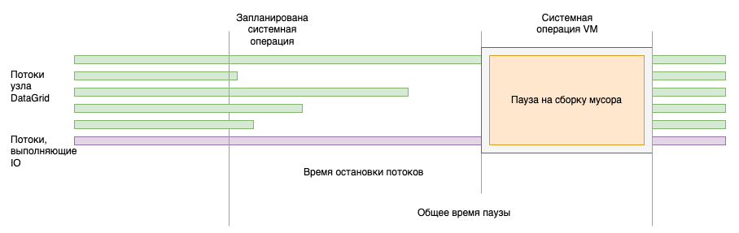
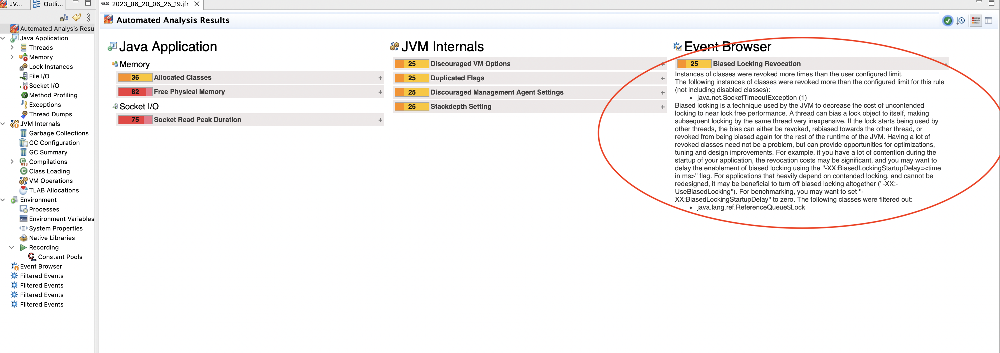

# Настройка производительности

Проблемы с недостаточной производительностью и ее падением в DataGrid могут возникать по описанным ниже причинам.

## Проблемы с аппаратными ресурсами

DataGrid активно нагружает CPU, оперативную память, дисковую подсистему и сеть. Из-за этого сбой или просадка производительности в любом из перечисленных компонентов приведет к падению производительности или аварийному завершению работы узлов DataGrid.

### Выcокая утилизация CPU

Подробнее о CPU написано в подразделе [«Высокая утилизация CPU»](faq.md) раздела «Часто встречающиеся проблемы и пути их устранения».

### Потеря производительности из-за дисковой подсистемы

#### Высокая утилизация дисков

Достаточно распространены сценарии, в которых из-за высокой нагрузки дисковая подсистема перестает справляться с поступающим количеством запросов. Диагностировать такую ситуацию помогают различные средства мониторинга аппаратных ресурсов. Например, если на хосте настроена сборка `nmon`, загруженность дисков поможет определить метрика `DISKBUSY`. Если ее значение приближается к 100%, дисковая подсистема перегружена.

Если нагрузочное тестирование показывает, что диски часто полностью утилизированы, воспользуйтесь одним из вариантов решения проблемы:

- замена дисков на более быстрые;
- добавление узлов в кластер, чтобы нагрузка распределилась по большему количеству узлов;
- корректная настройка Persistance — подробнее о ней написано в разделе [«Настройка Persistence»](../../developer-guide/md/setting_up_persistence.md) документа «Руководство прикладного разработчика».

::::{admonition} Примечание
:class: note

Если в кластере присутствует высокая нагрузка и ведется активная работа с диском, рекомендуется протестировать режим разделения логических и физических записей в WAL. Режим включается в bean `org.apache.ignite.configuration.DataStorageConfiguration` с помощью конфигурации:

:::{code-block} xml
:caption: XML
<property name="writeRecoveryDataOnCheckpoint" value="true"/>
<property name="checkpointRecoveryDataCompression" value="SNAPPY"/>
:::

Свойство `checkpointRecoveryDataCompression` является опциональным. При использовании данного свойства добавьте в `classpath` директорию с библиотеками `ignite-compress` из `libs/optional/`.
::::

#### Деградация дисков

Потеря производительности также возможна из-за деградации дисковой подсистемы. Характерные признаки подобного сценария — высокая утилизация дисков на фоне небольшого количества операций ввода/вывода за единицу времени. В данном случае рекомендуется вывести узел из топологии для замены дисков.

#### Page Replacement (замена страниц)

Page Replacement — вытеснение неиспользуемых страниц из ОЗУ и чтение страниц с нужными данными с диска.

Если размер региона данных превышает объем доступной DataGrid оперативной памяти, рано или поздно запрашиваемые данные перестанут помещаться в память. В этом случае DataGrid будет вытеснять одни данные на диск и читать с него другие данные. Обращение к данным будет занимать более длительное время, чем при чтении из памяти. 

Если тестирование показывает, что с началом Page Replacement производительность кластера упала, воспользуйтесь одним из вариантов:

- Увеличьте объем оперативной памяти на серверных узлах. Это позволит поднять большее количество данных в оперативную память.
- Добавьте серверные узлы в топологию. Это позволит уменьшить количество данных, которые хранятся на каждом узле, и увеличить процент данных, которые можно хранить в памяти.

### Сетевые сбои

Сбои на промежуточном сетевом оборудовании и/или сетевых портах серверных и клиентских узлов могут привести к задержке ответов и потере или нарушению порядка доставки сообщений различных SPI DataGrid. За этим может последовать снижение производительности кластера и нарушение топологии.

В DataGrid есть возможность настроить тайм-ауты, которые влияют на сетевое взаимодействие узлов. Подробнее о них написано в подразделе [«Настройка сети»](../../developer-guide/md/network_setup.md) документа «Руководство прикладного разработчика».

Существует две стратегии настройки сетевых тайм-аутов:

- Первая направлена на сохранение всех узлов в топологии на фоне сетевых сбоев. В этом случае стоит выставлять высокие значения для сетевых тайм-аутов. В результате узлы будут считаться недоступными через больший интервал времени и будет предприниматься больше попыток переподключения. Обратная сторона подхода — возможное падение производительности в некоторых операциях или во всем кластере.
- Вторая стратегия настройки сетевых тайм-аутов — выставлять сравнительно низкие значения, чтобы узел со сбоем раньше обнаружили и вывели из топологии. Так обеспечивается минимальное падение производительности. При такой настройке важно помнить, что чем раньше узел удаляется из тополгии, тем выше вероятность потери или неконсистентности данных.

## Некорректная настройка операционной системы

### Настройка параметров ядра

Для получения максимальной производительности кластера DataGrid в высоконагруженных сценариях нужна дополнительная настройка параметров ядра операционной системы на клиентских и серверных узлах. Подробнее о настройке написано в разделе [«Параметры SYSCTL»](sysctl-parameters.md).

### Отключение Transparent Huge Pages

DataGrid самостоятельно управляет памятью и размером страниц. Transparent Huge Pages (THB) — механизм, который прозрачным для приложения образом динамически организует выделение памяти «огромными» страницами (страницы оперативной памяти, размер которых значительно превышает стандартный). С одной стороны, использование THB вместе с DataGrid избыточно. С другой стороны, использование THB сопровождается накладными расходами, например может спровоцировать высокую утилизацию CPU и длительные JVM-паузы.

На узлах DataGrid включение THB не принесет пользы, но с высокой вероятностью вызовет проблемы с производительностью. Этот механизм следует отключать на серверных и клиентских узлах DataGrid.

Чтобы посмотреть текущую конфигурацию THB, используйте команду:

```bash
cat /sys/kernel/mm/transparent_hugepage/enabled
```

Если вернулось значение `always`, отключите THB:

```bash
echo never > /sys/kernel/mm/transparent_hugepage/enabled
echo never > /sys/kernel/mm/transparent_hugepage/defrag
```

### Многопроцессорные серверные машины, NUMA

NUMA (Non-Uniform Memory Access) — дизайн памяти, при котором у некоторого количества ядер процессора есть быстрый доступ к какой-то части оперативной памяти непосредственно через контроллер. Если для исполнения потоков этой памяти недостаточно, ядра могут получить доступ к другим участкам памяти с помощью шины данных. В первом случае память называется локальной, во втором — удаленной. Доступ к локальной памяти по времени дешевле, чем к удаленной (выгода зависит от конкретной реализации и сценариев эксплуатации, может достигать 40%).

Совокупность ядер и их локальной памяти называют NUMA-узлом.

Увеличение производительности можно ожидать на многопроцессорных машинах с большим объемом оперативной памяти.

#### NUMA-aware выделение памяти в основном регионе DataGrid

Задача оптимизации программного обеспечения с учетом архитектуры NUMA (NUMA-aware) — по возможности разместить на одном NUMA-узле потоки и данные, которыми они оперируют. Если требуется аллоцировать участок памяти, который превышает объем памяти одного NUMA-узла, страницы такого участка стоит равномерно размещать по всем NUMA-узлам.

Поддержка NUMA реализована в DataGrid для аллокации памяти регионов данных. Перед включением поддержки NUMA в DataGrid:

1. Убедитесь, что использование NUMA не отключено в конфигурации загрузчика. В файле `/etc/default/grub` в строке `GRUB_CMDLINE_LINUX` не должно быть инструкции `numa=off`.
2. Убедитесь, что на сервере установлена библиотека `libnuma-2.0.x`.
3. Убедитесь, что на сервере установлен и запущен `numactl`.
4. Выберите стратегию аллокации и настройте регионы данных в соответствии с ней.

Поддержка NUMA в Linux реализована с помощью библиотеки `libnuma`. Ниже описаны стратегии аллокации, которые позволяет реализовать API `libnuma`.

**Простая (simple) аллокация:**

1. Выделение памяти для процесса/потока согласно NUMA-политике по умолчанию. Использует  `void *numa_alloc(size_t)`.

   :::{code-block} xml
   :caption: XML
   <property name="dataStorageConfiguration">
       <bean class="org.apache.ignite.configuration.DataStorageConfiguration">
           <property name="defaultDataRegionConfiguration">
               <bean class="org.apache.ignite.configuration.DataRegionConfiguration">
                   <property name="name" value="Default_Region"/>
                   ....
                   <property name="memoryAllocator">
                       <bean class="org.apache.ignite.mem.NumaAllocator">
                           <constructor-arg>
                               <bean class="org.apache.ignite.mem.SimpleNumaAllocationStrategy"/>
                           </constructor-arg>
                       </bean>
                   </property>
               </bean>
           </property>
       </bean>
   </property>
   :::

2. Выделение памяти на указанном NUMA-узле. Использует `void *numa_alloc_onnode(size_t, int)`.

   :::{code-block} xml
   :caption: XML
   <property name="dataStorageConfiguration">
       <bean class="org.apache.ignite.configuration.DataStorageConfiguration">
           <property name="defaultDataRegionConfiguration">
               <bean class="org.apache.ignite.configuration.DataRegionConfiguration">
                   <property name="name" value="Default_Region"/>
                   ....
                   <property name="memoryAllocator">
                       <bean class="org.apache.ignite.mem.NumaAllocator">
                           <constructor-arg>
                               <bean class="org.apache.ignite.mem.SimpleNumaAllocationStrategy">
                                   <constructor-arg name="node" value="0"/>
                               </bean>
                           </constructor-arg>
                       </bean>
                   </property>
               </bean>
           </property>
       </bean>
   </property>
   :::

**Чередующаяся (interleaved) аллокация:**

1. Чередующееся распределение на всех NUMA-узлах. Использует `void *numa_alloc_interleaved(size_t)`.

   :::{code-block} xml
   :caption: XML
   <property name="dataStorageConfiguration">
       <bean class="org.apache.ignite.configuration.DataStorageConfiguration">
           <property name="defaultDataRegionConfiguration">
               <bean class="org.apache.ignite.configuration.DataRegionConfiguration">
                   <property name="name" value="Default_Region"/>
                   ....
                   <property name="memoryAllocator">
                       <bean class="org.apache.ignite.mem.NumaAllocator">
                           <constructor-arg>
                               <bean class="org.apache.ignite.mem.InterleavedNumaAllocationStrategy"/>
                           </constructor-arg>
                       </bean>
                   </property>
               </bean>
           </property>
       </bean>
   </property>
   :::

2. Чередующееся распределение на указанных NUMA-узлах. Использует `void *numa_alloc_interleaved_subset(size_t, struct bitmask*)`.

   :::{code-block} xml
   :caption: XML
   <property name="dataStorageConfiguration">
       <bean class="org.apache.ignite.configuration.DataStorageConfiguration">
           <property name="defaultDataRegionConfiguration">
               <bean class="org.apache.ignite.configuration.DataRegionConfiguration">
                   <property name="name" value="Default_Region"/>
                   ....
                   <property name="memoryAllocator">
                       <bean class="org.apache.ignite.mem.NumaAllocator">
                           <constructor-arg>
                               <bean class="org.apache.ignite.mem.InterleavedNumaAllocationStrategy">
                                   <constructor-arg name="nodes">
                                       <array>
                                           <value>0</value>
                                           <value>1</value>
                                       </array>
                                   </constructor-arg>
                               </bean>
                           </constructor-arg>
                       </bean>
                   </property>
               </bean>
           </property>
       </bean>
   </property>
   :::

**Аллокация на локальном узле (local node allocation):**

Выделение памяти на локальном для процесса NUMA-узле. Использует `void* numa_alloc_onnode(size_t)`.

:::{code-block} xml
:caption: XML
<property name="dataStorageConfiguration">
    <bean class="org.apache.ignite.configuration.DataStorageConfiguration">
        <property name="defaultDataRegionConfiguration">
            <bean class="org.apache.ignite.configuration.DataRegionConfiguration">
                <property name="name" value="Default_Region"/>
                ....
                <property name="memoryAllocator">
                    <bean class="org.apache.ignite.mem.NumaAllocator">
                        <constructor-arg>
                            <constructor-arg>
                                <bean class="org.apache.ignite.mem.LocalNumaAllocationStrategy"/>
                            </constructor-arg>
                        </constructor-arg>
                    </bean>
                </property>
            </bean>
        </property>
    </bean>
</property>
:::

В большей части сценариев оптимальным выбором будет стратегия чередующейся аллокации на всех NUMA-узлах (interleaved allocation on all NUMA nodes). С ней все страницы региона данных будут равномерно распределены между всеми NUMA-узлами.

#### NUMA-оптимизация для heap в G1 GC

На Java версии 8 и новее можно включить NUMA-оптимизацию для сборщика мусора G1 (подробнее о его настройке написано ниже в разделе [«Сборка мусора (GC)»](#сборка-мусора-gc)). Лучшие результаты эта оптимизация показывает на Java версии 14 и новее. Это связано с тем, что для версий ниже 14 реализована только чередующаяся аллокация heap.

В Java версии 14 и новее реализована поддержка NUMA-aware. Heap разделяется на сегменты, которые аллоцируются на NUMA-узлы. На этих же узлах работают потоки приложения или серверного узла DataGrid (мутаторы, mutators), которые связаны с сегментами.

Чтобы включить NUMA для G1, добавьте JVM-опцию `-XX:+UseNUMA`.

## Задержки в виртуальной машине Java (JVM)

Настройка продукта для сценариев с низкими задержками (low-latency) отличается от настроек для повышения пропускной способности. Не существует единых настроек продукта и виртуальной машины Java (JVM) под все проекты. Конечный набор опций, который подходит для конкретного проекта, определяется во время нагрузочного тестирования.

Для ряда продуктов требуется обеспечивать низкие задержки в ответах пользователям и снижать время пауз. Их могут вызвать:

- задержки в работе оборудования и паузы в работе виртуальной машины;
- длительные сборки мусора JVM (GC);
- накопление данных для постоянного хранилища (Peristence), с которыми не справляется дисковая подсистема.

Определить наличие пауз в работе DataGrid можно с помощью мониторинга и в журналах. Если в работе JVM есть задержки, в log-файле `ignite.log` будут присутствовать сообщения `Possible too long JVM pause`. Ниже описаны JVM-опции, которые могут влиять на паузы в работе машины и помогут обнаружить проблемы с оборудованием.

### Структура пауз

Для выполнения операции GC или другой системной операции виртуальной машине нужно остановить все потоки приложения.



Для отладки и определения причины слишком долгой JVM-паузы обязательно нужно включить опции записи журналов сборщика мусора, а также опции:

- `-XX:+PrintGCApplicationStoppedTime` — выдает время приостановки для всех пауз (остановка в safepoint + общее время пауз);
- `–XX:+PrintSafepointStatistics` и `-XX:PrintSafepointStatisticsCount=1` — после каждого safepoint будет сообщаться время и причина.

Если опции установлены корректно, в журнале сборщика мусора `gc-safepoint` будут присутствовать сообщения вида:

```text
Total time for which application threads were stopped: 0.2019948 seconds, Stopping threads took: 0.0004585 seconds
```

Первое значение показывает, сколько всего секунд ушло на паузу: остановку потоков и саму операцию. Второе значение показывает, в течение какого времени JVM пыталась их остановить.

Если остановка потоков произошла быстро (как в примере выше), но общее время паузы значительное — проверьте, что происходило в момент паузы. Скорее всего, происходила сборка мусора (GC). Ее настройка описана в следующем разделе.

Пример другого поведения — пауза, которую вызвала не сборка мусора:

```text
Total time for which application threads were stopped: 2.6714757 seconds, Stopping threads took: 2.6679943 seconds
```

В данном примере 2 секунды потребовалось на остановку потоков в безопасном состоянии, а на саму операцию было потрачено меньше 0,01 секунды. В примере время остановки и паузы одинаковое — это означает, что полезной работы GC не совершал и все затраченное время потоки пытались попасть в точку остановки (safepoint). Разбор данного примера есть ниже в разделе [«Долгая остановка потоков»](#долгая-остановка-потоков).

### Сборка мусора (GC)

В данном разделе описываются некоторые опции, которые помогут снизить задержки в работе сборщика мусора (GC). Для DataGrid рекомендуется использовать сборщик G1 (устанавливается по умолчанию с Java версии 11 и новее).

#### Размер heap

Перед тонкой настройкой GC проверьте, что объем heap подходит данному проекту. Если объем памяти слишком маленький, у сборщика мусора не будет достаточного запаса для управления памятью — это приведет к паузам. Если объем памяти слишком большой, могут возникнуть паузы из-за накопления слишком большого объема неосвобожденных объектов.

Продукт использует heap JVM для хранения:

- всех незавершенных транзакций от всех клиентов платформы;
- результатов SQL-запросов (result set) в размере страницы или в полном объеме (если отключен флаг `lazy` или в запросе присутствует сортировка).

Перед нагрузочным тестированием для выбора первых значений опции `-Xmx` можно оценить объем heap на каждом узле как:

```text
count*size*concurrency/nodes
```

Гдe:

- `count` — количество записей в результате выполнения запроса;
- `size` — максимальный размер записи;
- `concurrency` — максимальное количество параллельных клиентов;
- `nodes` — количество узлов.

Данная оценка является примерной. Обычно размер heap выбирают меньше 32 Гб, так как в этом случае HotSpot JVM более компактно хранит данные в памяти (за счет размера указателя).

#### Уменьшение размера young-поколения

В некоторых случаях (обычно при большом heap) может потребоваться уменьшить размер young-поколения. Признаки, что размер young-поколения стоит уменьшить:

1. Наблюдаются длительные сборки мусора (GC-паузы), среди которых подавляющее большинство являются young-паузами (в GC-log — Pause Young (Normal) (G1 Evacuation Pause)).
2. Большую часть пауз составляет фаза Object copy (подробнее о ней написано ниже в разделе [«Длительность Object copy»](#длительность-object-copy)).

Размер young-поколения задается в пределах процентных значений, которые задаются параметрами `-XX:G1NewSizePercent=n` (по умолчанию 5) и `-XX:G1MaxNewSizePercent=m` (по умолчанию 60).

При неинтенсивных нагрузках может помочь уменьшение минимального размера young-поколения с 5% до 1–3%. Если heap достаточно часто и интенсивно наполняется, это может привести к его заполнению на 60% и более и к увеличению времени сборки мусора. В таких случаях стоит уменьшить максимальный размер young-поколения. Точных рекомендаций нет, следует исходить из интенсивности заполнения young-поколения и скорости очистки сборщиком мусора.

#### Пример вычисления размера young-поколения

:::{admonition} Внимание
:class: danger

Данный пример носит исключительно иллюстрационный характер и позволяет грубо оценить максимальный размер young-поколения. От этого значения можно отталкиваться на фазе нагрузочного тестирования (НТ). Даже если размер young-поколения подобран точно, периодически из-за внутренних механизмов JVM возможны более длительные паузы, чем ожидалось. Данный момент требует тщательного тестирования.
:::

**Исходные данные:**

- 30 Гб — размер heap.
- 15 Гб — средний размер young-поколения при долгих паузах. О том, как определить размер для единичной паузы, написано в следующем разделе.
- 1,5 с — средняя длительность максимального времени фазы Object copy во время долгих пауз. О том, как определить длительность для единичной паузы, написано ниже в разделе [«Длительность Object copy»](#длительность-object-copy).
- 50 мс — желаемый максимальный размер паузы.

**Вычисление:**

1. 15 / 1,5 = 10 Гб/с — средняя скорость очистки heap.
2. 0,05 с * 10 Гб/с = 0,5 Гб — целевой максимальный размер young-поколения.
3. 0,5 Гб / 30 Гб * 100% = 1,67% — целевой максимальный размер young-поколения (в процентах от максимального размера heap).


**Результат и выводы:**

- `-XX:G1MaxNewSizePercent=2` (округление 1,67% в большую сторону);
- `-XX:G1NewSizePercent=1` (должен быть меньше `G1MaxNewSizePercent`, который в данном случае равен 2).

Если для продукта достаточно таких размеров young-поколения, при постоянно пустом old-поколении размер heap 30 Гб избыточен.

:::{admonition} Важно
:class: attention

Обратите внимание:

1. Все ли паузы длинные? Часто бывает, что длинными являются только единичные паузы (остальные в пределах нормы). В этом случае нужно уменьшить только размер длинных пауз и при вычислении опираться на их средние значения. Если в целом все паузы достаточно длинные, можно выбрать среднее значение пауз в целом.
2. Долгая фаза только Object copy? Если фаза Object copy не составляет большую часть паузы, проблема длительных пауз скорее всего не связана с размером young-поколения.
:::

#### Определение размера young-поколения из GC-log

До и после каждой паузы выводится статистика размеров областей young-поколения:

```bash
GC(25)   region size 8192K, 2380 young (19496960K), 8 survivors (65536K)
...
GC(25)   region size 8192K, 7 young (57344K), 7 survivors (57344K)
```

Размер young-поколения, который был очищен:

```text
19496960K - 57344K = 19439616К = 18,54 Гб
```

#### Длительность Object copy

```bash
GC(7)     Object Copy (ms):         Min:  9.3, Avg: 43.1, Max: 193.5, Diff: 184.2, Sum: 4866.5, Workers: 113
...
GC(7) User=5.08s Sys=1.49s Real=0.23s
```

Ориентироваться следует на значение `Max: 193.5` мс для Object copy. Оно составляет большую часть паузы `Real=0.23s`.

#### Длительность GC Worker Other

При длительной GC-паузе обратите внимание на GC Worker Other — время для каждого GC-потока, которое нельзя отнести к ранее перечисленным фазам в GC-log (время, которое рабочий поток провел вне GC). Оно должно быть достаточно низким. Высокие значения связаны с узкими местами в других частях JVM, например активность JVM, которая приводит к остановке GC-потока. Эта часть времени не тратится на сборку мусора, но записывается как часть log-файла.

GC Worker Total — сводные данные по GC включают в себя общее время выполнения GC и время на GC Worker Other.

При наличии высоких значений GC Worker Other стоит обратиться в поддержку JVM и к специалистам Linux.

```bash
GC(20086) GC Worker Other (ms): Min: 1120.0, Avg: 28525.1, Max: 38447.5, Diff: 37327.5, Sum: 1083955.5, Workers: 38
GC(20086) GC Worker Total (ms): Min: 2237.2, Avg: 29642.4, Max: 39564.6, Diff: 37327.4, Sum: 1126410.7, Workers: 38
...
GC(20086) User=1.07s Sys=2.01s Real=184.24s
```

### Parallel threads

Опция регулирует количество параллельных сборщиков мусора.

В некоторых ситуациях (например, когда логических ядер процессора больше 100) возможны длительные GC-паузы из-за долгой синхронизации множества потоков между собой во время сборок мусора. В этом случае уменьшение количества потоков может снизить GC-паузы. Число сборщиков задается JVM-опцией:

```bash
-XX:ParallelGCThreads=n
```

Значение по умолчанию приблизительно равно 5/8 от количества логических процессоров. Если при данном значении есть подозрение на избыточность числа сборщиков, можно подбирать их количество из следующего ряда в порядке убывания: 1/2, 3/8, 1/4 от числа логических процессоров.

#### Пример

Одна из ситуаций, когда могут возникнуть проблемы с завышенным количеством потоков — высокая продолжительность фазы Termination при низкой длительности остальных фаз, в том числе Оbject copy (подробнее написано в строке log-файла ниже). В первую очередь стоит убедиться, что проблема не в операционной системе и аппаратной части. Если с ними проблем нет, можно снизить количество потоков.

Пример статистики для двух фаз: Object copy и Termination. Основной показатель — `Max`, так как в итоге фазы будут ждать самый «медленный» поток:

```bash
GC(25)     Object Copy (ms):         Min: 175.7, Avg: 194.0, Max: 207.5, Diff: 31.8, Sum: 21920.2, Workers: 113
GC(25)     Termination (ms):         Min: 1008.6, Avg: 1021.1, Max: 1039.5, Diff: 30.9, Sum: 115388.8, Workers: 113
```

### Долгая остановка потоков

Если время паузы в основном тратится не на операцию JVM, а на остановку потоков, дополнительные настройки сборки мусора не принесут прироста производительности.

#### Загрузка оборудования

Невозможность остановить потоки обычно обусловлена высокой нагрузкой на аппаратную часть и операционную систему узла. Часто такие задержки наблюдаются в сценариях с включенным Persistence и связаны с нагрузкой на дисковую подсистему. Если в GC-log появилось значительное время остановки потоков, проанализируйте нагрузку на железо во время появления паузы при помощи мониторинга DataGrid и других средств, например `nmon` (подробнее об отладке и мониторинге написано в следующем разделе).

Если загрузка устройств ввода-вывода близка к 100%, устраните причины перегрузки оборудования. Это необходимо при использовании продукта в сценариях с низкой задержкой.

Общие рекомендации:

- горизонтально масштабировать систему с помощью добавления новых узлов;
- добавить отдельные диски для хранения части данных Persistence (для увеличения пропускной способности каждого серверного узла).

Если выполняются тяжеловесные SQL-запросы или происходит снятие снепшота, для снижения нагрузки на систему их можно выполнять в периоды наименьшей активности кластера.

Если паузы спровоцировало параллельное снятие снепшота, создавайте его без конкурентной нагрузки на кластер. Также установите или снизьте ограничение на скорость записи снепшота. Оно обеспечивается распределенным свойством `snapshotTransferRate` — установите или снизьте для него порог скорости меньше заявленной производителем. Например:

```bash
./control.sh --property set --name snapshotTransferRate --val 1024
```

:::{admonition} Примечание
:class: note

Для снижения загрузки оборудования можно использовать флаг `--only-primary=true`. В таком режиме резервируются только основные (primary) партиции — помимо снижения нагрузки на диски это также позволит увеличить скорость процесса и уменьшить размер резервной копии.

Стоит иметь в виду, что в таком случае восстановление будет приводить к полной ребалансировке. Подробнее о процессе ребалансировки написано в разделе [«Ребалансировка»](../../developer-guide/md/rebalancing.md) документа «Руководство прикладного разработчика».
:::

#### Дополнительная отладка

Для подробной отладки причин проблем с остановкой потоков добавьте необязательные опции:

- `-XX:+SafepointTimeout` — выводит в log-файл информацию о потоках, у которых `time to safepoint` превысило предустановленный тайм-аут;
- `-XX:SafepointTimeoutDelay` — если `time to safepoint` потока превысит данный тайм-аут и используется опция `-XX:+SafepointTimeout`, в log-файл выведется информация о потоках.

Величина `Delay` (в миллисекундах) выбирается в зависимости от SLA/SLO проекта. Рекомендуемое значение — порядка 200–1000 мс.

В случае выставления этой пары опций в консоли приложения (поток `system.out`) добавится список потоков, которые не смогли прийти в safepoint. В список будут включены от одного до нескольких потоков, которые не успели прийти в безопасное состояние за тайм-аут.

:::{admonition} Пример вывода
:class: hint 
:collapsible:

```bash
# SafepointSynchronize::begin: Timeout detected:
# SafepointSynchronize::begin: Timed out while spinning to reach a safepoint.
# SafepointSynchronize::begin: Threads which did not reach the safepoint:
# "kafka-producer-network-thread | producer-reliability-main-sender" #61 daemon prio=5 os_prio=0 cpu=131.89ms elapsed=1568.90s tid=0x00007f8aa4f3f180 nid=0x1ee9e1 runnable  [0x0000000000000000]
   java.lang.Thread.State: RUNNABLE

# SafepointSynchronize::begin: (End of list)
```
:::

Место в коде, который выполняет данный поток (stacktrace), не выводится: получение stacktrace также требует попадания в safepoint.

### Biased Locking

Biased Locking — механизм JVM для оптимизации производительности приложений. По умолчанию включен; в JDK версии 15 и новее выключен.

В DataGrid версии 16.0.0 и выше в роли Biased Locking выключен по умолчанию.

Чтобы отключить механизм, выполните команду:

```bash
-XX:-UseBiasedLocking
```

#### Показания для отключения Biased Locking

Один из признаков необходимости отключить Biased Locking — в log-файле `ignite.log` обнаружены сообщения `Possible too long JVM pause` штатного механизма `LongJVMPauseDetector`.

Пример сообщений в log-файле `ignite.log`:

```text
host0003    YYYY-MM-DD 14:49:04.247 [WARN ] Possible too long JVM pause: 922 milliseconds.
host0006    YYYY-MM-DD 12:43:31.934 [WARN ] Possible too long JVM pause: 943 milliseconds.
host0008    YYYY-MM-DD 13:06:55.858 [WARN ] Possible too long JVM pause: 787 milliseconds.
host0009    YYYY-MM-DD 16:30:02.976 [WARN ] Possible too long JVM pause: 1339 milliseconds.
host0020    YYYY-MM-DD 17:00:10.575 [WARN ] Possible too long JVM pause: 788 milliseconds.
host0022    YYYY-MM-DD 15:01:05.960 [WARN ] Possible too long JVM pause: 1590 milliseconds.
host0023    YYYY-MM-DD 19:12:14.859 [WARN ] Possible too long JVM pause: 1696 milliseconds.
host0024    YYYY-MM-DD 02:24:38.366 [WARN ] Possible too long JVM pause: 1236 milliseconds.
host0026    YYYY-MM-DD 14:20:25.998 [WARN ] Possible too long JVM pause: 887 milliseconds.
host0027    YYYY-MM-DD 16:00:50.630 [WARN ] Possible too long JVM pause: 515 milliseconds.
host0029    YYYY-MM-DD 16:16:14.633 [WARN ] Possible too long JVM pause: 963 milliseconds.
host0052  YYYY-MM-DD 04:24:15.077 [WARN ] Possible too long JVM pause: 648 milliseconds.
host0036    YYYY-MM-DD 16:16:03.847 [WARN ] Possible too long JVM pause: 884 milliseconds.
host0050    YYYY-MM-DD 17:32:29.900 [WARN ] Possible too long JVM pause: 626 milliseconds.
host0065    YYYY-MM-DD 17:32:37.160 [WARN ] Possible too long JVM pause: 576 milliseconds.
host0066    YYYY-MM-DD 02:28:15.263 [WARN ] Possible too long JVM pause: 986 milliseconds.
host0068    YYYY-MM-DD 17:25:23.123 [WARN ] Possible too long JVM pause: 1460 milliseconds.
host0036  YYYY-MM-DD 00:34:47.581 [WARN ] Possible too long JVM pause: 1024 milliseconds.
host0037  YYYY-MM-DD 17:09:23.944 [WARN ] Possible too long JVM pause: 518 milliseconds.
host0048  YYYY-MM-DD 16:54:51.620 [WARN ] Possible too long JVM pause: 611 milliseconds.
host0056    YYYY-MM-DD 17:47:36.148 [WARN ] Possible too long JVM pause: 1000 milliseconds.
host0060    YYYY-MM-DD 13:47:13.650 [WARN ] Possible too long JVM pause: 790 milliseconds.
```

Следующий шаг — выполнить анализ log-файла `safepoint.log`. Например, выявить длительность задержек с помощью утилиты `grep`:

```bash
grep "Total time for which application threads were stopped: " gc-safepoint.log.09 | grep -v "Total time for which application threads were stopped: 0"
```

```bash
grep "Total time for which application threads were stopped: " gc-safepoint.log.09 | grep -v "Total time for which application threads were stopped: 0"
[YYYY-MM-DDT22:18:06.828+0300][75375.228s][safepoint         ] Total time for which application threads were stopped: 1.3670682 seconds, Stopping threads took: 1.3613468 seconds
[YYYY-MM-DDT01:51:06.595+0300][88154.995s][safepoint         ] Total time for which application threads were stopped: 1.1677948 seconds, Stopping threads took: 1.1582852 seconds


grep "Total time for which application threads were stopped: " gc-safepoint.log.45 | grep -v "Total time for which application threads were stopped: 0"
[YYYY-MM-DDT05:12:47.437+0300][1641602.236s][safepoint         ] Total time for which application threads were stopped: 1.0935892 seconds, Stopping threads took: 1.0928619 seconds
[YYYY-MM-DDT05:23:46.012+0300][1642260.811s][safepoint         ] Total time for which application threads were stopped: 1.4442415 seconds, Stopping threads took: 1.4393118 seconds
```

Проверьте, является ли включенный Biased Locking причиной длительных safepoint, с помощью анализа JFR:



На изображении выше показано, что Java Mission Control (JMC) определил проблему **Event Browser** — **Biased Locking Revocation** — и вывел отчет на страницу **Automated Analysis Results**. Automated Analysis — автоматический анализ, который выполняется в JMC для всех JFR. В случае обнаружения подобных ошибок рекомендуется отключить Biased Locking.

В некоторых сценариях для повышения производительности стоит рассмотреть вариант использования сборщика мусора Shenandoah. Подробнее о нем написано ниже в разделе [Shenandoah GC](#shenandoah-gc).

### Adaptive IHOP и heap большого размера

IHOP (Initiating Heap Occupancy Percent или начальное заполнение heap) — порог, при превышении которого запускается параллельная сборка мусора. Настройка задается в процентах от величины old-поколения. Сборщик G1 по умолчанию автоматически вычисляет оптимальную величину IHOP. G1 опирается на то, сколько времени занимает стадия пометки объектов (Marking Phase) и сколько памяти во время нее обычно занято в old-поколении. Такая функция называется Adaptive IHOP. Когда она активирована, опция `-XX:InitiatingHeapOccupancyPercent` задает только изначальный размер IHOP, когда сборщик еще не собрал достаточно статистической информации для самостоятельного расчета данной величины.

Отключить такое поведение можно с помощью флага `-XX:-G1UseAdaptiveIHOP`. В этом случае IHOP всегда будет задавать флаг `-XX:InitiatingHeapOccupancyPercent`.

На сравнительно больших размерах heap (десятки Гб) Adaptive IHOP срабатывает таким образом: после нескольких достаточно коротких сборок мусора следует тяжелая длинная сборка, которая в разы превышает предыдущие. Такое поведение GC может негативно сказаться на производительности и целостности кластера DataGrid. Если отключить Adaptive IHOP для больших heap и задать достаточно низкое значение для `-XX:InitiatingHeapOccupancyPercent` (35% и ниже), сборки будут более частыми, но при этом более короткими.

### Shenandoah GC

#### Краткое описание

Shenandoah — новый GC, который выпустили как часть JDK 12. Он сокращает GC-паузы за счет выполнения как можно большего количества работы по сборке мусора в параллельном режиме, то есть одновременно с работой основных потоков приложения. В основе инноваций Shenandoah лежит его региональное управление памятью. Heap стратегически разделен на регионы, что позволяет независимо вести сборку мусора в сегментах. Это не только способствует эффективному параллелизму, но и обеспечивает низкие задержки (low latency) при работе приложения.

#### Отличия от G1

Ключевое преимущество Shenandoah перед G1: большая часть цикла сборки мусора выполняется одновременно с потоками приложений. G1 может эвакуировать области heap только во время остановки приложения, а Shenandoah перемещает объекты одновременно с ним.

Shenandoah может очищать мусор и освобождать оперативную память почти сразу после обнаружения свободной памяти. Поскольку это происходит без остановки работы приложения, Shenandoah более интенсивно нагружает процессор. Также Shenandoah  выполняет одновременное уплотнение (concurrent compaction): время паузы больше не пропорционально размеру heap.

#### Когда использовать

Стоит рассматреть возможность использования Shenandoah GC для приложения, если есть следующие требования:

- **Low-Latency решения**. Shenandoah GC подходит для приложений, которые требуют неизменно низкого времени паузы для поддержания оптимального пользовательского опыта. Это включает сценарии финансовых систем, игровых онлайн-платформ и приложений в реальном времени.
- **Большие размеры heap**. В приложениях со значительным потреблением памяти Shenandoah GC минимизирует время паузы во время сборки мусора. Примеры таких приложений: системы обработки больших данных, базы данных в памяти (IMDB) и системы корпоративного уровня с обширными наборами данных.
- **Предсказуемое время отклика**. Shenandoah GC подходит в ситуациях, когда непредсказуемые и длительные паузы неприемлемы и поддержание предсказуемого времени отклика имеет решающее значение. Это особенно актуально для интерактивных веб-приложений, где взаимодействие пользователей должно привести к немедленным ответам.
- **Динамические рабочие нагрузки**. Shenandoah GC подходит для приложений, которые испытывают колеблющиеся рабочие нагрузки. Shenandoah GC адаптируется к динамическим требованиям сбора мусора. Это включает масштабируемые веб-сервисы и приложения с различной активностью пользователя в течение дня.

#### Как использовать

 Базовые функции Shenandoah (сам сборщик мусора и эвристики) доступны в OpenJDK версии 11.0.9 и новее. Также можно использовать коммерческие дистрибутивы JDK, например Open JDK или ascistopenjdk.

 Перед началом настройки убедитесь, что версия Java поддерживает Shenandoah GC. Для этого используйте команду `java -XX:+PrintFlagsFinal | grep Shenandoah`. В выводе должен появиться список команд по Shenandoah, которые поддерживает OpenJDK.

#### Настройки Shenandoah

:::{flat-table} JVM-опции для настройки Shenandoah GC
:header-rows: 1

+  * Вид настройки
   * JVM-опция
   * Описание

+  * Включение Shenandoah GC
   * `-XX:+UseShenandoahGC`
   * — 

+  * {rspan}`3` Эвристики.

     Эвристика — модель поведенеия.
     
     Shenandoah использует различные эвристики для оптимизации стратегии управления памятью. Эти эвристики помогают адаптировать сборку мусора к текущей рабочей нагрузке приложения, обеспечивая эффективное использование ресурсов
   * `-XX:ShenandoahGCHeuristics=adaptive`
   * **Adaptive (адаптивная эвристика)** автоматически настраивает параметры сборки мусора в зависимости от текущей нагрузки и состояния heap. Подходит для приложений с изменяющимися рабочими нагрузками, выбрана по умолчанию.

     Shenandoah автоматически адаптируется к нагрузке и применяет соответствующие настройки. Это позволяет поддерживать баланс между временем пауз и эффективностью использования ресурсов
+  * `-XX:ShenandoahGCHeuristics=static`
   * **Static (статическая эвристика)** фиксирует поведение сборщика мусора и используется в системах с предсказуемыми и стабильными нагрузками. Подходит для приложений с малой вариативностью в работе.

     Использование этой эвристики позволяет Shenandoah соблюдать строгие лимиты на паузы. Это особенно полезно в системах реального времени (real-time), где любые отклонения от заданного поведения нежелательны
+  * `-XX:ShenandoahGCHeuristics=compact`
   * **Compact (уплотнение)** делает акцент на минимизации фрагментации памяти, сжимая heap при низком уровне использования памяти. Подходит для приложений с низким потреблением памяти, где важна компактность данных в heap
+  * `-XX:ShenandoahGCHeuristics=aggressive`
   * **Aggressive (агрессивная эвристика)** активно собирает мусор, даже если загрузка системы и использование памяти относительно низкие. Подходит для систем с высокими требованиями к минимизации пауз, которые при этом готовы к увеличению нагрузки на процессор.

     Эта настройка полезна для минимизации времени ответа в критических системах, например финансовых приложениях или системах реального времени

+  * {rspan}`2` Расширенные настройки Shenandoah.

     Описанные настройки доступны для OpenJDK версии 12 и новее
   * `-XX:ShenandoahHeapCriticalPercent`
   * Задает процент заполнения heap, при достижении которого начнется эвакуация объектов. Опция помогает предотвратить переполнение памяти и избежать критических пауз, вызванных недостатком свободной памяти:
   
     - Значение 70%:

       ```bash
       -XX:ShenandoahHeapCriticalPercent=70
       ```

       При установке данного порога ниже стандартного значения (обычно 85%) система получает больше времени для эвакуации объектов. Это может снизить вероятность критических пауз при высоких нагрузках, но также может увеличить частоту мелких эвакуаций — это увеличивает нагрузку на процессор.

     - Значение 90%:

       ```bash
       -XX:ShenandoahHeapCriticalPercent=90
       ```

       Увеличение порога приводит к тому, что эвакуация будет происходить реже, но с большим объемом работы. Это может привести к большим паузам в критические моменты, особенно в приложениях с большой памятью (heap больше 8 Гб)
+  * `-XX:ShenandoahMaxEvacuationPauseMillis`
   * Задает максимально допустимое время эвакуационной паузы. Чем ниже это значение, тем более агрессивно будет работать Shenandoah, чтобы минимизировать паузы. Это может увеличить нагрузку на процессор и повлиять на общую производительность.

     - Значение 10 мс:

       ```bash
       -XX:ShenandoahMaxEvacuationPauseMillis=10
       ```

       Значение минимизирует паузы сборки мусора до 10 мс. Подходит для приложений с высокими требованиями к задержкам (low latency), например системам реального времени или финансовым системам. Подобная настройка увеличит частоту эвакуаций — это может привести к повышенному использованию процессора.

     - Значение 50 мс:

       ```bash
       -XX:ShenandoahMaxEvacuationPauseMillis=50
       ```

       Более высокое значение увеличивает допустимое время пауз, что позволяет снизить нагрузку на процессор за счет менее частых эвакуаций. При этом задержки могут быть ощутимыми для некоторых категорий пользователей
+  * `-XX:ShenandoahInitFreeThreshold`
   * Определяет, какой процент памяти в heap должен оставаться свободным до начала сборки мусора. Опция помогает управлять темпом роста heap и предотвращает частые эвакуации.

     - Значение 30%:

       ```bash
       -XX:ShenandoahInitFreeThreshold=30
       ```

       Если установить значение 30%, JVM сможет дольше откладывать эвакуацию объектов, что уменьшает нагрузку на процессор. Однако это может привести к увеличению времени пауз, если heap резко заполнится.

     - Значение 50%:

       ```bash
       -XX:ShenandoahInitFreeThreshold=50
       ```

       Значение подходит для более интенсивного управления памятью, при котором сборка мусора начинается раньше. Это позволяет уменьшить длительность пауз за счет более частых эвакуаций. Такое значение может быть полезно в сценариях, где стабильная производительность более важна, чем максимальная эффективность использования памяти

+  * {rspan}`3` Рекомендуемые дополнительные JVM-опции.
   
     Перечисленные настройки могут улучшить производительность Shenandoah в зависимости от специфики приложения
    * `-XX:+AlwaysPreTouch`
    * Гарантирует, что JVM при запуске сразу выделяет физическую, а не виртуальную память. Это снижает задержки во время работы приложения, но может увеличить время запуска
+   * `-Xms` и `-Xmx`
    * Начальный и максимальный размер heap. Чтобы обеспечить стабильное использование памяти и избежать дополнительных задержек, рекомендуется установить одинаковые значения для обоих параметров
+   * `-XX:-UseBiasedLocking`
    * Отключает механизм привязанных блокировок (Biased Locking), который неэффективен для приложений с высокими требованиями к низкой задержке. Отключение уменьшает задержки, связанные с синхронизацией
+   * `-XX:+DisableExplicitGC`
    * Предотвращает вызов явной сборки мусора через `System.gc()`. Эта опция защищает от чрезмерных вызовов GC, которые могут быть добавлены в код вручную и вызывать ненужные паузы
:::

## Неоптимальная настройка DataGrid

### Общие рекомендации

Список общих рекомендаций по настройке DataGrid:

- Развертывайте и тестируйте кластер не с одним, а с несколькими узлами. DataGrid разработан и оптимизирован для сценариев распределенных вычислений. Например, на приближенной к целевой конфигурации при тестировании кластера с одним узлом сеть будет исключена из работы. Работа кластера чувствительна к работе сети. Чем ближе тестируемая конфигурация к целевой, тем более релевантными и показательными будут результаты.
- Выделите узлу базы данных необходимое количество доступных на локальном компьютере ресурсов центрального процессора (ЦП) и ОЗУ. Количество ресурсов, которые требуются для работы, определяется с помощью нагрузочного тестирования (НТ).
- Если DataGrid развернут в виртуальной или облачной среде, оптимальной конфигурацией будет размещение одного узла DataGrid на одном хосте. Так DataGrid не будет конкурировать за ресурсы хоста с другими приложениями, это не вызовет скачков производительности кластера и позволит обеспечить высокую доступность. Выход хоста из строя может привести к потере данных, если к нему прикреплено более одного серверного узла DataGrid.
- По возможности храните весь набор данных в ОЗУ и предварительно скорректируйте модель данных и существующие приложения. Архитектура DataGrid прежде всего ориентируется на хранение данных в памяти, хотя может хранить данные и работать с ними на диске.
- На этапе проектирования данных учитывайте особенности решения. Продумайте, как правильно распределить данные с учетом возможностей совместного размещения (colocation). Чем больше данных кешируется в ОЗУ, тем выше производительность, поэтому важно правильно сконфигурировать и настроить память.
- При включенном Native Persistence используйте характерные для режима методы оптимизации. Подробнее об этом написано в разделе [«Настройка Persistence»](../../developer-guide/md/setting_up_persistence.md) документа «Руководство прикладного разработчика».
- При работе с SQL оптимизируйте SQL-запросы. Подробнее об этом написано в следующем разделе.
- Используйте настройки ребалансировки для минимизации времени переноса данных между узлами при изменении топологии кластера.

### Настройка производительности SQL

Ниже указаны рекомендации при работе с SQL-запросами.

#### Анализируйте план запросов

Для поиска возможностей по оптимизации SQL-запросов изучите план запроса с помощью оператора `EXPLAIN`. Последняя строка вывода содержит информацию о `REDUCE`-запросе, остальные строки — о `MAP`-запросах.

::::{admonition} Пример 1
:class: hint

:::{code-block} sql
:caption: SQL
EXPLAIN SELECT * FROM City;
+-------------------------------------------------------------------------------------------+
|                                           PLAN                                            |
+-------------------------------------------------------------------------------------------+
| SELECT
    CITY.ID,
    CITY.NAME
FROM PUBLIC.CITY
    /* PUBLIC."IDX_CITY_NAME_proxy" */ |
+-------------------------------------------------------------------------------------------+
:::
::::

::::{admonition} Пример 2
:class: hint

:::{code-block} sql
:caption: SQL
EXPLAIN SELECT p.name, c.name FROM Person p, City c WHERE p.city_id = c.id;
+-----------------------------------------------------------------------------------------------------+
|                                           PLAN                                                                          |
+-----------------------------------------------------------------------------------------------------+
| SELECT
    P__Z0.NAME AS __C0_0,
    C__Z1.NAME AS __C0_1
FROM PUBLIC.PERSON P__Z0
    /* PUBLIC.PE |
| SELECT
    __C0_0 AS NAME,
    __C0_1
FROM PUBLIC.__T0
    /* PUBLIC."merge_scan" */                |
+-----------------------------------------------------------------------------------------------------+
:::
::::

#### Не устанавливайте лишние индексы на поля

В DataGrid есть полная поддержка индексов. Найдите комбинацию индексов, которая обеспечит наилучшую производительность.

Не индексируйте каждое поле в таблице — это увеличивает объем используемой памяти.

Используйте план запросов для анализа используемых индексов и не устанавливайте индексы на неиспользуемые поля.

#### Используйте групповые индексы

Групповые индексы (индексы с несколькими полями) могут ускорить запросы со сложными условиями. Чтобы добавить групповые индексы, используйте аннотацию `@QuerySqlField.Group`.

#### Отрегулируйте размер страницы

Выбранный размер страницы может повлиять на производительность базы данных. При выборе размера страницы дополнительно протестируйте производительность вместе с другими аспектами поведения.

#### Внимательно используйте оператор OR

Логика применения индекса может меняться при использовании в запросе оператора `OR`.

В примере индекс для `gender` будет использоваться вместо индекса для `age`:

:::{code-block} sql
:caption: SQL
SELECT name FROM Person WHERE gender='M' and (age = 20 or age = 30)
:::

Решение — разделить запрос на части и использовать оператор `UNION ALL`:

:::{code-block} sql
:caption: SQL
SELECT name FROM Person WHERE gender='M' and age = 20
UNION ALL
SELECT name FROM Person WHERE gender='M' and age = 30
:::

:::{admonition} Внимание
:class: danger

Использование оператора `UNION` без `ALL` вернет `DISTINCT` строки. Это изменит семантику SQL-запроса и снизит его производительность.
:::

#### Не используйте слишком много колонок в запросе SELECT

Запросы со 100 и более колонками могут работать хуже ожидаемого. Это ограничение парсера запросов H2.

#### Используйте colocated для запросов с группировкой

Если данные коллоцированы по правилу (по полям) группировки, используйте `colocated` для запросов с группировкой.

При группировке запрашиваемых данных через `GROUP BY` используйте `SqlFieldsQuery.collocated = true`, чтобы механизм SQL выполнил группировку на удаленных узлах. Это уменьшит сетевой трафик между узлами и время выполнения запросов.

Сравним два примера.

::::{admonition} Пример 1
:class: hint

Данные размещены по affinity-ключу `department_id`.

:::{code-block} sql
:caption: SQL
SELECT SUM(salary) FROM Employee GROUP BY department_id
:::
::::

DataGrid суммирует зарплаты сотрудников по элементам, которые хранятся на отдельных узлах, и отправляет эти суммы на удаленный узел для окончательного результата. Эта операция уже распределена, включение флага `colocated` незначительно повысит производительность.

::::{admonition} Пример 2
:class: hint

:::{code-block} sql
:caption: SQL
SELECT AVG(salary) FROM Employee GROUP BY department_id
:::
::::

DataGrid вычислит средние значения для каждого отдела на разных узлах и отправит данные на удаленный узел для расчета финального результата. Установка `SqlFieldsQuery.collocated = true` сократит время выполнения запроса.

#### Используйте тип TIMESTAMP вместо DATE

Тип `DATE` неэффективно сериализуется и десериализуется. Это приводит к снижению производительности.

#### Порядок выполнения JOIN

Если установлен флаг `SqlFieldsQuery.setEnforceJoinOrder(true)`, оптимизатор запросов не будет менять порядок таблиц в соединениях. Порядок, в котором применяются объединения во время выполнения запроса, будет таким же, как указано в запросе.

Без этого флага оптимизатор запросов может изменить порядок соединений для повышения производительности. Иногда он может принять неверное решение. Флаг помогает контролировать и явно указывать порядок соединений, не полагаясь на оптимизатор.

::::{admonition} Пример
:class: hint

:::{code-block} sql
:caption: SQL
SELECT * FROM Person p
JOIN Company c ON p.company = c.name where p.name = 'John Doe'
AND p.age > 20
AND p.id > 5000
AND p.id < 100000
AND c.name NOT LIKE 'O%';
:::
::::

Оператор `JOIN` соединяет результаты запроса из двух таблиц: Person и Company. Для улучшения производительности стоит понимать, какой подзапрос вернет наименьший набор результатов. Таблицу с наименьшим набором результатов нужно указывать первой в паре соединения.

**Запрос 1:**

:::{code-block} sql
:caption: SQL
SELECT count
FROM Person p
WHERE
p.name = 'John Doe'
AND p.age > 20
AND p.id > 5000
AND p.id < 100000;
:::

**Запрос 2:**

:::{code-block} sql
:caption: SQL
SELECT count
FROM Company c
where
c.name NOT LIKE 'O%';
:::

Первый запрос дает 30 000 записей, а второй — 100 000 записей, поэтому менять порядок записей не нужно. Следовательно, не нужно менять порядок в запросе.

#### Параллелизм запросов

По умолчанию SQL-запрос выполняется в одном потоке на каждом участвующем узле. Этот подход оптимален для запросов, которые возвращают небольшие наборы результатов, включающих поиск по индексу, например:

:::{code-block} sql
:caption: SQL
SELECT * FROM Person WHERE p.id = ?;
:::

Некоторые запросы могут выиграть от выполнения в нескольких потоках. Это относится к запросам на сканирование таблиц и агрегирование. Они наиболее характерны для систем обработки данных OLAP и HTAP.

:::{code-block} sql
:caption: SQL
SELECT SUM(salary) FROM Person;
:::

Количество потоков, которые создаются на одном узле для выполнения запросов, настраивается для каждого кеша и по умолчанию равно `1`. Можно изменить это значение с помощью параметра `CacheConfiguration.queryParallelism`. При создании SQL-таблицы с помощью команды `CREATE TABLE` для установки параметра можно использовать шаблон кеша.

Если запрос содержит `JOIN`, у всех участвующих кешей должна быть одинаковая степень параллелизма.

#### Используйте подсказки индекса

Подсказки индекса полезны в сценариях, в которых известно, что один индекс больше подходит для определенных запросов, чем другой. Используйте подсказки, чтобы указать оптимизатору запросов на выбор более эффективного плана выполнения. Для этого используйте оператор `USE INDEX(indexA,...,indexN)`, как показано в примере:

:::{code-block} sql
:caption: SQL
SELECT * FROM Person USE INDEX(index_age)
WHERE salary > 150000 AND age < 35
:::

#### Используйте affinity-ключи в условии WHERE

Для оптимизации запросов используйте affinity-ключи в условии `WHERE`. При выполнении такого запроса DataGrid сканирует только те партиции, где хранятся запрошенные данные. Это сокращает время запроса, так как он отправляется только тем узлам, на которых хранятся запрошенные партиции.

В примере ниже объекты сотрудников распределяются по партициям и узлам по полю идентификатора. Если affinity-ключ не задан явно, вместо него используется первичный ключ:

:::{code-block} sql
:caption: SQL
CREATE TABLE employee (id BIGINT PRIMARY KEY, department_id INT, name VARCHAR)
/* Запрос отправляется узлу, на котором хранится требуемый ключ. */
SELECT * FROM employee WHERE id=10;
/* Запрос отправляется всем узлам. */
SELECT * FROM employee WHERE department_id=10;
:::

В примере ниже affinity-ключ задается явно и используется для совместного размещения данных и прямых запросов узлам, которые хранят первичные копии данных:

:::{code-block} sql
:caption: SQL
CREATE TABLE employee (id BIGINT PRIMARY KEY, department_id INT, name VARCHAR) WITH "AFFINITY_KEY=department_id"
/* Запрос отправляется всем узлам. */
SELECT * FROM employee WHERE id=10;
/* Запрос отправляется узлу, на котором хранится требуемый ключ. */
SELECT * FROM employee WHERE department_id=10;
:::

Подробнее о коллокации написано в подразделе [«Коллокация вычислений с данными»](../../developer-guide/md/collocation_of_calculations_with_data.md) документа «Руководство прикладного разработчика».

#### Пропускайте узел Reducer при обновлении

DataGrid при выполнении DML-операций (Data Manipulation Language) сначала извлекает все затронутые промежуточные строки для анализа на узел Reducer (обычно это приложение пользователя) и затем готовит измененные значения для отправки на удаленные узлы.

Такой подход может повлиять на производительность и перегрузить сеть, если DML-операция должна переместить много записей.

Используйте флаг `skipReducerOnUpdate=true` в качестве подсказки для механизма SQL, чтобы выполнить анализ всех промежуточных строк и обновления «на месте» на узлах сервера. Подсказка поддерживается для соединений JDBC и ODBC.

:::{code-block} java
:caption: Java
// Строка JDBC-соединения.
jdbc:ignite:thin://xxx.xxx.x.xx/skipReducerOnUpdate=true
:::

#### Увеличьте INDEX INLINE SIZE

У каждой записи в индексе есть постоянный размер, который рассчитывается при его создании. `INDEX INLINE SIZE` — встроенный размер индекса. В идеале этого размера должно быть достаточно для хранения полной проиндексированной записи в сериализованном виде. Если значения не полностью включены в индекс, DataGrid может потребоваться выполнить чтение дополнительных страниц данных во время поиска по индексу. Это может снизить производительность при включенной персистентности данных.

Для примитивных типов данных (`bool`, `byte`, `short`, `int` и так далее) DataGrid автоматически вычисляет встроенный размер индекса, чтобы значения включались полностью. Например, для полей `int` встроенный размер равен 5 байтам (1 байт для тега и 4 байта для самого значения). Для полей `long` встроенный размер равен 9 байтам (1 байт для тега и 8 байт для значения).

Индекс бинарных объектов включает хеш каждого объекта — этого достаточно, чтобы избежать коллизий.

Для данных переменной длины индексы включают только первые несколько байтов значения. При индексировании полей с данными переменной длины рекомендуется самостоятельно оценить длину значения поля и установить встроенный размер, который включает большинство (около 95%) или все значения. Пример: если есть строковое поле, 95% значений которого содержат 10 или менее символов, можно установить встроенный размер индекса в этом поле равным `13`.

Встроенные размеры применяются к индексам с одним полем. При самостоятельном определении индекса для поля в объекте значения или для столбца, который не является первичным ключом, DataGrid создает составной индекс: добавляет первичный ключ к индексированному значению. При расчете встроенного размера для составных индексов суммируйте встроенный размер первичного ключа.

Пример расчета встроенного размера индекса для кеша, в котором ключ и значение — сложные объекты:

:::{code-block} sql
:caption: SQL
public class Key {         
@QuerySqlField       
private long id;             
@QuerySqlField        
@AffinityKeyMapped         
private long affinityKey;    
}

public class Value {       
@QuerySqlField(index = true)    
private long longField;          
@QuerySqlField(index = true)       
private int intField;           
@QuerySqlField(index = true)       
private String stringField;     
}
:::

Подсчет размера индекса для объекта из примера выше:

| Индекс | Тип | Рекомендованный размер в байтах | Комментарий |
|---|---|---|---|
| `(_key)` | Primary key index | 5 | Inlined hash of a binary object (5) |
| `(affinityKey, _key)` | Affinity key index | 14 | Inlined long (9) + binary object’s hash (5) |
| `(longField, _key)` | Secondary index | 14 | Inlined long (9) + binary object’s hash (5) |
| `(intField, _key)` | Secondary index | 10 | Inlined int (5) + binary object up to hash (5) |
| `(stringField, _key)` | Secondary index | 18 | Inlined string (13) + binary object’s hash (5) (assuming that the string is ~10 symbols) |

:::{admonition} Внимание
:class: danger

Установите встроенный размер только для индекса в `stringField`. Для других индексов DataGrid автоматически вычисляет встроенный размер.
:::

Проверить встроенный размер существующего индекса можно в системном представлении `INDEXES`.

## Настройка Persistence

Корректная настройка персистентности DataGrid напрямую влияет на производительность. Рекомендуется изучить методики настройки перед началом работы.

Подробнее о настройке размера страниц, WAL, checkpoint-буфера и прямого ввода-вывода написано в разделе [«Настройка Persistence»](../../developer-guide/md/setting_up_persistence.md) документа «Руководство прикладного разработчика».

## Дополнительные рекомендации

### Задержка и пропускная способность

Основные метрики измерения производительности:

- latency (задержка) — время отдельной операции;
- throughput (пропускная способность) — количество выполненных операций за период времени.

У этих метрик обратная зависимость. Например, увеличение количества одновременных операций на одном и том же объеме ресурсов приведет к росту пропускной способности и увеличению задержки. Важно понимать, какую метрику требуется улучшить.

#### Задержка

Масштабирование (добавление новых узлов) позволит уменьшить задержку. Перед выполнением масштабирования установите источник проблем с производительностью. Во многих случаях добавление новых узлов сразу даст положительный результат.

#### Пропускная способность

Если пропускная способность важнее задержки, используйте пакетирование (группировку операций пакетами) `getAll()`, `putAll()`, `invokeAll()` или `DataStreamer` (подробнее о нем написано ниже в разделе [IgniteDataStreamer](#ignitedatastreamer)). В данных операциях batch (пакет) ключей распределяется по узлам-владельцам партиций и отправляется на каждый узел единым пакетом. Его размер можно выбрать опытным путем, избегая крайних значений.

Группировка операций пакетами уменьшит количество сетевых сообщений в системе и повысит пропускную способность. Обычно это увеличивает задержку, так как первая операция в пакете будет ждать последнюю: задержка первой операции будет высокой.

Используйте пакетирование, если задержка отдельного обновления или чтения важна меньше, чем количество операций за промежуток времени.

Пакетная операция `getAll()` позволяет получить несколько записей кеша в одном вызове. Для этого передается множество ключей, и DataGrid возвращает map (отображение) соответствующих значений:

:::{code-block} java
:caption: Java
@IgniteAsyncSupported
Map<K,V> getAll(Set<? extends K> keys)
throws TransactionException 
Определяется:
getAll in interface javax.cache.Cache<K,V> 
Генерирует:
Исключение `TransactionException`, если операция внутри транзакции завершилась неуспешно.
:::

Операция `putAll()` позволяет добавить или обновить несколько записей кеша в одном вызове. Для этого передается map (отображение) пар «ключ-значение» и операция добавляет записи в кеш:

:::{code-block} java
:caption: Java
@IgniteAsyncSupported
void putAll(Map<? extends K,? extends V> map)
throws TransactionException 
Ключи блокируются в том порядке, в котором они отображаются в map. Тот, кто выполнил вызов, должен убедиться, что ключи всегда следуют в одном и том же порядке — например с помощью `TreeMap`. Использование неупорядоченного отображения, например `HashMap`, при параллельном вызове этого метода приведет к взаимоблокировке.

Определяется:
putAll in interface javax.cache.Cache<K,V> 
Генерирует:
Исключение `TransactionException`, если операция внутри транзакции завершилась неуспешно.
:::

`invokeAll()` позволяет выполнить вычислительные операции над несколькими записями кеша в одном вызове. `Cache.invokeAll()` принимает два аргумента: функцию для вычислений и коллекцию ключей. Функция определяется пользователем и выполняется над значениями, которые связаны с ключами в кеше.

Коллекция ключей определяет множество записей, над которыми выполняется вычислительная операция:

:::{code-block} java
:caption: Java
@IgniteAsyncSupported
<T> Map<K,javax.cache.processor.EntryProcessorResult<T>> invokeAll(Map<? extends K,? extends javax.cache.processor.EntryProcessor<K,V,T>> map,
Object... args)  

Параметры типа:
`T` — тип результата обработки записи кеша. 
Параметры:
- `map` — отображение, содержащее ключи и `EntryProcessors`, которые будут применены к значениям.
- `args` — дополнительные аргументы для передачи `EntryProcessor`.
Возвращает:
Отображение `EntryProcessorResults` обработки для каждого ключа (если применимо), который определяется реализацией `EntryProcessor`. Для `EntryProcessors`, которые возвращают нулевое значение для ключа, сопоставления (маппинги) не вернутся.
Генерирует:
Исключение `TransactionException`, если операция внутри транзакции завершилась неуспешно.
:::

При вызове `invokeAll()` для кеша DataGrid с несколькими ключами можно указать `EntryProcessor`, который будет выполняться для каждой пары «ключ-значение». Метод `invokeAll()` отправляет `EntryProcessor` основному (primary) узлу-владельцу каждого ключа. Основной узел выполняет `EntryProcessor` для пары «ключ-значение» и отправляет обновленное значение обратно вызывающей стороне.

::::{admonition} Пример
:class: hint

:::{code-block} java
:caption: Java
IgniteCache<String, Integer> cache = ignite.getOrCreateCache("myCache");
Map<String, EntryProcessorResult<Integer>> result = cache.invokeAll(
    Arrays.asList("key1", "key2", "key3"),
    new EntryProcessor());
:::
::::

### IgniteDataStreamer

Кроме пакетных операций, которые описаны в разделе выше, для массовой загрузки данных (bulk loading) можно использовать `IgniteDataStreamer` — высокопроизводительный инструмент для заливки больших объемов информации в кеш DataGrid. `IgniteDataStreamer` выполняет автоматическое пакетирование, его можно использовать для загрузки данных из различных источников. Подробнее о нем написано в разделе [Data Streaming](../../developer-guide/md/data_streaming.md) документа «Руководство прикладного разработчика».

При использовании API `IgniteDataStreamer` для конкретного кеша:

1. Создайте поток данных.
2. Для каждой записи, которую нужно сохранить в кеше, вызовите метод `addData()`.

   ```bash
   try (IgniteDataStreamer<Integer, String> streamer = ignite.dataStreamer("my-cache")){
       for (int i = 0; i < ENTRY_COUNT; i++)
       streamer.addData(i, Integer.toString(i));
   }
   ```

Метод `addData()` асинхронный — он не сохраняет запись в кеше и не выполняет никаких операций. Вместо этого он добавляет запись в `DataStreamer`, и он принимает решение, когда стоит очистить запись.

В `IgniteDataStreamer` есть несколько настраиваемых параметров, например размер пакета данных и тайм-аут для очистки очереди, даже если она еще не заполнена. Подробнее об `IgniteDataStreamer` написано в разделе [Data Streaming](../../developer-guide/md/data_streaming.md) документа «Руководство прикладного разработчика».

Один из важных параметров — флаг `allowOverWrite`. Если у него установлено значение `false` (по умолчанию):

- в потоковых данных не должно быть повторяющихся ключей;
- отключение `DataStreamer` или сбой потокового узла может привести к неконсистентности данных;
- снепшот, который сняли во время загрузки данных в persistent-кеше, может содержать неконсистентные данные (без возможности восстановления их консистентности).

Если у флага `allowOverWrite` установлено значение `true`, существующие ключи в `DataStreamer` перезаписываются.

Если `DataStreamer` загрузит данные с флагом `allowOverwrite==false` без гарантий констистентности данных, сгенерируется исключение снепшота.

`DataStreamer` не гарантирует:

- по умолчанию — консистетность данных до успешного завершения их загрузки;
- незамедлительное начало загрузки данных, так как перед ее началом возможна задержка;
- порядок данных, так как их записи могут быть загружены в кеш не в том порядке, в котором их загрузили в `DataStreamer`.
